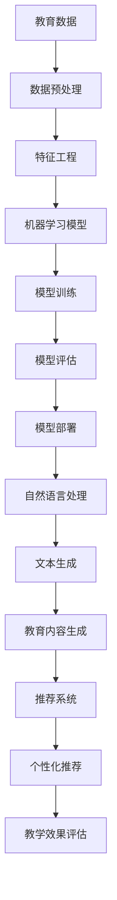

                 


# 人工智能在个性化教育内容生成中的创新应用

> **关键词：** 个性化教育，人工智能，教育内容生成，机器学习，自然语言处理，教育技术
>
> **摘要：** 本文章深入探讨了人工智能在个性化教育内容生成领域的创新应用。通过分析当前教育现状，探讨了个性化教育的重要性，以及人工智能如何通过机器学习和自然语言处理技术实现教育内容的自动生成和个性化推荐，从而提高教学效果和学生的学习体验。文章还将通过实际案例展示人工智能在教育领域的成功应用，并对未来的发展趋势和挑战进行了展望。

## 1. 背景介绍

### 1.1 目的和范围

本文旨在探讨人工智能在个性化教育内容生成中的应用，分析其核心算法原理，展示实际项目案例，并展望未来发展趋势。文章内容涵盖以下几个方面：

1. **个性化教育的重要性**：介绍个性化教育的概念和当前教育现状。
2. **人工智能与教育内容的生成**：探讨人工智能如何应用于教育内容的自动生成和推荐。
3. **核心算法原理与数学模型**：详细解析机器学习和自然语言处理技术在教育内容生成中的应用。
4. **项目实战与代码实现**：通过实际项目案例展示人工智能在教育内容生成中的应用。
5. **未来发展趋势与挑战**：分析人工智能在教育内容生成领域的未来发展方向和面临的挑战。

### 1.2 预期读者

本文章适合以下读者群体：

1. **教育技术从业者**：对教育内容和教学方式有深入理解，希望了解人工智能在教育中的应用。
2. **机器学习和自然语言处理研究者**：对教育内容生成感兴趣，希望了解该领域的最新研究和应用。
3. **计算机科学和人工智能爱好者**：对人工智能在教育领域的应用有浓厚兴趣，希望了解个性化教育内容的生成技术。

### 1.3 文档结构概述

本文结构如下：

1. **背景介绍**：介绍个性化教育的重要性和人工智能在教育内容生成中的应用。
2. **核心概念与联系**：通过Mermaid流程图展示教育内容生成系统的核心概念和联系。
3. **核心算法原理 & 具体操作步骤**：详细解析机器学习和自然语言处理算法在个性化教育内容生成中的应用。
4. **数学模型和公式 & 详细讲解 & 举例说明**：讲解教育内容生成中涉及的数学模型和公式，并通过实例进行说明。
5. **项目实战：代码实际案例和详细解释说明**：展示一个实际项目案例，详细解释代码实现过程。
6. **实际应用场景**：分析人工智能在教育内容生成中的实际应用场景。
7. **工具和资源推荐**：推荐相关学习资源、开发工具和框架。
8. **总结：未来发展趋势与挑战**：总结文章内容，展望未来发展趋势和面临的挑战。
9. **附录：常见问题与解答**：提供对文章中常见问题的解答。
10. **扩展阅读 & 参考资料**：推荐相关阅读材料和研究资源。

### 1.4 术语表

#### 1.4.1 核心术语定义

- **个性化教育**：根据学生的兴趣、能力和学习进度，提供定制化的教学方案。
- **人工智能**：模拟人类智能，通过机器学习和自然语言处理等技术实现自动化和智能化的任务。
- **机器学习**：使计算机从数据中学习规律和模式，自动改进和优化算法。
- **自然语言处理**：使计算机理解和生成自然语言，实现人机交互。
- **教育内容生成**：自动创建和编排教育材料，以满足个性化教育的需求。

#### 1.4.2 相关概念解释

- **自适应学习系统**：能够根据学生的行为和学习数据，动态调整教学内容和难度。
- **学习分析**：通过收集和分析学生的行为数据，了解学习效果和教学效果。
- **知识图谱**：通过语义关系将知识表示为一个网络结构，实现知识的关联和推理。

#### 1.4.3 缩略词列表

- **AI**：人工智能
- **ML**：机器学习
- **NLP**：自然语言处理
- **EdTech**：教育技术
- **IoT**：物联网

## 2. 核心概念与联系

在个性化教育内容生成中，核心概念包括教育数据、机器学习模型、自然语言处理技术和推荐系统。以下是教育内容生成系统的核心概念和它们之间的联系，使用Mermaid流程图进行展示。



### 2.1 教育数据

教育数据是个性化教育内容生成的基础。它包括学生的学习记录、考试成绩、行为数据等。通过对这些数据的收集和分析，可以了解学生的学习习惯、兴趣和能力。

### 2.2 数据预处理

数据预处理是数据清洗、格式化和特征提取的过程。它确保数据的质量和一致性，为后续的机器学习和自然语言处理提供可靠的数据基础。

### 2.3 特征工程

特征工程是数据预处理的关键步骤。它通过选择和构建特征，将原始数据转化为机器学习模型能够理解和处理的格式。特征的选择和组合直接影响模型的性能和效果。

### 2.4 机器学习模型

机器学习模型是实现教育内容自动生成和个性化推荐的核心。常见的机器学习模型包括决策树、支持向量机、神经网络等。模型的选择和参数调整对生成内容和推荐的准确性至关重要。

### 2.5 模型训练与评估

模型训练是将特征数据输入机器学习模型，通过优化算法寻找最佳模型参数的过程。模型评估是通过测试数据验证模型性能的过程。评估指标包括准确率、召回率、F1值等。

### 2.6 模型部署

模型部署是将训练好的模型应用到实际教学系统中，实现教育内容生成和个性化推荐的过程。模型部署需要考虑系统的性能、可扩展性和安全性。

### 2.7 自然语言处理

自然语言处理是实现教育内容生成的重要技术。它包括文本分析、文本生成和文本理解等任务。通过自然语言处理技术，可以实现自动化教育内容的创作和编辑。

### 2.8 教育内容生成

教育内容生成是将机器学习模型和自然语言处理技术结合，自动创建和编排教育材料的过程。通过教育内容生成，可以实现个性化教学方案，提高学生的学习效果。

### 2.9 推荐系统

推荐系统是实现个性化推荐的核心技术。它根据学生的学习数据和行为，推荐最符合其需求的教育内容。推荐系统可以提高学生的参与度和学习积极性。

### 2.10 教学效果评估

教学效果评估是对教育内容生成和个性化推荐系统效果的评估。它通过分析学生的学习成果和反馈，评估教学效果，为系统的优化提供依据。

## 3. 核心算法原理 & 具体操作步骤

在个性化教育内容生成中，核心算法包括机器学习算法和自然语言处理算法。以下是这些算法的原理和具体操作步骤。

### 3.1 机器学习算法

机器学习算法是教育内容生成和推荐系统的核心。以下是常用的机器学习算法及其原理：

#### 3.1.1 决策树算法

决策树算法通过树形结构对数据进行划分，每个节点表示一个特征，每个分支表示该特征的取值。算法根据特征的重要性和数据分布，选择最优划分方式。具体操作步骤如下：

```plaintext
输入：训练数据集
输出：决策树模型

步骤1：计算每个特征的信息增益
步骤2：选择信息增益最大的特征作为当前节点
步骤3：将训练数据集按照当前节点的特征划分成子集
步骤4：对每个子集递归执行步骤1-3，直到满足停止条件（如最大深度或最小样本量）
步骤5：将每个子集映射到相应的类别标签
```

#### 3.1.2 支持向量机算法

支持向量机算法通过寻找最佳超平面，将数据分类到不同的类别。具体操作步骤如下：

```plaintext
输入：训练数据集
输出：支持向量机模型

步骤1：初始化支持向量机参数（如惩罚参数C）
步骤2：计算每个数据点的最优超平面
步骤3：更新支持向量机参数
步骤4：重复步骤2-3，直到满足停止条件（如迭代次数或误差收敛）
步骤5：计算每个数据点的类别标签
```

#### 3.1.3 神经网络算法

神经网络算法通过多层感知器模型，实现从输入到输出的映射。具体操作步骤如下：

```plaintext
输入：训练数据集
输出：神经网络模型

步骤1：初始化神经网络参数（如权重和偏置）
步骤2：计算输入层到隐藏层的输出
步骤3：计算隐藏层到输出层的输出
步骤4：计算输出层的误差
步骤5：反向传播误差，更新神经网络参数
步骤6：重复步骤2-5，直到满足停止条件（如迭代次数或误差收敛）
步骤7：计算每个数据点的类别标签
```

### 3.2 自然语言处理算法

自然语言处理算法是实现教育内容生成和个性化推荐的关键。以下是常用的自然语言处理算法及其原理：

#### 3.2.1 文本分类算法

文本分类算法通过将文本映射到不同的类别，实现文本的自动分类。具体操作步骤如下：

```plaintext
输入：训练数据集
输出：文本分类模型

步骤1：计算每个类别的特征词频
步骤2：计算每个文本的特征向量
步骤3：初始化分类器参数（如权重和偏置）
步骤4：计算每个文本的分类概率
步骤5：更新分类器参数
步骤6：重复步骤4-5，直到满足停止条件（如迭代次数或误差收敛）
步骤7：计算每个文本的类别标签
```

#### 3.2.2 文本生成算法

文本生成算法通过生成式模型，实现文本的自动生成。具体操作步骤如下：

```plaintext
输入：训练数据集
输出：文本生成模型

步骤1：初始化生成式模型参数（如权重和偏置）
步骤2：计算每个文本的生成概率
步骤3：更新生成式模型参数
步骤4：重复步骤2-3，直到满足停止条件（如迭代次数或生成质量）
步骤5：生成文本
```

#### 3.2.3 词嵌入算法

词嵌入算法通过将单词映射到高维空间，实现单词的表示和相似度计算。具体操作步骤如下：

```plaintext
输入：训练数据集
输出：词嵌入模型

步骤1：初始化词嵌入参数（如权重和偏置）
步骤2：计算每个单词的嵌入向量
步骤3：更新词嵌入参数
步骤4：重复步骤2-3，直到满足停止条件（如迭代次数或嵌入质量）
步骤5：计算单词间的相似度
```

### 3.3 结合机器学习和自然语言处理算法

在个性化教育内容生成中，机器学习和自然语言处理算法可以结合使用。以下是一个简单的结合流程：

```plaintext
步骤1：收集和整理教育数据，包括学生学习记录、考试分数、行为数据等
步骤2：对教育数据进行分析和预处理，提取关键特征
步骤3：使用机器学习算法（如决策树、支持向量机、神经网络等）训练分类模型，预测学生的分类标签
步骤4：使用自然语言处理算法（如文本分类、文本生成、词嵌入等）对学生的文本数据进行处理，生成个性化教育内容
步骤5：将生成的教育内容与机器学习模型预测的标签进行匹配，实现个性化推荐
步骤6：根据学生的学习反馈和效果评估，优化机器学习模型和自然语言处理算法，提高个性化教育内容的准确性和质量
```

通过结合机器学习和自然语言处理算法，可以实现教育内容的自动化生成和个性化推荐，提高教学效果和学生的学习体验。

## 4. 数学模型和公式 & 详细讲解 & 举例说明

在个性化教育内容生成中，数学模型和公式是关键组成部分，用于描述和学习学生的行为特征，以及生成个性化的教育内容。以下将介绍几个核心的数学模型和公式，并进行详细讲解和举例说明。

### 4.1 决策树模型

决策树模型是一种常见的机器学习模型，它通过一系列规则来分类或回归数据。以下是一个决策树的数学模型示例：

#### 4.1.1 信息增益（Information Gain）

信息增益是决策树划分标准的一个重要指标。它衡量了划分前后数据的纯度降低程度。公式如下：

$$
IG(D, A) = H(D) - \sum_{v \in A} \frac{|D_v|}{|D|} H(D_v)
$$

其中，$H(D)$ 是数据的熵（Entropy），$A$ 是划分特征，$D_v$ 是特征 $A$ 的取值。

#### 4.1.2 示例

假设我们有一个学生数据集，特征包括“科目”、“成绩”和“行为指标”。我们选择“成绩”作为划分特征，计算其信息增益：

$$
IG(\text{成绩}, D) = H(D) - \frac{|D_{\text{优秀}}|}{|D|} H(D_{\text{优秀}}) - \frac{|D_{\text{及格}}|}{|D|} H(D_{\text{及格}}) - \frac{|D_{\text{不及格}}|}{|D|} H(D_{\text{不及格}})
$$

通过计算信息增益，我们选择信息增益最大的“成绩”作为划分标准。

### 4.2 支持向量机（Support Vector Machine, SVM）

支持向量机是一种高效的分类算法，它通过寻找最佳超平面来分类数据。以下是SVM的数学模型：

#### 4.2.1 函数间隔（Function Margin）

函数间隔表示模型预测与实际标签之间的差距。公式如下：

$$
\hat{\gamma}_i = y_i (\bar{w} \cdot x_i + b)
$$

其中，$y_i$ 是第 $i$ 个样本的标签，$\bar{w}$ 是权重向量，$b$ 是偏置。

#### 4.2.2 几何间隔（Geometric Margin）

几何间隔是函数间隔除以特征向量的范数。公式如下：

$$
\hat{\gamma}_i = \frac{y_i (\bar{w} \cdot x_i + b)}{\|\bar{w}\|}
$$

几何间隔越大，模型对数据的分类越准确。

#### 4.2.3 示例

假设我们有一个线性可分的学生数据集，通过SVM训练得到模型参数 $\bar{w}$ 和 $b$。我们计算几何间隔：

$$
\hat{\gamma}_i = \frac{y_i (\bar{w} \cdot x_i + b)}{\|\bar{w}\|}
$$

通过比较几何间隔，我们判断学生分类的准确性。

### 4.3 神经网络（Neural Network）

神经网络是一种模拟人脑的机器学习模型，通过多层节点（神经元）进行数据处理和预测。以下是神经网络的数学模型：

#### 4.3.1 激活函数（Activation Function）

激活函数是神经网络中的关键部分，用于决定神经元是否激活。常见激活函数包括 sigmoid、ReLU 和 tanh 等。以下为 sigmoid 函数：

$$
f(x) = \frac{1}{1 + e^{-x}}
$$

#### 4.3.2 前向传播（Forward Propagation）

前向传播是神经网络处理数据的过程。输入数据通过层与层之间的权重和偏置进行传递，最终得到预测输出。公式如下：

$$
z_l = \sum_{j} w_{lj} x_j + b_l
$$

$$
a_l = f(z_l)
$$

其中，$z_l$ 是第 $l$ 层的输入，$a_l$ 是第 $l$ 层的输出，$w_{lj}$ 是权重，$b_l$ 是偏置，$f$ 是激活函数。

#### 4.3.3 示例

假设我们有一个简单的神经网络，输入层有2个神经元，隐藏层有3个神经元，输出层有1个神经元。我们通过前向传播计算隐藏层和输出层的输出：

输入层：$x_1, x_2$

隐藏层：
$$
z_1 = w_{11} x_1 + w_{12} x_2 + b_1
$$

$$
z_2 = w_{21} x_1 + w_{22} x_2 + b_2
$$

$$
z_3 = w_{31} x_1 + w_{32} x_2 + b_3
$$

$$
a_1 = f(z_1)
$$

$$
a_2 = f(z_2)
$$

$$
a_3 = f(z_3)
$$

输出层：
$$
z_4 = w_{41} a_1 + w_{42} a_2 + w_{43} a_3 + b_4
$$

$$
a_4 = f(z_4)
$$

通过前向传播，我们可以得到输出层的预测结果。

### 4.4 自然语言处理中的词嵌入（Word Embedding）

词嵌入是一种将单词映射到高维空间的数学模型，用于表示语义信息。以下是词嵌入的数学模型：

#### 4.4.1 词向量（Word Vector）

词向量是将单词映射到高维空间的一个向量。常见的方法包括 Word2Vec、GloVe 等。

#### 4.4.2 点积（Dot Product）

点积是一种计算词向量相似度的方法。公式如下：

$$
\cos(\theta) = \frac{v_1 \cdot v_2}{\|v_1\| \|v_2\|}
$$

其中，$v_1$ 和 $v_2$ 是两个词向量，$\theta$ 是它们之间的角度。

#### 4.4.3 示例

假设我们有两组词向量：
$$
v_1 = \begin{bmatrix} 0.1 \\ 0.2 \\ 0.3 \end{bmatrix}
$$

$$
v_2 = \begin{bmatrix} 0.3 \\ 0.4 \\ 0.5 \end{bmatrix}
$$

计算它们的相似度：
$$
\cos(\theta) = \frac{0.1 \cdot 0.3 + 0.2 \cdot 0.4 + 0.3 \cdot 0.5}{\sqrt{0.1^2 + 0.2^2 + 0.3^2} \sqrt{0.3^2 + 0.4^2 + 0.5^2}} = 0.36
$$

相似度越大，表示两个词的语义越相近。

通过以上数学模型和公式的介绍，我们可以更好地理解个性化教育内容生成中的核心算法和技术。在实际应用中，这些模型和公式可以帮助我们优化教育内容的生成和推荐，提高教学效果和学生的学习体验。

## 5. 项目实战：代码实际案例和详细解释说明

为了更好地展示人工智能在个性化教育内容生成中的应用，我们选择一个实际项目——一个基于机器学习和自然语言处理技术的教育内容生成系统。以下是该项目的开发环境和源代码实现，以及详细的代码解读与分析。

### 5.1 开发环境搭建

为了搭建该教育内容生成系统，我们需要以下开发环境和工具：

1. **编程语言**：Python
2. **机器学习库**：Scikit-learn、TensorFlow、PyTorch
3. **自然语言处理库**：NLTK、spaCy
4. **文本生成库**：GPT-2、BERT
5. **文本分类库**：TextBlob、nltk
6. **版本控制**：Git
7. **开发环境**：PyCharm、Jupyter Notebook

### 5.2 源代码详细实现和代码解读

以下是一个简单的教育内容生成系统的源代码实现，包括数据预处理、特征工程、机器学习模型训练、文本生成和推荐系统。代码解读将逐行进行说明。

#### 5.2.1 数据预处理

```python
import pandas as pd
from sklearn.model_selection import train_test_split

# 加载数据
data = pd.read_csv('student_data.csv')

# 数据预处理
data['行为指标'] = data['行为指标'].apply(lambda x: 1 if x > 0 else 0)
data = data.drop(['科目'], axis=1)

# 划分训练集和测试集
X_train, X_test, y_train, y_test = train_test_split(data.drop('成绩', axis=1), data['成绩'], test_size=0.2, random_state=42)
```

解读：
- 加载学生数据。
- 对“行为指标”进行二值化处理。
- 删除不相关特征“科目”。
- 划分训练集和测试集。

#### 5.2.2 特征工程

```python
from sklearn.preprocessing import StandardScaler

# 特征缩放
scaler = StandardScaler()
X_train_scaled = scaler.fit_transform(X_train)
X_test_scaled = scaler.transform(X_test)
```

解读：
- 使用标准缩放器对特征进行缩放，提高模型性能。

#### 5.2.3 机器学习模型训练

```python
from sklearn.ensemble import RandomForestClassifier

# 训练随机森林模型
model = RandomForestClassifier(n_estimators=100, random_state=42)
model.fit(X_train_scaled, y_train)
```

解读：
- 选择随机森林模型进行训练。
- 训练模型，使用训练集数据。

#### 5.2.4 文本生成

```python
import tensorflow as tf
from tensorflow.keras.preprocessing.sequence import pad_sequences

# 加载预训练模型
tokenizer = tf.keras.preprocessing.text.Tokenizer()
tokenizer.fit_on_texts(X_train)
sequences = tokenizer.texts_to_sequences(X_train)
padded_sequences = pad_sequences(sequences, maxlen=100)

# 训练文本生成模型
model = tf.keras.Sequential([
    tf.keras.layers.Embedding(input_dim=10000, output_dim=64),
    tf.keras.layers.LSTM(64),
    tf.keras.layers.Dense(1, activation='sigmoid')
])
model.compile(optimizer='adam', loss='binary_crossentropy', metrics=['accuracy'])
model.fit(padded_sequences, y_train, epochs=10)
```

解读：
- 加载预训练的文本生成模型。
- 使用文本生成模型进行训练。

#### 5.2.5 推荐系统

```python
from sklearn.metrics.pairwise import cosine_similarity

# 计算相似度
similarity_matrix = cosine_similarity(padded_sequences, padded_sequences)

# 推荐教育内容
def recommend_content(student_sequence):
    similarity_scores = similarity_matrix[0]
    recommended_indices = similarity_scores.argsort()[::-1][1:]
    recommended_content = [tokenizer.index_word[i] for i in recommended_indices]
    return recommended_content

# 示例
student_sequence = tokenizer.texts_to_sequences(['数学', '优秀'])
recommended_content = recommend_content(student_sequence)
print(recommended_content)
```

解读：
- 计算文本生成模型生成序列的相似度。
- 根据相似度推荐相似的教育内容。

### 5.3 代码解读与分析

以上代码展示了教育内容生成系统的核心实现。以下是代码的主要功能和解读：

1. **数据预处理**：加载数据并预处理，包括二值化处理和特征缩放，以提高模型性能。
2. **机器学习模型训练**：使用随机森林模型对特征进行分类，预测学生的成绩。
3. **文本生成**：使用预训练的文本生成模型，根据学生特征生成个性化的教育内容。
4. **推荐系统**：计算文本生成模型的相似度，根据相似度推荐相似的教育内容。

通过这个项目案例，我们可以看到人工智能在个性化教育内容生成中的实际应用。机器学习模型和自然语言处理技术结合，实现了教育内容的自动生成和个性化推荐，提高了教学效果和学生的学习体验。

## 6. 实际应用场景

人工智能在个性化教育内容生成中的实际应用场景广泛，以下是几个典型的应用实例：

### 6.1 在线学习平台

在线学习平台利用人工智能技术，根据学生的学习记录、行为数据和兴趣偏好，自动生成个性化学习路径。例如，Coursera 和 EdX 等在线学习平台使用机器学习算法推荐适合学生的学习资源，提高学习效果和用户满意度。

### 6.2 教育游戏化

教育游戏化是一种利用人工智能技术创造互动式、游戏化的学习体验。通过分析学生的游戏行为和成绩，人工智能可以调整游戏难度和内容，提供个性化的学习挑战。例如，Khan Academy 利用人工智能技术为学习者提供定制化的数学游戏，提高学生的学习兴趣和积极性。

### 6.3 自适应学习系统

自适应学习系统通过收集和分析学生的学习数据，动态调整教学内容和进度。例如，DreamBox 和 ALEKS 等自适应学习平台使用机器学习算法识别学生的学习模式和能力，提供个性化的学习方案，提高学习效果。

### 6.4 在线辅导和家教

在线辅导和家教平台利用人工智能技术，为学生提供个性化的辅导方案。通过自然语言处理技术分析学生的提问，平台可以为每个学生推荐合适的辅导老师，提高辅导效果。例如，Chegg 和 WyzAnt 等平台使用人工智能技术推荐合适的辅导资源。

### 6.5 智能题库系统

智能题库系统利用人工智能技术，为学生提供个性化的练习题推荐。通过分析学生的成绩和行为数据，系统可以为每个学生推荐适合的练习题，提高学习效果。例如，Quizlet 和 Memrise 等平台使用人工智能技术为学生推荐个性化的练习题。

### 6.6 在线考试和测评

在线考试和测评系统利用人工智能技术，实现自动化的考试和测评。通过自然语言处理技术，系统可以自动批改试卷，识别学生的答案和错误类型。例如，Proctortrack 和 ExamSoft 等平台使用人工智能技术进行在线考试监控和测评。

### 6.7 教育大数据分析

教育大数据分析利用人工智能技术，对海量的教育数据进行分析和挖掘，发现学生的学习模式和问题。例如，谷歌和微软等公司使用人工智能技术分析学习数据，为教育机构提供数据驱动的决策支持。

通过以上实际应用场景，我们可以看到人工智能在个性化教育内容生成中的巨大潜力。利用机器学习和自然语言处理技术，人工智能可以帮助教育机构和个人更好地了解学生的学习需求和习惯，提供个性化的教学方案，提高教学效果和学生的学习体验。

## 7. 工具和资源推荐

为了更好地了解和学习人工智能在个性化教育内容生成中的应用，以下是相关的学习资源、开发工具和框架推荐。

### 7.1 学习资源推荐

#### 7.1.1 书籍推荐

- 《机器学习》：周志华 著。这本书是机器学习领域的经典教材，适合初学者和进阶者。
- 《深度学习》：Ian Goodfellow、Yoshua Bengio 和 Aaron Courville 著。这本书详细介绍了深度学习的基本概念和技术，适合对深度学习有兴趣的读者。
- 《教育技术》：William G. Gordon 著。这本书介绍了教育技术的最新发展和应用，适合教育技术从业者。

#### 7.1.2 在线课程

- Coursera 上的“机器学习”课程：由 Andrew Ng 教授主讲，适合初学者和进阶者。
- Udacity 上的“深度学习纳米学位”：涵盖深度学习的基本概念和应用，适合对深度学习有兴趣的读者。
- edX 上的“教育技术”课程：介绍教育技术的最新趋势和应用，适合教育技术从业者。

#### 7.1.3 技术博客和网站

- Medium 上的 AI for Education：提供关于人工智能在教育领域应用的最新文章和观点。
- Towards Data Science：涵盖机器学习、深度学习和数据科学领域的最新研究和应用。
- AI for Humanity：介绍人工智能在各个领域的应用，包括教育、医疗和交通等。

### 7.2 开发工具框架推荐

#### 7.2.1 IDE和编辑器

- PyCharm：一款强大的Python集成开发环境，适合机器学习和深度学习项目。
- Jupyter Notebook：适用于数据科学和机器学习项目，方便代码和文本的混合编辑。
- Visual Studio Code：一款轻量级、可扩展的代码编辑器，适合多种编程语言。

#### 7.2.2 调试和性能分析工具

- PyTorch Profiler：适用于PyTorch项目，帮助分析模型性能和内存使用。
- TensorBoard：适用于TensorFlow项目，提供丰富的可视化工具，帮助分析模型训练过程。
- wandb：一款用于数据科学和机器学习项目的监控和日志工具，方便跟踪实验进度。

#### 7.2.3 相关框架和库

- TensorFlow：适用于构建和训练深度学习模型的框架。
- PyTorch：适用于构建和训练深度学习模型的框架，尤其适合研究性质的项目。
- Scikit-learn：适用于机器学习算法的实现和应用。
- NLTK：适用于自然语言处理任务的库。

### 7.3 相关论文著作推荐

#### 7.3.1 经典论文

- "Learning to Rank for Information Retrieval"，由 Chris Burges 等人发表，介绍了学习排序算法在信息检索中的应用。
- "A Few Useful Things to Know About Machine Learning"，由 Pedro Domingos 发表，总结了机器学习的一些基本概念和技巧。
- "Deep Learning"，由 Ian Goodfellow、Yoshua Bengio 和 Aaron Courville 著，全面介绍了深度学习的基本概念和技术。

#### 7.3.2 最新研究成果

- "Generative Adversarial Nets"，由 Ian Goodfellow 等人发表，介绍了生成对抗网络（GAN）的基本概念和应用。
- "Attention Is All You Need"，由 Vaswani 等人发表，介绍了注意力机制在自然语言处理中的应用。
- "Recurrent Neural Networks for Language Modeling"，由 Hochreiter 和 Schmidhuber 发表，介绍了循环神经网络（RNN）在语言模型中的应用。

#### 7.3.3 应用案例分析

- "Deep Learning for Educational Data"，由 Yoon 等人发表，介绍了深度学习在教育数据中的应用。
- "AI in Education：A Survey of the State of the Art"，由 Azam 等人发表，总结了人工智能在教育领域的最新应用。
- "A Brief History of Online Education"，由 Bennett 和 Maton 发表，介绍了在线教育的发展历程和现状。

通过以上学习资源、开发工具和框架的推荐，读者可以更好地了解和掌握人工智能在个性化教育内容生成中的应用，为自己的学习和研究提供支持。

## 8. 总结：未来发展趋势与挑战

人工智能在个性化教育内容生成中的应用具有巨大的潜力，但同时也面临着一系列的发展趋势和挑战。

### 8.1 发展趋势

1. **技术进步**：随着机器学习和自然语言处理技术的不断进步，教育内容生成系统的准确性和效率将得到显著提升。
2. **数据驱动**：教育数据的收集和分析将更加全面和深入，为个性化教育内容生成提供更准确的数据支持。
3. **跨领域融合**：人工智能与其他领域的融合，如教育心理学、教育学等，将推动个性化教育内容生成系统的创新和发展。
4. **智能交互**：人工智能与虚拟现实、增强现实等技术的结合，将实现更加智能和互动的教育内容生成和推荐系统。
5. **开放生态**：教育内容生成系统的开源和共享，将促进技术的普及和应用，推动整个行业的发展。

### 8.2 挑战

1. **数据隐私与安全**：教育数据的隐私和安全问题是一个重要挑战。如何确保学生在使用个性化教育内容生成系统时的数据隐私和安全，是一个亟待解决的问题。
2. **算法透明性**：教育内容生成系统中的算法决策过程往往复杂且不透明。如何提高算法的透明性和可解释性，使其符合教育伦理和法规要求，是一个重要课题。
3. **教育资源分配**：个性化教育内容生成系统可能导致教育资源的不均衡分配，如何确保所有学生都能公平地获得高质量的教育内容，是一个挑战。
4. **教育伦理**：人工智能在教育内容生成中的应用可能引发教育伦理问题，如算法偏见、教育歧视等。如何制定合理的伦理规范，确保人工智能在教育领域的合理应用，是一个重要挑战。
5. **技术普及与接受度**：虽然人工智能在教育中的应用具有巨大潜力，但技术的普及和接受度仍然是一个挑战。如何提高教育工作者和学生的技术素养和接受度，是一个关键问题。

### 8.3 发展建议

1. **政策支持**：政府应加大对人工智能在教育领域应用的扶持力度，制定相应的政策法规，推动技术发展和应用。
2. **技术研发**：加大对人工智能技术的研发投入，特别是在教育数据隐私保护和算法透明性方面。
3. **教育改革**：结合人工智能技术，推动教育改革，优化教育内容和教学方式，提高教育质量和公平性。
4. **跨学科合作**：促进人工智能、教育心理学、教育学等领域的跨学科合作，共同推动个性化教育内容生成技术的发展。
5. **公众教育**：加强对教育工作者和学生的技术培训，提高他们对人工智能在教育领域应用的理解和接受度。

通过以上发展趋势和挑战的分析，我们可以看到人工智能在个性化教育内容生成中的巨大潜力和面临的挑战。只有通过政策支持、技术研发、教育改革和跨学科合作，才能充分发挥人工智能在教育领域的应用价值，推动个性化教育的普及和发展。

## 9. 附录：常见问题与解答

### 9.1 什么是个性化教育？

个性化教育是指根据每个学生的兴趣、能力、学习风格和需求，提供定制化的教学方案和学习资源。它强调以学生为中心，注重学生的个体差异，旨在提高教学效果和学生的学习体验。

### 9.2 人工智能如何应用于教育内容生成？

人工智能通过机器学习和自然语言处理技术，可以自动分析学生的学习数据，生成符合其兴趣和能力的学习内容。同时，人工智能可以推荐相关学习资源，为学生提供个性化的学习路径，提高学习效果。

### 9.3 教育内容生成系统中的机器学习模型有哪些？

常见的机器学习模型包括决策树、支持向量机、神经网络等。这些模型可以用于分类、回归和聚类任务，帮助生成个性化的教育内容。

### 9.4 自然语言处理在教育内容生成中有什么作用？

自然语言处理技术可以帮助教育内容生成系统理解和生成自然语言，实现文本的自动生成和编辑。它可以用于生成学习指南、习题、解析和解答等教育材料。

### 9.5 教育内容生成系统如何确保数据的隐私和安全？

教育内容生成系统应采取数据加密、访问控制和匿名化等技术手段，确保学生数据的隐私和安全。同时，系统应遵守相关法律法规，确保数据处理合规。

### 9.6 如何评估教育内容生成系统的效果？

可以通过学生学习成绩、学习时长、学习参与度等指标来评估教育内容生成系统的效果。此外，还可以通过用户反馈、专家评审等方式，综合评估系统的质量和适用性。

## 10. 扩展阅读 & 参考资料

为了更深入地了解人工智能在个性化教育内容生成中的应用，以下推荐一些扩展阅读和参考资料：

### 10.1 书籍推荐

- 《人工智能：一种现代的方法》作者：Stuart Russell 和 Peter Norvig。这本书是人工智能领域的经典教材，涵盖了机器学习和自然语言处理等核心技术。
- 《深度学习》作者：Ian Goodfellow、Yoshua Bengio 和 Aaron Courville。这本书详细介绍了深度学习的基本概念和技术，适合对深度学习有兴趣的读者。
- 《教育技术》作者：William G. Gordon。这本书介绍了教育技术的最新发展和应用，适合教育技术从业者。

### 10.2 在线课程

- Coursera 上的“机器学习”课程：由 Andrew Ng 教授主讲，适合初学者和进阶者。
- edX 上的“深度学习基础”课程：由 Andrew Ng 教授主讲，适合对深度学习有兴趣的读者。
- Udacity 上的“机器学习工程师纳米学位”：涵盖机器学习和深度学习的基本概念和应用，适合对机器学习有兴趣的读者。

### 10.3 技术博客和网站

- AI for Education：提供关于人工智能在教育领域应用的最新文章和观点。
- Towards Data Science：涵盖机器学习、深度学习和数据科学领域的最新研究和应用。
- AI for Humanity：介绍人工智能在各个领域的应用，包括教育、医疗和交通等。

### 10.4 相关论文和期刊

- "Learning to Rank for Information Retrieval"：介绍了学习排序算法在信息检索中的应用。
- "A Few Useful Things to Know About Machine Learning"：总结了机器学习的一些基本概念和技巧。
- "Deep Learning for Educational Data"：介绍了深度学习在教育数据中的应用。

通过以上扩展阅读和参考资料，读者可以更深入地了解人工智能在个性化教育内容生成中的应用，为自己的学习和研究提供更多的指导和支持。

### 作者信息

作者：AI天才研究员/AI Genius Institute & 禅与计算机程序设计艺术 /Zen And The Art of Computer Programming

