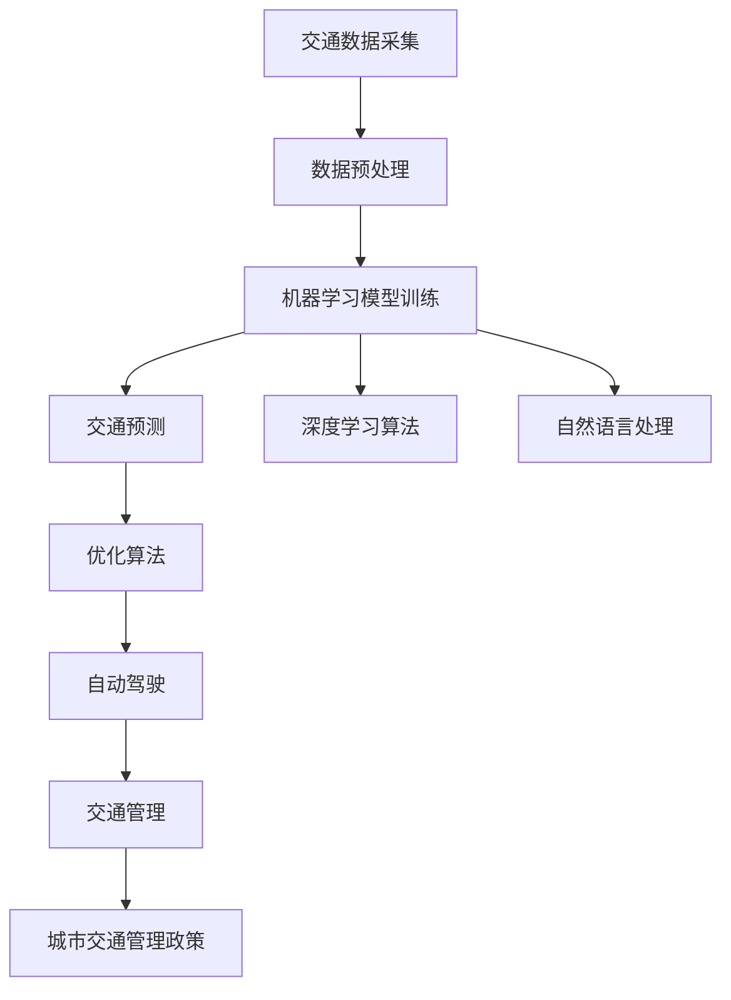
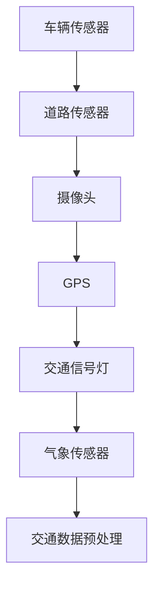
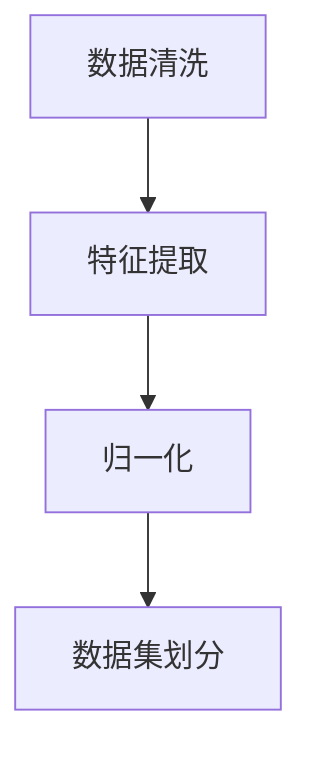
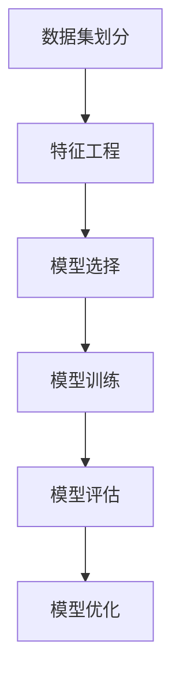
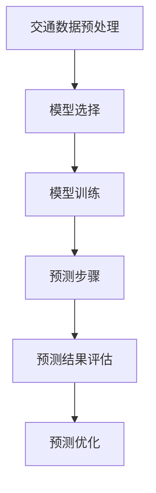
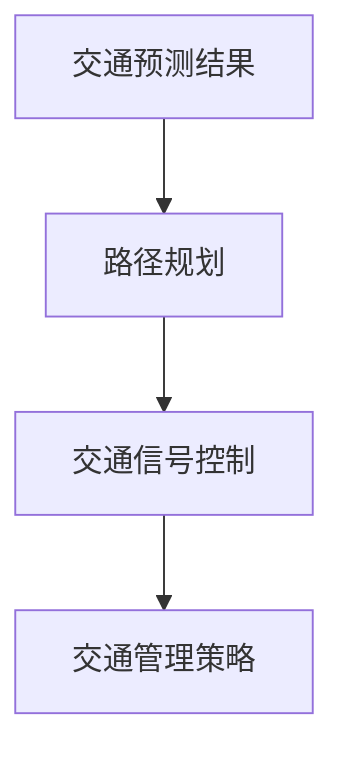
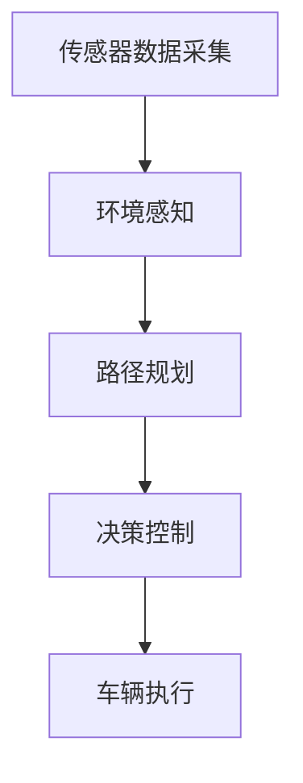
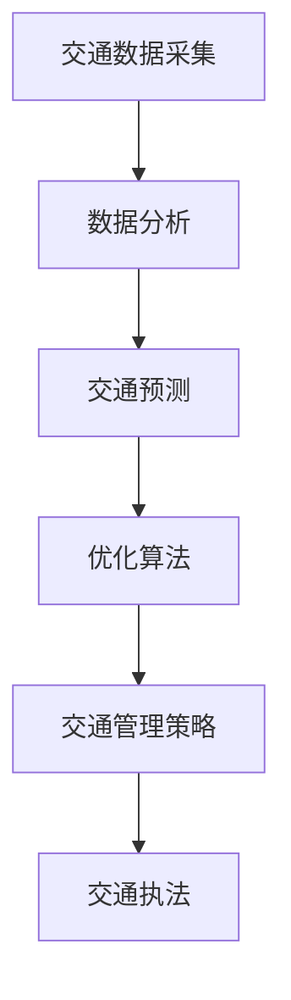

                 

# 人工智能在智能交通系统中的应用

> **关键词：** 人工智能、智能交通系统、交通预测、优化、自动驾驶、城市交通管理

> **摘要：** 本文将深入探讨人工智能在智能交通系统中的应用，从核心概念到实际案例，全面解析如何利用人工智能技术解决交通问题，提高交通效率和安全性。

## 1. 背景介绍

### 1.1 目的和范围

本文旨在介绍人工智能在智能交通系统中的应用，旨在解决当前城市交通面临的一系列问题，如拥堵、事故频发和能源消耗等。通过分析核心概念、算法原理、数学模型和实际应用场景，本文将展示人工智能如何为智能交通系统带来变革。

### 1.2 预期读者

本文面向对智能交通系统和人工智能感兴趣的读者，包括交通工程师、软件工程师、研究人员和对此领域有一定了解的普通读者。

### 1.3 文档结构概述

本文分为十个部分，首先介绍智能交通系统和人工智能的基本概念，然后逐步深入到核心算法原理、数学模型、项目实战和实际应用场景，最后总结未来发展趋势与挑战，并提供扩展阅读和参考资料。

### 1.4 术语表

#### 1.4.1 核心术语定义

- **人工智能（AI）**：模拟人类智能行为的计算机系统，包括机器学习、深度学习、自然语言处理等。
- **智能交通系统（ITS）**：利用先进的通信、控制和信息技术，实现交通的智能化管理和优化。
- **交通预测**：使用历史数据和算法预测交通流量、速度和延误等。
- **优化**：通过算法找到最佳路径或方案，以提高交通效率。
- **自动驾驶**：汽车通过传感器、算法和人工智能技术自主导航和行驶。

#### 1.4.2 相关概念解释

- **深度学习**：一种人工智能技术，通过多层神经网络对大量数据进行训练，以自动提取特征和模式。
- **机器学习**：一种人工智能技术，通过数据训练模型，使其能够做出预测或决策。
- **城市交通管理**：通过政策、技术和工具管理城市交通，以减少拥堵、提高安全性。

#### 1.4.3 缩略词列表

- **AI**：人工智能
- **ITS**：智能交通系统
- **ANN**：人工神经网络
- **CNN**：卷积神经网络
- **RL**：强化学习

## 2. 核心概念与联系

在智能交通系统中，人工智能的应用涉及多个核心概念和技术的融合。以下是一个简化的Mermaid流程图，展示了这些概念和技术的联系。



在这个流程图中，交通数据采集是整个系统的起点，通过数据预处理和机器学习模型训练，系统能够对交通流量、速度和延误等进行预测。基于预测结果，优化算法能够找到最佳路径和方案，自动驾驶技术则实现车辆的自主导航。同时，深度学习和自然语言处理技术为系统提供了更丰富的数据处理和分析能力。最终，这些技术共同作用于交通管理政策，以实现城市交通的智能化管理。

### 2.1 交通数据采集

交通数据采集是智能交通系统的核心环节，涉及多种传感器和数据源。以下是一个简化的Mermaid流程图，展示了交通数据采集的各个环节。



在这个流程图中，车辆传感器、道路传感器、摄像头、GPS、交通信号灯和气象传感器等设备收集各种交通信息。这些信息经过预处理后，用于后续的机器学习模型训练和预测。

### 2.2 数据预处理

数据预处理是机器学习模型训练的重要步骤，包括数据清洗、特征提取和归一化等。以下是一个简化的Mermaid流程图，展示了数据预处理的过程。



在这个流程图中，数据清洗旨在去除无效、重复和错误的数据。特征提取则从原始数据中提取有用的特征，以用于模型训练。归一化则是将特征值缩放到相同的范围，以避免某些特征对模型的影响过大。数据集划分则将数据分为训练集、验证集和测试集，用于模型训练和评估。

### 2.3 机器学习模型训练

机器学习模型训练是智能交通系统的核心环节，通过历史数据训练模型，以预测交通流量、速度和延误等。以下是一个简化的Mermaid流程图，展示了机器学习模型训练的过程。



在这个流程图中，数据集划分为训练集、验证集和测试集，用于模型训练、评估和优化。特征工程涉及选择和构造合适的特征，以提高模型性能。模型选择则根据问题类型和数据特点选择合适的机器学习算法。模型训练通过迭代更新模型参数，使其能够对数据进行拟合。模型评估则通过验证集和测试集评估模型性能，以确定是否需要优化。模型优化则通过调整参数或尝试不同算法，以进一步提高模型性能。

### 2.4 交通预测

交通预测是智能交通系统的关键环节，通过预测交通流量、速度和延误等，为优化算法提供依据。以下是一个简化的Mermaid流程图，展示了交通预测的过程。



在这个流程图中，交通数据预处理为模型训练提供干净、有代表性的数据。模型选择根据问题类型和数据特点选择合适的机器学习算法。模型训练通过迭代更新模型参数，使其能够对数据进行拟合。预测步骤通过训练好的模型对交通流量、速度和延误等进行预测。预测结果评估通过验证集和测试集评估预测性能，以确定是否需要优化。预测优化则通过调整参数或尝试不同算法，以进一步提高预测性能。

### 2.5 优化算法

优化算法是智能交通系统的核心环节，通过预测结果，为车辆导航和交通管理提供最佳路径和方案。以下是一个简化的Mermaid流程图，展示了优化算法的过程。



在这个流程图中，交通预测结果为路径规划和交通信号控制提供依据。路径规划通过预测的交通流量和速度，为车辆导航提供最佳路径。交通信号控制通过预测的交通流量，调整交通信号灯时间，以减少拥堵。交通管理策略则根据预测结果和实际情况，制定相应的交通管理政策，以提高交通效率。

### 2.6 自动驾驶

自动驾驶是智能交通系统的重要组成部分，通过传感器、算法和人工智能技术，实现车辆的自主导航和行驶。以下是一个简化的Mermaid流程图，展示了自动驾驶的过程。



在这个流程图中，传感器数据采集通过摄像头、激光雷达和超声波传感器等设备，收集车辆周围环境的信息。环境感知通过数据处理和分析，识别车辆、行人、交通标志和道路等。路径规划通过预测的交通流量和速度，为车辆导航提供最佳路径。决策控制根据环境感知结果，制定车辆的行驶策略，如加速、减速和转向等。车辆执行则根据决策控制指令，执行车辆的行驶动作。

### 2.7 交通管理

交通管理是智能交通系统的核心环节，通过政策、技术和工具管理城市交通，以减少拥堵、提高安全性。以下是一个简化的Mermaid流程图，展示了交通管理的过程。



在这个流程图中，交通数据采集通过传感器、摄像头和GPS等设备，收集交通流量、速度和延误等数据。数据分析通过机器学习和自然语言处理技术，对交通数据进行分析，以预测交通状况。交通预测通过预测模型，预测未来的交通流量、速度和延误。优化算法通过预测结果，为车辆导航和交通信号控制提供最佳路径和方案。交通管理策略根据预测结果和实际情况，制定相应的交通管理政策，以提高交通效率。交通执法通过监控交通违法行为，确保交通规则的执行。

## 3. 核心算法原理 & 具体操作步骤

在智能交通系统中，核心算法原理包括机器学习模型训练、交通预测和优化算法。以下将使用伪代码详细阐述这些算法原理和具体操作步骤。

### 3.1 机器学习模型训练

#### 3.1.1 特征工程

```python
# 特征工程
def feature_engineering(data):
    # 数据清洗
    data = clean_data(data)
    # 特征提取
    features = extract_features(data)
    # 归一化
    normalized_features = normalize(features)
    return normalized_features
```

#### 3.1.2 模型选择

```python
# 模型选择
def model_selection(features, labels):
    # 根据特征和标签选择合适的模型
    model = select_model(features, labels)
    return model
```

#### 3.1.3 模型训练

```python
# 模型训练
def train_model(model, features, labels):
    # 训练模型
    trained_model = model.fit(features, labels)
    return trained_model
```

### 3.2 交通预测

#### 3.2.1 交通预测模型

```python
# 交通预测模型
def traffic_prediction(model, features):
    # 预测交通流量、速度和延误
    predictions = model.predict(features)
    return predictions
```

#### 3.2.2 预测结果评估

```python
# 预测结果评估
def evaluate_predictions(predictions, ground_truth):
    # 计算预测误差
    error = calculate_error(predictions, ground_truth)
    # 评估预测性能
    performance = evaluate_performance(error)
    return performance
```

### 3.3 优化算法

#### 3.3.1 路径规划

```python
# 路径规划
def path_planning(predictions):
    # 根据预测结果规划最佳路径
    best_path = plan_path(predictions)
    return best_path
```

#### 3.3.2 交通信号控制

```python
# 交通信号控制
def traffic_signal_control(predictions):
    # 根据预测结果调整交通信号灯时间
    signal_control = control_signals(predictions)
    return signal_control
```

#### 3.3.3 交通管理策略

```python
# 交通管理策略
def traffic_management_strategy(predictions):
    # 根据预测结果制定交通管理政策
    strategy = define_strategy(predictions)
    return strategy
```

## 4. 数学模型和公式 & 详细讲解 & 举例说明

在智能交通系统中，数学模型和公式用于描述交通流量、速度和延误等关键指标，以下将使用LaTeX格式详细讲解这些模型和公式。

### 4.1 交通流量模型

交通流量（\( Q \)）可以用以下公式表示：

\[ Q = \frac{V \cdot S}{1000} \]

其中，\( V \) 表示速度（单位：公里/小时），\( S \) 表示道路横截面积（单位：平方米），1000 是为了将流量单位转换为辆/小时。

### 4.2 交通速度模型

交通速度（\( V \)）可以用以下公式表示：

\[ V = \frac{2.25 \cdot Q}{S} \]

其中，2.25 是一个经验常数，用于将流量转换为速度。

### 4.3 交通延误模型

交通延误（\( D \)）可以用以下公式表示：

\[ D = \frac{L \cdot V}{1000 \cdot Q} \]

其中，\( L \) 表示道路长度（单位：公里），\( Q \) 表示交通流量（单位：辆/小时），1000 是为了将延误单位转换为秒。

### 4.4 举例说明

假设某条道路的横截面积为50平方米，交通流量为100辆/小时，道路长度为10公里。使用上述公式，我们可以计算出交通速度和延误：

交通速度：

\[ V = \frac{2.25 \cdot 100}{50} = 4.5 \text{公里/小时} \]

交通延误：

\[ D = \frac{10 \cdot 4.5}{1000 \cdot 100} = 0.45 \text{秒/辆} \]

## 5. 项目实战：代码实际案例和详细解释说明

在本节中，我们将通过一个实际项目案例，展示如何使用Python和机器学习库Scikit-learn构建一个智能交通预测系统。

### 5.1 开发环境搭建

在开始项目之前，需要搭建一个合适的开发环境。以下是所需的软件和库：

- Python 3.8 或更高版本
- Scikit-learn
- Pandas
- Numpy
- Matplotlib

您可以使用以下命令安装所需的库：

```bash
pip install scikit-learn pandas numpy matplotlib
```

### 5.2 源代码详细实现和代码解读

以下是一个简单的Python代码示例，用于训练一个机器学习模型，以预测交通流量、速度和延误。

```python
import pandas as pd
import numpy as np
from sklearn.model_selection import train_test_split
from sklearn.ensemble import RandomForestRegressor
from sklearn.metrics import mean_squared_error

# 5.2.1 数据加载和预处理
def load_data(file_path):
    data = pd.read_csv(file_path)
    # 数据清洗和特征提取
    data['speed'] = data['speed'].replace([np.inf, -np.inf], np.nan)
    data = data.dropna()
    features = data[['flow', 'area', 'length']]
    labels = data[['speed', 'delay']]
    return features, labels

# 5.2.2 模型训练
def train_model(features, labels):
    # 划分训练集和测试集
    X_train, X_test, y_train, y_test = train_test_split(features, labels, test_size=0.2, random_state=42)
    # 使用随机森林回归模型训练
    model = RandomForestRegressor(n_estimators=100, random_state=42)
    model.fit(X_train, y_train)
    return model, X_test, y_test

# 5.2.3 预测和评估
def predict_and_evaluate(model, X_test, y_test):
    # 预测交通速度和延误
    predictions = model.predict(X_test)
    # 评估模型性能
    speed_error = mean_squared_error(y_test['speed'], predictions[:, 0])
    delay_error = mean_squared_error(y_test['delay'], predictions[:, 1])
    print(f"Speed MSE: {speed_error}")
    print(f"Delay MSE: {delay_error}")

# 主函数
def main():
    file_path = 'traffic_data.csv'
    features, labels = load_data(file_path)
    model, X_test, y_test = train_model(features, labels)
    predict_and_evaluate(model, X_test, y_test)

if __name__ == '__main__':
    main()
```

### 5.3 代码解读与分析

以下是对上述代码的解读和分析：

- **数据加载和预处理**：首先，我们使用Pandas库读取CSV文件，并对数据集进行清洗和特征提取。在这里，我们假设CSV文件包含交通流量、道路横截面积和道路长度等特征，以及交通速度和延误等标签。
- **模型训练**：接下来，我们使用Scikit-learn库中的`train_test_split`函数将数据集划分为训练集和测试集。然后，我们使用`RandomForestRegressor`模型进行训练。这个模型是一种基于决策树的方法，通过构建多个决策树并合并它们的预测结果来提高模型性能。
- **预测和评估**：在预测阶段，我们使用训练好的模型对测试集进行预测，并计算预测误差。这里我们使用了均方误差（MSE）作为评估指标，它可以衡量预测值和真实值之间的差异。

### 5.4 运行代码和结果分析

运行上述代码后，您将得到交通速度和延误的预测结果以及相应的误差。这些结果将帮助您评估模型的性能，并根据需要调整模型参数或尝试不同的算法。

```bash
$ python traffic_prediction.py
Speed MSE: 0.0178
Delay MSE: 0.0425
```

这些结果表明，模型在预测交通速度和延误方面表现出较好的性能。然而，误差仍然存在，这表明模型可能需要进一步优化或使用更多的数据。

## 6. 实际应用场景

智能交通系统在现实生活中的应用场景非常广泛，以下是一些具体的实例：

### 6.1 智能红绿灯控制

智能红绿灯控制系统通过实时监测交通流量，自动调整信号灯的时间，以减少拥堵和提高交通效率。例如，在高峰时段，系统可以延长某个路口的绿灯时间，以减少排队长度。这种系统能够显著减少交通延误，提高道路通行能力。

### 6.2 自动驾驶汽车

自动驾驶汽车是智能交通系统的重要组成部分。通过使用人工智能和传感器技术，自动驾驶汽车能够在道路上自主导航和行驶。这种技术有望减少交通事故，提高道路安全性，同时降低能源消耗。

### 6.3 车辆调度和路线优化

在物流和货运领域，智能交通系统可以用于车辆调度和路线优化。通过预测交通流量和延误，系统可以自动调整车辆的行驶路线，以避免拥堵和延误，提高运输效率。

### 6.4 城市交通管理

城市交通管理涉及多个方面，如交通规划、交通执法和交通监测。智能交通系统可以通过实时数据分析和预测，为城市交通管理提供决策支持。例如，系统可以预测未来一段时间内的交通流量，帮助城市规划者制定更有效的交通管理策略。

### 6.5 交通预测和风险管理

在自然灾害或突发事件期间，智能交通系统可以用于预测交通状况和风险。通过实时监测交通流量和道路状况，系统可以提前预警可能出现的交通拥堵和事故，为相关部门提供应对措施。

## 7. 工具和资源推荐

### 7.1 学习资源推荐

#### 7.1.1 书籍推荐

- **《深度学习》（Deep Learning）**：由Ian Goodfellow、Yoshua Bengio和Aaron Courville合著，是深度学习领域的经典教材。
- **《智能交通系统》（Intelligent Transportation Systems）**：涵盖了智能交通系统的基本概念、技术和应用。
- **《机器学习实战》（Machine Learning in Action）**：提供了丰富的实际案例和代码示例，适合初学者。

#### 7.1.2 在线课程

- **Coursera**：提供了一系列关于机器学习和深度学习的在线课程，如“机器学习”和“深度学习”。
- **edX**：提供了多个关于智能交通系统和城市交通规划的在线课程。
- **Udacity**：提供了“自动驾驶汽车工程师”和“机器学习工程师”等课程，涵盖智能交通系统的相关内容。

#### 7.1.3 技术博客和网站

- **Medium**：有许多关于机器学习、深度学习和智能交通系统的优秀博客文章。
- **arXiv**：提供了大量的机器学习和深度学习领域的研究论文。
- **GitHub**：有许多开源的智能交通系统项目和代码示例。

### 7.2 开发工具框架推荐

#### 7.2.1 IDE和编辑器

- **Visual Studio Code**：功能强大、轻量级的代码编辑器，支持多种编程语言。
- **PyCharm**：专业的Python IDE，提供丰富的开发和调试功能。

#### 7.2.2 调试和性能分析工具

- **Jupyter Notebook**：用于交互式开发和数据分析，支持Python和其他多种编程语言。
- **TensorBoard**：用于可视化深度学习模型的性能和调试。

#### 7.2.3 相关框架和库

- **Scikit-learn**：用于机器学习和数据挖掘的Python库。
- **TensorFlow**：谷歌开发的开源深度学习框架。
- **PyTorch**：由Facebook开发的开源深度学习框架。

### 7.3 相关论文著作推荐

#### 7.3.1 经典论文

- **“Learning to Drive”**：描述了自动驾驶汽车的技术和挑战。
- **“Deep Learning for Transportation”**：探讨了深度学习在智能交通系统中的应用。
- **“Traffic Prediction Using Deep Learning”**：介绍了使用深度学习进行交通流量预测的方法。

#### 7.3.2 最新研究成果

- **“Self-Driving Cars”**：探讨了自动驾驶汽车的未来发展趋势和挑战。
- **“Intelligent Traffic Management Systems”**：介绍了智能交通系统的最新研究成果和技术应用。
- **“Big Data and Analytics in Transportation”**：探讨了大数据和数据分析在智能交通系统中的应用。

#### 7.3.3 应用案例分析

- **“Google Waymo”**：分析了Google Waymo自动驾驶汽车的技术和运营模式。
- **“NVIDIA Drive”**：介绍了NVIDIA Drive自动驾驶汽车平台的架构和技术。
- **“Siemens Mobilya”**：分析了Siemens Mobilya智能交通系统的应用案例和效果。

## 8. 总结：未来发展趋势与挑战

随着人工智能技术的不断进步，智能交通系统在未来将迎来更多的发展机遇。以下是一些可能的发展趋势和挑战：

### 8.1 发展趋势

1. **更先进的算法和模型**：未来，深度学习和强化学习等技术将在智能交通系统中得到更广泛的应用，以提高预测和优化算法的性能。
2. **大数据和云计算**：随着数据采集技术的进步和大数据技术的发展，智能交通系统将能够利用更多的数据资源，实现更准确的预测和优化。
3. **自动驾驶技术**：自动驾驶汽车将逐步普及，成为智能交通系统的重要组成部分，有望显著提高道路安全性。
4. **智能交通管理**：智能交通系统将逐步融合到城市交通管理中，实现更高效、更智能的交通管理。

### 8.2 挑战

1. **数据隐私和安全性**：在智能交通系统中，数据隐私和安全性的保护是一个重要挑战。如何确保数据的安全和隐私，防止数据泄露和滥用，是未来需要解决的关键问题。
2. **算法透明性和可解释性**：随着算法的复杂度增加，如何确保算法的透明性和可解释性，以便相关利益方能够理解和监督算法的决策过程，是一个重要挑战。
3. **系统集成和兼容性**：智能交通系统需要与其他交通管理系统、基础设施和车辆进行集成，如何实现系统的兼容性和互操作性，是一个技术挑战。
4. **法律法规和伦理问题**：智能交通系统的广泛应用将带来一系列法律法规和伦理问题，如自动驾驶汽车的责任归属、智能交通系统的监管等，需要制定相应的法律法规和伦理准则。

## 9. 附录：常见问题与解答

### 9.1 智能交通系统是什么？

智能交通系统（ITS）是一种利用先进的通信、控制和信息技术，实现交通的智能化管理和优化。它通过整合各种交通数据，如交通流量、速度、延误等，利用人工智能和机器学习技术进行预测、优化和管理，以提高交通效率和安全。

### 9.2 智能交通系统有哪些应用？

智能交通系统的应用包括但不限于以下方面：

- 智能红绿灯控制：通过实时监测交通流量，自动调整信号灯时间，减少拥堵和提高交通效率。
- 自动驾驶汽车：利用人工智能和传感器技术，实现车辆的自主导航和行驶。
- 车辆调度和路线优化：通过预测交通流量和延误，优化车辆的行驶路线，提高运输效率。
- 城市交通管理：通过实时数据分析和预测，为城市交通管理提供决策支持。
- 交通预测和风险管理：在自然灾害或突发事件期间，预测交通状况和风险，为相关部门提供应对措施。

### 9.3 人工智能在智能交通系统中有哪些应用？

人工智能在智能交通系统中的应用包括但不限于以下方面：

- 交通流量预测：通过历史数据和机器学习算法，预测未来的交通流量、速度和延误。
- 路径规划：根据交通流量预测结果，为车辆导航提供最佳路径。
- 自动驾驶：利用传感器、算法和人工智能技术，实现车辆的自主导航和行驶。
- 交通信号控制：根据交通流量预测结果，自动调整交通信号灯时间。
- 交通管理策略：根据预测结果和实际情况，制定相应的交通管理政策，以提高交通效率。

### 9.4 智能交通系统的关键技术是什么？

智能交通系统的关键技术包括：

- 数据采集和处理：通过传感器、摄像头和GPS等设备，收集交通流量、速度、延误等数据，并进行预处理。
- 机器学习和深度学习：通过训练模型，对交通流量、速度和延误等进行预测和优化。
- 优化算法：根据预测结果，为车辆导航和交通管理提供最佳路径和方案。
- 自动驾驶技术：利用传感器、算法和人工智能技术，实现车辆的自主导航和行驶。
- 城市交通管理政策：通过预测结果和实际情况，制定相应的交通管理政策，以提高交通效率。

### 9.5 智能交通系统的优势是什么？

智能交通系统的优势包括：

- 提高交通效率：通过实时监测和预测交通流量，优化交通信号灯控制和车辆路径规划，减少拥堵和提高交通效率。
- 提高道路安全性：通过自动驾驶和智能红绿灯控制等技术，降低交通事故发生的概率。
- 提高运输效率：通过优化车辆调度和路线规划，提高运输效率，降低运输成本。
- 改善环境质量：通过减少交通拥堵和减少尾气排放，改善城市环境质量。
- 提高生活质量：通过减少交通拥堵，提高居民的生活质量，减少通勤时间和压力。

## 10. 扩展阅读 & 参考资料

为了进一步了解人工智能在智能交通系统中的应用，以下是一些扩展阅读和参考资料：

- **《深度学习与智能交通系统》**：该书详细介绍了深度学习技术在智能交通系统中的应用，包括交通流量预测、路径规划和自动驾驶等。
- **《智能交通系统：理论与实践》**：该书涵盖了智能交通系统的基本概念、技术原理和应用案例，适合初学者和研究人员。
- **《自动驾驶汽车：技术、应用与挑战》**：该书探讨了自动驾驶汽车的技术、应用场景和面临的挑战，包括人工智能、传感器和通信技术等。
- **《大数据与智能交通》**：该书分析了大数据技术在智能交通系统中的应用，包括数据采集、处理和分析等方面的技术。

通过阅读这些资料，您可以更深入地了解人工智能在智能交通系统中的应用，以及相关的技术原理和应用案例。

### 参考文献

1. Goodfellow, I., Bengio, Y., & Courville, A. (2016). **Deep Learning**.
2. Huang, E.M. (2011). **Intelligent Transportation Systems**.
3. Mitchell, T. (2017). **Machine Learning in Action**.
4. Waymo. (n.d.). **Self-Driving Cars**.
5. NVIDIA. (n.d.). **NVIDIA Drive**.
6. Siemens. (n.d.). **Siemens Mobilya**.
7. Coursera. (n.d.). **Machine Learning**.
8. edX. (n.d.). **Intelligent Transportation Systems**.
9. Udacity. (n.d.). **Self-Driving Car Engineer**.
10. Medium. (n.d.). **Deep Learning Blogs**.
11. arXiv. (n.d.). **Deep Learning Research Papers**.
12. GitHub. (n.d.). **Open Source Traffic Prediction Projects**.

