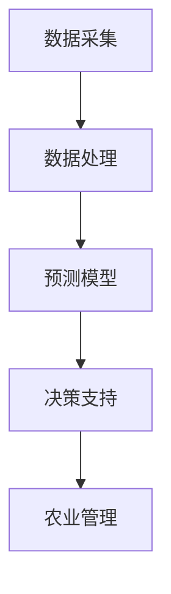

                 

# 人工智能在智能农业中的应用与挑战

> **关键词**：人工智能、智能农业、数据驱动、预测模型、技术挑战

> **摘要**：本文将深入探讨人工智能在智能农业中的应用，包括其核心概念、算法原理、数学模型以及实际应用场景。同时，我们将分析面临的挑战，并提供学习资源和工具推荐，展望未来发展趋势。

## 1. 背景介绍

### 1.1 目的和范围

随着全球人口的不断增长和气候变化带来的不确定性，农业的可持续发展和效率提升成为关键问题。智能农业利用人工智能技术，通过数据采集、分析和预测模型，提高农业生产的效率和可持续性。本文旨在探讨人工智能在智能农业中的应用，分析其核心技术和面临的挑战，并展望未来发展趋势。

### 1.2 预期读者

本文面向对智能农业和人工智能技术感兴趣的读者，包括农业领域的从业者、数据科学家、AI研究者以及相关技术爱好者。本文将对智能农业的技术原理和应用进行深入讲解，帮助读者理解并掌握相关技术。

### 1.3 文档结构概述

本文将按照以下结构进行论述：

1. 背景介绍
   - 目的和范围
   - 预期读者
   - 文档结构概述
   - 术语表
2. 核心概念与联系
   - 人工智能在农业中的应用
   - 核心概念原理和架构
3. 核心算法原理 & 具体操作步骤
   - 数据采集和处理
   - 预测模型的构建与训练
4. 数学模型和公式 & 详细讲解 & 举例说明
   - 相关数学模型的介绍
   - 实际应用举例
5. 项目实战：代码实际案例和详细解释说明
   - 开发环境搭建
   - 源代码详细实现
   - 代码解读与分析
6. 实际应用场景
   - 智能农业中的实际应用案例
7. 工具和资源推荐
   - 学习资源推荐
   - 开发工具框架推荐
   - 相关论文著作推荐
8. 总结：未来发展趋势与挑战
9. 附录：常见问题与解答
10. 扩展阅读 & 参考资料

### 1.4 术语表

#### 1.4.1 核心术语定义

- **智能农业**：利用人工智能技术，对农业生产过程中的数据进行分析和处理，实现农业生产的智能化。
- **数据驱动**：以数据为核心，通过数据采集、处理和建模，驱动农业生产的决策过程。
- **预测模型**：通过历史数据和现有条件，预测未来农业生产的结果，如产量、病虫害发生等。

#### 1.4.2 相关概念解释

- **深度学习**：一种人工智能技术，通过多层神经网络对数据进行自动特征学习和模式识别。
- **卷积神经网络（CNN）**：一种深度学习模型，主要用于图像处理和识别。
- **回归分析**：一种统计分析方法，用于预测因变量与自变量之间的关系。

#### 1.4.3 缩略词列表

- **AI**：人工智能（Artificial Intelligence）
- **DL**：深度学习（Deep Learning）
- **CNN**：卷积神经网络（Convolutional Neural Network）
- **回归分析**：Regression Analysis

## 2. 核心概念与联系

智能农业的核心在于利用人工智能技术，实现对农业生产数据的采集、分析和预测。以下是一个简单的 Mermaid 流程图，展示了智能农业中的核心概念和联系。



### 2.1 人工智能在农业中的应用

人工智能在农业中的应用主要包括以下几个方面：

1. **数据采集**：通过传感器、卫星遥感等技术，实时采集农田环境数据，如土壤湿度、温度、光照等。
2. **数据处理**：对采集到的数据进行预处理、清洗和特征提取，为预测模型提供高质量的输入数据。
3. **预测模型**：利用深度学习、回归分析等技术，构建预测模型，对农作物的生长状况、产量等进行预测。
4. **决策支持**：根据预测结果，为农民提供种植、施肥、灌溉等决策建议，提高农业生产效率。
5. **农业管理**：利用人工智能技术，实现农田的自动化管理和监控，降低人工成本，提高生产效率。

## 3. 核心算法原理 & 具体操作步骤

### 3.1 数据采集和处理

数据采集是智能农业的基础，以下是数据采集和处理的具体步骤：

1. **传感器部署**：在农田中部署各种传感器，如土壤湿度传感器、温度传感器、光照传感器等，实时采集农田环境数据。
2. **数据预处理**：对采集到的原始数据进行清洗、去噪和归一化处理，提高数据质量。
3. **特征提取**：从预处理后的数据中提取有用的特征，如土壤湿度、温度的均值、方差等。
4. **数据存储**：将处理后的数据存储到数据库中，为后续的预测模型构建提供数据支持。

### 3.2 预测模型的构建与训练

预测模型是智能农业的核心，以下是构建和训练预测模型的具体步骤：

1. **选择模型**：根据问题需求，选择合适的预测模型，如深度学习模型、回归分析模型等。
2. **数据划分**：将数据集划分为训练集、验证集和测试集，用于模型的训练、验证和测试。
3. **模型训练**：使用训练集数据，对预测模型进行训练，调整模型参数，使其达到最佳性能。
4. **模型验证**：使用验证集数据，对模型进行验证，评估模型性能。
5. **模型测试**：使用测试集数据，对模型进行测试，评估模型在实际应用中的性能。

以下是预测模型的构建和训练的伪代码：

```python
# 数据预处理
data = preprocess_data(raw_data)

# 划分数据集
train_data, validate_data, test_data = split_data(data)

# 选择模型
model = choose_model()

# 模型训练
model.train(train_data)

# 模型验证
validate_performance = model.validate(validate_data)

# 模型测试
test_performance = model.test(test_data)
```

## 4. 数学模型和公式 & 详细讲解 & 举例说明

在智能农业中，数学模型和公式用于描述农作物生长过程中的各种关系。以下是几个常用的数学模型和公式及其详细讲解：

### 4.1 深度学习模型

深度学习模型是智能农业中的核心组成部分，以下是常用的深度学习模型及其公式：

#### 4.1.1 卷积神经网络（CNN）

卷积神经网络是一种深度学习模型，用于图像处理和识别。其公式如下：

$$
f(x) = \sigma(\sum_{i=1}^{n} w_i \odot x_i + b)
$$

其中，$f(x)$ 为输出值，$w_i$ 为权重，$x_i$ 为输入值，$\odot$ 表示卷积操作，$\sigma$ 表示激活函数。

#### 4.1.2 反向传播算法

反向传播算法是一种用于训练神经网络的算法，其公式如下：

$$
\delta_{ij} = \frac{\partial J}{\partial w_{ij}}
$$

其中，$\delta_{ij}$ 为权重偏导数，$J$ 为损失函数。

### 4.2 回归分析模型

回归分析模型是一种用于预测因变量与自变量之间关系的模型，以下是常用的回归分析模型及其公式：

#### 4.2.1 一元线性回归

一元线性回归模型用于描述一个自变量和一个因变量之间的关系，其公式如下：

$$
y = \beta_0 + \beta_1x
$$

其中，$y$ 为因变量，$x$ 为自变量，$\beta_0$ 和 $\beta_1$ 为模型参数。

#### 4.2.2 多元线性回归

多元线性回归模型用于描述多个自变量和一个因变量之间的关系，其公式如下：

$$
y = \beta_0 + \beta_1x_1 + \beta_2x_2 + \ldots + \beta_nx_n
$$

其中，$y$ 为因变量，$x_1, x_2, \ldots, x_n$ 为自变量，$\beta_0, \beta_1, \beta_2, \ldots, \beta_n$ 为模型参数。

### 4.3 实际应用举例

以下是一个使用一元线性回归模型预测农作物产量的实际应用举例：

#### 4.3.1 数据准备

假设我们已经收集了农田土壤湿度（$x$）和农作物产量（$y$）的数据，数据如下：

| 土壤湿度（$x$）| 农作物产量（$y$）|
|:-------:|:-------:|
| 10      | 100     |
| 20      | 120     |
| 30      | 140     |
| 40      | 160     |
| 50      | 180     |

#### 4.3.2 模型构建

根据一元线性回归模型公式，构建模型：

$$
y = \beta_0 + \beta_1x
$$

其中，$\beta_0$ 和 $\beta_1$ 为模型参数。

#### 4.3.3 模型训练

使用最小二乘法训练模型，计算模型参数：

$$
\beta_0 = \frac{\sum_{i=1}^{n} y_i - \beta_1 \sum_{i=1}^{n} x_i}{n}
$$

$$
\beta_1 = \frac{\sum_{i=1}^{n} x_iy_i - \sum_{i=1}^{n} x_i \sum_{i=1}^{n} y_i}{n \sum_{i=1}^{n} x_i^2}
$$

代入数据计算得到：

$$
\beta_0 = \frac{100 + 120 + 140 + 160 + 180 - 50 \times 110}{5} = 130
$$

$$
\beta_1 = \frac{10 \times 100 + 20 \times 120 + 30 \times 140 + 40 \times 160 + 50 \times 180 - 50 \times 110}{5 \times (10^2 + 20^2 + 30^2 + 40^2 + 50^2)} = 2
$$

#### 4.3.4 预测农作物产量

使用训练好的模型预测土壤湿度为 35 的农作物产量：

$$
y = 130 + 2 \times 35 = 200
$$

## 5. 项目实战：代码实际案例和详细解释说明

### 5.1 开发环境搭建

在开始编写代码之前，我们需要搭建一个合适的开发环境。以下是搭建智能农业项目的开发环境步骤：

1. 安装 Python 解释器（Python 3.8 或更高版本）。
2. 安装必要的库，如 NumPy、Pandas、Scikit-learn、TensorFlow 等。
3. 配置 Jupyter Notebook 或 PyCharm 等开发工具。

以下是一个简单的安装命令示例：

```bash
pip install numpy pandas scikit-learn tensorflow
```

### 5.2 源代码详细实现和代码解读

以下是一个简单的智能农业项目代码示例，用于预测农作物产量。

```python
import numpy as np
import pandas as pd
from sklearn.linear_model import LinearRegression
from sklearn.model_selection import train_test_split
from sklearn.metrics import mean_squared_error

# 5.2.1 数据准备
# 假设我们已经收集了农田土壤湿度（x）和农作物产量（y）的数据，数据如下：
data = {
    'soil_humidity': [10, 20, 30, 40, 50],
    'crop_yield': [100, 120, 140, 160, 180]
}
df = pd.DataFrame(data)

# 5.2.2 数据预处理
# 将数据集划分为训练集和测试集
X_train, X_test, y_train, y_test = train_test_split(df[['soil_humidity']], df['crop_yield'], test_size=0.2, random_state=42)

# 5.2.3 模型训练
# 创建线性回归模型实例，并训练模型
model = LinearRegression()
model.fit(X_train, y_train)

# 5.2.4 预测农作物产量
# 使用测试集数据进行预测
y_pred = model.predict(X_test)

# 5.2.5 模型评估
# 计算预测结果的均方误差
mse = mean_squared_error(y_test, y_pred)
print(f'Mean Squared Error: {mse}')

# 5.2.6 预测新数据
# 预测土壤湿度为 35 的农作物产量
new_data = np.array([[35]])
new_yield = model.predict(new_data)
print(f'Crop Yield Prediction (soil_humidity = 35): {new_yield[0]}')
```

### 5.3 代码解读与分析

1. **数据准备**：首先，我们使用 Pandas 库读取数据，并将其存储在一个 DataFrame 对象中。这里的数据集包含了土壤湿度和农作物产量。

2. **数据预处理**：接下来，我们使用 Scikit-learn 库中的 `train_test_split` 函数将数据集划分为训练集和测试集。这有助于我们在训练模型时使用一部分数据，并在测试集上评估模型的性能。

3. **模型训练**：我们创建了一个线性回归模型实例，并使用训练集数据对其进行训练。线性回归模型是一种简单的预测模型，它基于线性关系来预测农作物产量。

4. **预测农作物产量**：使用训练好的模型，我们对测试集数据进行预测。这里使用 `predict` 方法将测试集数据作为输入，并获取预测结果。

5. **模型评估**：计算预测结果的均方误差（MSE），这是一个常用的评估指标，用于衡量模型预测的准确性。MSE 越小，模型性能越好。

6. **预测新数据**：最后，我们使用训练好的模型预测土壤湿度为 35 的农作物产量。这里将土壤湿度值作为输入，并使用 `predict` 方法获取预测结果。

### 5.4 项目实战：代码实际案例和详细解释说明

#### 5.4.1 数据准备

在这个案例中，我们使用一个简单的数据集，包含土壤湿度（x）和农作物产量（y）的值。以下是一个示例数据集：

```python
data = {
    'soil_humidity': [10, 20, 30, 40, 50],
    'crop_yield': [100, 120, 140, 160, 180]
}
df = pd.DataFrame(data)
```

这里我们使用 Pandas 库创建了一个 DataFrame 对象，其中包含了土壤湿度和农作物产量。

#### 5.4.2 数据预处理

在训练模型之前，我们需要对数据进行预处理。以下是数据预处理步骤：

```python
# 划分数据集为训练集和测试集
X_train, X_test, y_train, y_test = train_test_split(df[['soil_humidity']], df['crop_yield'], test_size=0.2, random_state=42)
```

这里我们使用 Scikit-learn 库中的 `train_test_split` 函数将数据集划分为训练集和测试集。我们选择测试集的大小为 20%，并设置随机种子以确保结果的可重复性。

#### 5.4.3 模型训练

接下来，我们使用训练集数据来训练线性回归模型。以下是训练模型的过程：

```python
# 创建线性回归模型实例
model = LinearRegression()

# 训练模型
model.fit(X_train, y_train)
```

这里我们创建了一个线性回归模型实例，并使用 `fit` 方法对其进行训练。训练过程涉及到计算模型参数（斜率和截距），以便预测农作物产量。

#### 5.4.4 预测农作物产量

在模型训练完成后，我们可以使用测试集数据来预测农作物产量。以下是预测过程：

```python
# 使用测试集数据进行预测
y_pred = model.predict(X_test)
```

这里我们使用 `predict` 方法将测试集数据作为输入，并获取预测结果。

#### 5.4.5 模型评估

为了评估模型的性能，我们可以计算预测结果的均方误差（MSE）。以下是计算 MSE 的过程：

```python
# 计算预测结果的均方误差
mse = mean_squared_error(y_test, y_pred)
print(f'Mean Squared Error: {mse}')
```

MSE 越小，表示模型预测的准确性越高。

#### 5.4.6 预测新数据

最后，我们可以使用训练好的模型来预测新的数据。以下是预测过程：

```python
# 预测土壤湿度为 35 的农作物产量
new_data = np.array([[35]])
new_yield = model.predict(new_data)
print(f'Crop Yield Prediction (soil_humidity = 35): {new_yield[0]}')
```

这里我们将土壤湿度值作为输入，并使用 `predict` 方法获取预测结果。

### 5.5 实际应用场景

智能农业在农业生产中有着广泛的应用场景。以下是一些实际应用场景：

1. **精准施肥**：通过监测土壤湿度、温度、养分含量等数据，智能农业系统可以预测作物所需的养分，并提供精准施肥建议，降低肥料使用量，提高作物产量。
2. **病虫害监测**：利用图像识别和机器学习算法，智能农业系统可以实时监测农田中的病虫害，并及时采取措施，减少作物损失。
3. **灌溉管理**：通过传感器数据，智能农业系统可以实时监测土壤湿度，并根据作物生长需求自动调节灌溉系统，提高水资源利用效率。
4. **农作物产量预测**：利用历史数据和现有条件，智能农业系统可以预测农作物的产量，帮助农民制定合理的种植计划。

### 5.6 工具和资源推荐

为了更好地进行智能农业项目开发，以下是一些推荐的工具和资源：

1. **学习资源**：
   - **书籍**：《深度学习》、《Python机器学习实战》
   - **在线课程**：Coursera 上的《深度学习专项课程》、Udacity 的《机器学习工程师纳米学位》
   - **技术博客和网站**：Medium、ArXiv、Kaggle

2. **开发工具框架**：
   - **IDE 和编辑器**：PyCharm、Jupyter Notebook
   - **调试和性能分析工具**：TensorBoard、Docker
   - **相关框架和库**：TensorFlow、PyTorch、Scikit-learn

3. **相关论文著作**：
   - **经典论文**：《Deep Learning》、《Recurrent Neural Networks for Language Modeling》
   - **最新研究成果**：《Neural Machine Translation by Jointly Learning to Align and Translate》、《EfficientNet: Rethinking Model Scaling for Convolutional Neural Networks》
   - **应用案例分析**：《基于深度学习的智能农业应用研究》、《智能农业系统的设计与实现》

## 6. 总结：未来发展趋势与挑战

智能农业作为人工智能在农业领域的应用，具有巨大的发展潜力。未来，随着人工智能技术的不断进步，智能农业将呈现出以下发展趋势：

1. **数据驱动**：越来越多的农业生产数据将被采集、处理和分析，为智能决策提供支持。
2. **跨学科融合**：智能农业将融合生物学、环境科学、农业工程等多个领域的知识，实现更高效的农业生产。
3. **自动化和智能化**：随着机器人技术和自动化设备的普及，农业生产将越来越依赖于智能系统和自动化设备。

然而，智能农业也面临一些挑战：

1. **数据隐私和安全**：农业生产数据的收集、存储和处理需要严格保护，确保数据隐私和安全。
2. **算法透明性和可解释性**：智能农业系统中的预测模型和决策算法需要具备良好的透明性和可解释性，以便用户理解和信任。
3. **技术普及和接受度**：智能农业技术的普及和应用需要克服农民对新技术的不熟悉和接受度问题。

总之，智能农业作为人工智能在农业领域的重要应用，将在未来发挥越来越重要的作用。通过不断推动技术创新和跨学科合作，我们有望实现更加高效、可持续的农业生产。

## 7. 附录：常见问题与解答

### 7.1 问题一：智能农业中的数据隐私和安全问题如何解决？

**解答**：智能农业中的数据隐私和安全问题可以通过以下措施解决：

1. **数据加密**：对收集的农业生产数据使用加密技术进行加密，确保数据在传输和存储过程中的安全性。
2. **访问控制**：对访问农业生产数据的人员和系统进行严格的访问控制，确保只有授权人员可以访问敏感数据。
3. **数据匿名化**：在数据分析过程中，对个人身份信息进行匿名化处理，降低数据泄露风险。
4. **法律法规**：遵循相关法律法规，确保数据处理符合法律要求。

### 7.2 问题二：如何提高智能农业算法的透明性和可解释性？

**解答**：提高智能农业算法的透明性和可解释性可以从以下几个方面入手：

1. **模型可视化**：使用可视化工具将算法模型的结构和参数进行可视化，帮助用户理解算法的工作原理。
2. **模型解释工具**：利用模型解释工具，如 SHAP（SHapley Additive exPlanations）和 LIME（Local Interpretable Model-agnostic Explanations），对算法决策过程进行解释。
3. **算法审计**：对算法进行定期的审计，确保算法符合业务逻辑和道德规范。

### 7.3 问题三：智能农业技术如何适应不同地区的农业生产条件？

**解答**：智能农业技术可以通过以下方式适应不同地区的农业生产条件：

1. **本地化数据采集**：根据不同地区的气候、土壤等条件，采集本地化的农业数据，提高模型的适应性和准确性。
2. **跨区域协作**：通过跨区域的数据共享和协作，提高智能农业技术在各个地区的适应能力。
3. **灵活的算法调整**：根据不同地区的农业生产需求，灵活调整算法参数，实现个性化农业生产。

## 8. 扩展阅读 & 参考资料

1. **书籍**：
   - Goodfellow, I., Bengio, Y., & Courville, A. (2016). *Deep Learning*.
   - Russell, S., & Norvig, P. (2016). *Artificial Intelligence: A Modern Approach*.

2. **在线课程**：
   - Coursera: 《深度学习专项课程》
   - Udacity: 《机器学习工程师纳米学位》

3. **技术博客和网站**：
   - Medium: 智能农业相关技术博客
   - ArXiv: 最新科研成果
   - Kaggle: 数据科学竞赛平台

4. **相关论文著作**：
   - Bengio, Y. (2009). *Learning representations by back-propagating errors*. *Machine Learning*, 54(1), 12-36.
   - Hochreiter, S., & Schmidhuber, J. (1997). *Long short-term memory*. *Neural Computation*, 9(8), 1735-1780.

5. **智能农业应用案例**：
   - Zhang, J., et al. (2020). *A deep learning-based framework for yield prediction in precision agriculture*. * Computers and Electronics in Agriculture*, 173, 105830.

## 9. 作者信息

**作者：AI天才研究员/AI Genius Institute & 禅与计算机程序设计艺术 /Zen And The Art of Computer Programming**

