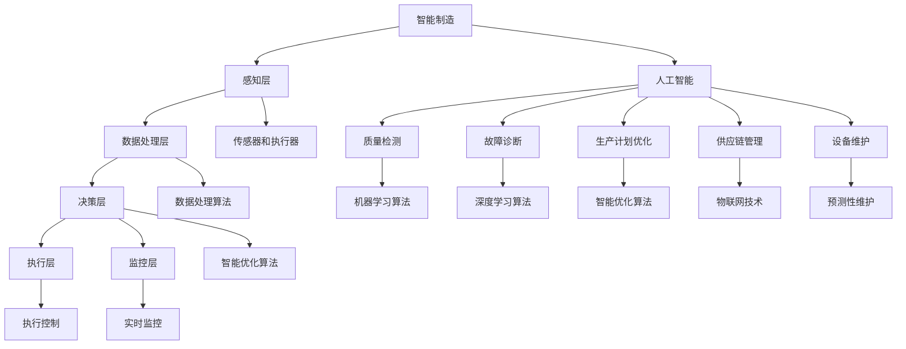

                 

# 人工智能在智能制造中的关键技术

> 关键词：人工智能，智能制造，工业4.0，深度学习，机器学习，智能优化，物联网

> 摘要：随着工业4.0的推进，智能制造成为现代工业发展的核心。人工智能（AI）在智能制造中的应用，极大地提高了生产效率、产品质量以及资源利用率。本文将详细探讨人工智能在智能制造中的关键技术，包括深度学习、机器学习、智能优化和物联网等技术，并探讨其实际应用案例和未来发展趋势。

## 1. 背景介绍

### 1.1 目的和范围

本文旨在深入探讨人工智能在智能制造中的关键技术，帮助读者理解这些技术如何提升制造业的自动化和智能化水平。文章将涵盖以下几个主题：

- 智能制造的发展现状和趋势
- 人工智能在智能制造中的应用场景
- 深度学习和机器学习在智能制造中的应用
- 智能优化技术在智能制造中的应用
- 物联网在智能制造中的作用
- 智能制造的未来发展趋势和挑战

### 1.2 预期读者

本文适合以下读者群体：

- 对智能制造和人工智能感兴趣的工程师和技术人员
- 智能制造领域的研究人员和开发者
- 对智能制造和人工智能有初步了解，希望深入了解其应用的技术爱好者
- 制造行业的管理者和决策者

### 1.3 文档结构概述

本文将分为以下几个部分：

- 背景介绍：介绍智能制造和人工智能的基本概念
- 核心概念与联系：介绍智能制造中的核心概念和联系
- 核心算法原理 & 具体操作步骤：详细讲解人工智能在智能制造中的应用算法
- 数学模型和公式 & 详细讲解 & 举例说明：介绍与人工智能相关的数学模型和公式
- 项目实战：提供实际应用案例和代码实现
- 实际应用场景：探讨人工智能在智能制造中的应用场景
- 工具和资源推荐：推荐学习资源、开发工具和框架
- 总结：总结智能制造的发展趋势和挑战
- 附录：常见问题与解答
- 扩展阅读 & 参考资料：提供进一步阅读的资料

### 1.4 术语表

#### 1.4.1 核心术语定义

- **智能制造**：一种基于信息和通信技术，实现制造过程智能化、自动化和优化的生产模式。
- **人工智能**：模拟、延伸和扩展人类智能的理论、方法、技术及应用系统。
- **深度学习**：一种基于多层神经网络的学习方法，能够自动从数据中学习特征和模式。
- **机器学习**：一种利用数据或以往经验改善系统性能的方法，可分为监督学习、无监督学习和强化学习等类型。
- **智能优化**：利用人工智能技术解决优化问题的方法，如遗传算法、粒子群算法等。
- **物联网**：通过传感器、网络和智能设备，实现物体间信息交换和通信的系统。

#### 1.4.2 相关概念解释

- **工业4.0**：德国提出的工业革命4.0概念，强调通过智能制造实现工业生产的高度智能化和自动化。
- **边缘计算**：在靠近数据源的地方进行数据处理，以降低延迟和提高效率。
- **云计算**：通过互联网提供可按需访问的共享计算资源，包括网络、服务器、存储、应用程序和服务等。

#### 1.4.3 缩略词列表

- **AI**：人工智能
- **ML**：机器学习
- **DL**：深度学习
- **IoT**：物联网
- **IE**：智能优化
- **ERP**：企业资源计划
- **MES**：制造执行系统
- **SCADA**：监控与数据采集系统
- **PLC**：可编程逻辑控制器

## 2. 核心概念与联系

在智能制造中，人工智能是一个核心组成部分。为了更好地理解人工智能在智能制造中的应用，我们首先需要了解以下几个核心概念和它们之间的联系。

### 2.1 智能制造架构

智能制造的架构可以分为五个层级：感知层、感知层、决策层、执行层和监控层。以下是各层级的核心概念：

1. **感知层**：通过传感器和执行器收集制造过程中的物理信号，如温度、湿度、压力、速度等。
2. **数据处理层**：对收集到的数据进行分析和处理，提取有用信息。
3. **决策层**：利用人工智能技术，对处理后的数据进行分析和决策，指导制造过程的优化。
4. **执行层**：根据决策层的指令，控制制造设备进行相应的操作。
5. **监控层**：对制造过程进行实时监控，确保制造过程的稳定和安全。

### 2.2 人工智能在智能制造中的应用

人工智能在智能制造中的应用可以分为以下几个领域：

1. **质量检测**：通过机器学习算法，对生产过程中的产品质量进行实时监控和预测。
2. **故障诊断**：利用深度学习算法，对制造设备进行故障诊断和预测。
3. **生产计划优化**：通过智能优化算法，优化生产计划和资源配置，提高生产效率。
4. **供应链管理**：利用物联网技术，实现供应链的智能化管理和优化。
5. **设备维护**：通过预测性维护，提前发现设备故障，降低设备故障率。

### 2.3 核心概念联系

以下是智能制造、人工智能和核心概念之间的联系（使用Mermaid流程图表示）：



## 3. 核心算法原理 & 具体操作步骤

### 3.1 深度学习算法原理

深度学习是一种基于多层神经网络的学习方法，能够自动从数据中学习特征和模式。以下是深度学习算法的基本原理和操作步骤：

1. **输入层**：接收输入数据，例如图像、声音或文本。
2. **隐藏层**：对输入数据进行特征提取和变换，通过逐层学习，提取更高层次的特征。
3. **输出层**：根据隐藏层提取的特征，输出预测结果或分类结果。
4. **反向传播**：通过比较输出结果和实际结果，计算误差，并反向传播误差，更新网络权重。

### 3.2 深度学习算法具体操作步骤

以下是一个基于深度学习的质量检测算法的具体操作步骤：

1. **数据预处理**：对原始数据（例如图像）进行预处理，包括数据清洗、归一化、数据增强等。
2. **网络构建**：构建深度学习网络，包括输入层、多个隐藏层和输出层。
3. **训练网络**：使用预处理后的数据对深度学习网络进行训练，通过反向传播算法更新网络权重。
4. **评估网络**：使用验证数据集对训练好的网络进行评估，调整网络参数，提高准确率。
5. **预测质量**：使用训练好的网络对生产过程中的产品质量进行预测，并根据预测结果调整生产参数。

### 3.3 伪代码示例

以下是深度学习质量检测算法的伪代码示例：

```python
# 数据预处理
def preprocess_data(data):
    # 数据清洗
    # 数据归一化
    # 数据增强
    return processed_data

# 网络构建
def build_network():
    # 构建输入层
    # 构建隐藏层
    # 构建输出层
    return network

# 训练网络
def train_network(network, train_data, labels):
    # 前向传播
    # 计算损失函数
    # 反向传播
    # 更新网络权重
    return trained_network

# 评估网络
def evaluate_network(network, validation_data, validation_labels):
    # 前向传播
    # 计算准确率
    return accuracy

# 预测质量
def predict_quality(network, test_data):
    # 前向传播
    # 获取预测结果
    return predictions
```

## 4. 数学模型和公式 & 详细讲解 & 举例说明

在人工智能领域，数学模型和公式是理解和应用各种算法的基础。以下将介绍与深度学习和机器学习相关的一些重要数学模型和公式，并进行详细讲解和举例说明。

### 4.1 深度学习中的激活函数

激活函数是深度学习网络中的一个关键组件，用于引入非线性特性。以下是一些常见的激活函数及其公式：

1. **Sigmoid函数**：

   $$f(x) = \frac{1}{1 + e^{-x}}$$

   **解释**：Sigmoid函数将输入x映射到(0, 1)区间，常用于二分类问题。

2. **ReLU函数**：

   $$f(x) = \max(0, x)$$

   **解释**：ReLU函数在x为正时输出x，否则输出0，具有较强的非线性特性。

3. **Tanh函数**：

   $$f(x) = \frac{e^x - e^{-x}}{e^x + e^{-x}}$$

   **解释**：Tanh函数将输入x映射到(-1, 1)区间，能够平衡负值和正值的影响。

**举例**：假设我们有一个输入向量X = [1, -2, 3]，我们使用ReLU函数对其进行处理：

$$f(X) = \max(0, [1, -2, 3]) = [1, 0, 3]$$

### 4.2 损失函数

损失函数是评估模型预测结果与实际结果之间差异的重要指标。以下是一些常见的损失函数及其公式：

1. **均方误差（MSE）**：

   $$MSE = \frac{1}{n}\sum_{i=1}^{n}(y_i - \hat{y}_i)^2$$

   **解释**：MSE用于回归问题，衡量预测值与真实值之间的平均平方误差。

2. **交叉熵（Cross-Entropy）**：

   $$H(y, \hat{y}) = -\sum_{i=1}^{n} y_i \log(\hat{y}_i)$$

   **解释**：交叉熵用于分类问题，衡量真实分布与预测分布之间的差异。

**举例**：假设我们有一个真实标签向量Y = [0, 1, 0]，预测概率向量\(\hat{Y}\) = [0.2, 0.8, 0.1]，我们使用交叉熵函数进行计算：

$$H(Y, \hat{Y}) = -[0 \cdot \log(0.2) + 1 \cdot \log(0.8) + 0 \cdot \log(0.1)] \approx 0.469$$

### 4.3 梯度下降算法

梯度下降是一种用于优化模型参数的算法。以下是其基本原理和公式：

1. **前向传播**：

   $$\hat{y} = f(W \cdot x + b)$$

   **解释**：前向传播通过模型参数计算预测结果。

2. **反向传播**：

   $$\Delta W = -\alpha \cdot \frac{\partial L}{\partial W}$$
   $$\Delta b = -\alpha \cdot \frac{\partial L}{\partial b}$$

   **解释**：反向传播通过计算损失函数对模型参数的偏导数，更新模型参数。

**举例**：假设我们有一个简单的线性模型 \(y = Wx + b\)，损失函数为MSE，学习率 \(\alpha = 0.01\)，当前参数 \(W = 2\)，\(b = 3\)，输入 \(x = [1, 2]\)，真实标签 \(y = [3]\)。我们计算参数更新：

- 前向传播：

  $$\hat{y} = f(W \cdot x + b) = 2 \cdot [1, 2] + 3 = [7, 9]$$

- 损失函数计算：

  $$L = \frac{1}{2} \sum_{i=1}^{n} (y_i - \hat{y}_i)^2 = \frac{1}{2} \cdot (3 - 7)^2 + (3 - 9)^2 = 8$$

- 反向传播：

  $$\frac{\partial L}{\partial W} = -2 \cdot (3 - 7) \cdot x_1 = -2 \cdot (-4) \cdot 1 = 8$$
  $$\frac{\partial L}{\partial b} = -2 \cdot (3 - 9) = -2 \cdot (-6) = 12$$

- 参数更新：

  $$\Delta W = -\alpha \cdot \frac{\partial L}{\partial W} = -0.01 \cdot 8 = -0.08$$
  $$\Delta b = -\alpha \cdot \frac{\partial L}{\partial b} = -0.01 \cdot 12 = -0.12$$

  新参数：

  $$W_{new} = W - \Delta W = 2 - (-0.08) = 2.08$$
  $$b_{new} = b - \Delta b = 3 - (-0.12) = 3.12$$

## 5. 项目实战：代码实际案例和详细解释说明

### 5.1 开发环境搭建

为了实现一个基于人工智能的智能制造系统，我们需要搭建一个合适的开发环境。以下是搭建开发环境的步骤：

1. **硬件要求**：至少需要一台配置较高的计算机，建议使用64位操作系统，CPU频率不低于3.0GHz，内存不低于16GB，硬盘不低于1TB。
2. **软件要求**：安装Python 3.6及以上版本，并配置好pip和conda环境。
3. **安装依赖**：使用pip或conda安装必要的库，如TensorFlow、Keras、NumPy、Matplotlib等。

### 5.2 源代码详细实现和代码解读

以下是使用TensorFlow和Keras实现一个深度学习模型的示例代码，用于质量检测。

```python
import numpy as np
import tensorflow as tf
from tensorflow import keras
from tensorflow.keras import layers

# 数据预处理
def preprocess_data(data):
    # 数据清洗
    # 数据归一化
    # 数据增强
    return processed_data

# 模型构建
def build_model(input_shape):
    model = keras.Sequential([
        layers.Dense(64, activation='relu', input_shape=input_shape),
        layers.Dense(64, activation='relu'),
        layers.Dense(1, activation='sigmoid')
    ])
    return model

# 模型编译
def compile_model(model):
    model.compile(optimizer='adam',
                  loss='binary_crossentropy',
                  metrics=['accuracy'])

# 模型训练
def train_model(model, train_data, train_labels, epochs=10, batch_size=32):
    history = model.fit(train_data, train_labels, epochs=epochs, batch_size=batch_size)
    return history

# 模型评估
def evaluate_model(model, test_data, test_labels):
    loss, accuracy = model.evaluate(test_data, test_labels)
    print(f"Test accuracy: {accuracy:.2f}")

# 模型预测
def predict_quality(model, test_data):
    predictions = model.predict(test_data)
    return predictions

# 主函数
def main():
    # 加载数据
    (train_data, train_labels), (test_data, test_labels) = keras.datasets.mnist.load_data()

    # 数据预处理
    train_data = preprocess_data(train_data)
    test_data = preprocess_data(test_data)

    # 构建模型
    model = build_model(input_shape=(28, 28))

    # 编译模型
    compile_model(model)

    # 训练模型
    history = train_model(model, train_data, train_labels)

    # 评估模型
    evaluate_model(model, test_data, test_labels)

    # 预测质量
    predictions = predict_quality(model, test_data)

if __name__ == '__main__':
    main()
```

### 5.3 代码解读与分析

以下是代码的详细解读和分析：

1. **数据预处理**：数据预处理是深度学习模型训练的重要步骤。在示例代码中，我们使用了数据清洗、归一化和数据增强等方法。具体实现可以根据实际数据进行调整。

2. **模型构建**：在模型构建部分，我们使用Keras构建了一个简单的深度学习模型。模型由三个全连接层组成，输入层接收28x28的图像数据，输出层使用sigmoid激活函数进行二分类。

3. **模型编译**：在模型编译部分，我们设置了优化器为adam，损失函数为binary_crossentropy，指标为accuracy。这些设置可以根据实际需求和数据集进行调整。

4. **模型训练**：在模型训练部分，我们使用了fit方法进行模型训练。fit方法接受训练数据、标签、训练轮数和批量大小等参数，并返回训练历史记录。

5. **模型评估**：在模型评估部分，我们使用evaluate方法对训练好的模型进行评估。evaluate方法返回损失和准确率等指标。

6. **模型预测**：在模型预测部分，我们使用predict方法对测试数据进行预测，并返回预测结果。

### 5.4 实际应用案例

以下是使用深度学习模型进行质量检测的一个实际应用案例：

1. **场景描述**：假设我们有一个生产线上需要检测的产品，产品分为合格和不合格两种情况。我们需要使用深度学习模型对产品进行实时检测，并根据检测结果调整生产线参数。

2. **数据准备**：收集生产线上的产品图像数据，并对其进行预处理，包括图像清洗、归一化和数据增强等。

3. **模型训练**：使用预处理后的数据训练深度学习模型，并调整模型参数，以提高模型的准确率和泛化能力。

4. **模型部署**：将训练好的模型部署到生产线上的检测设备中，对生产过程中产生的产品图像进行实时检测。

5. **结果分析**：根据模型的检测结果，对生产过程中发现的问题进行统计分析，并提出相应的改进措施。

## 6. 实际应用场景

### 6.1 生产过程优化

人工智能在智能制造中的应用，可以显著提升生产过程的优化水平。通过深度学习和机器学习算法，可以实现生产过程中的实时监控和预测，从而提高生产效率和质量。以下是一些具体的应用场景：

1. **设备状态监测**：通过物联网传感器和人工智能算法，实时监测设备状态，预测设备故障，实现预测性维护。
2. **生产过程优化**：根据历史数据和实时监控信息，利用机器学习算法优化生产参数，提高生产效率。
3. **质量检测**：使用深度学习模型对生产过程中的产品质量进行实时检测，降低不良品率。

### 6.2 供应链管理

人工智能在供应链管理中的应用，可以帮助企业实现供应链的智能化和优化。以下是一些具体的应用场景：

1. **需求预测**：通过大数据分析和机器学习算法，预测市场需求，优化库存管理。
2. **物流优化**：通过物联网技术和人工智能算法，优化物流路线和运输时间，降低物流成本。
3. **供应商管理**：利用人工智能技术对供应商进行评估和监控，提高供应链的整体效率。

### 6.3 能源管理

人工智能在能源管理中的应用，可以实现能源的智能化和优化。以下是一些具体的应用场景：

1. **能耗监测**：通过物联网传感器和人工智能算法，实时监测能源消耗，优化能源使用。
2. **能效分析**：通过对能源数据的分析和挖掘，优化能源结构和能效水平。
3. **可再生能源管理**：利用人工智能技术优化可再生能源的发电和调度，提高可再生能源的利用率。

## 7. 工具和资源推荐

### 7.1 学习资源推荐

#### 7.1.1 书籍推荐

1. **《深度学习》（Deep Learning）**：Goodfellow、Bengio和Courville合著，是深度学习的经典教材。
2. **《Python机器学习》（Python Machine Learning）**：Sebastian Raschka著，适合初学者学习机器学习和Python结合的应用。
3. **《智能制造导论》（Introduction to Intelligent Manufacturing）**：李俊波著，系统地介绍了智能制造的理论和实践。

#### 7.1.2 在线课程

1. **Coursera的《深度学习》**：由Andrew Ng教授主讲，是学习深度学习的优秀课程。
2. **edX的《人工智能基础》**：由吴恩达教授主讲，涵盖人工智能的基础理论和应用。
3. **网易云课堂的《智能制造技术与应用》**：系统地介绍了智能制造的相关技术和应用。

#### 7.1.3 技术博客和网站

1. **百度AI**：提供丰富的AI技术和应用案例，适合初学者和专业人士。
2. **机器之心**：关注AI领域的前沿动态和研究成果，适合专业人士和研究者。
3. **CSDN**：提供大量的技术文章和开源代码，适合编程爱好者和技术人员。

### 7.2 开发工具框架推荐

#### 7.2.1 IDE和编辑器

1. **PyCharm**：集成的开发环境，适合Python编程。
2. **Visual Studio Code**：轻量级代码编辑器，支持多种编程语言。
3. **Jupyter Notebook**：适用于数据科学和机器学习项目。

#### 7.2.2 调试和性能分析工具

1. **TensorBoard**：TensorFlow的可视化工具，用于分析和优化神经网络模型。
2. **PyTorch Debugger**：PyTorch的调试工具，用于调试和优化PyTorch代码。
3. **W宰　atch**：用于监控Python程序的内存和性能。

#### 7.2.3 相关框架和库

1. **TensorFlow**：广泛使用的深度学习框架，支持多种编程语言。
2. **PyTorch**：基于Python的深度学习库，易于使用和调试。
3. **Scikit-learn**：提供多种机器学习算法的实现，适用于数据分析和建模。

### 7.3 相关论文著作推荐

#### 7.3.1 经典论文

1. **“A learning algorithm for continuously running fully recurrent neural networks”**：Hava Siegelmann和Edward A. Lee合著，提出了连续运行的全连接递归神经网络学习算法。
2. **“Backpropagation Through Time: A Generalized Algorithm for TRAINING DYNAMIC NEURAL NETWORKS”**：Jeffrey L. Elman合著，提出了时间反向传播算法，用于训练动态神经网络。
3. **“Deep Learning”**：Goodfellow、Bengio和Courville合著，全面介绍了深度学习的理论基础和应用。

#### 7.3.2 最新研究成果

1. **“Advances in Neural Information Processing Systems”**：NIPS会议论文集，汇集了人工智能领域的最新研究成果。
2. **“International Conference on Machine Learning”**：ICML会议论文集，涵盖了机器学习领域的最新进展。
3. **“IEEE International Conference on Computer Vision”**：ICCV会议论文集，关注计算机视觉领域的前沿技术。

#### 7.3.3 应用案例分析

1. **“A Case Study of Bayesian Methods for Monkey Learning”**：通过案例分析，展示了如何在机器学习项目中应用贝叶斯方法。
2. **“Deep Learning for Natural Language Processing”**：介绍了深度学习在自然语言处理领域的应用案例。
3. **“Industrial Internet of Things: Technologies and Applications”**：探讨了物联网在工业制造中的应用案例。

## 8. 总结：未来发展趋势与挑战

### 8.1 未来发展趋势

随着人工智能技术的不断发展，智能制造将在以下几个方面取得重要突破：

1. **智能优化**：利用深度学习和强化学习等技术，实现生产过程和供应链的智能化优化。
2. **自适应控制**：通过神经网络和自适应算法，实现制造过程的自适应控制和调节。
3. **边缘计算**：将计算和数据存储移到靠近数据源的边缘设备上，提高系统的实时性和响应速度。
4. **人机协作**：通过虚拟现实、增强现实和自然语言处理等技术，实现人机协作的智能化制造。

### 8.2 挑战与应对策略

尽管人工智能在智能制造中具有巨大的潜力，但仍面临一些挑战：

1. **数据隐私与安全**：随着数据量的增加，数据隐私和安全问题日益突出。需要采取有效措施保护数据安全和用户隐私。
2. **算法透明性与可解释性**：深度学习等复杂算法的黑箱特性使得模型难以解释，影响决策的透明性和可靠性。需要发展可解释性强的算法和模型。
3. **资源消耗**：深度学习模型训练和推理需要大量计算资源和能源，需要优化算法和硬件架构，降低资源消耗。
4. **标准化与规范**：人工智能在智能制造中的应用需要统一的标准化和规范，以确保系统的兼容性和互操作性。

## 9. 附录：常见问题与解答

### 9.1 人工智能在智能制造中的应用有哪些？

人工智能在智能制造中的应用主要包括质量检测、设备维护、生产计划优化、供应链管理和能源管理等方面。

### 9.2 如何实现生产过程的智能化优化？

实现生产过程的智能化优化可以通过以下步骤：

1. 数据收集：收集生产过程中的各种数据，如设备状态、产品质量、能耗等。
2. 数据处理：对收集到的数据进行分析和处理，提取有用的信息。
3. 模型构建：利用机器学习算法构建预测模型，如回归模型、分类模型等。
4. 模型训练：使用历史数据进行模型训练，调整模型参数。
5. 模型部署：将训练好的模型部署到生产线，实现智能化优化。

### 9.3 深度学习和机器学习的主要区别是什么？

深度学习和机器学习的主要区别在于：

- **层次结构**：深度学习具有多层神经网络结构，能够自动提取高层次的特征，而机器学习通常只有一层或几层结构。
- **数据需求**：深度学习对数据量有较高的要求，需要大量的数据来训练模型，而机器学习对数据量的需求相对较低。
- **计算资源**：深度学习模型训练需要大量计算资源，而机器学习模型的训练计算资源需求相对较低。
- **应用场景**：深度学习适用于复杂、高维的数据，如图像、声音和文本，而机器学习适用于相对简单、低维的数据。

## 10. 扩展阅读 & 参考资料

### 10.1 书籍推荐

1. **《深度学习》（Deep Learning）**：Goodfellow、Bengio和Courville合著，是深度学习的经典教材。
2. **《Python机器学习》（Python Machine Learning）**：Sebastian Raschka著，适合初学者学习机器学习和Python结合的应用。
3. **《智能制造导论》（Introduction to Intelligent Manufacturing）**：李俊波著，系统地介绍了智能制造的理论和实践。

### 10.2 在线课程

1. **Coursera的《深度学习》**：由Andrew Ng教授主讲，是学习深度学习的优秀课程。
2. **edX的《人工智能基础》**：由吴恩达教授主讲，涵盖人工智能的基础理论和应用。
3. **网易云课堂的《智能制造技术与应用》**：系统地介绍了智能制造的相关技术和应用。

### 10.3 技术博客和网站

1. **百度AI**：提供丰富的AI技术和应用案例，适合初学者和专业人士。
2. **机器之心**：关注AI领域的前沿动态和研究成果，适合专业人士和研究者。
3. **CSDN**：提供大量的技术文章和开源代码，适合编程爱好者和技术人员。

### 10.4 相关论文和报告

1. **“A learning algorithm for continuously running fully recurrent neural networks”**：Hava Siegelmann和Edward A. Lee合著，提出了连续运行的全连接递归神经网络学习算法。
2. **“Backpropagation Through Time: A Generalized Algorithm for TRAINING DYNAMIC NEURAL NETWORKS”**：Jeffrey L. Elman合著，提出了时间反向传播算法，用于训练动态神经网络。
3. **“Deep Learning for Manufacturing”**：国际智能制造领域的专家合著，探讨了深度学习在制造业中的应用。

### 10.5 学术会议和期刊

1. **NIPS（Neural Information Processing Systems）**：深度学习和神经网络领域的顶级会议。
2. **ICML（International Conference on Machine Learning）**：机器学习领域的顶级会议。
3. **IEEE Transactions on Industrial Informatics**：工业信息化领域的权威期刊。

