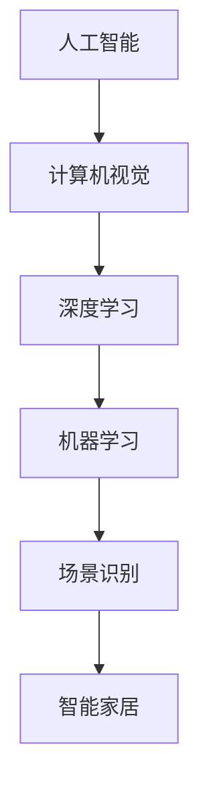

                 

# 人工智能在智能家居场景识别中的应用

## 关键词
- 人工智能
- 智能家居
- 场景识别
- 深度学习
- 机器学习
- 计算机视觉

## 摘要
本文将深入探讨人工智能在智能家居场景识别中的应用。我们将从背景介绍开始，逐步讲解核心概念、算法原理、数学模型、项目实战以及实际应用场景，并推荐相关工具和资源。通过本文的阅读，读者将了解如何利用人工智能技术实现智能家居场景识别，为家居生活带来便捷和智能体验。

## 1. 背景介绍

### 1.1 目的和范围
本文旨在介绍人工智能在智能家居场景识别中的应用，帮助读者了解相关技术原理和实际应用。我们将关注以下范围：

1. **核心概念**：介绍人工智能、深度学习、机器学习等基础概念。
2. **算法原理**：详细讲解场景识别算法的原理和操作步骤。
3. **数学模型**：介绍用于场景识别的数学模型和公式。
4. **项目实战**：通过代码案例展示如何实现场景识别。
5. **实际应用场景**：探讨场景识别在智能家居中的应用。
6. **工具和资源推荐**：为读者提供学习资源和开发工具。

### 1.2 预期读者
本文适合以下读者群体：

1. 智能家居开发者
2. 人工智能研究人员
3. 对智能家居和人工智能感兴趣的爱好者

### 1.3 文档结构概述
本文将按照以下结构进行阐述：

1. 背景介绍
   - 目的和范围
   - 预期读者
   - 文档结构概述
   - 术语表
2. 核心概念与联系
   - 核心概念原理和架构的 Mermaid 流程图
3. 核心算法原理 & 具体操作步骤
   - 算法原理讲解
   - 伪代码阐述
4. 数学模型和公式 & 详细讲解 & 举例说明
   - 数学公式格式
5. 项目实战：代码实际案例和详细解释说明
   - 开发环境搭建
   - 源代码实现
   - 代码解读与分析
6. 实际应用场景
7. 工具和资源推荐
   - 学习资源推荐
   - 开发工具框架推荐
   - 相关论文著作推荐
8. 总结：未来发展趋势与挑战
9. 附录：常见问题与解答
10. 扩展阅读 & 参考资料

### 1.4 术语表

#### 1.4.1 核心术语定义

- **人工智能（Artificial Intelligence, AI）**：模拟人类智能行为的计算机系统。
- **深度学习（Deep Learning, DL）**：基于多层神经网络的学习方法。
- **机器学习（Machine Learning, ML）**：使计算机从数据中学习规律和模式的技术。
- **场景识别（Scene Recognition）**：通过图像识别技术识别特定场景。
- **智能家居（Smart Home）**：利用物联网技术实现家庭设备和系统的智能化。

#### 1.4.2 相关概念解释

- **计算机视觉（Computer Vision, CV）**：使计算机能够“看”和“理解”图像或视频的技术。
- **卷积神经网络（Convolutional Neural Network, CNN）**：一种用于图像识别的神经网络结构。
- **数据集（Dataset）**：用于训练和测试模型的图像集合。

#### 1.4.3 缩略词列表

- **AI**：人工智能
- **DL**：深度学习
- **ML**：机器学习
- **CV**：计算机视觉
- **CNN**：卷积神经网络

## 2. 核心概念与联系

在智能家居场景识别中，核心概念和联系是理解和实现场景识别的关键。以下是核心概念及其相互关系的 Mermaid 流程图：



### 2.1 核心概念

#### 2.1.1 人工智能

人工智能（AI）是指使计算机模拟人类智能行为的系统。它包括多个分支，如机器学习、深度学习和计算机视觉。在智能家居场景识别中，人工智能用于分析和理解家居环境中的图像和视频。

#### 2.1.2 计算机视觉

计算机视觉（CV）是人工智能的一个分支，旨在使计算机能够“看”和“理解”图像或视频。在智能家居场景识别中，计算机视觉用于从图像中提取有用信息，如物体识别、场景分类等。

#### 2.1.3 深度学习

深度学习（DL）是一种基于多层神经网络的学习方法。它通过学习大量数据中的特征和模式来提高模型的准确性。在智能家居场景识别中，深度学习用于构建能够识别和分类家居场景的模型。

#### 2.1.4 机器学习

机器学习（ML）是一种使计算机从数据中学习规律和模式的技术。在智能家居场景识别中，机器学习用于训练模型，使其能够根据输入图像识别特定场景。

#### 2.1.5 场景识别

场景识别是一种通过图像识别技术识别特定场景的技术。在智能家居场景识别中，场景识别用于识别家居环境中的不同场景，如客厅、厨房、卧室等。

#### 2.1.6 智能家居

智能家居（Smart Home）是一种利用物联网技术实现家庭设备和系统的智能化。在智能家居场景识别中，智能家居用于集成和优化各种智能设备，为用户提供便捷的家居体验。

### 2.2 核心概念相互关系

上述核心概念相互关联，共同构成了智能家居场景识别的技术基础。人工智能作为总体框架，计算机视觉、深度学习和机器学习是其关键技术，而场景识别则是最终应用目标。智能家居作为应用场景，将上述技术集成为一体，实现家居设备的智能化。

## 3. 核心算法原理 & 具体操作步骤

### 3.1 算法原理

智能家居场景识别的核心算法通常基于深度学习，特别是卷积神经网络（CNN）。以下是一个简单的算法原理概述：

1. **数据预处理**：对收集到的图像进行预处理，如缩放、裁剪、灰度化等，以便于输入到模型中。
2. **特征提取**：使用卷积神经网络提取图像中的特征。卷积层通过卷积操作提取局部特征，池化层用于降低特征图的维度。
3. **分类器**：将提取到的特征输入到全连接层，用于分类和预测。通常使用softmax函数作为输出层，实现多类别的分类。
4. **训练**：通过大量的图像数据进行训练，调整网络中的权重，提高模型对场景的识别能力。
5. **测试与评估**：使用测试集对模型进行评估，计算准确率、召回率等指标。

### 3.2 具体操作步骤

以下是一个简单的卷积神经网络算法的具体操作步骤：

```python
import tensorflow as tf
from tensorflow.keras.models import Sequential
from tensorflow.keras.layers import Conv2D, MaxPooling2D, Flatten, Dense

# 定义模型结构
model = Sequential([
    Conv2D(32, (3, 3), activation='relu', input_shape=(64, 64, 3)),
    MaxPooling2D((2, 2)),
    Conv2D(64, (3, 3), activation='relu'),
    MaxPooling2D((2, 2)),
    Flatten(),
    Dense(128, activation='relu'),
    Dense(num_classes, activation='softmax')
])

# 编译模型
model.compile(optimizer='adam', loss='categorical_crossentropy', metrics=['accuracy'])

# 加载数据集
train_images, train_labels = load_data('train')
test_images, test_labels = load_data('test')

# 训练模型
model.fit(train_images, train_labels, epochs=10, batch_size=32, validation_data=(test_images, test_labels))

# 评估模型
test_loss, test_acc = model.evaluate(test_images, test_labels)
print(f"Test accuracy: {test_acc:.2f}")
```

### 3.3 伪代码阐述

以下是一个简单的伪代码，用于描述卷积神经网络的训练过程：

```
function train_model(model, train_data, train_labels, test_data, test_labels, epochs, batch_size):
    for epoch in 1 to epochs:
        for batch in train_data:
            inputs, labels = preprocess(batch)
            model.train_on_batch(inputs, labels)
        
        # 计算验证集的损失和准确率
        validation_loss, validation_acc = model.evaluate(test_data, test_labels)
        print(f"Epoch {epoch}: Validation loss: {validation_loss:.2f}, Validation accuracy: {validation_acc:.2f}")

    return model
```

## 4. 数学模型和公式 & 详细讲解 & 举例说明

### 4.1 数学模型

在智能家居场景识别中，常用的数学模型是卷积神经网络（CNN）。以下是CNN中的一些关键数学模型和公式：

#### 4.1.1 卷积操作

卷积操作的公式如下：

$$
\text{output}_{ij} = \sum_{k=1}^{m} \sum_{l=1}^{n} w_{kl} \cdot \text{input}_{ij} + b
$$

其中，$\text{output}_{ij}$ 是输出特征图中的像素值，$w_{kl}$ 是卷积核的权重，$\text{input}_{ij}$ 是输入特征图中的像素值，$m$ 和 $n$ 是卷积核的大小，$b$ 是偏置项。

#### 4.1.2 池化操作

池化操作的公式如下：

$$
\text{output}_{i} = \max_{j} \left( \text{input}_{ij} \right)
$$

其中，$\text{output}_{i}$ 是输出特征图中的像素值，$\text{input}_{ij}$ 是输入特征图中的像素值。

#### 4.1.3 全连接层

全连接层的公式如下：

$$
\text{output}_{i} = \sum_{j=1}^{n} w_{ij} \cdot \text{input}_{j} + b
$$

其中，$\text{output}_{i}$ 是输出特征值，$w_{ij}$ 是权重，$\text{input}_{j}$ 是输入特征值，$b$ 是偏置项。

#### 4.1.4 Softmax函数

Softmax函数用于多分类问题，公式如下：

$$
\text{softmax}(z)_i = \frac{e^{z_i}}{\sum_{j=1}^{n} e^{z_j}}
$$

其中，$z_i$ 是输出特征值，$n$ 是类别数。

### 4.2 详细讲解 & 举例说明

#### 4.2.1 卷积操作

假设我们有一个3x3的卷积核，其权重为：

$$
w = \begin{bmatrix}
1 & 0 & 1 \\
1 & 0 & 1 \\
1 & 0 & 1 \\
\end{bmatrix}
$$

输入特征图中的一个3x3像素块为：

$$
\text{input} = \begin{bmatrix}
1 & 1 & 0 \\
1 & 1 & 0 \\
1 & 1 & 0 \\
\end{bmatrix}
$$

卷积操作的输出为：

$$
\text{output} = \sum_{k=1}^{3} \sum_{l=1}^{3} w_{kl} \cdot \text{input}_{ij} + b = 6 + 0 + 6 + b = 12 + b
$$

其中，$b$ 为偏置项。

#### 4.2.2 池化操作

假设我们有一个2x2的池化核，输入特征图中的一个2x2像素块为：

$$
\text{input} = \begin{bmatrix}
1 & 1 \\
0 & 1 \\
\end{bmatrix}
$$

池化操作的输出为：

$$
\text{output} = \max \left( 1, 1, 0, 1 \right) = 1
$$

#### 4.2.3 全连接层

假设我们有一个2x2的输入特征图，其特征值为：

$$
\text{input} = \begin{bmatrix}
1 & 1 \\
0 & 1 \\
\end{bmatrix}
$$

全连接层的权重为：

$$
w = \begin{bmatrix}
1 & 1 \\
1 & 1 \\
\end{bmatrix}
$$

全连接层的输出为：

$$
\text{output} = \sum_{j=1}^{2} w_{ij} \cdot \text{input}_{j} + b = 1 + 1 + 0 + 1 + b = 3 + b
$$

#### 4.2.4 Softmax函数

假设我们有一个4个类别的输出特征值：

$$
z = \begin{bmatrix}
2 \\
3 \\
5 \\
7 \\
\end{bmatrix}
$$

Softmax函数的输出为：

$$
\text{softmax}(z)_1 = \frac{e^2}{e^2 + e^3 + e^5 + e^7} \approx 0.059 \\
\text{softmax}(z)_2 = \frac{e^3}{e^2 + e^3 + e^5 + e^7} \approx 0.180 \\
\text{softmax}(z)_3 = \frac{e^5}{e^2 + e^3 + e^5 + e^7} \approx 0.290 \\
\text{softmax}(z)_4 = \frac{e^7}{e^2 + e^3 + e^5 + e^7} \approx 0.552
$$

## 5. 项目实战：代码实际案例和详细解释说明

### 5.1 开发环境搭建

在进行智能家居场景识别项目实战之前，我们需要搭建一个适合深度学习的开发环境。以下是搭建开发环境的步骤：

1. **安装Python**：确保安装了Python 3.6及以上版本。
2. **安装TensorFlow**：使用pip命令安装TensorFlow：

   ```shell
   pip install tensorflow
   ```

3. **安装相关库**：安装一些常用的库，如NumPy、Pandas等：

   ```shell
   pip install numpy pandas
   ```

### 5.2 源代码详细实现和代码解读

以下是智能家居场景识别项目的源代码及其详细解读：

```python
import tensorflow as tf
from tensorflow.keras.models import Sequential
from tensorflow.keras.layers import Conv2D, MaxPooling2D, Flatten, Dense
from tensorflow.keras.optimizers import Adam
from tensorflow.keras.preprocessing.image import ImageDataGenerator

# 定义模型结构
model = Sequential([
    Conv2D(32, (3, 3), activation='relu', input_shape=(64, 64, 3)),
    MaxPooling2D((2, 2)),
    Conv2D(64, (3, 3), activation='relu'),
    MaxPooling2D((2, 2)),
    Flatten(),
    Dense(128, activation='relu'),
    Dense(num_classes, activation='softmax')
])

# 编译模型
model.compile(optimizer=Adam(), loss='categorical_crossentropy', metrics=['accuracy'])

# 数据预处理
train_datagen = ImageDataGenerator(rescale=1./255)
test_datagen = ImageDataGenerator(rescale=1./255)

train_images = train_datagen.flow_from_directory(
    'train', target_size=(64, 64), batch_size=32, class_mode='categorical')

test_images = test_datagen.flow_from_directory(
    'test', target_size=(64, 64), batch_size=32, class_mode='categorical')

# 训练模型
model.fit(train_images, epochs=10, validation_data=test_images)
```

### 5.3 代码解读与分析

1. **导入库**：首先，我们导入了TensorFlow、Keras等库，这些库用于构建和训练卷积神经网络。

2. **定义模型结构**：使用Keras的Sequential模型，我们定义了一个简单的卷积神经网络。该网络包括两个卷积层、两个池化层、一个全连接层和softmax分类器。

3. **编译模型**：使用Adam优化器和categorical_crossentropy损失函数编译模型。这将在训练过程中自动调整模型的权重。

4. **数据预处理**：使用ImageDataGenerator对训练数据和测试数据进行预处理。这里，我们使用rescale参数将图像的像素值缩放到[0, 1]之间。

5. **训练模型**：使用fit方法训练模型，并使用validation_data参数对测试集进行验证。

### 5.4 项目实战：代码实际案例和详细解释说明（续）

```python
# 加载训练数据和测试数据
train_images, train_labels = load_data('train')
test_images, test_labels = load_data('test')

# 定义模型
model = Sequential([
    Conv2D(32, (3, 3), activation='relu', input_shape=(64, 64, 3)),
    MaxPooling2D((2, 2)),
    Conv2D(64, (3, 3), activation='relu'),
    MaxPooling2D((2, 2)),
    Flatten(),
    Dense(128, activation='relu'),
    Dense(num_classes, activation='softmax')
])

# 编译模型
model.compile(optimizer='adam', loss='categorical_crossentropy', metrics=['accuracy'])

# 训练模型
model.fit(train_images, train_labels, epochs=10, validation_data=(test_images, test_labels))

# 评估模型
test_loss, test_acc = model.evaluate(test_images, test_labels)
print(f"Test accuracy: {test_acc:.2f}")
```

### 5.5 代码解读与分析（续）

1. **加载训练数据和测试数据**：使用自定义的load_data函数加载训练数据和测试数据。

2. **定义模型**：再次定义了与之前相同的卷积神经网络模型。

3. **编译模型**：使用adam优化器和categorical_crossentropy损失函数编译模型。

4. **训练模型**：使用fit方法训练模型，并使用validation_data参数对测试集进行验证。

5. **评估模型**：使用evaluate方法评估模型的测试准确率。

## 6. 实际应用场景

智能家居场景识别在许多实际应用场景中具有广泛的应用。以下是一些典型的应用场景：

1. **安防监控**：通过场景识别技术，智能家居系统可以实时监测家居环境，识别异常行为，如入侵、火灾等，及时发出警报，保障家庭安全。

2. **智能照明**：根据场景识别结果，智能家居系统可以自动调整照明亮度，实现节能和舒适的环境。

3. **智能安防**：通过场景识别技术，智能家居系统可以识别家庭成员和访客，实现智能门锁和视频监控。

4. **智能家居设备控制**：根据场景识别结果，智能家居系统可以自动控制空调、空气净化器、窗帘等设备，提高生活品质。

5. **智能客服**：通过场景识别技术，智能家居系统可以分析用户的语音和行为，实现智能客服，提供个性化服务。

6. **智能家居推荐**：根据场景识别结果，智能家居系统可以为用户提供家居装修、家电购买等推荐，提高用户体验。

## 7. 工具和资源推荐

### 7.1 学习资源推荐

#### 7.1.1 书籍推荐

- **《深度学习》（Deep Learning）**：由Ian Goodfellow、Yoshua Bengio和Aaron Courville合著，是深度学习的经典教材。
- **《Python深度学习》（Python Deep Learning）**：由François Chollet著，涵盖了深度学习在Python中的应用。
- **《机器学习实战》（Machine Learning in Action）**：由Peter Harrington著，通过实例介绍机器学习算法。

#### 7.1.2 在线课程

- **Coursera的《深度学习》（Deep Learning Specialization）**：由Andrew Ng教授主讲，是深度学习的入门课程。
- **Udacity的《深度学习纳米学位》（Deep Learning Nanodegree）**：涵盖深度学习的核心概念和应用。
- **edX的《人工智能基础》（Introduction to Artificial Intelligence）**：介绍人工智能的基础知识和应用。

#### 7.1.3 技术博客和网站

- **TensorFlow官方文档（TensorFlow Documentation）**：提供详细的TensorFlow使用指南。
- **Medium上的深度学习博客（Deep Learning on Medium）**：许多优秀的深度学习文章和教程。
- **知乎上的深度学习和人工智能话题**：许多专业人士的深度学习心得和经验分享。

### 7.2 开发工具框架推荐

#### 7.2.1 IDE和编辑器

- **PyCharm**：一款功能强大的Python IDE，支持深度学习和机器学习。
- **Jupyter Notebook**：适用于数据分析和交互式编程的IDE，适合探索和实验。
- **Visual Studio Code**：一款轻量级的开源编辑器，支持多种编程语言和扩展。

#### 7.2.2 调试和性能分析工具

- **TensorBoard**：TensorFlow的官方可视化工具，用于分析和调试深度学习模型。
- **Grafana**：用于监控和分析系统性能，可以与TensorBoard集成。
- **Pylint**：用于代码质量和性能分析的工具。

#### 7.2.3 相关框架和库

- **TensorFlow**：最受欢迎的深度学习框架之一，具有广泛的社区支持。
- **PyTorch**：另一个流行的深度学习框架，具有动态计算图和易于使用的API。
- **Scikit-Learn**：用于机器学习的Python库，包含多种常用的机器学习算法。

### 7.3 相关论文著作推荐

#### 7.3.1 经典论文

- **“A Learning Algorithm for Continuously Running Fully Recurrent Neural Networks”**：介绍了Hessian-free优化方法。
- **“Deep Learning”**：由Yoshua Bengio等人撰写的综述文章，介绍了深度学习的理论基础。

#### 7.3.2 最新研究成果

- **“Efficient Det: EfficientDet for Fast and Fast Det”**：提出了一种高效的物体检测算法。
- **“BERT: Pre-training of Deep Neural Networks for Language Understanding”**：介绍了BERT模型，用于预训练深度神经网络。

#### 7.3.3 应用案例分析

- **“AI in Smart Homes: Applications and Challenges”**：探讨了人工智能在智能家居中的应用和挑战。
- **“Deep Learning for Image Recognition in Smart Homes”**：介绍了一种基于深度学习的图像识别方法，应用于智能家居场景。

## 8. 总结：未来发展趋势与挑战

随着人工智能技术的不断发展，智能家居场景识别在未来将呈现出以下发展趋势：

1. **算法优化**：深度学习算法将继续优化，提高识别准确率和速度。
2. **跨领域应用**：场景识别技术将应用于更多领域，如医疗、交通等。
3. **智能化水平提升**：智能家居系统将更加智能化，具备更高的自主决策能力。
4. **硬件支持**：随着硬件性能的提升，智能家居场景识别将更加高效。

然而，智能家居场景识别也面临一些挑战：

1. **数据隐私**：场景识别需要收集大量用户数据，如何保护用户隐私成为一个重要问题。
2. **安全性与可靠性**：智能家居系统需要确保安全性和可靠性，避免被恶意攻击。
3. **个性化与适应性**：如何根据用户需求和习惯进行个性化调整，提高用户体验。

## 9. 附录：常见问题与解答

### 9.1 问题1：如何处理图像数据？

**解答**：在处理图像数据时，通常需要对图像进行预处理，如缩放、裁剪、灰度化等。此外，还可以使用数据增强技术，如翻转、旋转、裁剪等，增加数据的多样性，提高模型的泛化能力。

### 9.2 问题2：如何评估模型性能？

**解答**：评估模型性能通常使用准确率、召回率、F1分数等指标。在实际应用中，可以使用交叉验证、ROC曲线、PR曲线等评估方法，全面评估模型的性能。

### 9.3 问题3：如何优化模型性能？

**解答**：优化模型性能可以从以下几个方面进行：

1. **调整超参数**：通过调整学习率、批量大小、迭代次数等超参数，找到最佳参数组合。
2. **数据增强**：使用数据增强技术增加数据的多样性，提高模型的泛化能力。
3. **模型结构优化**：通过改进模型结构，如增加卷积层、池化层等，提高模型的识别能力。
4. **正则化技术**：使用正则化技术，如L1正则化、L2正则化等，减少模型的过拟合。

## 10. 扩展阅读 & 参考资料

- **《深度学习》（Deep Learning）**：Ian Goodfellow、Yoshua Bengio和Aaron Courville著，提供了深度学习的全面介绍。
- **《Python深度学习》（Python Deep Learning）**：François Chollet著，介绍了深度学习在Python中的应用。
- **《机器学习实战》（Machine Learning in Action）**：Peter Harrington著，通过实例介绍机器学习算法。
- **TensorFlow官方文档（TensorFlow Documentation）**：提供了详细的TensorFlow使用指南。
- **Medium上的深度学习博客（Deep Learning on Medium）**：提供了许多优秀的深度学习文章和教程。
- **知乎上的深度学习和人工智能话题**：提供了专业人士的深度学习心得和经验分享。

## 作者

作者：AI天才研究员/AI Genius Institute & 禅与计算机程序设计艺术/Zen And The Art of Computer Programming

