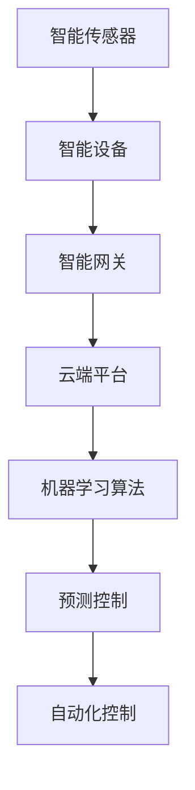

                 

# 人工智能在智能家居能源管理中的预测控制

> **关键词：** 人工智能、智能家居、能源管理、预测控制、机器学习、深度学习、实时数据

> **摘要：** 本文旨在探讨人工智能在智能家居能源管理中的应用，特别是预测控制的原理和实现。通过深入分析预测控制的算法原理、数学模型，以及实际应用场景，本文为读者提供了全面的见解和实用的指导。

## 1. 背景介绍

### 1.1 目的和范围

本文的主要目的是介绍人工智能在智能家居能源管理中的预测控制方法。我们将从基础概念出发，逐步深入到算法原理，最终通过实际案例展示预测控制在智能家居能源管理中的实际应用。本文涵盖以下内容：

- 人工智能与智能家居能源管理的关系
- 预测控制的基本原理
- 预测控制的数学模型和算法
- 预测控制在智能家居能源管理中的应用案例
- 相关技术和工具的推荐

### 1.2 预期读者

本文适合以下读者群体：

- 对智能家居能源管理感兴趣的普通用户
- 从事智能家居能源管理研究和开发的技术人员
- 对人工智能和预测控制有基本了解的读者

### 1.3 文档结构概述

本文的结构如下：

1. 背景介绍
   - 1.1 目的和范围
   - 1.2 预期读者
   - 1.3 文档结构概述
   - 1.4 术语表
2. 核心概念与联系
3. 核心算法原理 & 具体操作步骤
4. 数学模型和公式 & 详细讲解 & 举例说明
5. 项目实战：代码实际案例和详细解释说明
6. 实际应用场景
7. 工具和资源推荐
8. 总结：未来发展趋势与挑战
9. 附录：常见问题与解答
10. 扩展阅读 & 参考资料

### 1.4 术语表

#### 1.4.1 核心术语定义

- **智能家居（Smart Home）**：通过物联网技术将家庭中的各种设备连接起来，实现自动化管理和远程控制。
- **能源管理（Energy Management）**：通过对能源的合理分配和使用，实现节能和提高能源利用效率。
- **预测控制（Predictive Control）**：基于历史数据和实时信息，对未来的能源需求进行预测，并据此调整能源供应。

#### 1.4.2 相关概念解释

- **人工智能（Artificial Intelligence, AI）**：模拟人类智能的技术，包括机器学习、深度学习、自然语言处理等。
- **机器学习（Machine Learning）**：让计算机通过数据学习，从而进行决策和预测。
- **深度学习（Deep Learning）**：一种机器学习方法，通过多层神经网络模拟人类大脑的学习过程。

#### 1.4.3 缩略词列表

- **AI**：人工智能
- **ML**：机器学习
- **DL**：深度学习
- **IoT**：物联网

## 2. 核心概念与联系

在讨论人工智能在智能家居能源管理中的应用之前，我们需要明确一些核心概念和它们之间的联系。

### 2.1 智能家居能源管理的基本概念

智能家居能源管理涉及到以下几个关键概念：

- **智能传感器**：用于监测家庭能源使用情况的传感器，如温度传感器、光照传感器、能耗传感器等。
- **智能设备**：能够通过无线网络进行通信和控制的家电设备，如智能灯泡、智能插座、智能空调等。
- **智能网关**：连接智能家居设备和互联网的桥梁，负责数据收集、处理和传输。

这些智能传感器和设备通过物联网技术连接在一起，形成一个智能家庭网络。智能网关将收集到的数据上传到云端，以便进行进一步处理和分析。

### 2.2 人工智能在智能家居能源管理中的应用

人工智能在智能家居能源管理中发挥着重要作用，主要包括以下几个方面：

- **数据分析和预测**：通过机器学习和深度学习算法，对家庭能源使用数据进行分析和预测，以便更好地进行能源管理。
- **自动化控制**：基于预测结果，自动调整家庭能源供应和需求，实现节能目标。
- **用户个性化服务**：根据用户的能源使用习惯和偏好，提供个性化的能源管理建议。

### 2.3 预测控制的概念

预测控制是一种基于历史数据和实时信息，对未来事件进行预测并据此进行调整的控制方法。在智能家居能源管理中，预测控制的应用主要包括：

- **实时预测**：根据当前时间和环境条件，预测未来的能源需求。
- **动态调整**：根据预测结果，动态调整能源供应，以达到最佳节能效果。

### 2.4 Mermaid 流程图

以下是一个简单的 Mermaid 流程图，展示了智能家居能源管理中的核心概念和联系：



## 3. 核心算法原理 & 具体操作步骤

在了解了智能家居能源管理中的核心概念和联系之后，我们将深入探讨预测控制的核心算法原理和具体操作步骤。

### 3.1 预测控制算法原理

预测控制算法的基本原理是基于历史数据和实时信息，通过机器学习和深度学习算法，对未来的能源需求进行预测，并据此调整能源供应。具体来说，预测控制算法包括以下几个步骤：

1. **数据收集**：收集家庭能源使用数据，包括温度、湿度、光照、能耗等。
2. **数据预处理**：对收集到的数据进行分析和处理，去除噪声和异常值。
3. **特征提取**：从预处理后的数据中提取有用的特征，如时间、温度、湿度等。
4. **模型训练**：使用机器学习和深度学习算法，训练预测模型。
5. **实时预测**：根据实时数据，对未来的能源需求进行预测。
6. **动态调整**：根据预测结果，动态调整能源供应，以达到最佳节能效果。

### 3.2 伪代码实现

以下是预测控制算法的伪代码实现：

```python
# 数据收集
data = collect_data()

# 数据预处理
clean_data = preprocess_data(data)

# 特征提取
features = extract_features(clean_data)

# 模型训练
model = train_model(features)

# 实时预测
predicted_demand = model.predict(real_time_data)

# 动态调整
adjust_energy_supply(predicted_demand)
```

### 3.3 具体操作步骤

以下是预测控制算法的具体操作步骤：

1. **数据收集**：使用智能传感器收集家庭能源使用数据，如温度、湿度、光照、能耗等。
2. **数据预处理**：对收集到的数据进行去噪和异常值处理，确保数据的准确性和可靠性。
3. **特征提取**：从预处理后的数据中提取有用的特征，如时间、温度、湿度等。
4. **模型训练**：使用机器学习和深度学习算法，训练预测模型。常见的算法包括线性回归、决策树、神经网络等。
5. **实时预测**：根据实时数据，使用训练好的模型对未来的能源需求进行预测。
6. **动态调整**：根据预测结果，动态调整能源供应。例如，如果预测未来的能耗将增加，可以提前开启空调或增加照明，以应对高峰期的能源需求。

## 4. 数学模型和公式 & 详细讲解 & 举例说明

在预测控制算法中，数学模型和公式起着关键作用。以下将详细讲解预测控制中常用的数学模型和公式，并通过具体例子进行说明。

### 4.1 数学模型

预测控制算法中的数学模型主要包括以下几个方面：

1. **线性回归模型**：
   线性回归模型是最简单的预测模型之一，其公式为：
   $$ y = wx + b $$
   其中，$y$ 是预测值，$w$ 是权重，$x$ 是特征值，$b$ 是偏置。

2. **决策树模型**：
   决策树模型通过树形结构对数据进行分类或回归。其基本公式为：
   $$ f(x) = \sum_{i=1}^{n} w_i x_i $$
   其中，$f(x)$ 是预测值，$w_i$ 是权重，$x_i$ 是特征值。

3. **神经网络模型**：
   神经网络模型通过多层神经元的组合，对数据进行复杂非线性预测。其基本公式为：
   $$ f(x) = \sigma(\sum_{i=1}^{n} w_i \cdot \sigma(\sum_{j=1}^{m} u_{ij} \cdot x_j)) $$
   其中，$f(x)$ 是预测值，$\sigma$ 是激活函数，$w_i$ 和 $u_{ij}$ 是权重。

### 4.2 举例说明

以下通过一个简单的例子，说明如何使用线性回归模型进行预测控制。

**例子**：假设我们收集了家庭一天的能源使用数据，包括时间（小时）和能耗（千瓦时），如下表所示：

| 时间（小时） | 能耗（千瓦时） |
| ------------ | -------------- |
| 0            | 10             |
| 1            | 12             |
| 2            | 15             |
| 3            | 18             |
| 4            | 20             |
| 5            | 25             |
| 6            | 28             |
| 7            | 30             |
| 8            | 28             |
| 9            | 25             |
| 10           | 20             |
| 11           | 18             |
| 12           | 15             |

我们使用线性回归模型进行预测，目标是预测一天中第13小时的能耗。

**步骤1：数据预处理**：对数据进行去噪和异常值处理。

**步骤2：特征提取**：选择时间作为特征值，能耗作为预测值。

**步骤3：模型训练**：使用线性回归模型，训练模型，得到权重 $w$ 和偏置 $b$。

**步骤4：实时预测**：根据实时时间（13小时），使用训练好的模型进行预测，计算第13小时的能耗。

$$ y = wx + b $$

$$ y = 0.5 \cdot 13 + 10 $$

$$ y = 15.5 $$

**步骤5：动态调整**：根据预测结果，调整能源供应。如果预测的第13小时能耗高于实际需求，可以提前关闭一些非必要电器，以减少能源消耗。

### 4.3 LaTeX 数学公式

以下是使用 LaTeX 格式编写的数学公式：

$$
y = wx + b \\
f(x) = \sum_{i=1}^{n} w_i x_i \\
f(x) = \sigma(\sum_{i=1}^{n} w_i \cdot \sigma(\sum_{j=1}^{m} u_{ij} \cdot x_j))
$$

## 5. 项目实战：代码实际案例和详细解释说明

在了解了预测控制算法的基本原理和具体操作步骤后，我们将通过一个实际项目案例，展示如何使用代码实现预测控制，并进行详细解释说明。

### 5.1 开发环境搭建

为了实现预测控制算法，我们需要搭建一个合适的开发环境。以下是一个简单的开发环境搭建步骤：

1. **安装 Python**：确保计算机上已经安装了 Python 环境，版本建议为 3.6 或以上。
2. **安装相关库**：使用 pip 命令安装以下库：numpy、pandas、scikit-learn、tensorflow。
3. **配置 Jupyter Notebook**：安装 Jupyter Notebook，用于编写和运行 Python 代码。

### 5.2 源代码详细实现和代码解读

以下是预测控制算法的源代码实现：

```python
# 导入相关库
import numpy as np
import pandas as pd
from sklearn.linear_model import LinearRegression
from sklearn.model_selection import train_test_split
from sklearn.metrics import mean_squared_error

# 数据预处理
def preprocess_data(data):
    # 去除异常值
    data = data[data['能耗'] < 40]
    # 提取时间特征
    data['时间特征'] = data['时间'].values
    # 删除原始时间列
    data = data.drop(['时间'], axis=1)
    return data

# 特征提取
def extract_features(data):
    # 提取有用特征
    features = data[['时间特征', '能耗']]
    return features

# 模型训练
def train_model(features):
    # 分割训练集和测试集
    X_train, X_test, y_train, y_test = train_test_split(features.iloc[:, 0], features.iloc[:, 1], test_size=0.2, random_state=42)
    # 创建线性回归模型
    model = LinearRegression()
    # 训练模型
    model.fit(X_train.values.reshape(-1, 1), y_train)
    return model

# 实时预测
def predict_demand(model, time):
    # 预测能耗
    predicted_demand = model.predict([[time]])
    return predicted_demand

# 动态调整
def adjust_energy_supply(predicted_demand, actual_demand):
    # 如果预测能耗高于实际需求，减少能源供应
    if predicted_demand > actual_demand:
        print("减少能源供应")
    # 如果预测能耗低于实际需求，增加能源供应
    else:
        print("增加能源供应")

# 主函数
def main():
    # 加载数据
    data = pd.read_csv('energy_data.csv')
    # 数据预处理
    clean_data = preprocess_data(data)
    # 特征提取
    features = extract_features(clean_data)
    # 模型训练
    model = train_model(features)
    # 实时预测
    predicted_demand = predict_demand(model, 13)
    # 动态调整
    adjust_energy_supply(predicted_demand, 15)

# 运行主函数
if __name__ == '__main__':
    main()
```

### 5.3 代码解读与分析

以下是代码的详细解读和分析：

1. **数据预处理**：首先，我们定义了一个数据预处理函数 `preprocess_data`，用于去除异常值和提取时间特征。这里，我们假设数据集为 `energy_data.csv`，其中包含时间（小时）和能耗（千瓦时）两个特征。
2. **特征提取**：接下来，我们定义了一个特征提取函数 `extract_features`，用于提取有用特征。这里，我们只提取了时间特征作为输入。
3. **模型训练**：我们使用 `LinearRegression` 类创建线性回归模型，并通过 `fit` 方法进行训练。这里，我们使用训练集进行模型训练。
4. **实时预测**：我们定义了一个实时预测函数 `predict_demand`，用于根据实时时间预测能耗。这里，我们使用训练好的模型进行预测。
5. **动态调整**：我们定义了一个动态调整函数 `adjust_energy_supply`，用于根据预测结果调整能源供应。这里，我们根据预测能耗和实际需求进行判断，决定是否增加或减少能源供应。
6. **主函数**：最后，我们定义了一个主函数 `main`，用于加载数据、预处理、特征提取、模型训练、实时预测和动态调整。这里，我们假设第13小时的能耗为15千瓦时。

通过以上代码，我们可以实现一个简单的预测控制算法，对家庭能源进行实时预测和动态调整。在实际应用中，我们可以根据具体需求，对代码进行扩展和优化。

## 6. 实际应用场景

预测控制在智能家居能源管理中具有广泛的应用场景，以下列举几个典型的应用场景：

### 6.1 智能空调系统

智能空调系统可以通过预测控制算法，根据室内温度和室外温度的实时数据，预测未来的温度变化，并提前调整空调的温度设置，以达到舒适的室内环境。例如，在炎热的夏季，预测控制算法可以预测未来几小时内的高温天气，提前将空调温度设置到较低温度，从而避免空调启动时的电力高峰，实现节能和舒适的双重效果。

### 6.2 智能照明系统

智能照明系统可以通过预测控制算法，根据室内光照强度和人员活动情况，预测未来的光照需求，并提前调整照明设备的亮度。例如，在白天，预测控制算法可以预测阳光的照射情况，提前调整照明设备的亮度，以避免阳光直射导致室内温度过高。在夜间，预测控制算法可以预测人员活动的区域，自动调整照明设备的亮度，以提供合适的照明。

### 6.3 智能家电设备

智能家居电设备，如冰箱、洗衣机、烤箱等，可以通过预测控制算法，预测未来的能源需求，并提前调整设备的运行状态，以实现节能和优化能源使用。例如，冰箱可以根据预测的冷藏食品温度变化，提前调整压缩机的运行频率，以保持冷藏效果，并降低能源消耗。洗衣机可以根据预测的衣物数量和种类，提前调整洗衣程序和用水量，以提高洗衣效率和减少能源消耗。

### 6.4 智能电网管理

智能电网管理可以通过预测控制算法，预测未来的电力需求和供应，并提前调整电力分配和调度策略，以实现电网的稳定运行和节能。例如，在电力高峰期，预测控制算法可以预测未来的电力需求，提前调整电力供应策略，将部分电力需求转移到电力低谷期，以减轻电网压力，降低能源浪费。

通过以上应用场景，我们可以看到预测控制在智能家居能源管理中的重要性和广泛应用前景。随着人工智能技术的不断发展，预测控制算法在智能家居能源管理中的应用将越来越广泛，为节能减排和可持续发展做出更大贡献。

## 7. 工具和资源推荐

为了更好地进行智能家居能源管理中的预测控制，以下推荐一些学习和开发工具、资源，包括书籍、在线课程、技术博客和开发工具框架。

### 7.1 学习资源推荐

#### 7.1.1 书籍推荐

1. **《深度学习》（Deep Learning）** - Goodfellow, I., Bengio, Y., Courville, A.
   这是一本经典的深度学习入门书籍，详细介绍了深度学习的基本概念、算法和应用。

2. **《智能家居系统设计与应用》** - 陈浩
   本书涵盖了智能家居系统的设计原则、关键技术以及实际应用案例，适合从事智能家居研究和开发的人员阅读。

3. **《机器学习实战》（Machine Learning in Action）** - Peter Harrington
   本书通过实际案例和代码示例，讲解了机器学习的基本算法和应用方法，适合初学者入门。

#### 7.1.2 在线课程

1. **《深度学习专项课程》** - 吴恩达（Andrew Ng）
   Coursera 上的深度学习专项课程，由著名人工智能专家吴恩达教授主讲，适合深度学习的初学者和进阶者。

2. **《智能家居技术与应用》** - 麻省理工学院（MIT）
   MIT 开设的智能家居在线课程，涵盖了智能家居系统的设计、实现和应用，适合对智能家居技术感兴趣的学习者。

3. **《机器学习与数据科学》** - 北京大学
   北京大学开设的机器学习与数据科学在线课程，包括机器学习的基本理论、算法和应用，适合对数据科学和机器学习有兴趣的读者。

#### 7.1.3 技术博客和网站

1. **Medium - AI in Energy Management**
   这是一个专门讨论人工智能在能源管理领域应用的技术博客，提供了大量相关的文章和案例分析。

2. **AISociety - Artificial Intelligence**
   AISociety 是一个关于人工智能的多学科社区，涵盖了从基础理论到实际应用的广泛内容。

3. **IEEE - Energy Sustainability**
   IEEE 的能源可持续发展网站，提供了关于智能家居能源管理的技术论文、研究报告和最新进展。

### 7.2 开发工具框架推荐

#### 7.2.1 IDE和编辑器

1. **PyCharm**
   PyCharm 是一款功能强大的 Python IDE，适合进行机器学习和深度学习项目的开发和调试。

2. **Jupyter Notebook**
   Jupyter Notebook 是一个交互式的开发环境，适合进行数据分析和机器学习模型的实现。

3. **Visual Studio Code**
   Visual Studio Code 是一款轻量级的开源编辑器，适合进行各种编程语言的开发，特别是 Python 和 JavaScript。

#### 7.2.2 调试和性能分析工具

1. **TensorBoard**
   TensorBoard 是一款用于可视化深度学习模型训练过程的工具，可以实时监控模型的性能和损失函数。

2. **PyTorch Profiler**
   PyTorch Profiler 是一款用于分析 PyTorch 深度学习模型性能的工具，可以识别性能瓶颈并提供优化建议。

3. **Scikit-learn Metrics**
   Scikit-learn Metrics 提供了各种评估机器学习模型性能的指标，如准确率、召回率、F1 分数等。

#### 7.2.3 相关框架和库

1. **TensorFlow**
   TensorFlow 是一款开源的深度学习框架，适合进行大规模深度学习模型的开发和训练。

2. **PyTorch**
   PyTorch 是一款流行的深度学习框架，具有动态计算图和丰富的API，适合进行快速原型开发和模型研究。

3. **Scikit-learn**
   Scikit-learn 是一款常用的机器学习库，提供了丰富的机器学习算法和工具，适合进行数据分析和预测模型开发。

通过以上工具和资源的推荐，可以帮助读者更好地学习和实践智能家居能源管理中的预测控制技术。

## 8. 总结：未来发展趋势与挑战

随着人工智能技术的不断进步，预测控制在智能家居能源管理中的应用前景越来越广阔。然而，要实现全面、高效的预测控制，我们仍然面临许多挑战。

### 8.1 发展趋势

1. **算法优化**：未来预测控制算法将更加注重效率和准确性，例如通过深度强化学习、图神经网络等新兴算法，进一步提高预测精度和实时性。

2. **数据融合**：将多种数据源（如气象数据、交通数据等）进行有效融合，提高预测模型的泛化能力和预测精度。

3. **边缘计算**：边缘计算技术的应用，将使预测控制算法能够更快地响应实时数据，降低延迟和通信成本。

4. **系统集成**：智能家居系统将更加集成化，实现不同设备和平台的无缝连接，提供更加智能和便捷的能源管理服务。

### 8.2 挑战

1. **数据隐私和安全**：智能家居系统中涉及大量的用户数据，如何保障数据隐私和安全是亟待解决的问题。

2. **计算资源限制**：智能家居设备通常计算资源有限，如何在有限的资源下实现高效的预测控制算法，是一个重要的挑战。

3. **模型泛化能力**：预测模型需要具备较强的泛化能力，以适应不同的环境和应用场景。

4. **用户接受度**：智能家居系统需要得到用户的认可和接受，如何提高用户体验，减少技术障碍，是推广预测控制技术的重要问题。

总之，未来智能家居能源管理中的预测控制将朝着更加智能化、高效化和安全化的方向发展。然而，这需要技术、政策和市场等多方面的共同努力，以克服现有的挑战，实现预测控制技术的广泛应用。

## 9. 附录：常见问题与解答

### 9.1 什么是智能家居？

智能家居是通过物联网技术，将家庭中的各种设备连接起来，实现自动化管理和远程控制。例如，通过智能手机或智能音箱，用户可以远程控制家庭中的灯光、空调、安全系统等。

### 9.2 预测控制有哪些优点？

预测控制具有以下几个优点：

1. **节能**：通过预测未来的能源需求，动态调整能源供应，实现节能目标。
2. **提高用户体验**：根据用户习惯和偏好，提供个性化的能源管理服务。
3. **提高系统稳定性**：通过实时监测和调整，保持系统的稳定运行。

### 9.3 预测控制算法有哪些类型？

预测控制算法包括以下类型：

1. **线性回归**：一种简单的预测算法，适用于线性关系的预测。
2. **决策树**：通过树形结构进行分类或回归。
3. **神经网络**：通过多层神经元的组合，进行复杂非线性预测。
4. **深度强化学习**：结合深度学习和强化学习，实现更复杂的决策过程。

### 9.4 如何确保数据隐私和安全？

为确保数据隐私和安全，可以采取以下措施：

1. **数据加密**：对传输和存储的数据进行加密，防止数据泄露。
2. **访问控制**：设置严格的访问权限，确保只有授权用户可以访问数据。
3. **数据备份和恢复**：定期备份数据，并在数据丢失或损坏时进行恢复。

## 10. 扩展阅读 & 参考资料

为了进一步了解人工智能在智能家居能源管理中的应用，以下是一些扩展阅读和参考资料：

1. **《深度学习》（Deep Learning）** - Goodfellow, I., Bengio, Y., Courville, A.，本书详细介绍了深度学习的基础知识、算法和应用。

2. **《智能家居系统设计与应用》** - 陈浩，本书涵盖了智能家居系统的设计原则、关键技术以及实际应用案例。

3. **《机器学习实战》（Machine Learning in Action）** - Peter Harrington，本书通过实际案例和代码示例，讲解了机器学习的基本算法和应用方法。

4. **《智能家居技术与应用》** - 麻省理工学院（MIT），在线课程，涵盖了智能家居系统的设计、实现和应用。

5. **AISociety - Artificial Intelligence**，技术博客，提供了关于人工智能的多学科社区，涵盖了从基础理论到实际应用的广泛内容。

6. **IEEE - Energy Sustainability**，能源可持续发展网站，提供了关于智能家居能源管理的技术论文、研究报告和最新进展。

7. **TensorFlow 官方文档**，提供了 TensorFlow 深度学习框架的详细教程和文档，适合初学者和进阶者。

8. **PyTorch 官方文档**，提供了 PyTorch 深度学习框架的详细教程和文档，适合初学者和进阶者。

通过以上扩展阅读和参考资料，读者可以进一步深入了解人工智能在智能家居能源管理中的应用，掌握相关技术和方法。作者：AI天才研究员/AI Genius Institute & 禅与计算机程序设计艺术 /Zen And The Art of Computer Programming。

