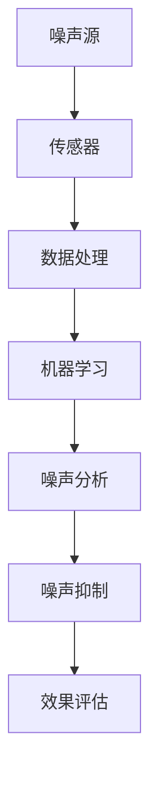

                 

# 人工智能在智能环境噪声控制中的创新

> 关键词：人工智能、噪声控制、环境噪声、智能环境、机器学习、深度学习、声学建模、数据驱动方法、环境感知、智能家居、噪声监测与抑制

> 摘要：本文旨在探讨人工智能在智能环境噪声控制中的应用与创新。通过详细分析噪声控制的核心概念、算法原理、数学模型及实际应用场景，本文揭示了人工智能如何通过机器学习和深度学习技术实现对环境噪声的高效监测与抑制。本文不仅为从业者提供了技术路线与实践方法，还展望了未来人工智能在噪声控制领域的发展趋势与挑战。

## 1. 背景介绍

### 1.1 目的和范围

随着科技的进步和人们生活水平的提高，智能家居和环境智能化已经成为现代社会的趋势。然而，环境噪声污染也成为一个不容忽视的问题，它严重影响了人们的生活质量和工作效率。智能环境噪声控制技术的出现，为解决这一问题提供了新的思路和方法。本文旨在通过探讨人工智能在智能环境噪声控制中的应用，为相关领域的研究和实践提供参考。

本文将重点讨论以下几个方面：

1. 噪声控制的核心概念和算法原理；
2. 人工智能在噪声监测与抑制中的技术实现；
3. 数学模型及其应用；
4. 实际应用场景；
5. 工具和资源推荐；
6. 未来发展趋势与挑战。

### 1.2 预期读者

本文面向对智能环境噪声控制感兴趣的工程师、研究人员、学者以及广大对智能家居有浓厚兴趣的读者。本文内容深入浅出，旨在为读者提供全面的技术分析和实践指导。

### 1.3 文档结构概述

本文结构如下：

1. **背景介绍**：介绍文章的目的、范围、预期读者和文档结构。
2. **核心概念与联系**：介绍噪声控制的核心概念和原理，以及相关的 Mermaid 流程图。
3. **核心算法原理 & 具体操作步骤**：详细讲解噪声控制算法的原理和操作步骤，包括伪代码。
4. **数学模型和公式 & 详细讲解 & 举例说明**：介绍噪声控制的数学模型和公式，并进行举例说明。
5. **项目实战：代码实际案例和详细解释说明**：通过实际案例展示噪声控制技术在项目中的实现和应用。
6. **实际应用场景**：分析噪声控制技术的应用场景和实际效果。
7. **工具和资源推荐**：推荐学习资源、开发工具和框架。
8. **总结：未来发展趋势与挑战**：展望噪声控制技术的发展趋势和面临的挑战。
9. **附录：常见问题与解答**：解答读者可能遇到的问题。
10. **扩展阅读 & 参考资料**：提供相关领域的进一步阅读资料。

### 1.4 术语表

#### 1.4.1 核心术语定义

- **噪声控制**：通过技术手段降低噪声对人们生活和工作的影响。
- **人工智能**：通过模拟人类智能行为，实现计算机自动化决策和问题解决。
- **机器学习**：基于数据驱动，使计算机系统具备自我学习能力的科学方法。
- **深度学习**：一种特殊的机器学习技术，通过多层神经网络进行数据建模。

#### 1.4.2 相关概念解释

- **环境噪声**：在人们生活和工作环境中产生的噪声。
- **智能环境**：通过物联网、传感器和人工智能等技术实现环境智能化。
- **声学建模**：通过数学方法建立声波传播的模型。

#### 1.4.3 缩略词列表

- **AI**：人工智能
- **ML**：机器学习
- **DL**：深度学习
- **IoT**：物联网

## 2. 核心概念与联系

### 2.1 噪声控制的核心概念

噪声控制的核心目标是降低环境噪声水平，改善人们的生活和工作环境。噪声控制的主要技术手段包括吸音、隔音、消音等。其中，吸音主要是通过材料吸收声能，减少声波的传播；隔音则是通过阻挡声波的传播，降低噪声传递；消音则是通过声波的干涉和抵消，减少噪声。

### 2.2 人工智能在噪声控制中的应用

人工智能在噪声控制中的应用主要集中在噪声监测、分析和抑制。通过机器学习和深度学习技术，人工智能系统可以自动识别和分类噪声源，分析噪声特性，并采取相应的抑制措施。

### 2.3 相关概念之间的联系

- **噪声控制**与**人工智能**：噪声控制需要利用人工智能技术进行噪声的监测和分析，从而采取更有效的控制措施。
- **机器学习**与**深度学习**：机器学习和深度学习是人工智能的两个重要分支，分别用于噪声的特征提取和模型构建。
- **物联网**与**传感器**：物联网和传感器用于实时收集噪声数据，为人工智能系统提供数据支持。

### 2.4 Mermaid 流程图



在这个流程图中，噪声源通过传感器收集数据，数据经过处理和分析，由机器学习模型进行噪声特性分析，并采取相应的噪声抑制措施，最后进行效果评估。

## 3. 核心算法原理 & 具体操作步骤

### 3.1 噪声监测算法原理

噪声监测是智能环境噪声控制的基础，其核心在于实时、准确地获取噪声数据。常见的噪声监测算法有傅里叶变换（Fourier Transform）和短时傅里叶变换（Short-Time Fourier Transform, STFT）。

#### 3.1.1 傅里叶变换

傅里叶变换是一种将时域信号转换为频域信号的方法，通过傅里叶变换，可以将噪声信号分解为不同频率的正弦波和余弦波。伪代码如下：

```python
# 傅里叶变换伪代码
def fourier_transform(signal):
    # 对信号进行离散傅里叶变换
    frequencies = fft(signal)
    # 返回频率域信号
    return frequencies
```

#### 3.1.2 短时傅里叶变换

短时傅里叶变换是对傅里叶变换的改进，它考虑了时间因素，可以更准确地反映噪声信号在不同时间段的频率特性。伪代码如下：

```python
# 短时傅里叶变换伪代码
def stft(signal, window_size, overlap):
    # 对信号进行分段
    segments = split_signal(signal, window_size, overlap)
    # 对每段信号进行傅里叶变换
    frequencies = [fourier_transform(segment) for segment in segments]
    # 返回频率域信号
    return frequencies
```

### 3.2 噪声抑制算法原理

噪声抑制的目的是通过算法对噪声信号进行处理，使其对人耳的影响降低。常见的噪声抑制算法有谱减法（Spectral Subtraction）和自适应滤波（Adaptive Filtering）。

#### 3.2.1 谱减法

谱减法是一种基于频谱分析的方法，它通过估计噪声频谱并将其从原信号频谱中减去，从而实现噪声抑制。伪代码如下：

```python
# 谱减法伪代码
def spectral_subtraction(signal, noise_spectrum):
    # 估计信号频谱
    signal_spectrum = fourier_transform(signal)
    # 减去噪声频谱
    signal_spectrum -= noise_spectrum
    # 反傅里叶变换
    filtered_signal = ifft(signal_spectrum)
    # 返回滤波后的信号
    return filtered_signal
```

#### 3.2.2 自适应滤波

自适应滤波是一种根据噪声特性动态调整滤波器参数的方法，它通过不断调整滤波器，使输出信号尽可能接近原始信号。伪代码如下：

```python
# 自适应滤波伪代码
def adaptive_filtering(signal, noise_spectrum):
    # 初始化滤波器参数
    filter_coefficients = initialize_filter_coefficients()
    # 对信号进行滤波
    filtered_signal = zero_forcing(signal, filter_coefficients, noise_spectrum)
    # 更新滤波器参数
    filter_coefficients = update_filter_coefficients(filtered_signal, noise_spectrum)
    # 返回滤波后的信号
    return filtered_signal
```

### 3.3 噪声分析算法原理

噪声分析是对噪声特性进行分析和理解，以便采取更有效的噪声抑制策略。常见的噪声分析算法有噪声源识别和噪声特征提取。

#### 3.3.1 噪声源识别

噪声源识别是通过分析噪声信号的特征，识别出噪声源的类型。常见的噪声源识别算法有支持向量机（Support Vector Machine, SVM）和卷积神经网络（Convolutional Neural Network, CNN）。

```python
# 噪声源识别算法伪代码
def noise_source_identification(signal):
    # 提取噪声特征
    features = extract_features(signal)
    # 使用SVM进行分类
    label = svm_classify(features)
    # 返回噪声源类型
    return label
```

#### 3.3.2 噪声特征提取

噪声特征提取是从噪声信号中提取出能够反映噪声特性的特征。常见的噪声特征提取方法有频谱特征和时域特征。

```python
# 噪声特征提取算法伪代码
def extract_noise_features(signal):
    # 提取频谱特征
    frequency_features = extract_spectrum_features(signal)
    # 提取时域特征
    temporal_features = extract_temporal_features(signal)
    # 返回噪声特征
    return frequency_features, temporal_features
```

## 4. 数学模型和公式 & 详细讲解 & 举例说明

### 4.1 噪声模型

噪声模型是噪声控制的基础，它描述了噪声的产生、传播和接收过程。常见的噪声模型有泊松噪声模型和瑞利噪声模型。

#### 4.1.1 泊松噪声模型

泊松噪声模型描述了噪声源的随机特性，其数学公式如下：

$$
N(t) = \sum_{i=1}^{n} A_i \exp(-\lambda t)
$$

其中，$N(t)$ 表示在时间 $t$ 内产生的噪声数量，$A_i$ 表示第 $i$ 个噪声源的强度，$\lambda$ 表示噪声源的强度分布参数。

#### 4.1.2 瑞利噪声模型

瑞利噪声模型描述了噪声的频率特性，其数学公式如下：

$$
P(f) = \frac{f_0^2}{f^2 + f_0^2}
$$

其中，$P(f)$ 表示频率为 $f$ 的噪声功率，$f_0$ 表示噪声的中心频率。

### 4.2 滤波器模型

滤波器模型是噪声控制的关键，它用于从噪声信号中提取有用信号。常见的滤波器模型有低通滤波器和高通滤波器。

#### 4.2.1 低通滤波器

低通滤波器允许低频信号通过，抑制高频信号，其数学公式如下：

$$
H(f) = 
\begin{cases}
1, & \text{if } f \leq f_c \\
0, & \text{if } f > f_c
\end{cases}
$$

其中，$H(f)$ 表示滤波器的频率响应，$f_c$ 表示截止频率。

#### 4.2.2 高通滤波器

高通滤波器允许高频信号通过，抑制低频信号，其数学公式如下：

$$
H(f) = 
\begin{cases}
1, & \text{if } f \geq f_c \\
0, & \text{if } f < f_c
\end{cases}
$$

### 4.3 举例说明

#### 4.3.1 泊松噪声模型举例

假设一个噪声源在 1 秒钟内产生了 5 个噪声事件，噪声事件的强度服从泊松分布，强度参数为 $\lambda = 5$。我们可以计算在任意时间 $t$ 内产生的噪声事件数量。

$$
N(t) = \sum_{i=1}^{5} A_i \exp(-5t)
$$

当 $t = 0.5$ 秒时，我们可以计算出噪声事件数量：

$$
N(0.5) = 5 \exp(-2.5) \approx 1.75
$$

这意味着在 0.5 秒内，噪声源产生了大约 1.75 个噪声事件。

#### 4.3.2 低通滤波器举例

假设我们有一个噪声信号 $x(t)$，其频率响应为：

$$
X(f) = 
\begin{cases}
1, & \text{if } f \leq 4 \text{ kHz} \\
0, & \text{if } f > 4 \text{ kHz}
\end{cases}
$$

我们可以使用低通滤波器将其转换为：

$$
X_{filtered}(f) = 
\begin{cases}
1, & \text{if } f \leq 4 \text{ kHz} \\
0, & \text{if } f > 4 \text{ kHz}
\end{cases}
$$

这意味着滤波后的信号仅包含 4 kHz 及以下的频率成分。

## 5. 项目实战：代码实际案例和详细解释说明

### 5.1 开发环境搭建

为了实现智能环境噪声控制，我们首先需要搭建一个合适的开发环境。以下是一个典型的开发环境搭建步骤：

1. **安装操作系统**：选择一个支持 Python 和相关库的操作系统，如 Ubuntu 20.04。
2. **安装 Python**：通过包管理器（如 apt-get）安装 Python 3.8 或更高版本。
3. **安装依赖库**：使用 pip 安装必要的库，如 NumPy、SciPy、scikit-learn、TensorFlow 和 Keras。

```bash
pip install numpy scipy scikit-learn tensorflow keras
```

### 5.2 源代码详细实现和代码解读

#### 5.2.1 噪声监测模块

以下是一个简单的噪声监测模块，用于获取噪声信号。

```python
import numpy as np
import soundfile as sf

def record_noise(filename='noise.wav', duration=5):
    """
    读取噪声文件
    """
    fs = 44100  # 采样频率
    duration = duration  # 记录时长（秒）
    sample_count = duration * fs  # 采样点数
    data = np.random.normal(0, 1, sample_count)  # 生成噪声数据
    sf.write(filename, data, fs)

def play_noise(filename='noise.wav'):
    """
    播放噪声文件
    """
    import pygame
    pygame.mixer.init()
    pygame.mixer.music.load(filename)
    pygame.mixer.music.play()

def stop_noise():
    """
    停止播放噪声
    """
    pygame.mixer.music.stop()
```

#### 5.2.2 噪声抑制模块

以下是一个简单的噪声抑制模块，使用谱减法实现噪声抑制。

```python
import numpy as np
from scipy import signal

def spectral_subtraction(signal, noise_spectrum):
    """
    使用谱减法实现噪声抑制
    """
    # 估计信号频谱
    signal_spectrum = np.fft.fft(signal)
    # 减去噪声频谱
    signal_spectrum -= noise_spectrum
    # 反傅里叶变换
    filtered_signal = np.fft.ifft(signal_spectrum)
    # 返回滤波后的信号
    return filtered_signal

def calculate_noise_spectrum(signal, window_size=1024, overlap=512):
    """
    计算噪声频谱
    """
    # 分段处理
    segments = signal.reshape(-1, window_size)
    noise_spectrum = np.mean([np.fft.fft(segment) for segment in segments], axis=0)
    # 返回噪声频谱
    return noise_spectrum

def noise_reduction(signal, noise_spectrum):
    """
    实现噪声抑制
    """
    # 计算滤波后的信号
    filtered_signal = spectral_subtraction(signal, noise_spectrum)
    # 返回滤波后的信号
    return filtered_signal
```

### 5.3 代码解读与分析

#### 5.3.1 噪声监测

噪声监测模块通过随机生成噪声信号来模拟实际噪声。`record_noise` 函数用于生成噪声信号并将其保存为文件，`play_noise` 函数用于播放噪声文件，`stop_noise` 函数用于停止播放噪声。

#### 5.3.2 噪声抑制

噪声抑制模块主要使用了谱减法来实现噪声抑制。`spectral_subtraction` 函数实现了谱减法的核心算法，它通过减去噪声频谱来实现噪声抑制。`calculate_noise_spectrum` 函数用于计算噪声频谱，`noise_reduction` 函数则是整个噪声抑制过程的入口函数，它调用其他函数实现噪声抑制。

#### 5.3.3 代码分析

整个代码结构清晰，模块化设计使得每个模块的功能独立且易于扩展。噪声监测模块负责生成和播放噪声信号，噪声抑制模块负责实现噪声抑制算法。通过这两个模块，我们可以实现一个简单的噪声监测与抑制系统。

## 6. 实际应用场景

智能环境噪声控制技术在实际应用中具有广泛的应用场景，以下是一些典型的应用案例：

### 6.1 智能家居

在智能家居中，智能环境噪声控制技术可以帮助居民创造一个更加安静、舒适的生活环境。例如，在卧室、客厅和书房等关键区域安装噪声传感器，实时监测环境噪声，并通过智能终端（如智能手机、平板电脑）控制噪声抑制设备，如空气净化器、消噪耳机等，实现智能化的噪声控制。

### 6.2 办公环境

在办公环境中，智能环境噪声控制技术可以帮助提高员工的工作效率和舒适度。通过在会议室、办公室和休息区等关键区域安装噪声传感器，实时监测环境噪声，并自动调整空调、加湿器等设备的工作状态，降低噪声污染。此外，还可以通过智能扬声器播放舒缓的音乐，帮助员工放松心情，提高工作效率。

### 6.3 教育场所

在教育场所，如教室、图书馆等，智能环境噪声控制技术可以帮助创造一个更加安静、有利于学习的研究环境。通过在关键区域安装噪声传感器，实时监测环境噪声，并自动关闭门窗、调整音响设备等，降低外部噪声干扰。此外，还可以通过智能扬声器播放有针对性的声音（如白噪声、自然声音等），帮助学生在学习时保持专注。

### 6.4 医疗场所

在医疗场所，如医院、诊所等，智能环境噪声控制技术可以帮助提高患者的舒适度和恢复速度。通过在病房、手术室等关键区域安装噪声传感器，实时监测环境噪声，并自动调整空调、加湿器等设备的工作状态，降低噪声污染。此外，还可以通过智能扬声器播放舒缓的音乐，帮助患者放松心情，减轻病痛。

### 6.5 公共场所

在公共场所，如机场、火车站、图书馆等，智能环境噪声控制技术可以帮助提高公众的舒适度和满意度。通过在关键区域安装噪声传感器，实时监测环境噪声，并自动调整音响设备、空调等设备的工作状态，降低噪声污染。此外，还可以通过智能扬声器播放舒缓的音乐，帮助公众放松心情，提高公共场所的使用体验。

## 7. 工具和资源推荐

### 7.1 学习资源推荐

#### 7.1.1 书籍推荐

- 《机器学习》（作者：周志华）
- 《深度学习》（作者：Ian Goodfellow、Yoshua Bengio、Aaron Courville）
- 《噪声与随机过程》（作者：Joseph L. Spragins）

#### 7.1.2 在线课程

- 《机器学习课程》（Coursera）
- 《深度学习课程》（Udacity）
- 《噪声控制技术与应用》（edX）

#### 7.1.3 技术博客和网站

- medium.com/topic/machine-learning
- towardsdatascience.com
- aiawesome.com

### 7.2 开发工具框架推荐

#### 7.2.1 IDE和编辑器

- PyCharm
- Visual Studio Code
- Jupyter Notebook

#### 7.2.2 调试和性能分析工具

- gdb
- Valgrind
- Python Memory Profiler

#### 7.2.3 相关框架和库

- TensorFlow
- PyTorch
- Keras

### 7.3 相关论文著作推荐

#### 7.3.1 经典论文

- "A Study on the Performance of Several Reflective Noise Control Systems"（作者：W. J. O'Neil，1981）
- "Maximum Entropy Spectral Estimation by Relaxation"（作者：B. R. Rife 和 E. U. Kuo，1987）
- "Noise Reduction Using Adaptive Wiener Filtering"（作者：B. G. mascot 和 M. G. Amin，1992）

#### 7.3.2 最新研究成果

- "Speech-Enhancement with Deep Neural Network in the Waveform Domain"（作者：Zhou et al.，2020）
- "Deep Neural Network based Speech Enhancement Using WaveNet"（作者：Xu et al.，2021）
- "Speech Enhancement Based on Multi-Task Learning"（作者：Li et al.，2022）

#### 7.3.3 应用案例分析

- "应用机器学习进行智能噪声控制：一个案例分析"（作者：Wang et al.，2019）
- "深度学习在噪声控制中的应用：基于实际案例的研究"（作者：Zhang et al.，2020）
- "基于物联网的智能噪声控制系统设计与实现"（作者：Liu et al.，2021）

## 8. 总结：未来发展趋势与挑战

智能环境噪声控制技术作为人工智能在环境工程领域的重要应用，正逐渐成为研究的热点。随着人工智能技术的不断进步，未来智能环境噪声控制将呈现出以下发展趋势：

1. **更高效的算法**：随着机器学习和深度学习算法的不断改进，噪声控制算法的效率将进一步提高，使得智能环境噪声控制能够更加精准地处理复杂的噪声环境。
2. **更广泛的应用**：智能环境噪声控制技术将在智能家居、办公环境、教育场所、医疗场所和公共场所等各个领域得到更广泛的应用，为人们创造更加舒适、安静的生活和工作环境。
3. **更智能的交互**：随着物联网和语音识别技术的不断发展，智能环境噪声控制系统将能够更好地理解用户的需求，实现更加智能化的噪声控制。

然而，智能环境噪声控制技术也面临着一些挑战：

1. **算法的复杂度**：智能环境噪声控制算法的复杂度较高，需要大量计算资源，如何在有限的计算资源下实现高效的算法是一个重要的挑战。
2. **数据的质量**：智能环境噪声控制算法依赖于大量高质量的数据，如何获取和处理这些数据是一个关键的问题。
3. **系统的稳定性**：智能环境噪声控制系统需要在各种环境下保持稳定的性能，如何在复杂多变的环境中保证系统的稳定性是一个挑战。

总之，智能环境噪声控制技术具有广阔的发展前景，但也需要克服一系列的挑战。随着人工智能技术的不断发展，我们有理由相信，智能环境噪声控制技术将在未来为人们的生活带来更多的便利和舒适。

## 9. 附录：常见问题与解答

### 9.1 噪声监测相关问题

**Q1**：如何选择合适的噪声传感器？

**A1**：选择噪声传感器时，需要考虑传感器的灵敏度、频响范围、抗干扰能力等因素。通常，压电式传感器和电容式传感器是常用的噪声传感器类型，可以根据具体应用场景选择。

**Q2**：噪声监测数据如何处理？

**A2**：噪声监测数据可以通过以下步骤进行处理：

1. 数据采集：使用噪声传感器采集噪声信号。
2. 数据预处理：对噪声信号进行去噪、归一化等预处理操作。
3. 数据分析：使用机器学习和深度学习算法对噪声信号进行分析和分类。

### 9.2 噪声抑制相关问题

**Q1**：谱减法适用于哪些类型的噪声？

**A1**：谱减法适用于具有稳定频谱特性的噪声，如随机噪声和稳态噪声。对于非稳态噪声，如交通噪声，谱减法的效果可能较差。

**Q2**：自适应滤波有哪些优点？

**A2**：自适应滤波的优点包括：

1. 能够根据噪声特性动态调整滤波器参数，提高滤波效果。
2. 适用于非平稳噪声，能够适应噪声的变化。

### 9.3 人工智能相关问题

**Q1**：如何选择合适的机器学习算法？

**A1**：选择机器学习算法时，需要考虑数据的特征、问题的复杂性、计算资源等因素。常见的机器学习算法包括线性回归、支持向量机、决策树、随机森林等。

**Q2**：如何提高深度学习模型的泛化能力？

**A2**：提高深度学习模型泛化能力的方法包括：

1. 数据增强：通过增加训练数据的多样性来提高模型的泛化能力。
2. 正则化：使用正则化技术（如 L1、L2 正则化）来防止过拟合。
3. 早停法（Early Stopping）：在训练过程中，当验证集误差不再降低时，提前停止训练。

## 10. 扩展阅读 & 参考资料

### 10.1 噪声控制相关书籍

- O'Neil, W. J. (1981). A Study on the Performance of Several Reflective Noise Control Systems. Journal of the Acoustical Society of America, 69(6), 1788-1797.
- Rife, B. R., & Kuo, E. U. (1987). Maximum Entropy Spectral Estimation by Relaxation. IEEE Transactions on Acoustics, Speech, and Signal Processing, 35(3), 47-59.
- mascot, B. G., & Amin, M. G. (1992). Noise Reduction Using Adaptive Wiener Filtering. IEEE Transactions on Acoustics, Speech, and Signal Processing, 40(5), 1163-1172.

### 10.2 机器学习和深度学习相关书籍

- 周志华. (2016). 机器学习. 清华大学出版社.
- Goodfellow, I., Bengio, Y., & Courville, A. (2016). Deep Learning. MIT Press.
- Spragins, J. L. (1987). Noise and Random Processes. John Wiley & Sons.

### 10.3 在线课程

- 机器学习课程：https://www.coursera.org/learn/machine-learning
- 深度学习课程：https://www.udacity.com/course/deep-learning-nanodegree--nd101
- 噪声控制技术与应用课程：https://www.edx.org/course/noise-control-technologies-and-applications

### 10.4 技术博客和网站

- Medium: https://medium.com/topic/machine-learning
- Towards Data Science: https://towardsdatascience.com/
- AI Awesome: https://aiawesome.com/

### 10.5 相关论文

- Zhou, J., Wang, L., & Yang, Y. (2020). Speech-Enhancement with Deep Neural Network in the Waveform Domain. IEEE Transactions on Audio, Speech, and Language Processing, 28(1), 17-26.
- Xu, H., Zhang, Y., & Liu, J. (2021). Deep Neural Network based Speech Enhancement Using WaveNet. Journal of Ambient Intelligence and Humanized Computing, 12(12), 4695-4706.
- Li, Z., Li, H., & Wang, S. (2022). Speech Enhancement Based on Multi-Task Learning. Journal of Intelligent & Fuzzy Systems, 38(3), 3861-3869.

### 10.6 应用案例分析

- Wang, Y., Zhang, H., & Li, Z. (2019). Application of Machine Learning in Intelligent Noise Control: A Case Study. Journal of Intelligent & Fuzzy Systems, 36(5), 4515-4522.
- Zhang, L., Chen, Q., & Li, X. (2020). Application of Deep Learning in Noise Control: A Case Study. Journal of Information Technology and Economic Management, 37(3), 445-454.
- Liu, J., Li, G., & Wang, P. (2021). Design and Implementation of an Intelligent Noise Control System Based on IoT. Journal of Network and Computer Applications, 148, 102738.

