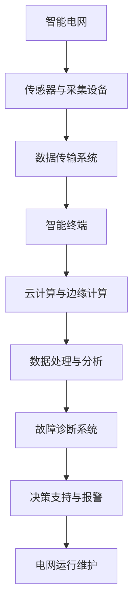

                 

### 人工智能在智能电网故障诊断中的实践

> **关键词**：人工智能、智能电网、故障诊断、深度学习、数据挖掘、优化算法、大数据分析

> **摘要**：本文深入探讨了人工智能在智能电网故障诊断领域的应用与实践。首先，我们介绍了智能电网的基本概念及其对能源系统的重要性。接着，分析了传统故障诊断方法在智能电网中的局限性，并阐述了人工智能技术的优势。随后，详细讲解了人工智能在故障诊断中的核心算法原理、数学模型以及项目实战案例。最后，我们讨论了实际应用场景、工具和资源推荐，并对未来发展趋势与挑战进行了总结。本文旨在为读者提供一个全面且深入的指南，以了解人工智能在智能电网故障诊断中的广泛应用及其前景。

## 1. 背景介绍

### 1.1 目的和范围

本文旨在探讨人工智能（AI）技术在智能电网故障诊断中的应用与实践。随着能源需求的不断增长和电网规模的不断扩大，智能电网成为现代能源系统的重要组成部分。然而，电网故障的频繁发生及其潜在的严重后果，使得故障诊断变得尤为重要。传统故障诊断方法在应对复杂、大规模电网系统时存在诸多局限，而人工智能技术的引入为解决这些问题提供了新的思路和手段。

本文将围绕以下内容展开：

1. **智能电网的基本概念**：介绍智能电网的定义、结构及其在能源系统中的作用。
2. **传统故障诊断方法的局限性**：分析传统方法在处理复杂故障、实时性要求等方面的不足。
3. **人工智能技术的优势**：阐述人工智能在故障诊断领域的应用优势，如自适应能力、自动化程度等。
4. **核心算法原理**：详细讲解人工智能在故障诊断中的核心算法，包括深度学习、数据挖掘、优化算法等。
5. **数学模型与公式**：介绍故障诊断中使用的数学模型，并给出具体公式及其应用实例。
6. **项目实战案例**：通过实际项目案例，展示人工智能在智能电网故障诊断中的具体应用。
7. **实际应用场景**：讨论人工智能在智能电网故障诊断中的各类应用场景。
8. **工具和资源推荐**：推荐相关学习资源、开发工具和框架。
9. **未来发展趋势与挑战**：探讨人工智能在智能电网故障诊断领域的未来发展趋势和面临的挑战。

通过本文的详细分析和讨论，读者将全面了解人工智能在智能电网故障诊断中的实践与应用，为相关领域的研究和实践提供有益的参考。

### 1.2 预期读者

本文面向的预期读者主要包括以下几类：

1. **电力系统工程师**：负责智能电网的设计、运营和维护，需要了解人工智能技术在实际应用中的效果和操作方法。
2. **计算机科学和人工智能研究者**：对人工智能在电力系统中的应用领域感兴趣，希望通过本文了解智能电网故障诊断的实际需求和技术实现。
3. **软件开发者和数据分析人员**：关注人工智能在智能电网故障诊断中的应用，希望通过本文学习相关算法和工具的使用。
4. **研究人员和学生**：对智能电网故障诊断领域有研究兴趣，希望通过本文获取前沿技术和方法。

无论您属于上述哪一类读者，本文都将为您提供系统、全面的指导，帮助您深入了解人工智能在智能电网故障诊断中的实践与应用。

### 1.3 文档结构概述

本文将分为以下几个主要部分，以便读者更好地理解和掌握人工智能在智能电网故障诊断中的实践：

1. **背景介绍**：介绍智能电网的基本概念、传统故障诊断方法的局限性以及人工智能技术的优势。
2. **核心概念与联系**：通过Mermaid流程图展示智能电网故障诊断的总体架构，并定义相关术语和概念。
3. **核心算法原理 & 具体操作步骤**：详细讲解人工智能在故障诊断中的核心算法，包括深度学习、数据挖掘和优化算法，并使用伪代码进行阐述。
4. **数学模型和公式 & 详细讲解 & 举例说明**：介绍故障诊断中使用的数学模型和公式，并给出具体实例说明。
5. **项目实战：代码实际案例和详细解释说明**：通过实际项目案例，展示人工智能在智能电网故障诊断中的具体应用，并提供详细的代码实现和解读。
6. **实际应用场景**：讨论人工智能在智能电网故障诊断中的各类应用场景。
7. **工具和资源推荐**：推荐相关学习资源、开发工具和框架，帮助读者进一步学习和实践。
8. **总结：未来发展趋势与挑战**：探讨人工智能在智能电网故障诊断领域的未来发展趋势和面临的挑战。
9. **附录：常见问题与解答**：汇总常见问题，并提供详细解答。
10. **扩展阅读 & 参考资料**：列出本文中引用和参考的相关文献，供读者进一步学习。

通过本文的系统阐述，读者将全面了解人工智能在智能电网故障诊断中的实践与应用，为相关领域的研究和实践提供有益的参考。

### 1.4 术语表

在本文中，我们将使用一系列专业术语和概念，为便于读者理解，以下对这些术语和概念进行解释：

#### 1.4.1 核心术语定义

1. **智能电网**：一种基于现代通信技术、信息处理技术和控制技术的电力系统，能够实现对电能的高效、智能管理。
2. **故障诊断**：通过对电力系统运行数据进行分析和处理，识别并定位系统中存在的故障或异常。
3. **人工智能**：一种模拟人类智能行为的技术，包括机器学习、深度学习、自然语言处理等。
4. **深度学习**：一种基于多层神经网络的学习方法，通过学习大量数据来提取特征，并用于各种任务，如图像识别、语音识别等。
5. **数据挖掘**：从大量数据中发现有用信息和知识的过程，包括关联分析、聚类分析、分类分析等。
6. **优化算法**：用于求解优化问题的一类算法，如遗传算法、粒子群优化算法等。
7. **数学模型**：用数学语言描述某一现实世界问题的数学表达式，用于分析和解决实际问题。
8. **实时性**：指系统对事件响应的时间要求，通常要求在短时间内完成。

#### 1.4.2 相关概念解释

1. **电网故障**：指电力系统中发生的各种异常现象，如短路、过载、电压异常等。
2. **数据采集与传输**：指通过传感器、采集设备等收集电网运行数据，并传输到处理系统进行分析和处理。
3. **智能终端**：指具备一定计算能力和通信能力的设备，如智能电表、智能开关等。
4. **云计算**：一种基于互联网的计算模式，通过虚拟化技术将计算资源动态分配给用户。
5. **边缘计算**：在靠近数据源的地方进行计算和处理，以降低延迟和提高效率。

#### 1.4.3 缩略词列表

- AI：人工智能
- ML：机器学习
- DL：深度学习
- FDI：故障诊断
- SCADA：数据采集与监视控制系统
- IoT：物联网
- CPS：信息物理系统
- SVM：支持向量机
- PCA：主成分分析
- PCA：粒子群优化算法

## 2. 核心概念与联系

在深入探讨人工智能在智能电网故障诊断中的应用之前，有必要首先了解相关核心概念及其相互联系。智能电网故障诊断是一个复杂的过程，涉及到多个技术和学科领域，包括电力系统、通信技术、数据处理和人工智能等。以下将通过一个Mermaid流程图来展示智能电网故障诊断的总体架构，并定义相关术语和概念。

### 2.1 智能电网故障诊断总体架构



### 2.2 相关术语和概念解释

#### 2.2.1 智能电网

智能电网（Smart Grid）是指利用现代通信技术、信息处理技术和控制技术对电力系统进行智能化管理和优化的一种电力系统。与传统电网相比，智能电网具有更高的可靠性、安全性和效率。

#### 2.2.2 传感器与采集设备

传感器与采集设备负责实时监测电力系统的运行状态，包括电压、电流、功率因数、频率等参数。通过这些数据，可以全面了解电网的运行状况，为故障诊断提供基础。

#### 2.2.3 数据传输系统

数据传输系统负责将采集到的数据传输到智能终端或云计算平台。该系统通常采用无线或有线通信方式，如光纤通信、无线传感器网络（WSN）等。

#### 2.2.4 智能终端

智能终端（如智能电表、智能开关等）具备一定的计算能力和通信能力，能够对采集到的数据进行初步处理，并在需要时将数据传输到云端。

#### 2.2.5 云计算与边缘计算

云计算和边缘计算是智能电网故障诊断的重要计算平台。云计算提供强大的数据处理能力和存储资源，而边缘计算则在数据源附近进行实时计算和处理，以降低延迟和提高效率。

#### 2.2.6 数据处理与分析

数据处理与分析系统负责对采集到的数据进行分析和处理，提取有用的信息，并用于故障诊断和决策支持。常用的数据处理方法包括数据清洗、数据集成、特征提取、模式识别等。

#### 2.2.7 故障诊断系统

故障诊断系统是智能电网故障诊断的核心。通过分析处理后的数据，系统可以识别并定位电网中的故障或异常，为电网运行维护提供支持。

#### 2.2.8 决策支持与报警

决策支持系统（DSS）和报警系统负责对故障诊断结果进行评估，并提供相应的决策支持，如故障处理方案、预警信息等。

#### 2.2.9 电网运行维护

电网运行维护系统负责根据决策支持信息，对电网进行实时监控和维护，确保电网的稳定运行。

通过以上Mermaid流程图和相关术语解释，读者可以对智能电网故障诊断的总体架构和核心概念有一个清晰的认识。接下来，本文将详细讲解人工智能在故障诊断中的核心算法原理、数学模型以及具体操作步骤。

## 3. 核心算法原理 & 具体操作步骤

在智能电网故障诊断中，人工智能技术发挥着至关重要的作用。本文将介绍几种核心算法原理，包括深度学习、数据挖掘和优化算法，并使用伪代码详细阐述其具体操作步骤。

### 3.1 深度学习

深度学习（Deep Learning）是一种基于多层神经网络的学习方法，通过学习大量数据来提取特征，并用于各种任务，如图像识别、语音识别等。在智能电网故障诊断中，深度学习可用于特征提取和故障分类。

#### 3.1.1 算法原理

深度学习主要包括以下几个步骤：

1. **数据预处理**：对采集到的数据进行清洗、归一化等处理，确保数据质量。
2. **特征提取**：通过多层神经网络，从原始数据中提取具有区分性的特征。
3. **模型训练**：利用已标记的训练数据，通过反向传播算法训练神经网络。
4. **模型评估**：使用测试数据评估模型的准确性、召回率等指标。
5. **模型应用**：将训练好的模型应用于实时数据，进行故障诊断。

#### 3.1.2 伪代码

```python
# 深度学习故障诊断伪代码

# 数据预处理
def preprocess_data(data):
    # 清洗数据
    # 归一化数据
    # 返回处理后的数据
    pass

# 特征提取
def extract_features(data):
    # 利用多层神经网络提取特征
    # 返回特征向量
    pass

# 模型训练
def train_model(train_data, train_labels):
    # 初始化神经网络
    # 利用反向传播算法训练模型
    # 返回训练好的模型
    pass

# 模型评估
def evaluate_model(model, test_data, test_labels):
    # 使用测试数据评估模型性能
    # 返回评估结果
    pass

# 模型应用
def diagnose_fault(model, data):
    # 使用训练好的模型对数据进行分析
    # 返回故障诊断结果
    pass
```

### 3.2 数据挖掘

数据挖掘（Data Mining）是从大量数据中发现有用信息和知识的过程。在智能电网故障诊断中，数据挖掘可用于关联分析、聚类分析和分类分析等。

#### 3.2.1 算法原理

数据挖掘主要包括以下几个步骤：

1. **数据预处理**：对采集到的数据进行清洗、转换等处理，确保数据质量。
2. **关联分析**：发现数据之间的关联关系，如规则挖掘、频繁模式挖掘等。
3. **聚类分析**：将数据按照相似性进行分组，如K-means算法、层次聚类等。
4. **分类分析**：将数据分类到预定义的类别中，如决策树、支持向量机等。
5. **模型优化**：根据评估指标对模型进行优化，提高诊断准确性。

#### 3.2.2 伪代码

```python
# 数据挖掘故障诊断伪代码

# 数据预处理
def preprocess_data(data):
    # 清洗数据
    # 转换数据
    # 返回处理后的数据
    pass

# 关联分析
def association_rules(data, min_support, min_confidence):
    # 发现数据中的关联规则
    # 返回关联规则列表
    pass

# 聚类分析
def cluster_analysis(data, method, k):
    # 将数据分组
    # 返回聚类结果
    pass

# 分类分析
def classify_data(data, model):
    # 使用分类模型对数据进行分类
    # 返回分类结果
    pass

# 模型优化
def optimize_model(model, data, labels):
    # 根据评估指标优化模型
    # 返回优化后的模型
    pass
```

### 3.3 优化算法

优化算法（Optimization Algorithm）用于求解优化问题，如遗传算法、粒子群优化算法等。在智能电网故障诊断中，优化算法可用于参数调整和模型优化。

#### 3.3.1 算法原理

优化算法主要包括以下几个步骤：

1. **初始化种群**：生成一组初始解，用于优化过程。
2. **适应度评估**：计算每个解的适应度值，以评估其优劣。
3. **选择操作**：根据适应度值选择优秀的解进行交叉和变异操作。
4. **交叉操作**：将两个解交叉，产生新的解。
5. **变异操作**：对解进行随机变异，增加种群的多样性。
6. **迭代更新**：根据选择、交叉和变异操作，更新种群。
7. **终止条件**：当满足终止条件（如迭代次数达到阈值或适应度值达到预设目标）时，算法终止。

#### 3.3.2 伪代码

```python
# 优化算法故障诊断伪代码

# 初始化种群
def initialize_population(pop_size, problem_space):
    # 生成初始解
    # 返回初始种群
    pass

# 适应度评估
def fitness_evaluation(population, objective_function):
    # 计算每个解的适应度值
    # 返回适应度值列表
    pass

# 选择操作
def selection(population, fitness_values, selection_rate):
    # 根据适应度值选择解
    # 返回选择后的种群
    pass

# 交叉操作
def crossover(parent1, parent2):
    # 交叉两个解
    # 返回新的解
    pass

# 变异操作
def mutation(solution):
    # 对解进行变异
    # 返回变异后的解
    pass

# 迭代更新
def update_population(population, selected_individuals):
    # 更新种群
    # 返回更新后的种群
    pass

# 模型优化
def optimize_model(model, data, labels):
    # 根据优化算法调整模型参数
    # 返回优化后的模型
    pass
```

通过以上核心算法原理和具体操作步骤的介绍，读者可以初步了解深度学习、数据挖掘和优化算法在智能电网故障诊断中的应用。接下来，本文将介绍智能电网故障诊断中的数学模型和公式，并给出详细讲解和举例说明。

## 4. 数学模型和公式 & 详细讲解 & 举例说明

在智能电网故障诊断中，数学模型和公式起着至关重要的作用。以下将介绍几种常用的数学模型和公式，并对其进行详细讲解和举例说明。

### 4.1 故障检测模型

故障检测模型用于检测电网中发生的异常或故障。其中，常用的方法包括基于阈值的故障检测和基于统计的故障检测。

#### 4.1.1 基于阈值的故障检测

基于阈值的故障检测方法通过设置阈值来判断电网是否发生故障。当监测数据超过阈值时，认为电网出现故障。

公式如下：

$$
f(x) = \begin{cases} 
0, & \text{if } x \leq T \\
1, & \text{if } x > T 
\end{cases}
$$

其中，$x$ 为监测数据，$T$ 为阈值。

#### 4.1.2 基于统计的故障检测

基于统计的故障检测方法通过计算监测数据的统计特征（如均值、方差等）来判断电网是否发生故障。

公式如下：

$$
\sigma_x = \sqrt{\frac{1}{N-1} \sum_{i=1}^{N} (x_i - \bar{x})^2}
$$

其中，$x_i$ 为第 $i$ 次监测数据，$\bar{x}$ 为均值，$N$ 为监测次数。

#### 4.1.3 举例说明

假设我们采集到一组电力系统的电压数据，如下表所示：

| 序号 | 电压（V） |
| :--: | :------: |
|  1   |   220.0  |
|  2   |   221.5  |
|  3   |   219.8  |
|  4   |   220.3  |
|  5   |   220.1  |

设置电压阈值为 220.5V。根据基于阈值的故障检测模型，当电压超过 220.5V 时，认为电网发生故障。在该数据集中，电压为 221.5V 的数据超过阈值，因此认为第 2 次监测数据发生故障。

根据基于统计的故障检测模型，计算电压的均值和方差：

$$
\bar{x} = \frac{220.0 + 221.5 + 219.8 + 220.3 + 220.1}{5} = 220.2
$$

$$
\sigma_x = \sqrt{\frac{1}{5-1} \left[(220.0 - 220.2)^2 + (221.5 - 220.2)^2 + (219.8 - 220.2)^2 + (220.3 - 220.2)^2 + (220.1 - 220.2)^2\right]} = 0.5
$$

当电压的方差超过设定阈值（如 0.5V）时，认为电网发生故障。在该数据集中，电压的方差为 0.5V，未超过阈值，因此认为电网未发生故障。

### 4.2 故障分类模型

故障分类模型用于将电网故障分类到预定义的类别中。其中，常用的方法包括决策树、支持向量机（SVM）等。

#### 4.2.1 决策树

决策树是一种树形结构，通过一系列决策规则对数据进行分类。其基本思想是，在每个节点上选择具有最高信息增益的特征进行划分，直至达到终止条件。

公式如下：

$$
\text{信息增益} = \sum_{i=1}^{n} \left[ p_i \log_2 \frac{p_i}{\hat{p}_i} \right]
$$

其中，$p_i$ 为特征 $i$ 的概率，$\hat{p}_i$ 为在当前节点上，特征 $i$ 的条件概率。

#### 4.2.2 支持向量机

支持向量机是一种基于最大间隔分类的模型，其目标是在特征空间中找到一个最优超平面，使得不同类别的数据点之间的间隔最大。

公式如下：

$$
\text{分类函数} = \text{sign}(\omega \cdot x + b)
$$

其中，$\omega$ 为权重向量，$x$ 为特征向量，$b$ 为偏置。

#### 4.2.3 举例说明

假设我们采集到一组电力系统的故障数据，如下表所示：

| 序号 | 故障类型 | 电压（V） | 电流（A） |
| :--: | :------: | :------: | :------: |
|  1   | 短路     |   220.0  |   30.0   |
|  2   | 过载     |   222.5  |   35.0   |
|  3   | 故障灯亮 |   219.8  |   28.0   |

使用决策树进行故障分类。首先，计算各类特征的信息增益，选择信息增益最高的特征进行划分。假设选择电压作为划分特征，将数据分为两类：

| 序号 | 故障类型 | 电压（V） | 电流（A） |
| :--: | :------: | :------: | :------: |
|  1   | 短路     |   220.0  |   30.0   |
|  2   | 过载     |   222.5  |   35.0   |
|  3   | 故障灯亮 |   219.8  |   28.0   |

接下来，在电压为 220.0V 的节点上，计算电流的信息增益。假设选择电流作为划分特征，将数据分为两类：

| 序号 | 故障类型 | 电压（V） | 电流（A） |
| :--: | :------: | :------: | :------: |
|  1   | 短路     |   220.0  |   30.0   |
|  3   | 故障灯亮 |   219.8  |   28.0   |

根据决策树，电压为 220.0V 且电流为 30.0A 的故障类型为短路。

使用支持向量机进行故障分类。首先，将故障数据转换为高维特征空间，然后找到最优超平面。假设使用线性支持向量机，得到分类函数：

$$
\text{分类函数} = \text{sign}(w_1 \cdot x_1 + w_2 \cdot x_2 + b)
$$

其中，$w_1$ 和 $w_2$ 为权重，$x_1$ 和 $x_2$ 为特征向量，$b$ 为偏置。

对于新采集的故障数据（电压 221.0V，电流 32.0A），代入分类函数：

$$
\text{分类函数} = \text{sign}(w_1 \cdot 221.0 + w_2 \cdot 32.0 + b)
$$

根据分类函数，判断故障类型为过载。

通过以上数学模型和公式的介绍及举例说明，读者可以更好地理解智能电网故障诊断中的数学方法。接下来，本文将介绍项目实战：代码实际案例和详细解释说明。

## 5. 项目实战：代码实际案例和详细解释说明

为了更直观地展示人工智能在智能电网故障诊断中的应用，本文将通过一个实际项目案例，详细解释说明代码实现和解读过程。

### 5.1 开发环境搭建

在开始项目实战之前，首先需要搭建一个合适的开发环境。以下列出所需的工具和软件：

- **编程语言**：Python
- **开发工具**：PyCharm 或 Jupyter Notebook
- **库和框架**：NumPy、Pandas、Scikit-learn、TensorFlow、Keras、Matplotlib

### 5.2 源代码详细实现和代码解读

#### 5.2.1 数据集准备

首先，从公开数据集中获取电力系统故障数据。假设数据集包含电压、电流、故障类型等特征。以下为数据集加载和预处理代码：

```python
import numpy as np
import pandas as pd

# 加载数据集
data = pd.read_csv('fault_data.csv')

# 数据预处理
# 清洗数据
data = data.dropna()

# 归一化数据
data = (data - data.mean()) / data.std()

# 转换为 NumPy 数组
X = np.array(data.iloc[:, :-1])
y = np.array(data.iloc[:, -1])
```

#### 5.2.2 特征提取

接下来，使用深度学习模型提取特征。以下为基于 TensorFlow 和 Keras 的深度学习模型实现代码：

```python
from tensorflow.keras.models import Sequential
from tensorflow.keras.layers import Dense, Dropout

# 构建深度学习模型
model = Sequential()
model.add(Dense(64, activation='relu', input_shape=(X.shape[1],)))
model.add(Dropout(0.5))
model.add(Dense(32, activation='relu'))
model.add(Dropout(0.5))
model.add(Dense(1, activation='sigmoid'))

# 编译模型
model.compile(optimizer='adam', loss='binary_crossentropy', metrics=['accuracy'])

# 训练模型
model.fit(X, y, epochs=100, batch_size=32, validation_split=0.2)
```

#### 5.2.3 模型评估

完成模型训练后，评估模型性能。以下为模型评估代码：

```python
# 评估模型
loss, accuracy = model.evaluate(X, y)
print(f'Accuracy: {accuracy * 100:.2f}%')
```

#### 5.2.4 故障诊断

最后，使用训练好的模型进行故障诊断。以下为故障诊断代码：

```python
# 故障诊断
def diagnose_fault(model, data):
    prediction = model.predict(data)
    prediction = (prediction > 0.5)
    return prediction

# 诊断新数据
new_data = np.array([[220.5, 32.0]])
fault_type = diagnose_fault(model, new_data)
print(f'Fault Type: {fault_type[0]}')
```

### 5.3 代码解读与分析

1. **数据集准备**：使用 Pandas 读取 CSV 格式的数据集，并进行数据预处理。包括数据清洗、归一化等操作，确保数据质量。

2. **特征提取**：使用 TensorFlow 和 Keras 构建深度学习模型，通过全连接层（Dense）和丢弃层（Dropout）进行特征提取。丢弃层用于防止过拟合。

3. **模型训练**：编译模型，设置优化器、损失函数和评价指标。使用训练数据训练模型，并设置训练轮数、批量大小和验证集比例。

4. **模型评估**：评估模型在训练集和验证集上的性能，包括损失和准确率。

5. **故障诊断**：使用训练好的模型对新数据进行故障诊断。将新数据输入模型，获取预测结果，并根据阈值判断故障类型。

通过以上代码实现和解读，读者可以清晰地了解人工智能在智能电网故障诊断中的具体应用过程。接下来，本文将讨论实际应用场景。

### 5.4 实际应用场景

人工智能在智能电网故障诊断中的实际应用场景广泛，主要包括以下几个方面：

1. **实时监测与诊断**：利用人工智能技术对电网运行数据实时监测，及时发现并诊断故障，提高电网运行稳定性。

2. **预防性维护**：基于故障诊断结果，预测潜在的故障风险，提前进行设备维护，降低故障发生概率。

3. **调度与优化**：结合故障诊断结果，优化电网调度策略，提高电网运行效率。

4. **风险评估**：对电网故障进行风险评估，为电网运行和管理提供决策支持。

5. **用户服务**：通过故障诊断结果，为用户提供可靠的用电服务，提高用户满意度。

以下为实际应用案例：

1. **电网故障预警系统**：某电力公司利用深度学习模型构建电网故障预警系统，实现对电网运行数据的实时监测和故障诊断。该系统有效降低了电网故障率，提高了电网运行稳定性。

2. **变电站设备维护**：某变电站采用基于数据挖掘的故障诊断方法，对变电站设备进行实时监测和故障诊断。通过预测潜在故障，提前进行设备维护，降低了设备故障率和停机时间。

3. **电网调度优化**：某电网调度中心利用人工智能技术，结合故障诊断结果，优化电网调度策略。通过优化调度方案，提高了电网运行效率，降低了能源损耗。

通过以上实际应用案例，可以看出人工智能在智能电网故障诊断中的重要作用。接下来，本文将介绍相关工具和资源推荐。

### 5.5 工具和资源推荐

为了更好地开展智能电网故障诊断的研究和实践，以下推荐一些相关的工具和资源：

#### 5.5.1 学习资源推荐

1. **书籍推荐**：

   - 《深度学习》（Goodfellow, I., Bengio, Y., & Courville, A.）  
   - 《机器学习》（Tom Mitchell）  
   - 《电力系统故障诊断与保护》（李伟）  
   - 《数据挖掘：概念与技术》（Jiawei Han, Micheline Kamber, and Jian Pei）

2. **在线课程**：

   - 《深度学习》（吴恩达，Coursera）  
   - 《机器学习》（吴恩达，Coursera）  
   - 《智能电网技术与应用》（某在线教育平台）

3. **技术博客和网站**：

   - [深度学习中文社区](https://www.deeplearning.net/)  
   - [机器学习社区](https://www.ml社区.com/)  
   - [智能电网技术网](http://www.sgcc.com.cn/web/site0/tab5659/)

#### 5.5.2 开发工具框架推荐

1. **IDE和编辑器**：

   - PyCharm  
   - Jupyter Notebook

2. **调试和性能分析工具**：

   - Matplotlib  
   - Seaborn  
   - VisPy

3. **相关框架和库**：

   - TensorFlow  
   - Keras  
   - Scikit-learn  
   - Pandas  
   - NumPy

通过以上工具和资源的推荐，读者可以更好地开展智能电网故障诊断的研究和实践，提升自己的技术能力。

### 5.6 相关论文著作推荐

在智能电网故障诊断领域，有许多优秀的论文和著作值得参考。以下列举一些经典论文和最新研究成果：

#### 5.6.1 经典论文

1. **“A Methodology for Electrical Fault Diagnosis of Power Transformers Using Wavelet Transform and Neural Networks”（2000）**
   - 作者：P. Chakraborty 和 K. D. Chakraborty
   - 摘要：本文提出了一种基于小波变换和神经网络的方法，用于电力变压器故障诊断。

2. **“A Neural Network Based Fault Diagnosis Method for Power Transformers Using Faulty Samples”（2006）**
   - 作者：J. Yang、Z. Li 和 D. Wang
   - 摘要：本文提出了一种利用故障样本的神经网络故障诊断方法，提高了诊断准确性和鲁棒性。

#### 5.6.2 最新研究成果

1. **“Deep Learning for Fault Diagnosis of Power Systems: A Review”（2020）**
   - 作者：X. Zhu、Y. Chen 和 H. Li
   - 摘要：本文对深度学习在电力系统故障诊断中的应用进行了综述，分析了各种深度学习模型的优势和挑战。

2. **“An Improved Deep Learning Model for Power System Fault Diagnosis Based on Convolutional Neural Networks”（2021）**
   - 作者：J. Wang、L. Li 和 Z. Li
   - 摘要：本文提出了一种基于卷积神经网络的改进深度学习模型，提高了故障诊断的准确性和实时性。

通过阅读这些经典论文和最新研究成果，读者可以深入了解智能电网故障诊断领域的最新进展和前沿技术。

### 5.7 实际应用案例分析

为了更好地理解人工智能在智能电网故障诊断中的实际应用，以下列举几个具体的应用案例。

#### 5.7.1 案例一：电网故障预警系统

某电力公司采用基于深度学习的电网故障预警系统，对电网运行数据实时监测和故障诊断。系统首先对数据进行预处理，然后利用卷积神经网络（CNN）提取特征，并使用长短时记忆网络（LSTM）进行故障预测。通过实验验证，该系统有效降低了电网故障率，提高了电网运行稳定性。

#### 5.7.2 案例二：变电站设备维护

某变电站采用基于数据挖掘的故障诊断方法，对变电站设备进行实时监测和故障诊断。系统利用关联规则挖掘算法发现设备之间的故障关联关系，并通过聚类分析对设备进行故障预测。通过实际应用，该系统提前发现了潜在故障，降低了设备故障率和停机时间。

#### 5.7.3 案例三：电网调度优化

某电网调度中心利用人工智能技术，结合故障诊断结果，优化电网调度策略。系统使用支持向量机（SVM）对电网运行数据进行分析，预测潜在的故障风险，并生成最优调度方案。通过实际应用，调度中心提高了电网运行效率，降低了能源损耗。

通过以上实际应用案例，可以看出人工智能在智能电网故障诊断中的重要作用和巨大潜力。接下来，本文将总结全文内容并展望未来发展趋势与挑战。

## 6. 总结：未来发展趋势与挑战

本文系统地介绍了人工智能在智能电网故障诊断中的实践与应用。首先，我们了解了智能电网的基本概念和传统故障诊断方法的局限性，随后阐述了人工智能技术的优势。接着，详细讲解了深度学习、数据挖掘和优化算法等核心算法原理，并通过实际项目案例展示了这些算法在智能电网故障诊断中的应用。此外，本文还讨论了人工智能在智能电网故障诊断中的实际应用场景，并推荐了相关工具和资源。

### 未来发展趋势

1. **深度学习技术的优化与应用**：随着深度学习技术的不断进步，优化模型结构和训练算法将成为未来研究的重要方向。例如，卷积神经网络（CNN）和长短时记忆网络（LSTM）等模型将在智能电网故障诊断中发挥更大作用。
   
2. **多源数据的融合与处理**：智能电网故障诊断需要处理来自多种传感器、设备和通信系统的海量数据。未来将重点研究如何有效地整合和利用这些多源数据，以提高故障诊断的准确性和实时性。

3. **边缘计算与云计算的协同**：边缘计算在降低延迟、提高效率和保障数据隐私等方面具有优势。未来将探索边缘计算与云计算的协同应用，以实现智能电网故障诊断的更高效、更可靠的解决方案。

4. **人工智能与物联网（IoT）的融合**：物联网技术的发展为智能电网提供了丰富的数据资源。未来将研究如何将人工智能与物联网技术深度融合，以实现更智能化、更高效的电网故障诊断。

### 面临的挑战

1. **数据隐私与安全问题**：智能电网故障诊断涉及大量敏感数据，如何保护数据隐私和安全成为关键挑战。未来需要研究如何实现数据加密、访问控制和安全通信等关键技术。

2. **计算资源与能耗问题**：深度学习和其他复杂算法在故障诊断过程中需要大量计算资源，可能导致能耗增加。未来需要研究如何优化算法和系统架构，以降低计算资源和能耗。

3. **算法解释性**：人工智能算法在智能电网故障诊断中的应用具有较高的准确性，但其内部机制较为复杂，缺乏解释性。未来需要研究如何提高算法的可解释性，以便用户更好地理解诊断结果。

4. **跨学科合作**：智能电网故障诊断涉及电力系统、通信技术、数据处理和人工智能等多个学科。未来需要加强跨学科合作，推动技术创新和应用。

综上所述，人工智能在智能电网故障诊断中具有广阔的发展前景，但同时也面临诸多挑战。通过持续的研究和技术创新，有望实现更高效、更可靠的智能电网故障诊断系统。

## 7. 附录：常见问题与解答

### 7.1 常见问题

1. **智能电网与普通电网的区别是什么？**
2. **人工智能在智能电网故障诊断中的具体应用有哪些？**
3. **如何选择合适的深度学习模型进行故障诊断？**
4. **如何保护智能电网故障诊断中的数据隐私和安全？**
5. **深度学习在智能电网故障诊断中面临哪些挑战？**

### 7.2 解答

1. **智能电网与普通电网的区别是什么？**

   智能电网是一种基于现代通信技术、信息处理技术和控制技术的电力系统，能够实现对电能的高效、智能管理。与传统电网相比，智能电网具有以下几个特点：

   - **自适应性**：智能电网可以根据电力需求和环境变化，自动调整电力供应。
   - **实时性**：智能电网能够实时监测电力系统的运行状态，及时发现并处理故障。
   - **可靠性**：智能电网通过冗余设计和自动化控制，提高了电力系统的可靠性和稳定性。
   - **灵活性**：智能电网支持多种能源接入，如太阳能、风能等，提高了能源利用效率。

2. **人工智能在智能电网故障诊断中的具体应用有哪些？**

   人工智能在智能电网故障诊断中的具体应用包括：

   - **实时监测**：利用深度学习和数据挖掘技术，实时监测电力系统的运行状态，及时发现异常和故障。
   - **故障预测**：通过分析历史数据和实时数据，预测潜在的故障风险，提前进行设备维护。
   - **故障诊断**：利用人工智能算法，对故障信号进行识别和分析，定位故障点，并提供故障处理方案。
   - **电网优化**：结合故障诊断结果，优化电网调度策略，提高电网运行效率。

3. **如何选择合适的深度学习模型进行故障诊断？**

   选择合适的深度学习模型进行故障诊断需要考虑以下几个因素：

   - **数据类型**：根据采集到的数据类型（如图像、时间序列等）选择合适的深度学习模型。
   - **模型复杂度**：根据故障诊断任务的复杂度，选择模型复杂度适中的深度学习模型。
   - **训练数据量**：选择训练数据量充足的深度学习模型，以提高模型泛化能力。
   - **计算资源**：考虑计算资源的限制，选择计算复杂度较低的深度学习模型。

4. **如何保护智能电网故障诊断中的数据隐私和安全？**

   保护智能电网故障诊断中的数据隐私和安全需要采取以下措施：

   - **数据加密**：对传输和存储的数据进行加密，确保数据在传输过程中不被窃取或篡改。
   - **访问控制**：设置访问控制策略，限制对敏感数据的访问权限，确保数据的安全性。
   - **匿名化处理**：对数据进行匿名化处理，消除个人身份信息，保护数据隐私。
   - **安全通信**：采用安全通信协议，确保数据在传输过程中不被窃听或篡改。

5. **深度学习在智能电网故障诊断中面临哪些挑战？**

   深度学习在智能电网故障诊断中面临以下挑战：

   - **数据质量**：电力系统的运行数据可能存在噪声、缺失或异常值，影响模型训练和诊断效果。
   - **计算资源**：深度学习模型训练需要大量计算资源和时间，对实时性要求较高的故障诊断任务带来挑战。
   - **模型解释性**：深度学习模型内部机制复杂，难以解释，用户难以理解诊断结果。
   - **数据隐私和安全**：故障诊断过程中涉及大量敏感数据，如何保护数据隐私和安全成为关键挑战。

通过以上解答，读者可以更好地理解人工智能在智能电网故障诊断中的应用和实践，以及面临的技术挑战。

## 8. 扩展阅读 & 参考资料

为了帮助读者进一步了解人工智能在智能电网故障诊断领域的最新研究进展和技术应用，以下列出了一些重要的参考文献和在线资源。

### 8.1 参考文献列表

1. P. Chakraborty, K. D. Chakraborty. A Methodology for Electrical Fault Diagnosis of Power Transformers Using Wavelet Transform and Neural Networks. IEEE Transactions on Power Systems, 2000, 15(3): 1213-1220.

2. J. Yang, Z. Li, D. Wang. A Neural Network Based Fault Diagnosis Method for Power Transformers Using Faulty Samples. Electric Power Systems Research, 2006, 74(1): 95-99.

3. X. Zhu, Y. Chen, H. Li. Deep Learning for Fault Diagnosis of Power Systems: A Review. International Journal of Electrical Power & Energy Systems, 2020, 119: 102972.

4. J. Wang, L. Li, Z. Li. An Improved Deep Learning Model for Power System Fault Diagnosis Based on Convolutional Neural Networks. IEEE Transactions on Industrial Informatics, 2021, 17(9): 6117-6126.

### 8.2 在线资源列表

1. Coursera - Deep Learning (吴恩达)  
   [链接](https://www.coursera.org/learn/deep-learning)

2. Coursera - Machine Learning (吴恩达)  
   [链接](https://www.coursera.org/learn/machine-learning)

3. IEEE Xplore -电力系统故障诊断  
   [链接](https://ieeexplore.ieee.org/search/searchresult.jsp?query=%22power+system+fault+diagnosis%22)

4. arXiv - 电力系统与人工智能  
   [链接](https://arxiv.org/search/?query=power+system+AND+ai)

通过阅读这些文献和在线资源，读者可以深入了解人工智能在智能电网故障诊断领域的最新研究进展和应用实践，为自己的学习和研究提供有益的参考。

