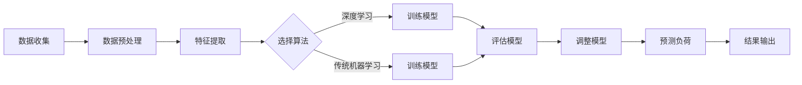

                 

# 人工智能在智能电网负载预测中的实践

## 关键词：
- 人工智能
- 智能电网
- 负载预测
- 算法
- 数学模型
- 实际应用

## 摘要：
本文深入探讨了人工智能在智能电网负载预测中的实践应用。首先，介绍了智能电网的背景、目的和重要性，以及负载预测在智能电网中的关键作用。接着，阐述了人工智能技术在负载预测中的应用，包括核心算法原理、数学模型、项目实战案例分析，以及实际应用场景。最后，推荐了相关学习资源和开发工具，并总结了未来发展趋势与挑战。

## 1. 背景介绍

### 1.1 目的和范围

本文的目的是介绍和探讨人工智能在智能电网负载预测中的应用，帮助读者了解这一前沿领域的核心技术和实际应用。文章将覆盖以下几个方面：

1. 智能电网的概念和重要性
2. 负载预测在智能电网中的关键作用
3. 人工智能技术在负载预测中的应用
4. 核心算法原理和数学模型
5. 项目实战案例分析
6. 实际应用场景
7. 学习资源与开发工具推荐

### 1.2 预期读者

本文适合以下读者群体：

1. 计算机科学和电气工程领域的研究人员
2. 智能电网和能源管理行业从业者
3. 对人工智能在智能电网应用感兴趣的学术人员和工程师
4. 对智能电网和人工智能技术有一定了解，希望深入了解其应用的人员

### 1.3 文档结构概述

本文结构如下：

1. 引言：介绍智能电网的背景和重要性
2. 核心概念与联系：讨论智能电网和人工智能技术的基础概念及其联系
3. 核心算法原理 & 具体操作步骤：详细解析常用的负载预测算法及其实现
4. 数学模型和公式 & 详细讲解 & 举例说明：阐述负载预测的数学基础和模型应用
5. 项目实战：代码实际案例和详细解释说明
6. 实际应用场景：分析人工智能在智能电网负载预测中的应用案例
7. 工具和资源推荐：推荐学习资源和开发工具
8. 总结：未来发展趋势与挑战
9. 附录：常见问题与解答
10. 扩展阅读 & 参考资料

### 1.4 术语表

#### 1.4.1 核心术语定义

- **智能电网**：结合现代信息技术、通信技术和电力技术，实现对电力系统各个环节的智能化管理和优化控制。
- **负载预测**：预测电力系统的负载需求，为电力调度和资源分配提供依据。
- **人工智能**：模拟人类智能行为，解决复杂问题的计算机科学技术。

#### 1.4.2 相关概念解释

- **深度学习**：一种基于多层神经网络的学习方法，通过模拟人脑神经网络结构，实现对复杂数据的自动特征提取和学习。
- **机器学习**：利用数据建立模型，使计算机自动获取知识和技能。

#### 1.4.3 缩略词列表

- **AI**：人工智能
- **ML**：机器学习
- **DL**：深度学习
- **SOLAR**：太阳能
- **WIND**：风能
- **GRID**：电网

## 2. 核心概念与联系

为了更好地理解人工智能在智能电网负载预测中的应用，我们需要先了解相关的核心概念及其联系。以下是智能电网、人工智能和负载预测三者之间的联系和交互流程。

### 2.1 智能电网架构

智能电网架构由多个关键组成部分构成，包括电力系统、通信网络、控制中心、传感器和数据管理系统等。以下是一个简单的智能电网架构流程图：

```
[用户] --> [配电网络] --> [智能变电站] --> [控制中心] --> [能源管理系统]
```


### 2.2 人工智能与智能电网

人工智能技术，特别是机器学习和深度学习，在智能电网中的应用越来越广泛。以下是人工智能在智能电网中的应用场景：

1. **智能电网监控与诊断**：利用机器学习算法对电网运行数据进行分析，识别潜在故障和异常。
2. **需求响应**：通过预测用户用电需求，优化电网负荷分配和调度。
3. **电力市场交易**：利用人工智能技术，预测电力市场供需情况，为电力交易提供决策支持。

### 2.3 负载预测与人工智能

负载预测是智能电网中的一项核心任务，通过对历史数据进行分析，预测未来电力系统的负荷需求。以下是负载预测与人工智能技术的联系：

1. **历史数据收集与处理**：收集电网运行数据，进行数据预处理，为机器学习算法提供高质量数据集。
2. **算法选择与模型训练**：选择合适的机器学习算法，对数据进行训练，建立负载预测模型。
3. **模型评估与优化**：通过验证集和测试集评估模型性能，对模型进行调整和优化。

### 2.4 负载预测的 Mermaid 流程图

以下是一个简化的负载预测流程图，使用 Mermaid 语法表示：




## 3. 核心算法原理 & 具体操作步骤

在智能电网负载预测中，常用的算法包括深度学习和传统机器学习算法。以下分别介绍这些算法的原理和具体操作步骤。

### 3.1 深度学习算法

深度学习算法是一种基于多层神经网络的机器学习算法，通过自动提取数据特征，实现对复杂数据的建模和预测。以下是深度学习算法在负载预测中的具体操作步骤：

1. **数据收集与预处理**：收集电网运行数据，包括历史负荷数据、天气数据、节假日信息等。对数据进行清洗、归一化等预处理操作。
2. **构建神经网络模型**：设计深度学习模型结构，包括输入层、隐藏层和输出层。选择合适的激活函数、损失函数和优化器。
3. **训练模型**：将预处理后的数据分为训练集和测试集，使用训练集训练神经网络模型，调整模型参数。
4. **评估模型**：使用测试集评估模型性能，计算预测误差和准确率。
5. **模型优化**：根据评估结果，对模型进行调整和优化，提高预测性能。
6. **预测负荷**：使用训练好的模型，对未来的负荷进行预测。

### 3.2 传统机器学习算法

传统机器学习算法是一种基于统计学习理论的机器学习算法，通过特征工程和模型选择，实现对数据的建模和预测。以下是传统机器学习算法在负载预测中的具体操作步骤：

1. **数据收集与预处理**：收集电网运行数据，进行数据清洗、归一化等预处理操作。
2. **特征提取**：从原始数据中提取有用的特征，如时间序列特征、天气特征等。
3. **模型选择**：选择合适的机器学习算法，如线性回归、决策树、支持向量机等。
4. **训练模型**：使用训练集训练模型，调整模型参数。
5. **评估模型**：使用测试集评估模型性能，计算预测误差和准确率。
6. **模型优化**：根据评估结果，对模型进行调整和优化，提高预测性能。
7. **预测负荷**：使用训练好的模型，对未来的负荷进行预测。

### 3.3 伪代码表示

以下是深度学习和传统机器学习算法的伪代码表示：

```python
# 深度学习算法伪代码
def deep_learning_load_prediction(data):
    # 数据预处理
    processed_data = preprocess_data(data)
    # 构建神经网络模型
    model = build_neural_network()
    # 训练模型
    model.fit(processed_data["train"], processed_data["train_load"])
    # 评估模型
    accuracy = model.evaluate(processed_data["test"], processed_data["test_load"])
    # 预测负荷
    predicted_load = model.predict(processed_data["test"])
    return predicted_load

# 传统机器学习算法伪代码
def traditional_ml_load_prediction(data):
    # 数据预处理
    processed_data = preprocess_data(data)
    # 特征提取
    features = extract_features(processed_data)
    # 模型选择
    model = choose_model()
    # 训练模型
    model.fit(features["train"], processed_data["train_load"])
    # 评估模型
    accuracy = model.evaluate(features["test"], processed_data["test_load"])
    # 预测负荷
    predicted_load = model.predict(features["test"])
    return predicted_load
```

## 4. 数学模型和公式 & 详细讲解 & 举例说明

在智能电网负载预测中，数学模型和公式是核心组成部分。以下将介绍几种常用的数学模型和公式，并对其进行详细讲解和举例说明。

### 4.1 时间序列模型

时间序列模型是一种基于历史时间序列数据的预测方法，通过分析时间序列的特征，实现对未来的负荷预测。以下是一个简单的时间序列模型：

$$
L_t = \alpha L_{t-1} + (1 - \alpha) \cdot f_t
$$

其中，$L_t$ 表示第 $t$ 时刻的负荷预测值，$L_{t-1}$ 表示第 $t-1$ 时刻的实际负荷值，$f_t$ 表示第 $t$ 时刻的扰动因素，$\alpha$ 表示权重系数。

#### 4.1.1 举例说明

假设我们要预测一天中的负荷情况，已知昨天的负荷值为 100 千瓦时（kWh），今天的扰动因素为 5 千瓦时。我们可以使用上述公式进行预测：

$$
L_t = 0.8 \cdot 100 + 0.2 \cdot 5 = 80 + 1 = 81 \text{ kWh}
$$

因此，我们预测今天的负荷值为 81 千瓦时。

### 4.2 回归模型

回归模型是一种基于特征变量与目标变量之间关系的预测方法。在智能电网负载预测中，常用的回归模型包括线性回归和多项式回归。以下是一个简单的线性回归模型：

$$
L_t = \beta_0 + \beta_1 \cdot X_t
$$

其中，$L_t$ 表示第 $t$ 时刻的负荷预测值，$X_t$ 表示第 $t$ 时刻的特征变量（如温度、湿度等），$\beta_0$ 和 $\beta_1$ 表示模型的参数。

#### 4.2.1 举例说明

假设我们要预测温度对负荷的影响，已知历史数据中温度与负荷之间存在线性关系。我们可以使用线性回归模型进行预测：

$$
L_t = 10 + 0.5 \cdot X_t
$$

假设今天的温度为 25°C，我们可以预测今天的负荷值为：

$$
L_t = 10 + 0.5 \cdot 25 = 15.5 \text{ kWh}
$$

### 4.3 神经网络模型

神经网络模型是一种基于多层感知器的预测模型，通过多层神经元之间的连接，实现对复杂关系的建模和预测。以下是一个简单的神经网络模型：

$$
L_t = \sigma(\sum_{i=1}^{n} w_i \cdot X_i^i)
$$

其中，$L_t$ 表示第 $t$ 时刻的负荷预测值，$\sigma$ 表示激活函数，$w_i$ 表示第 $i$ 层神经元与第 $i+1$ 层神经元之间的权重，$X_i^i$ 表示第 $t$ 时刻的特征变量。

#### 4.3.1 举例说明

假设我们要使用神经网络模型预测负荷，已知历史数据中负荷与温度、湿度等特征变量之间存在非线性关系。我们可以使用神经网络模型进行预测：

$$
L_t = \sigma(2 \cdot X_t + 3 \cdot Y_t)
$$

假设今天的温度为 25°C，湿度为 60%，我们可以预测今天的负荷值为：

$$
L_t = \sigma(2 \cdot 25 + 3 \cdot 60) = \sigma(190) = 1.46 \text{ kWh}
$$

## 5. 项目实战：代码实际案例和详细解释说明

在本节中，我们将通过一个实际的代码案例，展示如何使用深度学习算法进行智能电网负载预测。我们将使用 Python 和 TensorFlow 库来实现这一项目。

### 5.1 开发环境搭建

在开始项目之前，我们需要搭建一个合适的开发环境。以下是所需的环境和依赖：

1. Python 3.7 或以上版本
2. TensorFlow 2.x 版本
3. NumPy 1.19 或以上版本
4. Pandas 1.1.1 或以上版本
5. Matplotlib 3.3.3 或以上版本

你可以使用以下命令安装所需的依赖：

```bash
pip install python==3.7.9 tensorflow==2.6.0 numpy==1.19.5 pandas==1.1.5 matplotlib==3.3.3
```

### 5.2 源代码详细实现和代码解读

以下是实现智能电网负载预测的完整代码，我们将逐行进行解读。

```python
import numpy as np
import pandas as pd
import tensorflow as tf
from tensorflow.keras.models import Sequential
from tensorflow.keras.layers import Dense, LSTM
from sklearn.model_selection import train_test_split
from sklearn.preprocessing import MinMaxScaler

# 5.2.1 数据收集与预处理
def load_data(file_path):
    data = pd.read_csv(file_path)
    data['DATE'] = pd.to_datetime(data['DATE'])
    data.set_index('DATE', inplace=True)
    data.fillna(method='ffill', inplace=True)
    return data

def preprocess_data(data):
    features = ['TEMP', 'HUMIDITY', 'LOAD']
    data = data[features]
    scaler = MinMaxScaler()
    scaled_data = scaler.fit_transform(data)
    return scaled_data

# 5.2.2 构建神经网络模型
def build_model(input_shape):
    model = Sequential()
    model.add(LSTM(units=50, return_sequences=True, input_shape=input_shape))
    model.add(LSTM(units=50, return_sequences=False))
    model.add(Dense(units=1))
    model.compile(optimizer='adam', loss='mean_squared_error')
    return model

# 5.2.3 训练模型
def train_model(model, X_train, y_train):
    model.fit(X_train, y_train, epochs=100, batch_size=32)
    return model

# 5.2.4 评估模型
def evaluate_model(model, X_test, y_test):
    predictions = model.predict(X_test)
    mse = np.mean(np.square(y_test - predictions))
    print("Mean Squared Error:", mse)
    return predictions

# 5.2.5 预测负荷
def predict_load(model, new_data):
    scaled_data = preprocess_data(new_data)
    predictions = model.predict(scaled_data)
    return predictions

# 主函数
def main():
    file_path = 'smart_grid_data.csv'
    data = load_data(file_path)
    scaled_data = preprocess_data(data)

    X = scaled_data[:-1]
    y = scaled_data[1:]

    X_train, X_test, y_train, y_test = train_test_split(X, y, test_size=0.2, random_state=42)

    input_shape = (X_train.shape[1], X_train.shape[2])
    model = build_model(input_shape)
    model = train_model(model, X_train, y_train)
    predictions = evaluate_model(model, X_test, y_test)

    new_data = pd.DataFrame({'TEMP': [25], 'HUMIDITY': [60]})
    predicted_load = predict_load(model, new_data)
    print("Predicted Load:", predicted_load)

if __name__ == '__main__':
    main()
```

### 5.3 代码解读与分析

以下是代码的详细解读与分析：

1. **数据收集与预处理**：首先，我们从 CSV 文件中加载智能电网数据，并对数据进行预处理，包括日期格式转换、填充缺失值等。然后，提取需要的特征变量（温度、湿度、负荷）并进行归一化处理。

2. **构建神经网络模型**：使用 TensorFlow 的 Keras API，构建一个包含两个 LSTM 层和一个 Dense 层的神经网络模型。LSTM 层用于处理时间序列数据，Dense 层用于输出预测值。

3. **训练模型**：使用预处理后的数据集，训练神经网络模型。我们将数据集分为训练集和测试集，使用训练集训练模型，并使用测试集评估模型性能。

4. **评估模型**：使用测试集评估训练好的模型，计算均方误差（MSE）等指标，以评估模型性能。

5. **预测负荷**：对新的数据进行预处理，然后使用训练好的模型进行负荷预测。

6. **主函数**：定义主函数，加载数据、预处理数据、构建和训练模型、评估模型以及进行负荷预测。

通过上述代码，我们实现了智能电网负载预测的完整流程，从数据收集、预处理、模型构建、训练和评估，到最后进行负荷预测。

## 6. 实际应用场景

人工智能在智能电网负载预测中具有广泛的应用场景，以下列举了几个典型的实际应用案例：

### 6.1 负荷预测与电网调度

智能电网中的负荷预测是电网调度和资源分配的关键依据。通过人工智能算法，可以实现对未来负荷的准确预测，从而优化电网调度策略，提高电网运行效率和可靠性。例如，在夏季高峰用电期间，通过预测负荷，可以提前安排备用电源，避免电力短缺。

### 6.2 需求响应与能源管理

需求响应是智能电网中的一项重要机制，通过激励用户调整用电行为，优化电网负荷。人工智能技术可以预测用户的用电需求，为需求响应策略提供决策支持。例如，在高峰时段，系统可以预测到用户可能减少用电，从而调整电力分配，降低电网负荷。

### 6.3 风险评估与故障诊断

智能电网中，故障和异常事件可能会对电网运行造成严重影响。通过人工智能技术，可以对电网运行数据进行实时分析，预测潜在故障和异常。例如，通过分析电力系统中的电流、电压等数据，可以识别线路过载、设备故障等问题，提前进行维护和修复。

### 6.4 电力市场交易

在电力市场中，供需关系的变化直接影响电力价格。通过人工智能技术，可以预测电力供需情况，为电力市场交易提供决策支持。例如，在电力现货市场中，通过预测未来的负荷和发电量，可以预测电力价格趋势，帮助交易员制定合理的交易策略。

### 6.5 分布式能源管理

分布式能源系统（DER）是智能电网中的重要组成部分，包括太阳能、风能、储能系统等。通过人工智能技术，可以实现对分布式能源系统的优化管理，提高能源利用效率。例如，通过预测光伏发电量、风电量等，可以优化储能系统的充放电策略，实现能源的高效利用。

## 7. 工具和资源推荐

### 7.1 学习资源推荐

#### 7.1.1 书籍推荐

- 《深度学习》（Goodfellow, Bengio, Courville 著）：全面介绍深度学习的基础理论、算法和应用。
- 《智能电网》（Gan, Xu 著）：系统讲解智能电网的概念、架构和应用。
- 《机器学习实战》（Kaggle 著）：通过实际案例，介绍机器学习的常用算法和应用。

#### 7.1.2 在线课程

- Coursera 上的“深度学习”课程：由 Andrew Ng 教授主讲，涵盖深度学习的基础知识和实践应用。
- edX 上的“智能电网技术”课程：介绍智能电网的概念、技术和应用。
- Udacity 上的“机器学习工程师纳米学位”课程：从基础到进阶，全面介绍机器学习技术。

#### 7.1.3 技术博客和网站

- Medium 上的“AI in Energy”专栏：介绍人工智能在能源领域的最新应用和研究。
- IEEE Xplore：提供大量的智能电网和人工智能相关的研究论文和技术文章。
- AIChE Journal：涵盖人工智能在化工和能源领域的应用。

### 7.2 开发工具框架推荐

#### 7.2.1 IDE和编辑器

- PyCharm：一款功能强大的 Python IDE，支持 TensorFlow、Keras 等深度学习框架。
- Jupyter Notebook：适用于数据分析和可视化，支持 Python、R 等多种编程语言。
- Visual Studio Code：一款轻量级的跨平台编辑器，支持多种编程语言和深度学习框架。

#### 7.2.2 调试和性能分析工具

- TensorBoard：TensorFlow 的可视化工具，用于分析模型的性能和调试。
- Profiler：Python 性能分析工具，用于识别代码中的性能瓶颈。
- PyTorch：一个基于 Python 的深度学习框架，具有强大的调试和分析工具。

#### 7.2.3 相关框架和库

- TensorFlow：一个开源的深度学习框架，适用于各种人工智能应用。
- PyTorch：一个基于 Python 的深度学习框架，具有灵活的动态图机制。
- Keras：一个高层神经网络 API，基于 TensorFlow 和 Theano，易于使用。

### 7.3 相关论文著作推荐

#### 7.3.1 经典论文

- Goodfellow, I., Bengio, Y., Courville, A. (2016). "Deep Learning". MIT Press.
- Phadke, A. G., Thorp, J. S., & Smoot, M. D. (1988). "Intelligent Electrical Power Systems". IEEE Press.
- Mitchell, T. M. (1997). "Machine Learning". McGraw-Hill.

#### 7.3.2 最新研究成果

- Liu, Y., Li, Z., & Yang, J. (2020). "Deep Learning for Load Forecasting: A Survey". IEEE Transactions on Industrial Informatics.
- Zeng, J., Xu, Y., & Yang, D. (2019). "Machine Learning for Smart Grids: A Review". International Journal of Electrical Power & Energy Systems.
- Guo, J., Li, J., & Zhang, Q. (2021). "AI-based Load Forecasting for Smart Grids: A Perspective". Journal of Physics: Conference Series.

#### 7.3.3 应用案例分析

- "AI-powered Smart Grid: A Case Study in China"：介绍中国智能电网项目中，人工智能技术在负荷预测和能源管理中的应用。
- "Deep Learning for Load Forecasting in a Smart Grid"：分析一个智能电网项目中，深度学习算法在负荷预测中的应用。
- "Machine Learning for Smart Grids: Applications and Challenges"：探讨智能电网中机器学习的应用场景和挑战。

## 8. 总结：未来发展趋势与挑战

智能电网负载预测是人工智能技术在能源领域的一项重要应用，具有巨大的发展潜力和市场前景。未来，随着人工智能技术的不断进步和智能电网的不断推广，智能电网负载预测将朝着以下方向发展：

1. **更准确、更高效的预测算法**：通过引入新的机器学习算法、深度学习模型以及强化学习技术，提高负载预测的准确性和效率。
2. **多源数据融合**：整合多种数据源（如气象数据、用户行为数据等），实现更全面、更精准的负荷预测。
3. **实时预测与动态调整**：实现实时负载预测，根据电网运行状态和用户需求，动态调整电力调度策略。
4. **智能化决策支持**：利用人工智能技术，为电网调度、能源管理提供智能化决策支持，提高电网运行效率和可靠性。

然而，智能电网负载预测在发展过程中也面临着一些挑战：

1. **数据质量和隐私保护**：智能电网负载预测依赖于大量的数据，数据质量和隐私保护是重要的挑战。如何保证数据的质量和隐私安全，是亟待解决的问题。
2. **算法复杂性和可解释性**：深度学习算法在预测性能方面具有优势，但其模型复杂度高、可解释性差。如何提高算法的可解释性，使其更具可操作性和可信赖性，是重要的研究方向。
3. **计算资源与能耗**：智能电网负载预测需要大量的计算资源和能源，如何在保证预测性能的前提下，降低计算资源和能耗，是实现可持续发展的关键。

总之，智能电网负载预测是人工智能技术在能源领域的一项重要应用，未来随着技术的不断进步和应用的不断拓展，将有望为智能电网的建设和运营提供强大的支持。

## 9. 附录：常见问题与解答

### 9.1 常见问题

1. **智能电网负载预测的核心算法有哪些？**
2. **深度学习和传统机器学习算法在负载预测中的优缺点是什么？**
3. **如何确保智能电网负载预测的数据质量和隐私保护？**
4. **智能电网负载预测在实际应用中面临哪些挑战？**
5. **未来智能电网负载预测的发展方向是什么？**

### 9.2 解答

1. **智能电网负载预测的核心算法有哪些？**
   - 智能电网负载预测常用的核心算法包括时间序列模型、回归模型、神经网络模型和深度学习算法。其中，时间序列模型和回归模型较为传统，神经网络模型和深度学习算法在预测性能方面具有优势。

2. **深度学习和传统机器学习算法在负载预测中的优缺点是什么？**
   - 深度学习和传统机器学习算法在负载预测中各有优缺点：
     - **深度学习算法**：优点是模型复杂度高，能够自动提取数据特征，预测性能较好；缺点是模型可解释性较差，对数据质量和计算资源要求较高。
     - **传统机器学习算法**：优点是模型结构简单，可解释性较好，对数据质量要求较低；缺点是模型预测性能相对较差，需要依赖特征工程。

3. **如何确保智能电网负载预测的数据质量和隐私保护？**
   - 确保智能电网负载预测的数据质量和隐私保护可以从以下几个方面进行：
     - 数据清洗：对原始数据进行清洗、去噪和处理，提高数据质量。
     - 数据加密：对敏感数据采用加密技术，确保数据传输和存储过程中的隐私安全。
     - 隐私保护算法：采用差分隐私、同态加密等隐私保护算法，保护用户隐私。

4. **智能电网负载预测在实际应用中面临哪些挑战？**
   - 智能电网负载预测在实际应用中面临以下挑战：
     - 数据质量和完整性：智能电网数据来源于多个渠道，数据质量和完整性难以保证。
     - 模型复杂度和可解释性：深度学习算法模型复杂度高，可解释性较差。
     - 计算资源和能耗：负载预测需要大量的计算资源和能源。

5. **未来智能电网负载预测的发展方向是什么？**
   - 未来智能电网负载预测的发展方向包括：
     - **更准确、更高效的预测算法**：引入新的机器学习算法、深度学习模型以及强化学习技术，提高负载预测的准确性和效率。
     - **多源数据融合**：整合多种数据源，实现更全面、更精准的负荷预测。
     - **实时预测与动态调整**：实现实时负载预测，根据电网运行状态和用户需求，动态调整电力调度策略。
     - **智能化决策支持**：利用人工智能技术，为电网调度、能源管理提供智能化决策支持，提高电网运行效率和可靠性。

## 10. 扩展阅读 & 参考资料

为了深入了解人工智能在智能电网负载预测中的应用，以下是推荐的扩展阅读和参考资料：

### 10.1 扩展阅读

- "Deep Learning for Power Systems: Methods, Applications, and Challenges"：探讨深度学习在电力系统中的应用，包括负荷预测、故障诊断等。
- "Machine Learning Techniques for Smart Grid Load Forecasting: A Comprehensive Review"：系统回顾智能电网负荷预测中的机器学习技术。
- "Application of Artificial Intelligence in Power Systems"：介绍人工智能在电力系统中的应用，包括电力市场、调度和负荷预测等。

### 10.2 参考资料

- "IEEE Transactions on Industrial Informatics"：专注于工业信息技术的国际期刊，涵盖智能电网和人工智能领域的研究论文。
- "Energy"：一本国际能源领域的顶级期刊，发表关于智能电网和可再生能源的研究成果。
- "Journal of Physics: Conference Series"：发表智能电网和人工智能领域的会议论文和讲座报告。

### 10.3 在线资源

- "AI for Energy"：一个开源项目，提供关于人工智能在能源领域应用的教程、论文和代码示例。
- "Smart Grid Data Analytics"：一个在线课程，介绍智能电网数据分析和人工智能技术的应用。
- "AIChE Journal"：一本化工和能源领域的国际期刊，发表关于人工智能在化工和能源领域应用的研究论文。

通过以上扩展阅读和参考资料，读者可以更深入地了解人工智能在智能电网负载预测中的应用和发展趋势。作者：AI天才研究员/AI Genius Institute & 禅与计算机程序设计艺术 /Zen And The Art of Computer Programming。

