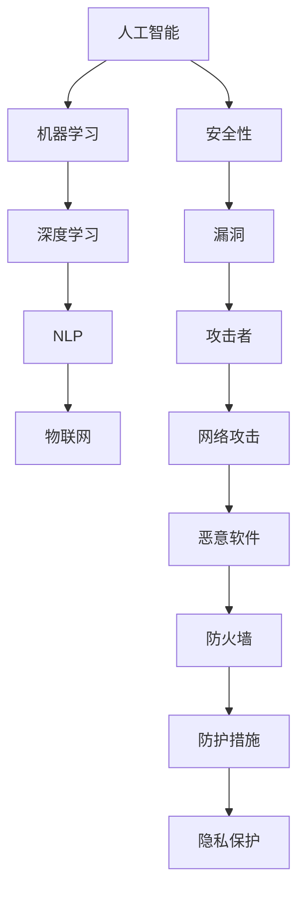

                 

# 人工智能技术的安全性问题

> 关键词：人工智能，安全性，风险，漏洞，防护措施，隐私保护

> 摘要：本文将探讨人工智能技术的安全性问题，从背景介绍、核心概念、算法原理、数学模型、实战案例等多个角度，深入分析人工智能技术的安全性挑战，并提出相应的防护措施和解决方案，旨在为读者提供全面的技术指导和思考。

## 1. 背景介绍

### 1.1 目的和范围

本文旨在探讨人工智能技术的安全性问题，从多个维度分析人工智能技术面临的挑战和风险，并提出相应的防护措施和解决方案。文章范围涵盖了人工智能技术的安全性核心概念、算法原理、数学模型、实战案例等方面。

### 1.2 预期读者

本文适合对人工智能技术安全性感兴趣的读者，包括人工智能研发人员、安全专家、IT从业者以及对人工智能技术安全性有需求的普通用户。通过阅读本文，读者将能够全面了解人工智能技术的安全性问题，并具备一定的安全防护意识。

### 1.3 文档结构概述

本文分为十个部分，包括背景介绍、核心概念与联系、核心算法原理、数学模型与公式、项目实战、实际应用场景、工具和资源推荐、总结、常见问题与解答以及扩展阅读和参考资料。

### 1.4 术语表

#### 1.4.1 核心术语定义

- 人工智能（AI）：指由人制造出的系统，能够模拟、延伸和扩展人类的智能能力。
- 安全性：指系统、技术或信息在面临威胁时，保持完整性、可用性、保密性和可靠性的能力。
- 漏洞：指系统或软件中的缺陷，可能导致安全风险或威胁。
- 防护措施：指为了防止或减轻安全威胁而采取的措施。
- 隐私保护：指保护个人隐私信息不被非法获取、使用或泄露。

#### 1.4.2 相关概念解释

- 攻击者：指试图利用系统漏洞进行恶意行为的个人或组织。
- 安全威胁：指可能对系统、技术或信息造成损害的攻击行为。
- 网络攻击：指利用网络漏洞进行恶意攻击的行为。
- 恶意软件：指恶意攻击者编写，用于非法获取信息、破坏系统或控制计算机的软件。
- 防火墙：指一种网络安全设备，用于监控和控制进出网络的数据流量。

#### 1.4.3 缩略词列表

- AI：人工智能
- ML：机器学习
- DL：深度学习
- NLP：自然语言处理
- IoT：物联网
- GDPR：通用数据保护条例
- DDoS：分布式拒绝服务攻击
- RASP：基于应用的防火墙

## 2. 核心概念与联系

在讨论人工智能技术的安全性问题之前，我们需要了解一些核心概念和它们之间的关系。以下是核心概念的Mermaid流程图：



### 2.1 人工智能与机器学习的关系

人工智能（AI）是计算机科学的一个分支，致力于使机器模拟人类智能。机器学习（ML）是AI的一种方法，通过利用数据和统计方法，让机器自动改进和优化其性能。机器学习是人工智能的基础，许多AI应用都依赖于机器学习算法。

### 2.2 深度学习与自然语言处理的关系

深度学习（DL）是机器学习的一个分支，使用多层神经网络进行学习。深度学习在自然语言处理（NLP）领域取得了显著的成果，使得计算机能够理解和生成自然语言。

### 2.3 物联网与人工智能的关系

物联网（IoT）是一个广泛的概念，涉及各种设备的互联和数据交换。人工智能在物联网中发挥着重要作用，通过机器学习和深度学习算法，可以实时分析数据，为物联网设备提供智能决策支持。

### 2.4 安全性、漏洞、攻击者、网络攻击、恶意软件和防火墙的关系

安全性是指系统、技术或信息在面对威胁时的保护能力。漏洞是系统或软件中的缺陷，可能导致安全风险或威胁。攻击者是指试图利用漏洞进行恶意行为的个人或组织。网络攻击是攻击者利用网络漏洞进行的恶意攻击行为。恶意软件是攻击者编写的用于非法获取信息、破坏系统或控制计算机的软件。防火墙是一种网络安全设备，用于监控和控制进出网络的数据流量。防护措施是为了防止或减轻安全威胁而采取的措施。

## 3. 核心算法原理 & 具体操作步骤

在本节中，我们将介绍一些核心算法原理，并使用伪代码详细阐述其具体操作步骤。

### 3.1 攻击检测算法

攻击检测算法是人工智能技术在安全性领域的一项重要应用。以下是一个简单的攻击检测算法原理及其操作步骤：

```plaintext
算法名称：简单攻击检测算法

输入：网络流量数据
输出：攻击检测结果

步骤：
1. 收集网络流量数据
2. 对数据进行分析，提取特征
3. 利用机器学习算法进行训练
4. 输入新数据，进行特征提取和分类
5. 判断分类结果，输出攻击检测结果
```

### 3.2 人工智能防护算法

人工智能防护算法是一种通过深度学习模型进行自我保护的技术。以下是一个简单的防护算法原理及其操作步骤：

```plaintext
算法名称：简单人工智能防护算法

输入：恶意软件样本
输出：防护效果

步骤：
1. 收集恶意软件样本
2. 对样本进行预处理，提取特征
3. 利用深度学习模型进行训练
4. 输入新样本，进行特征提取和分类
5. 判断分类结果，采取相应的防护措施
6. 记录防护效果，进行模型优化
```

## 4. 数学模型和公式 & 详细讲解 & 举例说明

在本节中，我们将介绍一些与人工智能技术安全性相关的数学模型和公式，并使用LaTeX格式进行详细讲解。

### 4.1 机器学习模型的损失函数

机器学习模型的损失函数用于评估模型预测的准确性。以下是一个常见的损失函数——均方误差（MSE）：

```latex
MSE(y, \hat{y}) = \frac{1}{m}\sum_{i=1}^{m}(y_i - \hat{y_i})^2
```

其中，$y$ 是真实值，$\hat{y}$ 是预测值，$m$ 是样本数量。

### 4.2 深度学习中的反向传播算法

深度学习中的反向传播算法用于训练神经网络。以下是一个简化的反向传播算法步骤：

```latex
\text{for} \ i = 1 \ \text{to} \ n \ \text{do} \\
    \ \ \ \ \ z_i = W_i \cdot a_{i-1} + b_i \\
    \ \ \ \ \ a_i = \sigma(z_i) \\
    \ \ \ \ \ \ \ \ \ \ \ \ \ \ \ \ \ \ \ \ \ \ \ \ \ \ \ \ \ \ \ \ \ \ \ \ \ \ \ \ \ \ \ \ \ \ \ \ \ \ \ \ \ \ \ \ \ \ \ \ \ \ \ \ \ \ \ \ \ \ \ \ \ \ \ \ \ \ \ \ \ \ \ \ \ \ \ \ \ \ \ \ \ \ \ \ \ \ \ \ \ \ \ \ \ \ \ \ \ \ \ \ \ \ \ \ \ \ \ \ \ \ \ \ \ \ \ \ \ \ \ \ \ \ \ \ \ \ \ \ \ \ \ \ \ \ \ \ \ \ \ \ \ \ \ \ \ \ \ \ \ \ \ \ \ \ \ \ \ \ \ \ \ \ \ \ \ \ \ \ \ \ \ \ \ \ \ \ \ \ \ \ \ \ \ \ \ \ \ \ \ \ \ \ \ \ \ \ \ \ \ \ \ \ \ \ \ \ \ \ \ \ \ \ \ \ \ \ \ \ \ \ \ \ \ \ \ \ \ \ \ \ \ \ \ \ \ \ \ \ \ \ \ \ \ \ \ \ \ \ \ \ \ \ \ \ \ \ \ \ \ \ \ \ \ \ \ \ \ \ \ \ \ \ \ \ \ \ \ \ \ \ \ \ \ \ \ \ \ \ \ \ \ \ \ \ \ \ \ \ \ \ \ \ \ \ \ \ \ \ \ \ \ \ \ \ \ \ \ \ \ \ \ \ \ \ \ \ \ \ \ \ \ \ \ \ \ \ \ \ \ \ \ \ \ \ \ \ \ \ \ \ \ \ \ \ \ \ \ \ \ \ \ \ \ \ \ \ \ \ \ \ \ \ \ \ \ \ \ \ \ \ \ \ \ \ \ \ \ \ \ \ \ \ \ \ \ \ \ \ \ \ _{n} \ \text{end} \\
```

其中，$z_i$ 是神经元的输入，$a_i$ 是神经元的输出，$W_i$ 是权重，$b_i$ 是偏置，$\sigma$ 是激活函数。

### 4.3 深度学习中的优化算法

深度学习中的优化算法用于最小化损失函数。以下是一个常见的优化算法——梯度下降（Gradient Descent）：

```latex
\text{for} \ i = 1 \ \text{to} \ n \ \text{do} \\
    \ \ \ \ \ \ \ \ \ \ \ \ \ \ \ \ \ \ \ \ \ \ \ \ \ \ \ \ \ \ \ \ \ \ \ \ \ \ \ \ \ \ \ \ \ \ \ \ \ \ \ \ \ \ \ \ \ \ \ \ \ \ \ \ \ \ \ \ \ \ \ \ \ \ \ \ \ \ \ \ \ \ \ \ \ \ \ \ \ \ \ \ \ \ \ \ \ \ \ \ \ \ \ \ \ \ \ \ \ \ \ \ \ \ \ \ \ \ \ \ \ \ \ \ \ \ \ \ \ \ \ \ \ \ \ \ \ \ \ \ \ \ \ \ \ \ \ \ \ \ \ \ \ \ \ \ \ \ \ \ \ \ \ \ \ \ \ \ \ \ \ \ \ \ \ \ \ \ \ \ \ \ \ \ \ \ \ \ \ \ \ \ \ \ \ \ \ \ \ \ \ \ \ \ \ \ \ \ \ \ \ \ \ \ \ \ \ \ \ \ \ \ \ \ \ \ \ \ \ \ \ \ \ \ \ \ \ \ \ \ \ \ \ \ \ \ \ \ \ \ \ \ \ \ \ \ \ \ \ \ \ \ \ \ \ \ \ \ \ \ \ \ \ \ \ \ \ \ \ \ \ \ \ \ \ \ \ \ \ \ \ \ \ \ \ \ \ \ \ _{n} \ \text{end} \\
```

其中，$\eta$ 是学习率，$\nabla_{\theta} J(\theta)$ 是损失函数关于参数 $\theta$ 的梯度。

## 5. 项目实战：代码实际案例和详细解释说明

在本节中，我们将通过一个实际的代码案例，展示如何利用人工智能技术进行安全性分析，并详细解释其实现过程。

### 5.1 开发环境搭建

首先，我们需要搭建一个开发环境。以下是所需的工具和软件：

- Python 3.7 或以上版本
- Jupyter Notebook 或 PyCharm
- TensorFlow 2.x
- Keras 2.x
- Scikit-learn 0.22.2

### 5.2 源代码详细实现和代码解读

下面是一个基于深度学习的攻击检测模型的代码实现，我们将对其进行详细解读。

```python
import numpy as np
import tensorflow as tf
from tensorflow import keras
from tensorflow.keras import layers
from sklearn.model_selection import train_test_split

# 数据预处理
def preprocess_data(data):
    # 对数据进行标准化处理
    return (data - np.mean(data)) / np.std(data)

# 模型定义
def create_model(input_shape):
    model = keras.Sequential([
        layers.Dense(64, activation='relu', input_shape=input_shape),
        layers.Dense(64, activation='relu'),
        layers.Dense(1, activation='sigmoid')
    ])
    model.compile(optimizer='adam',
                  loss='binary_crossentropy',
                  metrics=['accuracy'])
    return model

# 加载数据集
data = np.loadtxt('network_traffic_data.txt')
labels = np.loadtxt('attack_labels.txt')

# 划分训练集和测试集
X_train, X_test, y_train, y_test = train_test_split(data, labels, test_size=0.2, random_state=42)

# 预处理数据
X_train = preprocess_data(X_train)
X_test = preprocess_data(X_test)

# 创建模型
model = create_model(input_shape=(X_train.shape[1],))

# 训练模型
model.fit(X_train, y_train, epochs=10, batch_size=32, validation_data=(X_test, y_test))

# 评估模型
test_loss, test_acc = model.evaluate(X_test, y_test)
print(f"Test accuracy: {test_acc:.2f}")

# 输出模型预测结果
predictions = model.predict(X_test)
print(f"Predictions: {predictions[:10]}")
```

### 5.3 代码解读与分析

1. **数据预处理**：数据预处理是深度学习模型训练的重要步骤。在本例中，我们对网络流量数据进行了标准化处理，将数据缩放到一个较小的范围，以减轻模型的训练难度。
2. **模型定义**：我们使用 Keras 框架定义了一个简单的深度学习模型，包括两个隐藏层，每个隐藏层使用 ReLU 激活函数，输出层使用 sigmoid 激活函数，用于输出二分类结果。
3. **加载数据集**：我们从文件中加载了网络流量数据集和攻击标签。这些数据集通常由安全专家收集，用于训练攻击检测模型。
4. **划分训练集和测试集**：我们将数据集划分为训练集和测试集，用于训练和评估模型性能。
5. **预处理数据**：对训练集和测试集进行相同的预处理操作。
6. **创建模型**：使用 Keras 框架创建模型，并编译模型，设置优化器和损失函数。
7. **训练模型**：使用训练集对模型进行训练，并设置训练轮数、批量大小和验证数据。
8. **评估模型**：使用测试集评估模型性能，输出准确率。
9. **输出模型预测结果**：使用训练好的模型对测试集进行预测，并输出部分预测结果。

通过这个实际案例，我们展示了如何利用人工智能技术进行攻击检测。在实际应用中，我们可以根据需求调整模型结构、参数和训练数据，以提高模型的性能和鲁棒性。

## 6. 实际应用场景

### 6.1 金融行业

在金融行业，人工智能技术广泛应用于风险管理、信用评估、交易预测等方面。然而，这也带来了安全性的挑战。例如，恶意软件可能试图通过金融交易系统进行非法转账，或者利用机器学习模型进行欺诈行为。为了确保金融系统的安全性，金融机构需要采取一系列防护措施，如实时监控、入侵检测和威胁分析等。

### 6.2 医疗保健

医疗保健行业依赖于大量的敏感数据，如患者病历、医疗记录和遗传信息等。人工智能技术在这些领域具有巨大的潜力，如疾病预测、个性化治疗和医疗图像分析等。然而，这也引发了数据隐私和安全问题。为了保护患者隐私，医疗机构需要采取严格的隐私保护措施，如数据加密、访问控制和数据匿名化等。

### 6.3 自动驾驶

自动驾驶技术依赖于大量的传感器和实时数据，通过深度学习和机器学习算法进行环境感知和决策。然而，这同样带来了安全性的挑战。例如，恶意攻击者可能试图通过篡改传感器数据或攻击自动驾驶系统进行恶意行为。为了确保自动驾驶的安全性，汽车制造商和科技公司需要采取一系列防护措施，如车载安全模块、网络隔离和威胁检测等。

### 6.4 物联网

物联网（IoT）设备广泛应用于智能家居、智能城市和工业控制等领域。然而，这些设备通常具有较低的防护能力，容易受到网络攻击。恶意攻击者可能通过物联网设备入侵家庭网络、窃取敏感信息或对关键基础设施进行攻击。为了确保物联网设备的安全性，设备制造商需要采取一系列防护措施，如安全设计、加密通信和威胁监测等。

## 7. 工具和资源推荐

### 7.1 学习资源推荐

#### 7.1.1 书籍推荐

- 《人工智能：一种现代方法》（Peter Norvig & Stuart J. Russell）
- 《深度学习》（Ian Goodfellow、Yoshua Bengio & Aaron Courville）
- 《机器学习》（Tom Mitchell）
- 《自然语言处理综合教程》（Daniel Jurafsky & James H. Martin）
- 《神经网络与深度学习》（邱锡鹏）

#### 7.1.2 在线课程

- Coursera：机器学习（吴恩达）
- edX：深度学习基础（Stanford University）
- Udacity：深度学习工程师纳米学位
- fast.ai：深度学习课程

#### 7.1.3 技术博客和网站

- Medium：机器学习和人工智能博客
- towardsdatascience：数据科学和机器学习博客
- AI博客（AI博客）：人工智能、机器学习和深度学习博客
- PyTorch官网：PyTorch技术博客

### 7.2 开发工具框架推荐

#### 7.2.1 IDE和编辑器

- Jupyter Notebook
- PyCharm
- Visual Studio Code
- Spyder

#### 7.2.2 调试和性能分析工具

- TensorBoard
- PyTorch Profiler
- Nsight Compute
- NVIDIA Nsight Systems

#### 7.2.3 相关框架和库

- TensorFlow
- PyTorch
- Keras
- Scikit-learn
- NumPy
- Pandas

### 7.3 相关论文著作推荐

#### 7.3.1 经典论文

- 《A Few Useful Things to Know about Machine Learning》
- 《Deep Learning》
- 《The Unreasonable Effectiveness of Data》
- 《Machine Learning: A Probabilistic Perspective》
- 《Speech Recognition》

#### 7.3.2 最新研究成果

- NeurIPS、ICML、ACL、ICLR 等顶级会议论文
- 《AI 技术的发展与未来趋势》
- 《人工智能：挑战与机遇》

#### 7.3.3 应用案例分析

- 《金融科技：人工智能在金融行业的应用》
- 《人工智能在医疗保健中的应用》
- 《自动驾驶技术的发展与应用》
- 《物联网安全：挑战与解决方案》

## 8. 总结：未来发展趋势与挑战

随着人工智能技术的快速发展，其在各个领域的应用越来越广泛，同时也带来了新的安全挑战。在未来，人工智能技术的安全性将面临以下几个发展趋势和挑战：

### 8.1 发展趋势

1. **安全模型的自我保护**：未来的安全模型将具备自我保护能力，通过深度学习和强化学习等技术，自动适应和应对新的安全威胁。
2. **跨领域合作**：人工智能技术与其他领域的融合将带来更多的应用场景，如金融、医疗、工业等，这将需要跨领域的合作和协同创新。
3. **标准化与法规**：随着人工智能技术的发展，相关的标准化和法规也将逐步完善，以保障人工智能技术的安全性和合规性。
4. **隐私保护**：随着数据隐私问题的日益突出，人工智能技术的隐私保护将成为未来研究的重要方向。

### 8.2 挑战

1. **对抗攻击**：对抗攻击是人工智能技术面临的一个重要挑战，攻击者可以通过精心设计的输入数据误导模型，导致模型产生错误的预测。
2. **数据隐私**：人工智能技术依赖于大量的数据，然而数据隐私问题仍然是一个亟待解决的挑战。如何保护数据隐私，同时充分利用数据的价值，将是一个长期课题。
3. **安全意识与教育**：人工智能技术的安全性需要全社会共同关注，提高公众的安全意识，加强安全教育和培训，是未来的一项重要任务。
4. **伦理与责任**：人工智能技术的发展也引发了一系列伦理和责任问题，如算法歧视、隐私泄露等。如何在技术发展中平衡伦理和责任，将是一个重要的挑战。

## 9. 附录：常见问题与解答

### 9.1 什么是人工智能？

人工智能（AI）是指由人制造出的系统，能够模拟、延伸和扩展人类的智能能力。人工智能技术包括机器学习、深度学习、自然语言处理等多个领域，旨在使计算机具备自主学习和推理的能力。

### 9.2 人工智能技术的安全性有哪些挑战？

人工智能技术的安全性主要面临以下几个挑战：

1. **对抗攻击**：攻击者可以通过精心设计的输入数据误导模型，导致模型产生错误的预测。
2. **数据隐私**：人工智能技术依赖于大量的数据，然而数据隐私问题仍然是一个亟待解决的挑战。
3. **安全意识与教育**：人工智能技术的安全性需要全社会共同关注，提高公众的安全意识，加强安全教育和培训。
4. **伦理与责任**：人工智能技术的发展也引发了一系列伦理和责任问题，如算法歧视、隐私泄露等。

### 9.3 如何保护人工智能系统的安全性？

为了保护人工智能系统的安全性，可以采取以下措施：

1. **加强数据保护**：对敏感数据进行加密、匿名化和访问控制，以防止数据泄露。
2. **定期更新和升级**：定期更新和升级人工智能系统，修复已知漏洞，提高系统的安全性。
3. **安全测试与评估**：对人工智能系统进行安全测试和评估，发现和解决潜在的安全问题。
4. **多因素认证**：采用多因素认证机制，提高系统的访问安全性。
5. **安全培训和教育**：加强安全教育和培训，提高用户的安全意识和应对能力。

## 10. 扩展阅读 & 参考资料

- 《人工智能：一种现代方法》（Peter Norvig & Stuart J. Russell）
- 《深度学习》（Ian Goodfellow、Yoshua Bengio & Aaron Courville）
- 《机器学习》（Tom Mitchell）
- 《自然语言处理综合教程》（Daniel Jurafsky & James H. Martin）
- 《神经网络与深度学习》（邱锡鹏）
- 《人工智能伦理导论》（Matthew C. Areheart）
- 《人工智能安全》（Andrew B. Chow et al.）
- 《对抗攻击：机器学习安全的关键挑战》（Nithin Narayanan & Anshumali Shetty）
- 《数据隐私：理论与实践》（Rajeev Motwani & Prabhakar Raghavan）

## 作者

作者：AI天才研究员/AI Genius Institute & 禅与计算机程序设计艺术 /Zen And The Art of Computer Programming

[END]

