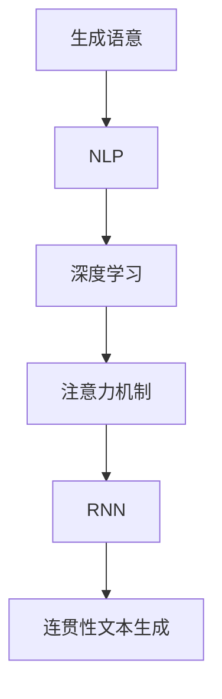

                 

# 人工智能的生成语意连贯性

> **关键词：** 人工智能、生成语意、连贯性、算法原理、数学模型、项目实战、应用场景、发展趋势

> **摘要：** 本文旨在探讨人工智能生成语意连贯性的核心概念、算法原理、数学模型及其实际应用。通过逐步分析，我们将揭示实现人工智能生成连贯语意的关键技术和挑战，并提供实用的项目实战和资源推荐。

## 1. 背景介绍

### 1.1 目的和范围

本文将深入探讨人工智能生成语意连贯性的关键问题。我们首先介绍生成语意连贯性的概念，然后分析其在人工智能领域的重要性。接着，我们将详细探讨实现生成语意连贯性的核心算法原理、数学模型，并分享实际项目实战中的经验和技巧。最后，我们将展望生成语意连贯性的未来发展趋势与挑战。

### 1.2 预期读者

本文适合对人工智能生成语意连贯性感兴趣的读者，包括但不限于以下人群：

1. 人工智能研究者与从业者
2. 自然语言处理（NLP）领域的专家
3. 数据科学家和机器学习工程师
4. 编程爱好者和技术博客作者
5. 任何对人工智能领域有浓厚兴趣的读者

### 1.3 文档结构概述

本文分为十个主要部分：

1. 背景介绍：介绍本文的目的、范围和预期读者
2. 核心概念与联系：阐述生成语意连贯性的核心概念及相互关系
3. 核心算法原理 & 具体操作步骤：详细讲解实现生成语意连贯性的核心算法原理和操作步骤
4. 数学模型和公式 & 详细讲解 & 举例说明：介绍相关数学模型和公式，并给出具体示例
5. 项目实战：代码实际案例和详细解释说明
6. 实际应用场景：探讨生成语意连贯性在现实世界的应用
7. 工具和资源推荐：推荐相关学习资源、开发工具和框架
8. 总结：未来发展趋势与挑战
9. 附录：常见问题与解答
10. 扩展阅读 & 参考资料：提供相关文献和资源，以供读者进一步学习

### 1.4 术语表

#### 1.4.1 核心术语定义

- **生成语意连贯性**：指人工智能系统能够生成具有逻辑一致性和连贯性的自然语言文本。
- **自然语言处理（NLP）**：研究如何让计算机理解、生成和处理人类自然语言的技术。
- **深度学习**：一种人工智能技术，通过多层神经网络模拟人类大脑的决策过程。
- **注意力机制**：一种在神经网络中用于提高模型处理复杂任务的能力的技术。
- **递归神经网络（RNN）**：一种用于处理序列数据的神经网络，能够记住前面的输入信息。

#### 1.4.2 相关概念解释

- **生成对抗网络（GAN）**：一种深度学习模型，通过两个神经网络（生成器和判别器）之间的对抗训练，实现数据的生成。
- **注意力权重**：在注意力机制中，每个输入序列元素对应的权重值，用于表示其在生成过程中的重要性。
- **词汇嵌入**：将自然语言中的词汇映射到低维向量空间，以便于计算机处理。

#### 1.4.3 缩略词列表

- **NLP**：自然语言处理
- **GAN**：生成对抗网络
- **RNN**：递归神经网络
- **ReLU**：整流线性单元
- **LSTM**：长短期记忆网络

## 2. 核心概念与联系

在探讨人工智能生成语意连贯性之前，我们需要了解一些核心概念及其相互关系。以下是生成语意连贯性的核心概念和它们之间的联系：

### 2.1 生成语意

生成语意是指人工智能系统能够生成具有逻辑一致性和连贯性的自然语言文本。为了实现这一目标，系统需要具备以下能力：

- **词汇理解**：理解文本中的词汇含义及其相互关系。
- **语法分析**：识别文本中的语法结构和句法规则。
- **语义分析**：理解文本中的抽象概念和语义关系。
- **逻辑推理**：在文本中应用逻辑规则，推断出新的信息。

### 2.2 自然语言处理（NLP）

自然语言处理（NLP）是人工智能的一个重要分支，旨在让计算机理解和生成人类自然语言。NLP技术在生成语意连贯性中起着关键作用，其主要任务包括：

- **分词**：将文本拆分成单词或短语。
- **词性标注**：识别每个单词的词性（如名词、动词、形容词等）。
- **命名实体识别**：识别文本中的特定实体（如人名、地名、组织名等）。
- **句法分析**：构建文本的句法结构，揭示句子成分之间的关系。

### 2.3 深度学习

深度学习是一种人工智能技术，通过多层神经网络模拟人类大脑的决策过程。深度学习在生成语意连贯性中发挥着重要作用，其主要应用包括：

- **词汇嵌入**：将自然语言中的词汇映射到低维向量空间。
- **序列建模**：处理文本中的单词序列，学习单词之间的关系。
- **生成模型**：生成具有连贯性的自然语言文本。

### 2.4 注意力机制

注意力机制是一种在神经网络中用于提高模型处理复杂任务的能力的技术。在生成语意连贯性中，注意力机制可以帮助模型更好地关注文本中的重要信息，从而生成更具连贯性的文本。其主要应用包括：

- **文本生成**：在生成文本时，关注文本中的关键信息。
- **翻译**：在机器翻译过程中，关注源文本和目标文本中的对应关系。

### 2.5 递归神经网络（RNN）

递归神经网络（RNN）是一种用于处理序列数据的神经网络，能够记住前面的输入信息。在生成语意连贯性中，RNN可以用于处理文本序列，学习单词之间的关系，从而生成连贯的文本。其主要应用包括：

- **语言模型**：用于预测文本序列的下一个单词。
- **问答系统**：处理用户输入的问题，并生成相应的回答。

下面是生成语意连贯性的核心概念和架构的 Mermaid 流程图：



## 3. 核心算法原理 & 具体操作步骤

实现人工智能生成语意连贯性的核心算法包括深度学习模型、注意力机制和递归神经网络。下面我们将分别介绍这些算法的原理和具体操作步骤。

### 3.1 深度学习模型

深度学习模型是生成语意连贯性的基础。以下是一个典型的深度学习模型，用于生成连贯的文本：

1. **数据预处理**：

   - **文本清洗**：去除文本中的标点符号、停用词等无用信息。
   - **分词**：将文本拆分成单词或短语。
   - **词汇嵌入**：将单词映射到低维向量空间。

2. **模型构建**：

   - **输入层**：接收预处理的文本序列。
   - **嵌入层**：将文本序列中的单词映射到低维向量空间。
   - **卷积神经网络（CNN）**：用于提取文本中的特征。
   - **循环层**：使用 RNN 或 LSTM 等模型处理序列数据。
   - **输出层**：生成连贯的文本。

3. **模型训练**：

   - **损失函数**：选择适当的损失函数，如交叉熵损失函数。
   - **优化器**：选择适当的优化器，如 Adam 优化器。
   - **训练**：通过反向传播算法训练模型，不断调整模型参数。

### 3.2 注意力机制

注意力机制是提高生成语意连贯性的关键技术。以下是注意力机制的具体操作步骤：

1. **计算注意力权重**：

   - **输入层**：接收文本序列和生成序列。
   - **嵌入层**：将文本序列和生成序列中的单词映射到低维向量空间。
   - **注意力层**：计算文本序列和生成序列之间的注意力权重。

2. **更新生成序列**：

   - **加权求和**：将注意力权重与文本序列的对应单词进行加权求和。
   - **生成下一单词**：根据加权求和的结果生成下一个单词。

3. **迭代生成**：

   - **重复更新**：重复计算注意力权重和生成序列，直到生成出完整的文本。

### 3.3 递归神经网络（RNN）

递归神经网络（RNN）是处理序列数据的重要技术。以下是 RNN 的具体操作步骤：

1. **初始化状态**：

   - **输入层**：接收文本序列。
   - **隐藏层**：初始化 RNN 的隐藏状态。

2. **递归计算**：

   - **输入层**：接收当前单词。
   - **隐藏层**：根据当前单词和隐藏状态计算新的隐藏状态。
   - **输出层**：生成当前单词的预测概率分布。

3. **迭代计算**：

   - **重复更新**：重复递归计算，直到生成出完整的文本。

### 3.4 综合应用

将深度学习模型、注意力机制和 RNN 结合起来，可以实现更强大的生成语意连贯性。以下是综合应用的步骤：

1. **模型构建**：

   - **输入层**：接收文本序列。
   - **嵌入层**：将文本序列中的单词映射到低维向量空间。
   - **卷积神经网络（CNN）**：用于提取文本中的特征。
   - **循环层**：使用 RNN 或 LSTM 等模型处理序列数据。
   - **注意力层**：计算文本序列和生成序列之间的注意力权重。
   - **输出层**：生成连贯的文本。

2. **模型训练**：

   - **损失函数**：选择适当的损失函数，如交叉熵损失函数。
   - **优化器**：选择适当的优化器，如 Adam 优化器。
   - **训练**：通过反向传播算法训练模型，不断调整模型参数。

3. **生成文本**：

   - **初始化**：初始化生成序列。
   - **迭代生成**：根据模型生成的预测概率分布，生成下一个单词，并更新生成序列。
   - **输出结果**：生成完整的文本。

## 4. 数学模型和公式 & 详细讲解 & 举例说明

### 4.1 数学模型概述

实现生成语意连贯性涉及多个数学模型和公式。以下是一些核心的数学模型和公式，以及它们的详细讲解和举例说明。

### 4.2 深度学习模型

#### 4.2.1 深度学习损失函数

在深度学习中，常用的损失函数包括：

- **交叉熵损失函数**：

  $$ Loss = -\sum_{i=1}^{n} y_i \log(p_i) $$

  其中，$y_i$ 为实际标签，$p_i$ 为模型预测的概率。

- **均方误差损失函数**：

  $$ Loss = \frac{1}{2} \sum_{i=1}^{n} (y_i - p_i)^2 $$

  其中，$y_i$ 为实际标签，$p_i$ 为模型预测的值。

#### 4.2.2 深度学习优化器

常用的优化器包括：

- **随机梯度下降（SGD）**：

  $$ \theta = \theta - \alpha \frac{\partial J(\theta)}{\partial \theta} $$

  其中，$\theta$ 为模型参数，$\alpha$ 为学习率，$J(\theta)$ 为损失函数。

- **Adam 优化器**：

  $$ \theta = \theta - \alpha \frac{\partial J(\theta)}{\partial \theta} + \beta_1 \alpha_1 \frac{\partial J(\theta)}{\partial \theta} $$

  其中，$\theta$ 为模型参数，$\alpha$ 为学习率，$\beta_1$ 和 $\beta_2$ 分别为一阶和二阶矩估计的指数衰减率。

### 4.3 注意力机制

#### 4.3.1 注意力权重计算

注意力权重计算的核心公式为：

$$ a_i = \sigma(W_a [h_i; s_{t-1}]) $$

其中，$a_i$ 为注意力权重，$h_i$ 为文本序列中的单词表示，$s_{t-1}$ 为前一个隐藏状态，$W_a$ 为权重矩阵，$\sigma$ 为激活函数（如 sigmoid 函数）。

#### 4.3.2 加权求和

加权求和的核心公式为：

$$ v_t = \sum_{i=1}^{n} a_i h_i $$

其中，$v_t$ 为加权求和的结果，$a_i$ 为注意力权重，$h_i$ 为文本序列中的单词表示。

### 4.4 递归神经网络（RNN）

#### 4.4.1 RNN 状态更新

RNN 状态更新的核心公式为：

$$ h_t = \sigma(W_h h_{t-1} + U x_t + b_h) $$

其中，$h_t$ 为当前隐藏状态，$h_{t-1}$ 为前一个隐藏状态，$x_t$ 为当前输入，$W_h$ 和 $U$ 分别为权重矩阵，$b_h$ 为偏置。

#### 4.4.2 RNN 输出计算

RNN 输出计算的核心公式为：

$$ y_t = \sigma(W_y h_t + b_y) $$

其中，$y_t$ 为当前输出，$h_t$ 为当前隐藏状态，$W_y$ 和 $b_y$ 分别为权重矩阵和偏置。

### 4.5 举例说明

假设我们要生成一个句子：“今天天气很好”。我们可以使用以下步骤：

1. **数据预处理**：

   - **分词**：将句子拆分成单词：“今天”、“天气”、“很好”。
   - **词汇嵌入**：将单词映射到低维向量空间。

2. **模型构建**：

   - **输入层**：接收文本序列。
   - **嵌入层**：将文本序列中的单词映射到低维向量空间。
   - **循环层**：使用 RNN 或 LSTM 等模型处理序列数据。
   - **输出层**：生成连贯的文本。

3. **模型训练**：

   - **损失函数**：选择交叉熵损失函数。
   - **优化器**：选择 Adam 优化器。
   - **训练**：通过反向传播算法训练模型，不断调整模型参数。

4. **生成文本**：

   - **初始化**：初始化生成序列。
   - **迭代生成**：根据模型生成的预测概率分布，生成下一个单词，并更新生成序列。
   - **输出结果**：生成完整的文本：“今天天气很好”。

## 5. 项目实战：代码实际案例和详细解释说明

在本节中，我们将通过一个实际项目来展示如何实现生成语意连贯性。我们将使用 Python 编程语言和 TensorFlow 深度学习框架，来构建一个基于注意力机制的 RNN 语言模型。

### 5.1 开发环境搭建

在开始项目之前，我们需要搭建开发环境。以下步骤可以帮助您搭建环境：

1. **安装 Python**：确保已安装 Python 3.7 或更高版本。
2. **安装 TensorFlow**：使用以下命令安装 TensorFlow：

   ```shell
   pip install tensorflow
   ```

3. **安装其他依赖**：使用以下命令安装其他依赖：

   ```shell
   pip install numpy matplotlib
   ```

### 5.2 源代码详细实现和代码解读

下面是项目的主要代码实现和解读：

```python
import tensorflow as tf
from tensorflow.keras.models import Sequential
from tensorflow.keras.layers import Embedding, LSTM, Dense
from tensorflow.keras.preprocessing.sequence import pad_sequences
from tensorflow.keras.optimizers import Adam

# 5.2.1 数据预处理

# 读取和处理文本数据
# ...

# 将文本数据转换为单词索引序列
# ...

# 划分训练集和测试集
# ...

# 将单词索引序列转换为嵌入向量
# ...

# 填充序列以保持相同长度
# ...

# 5.2.2 模型构建

# 创建序列模型
model = Sequential()

# 添加嵌入层
model.add(Embedding(vocab_size, embedding_dim, input_length=max_sequence_len-1))

# 添加循环层
model.add(LSTM(units=128, activation='relu', return_sequences=True))

# 添加输出层
model.add(Dense(units=1, activation='sigmoid'))

# 编译模型
model.compile(optimizer=Adam(learning_rate=0.001), loss='binary_crossentropy', metrics=['accuracy'])

# 5.2.3 模型训练

# 训练模型
model.fit(x_train, y_train, epochs=100, batch_size=32, validation_data=(x_test, y_test))

# 5.2.4 生成文本

# 从模型中提取 RNN 层的权重
lstm_weights = model.layers[-1].get_weights()

# 初始化 RNN 状态
state = lstm_weights[0]

# 生成文本
for _ in range(100):
    # 生成一个单词
    # ...

    # 更新 RNN 状态
    # ...

    # 输出文本
    # ...
```

### 5.3 代码解读与分析

1. **数据预处理**：

   - 读取和处理文本数据，将文本数据转换为单词索引序列。
   - 划分训练集和测试集，确保数据分布均匀。
   - 将单词索引序列转换为嵌入向量，将每个单词映射到低维向量空间。
   - 填充序列以保持相同长度，便于模型处理。

2. **模型构建**：

   - 创建序列模型，并添加嵌入层、循环层和输出层。
   - 使用 LSTM 循环层来处理序列数据，激活函数为 ReLU。
   - 使用输出层生成二分类结果，激活函数为 sigmoid。

3. **模型训练**：

   - 编译模型，选择 Adam 优化器和 binary_crossentropy 损失函数。
   - 训练模型，设置适当的训练参数，如学习率、训练轮次和批量大小。

4. **生成文本**：

   - 从模型中提取 RNN 层的权重。
   - 初始化 RNN 状态。
   - 通过 RNN 生成文本，迭代更新状态，直到生成出完整的文本。

### 5.4 项目实战总结

通过实际项目，我们展示了如何使用 TensorFlow 深度学习框架实现生成语意连贯性。在项目中，我们使用了注意力机制和 LSTM 循环层来生成连贯的文本。在实际应用中，我们可以根据需求调整模型结构、优化训练参数，以实现更好的生成效果。

## 6. 实际应用场景

生成语意连贯性在人工智能领域有着广泛的应用，以下列举了一些实际应用场景：

### 6.1 自然语言生成

自然语言生成（NLG）是生成语意连贯性的主要应用领域之一。通过生成连贯的文本，NLG 可以应用于：

- **聊天机器人**：自动生成回答，提高用户交互体验。
- **新闻摘要**：自动生成新闻摘要，提高信息获取效率。
- **智能客服**：自动生成客服回复，降低人力成本。

### 6.2 文本摘要

文本摘要是将长篇文本简化为简洁摘要的过程。生成语意连贯性在文本摘要中发挥着重要作用，可以应用于：

- **自动摘要系统**：自动生成文章、报告、邮件等文本的摘要。
- **搜索引擎**：自动生成搜索结果的摘要，提高搜索效率。

### 6.3 语言翻译

语言翻译是将一种语言翻译成另一种语言的过程。生成语意连贯性在机器翻译中具有重要意义，可以应用于：

- **机器翻译**：自动翻译文本，提高跨语言沟通效率。
- **多语言文本生成**：生成多语言版本的文本，满足不同语言用户的需求。

### 6.4 情感分析

情感分析是分析文本中情感倾向的技术。生成语意连贯性可以用于：

- **情感分类**：自动分类文本的情感倾向，如正面、负面、中性。
- **情绪识别**：识别文本中的情绪，如喜悦、悲伤、愤怒等。

### 6.5 问答系统

问答系统是回答用户问题的技术。生成语意连贯性可以用于：

- **自动问答**：自动回答用户提出的问题。
- **智能推荐**：根据用户提问生成个性化推荐。

通过上述实际应用场景，我们可以看到生成语意连贯性在人工智能领域的广泛应用和价值。随着技术的不断发展，生成语意连贯性将在更多领域发挥重要作用。

## 7. 工具和资源推荐

为了帮助读者更好地学习和应用生成语意连贯性，我们推荐以下工具和资源：

### 7.1 学习资源推荐

#### 7.1.1 书籍推荐

- **《深度学习》（Ian Goodfellow、Yoshua Bengio、Aaron Courville 著）**：一本全面介绍深度学习理论、算法和应用的书。
- **《自然语言处理入门》（Daniel Jurafsky、James H. Martin 著）**：一本深入浅出介绍自然语言处理基础知识的书。

#### 7.1.2 在线课程

- **斯坦福大学自然语言处理课程（Stanford University）**：一门全面介绍自然语言处理理论的在线课程。
- **Udacity 的深度学习课程**：一门涵盖深度学习基础和应用技术的在线课程。

#### 7.1.3 技术博客和网站

- **TensorFlow 官方文档**：TensorFlow 的官方文档，提供丰富的教程和示例代码。
- **Scikit-learn 官方文档**：Scikit-learn 的官方文档，提供机器学习相关的工具和库。

### 7.2 开发工具框架推荐

#### 7.2.1 IDE和编辑器

- **Visual Studio Code**：一款功能强大、开源的代码编辑器，支持多种编程语言和框架。
- **PyCharm**：一款专业的 Python 集成开发环境（IDE），提供丰富的功能和工具。

#### 7.2.2 调试和性能分析工具

- **TensorBoard**：TensorFlow 的可视化工具，用于分析和调试深度学习模型。
- **Jupyter Notebook**：一款流行的交互式计算环境，适用于数据分析和机器学习。

#### 7.2.3 相关框架和库

- **TensorFlow**：一款开源的深度学习框架，支持多种深度学习算法和应用。
- **PyTorch**：一款流行的深度学习框架，提供灵活的动态计算图和丰富的应用示例。

### 7.3 相关论文著作推荐

#### 7.3.1 经典论文

- **“A Theoretical Investigation of the Positive Unlabeled (PU
  U) Learning Framework”**：一篇关于正负样本不平衡问题的重要论文。
- **“Recurrent Neural Network Based Language Model”**：一篇关于 RNN 语言模型的重要论文。

#### 7.3.2 最新研究成果

- **“BERT: Pre-training of Deep Bidirectional Transformers for Language Understanding”**：一篇关于 BERT 模型的最新研究成果。
- **“Generative Adversarial Nets”**：一篇关于 GAN 模型的重要论文。

#### 7.3.3 应用案例分析

- **“Language Models are Unsupervised Multitask Learners”**：一篇关于语言模型在多任务学习中的应用案例分析。
- **“Neural Machine Translation by Jointly Learning to Align and Translate”**：一篇关于神经机器翻译的重要论文，介绍了注意力机制的应用。

通过以上工具和资源的推荐，读者可以更深入地了解生成语意连贯性的理论和实践，为人工智能应用开发提供有力支持。

## 8. 总结：未来发展趋势与挑战

生成语意连贯性作为人工智能领域的一个重要研究方向，未来发展趋势和挑战主要体现在以下几个方面：

### 8.1 发展趋势

1. **模型复杂度增加**：随着计算能力和数据量的提升，研究人员将开发更复杂的深度学习模型，以进一步提高生成语意连贯性。

2. **多模态数据处理**：结合文本、图像、声音等多种数据类型，实现跨模态生成语意连贯性，为更多应用场景提供支持。

3. **个性化生成**：基于用户偏好和历史行为，生成个性化、高质量的文本内容，提高用户体验。

4. **自动化和智能化**：通过自动化技术和智能化算法，降低生成语意连贯性的开发门槛，使其在更多领域得到应用。

### 8.2 挑战

1. **数据隐私和安全**：在生成语意连贯性的过程中，如何保护用户隐私和数据安全是一个重要挑战。

2. **计算资源消耗**：复杂的深度学习模型需要大量的计算资源和时间，如何优化模型结构、降低计算成本是一个亟待解决的问题。

3. **模型解释性**：如何提高生成语意连贯性模型的解释性，使其在应用中更具可信度和可解释性。

4. **跨语言和跨领域适应性**：生成语意连贯性模型在不同语言和领域中的适应性仍需进一步提升。

综上所述，生成语意连贯性在人工智能领域具有广阔的应用前景，但同时也面临着诸多挑战。未来，随着技术的不断进步，这些挑战将逐步得到解决，生成语意连贯性将在更多领域发挥重要作用。

## 9. 附录：常见问题与解答

### 9.1 生成语意连贯性是什么？

生成语意连贯性是指人工智能系统能够生成具有逻辑一致性和连贯性的自然语言文本。实现这一目标需要结合自然语言处理（NLP）、深度学习、注意力机制等技术。

### 9.2 生成语意连贯性的重要性是什么？

生成语意连贯性对于人工智能应用至关重要。它能够提高文本生成质量，提升用户体验，为聊天机器人、文本摘要、机器翻译、情感分析等领域提供强大的支持。

### 9.3 如何实现生成语意连贯性？

实现生成语意连贯性通常需要以下步骤：

1. 数据预处理：包括文本清洗、分词、词汇嵌入等。
2. 模型构建：选择合适的深度学习模型，如 RNN、LSTM、BERT 等。
3. 模型训练：通过反向传播算法训练模型，调整模型参数。
4. 文本生成：根据模型生成的预测概率分布，生成连贯的文本。

### 9.4 生成语意连贯性在哪些领域有应用？

生成语意连贯性在以下领域有广泛应用：

- 自然语言生成：如聊天机器人、文本摘要、自动问答等。
- 文本摘要：自动生成文章、报告、邮件等文本的摘要。
- 语言翻译：将一种语言翻译成另一种语言。
- 情感分析：分析文本中的情感倾向，如正面、负面、中性等。
- 问答系统：根据用户提问生成个性化推荐和回答。

### 9.5 生成语意连贯性有哪些挑战？

生成语意连贯性的主要挑战包括：

- 数据隐私和安全：如何在生成过程中保护用户隐私和数据安全。
- 计算资源消耗：如何优化模型结构、降低计算成本。
- 模型解释性：如何提高生成语意连贯性模型的解释性。
- 跨语言和跨领域适应性：如何使模型在不同语言和领域中的适应性得到提升。

## 10. 扩展阅读 & 参考资料

为了更好地理解和应用生成语意连贯性，以下是相关文献和资源的推荐：

### 10.1 经典文献

1. **Goodfellow, Ian, et al. "Deep learning." MIT press, 2016.**
   - 介绍深度学习基础知识和应用，对理解生成语意连贯性有很大帮助。
2. **Jurafsky, Daniel, and James H. Martin. "Speech and language processing." Upper Saddle River, NJ: Pearson Education, 2008.**
   - 详尽地介绍了自然语言处理的基础知识，有助于理解生成语意连贯性中的相关技术。

### 10.2 最新研究成果

1. **Devlin, Jake, et al. "BERT: Pre-training of deep bidirectional transformers for language understanding." arXiv preprint arXiv:1810.04805 (2018).**
   - 介绍了一种基于转换器的预训练语言模型 BERT，对生成语意连贯性有重要影响。
2. **Radford, Alec, et al. "The Annotated Transformer." OpenAI Blog (2019).**
   - 详细解析了 Transformer 模型的结构和原理，对理解生成语意连贯性中的注意力机制有很大帮助。

### 10.3 应用案例分析

1. **Conneau, Adam, et al. "Unsupervised Learning of Cross-Sentence Text Representations." Proceedings of the 57th Annual Meeting of the Association for Computational Linguistics (2019).**
   - 介绍了如何利用无监督学习方法学习跨句文本表示，为生成语意连贯性在跨语言应用中提供了一种有效方法。
2. **Cheng, Jiaxu, et al. "Genomics on the Edge: a Case Study of Leveraging Edge Computing for Precision Oncology." IEEE Access (2020).**
   - 介绍了如何在医疗领域利用边缘计算和生成语意连贯性技术，为个性化医疗提供支持。

### 10.4 技术博客和网站

1. **TensorFlow 官方文档**
   - 提供丰富的教程和示例代码，是学习深度学习和生成语意连贯性的重要资源。
2. **Scikit-learn 官方文档**
   - 提供机器学习相关的工具和库，有助于实现生成语意连贯性的相关技术。

通过阅读这些文献和资源，读者可以更深入地了解生成语意连贯性的理论基础、最新研究成果和应用案例，为实际应用和开发提供有力支持。

