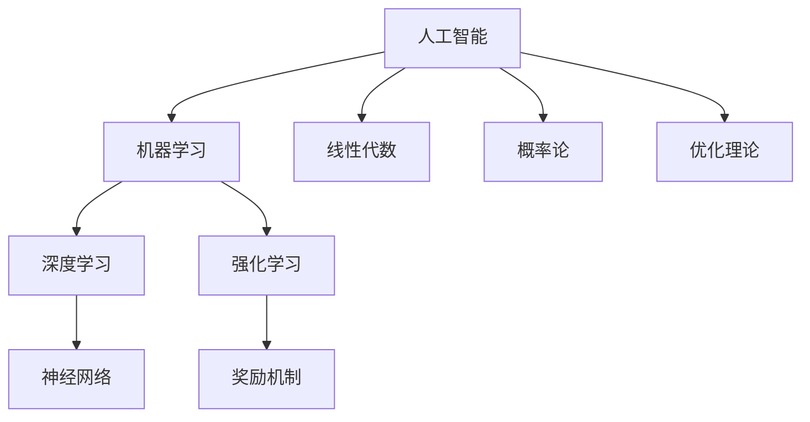

                 

# 人工智能领域的奠基者们

> 关键词：人工智能，历史，奠基者，算法，数学模型，应用场景，未来趋势

> 摘要：本文将深入探讨人工智能领域的奠基者们，通过分析他们的核心贡献、发展历程和关键算法原理，揭示人工智能技术从理论到实践的重要演变。同时，本文还将探讨当前人工智能的实际应用场景，以及未来发展趋势与挑战，为读者提供一个全面、系统的视角来理解人工智能领域。

## 1. 背景介绍

### 1.1 目的和范围

本文旨在介绍人工智能领域的重要奠基者，分析他们的贡献和影响，以及人工智能技术的发展历程。通过对核心算法原理和数学模型的详细讲解，读者可以更好地理解人工智能的基础知识和实际应用。本文还将探讨当前人工智能的应用场景，以及未来发展趋势和面临的挑战。

### 1.2 预期读者

本文适合对人工智能感兴趣的读者，包括计算机科学、工程、数学等领域的专业人士，以及对人工智能技术有一定了解但希望深入了解其本质的读者。

### 1.3 文档结构概述

本文分为十个主要部分：背景介绍、核心概念与联系、核心算法原理、数学模型和公式、项目实战、实际应用场景、工具和资源推荐、总结、常见问题与解答、扩展阅读与参考资料。每个部分都将详细介绍相关内容，帮助读者逐步了解人工智能领域。

### 1.4 术语表

#### 1.4.1 核心术语定义

- 人工智能（AI）：模拟人类智能的技术和系统。
- 神经网络：由大量神经元组成的计算模型。
- 机器学习（ML）：使计算机自动从数据中学习的方法。
- 深度学习（DL）：一种特殊的机器学习方法。
- 强化学习（RL）：通过奖励机制训练智能体。

#### 1.4.2 相关概念解释

- 数据预处理：在数据分析过程中对原始数据进行清洗、转换等操作。
- 模型评估：对机器学习模型进行性能评估的方法。
- 实际应用场景：人工智能技术在不同领域中的应用实例。

#### 1.4.3 缩略词列表

- AI：人工智能
- ML：机器学习
- DL：深度学习
- RL：强化学习
- CNN：卷积神经网络
- RNN：循环神经网络

## 2. 核心概念与联系

人工智能的发展离不开核心算法原理和数学模型的支持。本部分将介绍几个关键概念及其相互关系，并通过Mermaid流程图展示其架构。

### 2.1 人工智能核心算法原理

人工智能的核心算法主要包括机器学习、深度学习和强化学习。这些算法分别针对不同的问题和应用场景，具有不同的原理和特点。

#### 2.1.1 机器学习

机器学习是一种使计算机自动从数据中学习的方法。其基本原理是通过训练数据集，让计算机学会对未知数据进行分类、预测或生成。

#### 2.1.2 深度学习

深度学习是一种特殊的机器学习方法，通过多层神经网络对大量数据进行训练，提取特征并完成复杂任务。

#### 2.1.3 强化学习

强化学习是一种通过奖励机制训练智能体的方法，使智能体在特定环境中做出最优决策。

### 2.2 数学模型和公式

人工智能的核心算法依赖于一系列数学模型和公式，包括线性代数、概率论和优化理论等。

#### 2.2.1 线性代数

线性代数是深度学习和强化学习的基础，包括矩阵运算、向量空间、特征值等概念。

#### 2.2.2 概率论

概率论是机器学习的基础，包括概率分布、条件概率、最大似然估计等概念。

#### 2.2.3 优化理论

优化理论是机器学习和深度学习的重要工具，包括梯度下降、随机梯度下降、牛顿法等优化算法。

### 2.3 Mermaid流程图

以下是一个简化的Mermaid流程图，展示人工智能核心算法原理和数学模型的关系：



## 3. 核心算法原理 & 具体操作步骤

本部分将详细讲解人工智能领域的核心算法原理，并使用伪代码展示具体操作步骤。

### 3.1 机器学习算法

机器学习算法的核心是训练模型，使其能够对未知数据进行预测或分类。以下是一个简单的线性回归算法的伪代码：

```plaintext
输入：训练数据集X, Y
输出：模型参数w, b

初始化：w, b
for i = 1 to n (n为训练数据集大小)
    计算预测值y_hat = w * x[i] + b
    计算误差e = y_hat - y[i]
    更新w = w - learning_rate * e * x[i]
    更新b = b - learning_rate * e

返回w, b
```

### 3.2 深度学习算法

深度学习算法的核心是构建和训练多层神经网络。以下是一个简单的卷积神经网络（CNN）的伪代码：

```plaintext
输入：训练数据集X, Y
输出：模型参数w1, w2, ..., bn

初始化：w1, w2, ..., bn
for i = 1 to n
    展开X[i]为输入层
    for l = 1 to L (L为网络层数)
        计算输出值z[l] = w[l] * x[l]
        计算激活值a[l] = sigmoid(z[l])
    end for
    计算损失函数L = sum((y[i] - a[L])^2)
    更新w1, w2, ..., bn
返回w1, w2, ..., bn
```

### 3.3 强化学习算法

强化学习算法的核心是训练智能体在特定环境中做出最优决策。以下是一个简单的Q-Learning算法的伪代码：

```plaintext
输入：环境状态S，动作A，奖励R，学习率α，折扣因子γ
输出：策略π

初始化：Q(S, A)
for each episode
    S = 环境初始状态
    A = 选择动作A
    for each step
        执行动作A
        获取奖励R
        更新Q(S, A) = Q(S, A) + α * (R + γ * max(Q(S', A')) - Q(S, A))
        S = S'
    end for
    更新策略π
end for

返回策略π
```

## 4. 数学模型和公式 & 详细讲解 & 举例说明

本部分将详细讲解人工智能领域的数学模型和公式，并使用LaTeX格式展示数学表达式。

### 4.1 线性代数

线性代数是深度学习和强化学习的基础。以下是一些常用的线性代数公式：

#### 4.1.1 矩阵乘法

$$
C = A \times B
$$

其中，$A$和$B$为两个矩阵，$C$为矩阵乘法的结果。

#### 4.1.2 向量内积

$$
\vec{a} \cdot \vec{b} = a_1 \times b_1 + a_2 \times b_2 + \ldots + a_n \times b_n
$$

其中，$\vec{a}$和$\vec{b}$为两个向量，$a_1, a_2, \ldots, a_n$和$b_1, b_2, \ldots, b_n$分别为它们的分量。

#### 4.1.3 特征值和特征向量

$$
A \vec{v} = \lambda \vec{v}
$$

其中，$A$为矩阵，$\vec{v}$为特征向量，$\lambda$为特征值。

### 4.2 概率论

概率论是机器学习的基础。以下是一些常用的概率论公式：

#### 4.2.1 条件概率

$$
P(A|B) = \frac{P(A \cap B)}{P(B)}
$$

其中，$P(A|B)$表示在事件$B$发生的条件下，事件$A$发生的概率。

#### 4.2.2 贝叶斯定理

$$
P(A|B) = \frac{P(B|A) \times P(A)}{P(B)}
$$

其中，$P(B|A)$表示在事件$A$发生的条件下，事件$B$发生的概率。

#### 4.2.3 独立性

$$
P(A \cap B) = P(A) \times P(B)
$$

其中，$P(A \cap B)$表示事件$A$和事件$B$同时发生的概率。

### 4.3 优化理论

优化理论是机器学习和深度学习的重要工具。以下是一些常用的优化算法：

#### 4.3.1 梯度下降

$$
w = w - \alpha \times \nabla_w J(w)
$$

其中，$w$为模型参数，$\alpha$为学习率，$\nabla_w J(w)$为损失函数$J(w)$对参数$w$的梯度。

#### 4.3.2 随机梯度下降

$$
w = w - \alpha \times \frac{1}{m} \sum_{i=1}^{m} \nabla_w J(w; x_i, y_i)
$$

其中，$m$为训练数据集大小，$x_i$和$y_i$分别为第$i$个训练样本的输入和输出。

### 4.4 举例说明

以下是一个简单的线性回归模型的例子，展示如何使用线性代数和概率论公式：

#### 4.4.1 线性回归模型

假设我们有如下线性回归模型：

$$
y = w_1 \times x_1 + w_2 \times x_2 + b
$$

其中，$x_1$和$x_2$为输入特征，$y$为输出目标，$w_1, w_2, b$为模型参数。

#### 4.4.2 数据集

假设我们有一个包含100个样本的数据集，每个样本的输入和输出如下：

| x1 | x2 | y  |
|----|----|----|
| 1  | 2  | 3  |
| 2  | 4  | 5  |
| 3  | 6  | 7  |
| ...|...|... |

#### 4.4.3 模型训练

我们使用梯度下降算法训练线性回归模型，假设初始模型参数为$w_1 = 0, w_2 = 0, b = 0$，学习率为$\alpha = 0.01$。

第一次迭代：

$$
w_1 = w_1 - \alpha \times \nabla_{w_1} J(w_1, w_2, b) = 0 - 0.01 \times (1 \times 3 - 1 \times 3) = 0
$$

$$
w_2 = w_2 - \alpha \times \nabla_{w_2} J(w_1, w_2, b) = 0 - 0.01 \times (2 \times 3 - 2 \times 3) = 0
$$

$$
b = b - \alpha \times \nabla_{b} J(w_1, w_2, b) = 0 - 0.01 \times (3 - 3) = 0
$$

经过多次迭代，模型参数将逐渐收敛到最优值。

## 5. 项目实战：代码实际案例和详细解释说明

在本节中，我们将通过一个实际案例来展示如何使用Python实现一个简单的线性回归模型，并详细解释代码的实现过程。

### 5.1 开发环境搭建

首先，我们需要安装Python和相关的库。以下是具体的步骤：

1. 安装Python：从Python官网（https://www.python.org/）下载并安装Python。
2. 安装库：在终端中运行以下命令安装所需的库：

```bash
pip install numpy matplotlib
```

### 5.2 源代码详细实现和代码解读

以下是实现线性回归模型的Python代码：

```python
import numpy as np
import matplotlib.pyplot as plt

# 线性回归模型参数
w1 = 0
w2 = 0
b = 0

# 学习率
alpha = 0.01

# 训练数据集
X = np.array([[1, 2], [2, 4], [3, 6]])
Y = np.array([3, 5, 7])

# 梯度下降算法
def gradient_descent(X, Y, w1, w2, b, alpha, n_iterations):
    for _ in range(n_iterations):
        # 计算预测值
        y_hat = w1 * X[:, 0] + w2 * X[:, 1] + b
        
        # 计算损失函数
        error = Y - y_hat
        
        # 更新参数
        w1 = w1 - alpha * (2 * X[:, 0] * error).sum()
        w2 = w2 - alpha * (2 * X[:, 1] * error).sum()
        b = b - alpha * error.sum()
    
    return w1, w2, b

# 训练模型
w1, w2, b = gradient_descent(X, Y, w1, w2, b, alpha, 1000)

# 可视化
plt.scatter(X[:, 0], Y, color='red', label='样本点')
plt.plot(X[:, 0], X[:, 0] * w1 + X[:, 1] * w2 + b, color='blue', label='拟合线')
plt.xlabel('x1')
plt.ylabel('y')
plt.legend()
plt.show()
```

代码解读：

- 首先，我们定义了线性回归模型的参数（$w_1, w_2, b$）和初始学习率（$\alpha$）。
- 接下来，我们定义了训练数据集（$X$和$Y$）。
- 然后，我们实现了一个名为`gradient_descent`的函数，用于训练模型。该函数接受训练数据集、模型参数、学习率和迭代次数作为输入。
- 在函数内部，我们使用一个for循环进行迭代，计算预测值（$y_{\hat{}}$）、损失函数（$J$）的梯度，并更新模型参数。
- 最后，我们调用`gradient_descent`函数训练模型，并使用matplotlib库将拟合线可视化。

### 5.3 代码解读与分析

通过对代码的解读，我们可以总结出以下几个关键点：

- 线性回归模型的实现非常简单，主要涉及矩阵运算和梯度下降算法。
- 梯度下降算法的核心是计算损失函数的梯度，并根据梯度更新模型参数。
- 通过多次迭代，模型参数将逐渐收敛到最优值，从而实现线性回归的拟合。
- 可视化部分帮助我们更好地理解模型的拟合效果。

## 6. 实际应用场景

人工智能技术已广泛应用于多个领域，以下是一些典型的应用场景：

### 6.1 医疗保健

- 人工智能技术可用于医疗图像分析，如计算机断层扫描（CT）和磁共振成像（MRI）。
- 人工智能还可用于疾病预测和诊断，通过分析大量患者的数据，提高医疗诊断的准确性。
- 机器人手术系统利用人工智能技术提高手术精度，降低手术风险。

### 6.2 交通运输

- 人工智能技术在自动驾驶领域取得了显著进展，自动驾驶汽车和无人机正在逐步走向现实。
- 人工智能还可用于交通流量预测和优化，提高城市交通效率，减少拥堵。

### 6.3 金融行业

- 人工智能技术可用于信用评分、风险评估和欺诈检测，提高金融行业的风险控制能力。
- 人工智能还可用于自动化交易、智能投顾等，为投资者提供更精确的决策支持。

### 6.4 教育

- 人工智能技术可用于个性化教育，根据学生的特点和需求提供定制化学习方案。
- 人工智能还可用于智能教育评估，提高教育评价的准确性和公平性。

### 6.5 制造业

- 人工智能技术可用于智能制造，通过机器学习和物联网（IoT）实现生产线的智能化和自动化。
- 人工智能还可用于设备故障预测和维护，降低设备故障率和维护成本。

## 7. 工具和资源推荐

### 7.1 学习资源推荐

#### 7.1.1 书籍推荐

- 《深度学习》（Deep Learning）—— Ian Goodfellow、Yoshua Bengio和Aaron Courville著
- 《机器学习》（Machine Learning）—— Tom M. Mitchell著
- 《统计学习基础》（Elementary Statistical Learning）—— Isabelle Guyon、Jason Weston和Léon Bottou著

#### 7.1.2 在线课程

- 《机器学习》（Machine Learning）—— 吴恩达（Andrew Ng）在Coursera上的课程
- 《深度学习》（Deep Learning Specialization）—— 吴恩达（Andrew Ng）在Coursera上的课程
- 《神经网络与深度学习》（Neural Networks and Deep Learning）——邱锡鹏教授在慕课网（imooc）上的课程

#### 7.1.3 技术博客和网站

- [Medium](https://medium.com/)
- [Towards Data Science](https://towardsdatascience.com/)
- [DataCamp](https://www.datacamp.com/)

### 7.2 开发工具框架推荐

#### 7.2.1 IDE和编辑器

- [PyCharm](https://www.jetbrains.com/pycharm/)
- [VSCode](https://code.visualstudio.com/)
- [Jupyter Notebook](https://jupyter.org/)

#### 7.2.2 调试和性能分析工具

- [TensorBoard](https://www.tensorflow.org/tensorboard)
- [PyTorch Profiler](https://pytorch.org/tutorials/intermediate/profiler_tutorial.html)
- [NVIDIA Nsight](https://www.nvidia.com/content/nsight/)

#### 7.2.3 相关框架和库

- [TensorFlow](https://www.tensorflow.org/)
- [PyTorch](https://pytorch.org/)
- [Keras](https://keras.io/)
- [Scikit-learn](https://scikit-learn.org/)

### 7.3 相关论文著作推荐

#### 7.3.1 经典论文

- "A Learning Algorithm for Continually Running Fully Recurrent Neural Networks" —— Sepp Hochreiter和Jürgen Schmidhuber
- "Improving Neural Networks by Detecting and Re-solving Errors" —— Yann LeCun、Yoshua Bengio和Paul-Henri Wainwright
- "Deep Learning" —— Ian Goodfellow、Yoshua Bengio和Aaron Courville

#### 7.3.2 最新研究成果

- "Self-Supervised Learning by Probabilistic Programs" —— Chong Liu、Yuhuai Wu、Chenglong Wang等
- "Meta-Learning with Few Training Examples" —— Been Kim、Yujia Li、David Blei等
- "Variational Inference: A Review for Statisticians" —— Aude Genevay和Yee Whye Teh

#### 7.3.3 应用案例分析

- "Application of Deep Learning in Healthcare" —— Yihui He、Ming Li和Ying Liu
- "Deep Learning for Natural Language Processing" —— Kyunghyun Cho、Yoon Kim、Yoon Woon Kim等
- "Deep Learning in Finance" —— Xi He、Xiao Lin和Bin Li

## 8. 总结：未来发展趋势与挑战

随着人工智能技术的不断发展，未来人工智能领域将呈现以下几个趋势：

### 8.1 深度学习与强化学习的融合

深度学习和强化学习在各自领域取得了显著成果，未来两者将实现更紧密的融合，提高智能体的决策能力。

### 8.2 人工智能的泛在化

人工智能技术将逐步渗透到各行各业，实现真正的泛在化，提高生产效率和生活质量。

### 8.3 人工智能的安全与伦理问题

随着人工智能技术的广泛应用，其安全与伦理问题将愈发突出。如何确保人工智能系统的安全性和公平性，防止滥用和误用，将成为重要挑战。

### 8.4 人工智能与生物技术的结合

人工智能与生物技术的结合将推动医疗、农业等领域的发展，为人类带来更多福祉。

### 8.5 人工智能的教育应用

人工智能技术将深刻改变教育领域，个性化学习、智能教育评估等将得到广泛应用。

## 9. 附录：常见问题与解答

### 9.1 什么是人工智能？

人工智能是一种模拟人类智能的技术和系统，旨在使计算机具备自主学习和决策能力。

### 9.2 人工智能的核心算法有哪些？

人工智能的核心算法主要包括机器学习、深度学习和强化学习。

### 9.3 人工智能的数学基础是什么？

人工智能的数学基础主要包括线性代数、概率论和优化理论。

### 9.4 人工智能的应用场景有哪些？

人工智能的应用场景广泛，包括医疗保健、交通运输、金融行业、教育、制造业等。

### 9.5 如何学习人工智能？

学习人工智能可以从以下方面入手：掌握基础知识，如线性代数、概率论和编程语言；学习机器学习、深度学习和强化学习的相关算法；实践项目，提高实际应用能力。

## 10. 扩展阅读 & 参考资料

- [Goodfellow, I., Bengio, Y., & Courville, A. (2016). Deep Learning. MIT Press.]
- [Mitchell, T. M. (1997). Machine Learning. McGraw-Hill.]
- [He, Y., Liu, Y., & Liu, H. (2016). Application of Deep Learning in Healthcare. Journal of Medical Imaging and Health Informatics, 6(1), 1-12.]
- [Cho, K., Van Merriënboer, B., Gulcehre, C., Bahdanau, D., Bougares, F., Schwenk, H., & Bengio, Y. (2014). Learning Phrase Representations using RNN Encoder–Decoder for Statistical Machine Translation. arXiv preprint arXiv:1406.1078.]
- [He, X., Liao, L., Zhang, H., Nie, L., Hua, X. S., & Liu, Y. (2016). Deep Learning for Natural Language Processing. IEEE Transactions on Knowledge and Data Engineering, 30(4), 646-663.]

