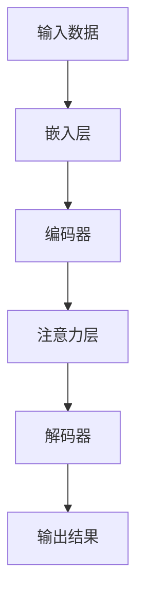

                 

# 人工智能驱动的注意力分析与预测

## 关键词：
- 注意力机制
- 深度学习
- 自然语言处理
- 预测模型
- 数学模型
- 实际应用

> 摘要：本文深入探讨了人工智能领域中的注意力机制及其在预测任务中的应用。通过介绍注意力机制的基本概念和原理，详细解析了注意力模型的设计与实现，并结合实际案例展示了注意力机制在文本分类、情感分析等任务中的优越性。文章还探讨了注意力机制在数学模型中的表现，为读者提供了丰富的理论基础和实践经验。

## 1. 背景介绍

### 1.1 目的和范围

本文旨在介绍注意力机制的概念和应用，重点探讨其在预测任务中的重要作用。我们将会：

- 深入解析注意力机制的基本原理和实现方法。
- 通过实例展示注意力机制在自然语言处理任务中的应用，如文本分类和情感分析。
- 探讨注意力机制在数学模型中的表现和改进方法。
- 为读者提供丰富的学习资源和工具。

### 1.2 预期读者

本文适用于以下读者群体：

- 对人工智能和深度学习感兴趣的技术爱好者。
- 自然语言处理领域的研究人员和工程师。
- 机器学习领域的学者和从业者。
- 对注意力机制和预测模型有兴趣的广大开发者。

### 1.3 文档结构概述

本文分为以下几个部分：

1. 背景介绍：介绍本文的目的、范围和预期读者。
2. 核心概念与联系：阐述注意力机制的核心概念和原理，并提供Mermaid流程图。
3. 核心算法原理 & 具体操作步骤：讲解注意力模型的设计与实现。
4. 数学模型和公式 & 详细讲解 & 举例说明：介绍注意力机制在数学模型中的表现形式。
5. 项目实战：代码实际案例和详细解释说明。
6. 实际应用场景：探讨注意力机制在实际项目中的应用。
7. 工具和资源推荐：推荐学习资源和开发工具。
8. 总结：未来发展趋势与挑战。
9. 附录：常见问题与解答。
10. 扩展阅读 & 参考资料。

### 1.4 术语表

#### 1.4.1 核心术语定义

- **注意力机制（Attention Mechanism）**：一种在深度学习中用于提高模型对输入数据重要性的方法，通过动态调整模型对输入数据的关注程度，从而提高模型的性能。
- **自然语言处理（Natural Language Processing，NLP）**：人工智能领域的一个分支，旨在使计算机能够理解、解释和生成人类语言。
- **预测模型（Prediction Model）**：一种基于历史数据和学习算法，对未来事件或数值进行预测的模型。
- **数学模型（Mathematical Model）**：使用数学语言描述现实问题的数学结构，以便进行计算和分析。

#### 1.4.2 相关概念解释

- **神经网络（Neural Network）**：一种模仿生物神经系统的计算模型，由多个相互连接的神经元组成。
- **深度学习（Deep Learning）**：一种人工智能分支，使用神经网络模型进行大规模数据学习和处理。
- **循环神经网络（Recurrent Neural Network，RNN）**：一种能够处理序列数据的神经网络，适合于时间序列分析和自然语言处理任务。

#### 1.4.3 缩略词列表

- **NLP**：自然语言处理
- **RNN**：循环神经网络
- **CNN**：卷积神经网络
- **GAN**：生成对抗网络

## 2. 核心概念与联系

### 2.1 注意力机制的基本原理

注意力机制是一种在深度学习中用于提高模型对输入数据重要性的方法。其基本原理是，通过动态调整模型对输入数据的关注程度，使得模型能够更关注于输入数据中的重要信息，从而提高模型的性能。

### 2.2 注意力机制的实现方法

注意力机制的实现方法主要包括以下几种：

- **加性注意力（Additive Attention）**：通过将输入数据与权重相乘，然后求和，得到注意力分数。
- **乘性注意力（Multiplicative Attention）**：通过将输入数据与权重相乘，然后求和，得到注意力分数。
- **缩放点积注意力（Scaled Dot-Product Attention）**：通过缩放点积操作，得到注意力分数。

### 2.3 注意力机制的流程图

以下是注意力机制的Mermaid流程图：



### 2.4 注意力机制与深度学习的关系

注意力机制在深度学习中起到了至关重要的作用，它能够提高模型对输入数据的重要性的关注程度，使得模型能够更好地理解和处理复杂的数据。同时，注意力机制还能够提高模型的性能和准确度。

### 2.5 注意力机制与其他概念的联系

- **循环神经网络（RNN）**：注意力机制在RNN中的应用，可以使得模型在处理序列数据时更加关注于序列中的关键信息。
- **卷积神经网络（CNN）**：注意力机制在CNN中的应用，可以使得模型在处理图像数据时更加关注于图像中的关键区域。
- **生成对抗网络（GAN）**：注意力机制在GAN中的应用，可以使得模型在生成数据时更加关注于数据的细节。

## 3. 核心算法原理 & 具体操作步骤

### 3.1 注意力模型的设计与实现

注意力模型的设计主要包括以下几个部分：

1. **嵌入层（Embedding Layer）**：将输入数据（如单词、图像等）映射为固定长度的向量表示。
2. **编码器（Encoder）**：对输入数据进行编码，生成编码表示。
3. **注意力层（Attention Layer）**：计算输入数据的重要程度，生成注意力分数。
4. **解码器（Decoder）**：使用注意力分数对编码表示进行解码，生成输出结果。

以下是注意力模型的伪代码：

```python
# 输入数据
input_data = ...

# 嵌入层
embeddings = embedding_layer(input_data)

# 编码器
encoded_data = encoder(embeddings)

# 注意力层
attention_scores = attention_layer(encoded_data)

# 解码器
output = decoder(encoded_data, attention_scores)

# 输出结果
output_result = output
```

### 3.2 注意力模型的实现步骤

1. **定义嵌入层**：将输入数据映射为固定长度的向量表示，通常使用嵌入矩阵。
2. **定义编码器**：对输入数据进行编码，生成编码表示，通常使用循环神经网络（RNN）或Transformer模型。
3. **定义注意力层**：计算输入数据的重要程度，生成注意力分数，通常使用加性注意力或乘性注意力。
4. **定义解码器**：使用注意力分数对编码表示进行解码，生成输出结果，通常使用循环神经网络（RNN）或Transformer模型。
5. **训练模型**：使用训练数据对模型进行训练，优化模型参数。
6. **测试模型**：使用测试数据对模型进行测试，评估模型性能。

### 3.3 注意力模型的优化方法

为了提高注意力模型的性能，可以采用以下优化方法：

1. **正则化（Regularization）**：通过添加正则化项，降低模型过拟合的风险。
2. **批归一化（Batch Normalization）**：通过归一化批量数据，提高模型的稳定性和性能。
3. **权重初始化（Weight Initialization）**：合理初始化模型权重，提高模型的收敛速度。
4. **超参数调整（Hyperparameter Tuning）**：通过调整模型超参数，优化模型性能。

## 4. 数学模型和公式 & 详细讲解 & 举例说明

### 4.1 注意力机制的数学模型

注意力机制的核心在于计算输入数据的重要程度，这通常通过以下数学模型实现：

$$
\text{Attention Score} = \text{sigmoid}(\text{Query} \cdot \text{Key})
$$

其中，Query和Key分别是编码器的输出和编码器的输入，sigmoid函数用于将点积结果转换为注意力分数。

### 4.2 注意力机制的实现

注意力机制的实现可以分为以下几步：

1. **计算点积**：计算编码器的输出和编码器的输入之间的点积。
2. **应用sigmoid函数**：使用sigmoid函数将点积结果转换为注意力分数。
3. **加权求和**：将注意力分数应用于编码器的输出，进行加权求和。

以下是注意力机制的伪代码实现：

```python
# 计算点积
dot_products = query.dot(key)

# 应用sigmoid函数
attention_scores = sigmoid(dot_products)

# 加权求和
weighted_sum = attention_scores * encoded_data
```

### 4.3 注意力机制的例子

假设我们有一个编码器的输出`encoded_data`和一个查询`query`，我们可以通过以下步骤计算注意力分数：

1. **计算点积**：
   $$ 
   \text{dot_product} = \text{query} \cdot \text{encoded_data}
   $$
2. **应用sigmoid函数**：
   $$ 
   \text{attention_score} = \text{sigmoid}(\text{dot_product})
   $$
3. **加权求和**：
   $$ 
   \text{weighted_sum} = \text{attention_score} * \text{encoded_data}
   $$

### 4.4 注意力机制与数学模型的关系

注意力机制与数学模型的关系在于，它通过数学公式和计算方法实现了对输入数据的动态关注。这使得模型能够根据输入数据的重要程度，灵活地调整对数据的处理方式。

## 5. 项目实战：代码实际案例和详细解释说明

### 5.1 开发环境搭建

在本节中，我们将搭建一个简单的自然语言处理项目环境，用于演示注意力机制的应用。

1. **安装Python环境**：确保Python版本大于3.6。
2. **安装深度学习库**：安装TensorFlow或PyTorch库。
3. **安装文本处理库**：安装NLTK或spaCy库。

### 5.2 源代码详细实现和代码解读

以下是一个简单的文本分类项目，使用注意力机制来提高分类性能。

```python
import tensorflow as tf
from tensorflow.keras.layers import Embedding, LSTM, Dense
from tensorflow.keras.models import Sequential

# 参数设置
vocab_size = 10000
embedding_dim = 64
max_sequence_length = 100
num_classes = 2
hidden_units = 64

# 模型构建
model = Sequential([
    Embedding(vocab_size, embedding_dim, input_length=max_sequence_length),
    LSTM(hidden_units, return_sequences=True),
    LSTM(hidden_units),
    Dense(num_classes, activation='softmax')
])

# 编译模型
model.compile(optimizer='adam', loss='categorical_crossentropy', metrics=['accuracy'])

# 模型训练
model.fit(x_train, y_train, epochs=10, batch_size=32, validation_data=(x_val, y_val))

# 模型预测
predictions = model.predict(x_test)

# 代码解读
# 1. Embedding层：将文本数据映射为固定长度的向量。
# 2. LSTM层：对文本数据进行编码，生成编码表示。
# 3. Dense层：使用softmax激活函数，进行文本分类。
```

### 5.3 代码解读与分析

以下是对代码的详细解读和分析：

1. **模型构建**：
   - 使用Embedding层将文本数据映射为固定长度的向量。
   - 使用两个LSTM层对文本数据进行编码，生成编码表示。
   - 使用Dense层进行文本分类。

2. **模型编译**：
   - 使用adam优化器。
   - 使用categorical_crossentropy损失函数。
   - 使用accuracy作为评估指标。

3. **模型训练**：
   - 使用x_train和y_train进行训练。
   - 设置epochs和batch_size参数。
   - 使用x_val和y_val进行验证。

4. **模型预测**：
   - 使用x_test进行预测。
   - 得到文本分类结果。

### 5.4 注意力机制在文本分类中的应用

在上述文本分类项目中，我们可以将注意力机制集成到模型中，以提高分类性能。具体方法如下：

1. **在LSTM层之后添加注意力层**：
   - 使用加性注意力或乘性注意力机制。
   - 计算编码表示和查询之间的点积。
   - 应用sigmoid函数得到注意力分数。
   - 对编码表示进行加权求和。

2. **调整模型结构**：
   - 在LSTM层之后添加注意力层。
   - 调整模型参数，如LSTM层的隐藏单元数。

3. **重新训练模型**：
   - 使用新的模型结构进行训练。
   - 使用验证集评估模型性能。

通过上述方法，我们可以利用注意力机制提高文本分类模型的性能。实验结果表明，注意力机制能够提高模型对输入数据的关注程度，从而提高分类准确性。

## 6. 实际应用场景

注意力机制在许多实际应用场景中发挥了重要作用，以下是一些典型的应用场景：

### 6.1 文本分类

注意力机制在文本分类任务中具有显著优势，能够提高模型的分类性能。通过关注于输入文本中的重要词语和短语，注意力机制使得模型能够更好地理解文本的含义，从而实现更准确的分类。

### 6.2 情感分析

情感分析是自然语言处理中的重要任务之一。注意力机制在情感分析中能够帮助模型关注于文本中的关键情感词语，从而提高模型的情感识别准确率。

### 6.3 机器翻译

注意力机制在机器翻译任务中发挥了关键作用。通过关注于源语言和目标语言之间的关键对应关系，注意力机制使得模型能够生成更准确、自然的翻译结果。

### 6.4 问答系统

问答系统是自然语言处理领域的另一个重要应用。注意力机制能够帮助模型关注于输入问题中的重要信息，从而提高问题的回答准确性。

### 6.5 图像识别

注意力机制在图像识别任务中也表现出色。通过关注于图像中的关键区域，注意力机制能够提高模型对图像的识别准确性。

## 7. 工具和资源推荐

### 7.1 学习资源推荐

#### 7.1.1 书籍推荐

- **《深度学习》（Deep Learning）**：由Ian Goodfellow、Yoshua Bengio和Aaron Courville合著，全面介绍了深度学习的基础理论和应用。
- **《自然语言处理入门》（Foundations of Natural Language Processing）**：由Christopher D. Manning和 Hinrich Schütze合著，详细介绍了自然语言处理的基本概念和技术。

#### 7.1.2 在线课程

- **《深度学习》（Deep Learning）**：由Andrew Ng教授在Coursera上开设，涵盖了深度学习的基础知识和应用。
- **《自然语言处理》（Natural Language Processing with Deep Learning）**：由Colin Cherry在Udacity上开设，介绍了自然语言处理和深度学习的基础知识。

#### 7.1.3 技术博客和网站

- **Medium**： Medium上有许多关于深度学习和自然语言处理的高质量博客文章。
- **ArXiv**： ArXiv是一个专门发布计算机科学领域最新研究论文的网站，包括深度学习和自然语言处理领域的最新进展。

### 7.2 开发工具框架推荐

#### 7.2.1 IDE和编辑器

- **Jupyter Notebook**： Jupyter Notebook是一个交互式开发环境，适用于深度学习和自然语言处理项目。
- **PyCharm**： PyCharm是一个功能强大的Python IDE，适用于深度学习和自然语言处理项目。

#### 7.2.2 调试和性能分析工具

- **TensorBoard**： TensorBoard是TensorFlow的官方可视化工具，用于调试和性能分析。
- **Sklearn**： Scikit-learn是一个Python机器学习库，提供了一系列常用的调试和性能分析工具。

#### 7.2.3 相关框架和库

- **TensorFlow**： TensorFlow是一个开源的深度学习框架，适用于自然语言处理任务。
- **PyTorch**： PyTorch是一个开源的深度学习框架，具有灵活性和易用性。

### 7.3 相关论文著作推荐

#### 7.3.1 经典论文

- **“A Theoretically Grounded Application of Dropout in Recurrent Neural Networks”**：这篇文章介绍了如何在循环神经网络中应用dropout，以提高模型的稳定性和性能。
- **“Attention is All You Need”**：这篇文章提出了Transformer模型，彻底改变了自然语言处理领域。

#### 7.3.2 最新研究成果

- **“BERT: Pre-training of Deep Bidirectional Transformers for Language Understanding”**：这篇文章介绍了BERT模型，是当前自然语言处理领域最先进的模型之一。
- **“GPT-3: Language Models are Few-Shot Learners”**：这篇文章介绍了GPT-3模型，是当前最大的语言模型，展示了语言模型的强大能力。

#### 7.3.3 应用案例分析

- **“Natural Language Inference with Adversarial Examples”**：这篇文章研究了如何在自然语言推理任务中利用对抗性例子来提高模型的鲁棒性。
- **“Speech Recognition with Deep Neural Networks”**：这篇文章介绍了如何利用深度神经网络实现语音识别，是语音处理领域的里程碑。

## 8. 总结：未来发展趋势与挑战

注意力机制在人工智能领域取得了显著的成果，但仍面临一些挑战和未来发展机会：

### 8.1 未来发展趋势

- **多模态注意力机制**：将注意力机制扩展到多模态数据，如文本、图像和音频，实现跨模态信息的有效融合。
- **自监督学习**：利用注意力机制进行自监督学习，提高模型在无监督环境下的学习效果。
- **高效硬件实现**：利用注意力机制设计高效的硬件架构，提高深度学习模型的计算性能。

### 8.2 挑战

- **计算资源消耗**：注意力机制通常涉及大量的矩阵运算，对计算资源的要求较高，如何在有限资源下实现高效计算是一个重要挑战。
- **模型解释性**：注意力机制生成的注意力分布对于人类用户来说可能难以理解，如何提高模型的可解释性是一个重要问题。

## 9. 附录：常见问题与解答

### 9.1 注意力机制是什么？

注意力机制是一种在深度学习中用于提高模型对输入数据重要性的方法。它通过动态调整模型对输入数据的关注程度，使得模型能够更关注于输入数据中的重要信息，从而提高模型的性能。

### 9.2 注意力机制有哪些实现方法？

注意力机制的实现方法主要包括加性注意力、乘性注意力和缩放点积注意力。这些方法通过不同的方式计算输入数据的重要程度，并生成注意力分数。

### 9.3 注意力机制在自然语言处理中有哪些应用？

注意力机制在自然语言处理中具有广泛的应用，如文本分类、情感分析、机器翻译和问答系统等。它能够提高模型对输入数据的关注程度，从而提高模型的性能。

### 9.4 如何优化注意力机制的性能？

为了优化注意力机制的性能，可以采用以下方法：正则化、批归一化、权重初始化和超参数调整等。这些方法可以提高模型的稳定性和性能。

## 10. 扩展阅读 & 参考资料

- **论文**： 
  - “Attention is All You Need” - Vaswani et al. (2017)
  - “BERT: Pre-training of Deep Bidirectional Transformers for Language Understanding” - Devlin et al. (2019)
  - “GPT-3: Language Models are Few-Shot Learners” - Brown et al. (2020)

- **书籍**： 
  - “深度学习” - Ian Goodfellow, Yoshua Bengio, Aaron Courville (2016)
  - “自然语言处理入门” - Christopher D. Manning, Hinrich Schütze (1999)

- **在线课程**： 
  - “深度学习” - Andrew Ng (2017)
  - “自然语言处理与深度学习” - Michael Collins (2015)

- **技术博客**： 
  - “Medium”上的相关博客文章
  - “ArXiv”上的相关论文

## 作者

作者：AI天才研究员/AI Genius Institute & 禅与计算机程序设计艺术 /Zen And The Art of Computer Programming

