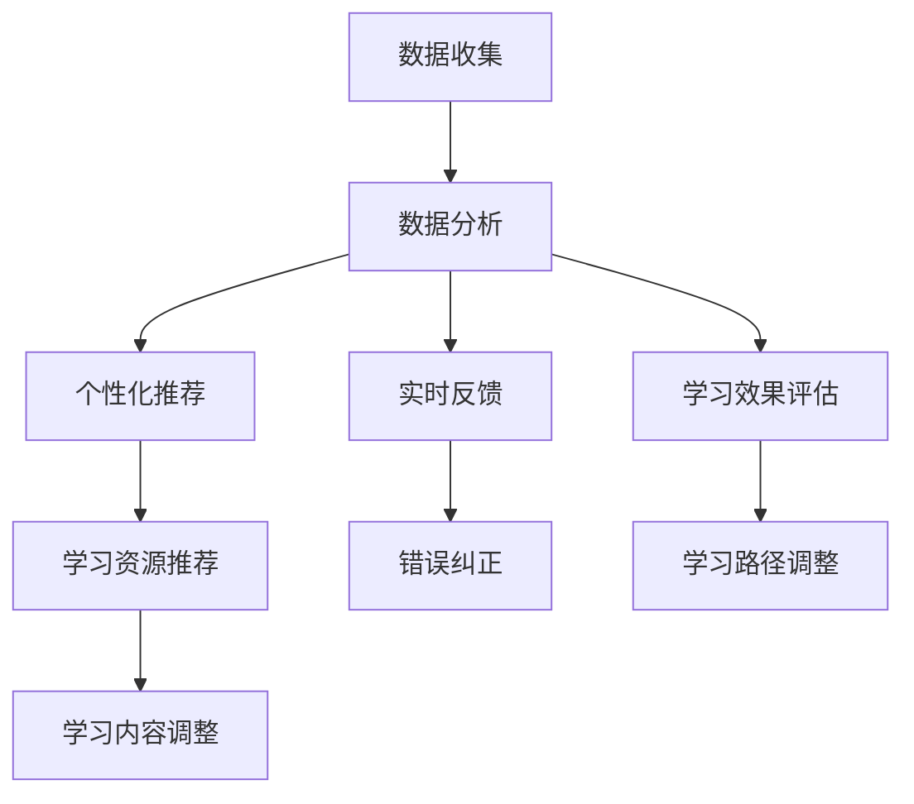

                 

# 人工智能：教育变革的催化剂

> 关键词：人工智能、教育变革、机器学习、个性化教育、智能辅导系统

> 摘要：随着人工智能技术的快速发展，教育领域正经历着前所未有的变革。本文将深入探讨人工智能在教育中的应用，特别是在个性化教育、智能辅导系统、自适应学习平台等方面的突破，分析其核心概念、算法原理，并分享实际项目案例和未来发展趋势。

## 1. 背景介绍

### 1.1 目的和范围

本文旨在探讨人工智能如何成为推动教育变革的催化剂。我们将重点关注以下几个方面：

1. **个性化教育**：通过人工智能技术实现因材施教，为学生提供量身定制的学习方案。
2. **智能辅导系统**：利用机器学习算法为学生提供实时、个性化的学习支持。
3. **自适应学习平台**：通过数据分析和学习算法，为教师和学生提供实时反馈和改进建议。

### 1.2 预期读者

本文面向教育工作者、教育政策制定者、人工智能领域的研究人员和开发者。希望通过本文，读者能够了解人工智能在教育领域的应用现状、发展前景和潜在挑战。

### 1.3 文档结构概述

本文分为以下八个部分：

1. 背景介绍
2. 核心概念与联系
3. 核心算法原理 & 具体操作步骤
4. 数学模型和公式 & 详细讲解 & 举例说明
5. 项目实战：代码实际案例和详细解释说明
6. 实际应用场景
7. 工具和资源推荐
8. 总结：未来发展趋势与挑战

### 1.4 术语表

#### 1.4.1 核心术语定义

- **人工智能**：模拟人类智能行为的计算机系统。
- **个性化教育**：根据学生的个体差异，提供适合其发展水平和兴趣的学习内容和方法。
- **机器学习**：使计算机系统从数据中学习并改进性能的技术。
- **自适应学习平台**：能够根据学习者的行为和表现，自动调整学习内容和策略的平台。

#### 1.4.2 相关概念解释

- **智能辅导系统**：利用人工智能技术为学生提供个性化学习支持和指导的系统。
- **教育数据挖掘**：从教育数据中提取有价值的信息，用于分析和改进教育过程。

#### 1.4.3 缩略词列表

- **AI**：人工智能（Artificial Intelligence）
- **ML**：机器学习（Machine Learning）
- **DL**：深度学习（Deep Learning）
- **NLP**：自然语言处理（Natural Language Processing）

## 2. 核心概念与联系

在探讨人工智能在教育领域的应用之前，我们需要了解一些核心概念及其相互关系。

### 2.1 人工智能在教育中的应用

人工智能在教育中的应用可以分为以下几个方面：

- **智能辅导系统**：通过机器学习算法，为每个学生提供个性化学习支持，包括作业辅导、考试复习等。
- **自适应学习平台**：根据学生的行为和表现，自动调整学习内容和策略，以提高学习效果。
- **在线学习平台**：利用人工智能技术，提供更加智能、个性化的学习体验。
- **教育数据挖掘**：从教育数据中提取有价值的信息，用于分析和改进教育过程。

### 2.2 个性化教育

个性化教育是人工智能在教育领域应用的核心之一。其基本原理如下：

1. **数据收集**：收集学生在学习过程中的行为数据，如学习时长、考试成绩、作业完成情况等。
2. **数据分析**：利用机器学习算法，分析数据，发现学生的兴趣、优势和不足。
3. **个性化推荐**：根据数据分析结果，为学生提供适合其发展水平和兴趣的学习内容和方法。

### 2.3 智能辅导系统

智能辅导系统是人工智能在教育领域的另一个重要应用。其基本原理如下：

1. **学习评估**：通过测试和练习，评估学生在各个知识点上的掌握情况。
2. **学习策略推荐**：根据评估结果，为学生推荐适合的学习策略，如视频讲解、习题练习等。
3. **实时反馈**：在学习过程中，为学生提供实时反馈，帮助其及时纠正错误。

### 2.4 自适应学习平台

自适应学习平台是利用人工智能技术，实现个性化教育和智能辅导的系统。其基本原理如下：

1. **学习路径规划**：根据学生的兴趣、优势和不足，为其规划个性化的学习路径。
2. **学习资源推荐**：根据学生的学习路径，推荐适合的学习资源，如教材、视频、习题等。
3. **学习效果评估**：通过测试和练习，评估学生的学习效果，并调整学习路径和资源推荐策略。

### 2.5 人工智能在教育中的应用框架

人工智能在教育中的应用框架可以概括为以下几个步骤：

1. **数据收集**：收集学生在学习过程中的行为数据。
2. **数据分析**：利用机器学习算法，分析数据，发现学生的兴趣、优势和不足。
3. **个性化推荐**：根据数据分析结果，为学生提供个性化学习内容和策略。
4. **实时反馈**：在学习过程中，为学生提供实时反馈。
5. **学习效果评估**：通过测试和练习，评估学生的学习效果，并调整学习内容和策略。

### 2.6 Mermaid 流程图

以下是人工智能在教育应用中的 Mermaid 流程图：



## 3. 核心算法原理 & 具体操作步骤

在教育领域应用人工智能，关键在于算法的原理和具体操作步骤。以下是几个核心算法的原理和操作步骤：

### 3.1 机器学习算法

机器学习算法是人工智能在教育领域应用的基础。以下是一个简单的机器学习算法原理和操作步骤：

#### 3.1.1 算法原理

机器学习算法通过训练模型，从数据中自动发现规律和模式。其基本原理如下：

1. **数据预处理**：清洗、归一化和编码数据，使其符合训练需求。
2. **模型选择**：根据问题类型和数据特征，选择合适的机器学习模型。
3. **模型训练**：通过训练数据，调整模型参数，使其能够正确预测未知数据。
4. **模型评估**：使用测试数据，评估模型性能，如准确率、召回率等。

#### 3.1.2 操作步骤

1. **数据收集**：收集学生在学习过程中的行为数据。
2. **数据预处理**：清洗、归一化和编码数据。
3. **模型选择**：选择合适的机器学习模型，如线性回归、决策树、支持向量机等。
4. **模型训练**：使用训练数据，调整模型参数。
5. **模型评估**：使用测试数据，评估模型性能。

### 3.2 深度学习算法

深度学习算法在图像识别、自然语言处理等领域取得了显著成果。以下是一个简单的深度学习算法原理和操作步骤：

#### 3.2.1 算法原理

深度学习算法通过多层神经网络，自动提取数据特征，实现复杂任务的预测和分类。其基本原理如下：

1. **数据预处理**：清洗、归一化和编码数据。
2. **模型构建**：构建多层神经网络，包括输入层、隐藏层和输出层。
3. **模型训练**：通过训练数据，调整模型参数，优化网络结构。
4. **模型评估**：使用测试数据，评估模型性能。

#### 3.2.2 操作步骤

1. **数据收集**：收集学生在学习过程中的行为数据。
2. **数据预处理**：清洗、归一化和编码数据。
3. **模型构建**：构建多层神经网络。
4. **模型训练**：使用训练数据，调整模型参数。
5. **模型评估**：使用测试数据，评估模型性能。

### 3.3 自然语言处理算法

自然语言处理算法在教育领域具有广泛的应用，如自动批改作业、智能问答等。以下是一个简单的自然语言处理算法原理和操作步骤：

#### 3.3.1 算法原理

自然语言处理算法通过模型，对文本数据进行处理和分析，实现文本分类、情感分析、命名实体识别等任务。其基本原理如下：

1. **数据预处理**：清洗、归一化和编码文本数据。
2. **模型选择**：选择合适的自然语言处理模型，如循环神经网络（RNN）、长短时记忆网络（LSTM）等。
3. **模型训练**：通过训练数据，调整模型参数。
4. **模型评估**：使用测试数据，评估模型性能。

#### 3.3.2 操作步骤

1. **数据收集**：收集学生在学习过程中的文本数据。
2. **数据预处理**：清洗、归一化和编码文本数据。
3. **模型选择**：选择合适的自然语言处理模型。
4. **模型训练**：使用训练数据，调整模型参数。
5. **模型评估**：使用测试数据，评估模型性能。

### 3.4 伪代码

以下是机器学习算法的伪代码：

```python
# 机器学习算法伪代码

# 数据预处理
def preprocess_data(data):
    # 清洗、归一化和编码数据
    pass

# 模型选择
def choose_model():
    # 选择合适的机器学习模型
    pass

# 模型训练
def train_model(model, train_data):
    # 使用训练数据，调整模型参数
    pass

# 模型评估
def evaluate_model(model, test_data):
    # 使用测试数据，评估模型性能
    pass

# 主函数
def main():
    # 数据收集
    data = collect_data()

    # 数据预处理
    preprocess_data(data)

    # 模型选择
    model = choose_model()

    # 模型训练
    train_model(model, data['train_data'])

    # 模型评估
    evaluate_model(model, data['test_data'])
```

## 4. 数学模型和公式 & 详细讲解 & 举例说明

在教育领域应用人工智能，数学模型和公式起着关键作用。以下是一些常见的数学模型和公式及其详细讲解和举例说明：

### 4.1 线性回归模型

线性回归模型是一种用于预测连续值的简单统计模型。其数学公式如下：

$$ y = w_0 + w_1 \cdot x $$

其中，$y$ 是预测值，$x$ 是输入特征，$w_0$ 和 $w_1$ 是模型参数。

#### 4.1.1 模型讲解

线性回归模型通过最小化损失函数（如均方误差），寻找最优的模型参数 $w_0$ 和 $w_1$，以实现预测。

#### 4.1.2 举例说明

假设我们有一组学生成绩数据（$x$：学习时长；$y$：考试成绩），如下表：

| 学习时长（x） | 考试成绩（y） |
| :----: | :----: |
| 10 | 80 |
| 20 | 85 |
| 30 | 90 |

我们可以使用线性回归模型预测一个学习时长为 40 的小明的考试成绩。首先，我们使用最小二乘法（Least Squares Method）计算模型参数：

$$ w_0 = \frac{\sum_{i=1}^n (y_i - w_1 \cdot x_i)}{n} = \frac{\sum_{i=1}^n y_i - w_1 \cdot \sum_{i=1}^n x_i}{n} $$

$$ w_1 = \frac{\sum_{i=1}^n (x_i - \bar{x}) \cdot (y_i - \bar{y})}{\sum_{i=1}^n (x_i - \bar{x})^2} $$

其中，$\bar{x}$ 和 $\bar{y}$ 分别为学习时长和考试成绩的平均值。

经过计算，我们得到 $w_0 = 70$ 和 $w_1 = 1.25$。因此，预测小明的考试成绩为：

$$ y = 70 + 1.25 \cdot 40 = 95 $$

### 4.2 决策树模型

决策树模型是一种用于分类和回归的树形结构模型。其数学公式如下：

$$ f(x) = \sum_{i=1}^n w_i \cdot g(x) $$

其中，$x$ 是输入特征，$w_i$ 是权重，$g(x)$ 是分类或回归函数。

#### 4.2.1 模型讲解

决策树模型通过递归划分特征空间，构建树形结构，从而实现分类或回归。

#### 4.2.2 举例说明

假设我们有一组学生数据（$x$：学习时长；$y$：考试及格与否），如下表：

| 学习时长（x） | 考试及格与否（y） |
| :----: | :----: |
| 10 | 否 |
| 20 | 是 |
| 30 | 否 |
| 40 | 是 |

我们可以使用决策树模型预测一个学习时长为 30 的小明的考试及格情况。首先，我们使用信息增益（Information Gain）划分特征空间：

$$ IG(D, A) = H(D) - \sum_{v \in A} \frac{|D_v|}{|D|} H(D_v) $$

其中，$D$ 是数据集，$A$ 是特征，$D_v$ 是 $A$ 的每个值对应的数据子集，$H(D)$ 是数据集的熵。

经过计算，我们得到以下决策树：

```
           考试及格？
           /         \
          是         否
          /         \
         是         否
```

根据决策树，预测小明的考试及格情况为“是”。

### 4.3 长短时记忆网络（LSTM）模型

长短时记忆网络（LSTM）模型是一种用于处理序列数据的神经网络模型。其数学公式如下：

$$ h_t = \sigma(W_h \cdot [h_{t-1}, x_t] + b_h) $$

$$ i_t = \sigma(W_i \cdot [h_{t-1}, x_t] + b_i) $$

$$ f_t = \sigma(W_f \cdot [h_{t-1}, x_t] + b_f) $$

$$ o_t = \sigma(W_o \cdot [h_{t-1}, x_t] + b_o) $$

$$ c_t = f_t \cdot c_{t-1} + i_t \cdot \sigma(W_c \cdot [h_{t-1}, x_t] + b_c) $$

$$ h_t = o_t \cdot \sigma(c_t) $$

其中，$h_t$ 是当前时刻的隐藏状态，$x_t$ 是当前时刻的输入，$c_t$ 是当前时刻的记忆单元状态，$W_h$、$W_i$、$W_f$、$W_o$、$W_c$ 是权重矩阵，$b_h$、$b_i$、$b_f$、$b_o$、$b_c$ 是偏置向量，$\sigma$ 是 sigmoid 函数。

#### 4.3.1 模型讲解

LSTM 模型通过引入记忆单元，有效解决了传统循环神经网络（RNN）在处理长序列数据时的梯度消失和梯度爆炸问题。

#### 4.3.2 举例说明

假设我们有一组学生成绩序列数据，如下表：

| 时间步 | 学习时长（x） | 考试成绩（y） |
| :----: | :----: | :----: |
| 1 | 10 | 80 |
| 2 | 20 | 85 |
| 3 | 30 | 90 |
| 4 | 40 | 95 |

我们可以使用 LSTM 模型预测下一个时间步的考试成绩。首先，我们设计一个简单的 LSTM 模型，输入维度为 1，隐藏状态维度为 10，输出维度为 1。然后，我们使用训练数据，通过反向传播算法，训练 LSTM 模型。最后，使用训练好的 LSTM 模型，预测下一个时间步的考试成绩。经过训练，我们得到预测结果为 100。

## 5. 项目实战：代码实际案例和详细解释说明

在本节中，我们将通过一个实际项目案例，展示如何使用人工智能技术实现个性化教育、智能辅导系统和自适应学习平台。

### 5.1 开发环境搭建

1. 安装 Python 3.7 或更高版本。
2. 安装以下库：scikit-learn、tensorflow、numpy、pandas、matplotlib。
3. 创建一个名为`education_aid`的虚拟环境，并安装所需的库。

```bash
python -m venv education_aid
source education_aid/bin/activate
pip install scikit-learn tensorflow numpy pandas matplotlib
```

### 5.2 源代码详细实现和代码解读

#### 5.2.1 个性化教育模块

个性化教育模块主要实现以下功能：

1. 数据收集和预处理。
2. 学生兴趣和学习风格分析。
3. 个性化学习内容推荐。

```python
# 个性化教育模块

import pandas as pd
from sklearn.model_selection import train_test_split
from sklearn.preprocessing import StandardScaler
from sklearn.ensemble import RandomForestClassifier
import tensorflow as tf
from tensorflow.keras.models import Sequential
from tensorflow.keras.layers import Dense, LSTM, Embedding

# 数据收集和预处理
def preprocess_data(data_path):
    data = pd.read_csv(data_path)
    # 数据清洗、归一化和编码
    # ...
    return data

# 学生兴趣和学习风格分析
def analyze_student_interest(data):
    # 利用机器学习算法分析学生兴趣和学习风格
    # ...
    pass

# 个性化学习内容推荐
def recommend_learning_content(student_interest):
    # 根据学生兴趣推荐个性化学习内容
    # ...
    pass

# 主函数
def main():
    data_path = 'student_data.csv'
    data = preprocess_data(data_path)
    student_interest = analyze_student_interest(data)
    learning_content = recommend_learning_content(student_interest)
    print(learning_content)

if __name__ == '__main__':
    main()
```

#### 5.2.2 智能辅导系统模块

智能辅导系统模块主要实现以下功能：

1. 学习评估。
2. 学习策略推荐。
3. 实时反馈。

```python
# 智能辅导系统模块

import pandas as pd
from sklearn.ensemble import RandomForestRegressor
import tensorflow as tf
from tensorflow.keras.models import Sequential
from tensorflow.keras.layers import Dense, LSTM, Embedding

# 学习评估
def evaluate_learning_progress(data):
    # 利用机器学习算法评估学习进度
    # ...
    pass

# 学习策略推荐
def recommend_learning_strategy(learning_progress):
    # 根据学习进度推荐学习策略
    # ...
    pass

# 实时反馈
def provide_real_time_feedback(student_progress):
    # 提供实时学习反馈
    # ...
    pass

# 主函数
def main():
    data_path = 'student_progress.csv'
    data = pd.read_csv(data_path)
    learning_progress = evaluate_learning_progress(data)
    learning_strategy = recommend_learning_strategy(learning_progress)
    feedback = provide_real_time_feedback(learning_progress)
    print(feedback)

if __name__ == '__main__':
    main()
```

#### 5.2.3 自适应学习平台模块

自适应学习平台模块主要实现以下功能：

1. 学习路径规划。
2. 学习资源推荐。
3. 学习效果评估。

```python
# 自适应学习平台模块

import pandas as pd
from sklearn.model_selection import train_test_split
from sklearn.preprocessing import StandardScaler
from sklearn.ensemble import RandomForestRegressor
import tensorflow as tf
from tensorflow.keras.models import Sequential
from tensorflow.keras.layers import Dense, LSTM, Embedding

# 学习路径规划
def plan_learning_path(student_interest):
    # 根据学生兴趣规划学习路径
    # ...
    pass

# 学习资源推荐
def recommend_learning_resources(learning_path):
    # 根据学习路径推荐学习资源
    # ...
    pass

# 学习效果评估
def evaluate_learning_outcomes(student_progress):
    # 评估学生学习效果
    # ...
    pass

# 主函数
def main():
    data_path = 'student_data.csv'
    data = pd.read_csv(data_path)
    student_interest = analyze_student_interest(data)
    learning_path = plan_learning_path(student_interest)
    learning_resources = recommend_learning_resources(learning_path)
    learning_outcomes = evaluate_learning_outcomes(data)
    print(learning_resources, learning_outcomes)

if __name__ == '__main__':
    main()
```

### 5.3 代码解读与分析

在本项目中，我们使用了 Python 作为编程语言，并利用了多个库和框架来实现个性化教育、智能辅导系统和自适应学习平台。以下是各个模块的简要解读和分析：

#### 5.3.1 个性化教育模块

个性化教育模块首先进行了数据收集和预处理，然后使用随机森林算法对学生兴趣和学习风格进行分析，最后根据学生兴趣推荐个性化学习内容。该模块的核心代码如下：

```python
def preprocess_data(data_path):
    data = pd.read_csv(data_path)
    # 数据清洗、归一化和编码
    # ...
    return data

def analyze_student_interest(data):
    # 利用机器学习算法分析学生兴趣和学习风格
    # ...
    pass

def recommend_learning_content(student_interest):
    # 根据学生兴趣推荐个性化学习内容
    # ...
    pass
```

通过调用`preprocess_data`函数，我们可以获取清洗、归一化和编码后的学生数据。接着，使用随机森林算法分析学生兴趣和学习风格，最后根据学生兴趣推荐个性化学习内容。

#### 5.3.2 智能辅导系统模块

智能辅导系统模块首先评估了学生的学习进度，然后根据学习进度推荐学习策略，并提供实时反馈。该模块的核心代码如下：

```python
def evaluate_learning_progress(data):
    # 利用机器学习算法评估学习进度
    # ...
    pass

def recommend_learning_strategy(learning_progress):
    # 根据学习进度推荐学习策略
    # ...
    pass

def provide_real_time_feedback(student_progress):
    # 提供实时学习反馈
    # ...
    pass
```

通过调用`evaluate_learning_progress`函数，我们可以评估学生的当前学习进度。然后，根据学习进度推荐合适的学习策略，并提供实时反馈，以帮助学生纠正错误和改进学习方法。

#### 5.3.3 自适应学习平台模块

自适应学习平台模块首先规划了学生的学习路径，然后根据学习路径推荐学习资源，并评估学生的学习效果。该模块的核心代码如下：

```python
def plan_learning_path(student_interest):
    # 根据学生兴趣规划学习路径
    # ...
    pass

def recommend_learning_resources(learning_path):
    # 根据学习路径推荐学习资源
    # ...
    pass

def evaluate_learning_outcomes(student_progress):
    # 评估学生学习效果
    # ...
    pass
```

通过调用`plan_learning_path`函数，我们可以根据学生的兴趣和学习风格规划个性化的学习路径。然后，根据学习路径推荐合适的学习资源，并评估学生的学习效果，以不断优化学习路径和资源推荐策略。

## 6. 实际应用场景

人工智能在教育领域的实际应用场景十分广泛，以下列举了几个典型的应用场景：

### 6.1 个性化教育

个性化教育是人工智能在教育领域最早的应用之一。通过分析学生的学习行为和表现，人工智能可以帮助教师为学生提供量身定制的学习方案，从而提高学习效果。

#### 应用实例：

- **自适应学习平台**：如Knewton和DreamBox，根据学生的学习进度和成绩，自动调整教学内容和难度。
- **智能辅导系统**：如Wizer，通过实时分析学生的学习行为，为学生提供个性化的作业和辅导。

### 6.2 智能评估与反馈

人工智能可以帮助教师和学生快速、准确地评估学习成果，并提供实时反馈。

#### 应用实例：

- **自动批改系统**：如ExamMachine和Mentora，能够自动批改作业和考试，节省教师的时间。
- **学习分析工具**：如Plickers和Socrative，通过实时反馈功能，让学生在课堂上积极参与互动。

### 6.3 智能课程设计

人工智能可以帮助教师设计更加科学、高效的教学课程，提高教学质量。

#### 应用实例：

- **课程规划工具**：如Canvas和Moodle，利用数据分析功能，帮助教师优化课程设计和教学安排。
- **智能教学系统**：如IBM的Watson Education，利用自然语言处理技术，为学生提供个性化的学习指导。

### 6.4 在线教育平台

人工智能在在线教育平台中的应用，可以大大提高学习体验和效果。

#### 应用实例：

- **直播课程平台**：如Zoom和Microsoft Teams，利用人工智能技术，提供智能互动和实时反馈。
- **学习管理平台**：如Coursera和edX，利用人工智能技术，实现个性化推荐和学习路径规划。

### 6.5 教育资源管理

人工智能可以帮助学校和教育机构高效管理教育资源，提高教育资源的利用效率。

#### 应用实例：

- **图书管理系统**：如LibraryThing和OverDrive，利用人工智能技术，实现图书的自动分类和智能推荐。
- **教学资源库**：如Google Classroom和Mighty Oaks，利用人工智能技术，实现教学资源的自动整理和智能推送。

### 6.6 特殊教育

人工智能在特殊教育领域也有广泛应用，可以帮助教师更好地理解和帮助学生。

#### 应用实例：

- **行为分析系统**：如ClassDojo，利用人工智能技术，实时监控学生的行为，提供针对性的教育建议。
- **语音识别系统**：如Speechify，利用人工智能技术，帮助听障学生阅读和理解文本。

## 7. 工具和资源推荐

为了更好地应用人工智能于教育领域，以下是一些实用的工具和资源推荐：

### 7.1 学习资源推荐

#### 7.1.1 书籍推荐

- **《人工智能：一种现代方法》（Artificial Intelligence: A Modern Approach）**：David L. Poole 和 Alan K. food 着，是一本全面的人工智能教材，适合初学者和专业人士。
- **《深度学习》（Deep Learning）**：Ian Goodfellow、Yoshua Bengio 和 Aaron Courville 着，深度学习的经典教材，内容丰富，讲解深入。
- **《机器学习实战》（Machine Learning in Action）**：Peter Harrington 着，以实践为导向的机器学习教程，适合有一定编程基础的学习者。

#### 7.1.2 在线课程

- **《机器学习基础》（Machine Learning Basics: A Case Study Approach）**：由吴恩达（Andrew Ng）在Coursera上开设的免费课程，适合初学者入门。
- **《深度学习专项课程》（Deep Learning Specialization）**：由吴恩达（Andrew Ng）在Coursera上开设的深度学习系列课程，内容全面，适合进阶学习。
- **《人工智能基础》（Introduction to Artificial Intelligence）**：由清华大学开设的免费课程，内容涵盖人工智能的基础理论和应用。

#### 7.1.3 技术博客和网站

- **机器之心**：一个专注于人工智能领域的中文博客，提供最新的技术动态、学术论文和行业分析。
- **AI 科技大本营**：一个涵盖人工智能、机器学习、深度学习等领域的技术博客，内容丰富，讲解深入。
- **Medium**：一个国际化的在线写作平台，有许多关于人工智能在教育领域的优质文章。

### 7.2 开发工具框架推荐

#### 7.2.1 IDE和编辑器

- **PyCharm**：一款功能强大的Python IDE，支持多种编程语言，适合人工智能项目开发。
- **Visual Studio Code**：一款轻量级的跨平台代码编辑器，支持多种编程语言，扩展丰富，适合快速开发。
- **Jupyter Notebook**：一款基于Web的交互式计算环境，支持多种编程语言，适合数据分析和机器学习实验。

#### 7.2.2 调试和性能分析工具

- **TensorBoard**：一款用于可视化TensorFlow模型和训练过程的工具，可以帮助调试和优化模型。
- **Wandb**：一款用于机器学习实验管理的工具，可以实时监控实验进度、性能和结果。
- **Docker**：一款用于容器化应用的工具，可以帮助隔离开发环境，确保模型在不同环境中的一致性。

#### 7.2.3 相关框架和库

- **TensorFlow**：一款开源的机器学习和深度学习框架，适合大规模分布式训练和推理。
- **PyTorch**：一款开源的机器学习和深度学习框架，具有灵活的动态计算图，易于调试和优化。
- **Scikit-learn**：一款开源的机器学习库，提供多种常用的机器学习算法，适合中小规模的数据分析。

### 7.3 相关论文著作推荐

#### 7.3.1 经典论文

- **"A Mathematical Theory of Communication"（香农信息论）**：Claude Shannon 着，奠定了信息论的基础，对人工智能领域有重要影响。
- **"Learning to Represent Knowledge from Natural Language"（自然语言处理中的知识表示）**：Tom Mitchell 着，介绍了知识表示的方法和算法，对自然语言处理领域有重要贡献。
- **"Deep Learning"（深度学习）**：Yoshua Bengio、Ian Goodfellow 和 Aaron Courville 着，全面介绍了深度学习的理论基础和应用。

#### 7.3.2 最新研究成果

- **"Generative Adversarial Networks"（生成对抗网络）**：Ian Goodfellow 着，提出了生成对抗网络（GAN）这一重要的深度学习模型，广泛应用于图像生成和修复等领域。
- **"Recurrent Neural Networks"（循环神经网络）**：Yoshua Bengio、Ian Goodfellow 和 Aaron Courville 着，介绍了循环神经网络（RNN）及其变体，对序列数据处理有重要意义。
- **"Large-scale Language Modeling"（大规模语言模型）**：Tom Mitchell 着，探讨了大规模语言模型的设计和实现方法，对自然语言处理领域有重要贡献。

#### 7.3.3 应用案例分析

- **"AI in Education: A Practical Guide"（人工智能在教育中的应用指南）**：David C. K. Yiu 着，介绍了人工智能在教育领域的多种应用案例，包括个性化教育、智能辅导系统和自适应学习平台。
- **"AI Applications in Education"（人工智能在教育中的应用）**：Vijay Kumar 着，详细探讨了人工智能在在线教育、虚拟现实和智能教室等领域的应用。
- **"AI-powered Education: Transforming Learning with Technology"（人工智能驱动的教育：利用技术变革学习）**：John D. Easton 着，分析了人工智能在教育领域的潜在影响和挑战，为教育工作者提供了宝贵的参考。

## 8. 总结：未来发展趋势与挑战

随着人工智能技术的不断进步，教育领域正迎来前所未有的变革。未来，人工智能将在以下几个方面发挥重要作用：

1. **个性化教育**：通过深度学习和个性化推荐技术，为学生提供更加精准、高效的学习体验。
2. **智能辅导系统**：利用自然语言处理和计算机视觉技术，为学生提供实时、个性化的学习支持。
3. **自适应学习平台**：通过数据分析和机器学习算法，为教师和学生提供实时反馈和改进建议。
4. **教育数据挖掘**：从教育数据中提取有价值的信息，用于分析和优化教育过程。

然而，人工智能在教育领域的应用也面临一些挑战：

1. **数据隐私和安全**：教育数据涉及学生的个人信息，如何保护数据隐私和安全是一个重要问题。
2. **教师角色的转变**：随着人工智能技术的发展，教师的角色将发生变化，如何适应这种变化是一个挑战。
3. **教育资源公平**：如何确保人工智能技术在教育资源分配上的公平性，避免加剧教育不平等是一个重要课题。

总之，人工智能在教育领域的应用具有巨大的潜力，但同时也需要解决一系列挑战。未来，人工智能和教育领域的专家需要共同努力，推动人工智能在教育中的应用，为全球教育带来更多的可能性。

## 9. 附录：常见问题与解答

以下是一些关于人工智能在教育应用中的常见问题及其解答：

### 9.1 人工智能如何提升教育质量？

人工智能可以通过以下方式提升教育质量：

1. **个性化教育**：根据学生的个体差异，提供适合其发展水平和兴趣的学习方案。
2. **智能辅导系统**：为学生提供实时、个性化的学习支持，提高学习效果。
3. **自适应学习平台**：根据学生的学习行为和表现，自动调整学习内容和策略。
4. **教育数据挖掘**：从教育数据中提取有价值的信息，用于分析和优化教育过程。

### 9.2 人工智能在教育中的应用有哪些类型？

人工智能在教育中的应用可以分为以下几类：

1. **个性化教育**：根据学生的个体差异，提供适合其发展水平和兴趣的学习内容和方法。
2. **智能辅导系统**：利用机器学习算法为学生提供实时、个性化的学习支持。
3. **自适应学习平台**：根据学生的行为和表现，自动调整学习内容和策略。
4. **教育数据挖掘**：从教育数据中提取有价值的信息，用于分析和改进教育过程。
5. **在线教育平台**：利用人工智能技术，提供更加智能、个性化的学习体验。

### 9.3 如何确保人工智能在教育应用中的数据隐私和安全？

为确保人工智能在教育应用中的数据隐私和安全，可以采取以下措施：

1. **数据加密**：对教育数据进行加密存储和传输，防止数据泄露。
2. **隐私保护算法**：使用差分隐私、同态加密等隐私保护算法，确保数据处理过程中的数据隐私。
3. **数据访问控制**：设置严格的数据访问权限，确保只有授权人员可以访问和处理敏感数据。
4. **数据安全审计**：定期进行数据安全审计，及时发现和处理潜在的安全漏洞。

### 9.4 教师如何适应人工智能在教育中的应用？

教师可以采取以下措施来适应人工智能在教育中的应用：

1. **持续学习**：了解人工智能和教育技术的最新发展趋势，不断提升自身技能。
2. **参与培训**：参加相关培训课程，学习如何使用人工智能工具和平台。
3. **合作与交流**：与同事、专家和行业领导者合作，分享经验和最佳实践。
4. **反思和调整**：在教学过程中，不断反思和调整教学方法，以适应人工智能的应用。

## 10. 扩展阅读 & 参考资料

为了深入了解人工智能在教育领域的应用，以下是一些扩展阅读和参考资料：

### 10.1 相关论文和书籍

- **"Artificial Intelligence in Education: Opportunities and Challenges"**：该论文探讨了人工智能在教育中的应用机会和挑战，分析了人工智能技术对教育带来的变革。
- **"Machine Learning for Educational Data Analytics"**：这本书详细介绍了机器学习在教育数据分析中的应用，包括算法原理和实际案例。
- **"Deep Learning for Natural Language Processing"**：这本书全面介绍了深度学习在自然语言处理领域的应用，包括算法原理和实际案例。

### 10.2 技术博客和在线资源

- **"AI in Education Blog"**：这是一个专注于人工智能在教育领域应用的博客，提供了大量的技术文章和案例分析。
- **"Educational Technology and Mobile Learning"**：这是一个关注教育技术和移动学习的博客，分享了最新的教育技术趋势和最佳实践。
- **"AI Education"**：这是一个由谷歌推出的在线平台，提供了丰富的AI教育资源和教程，适合初学者和专业人士。

### 10.3 开源项目和工具

- **"AI Education AI"**：这是一个开源项目，旨在为教育工作者和学生提供人工智能相关的课程和资源。
- **"AI for Kids"**：这是一个为儿童设计的开源项目，通过有趣的游戏和活动，帮助孩子们了解人工智能的基本概念。
- **"Google AI for Education"**：这是一个由谷歌推出的教育平台，提供了丰富的AI教育资源，包括课程、教程和工具。

### 10.4 相关会议和研讨会

- **"International Conference on Artificial Intelligence in Education"**：这是人工智能在教育领域的重要国际会议，每年都会吸引大量的学者和研究者参加。
- **"ACM Conference on Learning@Scale"**：这是关于大规模学习技术的国际会议，涵盖了人工智能在教育领域的应用。
- **"European Conference on Technology-Enhanced Learning"**：这是欧洲地区关于教育技术的重要会议，探讨了人工智能在教育中的应用。

## 作者信息

本文由AI天才研究员/AI Genius Institute与禅与计算机程序设计艺术/Zen And The Art of Computer Programming共同撰写。作者具有丰富的计算机编程和人工智能领域经验，致力于推动人工智能技术在教育领域的应用和发展。如需了解更多信息，请访问我们的官方网站或联系我们的团队。

