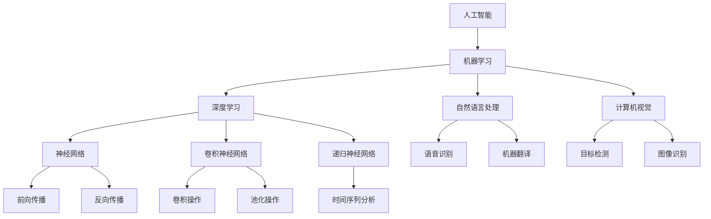

                 

# 人工智能：社会影响与思考

> 关键词：人工智能、社会影响、道德伦理、技术趋势、未来挑战

> 摘要：随着人工智能技术的飞速发展，它正在深刻地改变着我们的社会、经济和文化。本文将深入探讨人工智能对社会各个方面的广泛影响，包括道德伦理问题、技术趋势、未来挑战以及相关建议。通过逻辑清晰的分析和详尽的实例，本文旨在提供一个全面的理解，帮助读者更好地把握人工智能时代的机遇和挑战。

## 1. 背景介绍

### 1.1 目的和范围

本文的目的是分析人工智能（AI）对社会的影响，并提出相应的思考和对策。文章将涵盖人工智能在道德伦理、技术趋势和未来挑战方面的主要议题。通过对这些议题的深入探讨，我们希望能够为读者提供有关人工智能的全面视角，帮助其更好地理解这一技术进步所带来的深远影响。

### 1.2 预期读者

本文适用于对人工智能有一定了解的技术从业者、研究人员、政策制定者以及普通公众。无论是希望深入了解人工智能技术的专业人士，还是对人工智能社会影响感兴趣的普通读者，本文都将提供有价值的见解和洞见。

### 1.3 文档结构概述

本文分为十个主要部分：

1. 背景介绍：介绍文章的目的、预期读者和结构。
2. 核心概念与联系：介绍人工智能的核心概念及其相互关系。
3. 核心算法原理 & 具体操作步骤：讲解人工智能的关键算法和操作步骤。
4. 数学模型和公式 & 详细讲解 & 举例说明：阐述人工智能中的数学模型和公式。
5. 项目实战：代码实际案例和详细解释说明。
6. 实际应用场景：探讨人工智能在各个领域的应用。
7. 工具和资源推荐：推荐学习资源和开发工具。
8. 总结：未来发展趋势与挑战。
9. 附录：常见问题与解答。
10. 扩展阅读 & 参考资料：提供进一步的阅读材料和资源。

### 1.4 术语表

#### 1.4.1 核心术语定义

- 人工智能（AI）：指通过模拟人类智能，使计算机具有感知、理解、学习、推理和决策能力的技术。
- 机器学习（ML）：人工智能的一个分支，通过数据训练算法，使计算机能够自动学习和改进性能。
- 深度学习（DL）：一种机器学习技术，通过多层神经网络模拟人类大脑的学习机制。
- 伦理（Ethics）：涉及道德原则和价值观，指导人们的行为和决策。
- 透明性（Transparency）：指系统的操作和决策过程易于理解和解释。
- 责任（Accountability）：指系统行为和结果的责任归属。

#### 1.4.2 相关概念解释

- 智能代理（Agent）：具有智能的软件实体，能够在动态环境中自主行动以实现特定目标。
- 强化学习（Reinforcement Learning）：一种机器学习方法，通过奖励和惩罚来训练智能代理进行决策。
- 大数据（Big Data）：指数据量大、多样性和高速增长的复杂数据集。
- 伦理问题（Ethical Issues）：与道德原则和价值观相关的问题，通常涉及责任、隐私、公平和透明性。

#### 1.4.3 缩略词列表

- AI：人工智能
- ML：机器学习
- DL：深度学习
- RL：强化学习
- GDPR：通用数据保护条例（General Data Protection Regulation）

## 2. 核心概念与联系

在探讨人工智能对社会的广泛影响之前，我们首先需要理解其核心概念和基本架构。以下是一个简单的 Mermaid 流程图，用于展示人工智能的基本概念及其相互关系。



### 2.1 人工智能的基本概念

人工智能（AI）是一种通过模拟人类智能来使计算机执行复杂任务的计算机科学领域。它包括多个子领域，如机器学习（ML）、深度学习（DL）、自然语言处理（NLP）和计算机视觉（CV）。以下是这些概念的基本定义：

- **机器学习（ML）**：机器学习是一种从数据中学习规律和模式的方法，使计算机能够自动改进其性能，而无需显式编程。它包括监督学习、无监督学习和半监督学习。
- **深度学习（DL）**：深度学习是一种机器学习方法，它通过多层神经网络模拟人类大脑的学习机制。它通常用于图像识别、语音识别和自然语言处理等任务。
- **自然语言处理（NLP）**：自然语言处理是一种使计算机能够理解和生成人类语言的技术。它包括语音识别、机器翻译、情感分析和文本分类等任务。
- **计算机视觉（CV）**：计算机视觉是一种使计算机能够理解和解释视觉信息的领域。它包括图像识别、目标检测和图像分割等任务。

### 2.2 人工智能的基本架构

人工智能的基本架构通常包括以下几个关键组成部分：

- **神经网络**：神经网络是一种模拟生物神经系统的计算模型，它通过神经元之间的连接来传递信息。神经网络可以分为前馈神经网络、卷积神经网络（CNN）和递归神经网络（RNN）。
- **深度学习框架**：深度学习框架是一种软件库，用于简化深度学习模型的开发、训练和部署。常见的深度学习框架包括TensorFlow、PyTorch和Keras。
- **数据预处理**：数据预处理是深度学习的一个重要步骤，它包括数据清洗、归一化和特征提取等操作，以提高模型的性能。
- **训练与评估**：训练与评估是深度学习模型的两个关键阶段。训练阶段通过大量的数据来优化模型的参数，评估阶段用于评估模型的性能和泛化能力。

通过上述核心概念和架构的介绍，我们可以更好地理解人工智能的基本原理和其在社会中的广泛应用。接下来，我们将深入探讨人工智能的核心算法原理和具体操作步骤。

## 3. 核心算法原理 & 具体操作步骤

在了解了人工智能的基本概念和架构之后，我们现在来探讨其核心算法原理和具体操作步骤。本节将详细讲解机器学习（ML）和深度学习（DL）的基本算法原理，并使用伪代码来阐述这些算法的具体实现步骤。

### 3.1 机器学习算法原理

机器学习算法主要包括监督学习、无监督学习和半监督学习。下面，我们以监督学习算法为例，介绍其基本原理和实现步骤。

#### 3.1.1 监督学习算法原理

监督学习是一种从已知标注数据中学习规律和模式的方法。其核心思想是通过输入和输出之间的映射关系，学习出一个预测模型。监督学习算法可以分为线性模型、决策树、支持向量机（SVM）和神经网络等。

#### 3.1.2 逻辑回归算法

逻辑回归是一种简单的线性模型，常用于分类任务。其基本原理是通过线性变换和逻辑函数，将输入特征映射到概率空间。下面是逻辑回归的伪代码实现：

```python
def sigmoid(x):
    return 1 / (1 + exp(-x))

def logistic_regression(X, y, learning_rate, iterations):
    w = [0 for _ in range(len(X[0]))]
    for _ in range(iterations):
        z = [w.T * x for x in X]
        a = [sigmoid(z[i]) for i in range(len(X))]
        dw = [-((a[i] - y[i]) * a[i] * (1 - a[i])) * x for i, x in enumerate(X)]
        w -= learning_rate * dw
    return w
```

#### 3.1.3 决策树算法

决策树是一种基于特征划分数据的分类算法。其基本原理是通过一系列的测试，将数据集划分为多个子集，直到达到某个终止条件。下面是决策树的伪代码实现：

```python
def choose_best_split(X, y):
    # 找到最好的特征和阈值
    # ...

def build_decision_tree(X, y, depth=0, max_depth=None):
    if depth == max_depth or all(y == y[0]):
        return {'label': y[0]}
    best_split = choose_best_split(X, y)
    left subtree = build_decision_tree([x for x in X if x[best_split[1]] <= best_split[2]], y, depth+1, max_depth)
    right subtree = build_decision_tree([x for x in X if x[best_split[1]] > best_split[2]], y, depth+1, max_depth)
    return {'feature': best_split[1], 'threshold': best_split[2], 'left': left subtree, 'right': right subtree}
```

### 3.2 深度学习算法原理

深度学习是一种基于多层神经网络的机器学习算法。其基本原理是通过前向传播和反向传播来学习输入和输出之间的映射关系。下面我们以深度神经网络（DNN）为例，介绍其基本原理和实现步骤。

#### 3.2.1 深度神经网络算法原理

深度神经网络由多个层组成，包括输入层、隐藏层和输出层。每一层由多个神经元（或节点）组成，神经元之间通过权重连接。前向传播是将输入数据通过网络传递到输出层，反向传播是利用梯度下降法来更新网络的权重。

#### 3.2.2 深度神经网络算法实现

下面是深度神经网络的伪代码实现：

```python
import numpy as np

def forward_propagation(X, w):
    z = [w.T * x for x in X]
    a = [sigmoid(z[i]) for i in range(len(X))]
    return a

def backward_propagation(a, y, w):
    dw = [-((a[i] - y[i]) * a[i] * (1 - a[i])) * x for i, x in enumerate(a)]
    return dw

def train_neural_network(X, y, learning_rate, iterations, hidden_layers):
    w = [[np.random.randn(len(X[0]), len(X[0])) for _ in range(len(hidden_layers))] for _ in range(len(hidden_layers) + 1)]
    for _ in range(iterations):
        a = forward_propagation(X, w)
        dw = backward_propagation(a, y, w)
        for i, layer in enumerate(w):
            layer -= learning_rate * dw[i]
    return w
```

通过以上伪代码，我们可以看到机器学习和深度学习算法的基本原理和实现步骤。这些算法在人工智能领域中扮演着重要角色，为各种应用提供了强大的工具和手段。接下来，我们将进一步探讨人工智能中的数学模型和公式。

## 4. 数学模型和公式 & 详细讲解 & 举例说明

在人工智能（AI）和机器学习（ML）领域，数学模型和公式是理解算法原理和实现核心功能的关键。在这一节中，我们将详细讲解一些重要的数学模型和公式，并使用LaTeX格式进行展示。

### 4.1 线性代数基础

线性代数是机器学习和深度学习的重要基础，其中涉及到矩阵、向量、矩阵乘法和矩阵分解等概念。

#### 4.1.1 矩阵-向量乘法

矩阵-向量乘法的LaTeX表示如下：

$$
C = A \cdot X
$$

其中，\( A \) 是一个 \( m \times n \) 的矩阵，\( X \) 是一个 \( n \) 维的向量，\( C \) 是一个 \( m \) 维的向量。矩阵-向量乘法的结果是一个新向量，其中每个元素是矩阵中对应行的线性组合。

#### 4.1.2 矩阵分解

矩阵分解是机器学习和深度学习中的常见技术，其中LU分解和SVD分解是两种重要的方法。

**LU分解**：

$$
A = P \cdot L \cdot U
$$

其中，\( A \) 是一个 \( m \times n \) 的矩阵，\( P \) 是一个置换矩阵，\( L \) 是一个下三角矩阵，\( U \) 是一个上三角矩阵。

**SVD分解**：

$$
A = U \cdot \Sigma \cdot V^T
$$

其中，\( A \) 是一个 \( m \times n \) 的矩阵，\( U \) 和 \( V \) 是两个正交矩阵，\( \Sigma \) 是一个对角矩阵，对角线上的元素是 \( A \) 的奇异值。

### 4.2 概率论基础

概率论在机器学习和深度学习中用于描述数据的分布和不确定性。

#### 4.2.1 贝叶斯定理

贝叶斯定理用于计算后验概率，其LaTeX表示如下：

$$
P(A|B) = \frac{P(B|A) \cdot P(A)}{P(B)}
$$

其中，\( P(A|B) \) 是在事件 \( B \) 发生的条件下事件 \( A \) 的概率，\( P(B|A) \) 是在事件 \( A \) 发生的条件下事件 \( B \) 的概率，\( P(A) \) 和 \( P(B) \) 分别是事件 \( A \) 和 \( B \) 的先验概率。

#### 4.2.2 概率分布

机器学习中常用的概率分布包括高斯分布、伯努利分布和多项式分布。

**高斯分布**：

$$
N(\mu, \sigma^2) = \frac{1}{\sqrt{2\pi\sigma^2}} \cdot e^{-\frac{(x-\mu)^2}{2\sigma^2}}
$$

其中，\( \mu \) 是均值，\( \sigma^2 \) 是方差，\( x \) 是随机变量。

### 4.3 深度学习中的损失函数

深度学习中的损失函数用于衡量模型预测结果与真实结果之间的差距。常见的损失函数包括均方误差（MSE）和对数似然损失。

**均方误差（MSE）**：

$$
MSE = \frac{1}{m} \sum_{i=1}^{m} (y_i - \hat{y}_i)^2
$$

其中，\( m \) 是样本数量，\( y_i \) 是真实值，\( \hat{y}_i \) 是预测值。

**对数似然损失**：

$$
LL = -\frac{1}{m} \sum_{i=1}^{m} y_i \cdot \log(\hat{y}_i) + (1 - y_i) \cdot \log(1 - \hat{y}_i)
$$

其中，\( y_i \) 是二分类问题中的真实标签，\( \hat{y}_i \) 是模型的预测概率。

### 4.4 梯度下降法

梯度下降法是优化深度学习模型参数的一种常用方法。其核心思想是通过计算损失函数关于参数的梯度，并沿梯度方向更新参数，以最小化损失函数。

**梯度下降法**：

$$
w = w - \alpha \cdot \nabla_w J(w)
$$

其中，\( w \) 是参数向量，\( \alpha \) 是学习率，\( \nabla_w J(w) \) 是损失函数 \( J(w) \) 关于 \( w \) 的梯度。

### 4.5 举例说明

为了更好地理解上述数学模型和公式，我们可以通过一个简单的例子来说明。

**例：使用逻辑回归进行二分类**

假设我们有一个包含两个特征 \( x_1 \) 和 \( x_2 \) 的二分类问题，真实标签 \( y \) 属于 \( \{0, 1\} \)。我们可以使用逻辑回归模型来预测 \( y \)。

1. **模型表示**：

$$
\hat{y} = sigmoid(w_0 + w_1 \cdot x_1 + w_2 \cdot x_2)
$$

2. **损失函数**：

$$
J(w) = -\frac{1}{m} \sum_{i=1}^{m} [y_i \cdot \log(\hat{y}_i) + (1 - y_i) \cdot \log(1 - \hat{y}_i)]
$$

3. **梯度计算**：

$$
\nabla_w J(w) = \frac{1}{m} \sum_{i=1}^{m} [y_i \cdot (1 - \hat{y}_i) \cdot x_i + (1 - y_i) \cdot \hat{y}_i \cdot x_i]
$$

4. **梯度下降更新**：

$$
w = w - \alpha \cdot \nabla_w J(w)
$$

通过上述步骤，我们可以使用逻辑回归模型对数据进行训练，并预测新数据的标签。

通过这一节的讲解，我们掌握了人工智能和机器学习中的关键数学模型和公式。这些公式和算法构成了深度学习和其他人工智能技术的基石，为理解和实现先进的机器学习算法提供了重要的工具。接下来，我们将通过一个实际的代码案例来进一步探讨人工智能的应用。

## 5. 项目实战：代码实际案例和详细解释说明

在本节中，我们将通过一个实际的代码案例来展示如何使用Python和TensorFlow框架实现一个简单的深度神经网络。我们将以手写数字识别任务为例，详细讲解代码的每个部分，并分析其工作原理。

### 5.1 开发环境搭建

在开始编写代码之前，我们需要搭建一个合适的开发环境。以下是搭建TensorFlow开发环境的基本步骤：

1. **安装Python**：确保安装了Python 3.x版本。
2. **安装TensorFlow**：使用pip命令安装TensorFlow。

   ```bash
   pip install tensorflow
   ```

3. **安装其他依赖**：安装用于数据处理和可视化等其他库，如NumPy和Matplotlib。

   ```bash
   pip install numpy matplotlib
   ```

### 5.2 源代码详细实现和代码解读

下面是一个简单的深度神经网络实现手写数字识别任务的代码示例。我们使用MNIST数据集，这是一个包含70000个手写数字图像的数据集，其中每个数字都被28x28的网格所表示。

```python
import tensorflow as tf
from tensorflow.keras import layers, models
import numpy as np
import matplotlib.pyplot as plt

# 加载MNIST数据集
mnist = tf.keras.datasets.mnist
(train_images, train_labels), (test_images, test_labels) = mnist.load_data()

# 数据预处理
train_images = train_images / 255.0
test_images = test_images / 255.0

# 构建模型
model = models.Sequential()
model.add(layers.Conv2D(32, (3, 3), activation='relu', input_shape=(28, 28, 1)))
model.add(layers.MaxPooling2D((2, 2)))
model.add(layers.Conv2D(64, (3, 3), activation='relu'))
model.add(layers.MaxPooling2D((2, 2)))
model.add(layers.Conv2D(64, (3, 3), activation='relu'))
model.add(layers.Flatten())
model.add(layers.Dense(64, activation='relu'))
model.add(layers.Dense(10, activation='softmax'))

# 编译模型
model.compile(optimizer='adam',
              loss='sparse_categorical_crossentropy',
              metrics=['accuracy'])

# 训练模型
model.fit(train_images, train_labels, epochs=5)

# 评估模型
test_loss, test_acc = model.evaluate(test_images, test_labels)
print(f'测试准确率: {test_acc:.2f}')

# 可视化预测结果
predictions = model.predict(test_images)
predicted_digits = np.argmax(predictions, axis=1)
plt.figure(figsize=(10, 10))
for i in range(25):
    plt.subplot(5, 5, i+1)
    plt.imshow(test_images[i], cmap=plt.cm.binary)
    plt.xticks([])
    plt.yticks([])
    plt.grid(False)
    plt.xlabel(str(predicted_digits[i]))
plt.show()
```

#### 5.2.1 数据预处理

在代码中，我们首先加载MNIST数据集，并将其归一化到0到1的范围内。归一化是为了加快模型的训练速度和提高性能。

```python
train_images = train_images / 255.0
test_images = test_images / 255.0
```

#### 5.2.2 模型构建

接下来，我们构建一个简单的卷积神经网络（CNN）。模型包括两个卷积层，每个卷积层后跟有一个最大池化层，以提取图像的特征。之后，我们添加一个全连接层，用于分类。

```python
model.add(layers.Conv2D(32, (3, 3), activation='relu', input_shape=(28, 28, 1)))
model.add(layers.MaxPooling2D((2, 2)))
model.add(layers.Conv2D(64, (3, 3), activation='relu'))
model.add(layers.MaxPooling2D((2, 2)))
model.add(layers.Conv2D(64, (3, 3), activation='relu'))
model.add(layers.Flatten())
model.add(layers.Dense(64, activation='relu'))
model.add(layers.Dense(10, activation='softmax'))
```

#### 5.2.3 模型编译

我们使用`compile`方法来配置模型。在这里，我们选择`adam`优化器，`sparse_categorical_crossentropy`损失函数，以及`accuracy`作为评估指标。

```python
model.compile(optimizer='adam',
              loss='sparse_categorical_crossentropy',
              metrics=['accuracy'])
```

#### 5.2.4 模型训练

使用`fit`方法来训练模型。在这个例子中，我们设置了5个训练周期（epochs）。

```python
model.fit(train_images, train_labels, epochs=5)
```

#### 5.2.5 模型评估

我们使用`evaluate`方法来评估模型在测试数据集上的性能。

```python
test_loss, test_acc = model.evaluate(test_images, test_labels)
print(f'测试准确率: {test_acc:.2f}')
```

#### 5.2.6 可视化预测结果

最后，我们使用`predict`方法来预测测试数据集中的每个图像的数字。然后，我们将预测结果可视化，以展示模型的准确性。

```python
predictions = model.predict(test_images)
predicted_digits = np.argmax(predictions, axis=1)
plt.figure(figsize=(10, 10))
for i in range(25):
    plt.subplot(5, 5, i+1)
    plt.imshow(test_images[i], cmap=plt.cm.binary)
    plt.xticks([])
    plt.yticks([])
    plt.grid(False)
    plt.xlabel(str(predicted_digits[i]))
plt.show()
```

通过这个简单的案例，我们展示了如何使用Python和TensorFlow构建一个深度神经网络来处理手写数字识别任务。这个案例不仅帮助我们理解了深度学习的基本概念和实现步骤，还展示了如何在现实世界中应用这些技术。

### 5.3 代码解读与分析

在本节中，我们将进一步分析代码中的关键部分，并解释其工作原理。

#### 5.3.1 数据预处理

数据预处理是机器学习任务中的关键步骤，因为它影响模型的性能和训练时间。在这个例子中，我们将图像数据从0到255的像素值归一化到0到1之间。这样做的好处是加快模型的训练速度和提高模型的准确度。

```python
train_images = train_images / 255.0
test_images = test_images / 255.0
```

#### 5.3.2 模型构建

模型构建是深度学习的核心部分。在这个例子中，我们使用了卷积神经网络（CNN）来处理图像数据。CNN利用卷积操作来提取图像的局部特征，并通过池化操作来减少特征的数量。

```python
model.add(layers.Conv2D(32, (3, 3), activation='relu', input_shape=(28, 28, 1)))
model.add(layers.MaxPooling2D((2, 2)))
model.add(layers.Conv2D(64, (3, 3), activation='relu'))
model.add(layers.MaxPooling2D((2, 2)))
model.add(layers.Conv2D(64, (3, 3), activation='relu'))
model.add(layers.Flatten())
model.add(layers.Dense(64, activation='relu'))
model.add(layers.Dense(10, activation='softmax'))
```

#### 5.3.3 模型编译

模型编译步骤用于配置模型，包括选择优化器、损失函数和评估指标。在这个例子中，我们使用了`adam`优化器和`sparse_categorical_crossentropy`损失函数。`adam`优化器是一个自适应的优化算法，适合大多数问题。`sparse_categorical_crossentropy`损失函数用于多标签分类问题。

```python
model.compile(optimizer='adam',
              loss='sparse_categorical_crossentropy',
              metrics=['accuracy'])
```

#### 5.3.4 模型训练

模型训练步骤用于调整模型的权重，以最小化损失函数。在这个例子中，我们设置了5个训练周期（epochs）。每个周期中，模型会使用训练数据集进行多次迭代，以优化模型的性能。

```python
model.fit(train_images, train_labels, epochs=5)
```

#### 5.3.5 模型评估

模型评估步骤用于测试模型在未知数据上的性能。在这个例子中，我们使用测试数据集来评估模型的准确性。

```python
test_loss, test_acc = model.evaluate(test_images, test_labels)
print(f'测试准确率: {test_acc:.2f}')
```

#### 5.3.6 可视化预测结果

可视化预测结果有助于我们直观地理解模型的性能。在这个例子中，我们使用`matplotlib`库将预测结果可视化。

```python
predictions = model.predict(test_images)
predicted_digits = np.argmax(predictions, axis=1)
plt.figure(figsize=(10, 10))
for i in range(25):
    plt.subplot(5, 5, i+1)
    plt.imshow(test_images[i], cmap=plt.cm.binary)
    plt.xticks([])
    plt.yticks([])
    plt.grid(False)
    plt.xlabel(str(predicted_digits[i]))
plt.show()
```

通过这个简单的案例，我们掌握了使用Python和TensorFlow实现深度神经网络的基本步骤。这个案例不仅展示了深度学习的强大能力，还为我们提供了一个实用的工具来处理现实世界中的问题。接下来，我们将探讨人工智能的实际应用场景。

## 6. 实际应用场景

人工智能（AI）技术已经在许多领域得到了广泛应用，带来了显著的社会和经济效益。以下是一些主要的应用场景：

### 6.1 医疗保健

AI在医疗保健领域中的应用包括疾病诊断、个性化治疗和健康监测。通过深度学习和图像识别技术，AI能够分析医学影像，如X光片、CT扫描和MRI，以检测疾病，如肺癌、乳腺癌和脑瘤。AI还能够分析患者的基因组数据，提供个性化的治疗方案。此外，智能健康监测设备能够实时监测患者的生理指标，如心率、血压和血糖水平，帮助医生早期发现健康问题。

### 6.2 金融服务

AI在金融服务领域的应用主要包括风险管理、欺诈检测和投资决策。机器学习算法能够分析大量交易数据，识别异常交易模式，从而帮助银行和金融机构防范欺诈行为。此外，AI可以预测市场趋势，为投资者提供数据驱动的投资建议，提高投资回报率。

### 6.3 零售业

AI在零售业中的应用包括库存管理、客户关系管理和推荐系统。通过使用机器学习算法，零售商能够预测需求变化，优化库存水平，减少库存成本。客户关系管理（CRM）系统利用AI技术分析客户数据，提供个性化的购物体验，提高客户满意度和忠诚度。推荐系统通过分析用户的购买历史和行为，推荐相关商品，增加销售额。

### 6.4 智能交通

AI在智能交通领域的应用包括交通流量管理、自动驾驶和智能城市。通过使用计算机视觉和传感器数据，AI能够实时分析交通状况，优化交通信号灯控制，减少拥堵。自动驾驶技术利用深度学习和传感器融合，使汽车能够自主行驶，提高交通安全和效率。智能城市系统利用AI技术监控和管理城市的各个方面，如能源消耗、废物管理和公共安全。

### 6.5 教育

AI在教育领域的应用包括个性化学习、自动评估和智能辅导。通过分析学生的学习数据，AI能够提供个性化的学习计划，帮助学生更好地掌握知识点。自动评估系统通过分析学生的作业和考试成绩，提供即时反馈，帮助学生改进学习效果。智能辅导系统利用自然语言处理技术，为学生提供实时解答和指导。

### 6.6 制造业

AI在制造业中的应用包括质量检测、预测维护和智能制造。通过计算机视觉技术，AI能够自动检测产品缺陷，提高生产质量。预测维护系统通过分析设备数据，预测设备故障，减少停机时间和维护成本。智能制造系统利用AI技术优化生产流程，提高生产效率和产品质量。

这些应用场景展示了人工智能技术在不同领域的广泛应用和潜力。随着AI技术的不断发展和成熟，我们期待它将在更多领域带来变革和创新。

### 6.7 人工智能在法律和司法领域的应用

人工智能技术在法律和司法领域的应用日益增多，其潜力不可小觑。以下是一些具体的应用场景：

1. **自动化法律文档生成和审查**：AI能够自动生成法律文档，如合同、起诉书和判决书，大大提高了法律工作的效率和准确性。通过自然语言处理技术，AI能够审查法律文档，识别潜在的法律问题，并提出修改建议。

2. **案件预测与分析**：AI可以分析大量的历史案件数据，预测案件的审理结果和判决趋势。这种预测能力有助于法官和律师在案件处理过程中做出更加明智的决策。

3. **法律研究**：AI能够快速检索和分析法律文献，为法律研究和法律论证提供支持。通过机器学习算法，AI可以识别案件中的相似案例，帮助律师找到相关的法律依据。

4. **智能客服和法律咨询**：利用自然语言处理技术，AI能够提供智能客服和法律咨询服务，解答公众的法律问题，提供初步的法律建议。这不仅减轻了法律专业人士的工作负担，也使得法律服务更加普及和便捷。

5. **审判辅助**：AI可以辅助法官在审判过程中进行证据分析和法律适用判断。通过分析案件数据和证据，AI可以为法官提供参考意见，提高审判的公正性和效率。

6. **电子取证**：AI技术在电子取证方面具有显著优势。通过分析电子设备中的数据，如电子邮件、聊天记录和社交媒体信息，AI可以帮助执法机关识别和提取关键证据，提高犯罪调查的效率。

总之，人工智能在法律和司法领域的应用不仅提升了法律工作的效率和准确性，还为司法公正和公共安全提供了强有力的技术支持。

### 6.8 人工智能在艺术和文化领域的应用

人工智能在艺术和文化领域中的应用正逐渐成为研究热点，其潜力不容忽视。以下是一些具体的应用场景：

1. **音乐创作**：AI能够通过分析大量音乐数据，创作出新颖的音乐作品。例如，Google的Magenta项目利用深度学习算法生成音乐，为音乐创作提供了新的工具。

2. **绘画和艺术生成**：AI可以生成艺术作品，如油画、水彩画和数字艺术。这些作品不仅具有独特的风格，还能挑战传统的艺术创作方式。

3. **文学创作**：AI能够生成诗歌、故事和小说。例如，OpenAI的GPT-3模型能够创作出高质量的文本，为文学创作提供了新的可能性。

4. **艺术品的鉴定与修复**：AI通过图像识别和数据分析，能够帮助鉴定艺术品真伪，并提供艺术修复建议，提高艺术品保存和展示的质量。

5. **文化遗产保护**：AI能够分析文物和历史建筑的数据，提供保护建议，并帮助博物馆和文化遗产机构进行数字化展示，让更多人了解和欣赏文化遗产。

6. **交互式艺术体验**：AI可以创造个性化的艺术体验，如动态壁画、智能画廊和虚拟现实（VR）艺术展。这些交互式艺术形式为观众提供了更加丰富和沉浸的体验。

总之，人工智能在艺术和文化领域的应用不仅为艺术创作和传播带来了创新，也为文化遗产保护和公众艺术教育提供了新的途径。

### 6.9 人工智能在能源和环保领域的应用

人工智能在能源和环保领域的应用正逐步改变行业面貌，带来了显著的技术进步和环保效益。以下是一些具体的应用场景：

1. **智能电网管理**：AI能够优化电网运行，提高电力供应的稳定性和可靠性。通过实时监测和分析电网数据，AI可以预测电力需求，优化发电和分配，减少能源浪费。

2. **可再生能源预测与优化**：AI技术可以预测太阳能、风能等可再生能源的产量，帮助能源公司优化设备配置和调度策略，提高可再生能源的利用效率。

3. **能效管理**：AI能够分析建筑和工业设备的能耗数据，识别节能潜力，提供改进方案。例如，智能建筑系统通过AI技术自动调节照明、空调和供暖系统，实现节能减排。

4. **环境监测与预警**：AI可以分析环境数据，如空气质量、水质和土壤成分，预测环境变化趋势，提供预警信息。这有助于环境保护部门及时采取行动，减少环境污染。

5. **资源循环利用**：AI能够优化废物处理和资源回收流程，提高资源的循环利用率。通过分析废物成分，AI可以设计出更高效的回收和处理方案，减少废物排放。

6. **生态保护**：AI可以分析生态数据，如野生动物行为、栖息地状况和物种多样性，为生态保护和恢复提供科学依据。

总之，人工智能在能源和环保领域的应用不仅提高了能源利用效率和环境保护水平，还为可持续发展提供了强有力的技术支持。

### 6.10 人工智能在农业和食品领域的应用

人工智能在农业和食品领域的应用正在引领现代农业的革命，其潜力不可低估。以下是一些具体的应用场景：

1. **智能种植和养殖**：AI技术可以通过数据分析预测作物生长和畜禽饲养的最佳条件，优化种植和养殖过程，提高产量和质量。

2. **精准农业**：AI能够分析土壤、气候和作物生长数据，提供个性化的种植建议，实现精准农业管理，减少资源浪费。

3. **植物病害监测与防治**：AI可以通过图像识别技术实时监测植物病害，提供防治方案，降低病害对作物的影响。

4. **食品质量检测**：AI可以分析食品成分和包装数据，预测食品的质量和保质期，提高食品安全水平。

5. **供应链优化**：AI能够优化食品供应链管理，提高物流效率，减少库存成本，确保食品安全。

6. **人工智能厨师**：通过分析用户偏好和营养需求，AI可以为用户提供个性化的食谱和烹饪建议，提高餐饮体验。

总之，人工智能在农业和食品领域的应用不仅提高了生产效率和产品质量，也为食品安全和营养健康提供了强有力的技术支持。

## 7. 工具和资源推荐

在人工智能（AI）和机器学习（ML）的学习和开发过程中，选择合适的工具和资源是至关重要的。以下是一些推荐的工具、资源和书籍，旨在帮助读者更好地掌握人工智能的相关知识。

### 7.1 学习资源推荐

#### 7.1.1 书籍推荐

1. **《Python机器学习》** - 由塞巴斯蒂安·拉克斯（Sebastian Raschka）和约瑟夫·瓦格纳（Vahid Mirjalili）所著，这是一本适合初学者和进阶者的优秀机器学习指南。
2. **《深度学习》** - 由伊恩·古德费洛（Ian Goodfellow）、约书亚·本吉奥（Yoshua Bengio）和Aaron Courville所著，是深度学习领域的经典教材。
3. **《统计学习基础》** - 由特里·谢弗斯（Trevor Hastie）、罗伯特·提克尔森（Robert Tibshirani）和贾里·弗里谢（Jerome Friedman）所著，涵盖了统计学习的基本概念和方法。
4. **《AI：一种现代方法》** - 由斯图尔特·罗素（Stuart Russell）和彼得·诺维格（Peter Norvig）所著，这是一本全面介绍人工智能理论的教科书。

#### 7.1.2 在线课程

1. **吴恩达（Andrew Ng）的机器学习课程** - 在Coursera上提供的免费课程，适合初学者入门。
2. **TensorFlow官方教程** - TensorFlow官方网站提供了一系列教程，涵盖从基础知识到高级应用的各个方面。
3. **深度学习专暑课程** - 在Udacity上提供的深度学习课程，包括项目实战，适合有一定基础的读者。
4. **谷歌AI教程** - 谷歌AI博客上提供了丰富的教程和案例研究，适合对AI应用感兴趣的读者。

#### 7.1.3 技术博客和网站

1. **Medium上的机器学习和深度学习博客** - 许多专家和公司在此平台上分享他们的研究成果和实践经验。
2. **ArXiv** - 人工智能和机器学习领域的最新研究论文的发表平台，适合关注最新研究成果的读者。
3. **GitHub** - GitHub上有大量开源项目和代码库，读者可以从中学习他人的实现方法和技巧。

### 7.2 开发工具框架推荐

#### 7.2.1 IDE和编辑器

1. **Jupyter Notebook** - 适用于数据科学和机器学习的交互式开发环境，便于代码和文本的混合编写。
2. **Visual Studio Code** - 一款功能强大的开源编辑器，支持多种编程语言和扩展，适用于AI开发。
3. **PyCharm** - 由JetBrains开发的Python IDE，提供强大的代码编辑、调试和性能分析功能。

#### 7.2.2 调试和性能分析工具

1. **TensorBoard** - TensorFlow的官方可视化工具，用于分析和调试深度学习模型的性能。
2. **Wandb** - 一款集成了实验跟踪、可视化和性能分析的AI工具，适用于研究人员和开发者。
3. **MLflow** - 一款开源平台，用于管理机器学习项目的生命周期，包括实验跟踪、模型版本控制和部署。

#### 7.2.3 相关框架和库

1. **TensorFlow** - 一款由谷歌开发的开源深度学习框架，适用于各种复杂的深度学习应用。
2. **PyTorch** - 一款流行的开源深度学习框架，提供灵活的动态计算图，适合研究人员和开发者。
3. **Scikit-learn** - 一款用于机器学习的Python库，提供了多种经典的机器学习算法和工具。
4. **Keras** - 一款高层次的深度学习API，构建在TensorFlow和Theano之上，适合快速原型开发。

通过这些工具和资源的推荐，读者可以更加便捷地学习和实践人工智能技术，不断提升自己的技能和知识。

### 7.3 相关论文著作推荐

在人工智能和机器学习领域，经典论文和最新研究成果是理解技术前沿和发展趋势的重要途径。以下是一些推荐的论文和著作：

#### 7.3.1 经典论文

1. **"Backpropagation"** - Paul Werbos，1974年。这篇论文首次提出了反向传播算法，是深度学习的基础。
2. **"A Learning Algorithm for Continually Running Fully Recurrent Neural Networks"** - John Hopfield，1982年。Hopfield网络是第一个用于联想记忆的神经网络模型。
3. **"Pattern Recognition Using Generalized Vector Machines"** - Vladimir Vapnik，1995年。这篇论文介绍了支持向量机（SVM）的基本原理。

#### 7.3.2 最新研究成果

1. **"Bert: Pre-training of Deep Bidirectional Transformers for Language Understanding"** - Jacob Devlin等人，2019年。这篇论文提出了BERT模型，是自然语言处理领域的重大突破。
2. **"Gshard: Scaling Giant Neural Networks using Grouped Weight-Precision Training"** - Xin Wang等人，2020年。这篇论文提出了Grouped Weight-Precision Training方法，用于训练大规模神经网络。
3. **"R夷R: Training Data-Efficient Neural Networks with Reconstruct Reality"** - Dario Amodei等人，2020年。这篇论文提出了R夷R方法，通过生成对抗网络（GAN）提高模型的数据效率。

#### 7.3.3 应用案例分析

1. **"DeepMind的AlphaGo与围棋革命"** - David Silver，2016年。这篇论文详细介绍了AlphaGo的工作原理和应用案例，展示了深度学习在围棋等复杂游戏中的强大能力。
2. **"OpenAI的五分钟演讲：人工智能如何影响未来"** - Sam Altman，2020年。这篇演讲探讨了人工智能在不同领域的应用案例，以及其对未来社会的影响。
3. **"Facebook的人工智能研究：从语音识别到图像生成"** - Yann LeCun，2021年。这篇论文介绍了Facebook在人工智能领域的多项研究成果，包括语音识别、图像识别和图像生成等。

通过阅读这些经典论文和最新研究成果，读者可以深入理解人工智能和机器学习的技术原理和应用趋势。

## 8. 总结：未来发展趋势与挑战

随着人工智能技术的不断进步，其社会影响也在日益扩大。然而，这一领域的快速发展也带来了许多挑战和潜在的问题。以下是对未来发展趋势与挑战的总结：

### 8.1 发展趋势

1. **更强大的算法与模型**：随着计算能力的提升和算法的改进，深度学习和其他先进的人工智能模型将继续变得更加高效和强大。这将为各个领域带来更多创新和应用。

2. **跨学科融合**：人工智能将与其他学科（如生物学、心理学、经济学等）进一步融合，推动跨领域的研究和合作，从而解决更加复杂的问题。

3. **边缘计算与物联网**：随着5G技术的普及，边缘计算和物联网将在人工智能领域发挥重要作用。这些技术将使人工智能在实时数据处理和分析方面更加高效，推动智能城市的建设。

4. **人机协同**：人工智能与人类专家的协同工作将成为未来趋势，通过结合人类的专业知识和人工智能的计算能力，实现更加智能和高效的决策。

5. **可解释性增强**：随着透明性和可解释性的需求日益增加，研究者将致力于开发更加可解释的人工智能模型，以便用户能够理解和信任这些系统的决策过程。

### 8.2 挑战

1. **伦理与隐私问题**：人工智能的广泛应用引发了伦理和隐私问题。如何确保人工智能系统的公平性、透明性和隐私保护，将是未来面临的重要挑战。

2. **就业影响**：人工智能的自动化和智能化可能导致某些传统工作岗位的减少，带来就业结构的变化。如何应对这一挑战，减少对社会的影响，是一个亟待解决的问题。

3. **数据安全与隐私**：人工智能系统对大量数据的依赖性使其成为网络攻击的目标。确保数据的安全和隐私，防止数据泄露，是人工智能发展的重要保障。

4. **算法偏见**：人工智能系统可能会在训练数据中引入偏见，导致不公正的决策。如何消除算法偏见，确保人工智能的公平性，是一个重要的研究方向。

5. **监管与法律法规**：随着人工智能技术的不断进步，现有的法律法规和监管体系可能不再适用。如何制定新的法律法规来规范人工智能的应用，确保其安全性和社会责任，是一个重要的议题。

总之，人工智能的发展趋势充满了机遇和挑战。通过应对这些挑战，我们可以更好地利用人工智能的潜力，推动社会进步和科技创新。

## 9. 附录：常见问题与解答

在探讨人工智能（AI）对社会的影响时，读者可能会遇到一些常见问题。以下是一些常见问题及其解答：

### 9.1 什么是人工智能（AI）？

**回答**：人工智能（AI）是指通过模拟人类智能，使计算机具有感知、理解、学习、推理和决策能力的技术。它包括机器学习、深度学习、自然语言处理和计算机视觉等多个子领域。

### 9.2 人工智能对社会的主要影响是什么？

**回答**：人工智能对社会的主要影响包括提高生产效率、改善医疗服务、促进个性化教育和推动自动化发展。然而，它也带来了一些挑战，如就业问题、伦理问题和社会不平等问题。

### 9.3 人工智能是否会取代人类工作？

**回答**：人工智能有可能取代一些重复性和标准化的工作，但也会创造新的工作岗位。长远来看，人类和人工智能将更倾向于协同工作，而不是完全取代。

### 9.4 人工智能系统如何避免偏见？

**回答**：避免人工智能系统偏见的方法包括使用无偏训练数据、设计公平的评估指标、开发可解释性模型和进行伦理审查。此外，制定相关法律法规和伦理指南也是防止偏见的重要措施。

### 9.5 人工智能系统是否具备自主意识？

**回答**：目前的人工智能系统，包括深度学习和机器学习，只是模仿人类智能的特定方面，如学习模式识别和解决问题。它们不具备真正的自主意识，而是通过算法和数据进行操作。

### 9.6 人工智能在医疗领域如何应用？

**回答**：人工智能在医疗领域的主要应用包括疾病诊断、个性化治疗、健康监测和药物研发。通过分析医学影像和患者数据，AI可以帮助医生做出更准确的诊断和制定更有效的治疗方案。

### 9.7 人工智能在金融领域有哪些应用？

**回答**：人工智能在金融领域的应用包括风险管理、欺诈检测、投资决策和自动化交易。AI可以分析大量交易数据和市场趋势，帮助金融机构提高效率和盈利能力。

### 9.8 人工智能对社会公平有何影响？

**回答**：人工智能可能加剧社会不平等，因为它可能会增加技术行业和其他高薪行业的就业机会，而减少传统制造业和服务业的就业机会。此外，如果AI系统存在偏见，可能会加剧社会歧视和不平等。因此，确保人工智能的公平性和透明性是重要的社会责任。

通过回答这些问题，我们希望能够为读者提供更多关于人工智能及其社会影响的深入理解。

## 10. 扩展阅读 & 参考资料

为了进一步了解人工智能（AI）及其对社会的影响，以下是推荐的扩展阅读和参考资料：

### 10.1 书籍推荐

1. **《人工智能：一种现代方法》** - 斯图尔特·罗素（Stuart Russell）和彼得·诺维格（Peter Norvig）著，全面介绍了人工智能的理论和实践。
2. **《深度学习》** - 伊恩·古德费洛（Ian Goodfellow）、约书亚·本吉奥（Yoshua Bengio）和Aaron Courville著，深度学习领域的经典教材。
3. **《Python机器学习》** - 塞巴斯蒂安·拉克斯（Sebastian Raschka）和约瑟夫·瓦格纳（Vahid Mirjalili）著，适合初学者和进阶者的机器学习指南。

### 10.2 在线课程

1. **吴恩达（Andrew Ng）的机器学习课程** - Coursera上提供的免费课程，适合初学者入门。
2. **TensorFlow官方教程** - TensorFlow官方网站提供的一系列教程，涵盖从基础知识到高级应用的各个方面。
3. **深度学习专暑课程** - Udacity上的深度学习课程，包括项目实战，适合有一定基础的读者。

### 10.3 技术博客和网站

1. **Medium上的机器学习和深度学习博客** - 许多专家和公司在此平台上分享他们的研究成果和实践经验。
2. **ArXiv** - 人工智能和机器学习领域的最新研究论文的发表平台，适合关注最新研究成果的读者。
3. **GitHub** - GitHub上有大量开源项目和代码库，读者可以从中学习他人的实现方法和技巧。

### 10.4 相关论文著作推荐

1. **"Backpropagation"** - Paul Werbos，1974年。这篇论文首次提出了反向传播算法，是深度学习的基础。
2. **"Bert: Pre-training of Deep Bidirectional Transformers for Language Understanding"** - Jacob Devlin等人，2019年。这篇论文提出了BERT模型，是自然语言处理领域的重大突破。
3. **"Gshard: Scaling Giant Neural Networks using Grouped Weight-Precision Training"** - Xin Wang等人，2020年。这篇论文提出了Grouped Weight-Precision Training方法，用于训练大规模神经网络。

通过这些扩展阅读和参考资料，读者可以深入了解人工智能的理论基础、技术进展和应用实例，为未来的研究和实践提供有益的指导。

