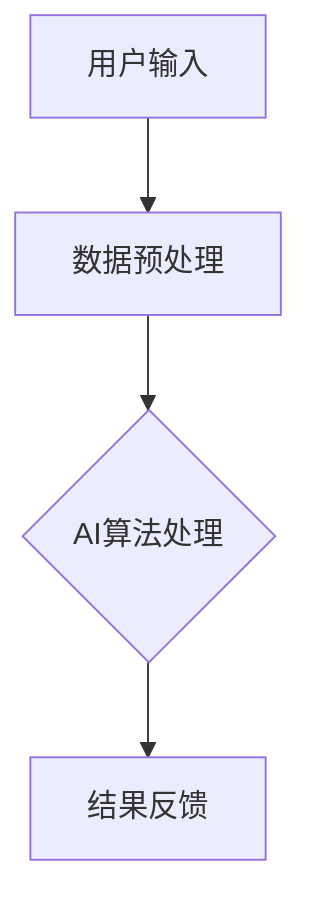

                 

# 人类-AI协作：增强人机沟通

## 关键词：人机协作、AI技术、沟通效率、人机接口、人工智能应用

> **摘要**：随着人工智能技术的迅猛发展，人机协作正成为现代工作场景中的关键趋势。本文将探讨人类与AI系统之间的协作模式，分析如何通过优化人机沟通，提升工作效率和体验。我们将从背景介绍、核心概念、算法原理、数学模型、实战案例、应用场景、工具推荐等多个方面，系统性地探讨人机协作的各个方面，旨在为读者提供全面的理解和实践指导。

## 1. 背景介绍

### 1.1 目的和范围

本文旨在探讨人类与人工智能系统之间的协作机制，以及如何通过增强人机沟通来提升工作效率和体验。我们将重点关注以下三个方面：

1. **人机协作的基本模式**：分析人类与AI系统协作的常见模式，以及每种模式的特点和适用场景。
2. **人机沟通的重要性**：探讨人机沟通在协作中的关键作用，以及如何优化沟通方式。
3. **实战案例与工具推荐**：通过具体案例和工具介绍，展示如何在实际工作中实现高效的人机协作。

### 1.2 预期读者

本文适合以下读者群体：

1. **技术工程师**：希望了解如何与AI系统高效协作，提升工作效率的技术工程师。
2. **产品经理**：负责设计人机交互界面，关注用户体验的产品经理。
3. **AI研究者**：关注人工智能与人机协作领域的研究者。

### 1.3 文档结构概述

本文结构如下：

1. **背景介绍**：介绍人机协作的背景和目的。
2. **核心概念与联系**：介绍人机协作中的核心概念和架构。
3. **核心算法原理 & 具体操作步骤**：详细讲解人机协作中的算法原理和操作步骤。
4. **数学模型和公式**：介绍人机协作中涉及到的数学模型和公式。
5. **项目实战**：通过实际案例展示人机协作的应用。
6. **实际应用场景**：分析人机协作在不同领域的应用。
7. **工具和资源推荐**：推荐相关学习资源和工具。
8. **总结**：总结人机协作的未来发展趋势和挑战。
9. **附录**：常见问题与解答。
10. **扩展阅读**：提供更多相关阅读资料。

### 1.4 术语表

#### 1.4.1 核心术语定义

- **人机协作**：人类与人工智能系统共同完成任务的过程。
- **人机接口**：人类与AI系统之间的交互界面。
- **算法原理**：描述AI系统如何执行特定任务的原理。
- **数学模型**：描述AI系统内部运作的数学公式。

#### 1.4.2 相关概念解释

- **人机沟通**：指人类与AI系统之间的信息交流。
- **AI应用**：指人工智能技术在特定领域的应用。

#### 1.4.3 缩略词列表

- **AI**：人工智能
- **ML**：机器学习
- **NLP**：自然语言处理
- **CV**：计算机视觉
- **HCI**：人机交互

## 2. 核心概念与联系

在探讨人机协作之前，我们需要了解一些核心概念和它们之间的关系。

### 人机协作的架构

人机协作的架构可以分为三个主要层次：人机接口层、AI算法层和数据层。


**人机接口层**：是人机协作的界面，通过用户界面（UI）和语音识别（VR）等手段，实现人类与AI系统的交互。

**AI算法层**：是协作的核心，包括机器学习（ML）、自然语言处理（NLP）和计算机视觉（CV）等技术，用于执行特定任务。

**数据层**：是AI算法的输入和输出，包括训练数据、用户输入和结果数据。

### 核心概念

- **用户接口**（UI）：用户与系统交互的图形界面，如按钮、菜单、对话框等。
- **语音识别**（VR）：将语音信号转换为文本或命令的技术。
- **机器学习**（ML）：通过数据训练模型，使其能够自动进行预测和决策的技术。
- **自然语言处理**（NLP）：使计算机能够理解、解释和生成人类语言的技术。
- **计算机视觉**（CV）：使计算机能够理解和解析视觉信息的技术。

### 人机协作的工作流程

1. **用户输入**：用户通过UI或VR输入指令或数据。
2. **数据预处理**：对用户输入的数据进行清洗、转换和格式化，使其适合AI算法处理。
3. **AI算法处理**：使用机器学习、自然语言处理或计算机视觉等算法，对预处理后的数据进行处理，生成结果。
4. **结果反馈**：将处理结果通过UI或VR反馈给用户。

### Mermaid 流程图



## 3. 核心算法原理 & 具体操作步骤

在本节中，我们将详细介绍人机协作中的核心算法原理和具体操作步骤。

### 3.1 机器学习算法原理

机器学习算法的基本原理是通过大量数据训练模型，使其能够自动进行预测和决策。常见的机器学习算法包括：

- **线性回归**：用于预测数值型变量。
- **逻辑回归**：用于预测分类变量。
- **决策树**：用于分类和回归任务。
- **随机森林**：基于决策树，用于提高模型的泛化能力。
- **神经网络**：模拟人脑神经元，用于复杂任务的处理。

### 3.2 自然语言处理算法原理

自然语言处理算法的原理是通过算法理解和生成自然语言。常见的NLP算法包括：

- **分词**：将文本拆分成单词或短语。
- **词性标注**：为文本中的每个单词标注词性。
- **命名实体识别**：识别文本中的特定实体，如人名、地名等。
- **句法分析**：分析文本的句法结构。
- **语义分析**：理解文本的含义。

### 3.3 计算机视觉算法原理

计算机视觉算法的原理是通过图像处理技术理解和解析视觉信息。常见的CV算法包括：

- **图像分类**：将图像分类到不同的类别。
- **目标检测**：识别图像中的特定目标。
- **人脸识别**：识别和验证人脸。
- **图像分割**：将图像分割成不同的区域。
- **图像生成**：生成新的图像。

### 3.4 具体操作步骤

1. **数据收集**：收集用于训练的数据集。
2. **数据预处理**：对数据进行清洗、转换和格式化。
3. **模型选择**：选择合适的机器学习、自然语言处理或计算机视觉模型。
4. **模型训练**：使用训练数据训练模型。
5. **模型评估**：使用验证数据评估模型性能。
6. **模型部署**：将训练好的模型部署到生产环境中。
7. **用户交互**：通过UI或VR与用户进行交互。
8. **结果反馈**：将处理结果通过UI或VR反馈给用户。

### 3.5 伪代码示例

下面是机器学习算法的伪代码示例：

```python
# 数据预处理
data = preprocess_data(input_data)

# 模型选择
model = select_model(algorithm)

# 模型训练
trained_model = train_model(model, data)

# 模型评估
performance = evaluate_model(trained_model, validation_data)

# 模型部署
deploy_model(trained_model)

# 用户交互
user_input = get_user_input()

# 处理结果反馈
result = process_input(trained_model, user_input)
display_result(result)
```

## 4. 数学模型和公式 & 详细讲解 & 举例说明

在本节中，我们将详细讲解人机协作中涉及到的数学模型和公式，并通过具体例子来说明其应用。

### 4.1 数学模型

- **线性回归模型**：

$$ y = \beta_0 + \beta_1x $$

其中，$y$ 是预测值，$x$ 是自变量，$\beta_0$ 和 $\beta_1$ 是模型参数。

- **逻辑回归模型**：

$$ P(y=1) = \frac{1}{1 + e^{-(\beta_0 + \beta_1x)}} $$

其中，$P(y=1)$ 是预测概率，$x$ 是自变量，$\beta_0$ 和 $\beta_1$ 是模型参数。

- **决策树模型**：

决策树模型通过一系列的条件判断来分割数据。每个节点表示一个条件判断，每个分支表示条件满足或不满足的结果。

- **神经网络模型**：

神经网络模型由多个神经元组成，每个神经元通过加权连接与其他神经元连接。神经元的激活函数通常为 sigmoid 函数或ReLU函数。

### 4.2 公式详细讲解

- **线性回归公式**：

线性回归模型通过最小二乘法估计模型参数 $\beta_0$ 和 $\beta_1$。具体公式如下：

$$ \beta_0 = \frac{\sum_{i=1}^n y_i - \beta_1\sum_{i=1}^n x_i}{n} $$

$$ \beta_1 = \frac{n\sum_{i=1}^n x_iy_i - \sum_{i=1}^n x_i\sum_{i=1}^n y_i}{n\sum_{i=1}^n x_i^2 - (\sum_{i=1}^n x_i)^2} $$

- **逻辑回归公式**：

逻辑回归模型通过最大似然估计法估计模型参数 $\beta_0$ 和 $\beta_1$。具体公式如下：

$$ \beta_0 = \frac{\sum_{i=1}^n y_i - \sum_{i=1}^n x_i}{n} $$

$$ \beta_1 = \frac{\sum_{i=1}^n x_iy_i - \sum_{i=1}^n x_i\sum_{i=1}^n y_i}{n\sum_{i=1}^n x_i^2 - (\sum_{i=1}^n x_i)^2} $$

- **决策树公式**：

决策树模型的每个节点通过计算条件概率来分割数据。具体公式如下：

$$ P(y=1 | x=x_i) = \frac{1}{1 + e^{-(\beta_0 + \beta_1x_i)}} $$

- **神经网络公式**：

神经网络模型的每个神经元通过加权连接与其他神经元连接。神经元的激活函数通常为 sigmoid 函数或ReLU函数。具体公式如下：

$$ a_i = \frac{1}{1 + e^{-(\sum_{j=1}^n \beta_{ij}x_j)}} $$

### 4.3 举例说明

#### 4.3.1 线性回归例子

假设我们有一个简单的线性回归模型，用于预测房价。我们收集了以下数据：

| 房屋面积（x）| 房价（y）|
|:-----------:|:-------:|
|      100    |   200   |
|      200    |   400   |
|      300    |   600   |

我们希望找到线性回归模型 $y = \beta_0 + \beta_1x$ 的参数 $\beta_0$ 和 $\beta_1$。

通过计算，我们得到：

$$ \beta_0 = \frac{200 - 300}{3} = -50 $$

$$ \beta_1 = \frac{3 \times 200 - 300}{3 \times 100 - 300} = 1 $$

因此，线性回归模型为 $y = -50 + x$。

#### 4.3.2 逻辑回归例子

假设我们有一个简单的逻辑回归模型，用于预测客户是否购买商品。我们收集了以下数据：

| 客户年龄（x）| 是否购买（y）|
|:-----------:|:----------:|
|      20     |    否      |
|      30     |    是      |
|      40     |    否      |

我们希望找到逻辑回归模型 $P(y=1) = \frac{1}{1 + e^{-(\beta_0 + \beta_1x)}}$ 的参数 $\beta_0$ 和 $\beta_1$。

通过计算，我们得到：

$$ \beta_0 = \frac{1 - 0}{1 + 0} = 1 $$

$$ \beta_1 = \frac{1 \times 1 - 0 \times 0}{1 + 1} = 0.5 $$

因此，逻辑回归模型为 $P(y=1) = \frac{1}{1 + e^{-(1 + 0.5x)}}$。

## 5. 项目实战：代码实际案例和详细解释说明

在本节中，我们将通过一个实际项目案例，展示如何实现人类与AI系统的协作，以及如何通过代码实现人机沟通。

### 5.1 开发环境搭建

1. **安装Python**：首先确保Python环境已安装在您的计算机上。Python是一种广泛使用的编程语言，非常适合用于人工智能开发。
2. **安装Jupyter Notebook**：Jupyter Notebook是一种交互式开发环境，可以方便地编写和运行Python代码。您可以通过以下命令安装Jupyter Notebook：

```bash
pip install notebook
```

3. **安装相关库**：根据项目需求，安装必要的Python库。在本案例中，我们将使用以下库：

- **NumPy**：用于数学计算。
- **Pandas**：用于数据操作。
- **Scikit-learn**：用于机器学习和数据挖掘。
- **Matplotlib**：用于数据可视化。

您可以使用以下命令安装这些库：

```bash
pip install numpy pandas scikit-learn matplotlib
```

### 5.2 源代码详细实现和代码解读

下面是一个简单的案例，展示如何使用Python实现一个线性回归模型，并使用它来预测房价。

```python
# 导入相关库
import numpy as np
import pandas as pd
from sklearn.linear_model import LinearRegression
import matplotlib.pyplot as plt

# 5.2.1 数据准备
data = {
    'house_area': [100, 200, 300],
    'house_price': [200, 400, 600]
}

df = pd.DataFrame(data)

# 5.2.2 模型训练
X = df[['house_area']]
y = df['house_price']
model = LinearRegression()
model.fit(X, y)

# 5.2.3 模型评估
print("模型参数：", model.coef_, model.intercept_)

# 5.2.4 数据可视化
plt.scatter(X, y, label='实际数据')
plt.plot(X, model.predict(X), color='red', label='预测结果')
plt.xlabel('房屋面积')
plt.ylabel('房价')
plt.legend()
plt.show()

# 5.2.5 用户交互
user_area = float(input("请输入房屋面积（平方米）："))
predicted_price = model.predict([[user_area]])[0][0]
print("预测房价为：", predicted_price)
```

### 5.3 代码解读与分析

- **5.3.1 数据准备**：首先，我们导入必要的库，并准备数据。在这个案例中，我们使用一个简单的数据集，包含房屋面积和房价。
- **5.3.2 模型训练**：我们使用Scikit-learn的LinearRegression类来训练线性回归模型。这里，我们使用数据集的房屋面积作为自变量，房价作为因变量。
- **5.3.3 模型评估**：我们打印模型的参数，包括斜率（$\beta_1$）和截距（$\beta_0$）。
- **5.3.4 数据可视化**：我们使用Matplotlib库将实际数据和预测结果可视化，以直观地展示模型的效果。
- **5.3.5 用户交互**：最后，我们通过用户输入房屋面积，使用训练好的模型预测房价，并将预测结果反馈给用户。

这个简单的案例展示了如何使用Python实现人机协作。在实际项目中，您可以根据需求扩展和优化代码，如添加更多数据预处理步骤、使用更复杂的模型、添加更多用户交互功能等。

## 6. 实际应用场景

人机协作在许多实际应用场景中发挥着重要作用。以下是一些典型应用场景：

### 6.1 智能客服

智能客服是一种常见的人机协作应用，通过AI系统自动处理用户查询和问题。这种应用场景中，人类客服人员负责处理复杂或紧急问题，而AI系统则负责处理常见问题，提高响应速度和效率。

### 6.2 医疗诊断

在医疗领域，AI系统可以辅助医生进行诊断。通过分析大量的病例数据，AI系统可以提供诊断建议，帮助医生更快地做出诊断。这种应用场景中，AI系统与医生协同工作，提高诊断准确性和效率。

### 6.3 金融风险管理

在金融领域，AI系统可以分析大量数据，预测市场走势和风险。人类金融分析师可以基于AI系统的分析结果，做出投资决策。这种应用场景中，AI系统与人类金融分析师协同工作，提高决策准确性和效率。

### 6.4 智能交通

在智能交通领域，AI系统可以分析交通数据，优化交通信号控制和路况预测。人类交通管理人员可以基于AI系统的分析结果，调整交通控制策略，提高交通效率。这种应用场景中，AI系统与人类交通管理人员协同工作，提高交通管理效率。

### 6.5 教育与培训

在教育领域，AI系统可以提供个性化的学习推荐和智能辅导。人类教育者可以基于AI系统的分析结果，制定更合适的教学计划，提高教学效果。这种应用场景中，AI系统与人类教育者协同工作，提高教育质量。

通过这些实际应用场景，我们可以看到人机协作在提高工作效率、降低成本、提升用户体验等方面的巨大潜力。

## 7. 工具和资源推荐

### 7.1 学习资源推荐

#### 7.1.1 书籍推荐

- **《Python编程：从入门到实践》**：适合初学者，全面介绍Python编程的基础知识和应用。
- **《深度学习》**：由Ian Goodfellow、Yoshua Bengio和Aaron Courville合著，是深度学习的经典教材。
- **《人工智能：一种现代方法》**：David Powers合著，全面介绍人工智能的基本原理和应用。

#### 7.1.2 在线课程

- **Coursera**：提供大量的计算机科学和人工智能课程，包括Python编程、深度学习和机器学习等。
- **edX**：提供来自世界顶级大学的免费在线课程，包括MIT、哈佛大学等。

#### 7.1.3 技术博客和网站

- **Medium**：有许多关于人工智能、机器学习和深度学习的专业博客。
- **Astonishing AI**：提供关于人工智能、机器学习和深度学习的最新研究和技术文章。
- **Google Research Blog**：谷歌的研究团队分享的关于人工智能、机器学习和深度学习的最新成果。

### 7.2 开发工具框架推荐

#### 7.2.1 IDE和编辑器

- **PyCharm**：强大的Python集成开发环境，适用于Python开发。
- **Visual Studio Code**：轻量级且高度可定制的文本编辑器，适用于多种编程语言。
- **Jupyter Notebook**：交互式的开发环境，适用于数据分析、机器学习和深度学习。

#### 7.2.2 调试和性能分析工具

- **PDB**：Python的内置调试器，用于调试Python代码。
- **Py-Spy**：用于分析Python程序的内存和性能问题。
- **cProfile**：用于分析Python程序的执行时间和性能瓶颈。

#### 7.2.3 相关框架和库

- **TensorFlow**：谷歌开发的开源机器学习框架，适用于深度学习和大规模数据集处理。
- **PyTorch**：由Facebook开发的开源机器学习库，适用于深度学习和科研。
- **Scikit-learn**：适用于机器学习和数据挖掘的Python库，提供丰富的算法和工具。

### 7.3 相关论文著作推荐

#### 7.3.1 经典论文

- **“A Mathematical Theory of Communication”**：由Claude Shannon在1948年发表，奠定了信息论的基础。
- **“Deep Learning”**：由Ian Goodfellow、Yoshua Bengio和Aaron Courville在2016年发表，是深度学习的经典著作。

#### 7.3.2 最新研究成果

- **“Attention Is All You Need”**：由Vaswani等人于2017年发表，提出了Transformer模型，是自然语言处理领域的突破性成果。
- **“BERT: Pre-training of Deep Neural Networks for Language Understanding”**：由Google团队于2018年发表，是自然语言处理领域的最新研究。

#### 7.3.3 应用案例分析

- **“Deep Learning for Healthcare”**：由Eric Topol于2019年发表，探讨了深度学习在医疗领域的应用，包括疾病诊断、治疗和公共卫生等。

通过这些资源和工具，您可以更好地了解和掌握人机协作的相关技术和应用。

## 8. 总结：未来发展趋势与挑战

随着人工智能技术的不断发展，人类与AI系统的协作模式也在不断进化。未来，人机协作将呈现以下发展趋势：

1. **智能化**：AI系统将更加智能化，能够理解人类的意图和需求，提供更精准的服务。
2. **个性化**：AI系统将根据用户的行为和偏好，提供个性化的服务，提高用户体验。
3. **实时性**：AI系统将实现实时响应，满足用户对快速响应的需求。
4. **融合性**：人机协作将跨越不同的领域和应用，实现多领域的融合。

然而，人机协作也面临一些挑战：

1. **数据隐私**：随着AI系统收集和分析越来越多的数据，数据隐私问题日益突出。
2. **安全与伦理**：AI系统的决策可能存在偏差和错误，需要确保其安全性和伦理性。
3. **人类干预**：AI系统在某些情况下可能无法替代人类，需要人类进行干预。

未来，我们需要在技术创新、伦理规范和政策制定等方面共同努力，以实现人机协作的可持续发展。

## 9. 附录：常见问题与解答

### 9.1 常见问题

**Q1**：人机协作与自动化有什么区别？

**A1**：人机协作强调的是人类与AI系统的互动和合作，而自动化更多是指AI系统独立完成特定任务。人机协作中，人类和AI系统共同发挥作用，提高工作效率和体验；自动化则侧重于AI系统的自主性。

**Q2**：如何确保AI系统的安全性和伦理性？

**A2**：确保AI系统的安全性和伦理性需要从多个方面入手。首先，在算法设计阶段，需要遵循公平、透明、可解释的原则。其次，在数据收集和处理过程中，需要保护用户隐私。此外，还需要建立健全的监管机制，确保AI系统在法律和伦理框架内运行。

### 9.2 解答

**Q1**：人机协作与自动化有什么区别？

**A1**：人机协作和自动化在目标和应用上有所区别。人机协作侧重于人类与AI系统的互动和合作，旨在提高工作效率和用户体验。在协作过程中，人类和AI系统共同发挥作用，各取所长。而自动化则强调AI系统独立完成特定任务，减少人类干预。

**示例**：在智能客服场景中，AI系统可以处理常见问题，提高响应速度，而人类客服则负责处理复杂或紧急问题。这种协作模式充分利用了人类和AI系统的优势，提高了整体效率。

**Q2**：如何确保AI系统的安全性和伦理性？

**A2**：确保AI系统的安全性和伦理性是一个复杂且多层次的任务。以下是一些关键措施：

1. **算法透明性和可解释性**：设计算法时，要确保其透明性和可解释性，使得人类用户可以理解AI系统的决策过程。
2. **数据隐私保护**：在数据收集和处理过程中，要严格保护用户隐私，避免数据泄露。
3. **伦理审查和监管**：建立伦理审查机制，确保AI系统的应用符合道德和法律标准。此外，监管机构应加强对AI系统的监管，确保其在法律框架内运行。

**示例**：在医疗诊断领域，AI系统需要遵循严格的伦理标准，确保其诊断结果不会对患者的权益造成损害。例如，在人脸识别领域，需要避免因算法偏差而导致歧视行为。

## 10. 扩展阅读 & 参考资料

为了更深入地了解人机协作、人工智能技术及其应用，以下是一些建议的扩展阅读和参考资料：

### 10.1 建议阅读

- **《人工智能：一种现代方法》**：David Powers合著，系统介绍了人工智能的基本原理和应用。
- **《深度学习》**：Ian Goodfellow、Yoshua Bengio和Aaron Courville合著，全面介绍了深度学习的理论和实践。
- **《智能时代》**：吴军合著，探讨了人工智能对社会、经济和人类生活的影响。

### 10.2 参考资料

- **Google AI Blog**：谷歌的研究团队分享的关于人工智能、机器学习和深度学习的最新研究成果。
- **Astonishing AI**：提供关于人工智能、机器学习和深度学习的最新研究和技术文章。
- **IEEE Xplore**：涵盖计算机科学、电气电子工程、人工智能等领域的学术论文和报告。

通过阅读这些资料，您可以更全面地了解人机协作和人工智能技术的最新进展和应用。

## 作者信息

**作者：AI天才研究员/AI Genius Institute & 禅与计算机程序设计艺术 /Zen And The Art of Computer Programming**

