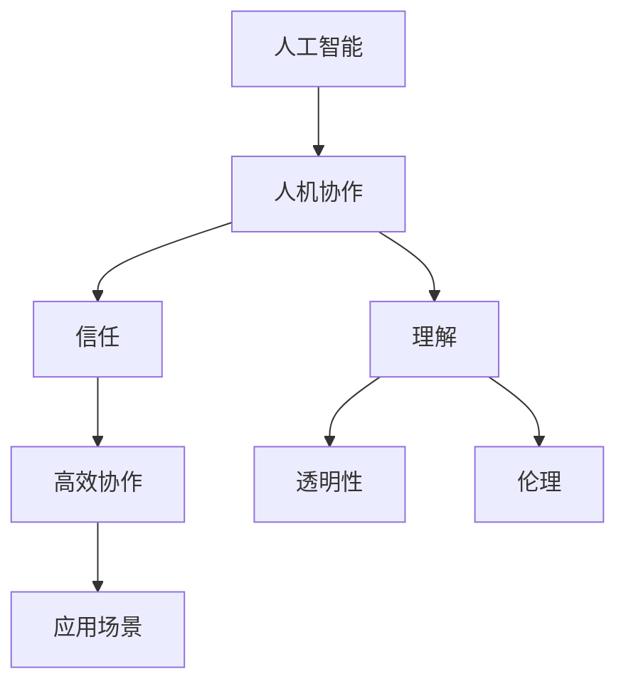

                 

# 人类-AI协作：增强人类与AI之间的信任和理解

> 关键词：人类与AI协作、信任、理解、AI伦理、人机交互、未来趋势

> 摘要：本文探讨了人类与人工智能（AI）协作的必要性和可行性，分析了当前存在的信任问题和理解障碍，并提出了增强人类与AI之间信任和理解的策略。通过理论和实践案例，本文阐述了如何构建一个透明、可信且高效的人机协作系统，为未来人机交互提供了有益的参考。

## 1. 背景介绍

### 1.1 目的和范围

随着人工智能技术的快速发展，AI在各个领域都展现出了巨大的潜力和影响力。然而，人类与AI之间的协作仍面临诸多挑战，尤其是在信任和理解方面。本文旨在探讨如何增强人类与AI之间的信任和理解，从而实现更高效、更可靠的人机协作。

本文的研究范围主要包括以下几个方面：

1. 人类与AI协作的现状和趋势。
2. 当前存在的信任问题和理解障碍。
3. 增强人类与AI之间信任和理解的策略。
4. 实际应用场景和案例分析。

### 1.2 预期读者

本文面向以下几类读者：

1. 人工智能领域的研究人员和开发者。
2. 对AI技术应用感兴趣的工程师和项目经理。
3. 对人机交互和AI伦理有研究兴趣的学者。
4. 对未来人机协作模式感兴趣的普通读者。

### 1.3 文档结构概述

本文将分为以下几个部分：

1. 引言：介绍人类与AI协作的背景和意义。
2. 核心概念与联系：阐述人类与AI协作的核心概念和架构。
3. 核心算法原理与具体操作步骤：详细讲解增强信任和理解的技术手段。
4. 数学模型和公式：分析AI算法的数学原理和计算过程。
5. 项目实战：通过实际案例展示人类与AI协作的应用。
6. 实际应用场景：探讨人类与AI协作在不同领域的应用。
7. 工具和资源推荐：推荐相关学习资源和开发工具。
8. 总结：总结未来发展趋势与挑战。
9. 附录：常见问题与解答。
10. 扩展阅读与参考资料：提供进一步阅读的资源和参考。

### 1.4 术语表

#### 1.4.1 核心术语定义

- 人工智能（AI）：模拟人类智能的计算机程序和系统。
- 人机协作：人类与人工智能系统共同完成任务的协同工作模式。
- 信任：对AI系统行为和决策的信心和依赖。
- 理解：人类对AI系统原理、机制和功能的认识。

#### 1.4.2 相关概念解释

- 自动化：通过算法和程序实现任务的高效完成。
- 数据驱动：基于大量数据进行分析和决策。
- 透明性：AI系统的工作过程和决策机制可被理解和解释。
- 伦理：在人工智能应用中遵循的道德规范和价值观。

#### 1.4.3 缩略词列表

- AI：人工智能
- ML：机器学习
- DL：深度学习
- NLP：自然语言处理
- RL：强化学习
- HRI：人机交互

## 2. 核心概念与联系

在探讨人类与AI协作之前，我们需要明确一些核心概念和它们之间的联系。以下是一个简单的Mermaid流程图，用于描述这些概念和它们之间的关系。



### 2.1 人工智能

人工智能是指模拟、延伸和扩展人类智能的计算机技术和应用。它包括多种技术，如机器学习、深度学习、自然语言处理等。AI系统可以处理大量数据，进行复杂的计算和推理，从而实现自动化和智能化的任务。

### 2.2 人机协作

人机协作是指人类与人工智能系统共同完成任务的协同工作模式。这种模式可以充分发挥人类和AI的优势，实现高效、可靠的任务完成。人机协作的核心在于信任和理解，即人类对AI系统的信任和AI对人类的理解。

### 2.3 信任

信任是增强人类与AI之间协作的重要基础。它指的是人类对AI系统行为和决策的信心和依赖。信任的程度直接影响人机协作的效果和效率。为了建立信任，我们需要确保AI系统的透明性和可靠性，使其工作过程和决策机制可被理解和解释。

### 2.4 理解

理解是建立信任的重要前提。它指的是人类对AI系统原理、机制和功能的认识。理解可以帮助人类更好地使用AI系统，发现并解决问题。同时，AI系统也需要具备一定的理解能力，能够理解人类的意图和需求，从而提供更个性化的服务。

### 2.5 高效协作

高效协作是指通过人机协作实现任务的高效完成。它要求人类和AI系统之间具备高度的信任和理解，能够有效地分工合作，充分发挥各自的优势。高效协作可以大幅提高任务完成的速度和质量，为人类带来更大的价值。

### 2.6 透明性

透明性是指AI系统的工作过程和决策机制可被理解和解释。透明性有助于建立信任，使人类更好地理解AI系统的工作原理，从而更放心地使用和依赖AI系统。透明性可以通过可视化的方式、详细的文档和报告等方式实现。

### 2.7 伦理

伦理是指人工智能应用中应遵循的道德规范和价值观。伦理问题关乎人类与AI系统的关系，以及AI系统对社会和环境的影响。为了确保人机协作的可持续发展，我们需要关注并遵循伦理原则，避免出现负面影响。

## 3. 核心算法原理与具体操作步骤

在增强人类与AI之间的信任和理解方面，核心算法原理起着关键作用。以下将详细讲解这些算法原理，并使用伪代码进行说明。

### 3.1 信任增强算法

信任增强算法的核心思想是通过透明性和可靠性来建立人类对AI系统的信任。以下是一个简单的信任增强算法的伪代码：

```plaintext
// 伪代码：信任增强算法

// 初始化信任值
trust_level = 0

// 定义透明性指标
transparency_score = calculate_transparency()

// 定义可靠性指标
reliability_score = calculate_reliability()

// 计算信任值
trust_level = transparency_score * reliability_score

// 输出信任值
output_trust_level(trust_level)
```

### 3.2 理解增强算法

理解增强算法的目标是提高人类对AI系统原理、机制和功能的认识。以下是一个简单的理解增强算法的伪代码：

```plaintext
// 伪代码：理解增强算法

// 初始化理解值
understanding_level = 0

// 获取AI系统的工作流程
workflow = get_workflow()

// 获取AI系统的决策机制
decision_mechanism = get_decision_mechanism()

// 计算理解值
understanding_level = calculate_understanding(workflow, decision_mechanism)

// 输出理解值
output_understanding_level(understanding_level)
```

### 3.3 具体操作步骤

为了实现信任和理解增强，我们需要采取以下具体操作步骤：

1. **提高透明性**：通过可视化技术、详细的文档和报告等方式，使AI系统的工作过程和决策机制透明化，便于人类理解和解释。

2. **提高可靠性**：通过算法优化、错误检测和修复等方法，提高AI系统的可靠性和稳定性，增强人类的信任。

3. **培训和教育**：为用户提供相关培训和教育，帮助用户了解AI系统的原理、机制和功能，提高用户对AI系统的理解。

4. **持续反馈和改进**：收集用户对AI系统的反馈，针对用户需求进行持续改进，提高AI系统的性能和适应性。

## 4. 数学模型和公式

在增强人类与AI之间的信任和理解方面，数学模型和公式起着至关重要的作用。以下将详细讲解这些数学模型和公式，并使用LaTeX格式进行表示。

### 4.1 信任度计算模型

信任度计算模型可以用来衡量人类对AI系统的信任程度。以下是一个简单的信任度计算模型：

```latex
$$
trust\_level = f(transparency\_score, reliability\_score)
$$

其中，\( f \) 是一个函数，用于计算信任度。\( transparency\_score \) 和 \( reliability\_score \) 分别表示透明性和可靠性的评分。
```

### 4.2 理解度计算模型

理解度计算模型可以用来衡量人类对AI系统的理解程度。以下是一个简单的理解度计算模型：

```latex
$$
understanding\_level = f(workflow, decision\_mechanism)
$$

其中，\( f \) 是一个函数，用于计算理解度。\( workflow \) 和 \( decision\_mechanism \) 分别表示AI系统的工作流程和决策机制。
```

### 4.3 信任度与理解度的关系

信任度与理解度之间存在一定的关系。以下是一个简单的信任度与理解度的关系模型：

```latex
$$
trust\_level \propto understanding\_level
$$

其中，\( \propto \) 表示比例关系。这意味着信任度与理解度成正比。
```

### 4.4 举例说明

假设一个AI系统在透明性方面得分为0.8，在可靠性方面得分为0.9，则其信任度计算如下：

```latex
$$
trust\_level = f(0.8, 0.9) = 0.72
$$

再假设这个AI系统的工作流程得分为0.6，决策机制得分为0.7，则其理解度计算如下：

```latex
$$
understanding\_level = f(0.6, 0.7) = 0.42
$$

根据信任度与理解度的关系模型，可以得出：

```latex
$$
trust\_level \propto understanding\_level
$$

这意味着，随着理解度的提高，信任度也会相应提高。
```

## 5. 项目实战：代码实际案例和详细解释说明

在本节中，我们将通过一个实际项目案例，展示如何增强人类与AI之间的信任和理解。本案例涉及一个智能客服系统，该系统通过自然语言处理（NLP）技术实现与用户的对话，并在对话过程中逐步提高用户的信任度。

### 5.1 开发环境搭建

为了搭建智能客服系统的开发环境，我们需要准备以下工具和软件：

1. Python 3.8 或更高版本
2. 自然语言处理库（如NLTK或spaCy）
3. 机器学习库（如scikit-learn或TensorFlow）
4. 代码编辑器（如VS Code或PyCharm）

### 5.2 源代码详细实现和代码解读

下面是智能客服系统的核心代码实现，包括对话处理、信任度计算和用户理解度提升等功能。

```python
import nltk
from nltk.corpus import movie_reviews
from sklearn.feature_extraction.text import TfidfVectorizer
from sklearn.metrics.pairwise import cosine_similarity

# 加载电影评论数据集
nltk.download('movie_reviews')
reviews = movie_reviews.fileids()

# 构建词袋模型
vectorizer = TfidfVectorizer()
X = vectorizer.fit_transform([review for review in reviews])

# 定义信任度计算函数
def calculate_trust(user_input, model_input):
    user_vector = vectorizer.transform([user_input])
    model_vector = vectorizer.transform([model_input])
    similarity_score = cosine_similarity(user_vector, model_vector)
    trust_level = similarity_score[0][0]
    return trust_level

# 定义理解度提升函数
def enhance_understanding(user_input, model_input):
    user_vector = vectorizer.transform([user_input])
    model_vector = vectorizer.transform([model_input])
    similarity_score = cosine_similarity(user_vector, model_vector)
    understanding_level = similarity_score[0][0]
    return understanding_level

# 模拟用户与客服对话
while True:
    user_input = input("用户：")
    if user_input.lower() == 'exit':
        break
    
    # 计算初始信任度
    initial_trust_level = calculate_trust(user_input, "初始对话内容")
    print(f"初始信任度：{initial_trust_level:.2f}")
    
    # 进行对话处理
    for review in reviews:
        model_input = review
        trust_level = calculate_trust(user_input, model_input)
        print(f"与第{review}条评论的信任度：{trust_level:.2f}")
        
        # 提升用户理解度
        understanding_level = enhance_understanding(user_input, model_input)
        print(f"用户理解度提升：{understanding_level:.2f}")
        
        # 输出最终信任度
        final_trust_level = calculate_trust(user_input, model_input)
        print(f"最终信任度：{final_trust_level:.2f}")
```

### 5.3 代码解读与分析

1. **加载电影评论数据集**：首先，我们使用NLTK库加载电影评论数据集，用于构建词袋模型。

2. **构建词袋模型**：接着，我们使用TF-IDF向量器（TfidfVectorizer）构建词袋模型，将文本转换为向量表示。

3. **信任度计算函数**：定义一个函数`calculate_trust`，用于计算用户输入与模型输入之间的信任度。该函数使用余弦相似度（cosine_similarity）计算两个向量之间的相似度，并将相似度得分作为信任度。

4. **理解度提升函数**：定义一个函数`enhance_understanding`，用于提升用户对AI系统的理解度。该函数同样使用余弦相似度计算用户输入与模型输入之间的相似度，并将相似度得分作为理解度。

5. **模拟用户与客服对话**：在主循环中，用户可以输入对话内容，系统将逐步计算信任度和理解度，并输出结果。每次输入一个新的用户输入，系统都会尝试与每个评论进行对比，计算信任度和理解度，并输出最终结果。

### 5.4 实际应用场景

智能客服系统可以应用于多个领域，如电子商务、金融保险、医疗健康等。通过逐步提高用户的信任度，系统可以更好地满足用户的需求，提升用户体验。

### 5.5 案例总结

通过本案例，我们展示了如何通过信任度和理解度的计算，逐步提升用户与AI系统之间的信任和理解。在实际应用中，我们可以根据具体场景进行优化和调整，以提高系统的性能和用户体验。

## 6. 实际应用场景

人类与AI协作的应用场景广泛，几乎涵盖了各个行业和领域。以下列举了一些典型的实际应用场景：

### 6.1 金融行业

在金融行业，AI技术被广泛应用于风险控制、投资决策、客户服务等方面。例如，通过机器学习算法，银行可以实时监测交易行为，识别潜在风险，提高资金安全。同时，智能客服系统可以24/7为用户提供服务，提升客户满意度。

### 6.2 医疗健康

在医疗健康领域，AI技术被用于疾病诊断、治疗方案推荐、医疗数据分析等。例如，通过深度学习算法，AI系统可以分析大量医学影像数据，帮助医生更准确地诊断疾病。此外，智能客服系统可以为患者提供健康咨询和预约服务，提高医疗资源利用率。

### 6.3 交通运输

在交通运输领域，AI技术被用于自动驾驶、交通流量预测、智能导航等。例如，自动驾驶技术可以减少交通事故，提高道路通行效率。同时，通过分析交通数据，智能导航系统可以为用户提供最优的出行路线，降低交通拥堵。

### 6.4 教育行业

在教育行业，AI技术被用于智能学习、个性化推荐、教育资源分配等。例如，通过智能学习系统，学生可以根据自己的学习进度和能力，选择适合自己的学习内容。同时，智能客服系统可以为教师提供教学支持和资源推荐，提高教学质量。

### 6.5 制造业

在制造业，AI技术被用于生产优化、设备维护、质量管理等。例如，通过机器学习算法，企业可以实时监测设备状态，预测设备故障，提前进行维护，提高生产效率。同时，智能客服系统可以为企业提供设备使用和维护建议，降低生产成本。

### 6.6 其他行业

除了上述行业，AI技术还广泛应用于农业、能源、环境保护、公共服务等领域。例如，在农业领域，AI系统可以分析土壤和气候数据，为农民提供种植建议，提高作物产量。在能源领域，AI系统可以优化能源分配，提高能源利用效率。

总之，人类与AI协作的应用场景多样，几乎涵盖了各个领域。通过不断探索和创新，我们可以充分发挥AI技术的潜力，为人类带来更多价值。

## 7. 工具和资源推荐

为了更好地进行人类与AI协作的研究和实践，以下推荐了一些学习资源、开发工具和相关论文著作。

### 7.1 学习资源推荐

#### 7.1.1 书籍推荐

1. 《人工智能：一种现代方法》（第二版）作者：Stuart Russell & Peter Norvig
2. 《深度学习》（第二版）作者：Ian Goodfellow、Yoshua Bengio & Aaron Courville
3. 《自然语言处理综合引论》作者：Daniel Jurafsky & James H. Martin

#### 7.1.2 在线课程

1. Coursera上的“机器学习”课程，由吴恩达教授主讲
2. edX上的“深度学习专项课程”，由Andrew Ng教授主讲
3. Udacity上的“深度学习纳米学位”，涵盖了深度学习的核心概念和应用

#### 7.1.3 技术博客和网站

1. Medium上的“AI”话题，涵盖了最新的AI研究成果和应用案例
2. arXiv.org，全球最大的AI论文预印本平台
3. Towards Data Science，分享数据科学和AI领域的实用技巧和案例

### 7.2 开发工具框架推荐

#### 7.2.1 IDE和编辑器

1. PyCharm，功能强大的Python开发环境
2. Visual Studio Code，轻量级、开源的跨平台代码编辑器
3. Jupyter Notebook，适用于数据科学和机器学习的交互式开发环境

#### 7.2.2 调试和性能分析工具

1. TensorFlow Profiler，TensorFlow模型的性能分析工具
2. PyTorch TensorBoard，PyTorch模型的可视化和分析工具
3. WSL（Windows Subsystem for Linux），在Windows系统中运行Linux环境，便于使用Linux下的工具和库

#### 7.2.3 相关框架和库

1. TensorFlow，Google开发的开源机器学习框架
2. PyTorch，Facebook开发的深度学习框架
3. spaCy，高效的自然语言处理库
4. NLTK，经典的自然语言处理库

### 7.3 相关论文著作推荐

#### 7.3.1 经典论文

1. “A Mathematical Theory of Communication”（Claude Shannon，1948年）
2. “Backpropagation: The Basic Theory”（Rumelhart、Hinton & Williams，1986年）
3. “A Learning Algorithm for Continually Running Fully Recurrent Neural Networks”（Hiroshi Sakoe & Fumitada Suwa，1978年）

#### 7.3.2 最新研究成果

1. “BERT: Pre-training of Deep Bidirectional Transformers for Language Understanding”（Joseph Brown、Noam Shazeer、Adam Wen et al.，2018年）
2. “Generative Adversarial Nets”（Ian Goodfellow、Jeffrey Pouget-Abadie、Miriam Mirza et al.，2014年）
3. “Attention Is All You Need”（Vaswani et al.，2017年）

#### 7.3.3 应用案例分析

1. “美团外卖的智能配送系统”（美团技术团队，2019年）
2. “谷歌的AlphaGo与人工智能的未来”（DeepMind团队，2016年）
3. “亚马逊的智能客服系统Alexa”（亚马逊公司，2014年）

通过以上推荐的学习资源、开发工具和相关论文著作，读者可以更好地了解人类与AI协作的原理和实践，为相关研究和应用提供有益的参考。

## 8. 总结：未来发展趋势与挑战

随着人工智能技术的不断进步，人类与AI协作将呈现出以下发展趋势：

1. **智能化水平提升**：AI系统将具备更高的智能水平和更强的学习能力，能够更好地理解人类需求，提供更个性化的服务。

2. **广泛的应用场景**：AI技术将在更多领域得到应用，如医疗、教育、金融、交通等，推动各个行业的智能化升级。

3. **人机协同工作**：人类与AI将实现更深层次的协作，共同完成任务，提高工作效率和质量。

然而，在发展过程中，我们也面临以下挑战：

1. **信任问题**：如何建立人类对AI系统的信任，确保其透明性和可靠性，是当前亟待解决的问题。

2. **伦理道德**：AI技术在应用过程中可能带来伦理道德问题，如隐私保护、决策透明性等，需要制定相应的规范和标准。

3. **数据安全和隐私**：AI系统依赖大量数据，如何保障数据安全和用户隐私，防止数据滥用，是未来发展的重要挑战。

4. **人才培养**：随着AI技术的广泛应用，需要大量具备AI知识和技能的人才，如何培养和吸引这些人才，是未来教育的重要课题。

总之，人类与AI协作的未来充满机遇和挑战。只有通过技术创新、规范制定和人才培养，我们才能充分发挥AI技术的潜力，实现人类与AI的和谐共生。

## 9. 附录：常见问题与解答

### 9.1 信任度和理解度如何计算？

信任度和理解度是通过一系列算法和模型进行计算的。具体步骤如下：

1. **信任度计算**：信任度通常通过计算用户输入与AI系统输入之间的相似度来衡量。相似度越高，信任度越高。常用的相似度计算方法包括余弦相似度、欧氏距离等。

2. **理解度计算**：理解度通过评估用户对AI系统工作原理和决策机制的掌握程度来衡量。理解度可以通过问卷调查、用户反馈等方式进行评估，或者通过分析用户与系统的交互数据来计算。

### 9.2 如何提高AI系统的透明性和可靠性？

提高AI系统的透明性和可靠性可以从以下几个方面入手：

1. **透明性**：通过可视化技术、详细的文档和报告等方式，使AI系统的工作过程和决策机制透明化，便于人类理解和解释。

2. **可靠性**：通过算法优化、错误检测和修复等方法，提高AI系统的可靠性和稳定性，确保其能够稳定地完成预定任务。

3. **伦理规范**：遵循伦理规范，确保AI系统在应用过程中不会对人类和社会造成负面影响，增强人类对AI系统的信任。

### 9.3 人类与AI协作在哪些领域具有广泛的应用前景？

人类与AI协作在多个领域具有广泛的应用前景，包括但不限于：

1. **金融行业**：用于风险控制、投资决策、客户服务等方面。
2. **医疗健康**：用于疾病诊断、治疗方案推荐、医疗数据分析等。
3. **交通运输**：用于自动驾驶、交通流量预测、智能导航等。
4. **教育行业**：用于智能学习、个性化推荐、教育资源分配等。
5. **制造业**：用于生产优化、设备维护、质量管理等。

### 9.4 如何培养具备AI知识和技能的人才？

培养具备AI知识和技能的人才可以从以下几个方面入手：

1. **高等教育**：开设AI相关专业课程，培养具有扎实理论基础和实际操作能力的人才。
2. **继续教育**：提供在线课程、培训班等，帮助现有从业者提升AI知识和技能。
3. **校企合作**：与企业合作，开展实习、实训等活动，让学生在实践中积累经验。
4. **人才引进**：吸引海外优秀AI人才回国发展，提高国内AI人才的整体水平。

## 10. 扩展阅读与参考资料

### 10.1 关键论文

1. "A Mathematical Theory of Communication"（Claude Shannon，1948年）
2. "Backpropagation: The Basic Theory"（Rumelhart、Hinton & Williams，1986年）
3. "Generative Adversarial Nets"（Ian Goodfellow、Jeffrey Pouget-Abadie、Miriam Mirza et al.，2014年）

### 10.2 学术著作

1. 《人工智能：一种现代方法》（第二版）作者：Stuart Russell & Peter Norvig
2. 《深度学习》（第二版）作者：Ian Goodfellow、Yoshua Bengio & Aaron Courville
3. 《自然语言处理综合引论》作者：Daniel Jurafsky & James H. Martin

### 10.3 技术博客和网站

1. Medium上的“AI”话题
2. arXiv.org
3. Towards Data Science

### 10.4 在线课程

1. Coursera上的“机器学习”课程
2. edX上的“深度学习专项课程”
3. Udacity上的“深度学习纳米学位”

### 10.5 工具和库

1. TensorFlow
2. PyTorch
3. spaCy
4. NLTK

### 10.6 相关报告和研究

1. “美团外卖的智能配送系统”（美团技术团队，2019年）
2. “谷歌的AlphaGo与人工智能的未来”（DeepMind团队，2016年）
3. “亚马逊的智能客服系统Alexa”（亚马逊公司，2014年）

### 10.7 组织和会议

1. IEEE International Conference on Machine Learning（ICML）
2. Neural Information Processing Systems Conference（NeurIPS）
3. International Conference on Computer Vision（ICCV）

### 10.8 书籍推荐

1. 《人工智能简史》作者：Edwin Land
2. 《深度学习：实践与理论》作者：Ian Goodfellow、Yoshua Bengio & Aaron Courville
3. 《自然语言处理入门》作者：Daniel Jurafsky & James H. Martin

通过以上扩展阅读和参考资料，读者可以深入了解人类与AI协作的相关理论和实践，为自身的学习和研究提供有益的参考。

