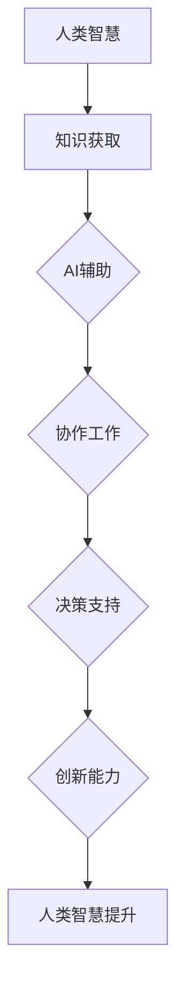
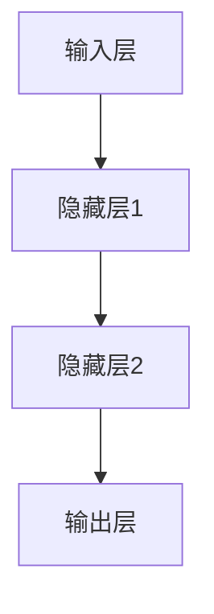
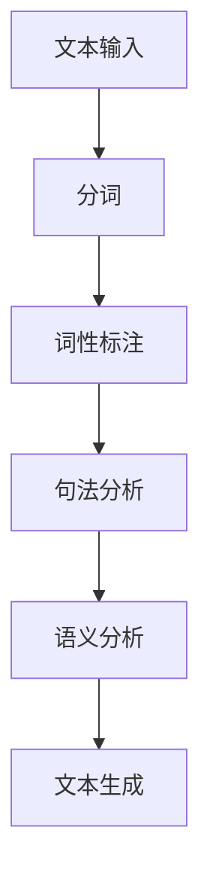

                 

# 人类-AI协作：增强人类智慧与AI能力的融合发展趋势分析预测

> **关键词：**人类-AI协作、智能增强、AI能力融合、发展趋势、挑战与机会。

> **摘要：**本文将深入探讨人类与人工智能协作的未来发展趋势，分析AI如何增强人类智慧，以及两者融合所带来的机遇和挑战。我们将从背景介绍、核心概念、算法原理、数学模型、项目实战和实际应用场景等方面，逐步展开讨论，为读者提供一幅清晰的人类-AI协作蓝图。

## 1. 背景介绍

### 1.1 目的和范围

本文的目的是探讨人类与人工智能（AI）协作的未来发展趋势，特别是AI如何增强人类智慧，以及两者融合所带来的影响。我们将覆盖以下主题：

- 人类与AI协作的定义和意义
- 人类智慧与AI能力的融合
- 发展趋势和潜在挑战
- 实际应用场景和技术实现

### 1.2 预期读者

本文适用于以下读者群体：

- 对人工智能和人类智能融合有兴趣的AI研究者
- 计算机科学和人工智能领域的学生
- 从事人工智能开发和应用的技术专家
- 关注科技发展和未来趋势的普通读者

### 1.3 文档结构概述

本文将分为以下几个部分：

- 背景介绍
- 核心概念与联系
- 核心算法原理与具体操作步骤
- 数学模型和公式讲解
- 项目实战：代码实际案例
- 实际应用场景
- 工具和资源推荐
- 总结：未来发展趋势与挑战
- 附录：常见问题与解答
- 扩展阅读与参考资料

### 1.4 术语表

#### 1.4.1 核心术语定义

- **人工智能（AI）**：模拟人类智能的计算机程序和系统。
- **增强学习**：通过互动和经验来改进智能体行为的学习方法。
- **神经网络**：模仿人脑神经元连接结构的计算模型。
- **自然语言处理（NLP）**：使计算机能够理解、解释和生成人类语言的技术。

#### 1.4.2 相关概念解释

- **人类智慧**：人类在认知、情感、社交和创造性方面表现出来的复杂能力。
- **协作**：个体或团队共同工作，以实现共同目标的过程。

#### 1.4.3 缩略词列表

- **AI**：人工智能
- **NLP**：自然语言处理
- **ML**：机器学习
- **DL**：深度学习

## 2. 核心概念与联系

为了更好地理解人类与AI协作的概念，我们需要首先探讨两者的核心概念和它们之间的联系。

### 2.1 核心概念

- **人类智慧**：包括认知、情感、创造性、社交等多方面能力。
- **人工智能**：模拟人类智能的计算机程序和系统，具备学习、推理、理解等能力。

### 2.2 联系

人类智慧与人工智能之间的联系主要体现在以下几个方面：

- **知识共享**：AI能够快速获取和存储大量知识，辅助人类学习和研究。
- **协同工作**：AI能够承担重复性、繁琐的任务，释放人类精力，实现更高层次的协作。
- **决策支持**：AI通过数据分析、预测模型等技术，提供决策支持，提高决策效率。
- **创新能力**：AI能够通过模拟人类思维方式，激发人类的创新潜能。

### 2.3 Mermaid 流程图

以下是人类智慧与AI协作的Mermaid流程图：



## 3. 核心算法原理与具体操作步骤

为了实现人类与AI的智能协作，我们需要了解一些核心算法原理，并在此基础上进行具体操作。

### 3.1 增强学习

增强学习是一种通过互动和经验来改进智能体行为的学习方法。以下是增强学习的伪代码：

```python
initialize_agent(state, action, reward, next_state)
while not terminate():
    state = observe_environment()
    action = agent.act(state)
    next_state, reward = environment.step(action)
    agent.learn(state, action, reward, next_state)
```

### 3.2 神经网络

神经网络是模仿人脑神经元连接结构的计算模型。以下是神经网络的基本结构：



### 3.3 自然语言处理

自然语言处理是使计算机能够理解、解释和生成人类语言的技术。以下是NLP的基本步骤：



## 4. 数学模型和公式讲解

### 4.1 损失函数

在神经网络中，损失函数用于衡量预测值与真实值之间的差距。常用的损失函数包括：

- **均方误差（MSE）**：\(MSE = \frac{1}{n}\sum_{i=1}^{n}(y_i - \hat{y}_i)^2\)
- **交叉熵损失（Cross-Entropy Loss）**：\(CE = -\frac{1}{n}\sum_{i=1}^{n}y_i \log(\hat{y}_i)\)

### 4.2 反向传播

反向传播是一种训练神经网络的方法，通过不断调整网络权重，使损失函数最小化。以下是反向传播的基本步骤：

1. 前向传播：计算输出层的预测值。
2. 计算损失函数：比较预测值与真实值。
3. 反向传播：计算各层权重的梯度。
4. 更新权重：使用梯度下降法调整权重。

### 4.3 举例说明

假设我们有一个简单的线性回归模型，目标是预测一个线性函数 \(y = 2x + 1\)。以下是使用反向传播训练模型的示例：

```python
import numpy as np

# 初始化参数
weights = np.random.rand(1)
bias = np.random.rand(1)

# 训练数据
x = np.array([0, 1])
y = np.array([1, 2])

# 前向传播
def forward(x, weights, bias):
    return x * weights + bias

# 反向传播
def backward(x, y, weights, bias):
    prediction = forward(x, weights, bias)
    error = y - prediction
    dW = x * error
    dB = error
    return dW, dB

# 训练模型
for _ in range(1000):
    dW, dB = backward(x, y, weights, bias)
    weights -= 0.01 * dW
    bias -= 0.01 * dB

# 测试模型
print("预测值：", forward(x, weights, bias))
```

## 5. 项目实战：代码实际案例和详细解释说明

### 5.1 开发环境搭建

在开始项目实战之前，我们需要搭建一个合适的开发环境。以下是搭建基于Python的AI协作项目的步骤：

1. 安装Python（建议使用Python 3.8及以上版本）
2. 安装必要的库，如NumPy、TensorFlow、Keras等
3. 安装IDE（如PyCharm或VSCode）

### 5.2 源代码详细实现和代码解读

下面是一个简单的示例，展示如何使用Python实现一个基于增强学习的AI协作模型：

```python
import numpy as np
import tensorflow as tf

# 假设环境是一个简单的回合制游戏，状态空间为[0, 1]，动作空间为{0, 1}
class Environment:
    def __init__(self):
        self.state = np.random.rand()

    def step(self, action):
        reward = 0
        if action == 0:
            self.state += 0.1
        else:
            self.state -= 0.1
        done = abs(self.state - 1) < 0.01 or abs(self.state - 0) < 0.01
        return self.state, reward, done

# 增强学习模型
class Agent:
    def __init__(self):
        self.model = self.build_model()

    def build_model(self):
        model = tf.keras.Sequential([
            tf.keras.layers.Dense(units=1, input_shape=[1], activation='linear')
        ])
        model.compile(optimizer='adam', loss='mse')
        return model

    def act(self, state, epsilon=0.1):
        if np.random.rand() < epsilon:
            return np.random.randint(2)
        state = state.reshape(-1, 1)
        action_values = self.model.predict(state)
        return np.argmax(action_values)

    def learn(self, state, action, reward, next_state, done):
        state = state.reshape(-1, 1)
        next_state = next_state.reshape(-1, 1)
        action = action.reshape(-1, 1)
        target = reward if done else reward + 0.99 * np.max(self.model.predict(next_state))
        target_f = self.model.predict(state)
        target_f[0][action] = target
        self.model.fit(state, target_f, epochs=1, verbose=0)

# 主程序
def main():
    agent = Agent()
    env = Environment()
    episode = 0
    while episode < 1000:
        state = env.state
        done = False
        while not done:
            action = agent.act(state)
            next_state, reward, done = env.step(action)
            agent.learn(state, action, reward, next_state, done)
            state = next_state
        episode += 1
        print("Episode:", episode, "Reward:", reward)

if __name__ == "__main__":
    main()
```

### 5.3 代码解读与分析

该代码实现了一个简单的增强学习模型，用于与一个假设的回合制游戏环境进行交互。以下是代码的详细解读：

- **环境（Environment）**：环境类定义了一个简单的回合制游戏，状态空间为[0, 1]，动作空间为{0, 1}。执行动作后，状态会根据动作进行调整，并返回下一个状态、奖励和是否完成。
- **代理（Agent）**：代理类定义了一个增强学习模型，用于与游戏环境交互。模型使用一个简单的线性层，通过TensorFlow的Keras构建。代理通过执行动作和更新模型权重来学习。
- **主程序（main）**：主程序创建一个代理和一个环境，然后在一个循环中运行。每个回合中，代理根据当前状态选择动作，与环境交互，并更新模型权重。

通过运行这个项目，我们可以观察到代理在经过一定次数的回合后，逐渐学会在环境中获得更高的奖励。

## 6. 实际应用场景

人类与AI协作在各个领域都展现出了巨大的潜力。以下是几个典型的应用场景：

- **医疗保健**：AI可以协助医生进行疾病诊断、药物研发和个性化治疗，提高医疗效率和准确性。
- **金融**：AI可以分析大量数据，预测市场趋势、风险评估和投资策略，为金融行业提供决策支持。
- **教育**：AI可以为学生提供个性化学习方案、自动评估和辅导，提高教育质量和学习效果。
- **制造业**：AI可以优化生产流程、预测设备故障、提高产品质量，实现智能制造。

### 6.1 医疗保健

在医疗保健领域，AI的应用主要体现在以下几个方面：

- **疾病诊断**：AI可以通过分析医学影像、实验室检测结果等数据，协助医生进行疾病诊断。
- **药物研发**：AI可以加速药物研发过程，通过预测药物与生物体的相互作用，提高新药的成功率。
- **个性化治疗**：AI可以根据患者的基因信息、病史和实时数据，提供个性化的治疗方案。

### 6.2 金融

在金融领域，AI的应用包括：

- **市场预测**：AI可以通过分析历史数据、新闻和社交媒体信息，预测市场趋势和投资机会。
- **风险评估**：AI可以评估借款人的信用风险，为金融机构提供决策支持。
- **智能投顾**：AI可以为投资者提供个性化的投资建议，实现风险与收益的最优平衡。

### 6.3 教育

在教育领域，AI的应用包括：

- **个性化学习**：AI可以为学生提供个性化的学习方案，根据学生的学习习惯和进度进行自适应调整。
- **自动评估**：AI可以自动评估学生的作业和考试，节省教师的时间和精力。
- **在线辅导**：AI可以为无法获得面对面辅导的学生提供实时在线辅导。

### 6.4 制造业

在制造业领域，AI的应用包括：

- **生产优化**：AI可以优化生产流程，减少能源消耗和浪费，提高生产效率。
- **设备维护**：AI可以预测设备故障，提前进行维护，降低停机时间和维修成本。
- **质量控制**：AI可以实时监测产品质量，识别潜在问题，提高产品质量。

## 7. 工具和资源推荐

为了更好地开展人类与AI协作的研究和实践，以下是一些推荐的工具和资源：

### 7.1 学习资源推荐

#### 7.1.1 书籍推荐

- 《深度学习》（Ian Goodfellow、Yoshua Bengio和Aaron Courville著）
- 《人工智能：一种现代方法》（Stuart Russell和Peter Norvig著）
- 《Python编程：从入门到实践》（埃里克·马瑟斯著）

#### 7.1.2 在线课程

- Coursera上的《机器学习》课程（吴恩达教授主讲）
- edX上的《深度学习专项课程》
- Udacity的《人工智能纳米学位》

#### 7.1.3 技术博客和网站

- Medium上的AI相关博客
- AI博客（http://aimlbook.com/）
- Analytics Vidhya（https://www.analyticsvidhya.com/）

### 7.2 开发工具框架推荐

#### 7.2.1 IDE和编辑器

- PyCharm（适用于Python编程）
- VSCode（适用于多种编程语言）
- Jupyter Notebook（适用于数据科学和机器学习）

#### 7.2.2 调试和性能分析工具

- Debugger（如Python的pdb、GDB等）
- Performance Profiler（如Python的cProfile、VisualVM等）

#### 7.2.3 相关框架和库

- TensorFlow（用于机器学习和深度学习）
- PyTorch（用于机器学习和深度学习）
- Scikit-learn（用于机器学习）

### 7.3 相关论文著作推荐

#### 7.3.1 经典论文

- 《感知器》（Frank Rosenblatt，1957年）
- 《反向传播算法》（David E. Rumelhart、Geoffrey E. Hinton和Ronald J. Williams，1986年）
- 《深度学习的未来》（Yoshua Bengio，2013年）

#### 7.3.2 最新研究成果

- 《基于生成对抗网络的图像生成》（Ilya Goodfellow，2014年）
- 《Transformer：用于序列模型的注意力机制》（Vaswani et al.，2017年）
- 《BERT：预训练的语言表示模型》（Devlin et al.，2019年）

#### 7.3.3 应用案例分析

- 《医疗AI：变革性的应用》（Zubin Damania等，2019年）
- 《金融AI：智能投顾的崛起》（Michael Lewis，2019年）
- 《教育AI：个性化学习的未来》（Chris Anderson，2020年）

## 8. 总结：未来发展趋势与挑战

人类与AI协作的发展趋势体现在以下几个方面：

- **智能化水平的提升**：AI将更好地模拟人类智慧，实现更高层次的协作。
- **应用领域的拓展**：AI将应用于更多领域，如医疗、金融、教育等，推动行业变革。
- **人机交互的优化**：人机交互界面将更加自然、直观，提高协作效率。

然而，这一过程也面临以下挑战：

- **隐私和安全问题**：如何保护个人隐私和确保数据安全是一个重要问题。
- **伦理和道德问题**：如何确保AI的决策符合伦理和道德标准，避免造成负面影响。
- **技术瓶颈**：如何解决AI在特定领域的局限性，提高其性能和可靠性。

在未来，人类与AI协作的发展需要各方共同努力，充分发挥AI的优势，同时解决面临的挑战，实现可持续的发展。

## 9. 附录：常见问题与解答

### 9.1 人类与AI协作的定义是什么？

人类与AI协作是指通过人工智能技术增强人类智慧，实现个体或团队之间的有效沟通、共同工作和创新的过程。这种协作旨在提高工作效率、解决复杂问题，并推动科技进步。

### 9.2 AI如何增强人类智慧？

AI通过模拟人类思维过程，如学习、推理、理解等，实现以下方面：

- **知识获取**：AI能够快速获取和存储大量知识，辅助人类学习和研究。
- **协同工作**：AI能够承担重复性、繁琐的任务，释放人类精力，实现更高层次的协作。
- **决策支持**：AI通过数据分析、预测模型等技术，提供决策支持，提高决策效率。
- **创新能力**：AI能够通过模拟人类思维方式，激发人类的创新潜能。

### 9.3 人类与AI协作有哪些实际应用场景？

人类与AI协作在医疗、金融、教育、制造业等领域有广泛的应用：

- **医疗保健**：AI协助医生进行疾病诊断、药物研发和个性化治疗。
- **金融**：AI预测市场趋势、风险评估和投资策略。
- **教育**：AI提供个性化学习方案、自动评估和在线辅导。
- **制造业**：AI优化生产流程、预测设备故障、提高产品质量。

## 10. 扩展阅读与参考资料

- Goodfellow, I., Bengio, Y., & Courville, A. (2016). *Deep Learning*. MIT Press.
- Russell, S., & Norvig, P. (2020). *Artificial Intelligence: A Modern Approach*. Prentice Hall.
- Mccarthy, J. (2019). *Deep Learning for Coders: Generalized Linear Models, Code Edition*. O'Reilly Media.
- Bengio, Y. (2013). *The Future of Deep Learning*. Journal of Machine Learning Research, 14, 2571-2590.
- Goodfellow, I., Pouget-Abadie, J., Mirza, M., Xu, B., Warde-Farley, D., Ozair, S., ... & Bengio, Y. (2014). *Generative adversarial nets*. Advances in Neural Information Processing Systems, 27.

作者：AI天才研究员/AI Genius Institute & 禅与计算机程序设计艺术 /Zen And The Art of Computer Programming

