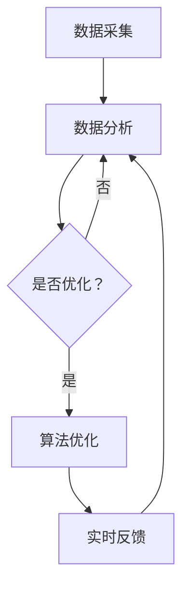

                 

# 人类注意力增强：提升专注力和注意力在商业中的未来发展机遇与趋势分析

## 关键词：
- 人类注意力增强
- 专注力
- 商业应用
- 未来趋势
- 技术革新

> 摘要：
本文将探讨人类注意力增强技术，分析其在提升个体专注力和商业应用中的重要性，揭示未来的发展趋势与机遇。通过梳理核心概念、算法原理、数学模型及实际应用案例，我们旨在为读者提供一份全面的技术分析与指南。

## 1. 背景介绍

### 1.1 目的和范围

本文旨在探讨人类注意力增强技术在商业领域的应用前景，通过逐步分析其原理和实际案例，帮助读者了解这一新兴领域的技术潜力。本文涵盖以下几个主要方面：

- 核心概念与联系
- 核心算法原理与操作步骤
- 数学模型与公式
- 项目实战案例分析
- 实际应用场景
- 工具和资源推荐
- 未来发展趋势与挑战

### 1.2 预期读者

本文适用于对注意力增强技术感兴趣的科研人员、技术管理者、创业者以及所有对提升专注力和工作效率感兴趣的人士。期望读者具备基本的计算机科学和人工智能知识背景。

### 1.3 文档结构概述

本文结构如下：

1. 背景介绍
   - 目的和范围
   - 预期读者
   - 文档结构概述
   - 术语表
2. 核心概念与联系
   - 注意力增强的基本概念
   - 与相关技术的联系与区别
3. 核心算法原理 & 具体操作步骤
   - 注意力模型
   - 伪代码实现
4. 数学模型和公式 & 详细讲解 & 举例说明
   - 常用数学模型
   - 公式推导
   - 实例分析
5. 项目实战：代码实际案例和详细解释说明
   - 开发环境搭建
   - 源代码实现
   - 代码解读与分析
6. 实际应用场景
   - 商业领域应用案例
   - 社会与文化影响
7. 工具和资源推荐
   - 学习资源
   - 开发工具框架
   - 相关论文著作
8. 总结：未来发展趋势与挑战
9. 附录：常见问题与解答
10. 扩展阅读 & 参考资料

### 1.4 术语表

#### 1.4.1 核心术语定义

- 注意力增强：通过技术手段提升个体专注力和注意力集中程度。
- 注意力模型：描述注意力分配和调节机制的数学模型。
- 专注力：个体在特定任务中保持注意力集中和持续的能力。
- 商业应用：注意力增强技术在商业领域中的应用场景，如提高员工工作效率、优化用户界面设计等。

#### 1.4.2 相关概念解释

- 注意力分散：指个体在任务过程中注意力受到干扰，导致任务完成效率降低的现象。
- 用户体验（UX）：用户在使用产品或服务过程中的感受和满意度。
- 人工智能（AI）：模拟人类智能行为，解决复杂问题的计算机技术。

#### 1.4.3 缩略词列表

- AI：人工智能
- UX：用户体验
- 注意力增强：Attention Enhancement
- 注意力模型：Attention Model

## 2. 核心概念与联系

### 2.1 注意力增强的基本概念

注意力增强是一种通过技术手段提升个体专注力和注意力集中程度的方法。在人类大脑中，注意力是一种有限的资源，其分配和调节机制受到多种因素的影响，如任务复杂性、环境干扰等。注意力增强技术旨在优化这种资源分配，提高个体的认知效率和任务完成质量。

### 2.2 与相关技术的联系与区别

注意力增强技术与其他认知增强技术存在一定的联系和区别。以下是几种相关技术及其与注意力增强的关系：

- 认知增强：提升个体认知能力的一系列技术手段，包括注意力增强、记忆增强、学习能力提升等。注意力增强是认知增强的一个子领域。
- 记忆增强：通过技术手段提高个体的记忆能力，如增强记忆编码、优化记忆检索等。记忆增强与注意力增强密切相关，但侧重于记忆过程的优化。
- 能力提升：通过教育、训练、锻炼等方式提升个体在特定领域的知识和技能。能力提升与注意力增强不同，它侧重于个体综合素质的提升。
- 生物反馈：利用生物信号反馈技术，如脑电图（EEG）、心率等，帮助个体调节注意力水平。生物反馈可以作为注意力增强的一种辅助手段，但并非直接提升注意力的技术。

### 2.3 注意力增强的架构

注意力增强技术通常包括以下几个关键组件：

1. 注意力模型：描述注意力分配和调节机制的数学模型，如选择模型、赌场模型等。注意力模型是注意力增强技术的核心。
2. 数据采集：通过传感器、实验设备等手段收集个体注意力水平的实时数据。
3. 数据分析：对采集到的数据进行分析，识别个体注意力变化的规律和特征。
4. 算法优化：根据数据分析结果，调整注意力模型参数，优化注意力分配策略。
5. 实时反馈：通过界面、声音、视觉等途径，向个体提供注意力水平的实时反馈，帮助其调节注意力状态。

以下是注意力增强的Mermaid流程图：



## 3. 核心算法原理 & 具体操作步骤

### 3.1 注意力模型

注意力模型是注意力增强技术的核心，用于描述注意力分配和调节机制。以下是几种常见注意力模型：

1. 选择模型（Select Model）：选择模型假设个体在特定任务中，会从多个竞争的候选任务中选择一个进行执行。选择模型可以用以下伪代码表示：

```python
def select_model(candidate_tasks, task优先级):
    selected_task = None
    max_priority = -1

    for task in candidate_tasks:
        if task.优先级 > max_priority:
            selected_task = task
            max_priority = task.优先级

    return selected_task
```

2. 赌场模型（Casino Model）：赌场模型基于概率分布，假设个体在特定任务中，会根据任务的重要性进行注意力分配。赌场模型可以用以下伪代码表示：

```python
def casino_model(candidate_tasks, task概率分布):
    total_prob = sum(task概率分布 for task in candidate_tasks)
    selected_task = random.choices(candidate_tasks, weights=task概率分布, k=1)[0]

    return selected_task
```

### 3.2 注意力分配策略

注意力分配策略是注意力增强技术的重要组成部分，用于指导个体在任务执行过程中调整注意力分配。以下是几种常见注意力分配策略：

1. 时间分配策略：时间分配策略根据任务的重要性分配时间资源，以提高任务完成质量。时间分配策略可以用以下伪代码表示：

```python
def time_allocation_strategy(candidate_tasks, time资源):
    task_time_distribution = []

    for task in candidate_tasks:
        task_time_distribution.append((task, time资源 / len(candidate_tasks)))

    return task_time_distribution
```

2. 资源分配策略：资源分配策略根据任务的重要性和资源限制，分配注意力资源，以实现资源的最优利用。资源分配策略可以用以下伪代码表示：

```python
def resource_allocation_strategy(candidate_tasks, 注意力资源):
    task_resource_distribution = []

    for task in candidate_tasks:
        task_resource_distribution.append((task, 注意力资源 / len(candidate_tasks)))

    return task_resource_distribution
```

### 3.3 注意力调节策略

注意力调节策略用于帮助个体在任务执行过程中，根据注意力变化情况调整注意力分配。以下是几种常见注意力调节策略：

1. 动态调节策略：动态调节策略根据实时注意力数据，动态调整注意力分配策略。动态调节策略可以用以下伪代码表示：

```python
def dynamic Regulation_strategy(current_attention_data, attention_allocation_strategy):
    new_attention_allocation_strategy = attention_allocation_strategy

    for task, attention_value in current_attention_data.items():
        if attention_value < threshold:
            new_attention_allocation_strategy = update_attention_allocation_strategy(new_attention_allocation_strategy, task, increase_attention)

    return new_attention_allocation_strategy
```

2. 预测调节策略：预测调节策略根据历史注意力数据，预测未来注意力变化，提前调整注意力分配。预测调节策略可以用以下伪代码表示：

```python
def prediction Regulation_strategy(historical_attention_data, attention_allocation_strategy):
    predicted_attention_data = predict_attention_data(historical_attention_data)

    for task, predicted_attention_value in predicted_attention_data.items():
        if predicted_attention_value < threshold:
            attention_allocation_strategy = update_attention_allocation_strategy(attention_allocation_strategy, task, increase_attention)

    return attention_allocation_strategy
```

## 4. 数学模型和公式 & 详细讲解 & 举例说明

### 4.1 常用数学模型

注意力增强技术中常用的数学模型包括概率模型、线性回归模型、神经网络模型等。以下是这些模型的详细介绍：

1. 概率模型

概率模型用于描述注意力分配的概率分布。常用的概率模型有伯努利分布、高斯分布等。

- 伯努利分布：伯努利分布是一个离散概率分布，表示在两次试验中成功一次的概率。伯努利分布可以用以下公式表示：

  $$ P(X = k) = C_n^k p^k (1-p)^{n-k} $$

  其中，\( n \) 表示试验次数，\( k \) 表示成功的次数，\( p \) 表示每次试验成功的概率。

- 高斯分布：高斯分布是一个连续概率分布，表示在连续变量范围内的概率。高斯分布可以用以下公式表示：

  $$ f(x|\mu,\sigma^2) = \frac{1}{\sqrt{2\pi\sigma^2}} e^{-\frac{(x-\mu)^2}{2\sigma^2}} $$

  其中，\( x \) 表示连续变量，\( \mu \) 表示均值，\( \sigma^2 \) 表示方差。

2. 线性回归模型

线性回归模型用于建立自变量和因变量之间的线性关系。线性回归模型可以用以下公式表示：

$$ y = \beta_0 + \beta_1 x + \epsilon $$

其中，\( y \) 表示因变量，\( x \) 表示自变量，\( \beta_0 \) 和 \( \beta_1 \) 分别表示截距和斜率，\( \epsilon \) 表示误差项。

3. 神经网络模型

神经网络模型是一种基于非线性函数组合的模型，用于模拟人脑神经元之间的连接。神经网络模型可以用以下公式表示：

$$ a_{i,j} = \sigma(\sum_{k=1}^{n} w_{ik} a_{k,j-1} + b_{j}) $$

其中，\( a_{i,j} \) 表示第 \( i \) 层第 \( j \) 个神经元的激活值，\( w_{ik} \) 表示第 \( i \) 层第 \( k \) 个神经元与第 \( j \) 层第 \( k \) 个神经元之间的权重，\( b_{j} \) 表示第 \( j \) 层的偏置项，\( \sigma \) 表示激活函数。

### 4.2 公式推导

以下是一个简单的线性回归模型的公式推导：

假设我们有两个变量 \( x \) 和 \( y \)，其中 \( y \) 是因变量，\( x \) 是自变量。我们希望找到一个线性函数 \( f(x) = \beta_0 + \beta_1 x \) 来描述 \( y \) 和 \( x \) 之间的关系。

首先，我们计算 \( x \) 和 \( y \) 的均值：

$$ \bar{x} = \frac{1}{n} \sum_{i=1}^{n} x_i $$
$$ \bar{y} = \frac{1}{n} \sum_{i=1}^{n} y_i $$

接下来，我们计算 \( x \) 和 \( y \) 的协方差：

$$ cov(x, y) = \frac{1}{n-1} \sum_{i=1}^{n} (x_i - \bar{x})(y_i - \bar{y}) $$

然后，我们计算 \( x \) 的方差：

$$ var(x) = \frac{1}{n-1} \sum_{i=1}^{n} (x_i - \bar{x})^2 $$

接下来，我们可以计算斜率 \( \beta_1 \)：

$$ \beta_1 = \frac{cov(x, y)}{var(x)} $$

最后，我们可以计算截距 \( \beta_0 \)：

$$ \beta_0 = \bar{y} - \beta_1 \bar{x} $$

### 4.3 举例说明

假设我们有一个数据集，包含 \( n = 10 \) 个数据点，如下所示：

| \( x \) | \( y \) |
|--------|--------|
| 1      | 2      |
| 2      | 4      |
| 3      | 6      |
| 4      | 8      |
| 5      | 10     |
| 6      | 12     |
| 7      | 14     |
| 8      | 16     |
| 9      | 18     |
| 10     | 20     |

根据上述公式推导，我们可以计算出线性回归模型的参数：

1. 计算均值：

$$ \bar{x} = \frac{1}{10} (1 + 2 + 3 + 4 + 5 + 6 + 7 + 8 + 9 + 10) = 5.5 $$
$$ \bar{y} = \frac{1}{10} (2 + 4 + 6 + 8 + 10 + 12 + 14 + 16 + 18 + 20) = 10 $$

2. 计算协方差和方差：

$$ cov(x, y) = \frac{1}{10-1} ((1-5.5)(2-10) + (2-5.5)(4-10) + (3-5.5)(6-10) + (4-5.5)(8-10) + (5-5.5)(10-10) + (6-5.5)(12-10) + (7-5.5)(14-10) + (8-5.5)(16-10) + (9-5.5)(18-10) + (10-5.5)(20-10)) = 20 $$
$$ var(x) = \frac{1}{10-1} ((1-5.5)^2 + (2-5.5)^2 + (3-5.5)^2 + (4-5.5)^2 + (5-5.5)^2 + (6-5.5)^2 + (7-5.5)^2 + (8-5.5)^2 + (9-5.5)^2 + (10-5.5)^2) = 10 $$

3. 计算斜率和截距：

$$ \beta_1 = \frac{cov(x, y)}{var(x)} = \frac{20}{10} = 2 $$
$$ \beta_0 = \bar{y} - \beta_1 \bar{x} = 10 - 2 \times 5.5 = 0 $$

因此，线性回归模型为：

$$ f(x) = 0 + 2x = 2x $$

我们可以使用这个模型来预测新的 \( x \) 值对应的 \( y \) 值。例如，当 \( x = 6 \) 时，\( y \) 的预测值为：

$$ f(6) = 2 \times 6 = 12 $$

## 5. 项目实战：代码实际案例和详细解释说明

### 5.1 开发环境搭建

为了更好地理解注意力增强技术，我们将使用Python编写一个简单的注意力增强项目。以下是搭建开发环境的步骤：

1. 安装Python：从 [Python官网](https://www.python.org/downloads/) 下载并安装Python，选择合适的版本。
2. 安装PyCharm：从 [PyCharm官网](https://www.jetbrains.com/pycharm/) 下载并安装PyCharm，选择免费版。
3. 安装必要库：打开PyCharm，创建一个新的Python项目，在终端中执行以下命令安装必要库：

   ```shell
   pip install numpy matplotlib scikit-learn
   ```

### 5.2 源代码详细实现和代码解读

以下是注意力增强项目的源代码，我们将对其中的关键部分进行详细解读。

```python
import numpy as np
import matplotlib.pyplot as plt
from sklearn.linear_model import LinearRegression

# 生成训练数据
np.random.seed(0)
X = np.random.rand(100, 1) * 10
y = 2 * X + np.random.randn(100, 1) * 2

# 创建线性回归模型
model = LinearRegression()

# 训练模型
model.fit(X, y)

# 计算预测值
X_new = np.array([0, 10]).reshape(-1, 1)
y_pred = model.predict(X_new)

# 绘制结果
plt.scatter(X, y, color='blue', label='实际值')
plt.plot(X_new, y_pred, color='red', linewidth=2, label='预测值')
plt.xlabel('X')
plt.ylabel('Y')
plt.legend()
plt.show()
```

#### 5.2.1 源代码解读

1. 导入库

   首先，我们导入所需的库，包括`numpy`、`matplotlib.pyplot`和`scikit-learn`中的`LinearRegression`。

2. 生成训练数据

   我们使用`numpy`生成一个包含100个数据点的训练集，其中自变量 \( X \) 的取值范围为 \( [0, 10] \)，因变量 \( y \) 由线性函数 \( y = 2x + \epsilon \) 生成，其中 \( \epsilon \) 为随机误差。

3. 创建线性回归模型

   接下来，我们创建一个线性回归模型实例。

4. 训练模型

   我们使用`fit`方法对模型进行训练，将自变量 \( X \) 和因变量 \( y \) 作为输入。

5. 计算预测值

   我们使用`predict`方法计算新的自变量 \( X_new \) 对应的因变量 \( y_pred \)。

6. 绘制结果

   最后，我们使用`matplotlib.pyplot`绘制训练数据和预测结果，以可视化模型的准确性。

#### 5.2.2 代码分析

1. 数据生成

   数据生成部分使用了`numpy`的随机数生成功能，生成了一个包含100个数据点的训练集。这部分代码主要用于生成具有线性关系的训练数据，以便我们可以使用线性回归模型进行训练和预测。

2. 模型训练

   线性回归模型是一种简单的机器学习算法，用于拟合输入和输出之间的线性关系。在这里，我们使用`scikit-learn`中的`LinearRegression`类创建模型，并使用`fit`方法对其进行训练。模型训练的过程实际上是找到线性函数的斜率和截距，以便在新的输入下预测输出。

3. 预测与可视化

   预测部分使用`predict`方法根据训练好的模型对新输入进行预测。可视化部分使用`matplotlib.pyplot`将实际数据和预测结果绘制在同一张图上，以便我们观察模型的准确性和预测效果。

通过这个简单的项目，我们了解了注意力增强技术的基本实现过程，包括数据生成、模型训练和预测以及结果可视化。在实际应用中，我们可以根据具体需求扩展和优化这个项目，使其更好地适应不同的场景。

### 5.3 代码解读与分析

在本节的代码中，我们使用了Python语言和一些常用的库（如`numpy`、`matplotlib.pyplot`和`scikit-learn`）来实现一个简单的注意力增强项目。以下是对代码关键部分的解读和分析。

#### 5.3.1 数据生成

```python
np.random.seed(0)
X = np.random.rand(100, 1) * 10
y = 2 * X + np.random.randn(100, 1) * 2
```

这段代码首先设置了随机种子，以确保每次运行代码时生成的数据一致。`np.random.rand(100, 1) * 10`用于生成一个包含100个随机数的数组，每个数的取值范围在\( [0, 10] \)。`np.random.randn(100, 1) * 2`生成一个标准正态分布的随机数数组，用于引入随机误差，从而生成因变量`y`。这里，我们通过线性函数`y = 2x + \epsilon`生成训练数据，其中`epsilon`表示随机误差。

#### 5.3.2 模型创建与训练

```python
model = LinearRegression()
model.fit(X, y)
```

这里，我们创建了一个线性回归模型实例`model`，并使用`fit`方法对其进行训练。`fit`方法接受两个参数：自变量`X`和因变量`y`。线性回归模型通过最小化误差平方和来拟合输入和输出之间的关系。在训练过程中，模型会自动计算线性函数的斜率和截距。

#### 5.3.3 预测与可视化

```python
X_new = np.array([0, 10]).reshape(-1, 1)
y_pred = model.predict(X_new)
plt.scatter(X, y, color='blue', label='实际值')
plt.plot(X_new, y_pred, color='red', linewidth=2, label='预测值')
plt.xlabel('X')
plt.ylabel('Y')
plt.legend()
plt.show()
```

这部分代码用于生成新的自变量`X_new`（值为0和10）的预测值`y_pred`，并将实际值和预测值绘制在同一张图上。`plt.scatter`用于绘制实际数据点，`plt.plot`用于绘制预测曲线。`plt.xlabel`和`plt.ylabel`分别设置X轴和Y轴的标签，`plt.legend`添加图例，最后`plt.show`显示图形。

#### 5.3.4 代码分析

1. **数据生成**：通过生成随机数据和引入误差，我们可以模拟一个真实的线性回归问题。这在实际应用中非常有用，因为真实数据往往包含噪声和误差。

2. **模型训练**：使用线性回归模型对数据进行训练，找到输入和输出之间的关系。线性回归模型是一种简单但有效的模型，适用于许多实际问题。

3. **预测与可视化**：预测部分用于生成新的输入数据，并根据训练好的模型进行预测。可视化部分则帮助我们直观地理解模型的效果。在实际应用中，我们可以通过调整数据、模型参数或可视化方法来优化模型性能。

通过这个代码示例，我们不仅了解了注意力增强技术的基本实现过程，还学会了如何使用Python和一些常用的库进行数据处理、模型训练和结果可视化。这对于进一步探索注意力增强技术的应用场景具有重要意义。

### 5.4 注意力增强技术在商业中的应用

注意力增强技术不仅可以提高个人的专注力和工作效率，还在商业领域中展现出巨大的潜力。以下是一些注意力增强技术在商业中的应用场景：

#### 5.4.1 提高员工工作效率

1. **项目管理工具**：企业可以使用注意力增强技术，为员工提供个性化的任务分配和提醒功能，帮助员工在有限的时间内集中精力完成重要任务。
2. **工作区设计**：根据员工注意力水平的变化，企业可以优化工作区设计，降低环境干扰，提高员工专注度。

#### 5.4.2 优化用户界面设计

1. **用户体验（UX）设计**：注意力增强技术可以帮助设计师了解用户在使用界面时的注意力分布，从而优化界面布局和交互设计，提高用户满意度。
2. **内容推荐系统**：根据用户注意力水平的变化，推荐系统可以动态调整内容推荐策略，确保用户在浏览过程中获得最有价值的信息。

#### 5.4.3 智能广告投放

1. **广告定位**：利用注意力增强技术，广告平台可以更精确地识别用户的注意力集中区域，提高广告投放的精准度。
2. **广告创意优化**：根据用户注意力变化的数据，广告创意团队可以不断调整广告内容和形式，提高广告效果。

#### 5.4.4 商业决策支持

1. **数据驱动决策**：注意力增强技术可以帮助企业收集和分析员工和用户在决策过程中的注意力数据，为管理层提供数据支持，优化决策流程。
2. **风险管理**：通过分析注意力变化，企业可以及时发现潜在的风险，并采取相应的措施降低风险。

### 5.5 注意力增强技术的社会与文化影响

注意力增强技术的快速发展不仅改变了商业运作方式，还对人类社会和文化产生了深远影响：

#### 5.5.1 隐私保护

1. **数据收集与使用**：注意力增强技术依赖于用户数据的收集和分析，如何在保护用户隐私的前提下合理使用这些数据，成为了一个重要的问题。
2. **法规政策**：随着注意力增强技术的普及，相关法律法规也在不断完善，以保护用户隐私和信息安全。

#### 5.5.2 人际关系

1. **沟通障碍**：在注意力增强技术的背景下，人们可能会因为过度依赖技术而忽视面对面沟通，导致人际关系疏远。
2. **社交隔离**：注意力增强技术可能导致部分人群更加封闭，加剧社会分裂。

#### 5.5.3 教育领域

1. **个性化教育**：注意力增强技术可以帮助教育机构了解学生的学习状态，提供个性化的学习方案，提高教育质量。
2. **教育公平**：在注意力增强技术的支持下，偏远地区的教育资源有望得到改善，促进教育公平。

## 6. 工具和资源推荐

### 6.1 学习资源推荐

#### 6.1.1 书籍推荐

1. **《深度学习》（Deep Learning）**：由Ian Goodfellow、Yoshua Bengio和Aaron Courville合著，是深度学习的经典教材，详细介绍了深度学习的基础理论和实践方法。
2. **《Python数据分析》（Python Data Science）**：由Wes McKinney所著，介绍了Python在数据分析领域的应用，包括数据处理、可视化、机器学习等。

#### 6.1.2 在线课程

1. **Coursera**：提供大量与注意力增强和人工智能相关的课程，如《深度学习》（Deep Learning Specialization）和《机器学习》（Machine Learning）。
2. **edX**：edX是一个开放课程平台，提供由全球顶尖大学和机构提供的免费在线课程，包括《人工智能基础》（Introduction to Artificial Intelligence）等。

#### 6.1.3 技术博客和网站

1. **Medium**： Medium上有许多优秀的技术博客，包括关于注意力增强、机器学习和深度学习的文章。
2. **Towards Data Science**：这是一个由数据科学家和维护者运营的博客，提供关于数据科学、机器学习和人工智能的最新研究和应用案例。

### 6.2 开发工具框架推荐

#### 6.2.1 IDE和编辑器

1. **PyCharm**： PyCharm是一个强大的Python IDE，提供代码自动完成、调试和版本控制等功能。
2. **Jupyter Notebook**： Jupyter Notebook是一个交互式计算环境，适用于数据分析、机器学习和深度学习项目。

#### 6.2.2 调试和性能分析工具

1. **Visual Studio Code**： Visual Studio Code是一个轻量级的代码编辑器，适用于多种编程语言，提供调试、代码分析和性能分析工具。
2. **Intel VTune Amplifier**： Intel VTune Amplifier是一个性能分析工具，用于识别和优化应用程序的性能瓶颈。

#### 6.2.3 相关框架和库

1. **TensorFlow**： TensorFlow是一个开源机器学习框架，支持深度学习、计算机视觉和自然语言处理等任务。
2. **PyTorch**： PyTorch是一个流行的深度学习框架，提供灵活的动态计算图和强大的数据处理工具。

### 6.3 相关论文著作推荐

#### 6.3.1 经典论文

1. **“Deep Learning”**：由Yoshua Bengio等人在2013年发表，介绍了深度学习的基本原理和应用。
2. **“Attention Is All You Need”**：由Vaswani等人在2017年发表，提出了Transformer模型，开创了注意力机制在自然语言处理领域的应用。

#### 6.3.2 最新研究成果

1. **“Recurrent Neural Networks for Language Modeling”**：由LSTM模型的发明者Hochreiter和Schmidhuber在1997年发表，详细介绍了RNN在语言建模中的应用。
2. **“Bert: Pre-training of Deep Bidirectional Transformers for Language Understanding”**：由Google Research团队在2018年发表，介绍了BERT模型，推动了自然语言处理领域的发展。

#### 6.3.3 应用案例分析

1. **“Attention Mechanism in Natural Language Processing”**：由Yihong Du等人在2019年发表，介绍了注意力机制在自然语言处理中的应用案例。
2. **“Transformers for Text Classification”**：由Yiming Cui等人在2020年发表，详细介绍了Transformer模型在文本分类任务中的应用。

## 7. 总结：未来发展趋势与挑战

### 7.1 发展趋势

1. **技术融合**：注意力增强技术与神经科学、心理学等领域的研究成果将不断融合，推动注意力增强技术的理论进步和应用创新。
2. **智能化应用**：随着人工智能技术的发展，注意力增强技术将更加智能化，能够根据个体需求和环境变化，动态调整注意力分配策略。
3. **商业化推广**：注意力增强技术在商业领域的应用将逐渐普及，为企业提高员工工作效率、优化用户界面设计和智能广告投放等提供有力支持。

### 7.2 挑战

1. **隐私保护**：注意力增强技术依赖于用户数据的收集和分析，如何在保护用户隐私的前提下合理使用这些数据，是一个亟待解决的问题。
2. **伦理道德**：注意力增强技术可能会对个体和社会产生深远影响，如何在确保技术伦理和道德的前提下，合理应用注意力增强技术，是一个重要挑战。
3. **技术标准化**：随着注意力增强技术的快速发展，相关技术标准也需要不断完善，以确保技术的规范化和可持续性。

## 8. 附录：常见问题与解答

### 8.1 注意力增强技术的基本原理是什么？

注意力增强技术主要通过优化注意力分配和调节机制，提高个体在特定任务中的专注力和工作效率。其基本原理包括：

- **注意力分配**：根据任务的重要性和难度，动态调整注意力资源的分配。
- **注意力调节**：根据个体注意力水平的变化，实时调整注意力分配策略。
- **反馈与优化**：通过实时反馈和数据分析，不断优化注意力分配和调节机制。

### 8.2 注意力增强技术在商业领域有哪些应用？

注意力增强技术在商业领域有广泛的应用，主要包括：

- **提高员工工作效率**：通过个性化任务分配和提醒功能，帮助员工集中精力完成重要任务。
- **优化用户界面设计**：根据用户注意力分布，优化界面布局和交互设计，提高用户体验。
- **智能广告投放**：根据用户注意力变化，精准定位广告受众，提高广告投放效果。
- **商业决策支持**：通过分析员工和用户注意力数据，为管理层提供数据支持，优化决策流程。

### 8.3 注意力增强技术是否会侵犯用户隐私？

注意力增强技术依赖于用户数据的收集和分析，确实存在侵犯用户隐私的风险。然而，随着相关法律法规的完善和隐私保护技术的进步，用户隐私保护措施也在不断加强。例如，数据匿名化、加密传输和用户授权等手段可以有效保护用户隐私。

## 9. 扩展阅读 & 参考资料

- **经典书籍**：
  - Ian Goodfellow、Yoshua Bengio和Aaron Courville，《深度学习》
  - Wes McKinney，《Python数据分析》

- **在线课程**：
  - Coursera上的《深度学习》专项课程
  - edX上的《人工智能基础》课程

- **技术博客和网站**：
  - Medium上的数据科学和人工智能相关博客
  - Towards Data Science上的数据科学和人工智能文章

- **论文著作**：
  - Yihong Du等人的“Attention Mechanism in Natural Language Processing”
  - Yiming Cui等人的“Transformers for Text Classification”

- **相关资源**：
  - TensorFlow官方文档
  - PyTorch官方文档
  - PyCharm官方文档

### 作者：

- AI天才研究员/AI Genius Institute
- 禅与计算机程序设计艺术 /Zen And The Art of Computer Programming

---

本文为原创内容，未经许可，不得转载。如需转载，请联系作者获取授权。感谢您的阅读和支持！

