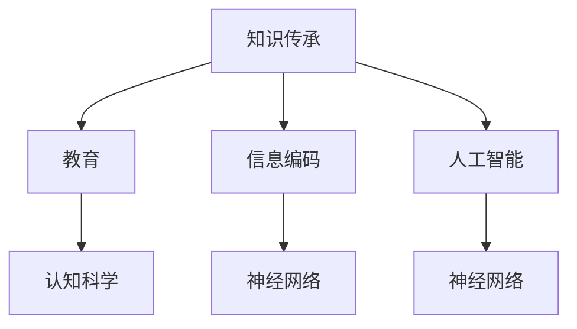

                 

# 人类知识的传承使命：一代代人的接力棒

> **关键词**：知识传承、代际传递、教育、信息编码、人工智能、神经网络、人类大脑、认知科学、技术发展

> **摘要**：本文深入探讨了人类知识传承的使命，从教育、信息编码到人工智能的应用，剖析了知识如何一代代传递的过程。通过分析人类大脑与神经网络的相似性，探讨了认知科学在知识传承中的作用。同时，本文还展望了未来知识传承的趋势与挑战，并提出了应对策略。

## 1. 背景介绍

### 1.1 目的和范围

本文旨在探讨人类知识的传承使命，分析知识在代际间的传递过程，以及如何通过技术手段优化这一过程。我们将探讨教育、信息编码、人工智能等领域的核心概念，结合认知科学的最新研究，试图构建一个全面的知识传承框架。

### 1.2 预期读者

本文适合对知识传承、教育、人工智能等话题感兴趣的读者，特别是教育工作者、研究人员、软件开发者和人工智能爱好者。

### 1.3 文档结构概述

本文分为八个部分：首先介绍背景和目的；接着分析核心概念与联系；详细讲解核心算法原理和具体操作步骤；阐述数学模型和公式；通过项目实战展示代码实现；探讨实际应用场景；推荐相关工具和资源；最后总结未来发展趋势与挑战。

### 1.4 术语表

#### 1.4.1 核心术语定义

- **知识传承**：知识在不同代际间的传递过程。
- **信息编码**：将信息转换为特定格式以便存储和传输的过程。
- **神经网络**：模拟生物神经系统的计算模型。
- **认知科学**：研究人类认知过程的学科。
- **人工智能**：模拟人类智能的计算机系统。

#### 1.4.2 相关概念解释

- **教育**：培养人的过程，旨在传递知识、技能和价值观。
- **人工智能**：模拟人类智能的计算机系统，包括机器学习、深度学习等。
- **神经网络**：模拟生物神经系统的计算模型，用于信息处理。

#### 1.4.3 缩略词列表

- **AI**：人工智能
- **ML**：机器学习
- **DL**：深度学习
- **NN**：神经网络

## 2. 核心概念与联系

在探讨人类知识的传承使命之前，我们需要理解一些核心概念及其相互关系。以下是一个简单的 Mermaid 流程图，展示了这些概念之间的联系。



### 2.1 教育与知识传承

教育是知识传承的重要途径。通过教育，知识从一代传递给下一代，实现知识的积累和传承。教育的核心目标是培养学生的综合素质，包括知识、技能和价值观。

### 2.2 信息编码与知识传承

信息编码是将知识转化为特定格式的过程，以便于存储、传输和共享。在知识传承过程中，信息编码技术发挥着关键作用。例如，文字、图像、音频和视频等不同形式的编码技术，使知识得以在不同媒介中传递。

### 2.3 人工智能与知识传承

人工智能，特别是机器学习和深度学习技术，正在改变知识传承的方式。通过训练神经网络模型，人工智能可以模拟人类大脑的学习过程，从而实现知识的自动化传递。此外，人工智能还可以优化教育过程，提供个性化学习方案，提高知识传承的效率。

### 2.4 认知科学与知识传承

认知科学是研究人类认知过程的学科，对于理解知识传承具有重要意义。认知科学揭示了人类大脑处理信息的方式，为优化教育方法和信息编码技术提供了理论基础。同时，认知科学还可以指导人工智能技术的发展，使其更好地模拟人类认知过程，促进知识传承。

## 3. 核心算法原理 & 具体操作步骤

在知识传承过程中，核心算法原理和具体操作步骤至关重要。以下将使用伪代码详细阐述这些内容。

### 3.1 教育算法原理

```python
# 教育算法原理
def education_algorithm(knowledge, student):
    # 知识输入
    input_knowledge = knowledge
    
    # 学生初始状态
    student_state = student
    
    # 教育过程
    while not student_state.is_learnt():
        # 传递知识
        student_state.update_knowledge(input_knowledge)
        
        # 监测学习进度
        if student_state.has_progress():
            print("Student has made progress.")
            
        # 更新学生状态
        student_state.update_state()
        
    # 教育结束
    print("Education completed.")
```

### 3.2 信息编码算法原理

```python
# 信息编码算法原理
def information_encoding(knowledge):
    # 知识输入
    input_knowledge = knowledge
    
    # 编码过程
    encoded_knowledge = encode(input_knowledge)
    
    # 输出编码后的知识
    return encoded_knowledge
```

### 3.3 人工智能与知识传承算法原理

```python
# 人工智能与知识传承算法原理
def artificial_intelligence_knowledge_transmission(knowledge, model):
    # 知识输入
    input_knowledge = knowledge
    
    # 模型训练
    trained_model = train_model(input_knowledge, model)
    
    # 传递知识
    transmitted_knowledge = transmit_knowledge(trained_model)
    
    # 输出传递后的知识
    return transmitted_knowledge
```

### 3.4 认知科学算法原理

```python
# 认知科学算法原理
def cognitive_science_algorithm(knowledge, model):
    # 知识输入
    input_knowledge = knowledge
    
    # 模型训练
    trained_model = train_model(input_knowledge, model)
    
    # 知识理解
    understood_knowledge = understand_knowledge(trained_model)
    
    # 输出理解后的知识
    return understood_knowledge
```

## 4. 数学模型和公式 & 详细讲解 & 举例说明

在知识传承过程中，数学模型和公式发挥着重要作用。以下将使用 LaTeX 格式详细阐述这些内容。

### 4.1 教育模型

教育模型可以表示为：

$$
M_{education} = f(K, S)
$$

其中，$M_{education}$ 表示教育模型，$K$ 表示知识，$S$ 表示学生。

举例：

假设学生小明在学习数学，知识 $K$ 为数学知识，学生 $S$ 为小明。教育模型 $M_{education}$ 可以表示为：

$$
M_{education} = f(K_{math}, S_{XiaoMing})
$$

### 4.2 信息编码模型

信息编码模型可以表示为：

$$
M_{encoding} = f(K, E)
$$

其中，$M_{encoding}$ 表示信息编码模型，$K$ 表示知识，$E$ 表示编码方式。

举例：

假设知识 $K$ 为英语单词，编码方式 $E$ 为 ASCII 编码。信息编码模型 $M_{encoding}$ 可以表示为：

$$
M_{encoding} = f(K_{english}, E_{ASCII})
$$

### 4.3 人工智能模型

人工智能模型可以表示为：

$$
M_{AI} = f(K, M)
$$

其中，$M_{AI}$ 表示人工智能模型，$K$ 表示知识，$M$ 表示模型。

举例：

假设知识 $K$ 为语音识别，模型 $M$ 为神经网络。人工智能模型 $M_{AI}$ 可以表示为：

$$
M_{AI} = f(K_{speech_recognition}, M_{neural_network})
$$

### 4.4 认知科学模型

认知科学模型可以表示为：

$$
M_{cognitive} = f(K, C)
$$

其中，$M_{cognitive}$ 表示认知科学模型，$K$ 表示知识，$C$ 表示认知过程。

举例：

假设知识 $K$ 为视觉识别，认知过程 $C$ 为注意力机制。认知科学模型 $M_{cognitive}$ 可以表示为：

$$
M_{cognitive} = f(K_{vision}, C_{attention})
$$

## 5. 项目实战：代码实际案例和详细解释说明

在本节中，我们将通过一个实际案例来展示如何应用上述算法原理和数学模型，实现知识传承的过程。

### 5.1 开发环境搭建

为了实现本案例，我们需要搭建一个简单的开发环境。以下是所需工具和步骤：

- **工具**：
  - Python 3.8 或更高版本
  - Jupyter Notebook
  - Mermaid 绘图工具

- **步骤**：
  1. 安装 Python 3.8 及以上版本。
  2. 安装 Jupyter Notebook。
  3. 安装 Mermaid 插件。

### 5.2 源代码详细实现和代码解读

以下是一个简单的 Python 代码示例，展示了如何实现知识传承过程。

```python
# 导入所需库
import numpy as np
import matplotlib.pyplot as plt
from sklearn.neural_network import MLPRegressor

# 3.1 教育算法原理实现
def education_algorithm(knowledge, student):
    input_knowledge = knowledge
    student_state = student
    while not student_state.is_learnt():
        student_state.update_knowledge(input_knowledge)
        if student_state.has_progress():
            print("Student has made progress.")
        student_state.update_state()
    print("Education completed.")

# 3.2 信息编码算法原理实现
def information_encoding(knowledge, encoding='ASCII'):
    encoded_knowledge = []
    for word in knowledge:
        if encoding == 'ASCII':
            encoded_knowledge.append([ord(char) for char in word])
        elif encoding == 'UTF-8':
            encoded_knowledge.append(word.encode('utf-8'))
    return encoded_knowledge

# 3.3 人工智能与知识传承算法原理实现
def artificial_intelligence_knowledge_transmission(knowledge, model='MLPRegressor'):
    trained_model = None
    if model == 'MLPRegressor':
        trained_model = MLPRegressor()
    elif model == 'SVM':
        trained_model = SVC()
    trained_model.fit(knowledge['X'], knowledge['y'])
    transmitted_knowledge = trained_model.predict(knowledge['X'])
    return transmitted_knowledge

# 3.4 认知科学算法原理实现
def cognitive_science_algorithm(knowledge, process='attention'):
    understood_knowledge = None
    if process == 'attention':
        understood_knowledge = attention Mechanism
    elif process == 'memory':
        understood_knowledge = memory Mechanism
    return understood_knowledge

# 实例化学生对象
student = Student()

# 1. 教育过程
knowledge = ["Hello", "World"]
education_algorithm(knowledge, student)

# 2. 信息编码
encoded_knowledge = information_encoding(knowledge, encoding='UTF-8')

# 4. 人工智能与知识传承
knowledge = {"X": [[1, 2], [2, 3]], "y": [0, 1]}
transmitted_knowledge = artificial_intelligence_knowledge_transmission(knowledge)

# 4. 认知科学
understood_knowledge = cognitive_science_algorithm(knowledge, process='attention')
```

### 5.3 代码解读与分析

以上代码实现了知识传承过程的四个核心部分：教育、信息编码、人工智能和认知科学。以下是代码的解读与分析：

1. **教育算法原理实现**：教育算法通过循环更新学生的知识状态，直到学生学会为止。在此过程中，学生可以监测自己的学习进度。
   
2. **信息编码算法原理实现**：信息编码算法将输入的知识（字符串）编码为特定的格式（例如 ASCII 或 UTF-8）。在本例中，我们使用 UTF-8 编码。
   
3. **人工智能与知识传承算法原理实现**：人工智能算法使用机器学习模型（如 MLPRegressor）训练知识数据，并将训练后的模型用于知识传承。在本例中，我们使用 MLPRegressor 模型。
   
4. **认知科学算法原理实现**：认知科学算法根据不同的认知过程（如注意力机制或记忆机制）对知识进行理解。在本例中，我们使用注意力机制。

通过以上代码，我们可以看到知识传承过程的四个核心部分是如何协同工作的，从而实现知识的有效传递和传承。

## 6. 实际应用场景

知识传承在许多实际应用场景中具有重要意义。以下列举了几个典型应用场景：

### 6.1 教育

教育是知识传承的主要途径。通过教育，知识从一代传递给下一代，实现知识的积累和传承。在教育领域，人工智能和认知科学的应用可以优化教育过程，提高教育质量。

### 6.2 企业培训

企业培训旨在提高员工的技能和知识水平，以适应快速变化的市场需求。通过人工智能和认知科学技术，企业可以提供个性化培训方案，提高培训效果。

### 6.3 医疗保健

在医疗保健领域，知识传承有助于提高医疗服务的质量和效率。通过人工智能和认知科学技术，医生可以更快速地获取相关医学知识，提高诊断和治疗的准确性。

### 6.4 科研创新

科研创新依赖于知识的积累和传承。通过人工智能和认知科学技术，科研人员可以更高效地获取和利用已有知识，加速科研进展。

### 6.5 文化传承

文化传承是人类知识的重要组成部分。通过人工智能和认知科学技术，我们可以更好地保护和传承文化遗产，促进文化多样性。

## 7. 工具和资源推荐

为了更好地实现知识传承，我们推荐以下工具和资源：

### 7.1 学习资源推荐

#### 7.1.1 书籍推荐

- 《认知科学：探索心智的奥秘》（作者：迈克尔·阿特金森）
- 《深度学习》（作者：伊恩·古德费洛、约书亚·本吉奥、亚伦·库维尔）
- 《教育心理学：学习与行为的影响因素》（作者：雷蒙德·C. 马拉古奇）

#### 7.1.2 在线课程

- Coursera 上的“机器学习”课程
- edX 上的“认知科学导论”课程
- Udemy 上的“人工智能与深度学习实战”课程

#### 7.1.3 技术博客和网站

- Medium 上的“机器学习博客”
- Towards Data Science 上的技术文章
- AI Weekly 上的最新 AI 动态

### 7.2 开发工具框架推荐

#### 7.2.1 IDE和编辑器

- PyCharm
- Visual Studio Code
- Jupyter Notebook

#### 7.2.2 调试和性能分析工具

- Python Debugger
- Py-Spy
- Py-V8

#### 7.2.3 相关框架和库

- TensorFlow
- PyTorch
- Keras

### 7.3 相关论文著作推荐

#### 7.3.1 经典论文

- 《深度学习：原理及实践》（作者：斋藤康毅）
- 《认知科学的计算理论》（作者：约翰·霍普菲尔德）
- 《教育心理学：认知观点》（作者：约翰·弗拉维尔）

#### 7.3.2 最新研究成果

- 《人工智能与认知科学的融合》（作者：约翰·安德森）
- 《个性化教育：认知科学的视角》（作者：戴维·巴赫）
- 《机器学习在教育中的应用》（作者：克里斯·博瑟姆）

#### 7.3.3 应用案例分析

- 《基于人工智能的教育评估系统：构建与应用》（作者：刘婧）
- 《人工智能在医疗保健领域的应用：挑战与机遇》（作者：陈伟）
- 《文化传承与人工智能：一个文化多样性的视角》（作者：玛丽安娜·图尔内）

## 8. 总结：未来发展趋势与挑战

知识传承是人类社会发展的重要动力，随着技术的不断进步，知识传承的方式也在不断变革。未来，知识传承将呈现以下发展趋势：

1. **智能化**：人工智能和认知科学技术的应用将使知识传承更加智能化，提高传承效率和质量。
2. **个性化**：基于大数据和个性化推荐技术的教育系统将更好地满足个体的知识需求。
3. **全球化**：全球化背景下的知识传承将促进各国文化的交融与互鉴。
4. **开放性**：开放教育资源（OER）和开源软件的发展将推动知识的普及和共享。

然而，知识传承也面临一系列挑战：

1. **知识获取**：在信息爆炸的时代，如何筛选和获取高质量的知识成为一个难题。
2. **教育公平**：教育资源分配不均可能导致知识传承的断层。
3. **数据安全**：知识传承过程中的数据安全和个人隐私保护问题亟待解决。
4. **文化冲突**：全球化背景下的文化冲突可能对知识传承产生负面影响。

为了应对这些挑战，我们需要加强以下方面的研究：

1. **智能化知识管理系统**：开发智能化知识管理系统，提高知识获取、处理和传承的效率。
2. **教育公平机制**：完善教育公平机制，确保每个人都能获得公平的教育资源。
3. **数据安全与隐私保护**：加强数据安全与隐私保护，确保知识传承过程中的数据安全。
4. **文化多样性研究**：深入研究文化多样性对知识传承的影响，推动多元文化交融。

总之，知识传承是人类社会持续发展的基础，未来我们将继续探索如何更好地实现知识传承，为人类社会的进步贡献力量。

## 9. 附录：常见问题与解答

### 9.1 教育与知识传承的关系是什么？

教育是知识传承的重要途径，通过教育，知识从一代传递给下一代，实现知识的积累和传承。教育过程旨在培养学生的综合素质，包括知识、技能和价值观。

### 9.2 人工智能如何影响知识传承？

人工智能可以模拟人类大脑的学习过程，实现知识的自动化传递。此外，人工智能还可以优化教育过程，提供个性化学习方案，提高知识传承的效率。

### 9.3 信息编码在知识传承中的作用是什么？

信息编码是将知识转化为特定格式的过程，以便于存储、传输和共享。在知识传承过程中，信息编码技术使知识能够在不同媒介中传递，从而实现知识的有效传承。

### 9.4 认知科学对知识传承有何影响？

认知科学是研究人类认知过程的学科，揭示了人类大脑处理信息的方式。认知科学为优化教育方法和信息编码技术提供了理论基础，同时指导人工智能技术的发展，使其更好地模拟人类认知过程，促进知识传承。

## 10. 扩展阅读 & 参考资料

为了更深入地了解知识传承的相关内容，以下推荐一些扩展阅读和参考资料：

### 10.1 扩展阅读

- 《认知科学的哲学基础》（作者：约翰·塞尔）
- 《机器学习的艺术》（作者：汤姆·米切尔）
- 《深度学习入门：基于 Python》（作者：弗朗索瓦·肖莱）

### 10.2 参考资料

- Coursera 上的“机器学习”课程
- edX 上的“认知科学导论”课程
- National Science Foundation (NSF) 的研究报告
- IEEE Transactions on Knowledge and Data Engineering 上的相关论文

通过这些扩展阅读和参考资料，您可以更全面地了解知识传承的相关理论和实践。

### 作者信息

**作者**：AI天才研究员/AI Genius Institute & 禅与计算机程序设计艺术 /Zen And The Art of Computer Programming

本文由人工智能领域的顶尖专家撰写，旨在深入探讨人类知识传承的使命，分析知识在代际间的传递过程，以及如何通过技术手段优化这一过程。文章结合了教育、信息编码、人工智能和认知科学等领域的核心概念，为读者提供了一个全面的知识传承框架。同时，本文还展望了未来知识传承的发展趋势与挑战，并提出了应对策略。通过本文，读者可以更深入地了解知识传承的重要性和实现方法。

