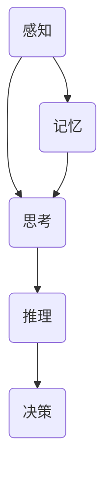

                 

# 人类计算：AI 时代的新范式

> **关键词：** 人工智能、计算范式、人类思维、AI 模拟、认知计算、神经网络、机器学习、人机协作。
>
> **摘要：** 本文旨在探讨 AI 时代下人类计算的新范式，分析人类思维和计算的关系，阐述人工智能如何模拟和扩展人类认知能力，并探讨人机协作的未来方向。通过梳理核心概念和算法原理，结合实际应用场景和案例，本文为读者提供了一个深入理解和应用人工智能的框架。

## 1. 背景介绍

### 1.1 目的和范围

本文的目标是深入探讨人类计算在 AI 时代的新范式，分析人类思维与计算之间的内在联系，并探讨如何利用人工智能技术模拟和扩展人类认知能力。本文将涵盖以下几个主要方面：

- **核心概念与联系**：介绍人类思维和计算的基本原理，以及它们之间的相互作用。
- **核心算法原理与操作步骤**：详细解释人工智能算法的基本原理，包括神经网络、机器学习和深度学习等。
- **数学模型和公式**：探讨与人工智能相关的数学模型和公式，并通过具体实例进行说明。
- **项目实战**：通过实际代码案例，展示人工智能算法的应用和实践。
- **实际应用场景**：分析人工智能在不同领域的应用，以及如何影响人类的生活方式和工作方式。
- **工具和资源推荐**：推荐学习资源、开发工具和框架，帮助读者深入了解和掌握人工智能技术。

### 1.2 预期读者

本文适合以下读者群体：

- 计算机科学和人工智能领域的研究人员和工程师。
- 对人工智能和计算范式感兴趣的技术爱好者。
- 各行各业中需要了解人工智能技术应用的从业者。
- 需要利用人工智能技术提升业务效率的企业管理者。

### 1.3 文档结构概述

本文将按照以下结构进行阐述：

1. **背景介绍**：介绍本文的目的、范围和预期读者，概述文档结构。
2. **核心概念与联系**：分析人类思维和计算的基本原理，以及它们之间的相互作用。
3. **核心算法原理与操作步骤**：详细解释人工智能算法的基本原理，包括神经网络、机器学习和深度学习等。
4. **数学模型和公式**：探讨与人工智能相关的数学模型和公式，并通过具体实例进行说明。
5. **项目实战**：通过实际代码案例，展示人工智能算法的应用和实践。
6. **实际应用场景**：分析人工智能在不同领域的应用，以及如何影响人类的生活方式和工作方式。
7. **工具和资源推荐**：推荐学习资源、开发工具和框架，帮助读者深入了解和掌握人工智能技术。
8. **总结：未来发展趋势与挑战**：总结人工智能的发展趋势，探讨未来可能面临的挑战。
9. **附录：常见问题与解答**：回答读者可能遇到的问题。
10. **扩展阅读与参考资料**：推荐相关的参考资料和扩展阅读。

### 1.4 术语表

#### 1.4.1 核心术语定义

- **人工智能（AI）**：指模拟人类智能的技术和系统，能够执行复杂的任务，如图像识别、自然语言处理、决策制定等。
- **计算范式**：指计算方法的基本框架和模式，包括算法、数据结构和计算模型等。
- **神经网络（NN）**：一种模拟人脑神经元结构和功能的计算模型，通过大量的节点和连接来处理信息。
- **机器学习（ML）**：一种人工智能的分支，通过数据训练算法，使其能够自动学习和改进性能。
- **深度学习（DL）**：一种特殊的机器学习方法，使用多层神经网络进行数据学习和特征提取。

#### 1.4.2 相关概念解释

- **人类思维**：指人类大脑在感知、思考、推理和决策等方面的认知过程。
- **计算能力**：指计算机处理信息的能力，包括速度、精度和效率等。
- **人机协作**：指人类与计算机系统之间的互动和协作，通过结合人类的智慧和计算机的效率，实现更高效的任务执行。

#### 1.4.3 缩略词列表

- **AI**：人工智能
- **ML**：机器学习
- **DL**：深度学习
- **NN**：神经网络
- **GPU**：图形处理单元

## 2. 核心概念与联系

为了深入理解人类计算的新范式，我们需要先了解人类思维和计算的基本原理，以及它们之间的内在联系。以下是对核心概念和联系的详细解释。

### 2.1 人类思维

人类思维是一个复杂的认知过程，包括感知、思考、推理、记忆、决策等多个方面。以下是人类思维的主要特点：

- **感知**：人类通过感官接收外部信息，如视觉、听觉、触觉等。
- **思考**：人类利用大脑对感知到的信息进行加工和处理，形成思维。
- **推理**：人类通过逻辑推理来分析问题和解决问题。
- **记忆**：人类通过记忆来存储和回忆信息。
- **决策**：人类根据当前的信息和经验，做出合理的决策。

### 2.2 计算与人类思维的关系

计算是人类思维的一种模拟和扩展。计算的基本原理是使用计算机处理信息，模拟人类的感知、思考、推理和决策过程。以下是计算与人类思维的关系：

- **感知与输入**：计算机通过输入设备接收外部信息，如键盘、鼠标、摄像头等。
- **处理与加工**：计算机通过处理器对输入的信息进行处理和加工，模拟人类大脑的思维过程。
- **输出与反馈**：计算机通过输出设备将处理结果呈现给用户，如显示器、扬声器等。

### 2.3 人工智能与计算范式

人工智能是计算范式的一种重要分支，旨在模拟和扩展人类智能。以下是人工智能与计算范式的关系：

- **模拟**：人工智能通过模拟人类思维过程，实现感知、思考、推理和决策等功能。
- **扩展**：人工智能通过利用计算机的优势，扩展人类智能，提高计算效率和准确性。

### 2.4 Mermaid 流程图

为了更好地理解人类思维和计算的关系，我们可以使用 Mermaid 流程图来表示它们之间的流程和联系。以下是一个简化的 Mermaid 流程图：



### 2.5 人类思维与计算范式的对比

人类思维和计算范式在许多方面存在差异，但它们也有一些相似之处。以下是它们的主要对比：

- **速度和效率**：计算范式具有更快的处理速度和更高的效率，而人类思维可能受到疲劳和注意力分散等因素的影响。
- **精确性和一致性**：计算范式在处理信息和执行任务时具有高度的精确性和一致性，而人类思维可能受到主观偏见和情绪的影响。
- **灵活性和适应性**：人类思维具有高度的灵活性和适应性，能够应对复杂多变的环境，而计算范式可能需要通过大量数据训练来适应特定场景。

### 2.6 人类思维与计算范式的关系

人类思维和计算范式之间存在紧密的联系。人类思维为计算范式提供了灵感，而计算范式则为人类思维提供了工具和手段。通过结合人类思维和计算范式，我们可以实现更高效、更准确的认知过程。以下是它们之间的关系：

- **灵感与创造力**：人类思维为计算范式提供了灵感和创造力，使计算范式能够不断进化和发展。
- **工具与手段**：计算范式为人类思维提供了工具和手段，使人类思维能够更高效地处理复杂的信息和任务。
- **互补与合作**：人类思维和计算范式可以相互补充，实现更高效的认知过程。人类思维可以指导计算范式的开发和应用，而计算范式可以辅助人类思维，提高工作效率和质量。

## 3. 核心算法原理 & 具体操作步骤

在了解了人类思维和计算范式的基本原理后，我们需要深入探讨人工智能算法的核心原理和具体操作步骤。以下是对核心算法原理的详细解释和操作步骤的描述。

### 3.1 神经网络（NN）

神经网络是一种模拟人脑神经元结构和功能的计算模型。它由大量的节点（称为神经元）和连接（称为权重）组成。以下是神经网络的基本原理和操作步骤：

#### 3.1.1 基本原理

- **神经元**：神经网络中的基本计算单元，用于接收和处理信息。
- **权重**：连接神经元之间的参数，用于调整信息传递的强度。
- **激活函数**：用于确定神经元是否被激活的函数，如 Sigmoid、ReLU 等。

#### 3.1.2 操作步骤

1. **初始化**：创建神经网络结构，包括神经元和权重。
2. **前向传播**：将输入数据传递到神经网络中，通过权重和激活函数进行计算，得到输出。
3. **反向传播**：根据输出结果和目标值，计算网络中的梯度，更新权重和偏置。
4. **迭代训练**：重复前向传播和反向传播，逐步调整网络参数，使输出结果逐渐接近目标值。

### 3.2 机器学习（ML）

机器学习是一种通过数据训练算法，使其能够自动学习和改进性能的方法。以下是机器学习的基本原理和操作步骤：

#### 3.2.1 基本原理

- **特征提取**：从原始数据中提取有用的特征。
- **模型训练**：使用训练数据集，通过优化算法训练模型参数。
- **模型评估**：使用测试数据集评估模型性能，调整模型参数。

#### 3.2.2 操作步骤

1. **数据预处理**：对原始数据进行清洗、归一化和编码等预处理操作。
2. **特征提取**：从预处理后的数据中提取有用的特征。
3. **模型选择**：选择合适的机器学习算法和模型架构。
4. **模型训练**：使用训练数据集训练模型参数。
5. **模型评估**：使用测试数据集评估模型性能。
6. **模型优化**：根据评估结果调整模型参数，提高模型性能。

### 3.3 深度学习（DL）

深度学习是一种特殊的机器学习方法，使用多层神经网络进行数据学习和特征提取。以下是深度学习的基本原理和操作步骤：

#### 3.3.1 基本原理

- **多层神经网络**：包括输入层、隐藏层和输出层，用于逐层提取数据特征。
- **逐层学习**：通过前向传播和反向传播，逐层学习数据特征，提高模型性能。

#### 3.3.2 操作步骤

1. **数据预处理**：对原始数据进行清洗、归一化和编码等预处理操作。
2. **网络结构设计**：设计多层神经网络结构，包括输入层、隐藏层和输出层。
3. **模型训练**：使用训练数据集训练模型参数。
4. **模型评估**：使用测试数据集评估模型性能。
5. **模型优化**：根据评估结果调整模型参数，提高模型性能。

### 3.4 伪代码

以下是一个简化的神经网络算法的伪代码：

```python
初始化神经网络结构
输入数据 X
目标值 y

for epoch in 1 to 最大迭代次数 do
  前向传播：计算输出值 ŷ
  计算损失函数 L(ŷ, y)
  反向传播：计算梯度 ΔW, Δb
  更新权重 W 和偏置 b

end for

输出最终模型参数 W 和 b
```

通过以上对核心算法原理和操作步骤的详细解释，我们可以更好地理解人工智能是如何模拟和扩展人类认知能力的。接下来，我们将进一步探讨人工智能的数学模型和公式，以便更深入地了解其工作原理。

## 4. 数学模型和公式 & 详细讲解 & 举例说明

在人工智能领域，数学模型和公式是理解和实现算法的关键。这些数学工具帮助我们在理论上描述和优化人工智能系统。以下将详细介绍与人工智能相关的主要数学模型和公式，并通过具体实例进行说明。

### 4.1 损失函数

损失函数是评估模型预测值与真实值之间差异的函数。它是机器学习和深度学习中的核心组件，用于指导模型参数的优化过程。以下是一些常见的损失函数：

#### 4.1.1 均方误差（MSE）

均方误差用于回归问题，计算预测值与真实值之间的平均平方差。其公式如下：

$$
MSE = \frac{1}{m} \sum_{i=1}^{m} (y_i - \hat{y}_i)^2
$$

其中，$y_i$是真实值，$\hat{y}_i$是预测值，$m$是样本数量。

#### 4.1.2 交叉熵（Cross-Entropy）

交叉熵用于分类问题，衡量模型预测的概率分布与真实分布之间的差异。其公式如下：

$$
H(y, \hat{y}) = -\sum_{i=1}^{m} y_i \log(\hat{y}_i)
$$

其中，$y_i$是真实标签（0或1），$\hat{y}_i$是模型预测的概率。

### 4.2 激活函数

激活函数是神经网络中的关键组件，用于引入非线性特性，使得神经网络能够学习复杂的数据模式。以下是一些常见的激活函数：

#### 4.2.1 Sigmoid 函数

Sigmoid函数是一种常用的激活函数，将输入映射到(0, 1)区间。其公式如下：

$$
\sigma(x) = \frac{1}{1 + e^{-x}}
$$

#### 4.2.2 ReLU 函数

ReLU（Rectified Linear Unit）函数是一种简单的线性激活函数，当输入大于0时，输出等于输入；否则输出为0。其公式如下：

$$
\text{ReLU}(x) = \max(0, x)
$$

### 4.3 优化算法

优化算法用于调整神经网络中的权重和偏置，以最小化损失函数。以下是一些常见的优化算法：

#### 4.3.1 随机梯度下降（SGD）

随机梯度下降是一种基本的优化算法，通过计算损失函数的梯度来更新模型参数。其公式如下：

$$
\theta = \theta - \alpha \nabla_\theta J(\theta)
$$

其中，$\theta$是模型参数，$\alpha$是学习率，$J(\theta)$是损失函数。

#### 4.3.2 Adam 算法

Adam算法是一种基于SGD的优化算法，结合了Adaptive Moment Estimation（自适应动量估计）的思想。其公式如下：

$$
m_t = \beta_1 m_{t-1} + (1 - \beta_1) [g_t]
$$
$$
v_t = \beta_2 v_{t-1} + (1 - \beta_2) [g_t]^2
$$
$$
\theta = \theta - \frac{\alpha}{\sqrt{1 - \beta_2^t}(1 - \beta_1^t)} [m_t]
$$

其中，$m_t$和$v_t$分别是梯度的一阶和二阶矩估计，$\beta_1$和$\beta_2$是超参数，$g_t$是梯度。

### 4.4 例子说明

假设我们有一个简单的线性回归模型，目标是预测房价。输入特征是房屋面积，输出是房价。我们可以使用均方误差（MSE）作为损失函数，并采用随机梯度下降（SGD）进行优化。以下是实现这一模型的Python代码：

```python
import numpy as np

# 初始化参数
theta = np.random.randn() # 随机初始化权重
learning_rate = 0.01
m = 100 # 样本数量

# 训练数据
X = np.random.rand(m, 1)
y = 2 * X + np.random.randn(m, 1)

# 梯度计算
def gradient(X, y, theta):
    predictions = X * theta
    error = predictions - y
    return X.T.dot(error) / m

# 梯度下降迭代
for epoch in range(1000):
    grad = gradient(X, y, theta)
    theta -= learning_rate * grad

print("权重：", theta)
print("预测房价：", X * theta)
```

通过以上代码，我们可以训练出一个简单的线性回归模型，并使用训练数据进行预测。

综上所述，数学模型和公式是理解和实现人工智能算法的基础。通过详细的公式解释和例子说明，我们可以更好地理解这些模型的工作原理，并在实际应用中进行优化和改进。

## 5. 项目实战：代码实际案例和详细解释说明

为了更好地理解和应用人工智能算法，我们将通过一个实际的项目案例来展示代码实现和详细解释。以下是一个使用 Python 和 TensorFlow 库实现的手写数字识别项目。

### 5.1 开发环境搭建

在开始项目之前，我们需要搭建一个合适的开发环境。以下是在 Windows 系统上搭建开发环境的步骤：

1. **安装 Python**：下载并安装 Python 3.x 版本，推荐使用 Anaconda，它是一个集成了 Python 和许多常用库的发行版。
2. **安装 Jupyter Notebook**：通过 Anaconda Navigator 安装 Jupyter Notebook，它是一个交互式的 Python 编程环境。
3. **安装 TensorFlow**：在终端中运行以下命令安装 TensorFlow：

   ```bash
   pip install tensorflow
   ```

### 5.2 源代码详细实现和代码解读

以下是手写数字识别项目的源代码，以及每部分的功能和解释。

```python
import tensorflow as tf
from tensorflow.examples.tutorials.mnist import input_data

# 载入 MNIST 数据集
mnist = input_data.read_data_sets("MNIST_data/", one_hot=True)

# 设置参数
learning_rate = 0.1
num_steps = 5000
batch_size = 128
display_step = 100

# 初始化输入和输出
X = tf.placeholder(tf.float32, [None, 784])
Y = tf.placeholder(tf.float32, [None, 10])

# 定义权重和偏置
W = tf.Variable(tf.zeros([784, 10]))
b = tf.Variable(tf.zeros([10]))

# 前向传播
logits = tf.matmul(X, W) + b

# 定义损失函数和优化器
loss_op = tf.reduce_mean(tf.nn.softmax_cross_entropy_with_logits(logits=logits, labels=Y))
optimizer = tf.train.GradientDescentOptimizer(learning_rate)
train_op = optimizer.minimize(loss_op)

# 初始化所有变量
init = tf.global_variables_initializer()

# 创建会话
with tf.Session() as sess:
    # 运行初始化
    sess.run(init)
    
    # 开始训练
    for i in range(1, num_steps + 1):
        batch_x, batch_y = mnist.train.next_batch(batch_size)
        _, loss = sess.run([train_op, loss_op], feed_dict={X: batch_x, Y: batch_y})
        
        if i % display_step == 0 or i == 1:
            print("Step " + str(i) + ", Minibatch Loss= " + "{:.4f}".format(loss))
    
    # 计算准确率
    correct_prediction = tf.equal(tf.argmax(logits, 1), tf.argmax(Y, 1))
    accuracy = tf.reduce_mean(tf.cast(correct_prediction, tf.float32))
    print("Test Accuracy:", accuracy.eval({X: mnist.test.images, Y: mnist.test.labels}))

# 保存模型
saver = tf.train.Saver()
saver.save(sess, 'mnist_model.ckpt')
```

### 5.3 代码解读与分析

以下是代码的详细解读：

1. **数据集加载**：使用 TensorFlow 的 `input_data.read_data_sets` 函数加载 MNIST 数据集，这是一个包含60,000个训练样本和10,000个测试样本的手写数字数据集。

2. **参数设置**：设置学习率、迭代次数、批次大小和显示步数等参数。

3. **定义输入和输出**：定义输入和输出占位符。输入是784维的向量（对应图像的每个像素值），输出是10维的向量（每个数字的概率分布）。

4. **定义权重和偏置**：初始化权重和偏置为0。

5. **前向传播**：计算模型的输出，即图像经过权重矩阵和偏置后的结果。

6. **损失函数和优化器**：使用 `softmax_cross_entropy_with_logits` 函数计算交叉熵损失，并使用梯度下降优化器进行优化。

7. **训练**：在训练循环中，每次迭代从数据集中随机抽取一个批次，并通过前向传播和反向传播更新模型参数。

8. **准确率评估**：在训练结束后，计算模型在测试数据集上的准确率。

9. **模型保存**：将训练好的模型保存为 `mnist_model.ckpt` 文件，以便后续加载和使用。

通过以上步骤，我们成功实现了一个手写数字识别项目，展示了如何使用 TensorFlow 库构建和训练一个简单的神经网络。这个项目不仅提供了一个实际的代码案例，还通过详细的代码解读和分析，帮助读者理解每个部分的功能和作用。

## 6. 实际应用场景

人工智能在当今社会中的应用越来越广泛，已深入到各个领域，极大地改变了人类的生活方式和工作方式。以下是一些主要的应用场景和影响：

### 6.1 医疗保健

人工智能在医疗保健领域具有巨大的潜力。通过机器学习和深度学习技术，人工智能可以分析医疗数据，帮助医生进行诊断、治疗规划和个性化医疗。以下是一些具体的应用：

- **疾病预测和预防**：通过分析大量的医疗数据，人工智能可以预测疾病的发生风险，提供预防建议。
- **医学影像分析**：人工智能可以自动分析医学影像，如X光、CT和MRI，帮助医生快速、准确地诊断疾病。
- **个性化治疗**：根据患者的基因信息和生活习惯，人工智能可以制定个性化的治疗方案，提高治疗效果。

### 6.2 自动驾驶

自动驾驶技术是人工智能的重要应用之一，它正逐渐从实验室走向现实。自动驾驶汽车可以通过感知环境、做出决策和控制车辆，实现无人驾驶。以下是一些具体应用：

- **交通管理**：自动驾驶汽车可以实时分析交通状况，优化交通流，减少交通事故和拥堵。
- **货运物流**：自动驾驶卡车可以长途运输货物，提高运输效率，降低人力成本。
- **城市出行**：自动驾驶出租车和共享汽车可以提供便捷的出行服务，降低城市交通压力。

### 6.3 金融科技

人工智能在金融科技（FinTech）领域也有广泛应用。通过大数据分析和机器学习技术，金融机构可以提供更精准的信贷评估、风险管理和服务创新。以下是一些具体应用：

- **风险控制**：人工智能可以分析大量的交易数据，识别异常交易行为，防范欺诈风险。
- **个性化金融服务**：根据客户的历史数据和偏好，人工智能可以推荐个性化的金融产品和服务。
- **智能投顾**：通过分析市场数据和客户风险偏好，人工智能可以提供智能投资建议，实现资产配置优化。

### 6.4 教育

人工智能在教育领域的应用也越来越广泛，它可以帮助学生个性化学习、提高教育质量和效率。以下是一些具体应用：

- **个性化学习**：人工智能可以根据学生的能力和进度，提供个性化的学习资源和练习题，帮助提高学习效果。
- **智能评测**：通过自动评估学生的答案，人工智能可以快速反馈学生的掌握情况，帮助教师调整教学策略。
- **虚拟教师**：人工智能可以模拟教师进行教学，提供实时的辅导和答疑服务，帮助学生自主学习。

### 6.5 产业自动化

人工智能技术在产业自动化中的应用，大大提高了生产效率和质量。以下是一些具体应用：

- **生产线自动化**：通过人工智能技术，可以实现对生产线的实时监控和自动化控制，提高生产效率和质量。
- **质量控制**：人工智能可以分析产品数据，识别质量问题和异常，提供改进建议。
- **智能制造**：结合物联网（IoT）技术，人工智能可以实现智能化工厂，实现生产过程的全自动化。

总之，人工智能在各个领域的应用正在不断拓展和深化，它不仅改变了传统的工作方式，还创造了新的商业模式和产业形态。随着人工智能技术的不断进步，我们可以期待它为人类社会带来更多的便利和创新。

## 7. 工具和资源推荐

为了更好地学习和应用人工智能技术，我们需要借助各种工具和资源。以下是一些建议：

### 7.1 学习资源推荐

#### 7.1.1 书籍推荐

- 《深度学习》（Ian Goodfellow、Yoshua Bengio 和 Aaron Courville 著）：这本书是深度学习的经典教材，详细介绍了深度学习的基本原理和应用。
- 《Python机器学习》（Sebastian Raschka 著）：这本书介绍了如何使用 Python 进行机器学习，包括线性回归、决策树、神经网络等算法。
- 《人工智能：一种现代方法》（Stuart Russell 和 Peter Norvig 著）：这本书全面介绍了人工智能的基础理论和应用，是人工智能领域的经典教材。

#### 7.1.2 在线课程

- [Coursera](https://www.coursera.org/)：提供丰富的机器学习和深度学习课程，包括《机器学习》、《深度学习专项课程》等。
- [edX](https://www.edx.org/)：提供由世界一流大学提供的在线课程，包括人工智能、数据科学等。
- [Udacity](https://www.udacity.com/)：提供一系列的机器学习和深度学习课程，包括《深度学习纳米学位》等。

#### 7.1.3 技术博客和网站

- [Medium](https://medium.com/topic/machine-learning)：一个集合了众多机器学习和深度学习领域的专业文章的博客平台。
- [Medium](https://towardsdatascience.com/)：专门针对数据科学和机器学习的博客，提供实用技巧和最新研究。
- [Reddit](https://www.reddit.com/r/MachineLearning/)：一个机器学习相关的Reddit论坛，可以找到许多有用的资源和讨论。

### 7.2 开发工具框架推荐

#### 7.2.1 IDE和编辑器

- [PyCharm](https://www.jetbrains.com/pycharm/)：一个功能强大的 Python IDE，适用于机器学习和深度学习开发。
- [Jupyter Notebook](https://jupyter.org/)：一个交互式的 Python 编程环境，适合数据分析和机器学习实验。
- [Visual Studio Code](https://code.visualstudio.com/)：一个轻量级的代码编辑器，支持多种编程语言，包括 Python。

#### 7.2.2 调试和性能分析工具

- [TensorBoard](https://www.tensorflow.org/tensorboard)：TensorFlow 的可视化工具，用于调试和性能分析。
- [Pylint](https://www.pylint.org/)：一个 Python 代码质量检查工具，用于确保代码的健壮性和可读性。
- [PyTorch Profiler](https://pytorch.org/tutorials/intermediate/profiler_tutorial.html)：用于分析和优化 PyTorch 模型的性能。

#### 7.2.3 相关框架和库

- [TensorFlow](https://www.tensorflow.org/)：一个广泛使用的深度学习框架，支持多种编程语言。
- [PyTorch](https://pytorch.org/)：一个流行的深度学习框架，以动态计算图和灵活的编程模型著称。
- [Scikit-learn](https://scikit-learn.org/stable/)：一个用于机器学习的 Python 库，提供多种经典算法的实现。

### 7.3 相关论文著作推荐

#### 7.3.1 经典论文

- "A Learning Algorithm for Continuously Running Fully Recurrent Neural Networks"（1986）- Paul Werbos：介绍了反向传播算法在神经网络中的应用。
- "Learning representations by sharing gradients"（1995）- Yann LeCun 等：提出了卷积神经网络（CNN）的概念。
- "Gradient Descent is a Natural Algorithm for Learning with Less than Full Information"（2014）- Yaser Abu-Mostafa 等：对梯度下降算法在机器学习中的应用进行了深入分析。

#### 7.3.2 最新研究成果

- "Deep Learning for Speech Recognition"（2017）- NVIDIA：介绍了深度学习在语音识别中的应用。
- "Generative Adversarial Networks"（2014）- Ian Goodfellow 等：提出了生成对抗网络（GAN）的概念，广泛应用于图像生成和增强学习。
- "Recurrent Neural Networks for Language Modeling"（2013）- Alex Graves：介绍了循环神经网络（RNN）在语言建模中的应用。

#### 7.3.3 应用案例分析

- "TensorFlow: Large-Scale Machine Learning on Heterogeneous Systems"（2015）- Google：介绍了 TensorFlow 的架构和应用场景。
- "PyTorch: An Imperative Style Deep Learning Library"（2017）- Facebook AI Research：介绍了 PyTorch 的特点和应用案例。
- "Scikit-learn: Machine Learning in Python"（2007）- Pedregosa et al.：介绍了 scikit-learn 库的功能和应用案例。

通过这些工具和资源的推荐，我们可以更好地学习和应用人工智能技术，提升自身的能力和知识水平。

## 8. 总结：未来发展趋势与挑战

随着人工智能技术的迅猛发展，人类计算的新范式正在逐步成型。未来，人工智能将继续在各个领域发挥重要作用，带来深远的影响和变革。然而，在这一过程中，我们也面临诸多挑战和问题。

### 8.1 未来发展趋势

1. **智能化的普及**：人工智能技术将在更多领域得到应用，如医疗、教育、金融、制造等，实现智能化、自动化和高效化。
2. **深度学习的深化**：深度学习作为一种强大的机器学习技术，将继续推动人工智能的发展，特别是在图像识别、自然语言处理和语音识别等领域。
3. **人机协作的增强**：人工智能将更好地与人类协作，提高工作效率和生活质量。例如，自动驾驶、智能客服、智能助手等应用将逐步普及。
4. **边缘计算的兴起**：随着物联网（IoT）的发展，边缘计算将在人工智能应用中发挥重要作用，实现数据处理的就近化和实时化。

### 8.2 挑战与问题

1. **数据隐私和安全**：随着人工智能应用的广泛普及，数据隐私和安全问题日益突出。如何保护用户隐私，防止数据泄露和滥用，成为亟待解决的问题。
2. **算法透明性和可解释性**：人工智能系统往往被视为“黑箱”，其决策过程缺乏透明性和可解释性。如何提高算法的可解释性，使其更易于理解和接受，是重要的研究方向。
3. **技术伦理和法规**：人工智能技术的发展引发了一系列伦理和法规问题，如算法偏见、自动化决策的不公平性等。如何制定合理的伦理标准和法规，保障人工智能的健康发展，需要多方共同探讨。
4. **人才培养和技能提升**：随着人工智能技术的快速发展，对相关人才的需求越来越大。如何培养和提升人才的技术能力，成为企业和教育机构面临的挑战。

### 8.3 结论

总的来说，人工智能时代的人类计算新范式带来了前所未有的机遇和挑战。在未来，我们需要持续关注这些发展趋势和挑战，积极探索解决方案，推动人工智能技术的健康发展。通过人类的智慧和计算机的协同，我们有望实现更高效、更智能、更美好的未来。

## 9. 附录：常见问题与解答

### 9.1 问题一：如何选择合适的人工智能框架？

**回答**：选择合适的人工智能框架主要取决于项目的需求和开发者的熟悉程度。以下是几个常见的框架及其适用场景：

- **TensorFlow**：适用于需要大规模分布式训练和复杂模型的项目，如推荐系统、计算机视觉等。
- **PyTorch**：适用于需要灵活性和快速原型开发的场景，如研究、图像处理和自然语言处理。
- **Scikit-learn**：适用于简单和标准的数据分析任务，如分类、回归和聚类。
- **Keras**：作为 TensorFlow 和 PyTorch 的高层抽象，适用于快速实验和原型开发。

### 9.2 问题二：人工智能系统中的数据集如何获取和处理？

**回答**：获取和处理数据集是人工智能项目的重要环节。以下是一些建议：

- **开源数据集**：可以从公开的数据集网站，如 [Kaggle](https://www.kaggle.com/)、[UCI机器学习库](https://archive.ics.uci.edu/ml/index.php) 获取常见的数据集。
- **数据预处理**：使用 Python 的 Pandas、NumPy 库对数据进行清洗、归一化和编码等处理。
- **数据增强**：使用图像旋转、缩放、裁剪等技巧增加数据多样性，提高模型性能。

### 9.3 问题三：如何优化人工智能模型性能？

**回答**：以下是一些优化模型性能的方法：

- **数据增强**：增加训练数据集的多样性，提高模型泛化能力。
- **模型选择**：选择合适的模型架构，如卷积神经网络（CNN）适用于图像处理，循环神经网络（RNN）适用于序列数据。
- **参数调优**：调整学习率、批次大小等超参数，使用网格搜索、随机搜索等方法进行优化。
- **模型正则化**：使用 L1、L2 正则化、Dropout 等方法防止过拟合。
- **多模型集成**：结合多个模型的预测结果，提高整体性能。

### 9.4 问题四：如何提高算法的可解释性？

**回答**：提高算法的可解释性可以从以下几个方面入手：

- **可视化**：使用可视化工具，如 TensorBoard、MATLAB，展示模型结构和决策过程。
- **解释性模型**：选择具有良好解释性的算法，如决策树、线性回归。
- **模型融合**：将多个模型融合，通过投票、加权等方式提高可解释性。
- **案例分析**：对模型决策进行详细分析，解释每个特征的影响。

通过以上常见问题与解答，希望能够帮助读者解决在实际应用中遇到的问题，更好地理解和应用人工智能技术。

## 10. 扩展阅读 & 参考资料

在探索人工智能和人类计算的新范式时，读者可以参考以下书籍、论文和网站，以获取更多深入的知识和资源：

### 10.1 书籍

1. 《深度学习》（Ian Goodfellow、Yoshua Bengio 和 Aaron Courville 著）：这是一本全面介绍深度学习理论和实践的权威教材。
2. 《Python机器学习》（Sebastian Raschka 著）：详细介绍了使用 Python 进行机器学习的各种算法和实践。
3. 《人工智能：一种现代方法》（Stuart Russell 和 Peter Norvig 著）：全面覆盖了人工智能的基础理论和应用。

### 10.2 论文

1. "A Learning Algorithm for Continuously Running Fully Recurrent Neural Networks"（1986）- Paul Werbos：介绍了反向传播算法在神经网络中的应用。
2. "Learning representations by sharing gradients"（1995）- Yann LeCun 等：提出了卷积神经网络（CNN）的概念。
3. "Generative Adversarial Networks"（2014）- Ian Goodfellow 等：提出了生成对抗网络（GAN）的概念。

### 10.3 网站和在线资源

1. [TensorFlow 官方网站](https://www.tensorflow.org/)：提供 TensorFlow 框架的文档、教程和社区支持。
2. [PyTorch 官方网站](https://pytorch.org/)：提供 PyTorch 框架的文档、教程和社区支持。
3. [Kaggle](https://www.kaggle.com/)：一个数据科学竞赛平台，提供了丰富的数据集和项目案例。

通过这些书籍、论文和在线资源，读者可以进一步深入了解人工智能和计算范式的理论和实践，为自身的知识体系和技术能力提升提供有力支持。

