                 

### 1. 背景介绍

#### 1.1 目的和范围

在当今飞速发展的信息技术时代，人工智能（AI）已经从一种前沿科技迅速融入各行各业，深刻改变了人类的生产和生活方式。AI不仅在提升效率、降低成本方面发挥了重要作用，更在医疗、金融、教育等多个领域带来了前所未有的变革。然而，随着AI技术的普及，一个不可忽视的问题也随之而来——未来就业市场将如何变化？哪些技能将成为AI时代的必备素养？

本文旨在深入探讨AI时代下的未来就业市场，分析人类计算在AI驱动下的角色转变，并总结技能培训的发展趋势。我们将通过对当前就业市场趋势的观察，结合对人工智能技术原理的剖析，提出针对性的技能培训和职业发展建议。文章不仅关注AI技术的应用，更注重揭示其在职业发展中的潜在影响，为读者提供有价值的参考和指导。

#### 1.2 预期读者

本文面向广泛的技术爱好者、职业人士以及相关领域的专业人士。具体而言，适合以下人群：

- 对人工智能技术感兴趣的技术爱好者；
- 需要了解AI技术对未来职业影响的专业人士；
- 正在规划或进行职业转型的求职者；
- 企业管理者和HR专业人员，需要了解AI时代的人才需求和培养策略。

#### 1.3 文档结构概述

本文结构如下：

1. **背景介绍**：简要介绍AI时代的到来及其对就业市场的影响，引出本文的主题。
2. **核心概念与联系**：通过Mermaid流程图展示人类计算与AI技术的核心概念及其联系。
3. **核心算法原理 & 具体操作步骤**：使用伪代码详细阐述核心算法原理。
4. **数学模型和公式 & 详细讲解 & 举例说明**：使用LaTeX格式介绍数学模型和公式，并进行举例说明。
5. **项目实战：代码实际案例和详细解释说明**：通过实际案例展示代码实现过程。
6. **实际应用场景**：分析AI在不同领域的应用场景。
7. **工具和资源推荐**：推荐学习资源、开发工具和框架。
8. **总结：未来发展趋势与挑战**：总结AI时代的未来发展趋势和面临的挑战。
9. **附录：常见问题与解答**：提供常见问题的解答。
10. **扩展阅读 & 参考资料**：推荐进一步阅读的相关资料。

#### 1.4 术语表

##### 1.4.1 核心术语定义

- **人工智能（AI）**：指通过计算机程序模拟人类智能的技术，包括机器学习、深度学习、自然语言处理等。
- **人类计算**：指人类在计算过程中的思维能力、逻辑推理能力和创造力。
- **机器学习（ML）**：一种AI技术，通过数据训练模型，使计算机能够自动学习和改进性能。
- **深度学习（DL）**：一种基于人工神经网络的机器学习技术，能够通过多层神经网络自动提取数据特征。
- **就业市场**：指求职者与雇主之间的供求关系和交易市场。

##### 1.4.2 相关概念解释

- **职业转型**：指个人在职业生涯中从一种职业转向另一种职业的过程。
- **技能培训**：指通过教育、训练等方式，提高个人在特定领域的知识和能力。
- **算法工程师**：负责开发和优化算法，以实现特定问题的解决方案。

##### 1.4.3 缩略词列表

- **AI**：人工智能
- **ML**：机器学习
- **DL**：深度学习
- **HR**：人力资源
- **IDE**：集成开发环境

### 1.5 Mermaid流程图

下面是展示人类计算与AI技术核心概念的Mermaid流程图：

```mermaid
graph TD
    A[人类计算] --> B[逻辑思维]
    A --> C[创造力]
    A --> D[问题解决能力]
    B --> E[数据分析]
    B --> F[决策制定]
    C --> G[创新思维]
    C --> H[创造性问题解决]
    D --> I[复杂性处理]
    D --> J[优化策略]
    E --> K[机器学习模型]
    E --> L[数据可视化]
    F --> M[预测分析]
    F --> N[风险控制]
    G --> O[新领域探索]
    G --> P[跨学科合作]
    H --> Q[产品开发]
    H --> R[解决方案设计]
    I --> S[算法优化]
    I --> T[性能调优]
    J --> U[资源管理]
    J --> V[效率提升]
    K --> W[模型评估]
    K --> X[模型部署]
    L --> Y[信息传达]
    L --> Z[知识共享]
    M --> AA[业务战略]
    M --> BB[市场分析]
    N --> CC[风险评估]
    N --> DD[安全控制]
    O --> EE[技术创新]
    O --> FF[新兴市场]
    P --> GG[多元化团队]
    P --> HH[跨领域交流]
    Q --> II[用户体验]
    Q --> JJ[功能完善]
    R --> KK[质量保障]
    R --> LL[持续改进]
    S --> MM[性能监控]
    S --> NN[问题排查]
    T --> OO[资源优化]
    T --> PP[成本控制]
    U --> QQ[资源调配]
    U --> RR[需求分析]
    V --> SS[流程优化]
    V --> TT[效率提升]
    W --> UU[模型迭代]
    W --> VV[模型更新]
    X --> WW[部署策略]
    X --> XX[环境配置]
    Y --> YY[信息可视化]
    Y --> ZZ[知识管理]
    Z --> AAA[知识共享平台]
    Z --> BBB[知识库建设]
    AA --> CCC[战略规划]
    AA --> DDD[市场拓展]
    BB --> EEE[数据分析]
    BB --> FFF[趋势预测]
    CC --> GGG[风险评估模型]
    CC --> HHH[安全防护]
    EE --> III[技术创新路线]
    EE --> JJJ[技术落地]
    FF --> KKK[市场调研]
    FF --> LLL[产品定位]
    GG --> MMM[团队协作]
    GG --> NNN[跨学科交流]
    HH --> OOO[知识共享机制]
    HH --> PPP[沟通渠道]
    II --> QQQ[用户研究]
    II --> RRR[用户反馈]
    JJ --> SSS[用户体验优化]
    JJ --> TTT[功能完善]
    KK --> UUU[质量检测]
    KK --> VVV[问题排查]
    LL --> WVV[持续改进]
    LL --> XXX[流程优化]
    MM --> YYZ[性能监控]
    MM --> ZZZ[问题排查]
    NN --> AAAA[资源优化]
    NN --> BBBB[成本分析]
    OO --> CCCD[资源监控]
    OO --> DDDD[需求分析]
    PP --> EEEE[资源调配]
    PP --> FFFF[需求分析]
    QQ --> GGGG[团队协作]
    QQ --> HHHH[知识共享]
    RR --> IIII[需求分析]
    RR --> JJJJ[资源规划]
    SS --> KKKK[性能监控]
    SS --> LLLL[问题排查]
    TT --> MMMM[流程优化]
    TT --> NNNN[效率提升]
    UU --> OOOO[模型迭代]
    UU --> PPPP[模型更新]
    VV --> QQQQ[部署策略]
    VV --> RRRR[环境配置]
    WW --> SSSS[部署策略]
    WW --> TTTT[环境配置]
    XX --> UUUU[信息可视化]
    XX --> VVVV[知识管理]
    YY --> WWWW[知识管理]
    YY --> XXXX[知识共享]
    ZZ --> XXXX[知识管理]
    ZZ --> YYYX[知识共享平台]
    AAA --> BBBB[知识库建设]
    BBB --> CCCB[知识共享]
    CCC --> DDDC[战略规划]
    CCC --> EEEE[市场拓展]
    DDD --> FDDD[数据分析]
    DDD --> GGGG[趋势预测]
    EEE --> HEEE[风险评估模型]
    EEE --> ICCC[安全防护]
    FFF --> GGGF[技术创新路线]
    FFF --> HHHF[技术落地]
    GGG --> IIII[市场调研]
    GGG --> JJJJ[产品定位]
    HHH --> KKKK[团队协作]
    HHH --> LLLL[跨学科交流]
    III --> MMMM[知识共享机制]
    III --> NNNN[沟通渠道]
    JJJ --> OOOO[用户研究]
    JJJ --> PPPP[用户反馈]
    KKK --> QQQQ[用户体验优化]
    KKK --> RRRR[功能完善]
    LLLL --> SSSS[质量检测]
    LLLL --> TTTT[问题排查]
    MM --> UUUU[持续改进]
    MM --> VVVV[流程优化]
    NN --> WWWW[性能监控]
    NN --> XXXX[问题排查]
    NN --> YYYX[知识管理]
    OO --> ZZZZ[资源优化]
    PP --> AAAA[需求分析]
    QQ --> BBBB[团队协作]
    RR --> CCCB[知识共享]
    SS --> DDDD[性能监控]
    TT --> EEEE[效率提升]
    UU --> FFFF[模型迭代]
    UU --> GGGG[模型更新]
    VV --> HEEE[部署策略]
    VV --> ICCC[环境配置]
    WW --> JJJJ[信息可视化]
    WW --> KKKK[知识管理]
    XX --> LLLL[知识管理]
    YY --> MMMM[知识管理]
    ZZ --> NNNN[知识共享]
```

通过这个流程图，我们可以清晰地看到人类计算与AI技术之间的相互关系和核心概念。在接下来的部分，我们将深入探讨这些概念，分析其在AI时代对就业市场的影响。 

---

文章目前字数：1363字

接下来，我们将逐步介绍核心概念与联系，并绘制Mermaid流程图。随后，我们将详细讲解核心算法原理和具体操作步骤。请继续阅读。

