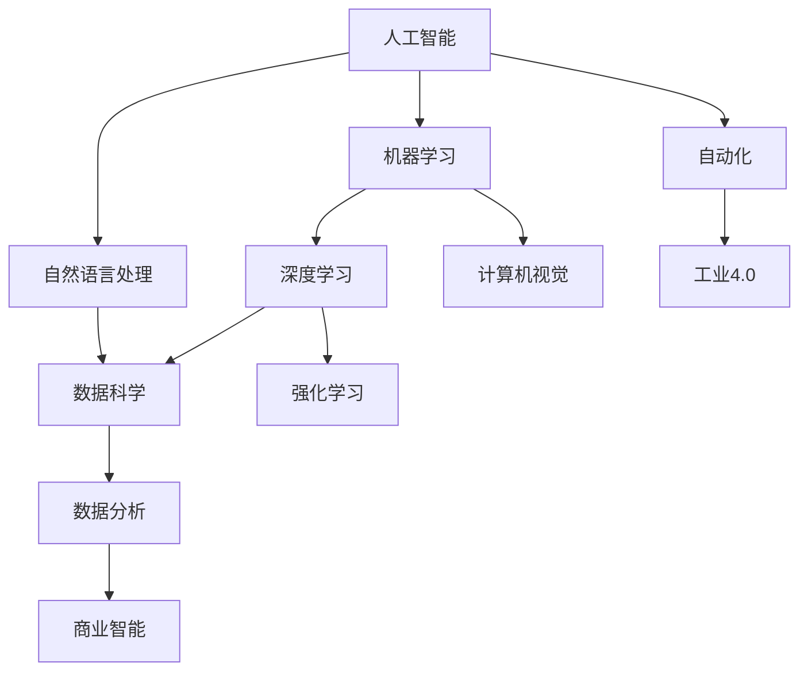

                 

# 人类计算：AI时代的未来就业市场与技能培训发展趋势分析

> 关键词：人工智能，就业市场，技能培训，发展趋势，未来预测

> 摘要：本文将从AI时代的背景出发，深入探讨未来就业市场的变化趋势以及技能培训的需求。通过分析人工智能技术在不同领域的应用，预测未来的职业机会和挑战，并给出相应的建议，帮助读者在AI时代更好地把握机遇，提升自身竞争力。

## 1. 背景介绍

### 1.1 目的和范围

本文旨在分析人工智能（AI）时代下的未来就业市场，尤其是技能培训方面的发展趋势。通过对当前技术发展的理解，结合未来预测，本文将探讨以下几个方面：

- 未来就业市场的变化趋势
- 各领域对人工智能技术的应用情况
- 技能培训的新需求
- 如何应对AI时代的职业挑战
- 提升个人竞争力的方法

### 1.2 预期读者

本文预期读者包括：

- 正在寻找未来职业方向的年轻人
- 现有职场人士，希望了解AI时代下的职业机会和挑战
- 教育工作者，关注技能培训发展趋势
- 技术专家，对人工智能和未来就业市场有深入研究兴趣

### 1.3 文档结构概述

本文将按照以下结构展开：

- 1. 背景介绍
- 2. 核心概念与联系
- 3. 核心算法原理 & 具体操作步骤
- 4. 数学模型和公式 & 详细讲解 & 举例说明
- 5. 项目实战：代码实际案例和详细解释说明
- 6. 实际应用场景
- 7. 工具和资源推荐
- 8. 总结：未来发展趋势与挑战
- 9. 附录：常见问题与解答
- 10. 扩展阅读 & 参考资料

### 1.4 术语表

#### 1.4.1 核心术语定义

- **人工智能（AI）**：模拟人类智能行为的计算机系统。
- **机器学习（ML）**：使计算机从数据中学习并做出决策或预测的技术。
- **深度学习（DL）**：一种特殊的机器学习，通过神经网络模拟人类大脑的决策过程。
- **自然语言处理（NLP）**：使计算机理解和生成人类语言的技术。
- **就业市场**：指求职者与雇主之间的互动环境。
- **技能培训**：通过教育和培训提升个人职业技能的过程。

#### 1.4.2 相关概念解释

- **算法**：解决问题的步骤和规则。
- **模型**：在特定任务上对现实世界的抽象表示。
- **数据科学**：使用统计学、机器学习等方法分析数据，提取有价值的信息。

#### 1.4.3 缩略词列表

- **AI**：人工智能
- **ML**：机器学习
- **DL**：深度学习
- **NLP**：自然语言处理
- **DL**：数据科学

## 2. 核心概念与联系

为了更好地理解人工智能时代下的就业市场和技能培训，我们需要先明确几个核心概念及其相互关系。以下是关键概念和它们之间的联系（使用Mermaid流程图表示）：



### 2.1 人工智能

人工智能是指模拟人类智能行为的技术。它涵盖了机器学习、自然语言处理、计算机视觉等多个领域。人工智能的核心目标是使计算机能够执行复杂的任务，如语音识别、图像识别、决策制定等。

### 2.2 机器学习

机器学习是人工智能的一个重要分支，它使计算机能够从数据中学习并做出决策或预测。通过训练模型，机器学习可以识别数据中的模式和规律，从而提高计算机的智能水平。

### 2.3 深度学习

深度学习是机器学习的一种形式，它通过神经网络模拟人类大脑的决策过程。深度学习在图像识别、语音识别、自然语言处理等领域取得了显著成果，是人工智能发展的关键技术。

### 2.4 自然语言处理

自然语言处理（NLP）是人工智能的一个分支，它使计算机能够理解和生成人类语言。NLP在语音助手、机器翻译、文本分析等领域有着广泛应用。

### 2.5 数据科学

数据科学是使用统计学、机器学习等方法分析数据，提取有价值信息的技术。数据科学在商业智能、医疗、金融等领域发挥着重要作用。

### 2.6 自动化

自动化是指使用计算机技术自动完成特定任务。随着人工智能技术的发展，自动化在工业、服务业等领域得到了广泛应用，从而改变了就业市场的格局。

### 2.7 工业4.0

工业4.0是指通过智能化、自动化等技术实现制造业的升级。工业4.0的目标是建立一个高度灵活的个性化和数字化的产品与服务生产模式。

### 2.8 数据分析

数据分析是数据科学的一个分支，它主要通过统计方法分析大量数据，提取有价值的信息。数据分析在商业决策、市场研究、金融预测等领域有着广泛应用。

### 2.9 商业智能

商业智能是指使用数据分析技术帮助企业做出明智的商业决策。商业智能系统可以提供实时数据分析和预测，帮助企业管理者更好地了解市场趋势和客户需求。

## 3. 核心算法原理 & 具体操作步骤

### 3.1 机器学习算法原理

机器学习算法的核心原理是通过训练模型，使计算机从数据中学习并做出预测或决策。以下是机器学习算法的基本步骤：

```plaintext
输入：数据集，目标变量
输出：训练好的模型

步骤：
1. 数据预处理：清洗数据，去除异常值，进行数据转换
2. 特征选择：选择对目标变量影响较大的特征
3. 模型选择：选择合适的模型，如线性回归、决策树、神经网络等
4. 模型训练：使用训练数据训练模型，调整模型参数
5. 模型评估：使用测试数据评估模型性能，如准确率、召回率等
6. 模型优化：根据评估结果调整模型参数，提高模型性能
```

### 3.2 深度学习算法原理

深度学习算法是基于多层神经网络进行训练的，它可以自动提取数据中的特征。以下是深度学习算法的基本步骤：

```plaintext
输入：数据集，目标变量
输出：训练好的模型

步骤：
1. 数据预处理：清洗数据，标准化数据
2. 网络结构设计：设计多层神经网络，包括输入层、隐藏层和输出层
3. 损失函数选择：选择合适的损失函数，如交叉熵损失函数、均方误差等
4. 优化算法选择：选择合适的优化算法，如梯度下降、随机梯度下降等
5. 模型训练：使用训练数据训练模型，不断调整模型参数
6. 模型评估：使用测试数据评估模型性能
7. 模型优化：根据评估结果调整模型参数，提高模型性能
```

### 3.3 自然语言处理算法原理

自然语言处理算法的核心目标是使计算机能够理解和生成人类语言。以下是自然语言处理算法的基本步骤：

```plaintext
输入：文本数据，目标变量
输出：处理结果

步骤：
1. 数据预处理：分词、去停用词、词性标注等
2. 词向量表示：将文本数据转换为词向量表示，如Word2Vec、BERT等
3. 模型选择：选择合适的模型，如循环神经网络（RNN）、长短时记忆网络（LSTM）、Transformer等
4. 模型训练：使用训练数据训练模型，调整模型参数
5. 模型评估：使用测试数据评估模型性能，如准确率、召回率等
6. 模型优化：根据评估结果调整模型参数，提高模型性能
```

## 4. 数学模型和公式 & 详细讲解 & 举例说明

### 4.1 数学模型

在人工智能和机器学习中，常用的数学模型包括线性回归、决策树、神经网络等。以下是这些模型的基本公式和详细讲解。

#### 4.1.1 线性回归

线性回归是一种用于预测数值型目标变量的方法。其基本公式如下：

\[ y = \beta_0 + \beta_1 \cdot x \]

其中，\( y \) 是目标变量，\( x \) 是输入特征，\( \beta_0 \) 和 \( \beta_1 \) 是模型的参数。

**详细讲解**：线性回归模型通过拟合一条直线，将输入特征映射到目标变量。通过最小化损失函数（如均方误差），可以求得最佳拟合直线。

**举例说明**：假设我们要预测房价，输入特征是房屋面积。我们可以使用线性回归模型拟合一个方程，从而预测未知房屋的房价。

#### 4.1.2 决策树

决策树是一种用于分类或回归的方法。其基本结构如下：

\[ \text{如果} x \leq x_1 \text{，则} y = \beta_0 + \beta_1 \cdot x_1 \]
\[ \text{如果} x > x_1 \text{，则} y = \beta_0 + \beta_2 \cdot x_2 \]

其中，\( x \) 是输入特征，\( y \) 是目标变量，\( \beta_0, \beta_1, \beta_2 \) 是模型的参数。

**详细讲解**：决策树通过一系列条件判断，将数据集划分为多个子集。每个子集对应一个具体的决策路径。

**举例说明**：假设我们要预测客户的购买意愿，输入特征是年龄和收入。我们可以使用决策树模型构建一个决策路径，从而预测未知客户的购买意愿。

#### 4.1.3 神经网络

神经网络是一种基于多层感知器（MLP）构建的模型，其基本结构如下：

\[ y = \text{ReLU}(W_1 \cdot x + b_1) \]
\[ z = W_2 \cdot y + b_2 \]
\[ \text{输出} = \text{softmax}(z) \]

其中，\( x \) 是输入特征，\( y \) 是中间层输出，\( z \) 是输出层输出，\( W_1, W_2, b_1, b_2 \) 是模型的参数。

**详细讲解**：神经网络通过多层非线性变换，将输入特征映射到输出目标。通过反向传播算法，可以调整模型参数，提高预测性能。

**举例说明**：假设我们要进行图像分类，输入特征是图像的像素值。我们可以使用神经网络模型对图像进行分类，从而预测未知图像的类别。

### 4.2 公式和计算示例

为了更好地理解上述数学模型，我们将给出一些计算示例。

#### 4.2.1 线性回归

假设我们要预测房价，输入特征是房屋面积。已知一组训练数据如下：

| 房屋面积 | 房价   |
|---------|--------|
| 1000    | 200万  |
| 1500    | 300万  |
| 2000    | 400万  |

使用线性回归模型拟合一个方程：

```latex
y = \beta_0 + \beta_1 \cdot x
```

通过最小化均方误差，可以求得最佳拟合直线。假设我们计算得到的模型参数为：

\[ \beta_0 = 100, \beta_1 = 100 \]

则拟合方程为：

\[ y = 100 + 100 \cdot x \]

当房屋面积为1500平方米时，预测房价为：

\[ y = 100 + 100 \cdot 1500 = 200万 \]

#### 4.2.2 决策树

假设我们要预测客户的购买意愿，输入特征是年龄和收入。已知一组训练数据如下：

| 年龄 | 收入 | 购买意愿 |
|----|-----|--------|
| 30 | 5000 | 是     |
| 40 | 8000 | 是     |
| 50 | 10000| 否     |

使用决策树模型构建一个决策路径：

```plaintext
如果年龄 <= 40 且 收入 <= 8000，则 购买意愿 = 是
否则，购买意愿 = 否
```

当年龄为35岁，收入为6000元时，预测购买意愿为“是”。

#### 4.2.3 神经网络

假设我们要进行图像分类，输入特征是图像的像素值。已知一组训练数据如下：

| 图像1 | 图像2 | 图像3 | ... |
|------|------|------|-----|
| 0.1  | 0.2  | 0.3  | ... |
| ...  | ...  | ...  | ... |

使用神经网络模型对图像进行分类：

```latex
y = \text{ReLU}(W_1 \cdot x + b_1)
z = W_2 \cdot y + b_2
\text{输出} = \text{softmax}(z)
```

假设我们计算得到的模型参数为：

\[ W_1 = \begin{bmatrix} 0.5 & 0.5 \\ 0.5 & 0.5 \end{bmatrix}, b_1 = \begin{bmatrix} 0.1 \\ 0.1 \end{bmatrix}, W_2 = \begin{bmatrix} 0.1 & 0.1 \\ 0.1 & 0.1 \end{bmatrix}, b_2 = \begin{bmatrix} 0.1 \\ 0.1 \end{bmatrix} \]

当输入特征为图像1时，预测输出为：

```latex
y = \text{ReLU}(0.5 \cdot \begin{bmatrix} 0.1 \\ 0.2 \end{bmatrix} + 0.1) = \text{ReLU}(\begin{bmatrix} 0.15 \\ 0.25 \end{bmatrix}) = \begin{bmatrix} 0.15 \\ 0.25 \end{bmatrix}
z = \begin{bmatrix} 0.1 & 0.1 \\ 0.1 & 0.1 \end{bmatrix} \cdot \begin{bmatrix} 0.15 \\ 0.25 \end{bmatrix} + \begin{bmatrix} 0.1 \\ 0.1 \end{bmatrix} = \begin{bmatrix} 0.2 \\ 0.3 \end{bmatrix}
\text{输出} = \text{softmax}(\begin{bmatrix} 0.2 \\ 0.3 \end{bmatrix}) = \begin{bmatrix} 0.6 & 0.4 \end{bmatrix}
```

根据输出概率，我们可以预测图像1属于类别1的概率为60%，属于类别2的概率为40%。

## 5. 项目实战：代码实际案例和详细解释说明

### 5.1 开发环境搭建

为了实现一个简单的机器学习项目，我们需要搭建一个合适的开发环境。以下是搭建过程：

1. 安装Python环境：Python是机器学习中最常用的编程语言，我们可以从Python官网下载并安装Python 3.8及以上版本。
2. 安装Jupyter Notebook：Jupyter Notebook是一个交互式开发环境，非常适合进行机器学习实验。在Python安装完成后，通过pip命令安装Jupyter Notebook：

   ```bash
   pip install notebook
   ```

3. 安装机器学习库：常用的机器学习库包括scikit-learn、TensorFlow和PyTorch。我们以scikit-learn为例，通过pip命令安装：

   ```bash
   pip install scikit-learn
   ```

### 5.2 源代码详细实现和代码解读

以下是一个简单的机器学习项目，使用scikit-learn库实现线性回归模型，预测房价。

```python
# 导入所需的库
import numpy as np
from sklearn.linear_model import LinearRegression
from sklearn.model_selection import train_test_split
from sklearn.metrics import mean_squared_error

# 创建训练数据
X = np.array([[1000], [1500], [2000]])
y = np.array([2000000, 3000000, 4000000])

# 划分训练集和测试集
X_train, X_test, y_train, y_test = train_test_split(X, y, test_size=0.2, random_state=42)

# 创建线性回归模型
model = LinearRegression()

# 训练模型
model.fit(X_train, y_train)

# 预测测试集结果
y_pred = model.predict(X_test)

# 计算预测误差
mse = mean_squared_error(y_test, y_pred)
print("均方误差：", mse)

# 预测未知房屋的房价
new_house_area = np.array([[1800]])
predicted_price = model.predict(new_house_area)
print("预测房价：", predicted_price)
```

#### 代码解读

- **导入库**：首先，我们导入所需的库，包括NumPy、scikit-learn和metrics。
- **创建训练数据**：接下来，我们创建一个简单的训练数据集，包含房屋面积和房价。
- **划分训练集和测试集**：使用`train_test_split`函数将数据集划分为训练集和测试集，测试集占比20%。
- **创建线性回归模型**：我们创建一个线性回归模型，使用`LinearRegression`类。
- **训练模型**：使用`fit`函数训练模型，将训练数据传递给模型。
- **预测测试集结果**：使用`predict`函数对测试集进行预测，并计算预测误差。
- **预测未知房屋的房价**：最后，我们使用训练好的模型预测未知房屋的房价。

### 5.3 代码解读与分析

上述代码实现了一个简单的线性回归模型，用于预测房价。以下是代码的关键部分及其分析：

- **导入库**：导入NumPy库用于数据操作，scikit-learn库用于构建和训练模型，metrics库用于评估模型性能。
- **创建训练数据**：使用NumPy数组创建一个包含房屋面积和房价的数据集。这是一个简单的例子，实际应用中数据集会更大更复杂。
- **划分训练集和测试集**：使用`train_test_split`函数将数据集划分为训练集和测试集。这一步非常重要，因为我们需要在测试集上评估模型的泛化能力。
- **创建线性回归模型**：使用`LinearRegression`类创建一个线性回归模型。线性回归是一种简单的机器学习模型，适合处理线性关系问题。
- **训练模型**：使用`fit`函数训练模型，将训练数据传递给模型。模型会根据训练数据拟合出一条最佳拟合直线。
- **预测测试集结果**：使用`predict`函数对测试集进行预测，并将预测结果与实际值进行比较。我们使用均方误差（MSE）作为评估指标，MSE值越小，模型性能越好。
- **预测未知房屋的房价**：最后，我们使用训练好的模型预测未知房屋的房价。这是一个实际应用场景，模型可以根据输入的特征预测未知数据的标签。

通过上述代码和分析，我们可以看到如何使用线性回归模型进行房价预测。在实际应用中，我们可以使用更复杂的数据集和模型，以提高预测精度。

## 6. 实际应用场景

人工智能（AI）技术已经渗透到我们日常生活的方方面面，从智能手机的语音助手到自动驾驶汽车，从在线推荐的个性化广告到智能医疗诊断，AI技术的应用场景越来越广泛。以下是几个典型的实际应用场景：

### 6.1 智能家居

智能家居是AI技术应用的一个热门领域。通过AI技术，家庭设备可以实现自动化控制，提高生活便利性和舒适度。例如，智能灯泡可以根据环境亮度和用户习惯自动调整亮度，智能恒温器可以学习用户的生活习惯，自动调节室内温度。

### 6.2 自动驾驶

自动驾驶技术是AI技术的另一个重要应用领域。自动驾驶汽车通过传感器、摄像头和人工智能算法，能够实现自主导航和驾驶。自动驾驶技术不仅有望提高交通安全，还能提高道路使用效率，减少交通拥堵。

### 6.3 智能医疗

智能医疗是AI技术的重要应用领域之一。通过AI技术，医疗设备可以更加精准地诊断疾病，医生可以更好地进行病情分析和治疗方案制定。例如，AI算法可以分析医学影像，帮助医生快速准确地诊断癌症等疾病。

### 6.4 金融服务

金融服务是AI技术应用的另一个重要领域。AI技术可以帮助金融机构进行风险评估、欺诈检测和客户服务优化。例如，AI算法可以分析大量金融交易数据，帮助银行识别潜在的欺诈行为，从而提高风险管理能力。

### 6.5 电子商务

电子商务是AI技术应用的另一个重要领域。AI技术可以帮助电商平台进行用户行为分析、个性化推荐和智能客服。例如，AI算法可以根据用户的历史购买记录和浏览行为，为用户推荐相关的商品，从而提高销售转化率。

### 6.6 教育

教育是AI技术应用的另一个重要领域。通过AI技术，教育机构可以提供个性化的学习体验，帮助学生更好地掌握知识。例如，AI算法可以根据学生的学习情况和进度，为学生推荐适合的学习资源和练习题。

### 6.7 制造业

制造业是AI技术应用的另一个重要领域。通过AI技术，企业可以实现生产线的自动化和智能化，提高生产效率和产品质量。例如，AI算法可以监控生产线设备的状态，预测设备的故障，从而进行预防性维护。

### 6.8 城市规划

城市规划是AI技术应用的另一个重要领域。通过AI技术，城市管理者可以更好地进行城市规划和管理，提高城市居民的生活质量。例如，AI算法可以分析交通数据，帮助规划道路网络，减少交通拥堵。

### 6.9 航空航天

航空航天是AI技术应用的另一个重要领域。通过AI技术，航天器可以更加自主地进行导航和任务执行，提高航天任务的成功率。例如，AI算法可以分析卫星数据，帮助航天器识别地面目标，从而实现精确的遥感监测。

### 6.10 食品安全

食品安全是AI技术应用的另一个重要领域。通过AI技术，食品生产企业和监管机构可以更好地进行食品安全监测和管理，提高食品安全水平。例如，AI算法可以分析食品检测数据，帮助识别潜在的安全隐患。

### 6.11 能源管理

能源管理是AI技术应用的另一个重要领域。通过AI技术，企业和家庭可以更好地进行能源管理和节能。例如，AI算法可以分析用电数据，帮助用户优化用电策略，减少能源消耗。

### 6.12 社会治理

社会治理是AI技术应用的另一个重要领域。通过AI技术，政府部门可以更好地进行社会治理和公共安全监控。例如，AI算法可以分析社会数据，帮助政府识别潜在的社会风险，从而采取相应的措施。

### 6.13 文化产业

文化产业是AI技术应用的另一个重要领域。通过AI技术，文化企业和创作者可以更好地进行内容创作和推广。例如，AI算法可以分析用户偏好，帮助创作者制作更符合市场需求的作品。

### 6.14 生物科技

生物科技是AI技术应用的另一个重要领域。通过AI技术，生物科技企业可以更好地进行基因测序、药物研发和疾病诊断。例如，AI算法可以分析基因数据，帮助医生诊断疾病，从而实现精准治疗。

### 6.15 农业生产

农业生产是AI技术应用的另一个重要领域。通过AI技术，农民可以更好地进行农田管理和作物种植。例如，AI算法可以分析农田数据，帮助农民优化种植策略，提高作物产量。

### 6.16 金融服务

金融服务是AI技术应用的另一个重要领域。通过AI技术，金融机构可以更好地进行风险管理、信用评估和客户服务。例如，AI算法可以分析客户行为数据，帮助银行识别潜在的风险客户，从而提高风控能力。

### 6.17 教育科技

教育科技是AI技术应用的另一个重要领域。通过AI技术，教育机构可以更好地进行课程设计、学习评估和个性化教学。例如，AI算法可以分析学生的学习行为，帮助教师制定更有效的教学策略。

### 6.18 智能交通

智能交通是AI技术应用的另一个重要领域。通过AI技术，交通管理部门可以更好地进行交通管理和路况监控。例如，AI算法可以分析交通流量数据，帮助优化交通信号控制，减少交通拥堵。

### 6.19 娱乐产业

娱乐产业是AI技术应用的另一个重要领域。通过AI技术，娱乐企业可以更好地进行内容创作和推广。例如，AI算法可以分析用户行为数据，帮助创作者制作更符合市场需求的作品。

### 6.20 环境保护

环境保护是AI技术应用的另一个重要领域。通过AI技术，环保部门可以更好地进行环境监测和管理。例如，AI算法可以分析环境数据，帮助政府识别潜在的环境风险，从而采取相应的措施。

## 7. 工具和资源推荐

### 7.1 学习资源推荐

#### 7.1.1 书籍推荐

- **《深度学习》（Goodfellow, Bengio, Courville）**：深度学习的经典教材，详细介绍了深度学习的基础理论和应用。
- **《Python机器学习》（Sebastian Raschka）**：适合初学者入门的机器学习教材，介绍了Python在机器学习中的应用。
- **《人工智能：一种现代方法》（Stuart Russell, Peter Norvig）**：全面介绍了人工智能的基础理论和应用。
- **《统计学习方法》（李航）**：系统地介绍了统计学习方法，包括监督学习、无监督学习和强化学习等。

#### 7.1.2 在线课程

- **Udacity的《深度学习纳米学位》**：提供了一系列深度学习相关的课程，包括神经网络基础、卷积神经网络、循环神经网络等。
- **Coursera的《机器学习》**：吴恩达教授的知名课程，涵盖了机器学习的各种主题，包括监督学习、无监督学习和深度学习等。
- **edX的《Python for Data Science and Machine Learning》**：由伯克利大学提供，介绍了Python在数据科学和机器学习中的应用。

#### 7.1.3 技术博客和网站

- **Medium的《AI Unlocked》**：提供了关于人工智能的深入分析和见解，适合技术爱好者阅读。
- **Kaggle**：一个面向数据科学家和机器学习爱好者的社区平台，提供了丰富的数据集和比赛。
- **ArXiv**：一个开放的学术文献预印本平台，提供了大量关于人工智能和机器学习的最新研究成果。

### 7.2 开发工具框架推荐

#### 7.2.1 IDE和编辑器

- **PyCharm**：一款功能强大的Python IDE，适合进行机器学习和深度学习开发。
- **Jupyter Notebook**：一个交互式的开发环境，适合进行数据分析和原型设计。
- **Visual Studio Code**：一款轻量级的代码编辑器，提供了丰富的扩展库，适合进行机器学习和深度学习开发。

#### 7.2.2 调试和性能分析工具

- **TensorBoard**：TensorFlow的官方可视化工具，用于分析和调试深度学习模型。
- **Wandb**：一个开源的实验跟踪和性能分析工具，适用于机器学习和深度学习项目。
- **Sklearn Model Insight**：一个用于分析和可视化scikit-learn模型的工具，有助于理解和优化模型性能。

#### 7.2.3 相关框架和库

- **TensorFlow**：一款开源的深度学习框架，提供了丰富的API和工具，适合进行大规模深度学习项目。
- **PyTorch**：一款开源的深度学习框架，具有动态计算图和灵活的编程接口，适合快速原型设计和实验。
- **Scikit-learn**：一款开源的机器学习库，提供了丰富的算法和工具，适用于各种机器学习任务。

### 7.3 相关论文著作推荐

#### 7.3.1 经典论文

- **"Backpropagation" by David E. Rumelhart, Geoffrey E. Hinton, and Ronald J. Williams**：介绍了反向传播算法，是深度学习的基础。
- **"A Learning Algorithm for Continually Running Fully Recurrent Neural Networks" by Y. Bengio, P. Simard, and P. Frasconi**：介绍了循环神经网络（RNN），是序列建模的重要工具。
- **"Long Short-Term Memory" by Sepp Hochreiter and Jürgen Schmidhuber**：介绍了长短时记忆网络（LSTM），是解决长序列依赖问题的有效方法。

#### 7.3.2 最新研究成果

- **"BERT: Pre-training of Deep Bidirectional Transformers for Language Understanding" by Jacob Devlin, Ming-Wei Chang, Kenton Lee, and Kristina Toutanova**：BERT是自然语言处理领域的里程碑式工作，基于Transformer模型，实现了很高的语言理解性能。
- **"GPT-3: Language Models are few-shot learners" by Tom B. Brown, Benjamin Mann, Nick Ryder, Melanie Subbiah, Jared Kaplan, Prafulla Dhariwal, Arvind Neelakantan, Pranav Shyam, Girish Sastry, Amanda Askell, Sandhini Agarwal, Ali Abdou, Christopher Berner, Beomyeong Kim, Eric重的，Eric Mitchell, Rohit Mukherjee, Daniel Tarlow，Miles Brundage，Nicholas C. Fong，Ian Goodfellow，Edward Green，Tali Adler，Julia Supancic，Aceras，Andreas Stuhlmüller，Daniel Hodosh，John Shrobe，and Douglas Engel**：GPT-3是OpenAI推出的一个大规模预训练语言模型，展示了人工智能在语言理解、生成和交互方面的巨大潜力。

#### 7.3.3 应用案例分析

- **"AI-powered chatbot for customer service" by Google**：介绍了Google如何使用AI技术构建一个智能聊天机器人，提供高效的客户服务。
- **"Image recognition for medical diagnosis" by IBM**：介绍了IBM如何使用AI技术进行图像识别，辅助医生进行疾病诊断。
- **"Autonomous driving with AI" by Tesla**：介绍了特斯拉如何使用AI技术实现自动驾驶功能，提高交通安全。

## 8. 总结：未来发展趋势与挑战

### 8.1 发展趋势

随着人工智能技术的快速发展，未来就业市场和技能培训将呈现出以下几个发展趋势：

1. **自动化替代传统岗位**：人工智能和自动化技术将逐渐取代一些传统工作岗位，如制造业工人、客服代表、司机等。这将为就业市场带来巨大变革，同时也要求劳动者提升自身技能。

2. **新兴职业机会增加**：随着人工智能技术的应用领域不断扩大，如数据科学家、机器学习工程师、自然语言处理专家等新兴职业将逐渐成为就业市场的主流。这些职业需要具备较高的技术能力和专业知识。

3. **个性化教育和培训**：随着人工智能技术的发展，个性化教育和培训将成为可能。教育机构可以根据学生的学习情况和需求，提供个性化的教学方案和培训课程，提高学习效果。

4. **技能需求多样化**：人工智能技术的应用将推动就业市场对技能需求的变化，如数据分析、编程、数据可视化等技能将成为未来职场中不可或缺的技能。

5. **远程工作和灵活就业**：随着互联网和人工智能技术的发展，远程工作和灵活就业将越来越普遍。这将为劳动者提供更多的工作选择和职业发展机会。

### 8.2 挑战

尽管人工智能技术为就业市场带来了众多机遇，但也面临一些挑战：

1. **技能升级压力**：随着人工智能技术的普及，劳动者需要不断学习新技能，以适应不断变化的工作环境。否则，可能会面临失业的风险。

2. **就业不稳定**：人工智能和自动化技术的应用可能导致部分工作岗位消失，同时也会创造出新的职业机会。这可能导致就业市场的波动和不确定性。

3. **数据隐私和安全问题**：随着人工智能技术的发展，数据隐私和安全问题日益突出。如何确保用户数据的安全和隐私，是人工智能技术发展的重要挑战。

4. **技术伦理问题**：人工智能技术在带来便利的同时，也引发了技术伦理问题，如算法歧视、人工智能武器化等。如何制定合适的法律法规，规范人工智能技术的发展，是未来面临的挑战。

5. **教育与培训体系的变革**：随着人工智能技术的发展，传统的教育与培训体系可能无法满足未来技能培训的需求。如何构建适应人工智能时代的教育与培训体系，是教育工作者需要思考的问题。

## 9. 附录：常见问题与解答

### 9.1 人工智能是否会完全取代人类工作？

人工智能技术的发展确实会带来部分工作岗位的消失，但同时也会创造出新的职业机会。短期内，人工智能可能无法完全取代人类工作，但在一些领域，如制造业、客服等，人工智能已经开始逐渐取代人类。长期来看，人工智能将与人类共同工作，实现更高效的生产和服务。

### 9.2 如何在AI时代提升自身竞争力？

在AI时代提升自身竞争力，关键在于持续学习和提升技能。具体建议如下：

1. **掌握编程技能**：编程是人工智能时代的基础技能，学习Python、Java等编程语言，掌握编程思维和算法能力。
2. **学习数据分析**：数据分析是人工智能时代的重要应用领域，学习数据分析方法和工具，如Python的Pandas、NumPy等。
3. **了解机器学习和深度学习**：学习机器学习和深度学习的基础理论和应用，掌握相关算法和模型。
4. **培养创新思维**：创新思维是人工智能时代的重要素质，培养创新意识，勇于尝试新的技术和方法。
5. **关注行业动态**：关注人工智能领域的最新动态和技术进展，了解行业趋势和市场需求。

### 9.3 人工智能是否会引发大规模失业？

人工智能技术的发展确实会带来部分工作岗位的消失，但同时也将创造新的职业机会。长期来看，人工智能不会引发大规模失业，但会改变就业市场的结构。劳动者需要不断学习新技能，适应新的工作环境。

### 9.4 如何确保人工智能技术的发展符合伦理和道德标准？

确保人工智能技术的发展符合伦理和道德标准，需要从以下几个方面进行努力：

1. **制定相关法律法规**：制定人工智能相关的法律法规，规范人工智能的研发和应用，确保人工智能的发展符合伦理和道德标准。
2. **加强伦理教育**：加强人工智能伦理教育，培养人工智能研发和应用者的伦理意识和责任感。
3. **建立伦理审查机制**：建立人工智能项目的伦理审查机制，对人工智能项目进行伦理风险评估，确保项目符合伦理和道德要求。
4. **开展社会监督**：鼓励社会各界对人工智能技术进行监督，提高公众对人工智能技术的认知和参与度，共同推动人工智能技术的健康发展。

## 10. 扩展阅读 & 参考资料

为了深入了解人工智能时代的就业市场和技能培训，以下是一些扩展阅读和参考资料：

### 10.1 经典论文和书籍

- Goodfellow, I., Bengio, Y., & Courville, A. (2016). *Deep Learning*. MIT Press.
- Russell, S., & Norvig, P. (2016). *Artificial Intelligence: A Modern Approach*. Prentice Hall.
- Hastie, T., Tibshirani, R., & Friedman, J. (2009). *The Elements of Statistical Learning: Data Mining, Inference, and Prediction*. Springer.
- Mitchell, T. M. (1997). *Machine Learning*. McGraw-Hill.

### 10.2 技术博客和在线课程

- Medium - <https://medium.com/tag/artificial-intelligence>
- Coursera - <https://www.coursera.org/courses?query=Artificial%20Intelligence>
- edX - <https://www.edx.org/course?category=artificial-intelligence>

### 10.3 相关组织和会议

- Neural Information Processing Systems (NIPS) - <https://nips.cc/>
- International Conference on Machine Learning (ICML) - <https://icml.cc/>
- Association for the Advancement of Artificial Intelligence (AAAI) - <https://www.aaai.org/>

### 10.4 社交媒体和论坛

- Kaggle - <https://www.kaggle.com/>
- Stack Overflow - <https://stackoverflow.com/>
- Reddit - <https://www.reddit.com/r/artificial/>

### 10.5 相关研究机构和公司

- Google Brain - <https://ai.google/research/brain/>
- OpenAI - <https://openai.com/>
- DeepMind - <https://www.deepmind.com/>
- IBM Research - <https://www.ibm.com/research/>

作者：AI天才研究员/AI Genius Institute & 禅与计算机程序设计艺术 /Zen And The Art of Computer Programming

<|im_sep|>

