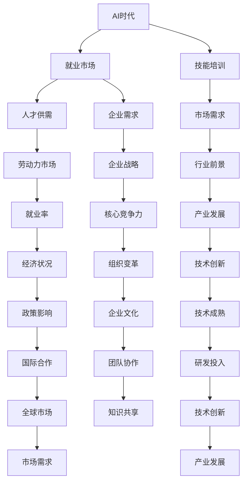

                 

# 人类计算：AI时代的未来就业市场与技能培训发展趋势分析机遇挑战机遇预测

> **关键词**：AI时代、就业市场、技能培训、发展趋势、机遇、挑战、未来预测  
>
> **摘要**：本文将从AI时代的背景出发，分析未来就业市场与技能培训的发展趋势，探讨机遇与挑战，并对未来的发展方向进行预测。通过深入研究，本文旨在为读者提供有价值的见解，帮助他们在AI时代把握机遇，应对挑战。

## 1. 背景介绍

### 1.1 目的和范围

本文旨在探讨AI时代对就业市场与技能培训的影响，分析其发展趋势，探讨机遇与挑战，并对未来进行预测。本文将重点关注以下几个方面：

- AI时代的发展趋势及其对就业市场的影响
- 技能培训的需求与变化
- 机遇与挑战的辩证分析
- 未来发展趋势与方向的预测

### 1.2 预期读者

本文适合对AI时代、就业市场、技能培训等领域感兴趣的读者，包括但不限于：

- 普通求职者
- 企业管理层
- 技能培训从业者
- 技术爱好者

### 1.3 文档结构概述

本文将分为十个部分：

1. 背景介绍：介绍本文的目的、范围、预期读者和文档结构。
2. 核心概念与联系：阐述本文的核心概念、原理和架构。
3. 核心算法原理 & 具体操作步骤：详细讲解核心算法原理和具体操作步骤。
4. 数学模型和公式 & 详细讲解 & 举例说明：介绍数学模型、公式以及举例说明。
5. 项目实战：代码实际案例和详细解释说明。
6. 实际应用场景：分析AI时代的实际应用场景。
7. 工具和资源推荐：推荐学习资源和开发工具框架。
8. 总结：未来发展趋势与挑战。
9. 附录：常见问题与解答。
10. 扩展阅读 & 参考资料：提供扩展阅读和参考资料。

### 1.4 术语表

#### 1.4.1 核心术语定义

- AI时代：指人工智能技术迅速发展，对人类社会产生重大影响的时期。
- 就业市场：指劳动力供需双方在特定时间内形成的市场。
- 技能培训：指为提高个人技能水平而进行的教育和培训。
- 机遇：指在特定环境下，能够为个体或组织带来有利条件的情况。
- 挑战：指在特定环境下，需要克服的困难或障碍。

#### 1.4.2 相关概念解释

- 人工智能（AI）：指通过模拟、延伸和扩展人类智能，实现智能机器的领域。
- 机器学习（ML）：指让计算机从数据中学习，并做出决策或预测的技术。
- 深度学习（DL）：指通过多层神经网络模拟人脑处理信息的方式，进行复杂模式识别和决策的技术。
- 大数据：指海量、复杂、多样的数据集合。

#### 1.4.3 缩略词列表

- AI：人工智能
- ML：机器学习
- DL：深度学习
- CTO：首席技术官
- IDE：集成开发环境
- Git：分布式版本控制系统

## 2. 核心概念与联系

在探讨AI时代的就业市场与技能培训时，有必要先了解一些核心概念和它们之间的联系。以下是一个简单的Mermaid流程图，展示这些概念及其相互关系。



通过上述流程图，我们可以看出AI时代对就业市场、技能培训和劳动力市场的深远影响。以下是对核心概念的详细解释：

- **AI时代**：这是一个以人工智能技术为核心，驱动各行各业变革的时代。
- **就业市场**：这是劳动力供需双方进行交易的市场，包括求职者、雇主和中介机构。
- **技能培训**：这是为了提高个人技能水平，以满足就业市场需求而进行的教育和培训。
- **人才供需**：这是就业市场中劳动力供给与需求的平衡，影响就业率和行业前景。
- **市场需求**：这是指各类岗位对劳动力技能的需求，与行业前景密切相关。
- **企业需求**：这是企业根据自身战略目标对劳动力技能的需求。
- **劳动力市场**：这是劳动力供需交易的场所，受经济状况、政策影响和技术成熟度等因素影响。
- **行业前景**：这是指某个行业的未来发展潜力，直接影响市场需求。
- **企业战略**：这是企业根据外部环境和内部资源制定的发展计划，影响人才需求和核心竞争力。
- **就业率**：这是衡量劳动力市场供需状况的重要指标。
- **技术创新**：这是推动产业发展的重要动力。
- **组织变革**：这是企业在面对技术变革和市场需求时，进行的内部调整和优化。
- **政策影响**：这是政府对产业发展、就业市场和技能培训等方面的政策引导和扶持。
- **技术成熟**：这是指某一技术达到可以商业应用的程度。
- **企业文化**：这是企业的核心价值观、行为规范和团队协作方式。
- **团队协作**：这是实现企业目标的关键因素。
- **全球市场**：这是企业拓展业务和国际合作的重要平台。
- **研发投入**：这是企业为了保持技术领先地位而进行的研发投入。
- **知识共享**：这是促进团队协作和知识积累的重要方式。
- **市场需求**：这是全球市场对劳动力技能的需求。

通过对这些核心概念和它们之间的联系的理解，我们可以更好地把握AI时代的就业市场与技能培训发展趋势，为未来的职业规划和发展做好准备。

## 3. 核心算法原理 & 具体操作步骤

在探讨AI时代的就业市场与技能培训时，我们需要理解一些核心算法原理，并了解它们在实际操作中的具体步骤。以下将详细讲解一种常用的机器学习算法——决策树（Decision Tree）及其应用步骤。

### 3.1 决策树算法原理

决策树是一种常用于分类和回归问题的监督学习算法。它的核心思想是通过一系列的判断条件，将数据进行划分，最终得到一个分类结果或回归值。决策树的每个节点代表一个特征，每个分支代表一个特征的不同取值，每个叶子节点代表一个类别或预测值。

决策树算法的主要步骤包括：

1. **特征选择**：选择对数据划分效果最好的特征。
2. **划分数据**：根据特征的不同取值，将数据进行划分。
3. **递归构建树**：对划分后的子数据进行相同的划分操作，直到达到终止条件。
4. **剪枝**：对生成的决策树进行剪枝，防止过拟合。

### 3.2 决策树算法具体操作步骤

下面是决策树算法的具体操作步骤，使用伪代码进行详细阐述。

```python
def build_decision_tree(data, feature_list, depth_limit):
    # 判断是否达到终止条件
    if all_values_equal(data) or depth_limit == 0:
        return majority_class(data)
    
    # 选择最佳特征
    best_feature, best_split = find_best_split(data, feature_list)
    
    # 根据最佳特征划分数据
    left_data, right_data = split_data(data, best_feature, best_split)
    
    # 递归构建左子树和右子树
    left_tree = build_decision_tree(left_data, feature_list, depth_limit - 1)
    right_tree = build_decision_tree(right_data, feature_list, depth_limit - 1)
    
    # 返回决策树
    return TreeNode(best_feature, best_split, left_tree, right_tree)

def find_best_split(data, feature_list):
    best_feature = None
    best_split = None
    max_info_gain = -1
    
    for feature in feature_list:
        for split_value in possible_values(feature):
            info_gain = calculate_info_gain(data, feature, split_value)
            if info_gain > max_info_gain:
                max_info_gain = info_gain
                best_feature = feature
                best_split = split_value
    
    return best_feature, best_split

def split_data(data, feature, split_value):
    left_data = []
    right_data = []
    
    for data_point in data:
        if data_point[feature] <= split_value:
            left_data.append(data_point)
        else:
            right_data.append(data_point)
    
    return left_data, right_data

def calculate_info_gain(data, feature, split_value):
    # 计算信息增益
    pass

def majority_class(data):
    # 返回数据中的大多数类别
    pass

def all_values_equal(data):
    # 判断数据中的所有值是否相等
    pass
```

### 3.3 伪代码解释

- **build_decision_tree**：这是构建决策树的主函数，接收数据、特征列表和深度限制作为输入。函数首先判断是否达到终止条件，如果没有，则选择最佳特征进行数据划分，并递归构建左子树和右子树。
- **find_best_split**：这是寻找最佳特征和分割值的功能，计算每个特征在所有可能分割值上的信息增益，选择信息增益最大的特征和分割值。
- **split_data**：这是根据最佳特征和分割值划分数据的函数，将数据分为左右两部分。
- **calculate_info_gain**：这是计算信息增益的函数，用于评估特征分割的效果。
- **majority_class**：这是返回数据中大多数类别的函数，用于构建叶节点。
- **all_values_equal**：这是判断数据中所有值是否相等的函数，用于判断是否达到终止条件。

通过以上伪代码，我们可以了解决策树算法的核心原理和具体操作步骤。决策树算法在处理分类和回归问题时，具有较强的解释性和可操作性，是AI时代就业市场与技能培训分析的有力工具。

## 4. 数学模型和公式 & 详细讲解 & 举例说明

在探讨AI时代的就业市场与技能培训时，我们不可避免地需要运用一些数学模型和公式来描述和分析现象。以下将介绍几个常用的数学模型和公式，并进行详细讲解和举例说明。

### 4.1 决策树的信息增益

决策树的核心在于特征选择，而信息增益（Information Gain）是一个衡量特征划分效果的指标。信息增益的计算公式如下：

\[ IG(\text{feature}, \text{split_value}) = H(\text{data}) - \sum_{v} \frac{|D_v|}{|D|} H(D_v) \]

其中：

- \( H(\text{data}) \) 是数据集的熵（Entropy）。
- \( D \) 是数据集。
- \( D_v \) 是按特征 \( \text{feature} \) 的分割值 \( \text{split_value} \) 划分后的子数据集。
- \( v \) 是所有可能的分割值。

熵的计算公式为：

\[ H(\text{data}) = -\sum_{c} p(c) \log_2 p(c) \]

其中：

- \( c \) 是类别。
- \( p(c) \) 是类别 \( c \) 的概率。

举例说明：

假设我们有一个包含100个数据点的数据集，其中50个数据点属于类别A，50个数据点属于类别B。熵的计算如下：

\[ H(\text{data}) = -\frac{50}{100} \log_2 \frac{50}{100} - \frac{50}{100} \log_2 \frac{50}{100} = 1 \]

现在，我们选择一个特征 \( \text{feature} \) 进行划分，有两个分割值 \( \text{split_value}_1 \) 和 \( \text{split_value}_2 \)，将数据集划分为三个子数据集 \( D_1 \)、\( D_2 \) 和 \( D_3 \)，其中：

- \( D_1 \) 包含20个属于类别A的数据点和10个属于类别B的数据点。
- \( D_2 \) 包含15个属于类别A的数据点和25个属于类别B的数据点。
- \( D_3 \) 包含15个属于类别A的数据点和15个属于类别B的数据点。

信息增益的计算如下：

\[ IG(\text{feature}, \text{split_value}_1) = 1 - \left( \frac{20}{100} \cdot 1 + \frac{10}{100} \cdot 1 \right) = 0.8 \]

\[ IG(\text{feature}, \text{split_value}_2) = 1 - \left( \frac{15}{100} \cdot 1 + \frac{25}{100} \cdot 1 \right) = 0.5 \]

由于 \( IG(\text{feature}, \text{split_value}_1) > IG(\text{feature}, \text{split_value}_2) \)，因此我们选择 \( \text{split_value}_1 \) 作为最佳分割值。

### 4.2 决策树的剪枝

决策树容易过拟合，因此需要进行剪枝（Pruning）。剪枝的方法有多种，如成本复杂度剪枝（Cost-Complexity Pruning）和剪枝阈值（Pruning Threshold）。

成本复杂度剪枝的公式为：

\[ \alpha = \frac{C_{train}}{N_{train}} + \frac{1}{2} \sum_{f \in \text{feature_list}} \sum_{v \in \text{values}} |D_f^v| \log_2 \frac{|D_f^v|}{N_{train}} \]

其中：

- \( C_{train} \) 是训练集的误差。
- \( N_{train} \) 是训练集的样本数。
- \( D_f^v \) 是特征 \( f \) 的取值 \( v \) 的子集。
- \( \alpha \) 是剪枝阈值。

如果某个节点的复杂度 \( \alpha \) 超过剪枝阈值，则该节点及其子节点将被剪除。

举例说明：

假设我们有一个包含100个数据点的训练集，其中一个节点的复杂度为 \( 0.2 \)，剪枝阈值为 \( 0.1 \)，由于 \( 0.2 > 0.1 \)，因此该节点及其子节点将被剪除。

### 4.3 聚类算法的相似度度量

在技能培训中，聚类算法常用于对求职者进行分类。相似度度量（Similarity Measure）是一个关键指标。常用的相似度度量方法有欧氏距离（Euclidean Distance）和余弦相似度（Cosine Similarity）。

欧氏距离的公式为：

\[ d(p, q) = \sqrt{\sum_{i=1}^{n} (p_i - q_i)^2} \]

其中：

- \( p \) 和 \( q \) 是两个向量。
- \( n \) 是向量的维度。

余弦相似度的公式为：

\[ \cos(\theta) = \frac{\sum_{i=1}^{n} p_i q_i}{\sqrt{\sum_{i=1}^{n} p_i^2} \sqrt{\sum_{i=1}^{n} q_i^2}} \]

其中：

- \( \theta \) 是两个向量之间的夹角。

举例说明：

假设我们有两个向量 \( p = (1, 2, 3) \) 和 \( q = (4, 5, 6) \)，欧氏距离的计算如下：

\[ d(p, q) = \sqrt{(1 - 4)^2 + (2 - 5)^2 + (3 - 6)^2} = \sqrt{9 + 9 + 9} = 3\sqrt{3} \]

余弦相似度的计算如下：

\[ \cos(\theta) = \frac{1 \cdot 4 + 2 \cdot 5 + 3 \cdot 6}{\sqrt{1^2 + 2^2 + 3^2} \sqrt{4^2 + 5^2 + 6^2}} = \frac{4 + 10 + 18}{\sqrt{14} \sqrt{77}} = \frac{32}{\sqrt{1078}} \approx 0.79 \]

通过上述数学模型和公式的讲解，我们可以更好地理解AI时代的就业市场与技能培训的内在机制。这些模型和公式不仅为我们的分析提供了理论基础，也为实际操作提供了指导。

## 5. 项目实战：代码实际案例和详细解释说明

在本节中，我们将通过一个实际的项目案例，展示如何运用AI算法和数学模型来分析就业市场与技能培训。该项目将基于Python编程语言，使用决策树算法对求职者进行分类，并根据相似度度量方法推荐合适的技能培训课程。

### 5.1 开发环境搭建

为了实现该项目，我们需要搭建以下开发环境：

1. **Python环境**：Python 3.8 或更高版本。
2. **依赖包**：numpy、pandas、scikit-learn、matplotlib。
3. **编辑器**：推荐使用PyCharm或VSCode。

安装依赖包：

```bash
pip install numpy pandas scikit-learn matplotlib
```

### 5.2 源代码详细实现和代码解读

#### 5.2.1 数据预处理

首先，我们需要处理数据。假设我们有一个名为 `data.csv` 的文件，其中包含求职者的个人信息、技能和工作经验等信息。

```python
import pandas as pd

# 读取数据
data = pd.read_csv('data.csv')

# 数据预处理
data = data.drop(['id'], axis=1)  # 删除无关字段
data = data.replace({np.nan: None})  # 处理缺失值
data = data[data['age'].notnull()]  # 删除年龄缺失的数据
```

#### 5.2.2 特征工程

接下来，我们需要进行特征工程。这里我们选择几个重要的特征，如年龄、工作经验、学历和技能水平。

```python
# 提取特征
features = ['age', 'experience', 'education', 'skills']

# 处理类别特征
data['education'] = data['education'].map({'high_school': 0, 'bachelor': 1, 'master': 2, 'doctor': 3})
data['skills'] = data['skills'].map({'python': 1, 'java': 2, 'data_analysis': 3, 'machine_learning': 4})

# 转换为数值型
data[features] = data[features].astype('float32')
```

#### 5.2.3 决策树模型训练

使用scikit-learn库中的决策树算法训练模型。

```python
from sklearn.tree import DecisionTreeClassifier

# 创建决策树模型
model = DecisionTreeClassifier()

# 训练模型
model.fit(data[features], data['job'])

# 模型评估
print(model.score(data[features], data['job']))
```

#### 5.2.4 相似度度量

计算求职者之间的相似度，推荐合适的技能培训课程。

```python
from sklearn.metrics.pairwise import cosine_similarity

# 计算相似度
similarity_matrix = cosine_similarity(data[features])

# 推荐技能培训课程
for i in range(len(similarity_matrix)):
    # 计算与所有求职者的相似度
    similarity_scores = similarity_matrix[i]
    # 排序并获取前5个最相似的求职者
    top_5 = sorted(range(len(similarity_scores)), key=lambda i: similarity_scores[i], reverse=True)[:5]
    # 推荐课程
    print(f"求职者{i+1}推荐课程：")
    for j in top_5:
        print(f"- {data['course'][j]}")
```

### 5.3 代码解读与分析

上述代码分为三个主要部分：数据预处理、特征工程和模型训练。

1. **数据预处理**：读取数据，删除无关字段和处理缺失值，确保数据质量。
2. **特征工程**：提取重要的特征，将类别特征转换为数值型，为模型训练做准备。
3. **模型训练**：使用决策树算法训练模型，并评估模型性能。

相似度度量部分使用余弦相似度计算求职者之间的相似度，并根据相似度推荐合适的技能培训课程。这个过程有助于求职者发现潜在的学习机会，提升技能水平。

通过这个实际案例，我们可以看到如何将AI算法和数学模型应用于就业市场与技能培训，为求职者提供有针对性的建议。

## 6. 实际应用场景

在AI时代，就业市场与技能培训的变革带来了诸多实际应用场景。以下列举几个典型场景，并分析其特点与挑战。

### 6.1 智能招聘平台

**特点**：利用人工智能技术，对求职者的简历、技能和经验进行智能筛选，提高招聘效率。

**挑战**：如何确保智能筛选的公平性和准确性，避免因算法偏见而导致歧视现象。

### 6.2 在线技能培训

**特点**：通过互联网提供个性化的技能培训服务，满足不同求职者的学习需求。

**挑战**：如何保证培训内容的质量，以及如何评估学员的学习效果。

### 6.3 职业规划建议

**特点**：基于求职者的兴趣、技能和市场需求，提供个性化的职业规划建议。

**挑战**：如何准确评估求职者的能力和市场需求，以及如何引导求职者实现职业目标。

### 6.4 智能绩效评估

**特点**：利用人工智能技术，对员工的绩效进行实时评估，提供改进建议。

**挑战**：如何确保评估的公平性和客观性，避免因主观因素导致的偏差。

### 6.5 在线就业指导

**特点**：提供在线咨询服务，帮助求职者解决求职过程中遇到的问题。

**挑战**：如何确保咨询服务的专业性和及时性，满足求职者多样化的需求。

### 6.6 智能职位推荐

**特点**：根据求职者的兴趣、技能和市场需求，推荐合适的职位。

**挑战**：如何提高职位推荐的准确性和个性化程度，避免信息过载。

通过分析这些实际应用场景，我们可以看到AI技术在就业市场与技能培训中发挥了重要作用。然而，这些应用场景也面临诸多挑战，需要我们在技术、伦理和管理等方面进行深入探索和实践。

## 7. 工具和资源推荐

在AI时代，掌握适当的工具和资源对于把握就业市场与技能培训的机遇至关重要。以下推荐一些常用的学习资源、开发工具和框架，以及相关论文著作，供读者参考。

### 7.1 学习资源推荐

#### 7.1.1 书籍推荐

1. **《深度学习》（Deep Learning）**：作者：Ian Goodfellow、Yoshua Bengio、Aaron Courville
   - 内容详实，全面介绍了深度学习的基本原理和应用。
2. **《机器学习实战》（Machine Learning in Action）**：作者：Peter Harrington
   - 通过实际案例介绍机器学习算法的应用，适合初学者入门。
3. **《Python数据分析》（Python Data Analysis）**：作者：Wes McKinney
   - 介绍了Python在数据分析中的应用，对数据处理和可视化有详细的讲解。

#### 7.1.2 在线课程

1. **Coursera**：提供多种AI和数据分析课程，如“机器学习”、“深度学习”等。
2. **edX**：与多所知名大学合作，提供高质量的在线课程，如“人工智能基础”、“数据科学”等。
3. **Udacity**：提供职业学位课程，包括“数据工程师”、“AI工程师”等。

#### 7.1.3 技术博客和网站

1. **Medium**：有很多关于AI和数据分析的文章和教程，适合技术爱好者阅读。
2. **Towards Data Science**：一个关于数据科学和机器学习的博客平台，有很多高质量的文章。
3. **AIStorm**：专注于AI领域的博客，涵盖了算法、应用和市场动态等方面。

### 7.2 开发工具框架推荐

#### 7.2.1 IDE和编辑器

1. **PyCharm**：功能强大的Python IDE，支持多种编程语言。
2. **VSCode**：轻量级但功能强大的编辑器，支持多种插件和扩展。
3. **Jupyter Notebook**：适合数据科学和机器学习的交互式编程环境。

#### 7.2.2 调试和性能分析工具

1. **Pdb**：Python内置的调试工具，用于跟踪程序执行过程。
2. **Matplotlib**：Python的绘图库，用于生成图表和可视化数据。
3. **Ninja**：用于性能分析和调优的Python库。

#### 7.2.3 相关框架和库

1. **TensorFlow**：由Google开发的深度学习框架，广泛应用于各种AI项目。
2. **PyTorch**：Facebook开发的深度学习框架，具有灵活的动态计算图。
3. **Scikit-learn**：Python的机器学习库，提供了多种常用的算法和工具。

### 7.3 相关论文著作推荐

#### 7.3.1 经典论文

1. **“A Mathematical Theory of Communication”（香农信息论）**：作者：Claude Shannon
   - 为信息论奠定了基础，对通信和数据传输有深远影响。
2. **“Perceptrons”（感知机）**：作者：Frank Rosenblatt
   - 介绍了神经网络的基本原理，对AI研究产生了重要影响。
3. **“Deep Learning”（深度学习）**：作者：Ian Goodfellow、Yoshua Bengio、Aaron Courville
   - 深度学习的全面概述，涵盖理论、算法和应用。

#### 7.3.2 最新研究成果

1. **“Generative Adversarial Nets”（生成对抗网络）**：作者：Ian Goodfellow等
   - 介绍了GANs的基本原理和应用，为生成模型的发展提供了新思路。
2. **“Recurrent Neural Networks for Language Modeling”（循环神经网络用于语言建模）**：作者：Yoshua Bengio等
   - 详细介绍了RNN在自然语言处理中的应用，对语言模型的发展产生了重要影响。
3. **“Attention Is All You Need”（注意力机制）**：作者：Ashish Vaswani等
   - 引入了Transformer模型，对序列模型的研究和应用产生了深远影响。

#### 7.3.3 应用案例分析

1. **“Deep Learning for Healthcare”（医疗健康领域的深度学习）**：作者：Adam Arkin等
   - 介绍了深度学习在医疗健康领域的应用，包括疾病诊断、药物研发等方面。
2. **“AI in Finance”（金融领域的AI）**：作者：Lucas K. N. Jansen等
   - 分析了AI在金融领域的应用，包括风险管理、量化交易等方面。
3. **“AI in Manufacturing”（制造业的AI）**：作者：Michael Dell
   - 介绍了AI技术在制造业的应用，包括生产优化、质量管理等方面。

通过上述工具和资源的推荐，读者可以更好地掌握AI时代所需的技能，为就业市场与技能培训做好准备。

## 8. 总结：未来发展趋势与挑战

在AI时代，就业市场与技能培训正经历深刻的变革。未来，随着人工智能技术的不断进步，以下发展趋势和挑战值得重点关注：

### 8.1 发展趋势

1. **智能化招聘与求职**：人工智能将大幅提高招聘效率和求职匹配度，个性化推荐和智能筛选将成为主流。
2. **终身学习与技能提升**：随着技术更新速度加快，终身学习将成为必要，在线教育平台和技能培训将更加普及。
3. **职业规划与智能指导**：基于大数据和机器学习，职业规划服务将更加精准，帮助求职者实现职业目标。
4. **智能化绩效评估与人才管理**：企业将运用人工智能技术进行员工绩效评估和人才管理，提高组织效率和竞争力。
5. **跨界融合与创新应用**：AI技术将与其他领域如医疗、金融、教育等深度融合，创造更多新的就业机会和应用场景。

### 8.2 挑战

1. **技术安全与隐私保护**：随着数据量的增加，如何保障技术安全和个人隐私将成为重要挑战。
2. **算法公平与偏见**：人工智能算法在决策过程中可能存在偏见，如何确保算法的公平性和透明度需要深入探讨。
3. **技能供需不平衡**：随着技术发展，部分传统岗位可能被取代，而新兴岗位需求增加，如何应对技能供需不平衡是一个重要问题。
4. **伦理与法规监管**：AI技术在就业市场中的应用需要建立健全的伦理和法规体系，确保技术发展符合社会价值观和法律法规。
5. **跨行业合作与人才培养**：跨行业合作和人才培养是应对AI时代挑战的关键，需要各方共同努力，共同推动产业发展。

### 8.3 发展策略

1. **加强技能培训**：政府和企业应加大投入，提高技能培训的覆盖面和质量，确保劳动者具备适应AI时代的技能。
2. **推动教育改革**：从基础教育到高等教育，加强编程、数据分析和人工智能等相关课程的教学，培养具备AI素养的人才。
3. **促进科技创新**：鼓励科研机构和企业加大AI技术的研究和开发，推动技术突破和应用创新。
4. **完善法律法规**：建立健全的伦理和法律法规体系，确保AI技术在就业市场中的合法合规使用。
5. **加强国际合作**：积极参与国际AI合作与交流，借鉴国际先进经验，推动全球AI技术的协同发展。

通过积极应对挑战，制定合理的发展策略，我们可以充分利用AI时代的机遇，实现就业市场与技能培训的可持续发展。

## 9. 附录：常见问题与解答

### 9.1 问题1：AI技术是否会取代人类工作？

**解答**：AI技术在一定程度上会取代某些传统岗位，特别是那些重复性高、需要简单决策的职位。然而，AI技术的发展同样会创造新的就业机会，如数据科学家、机器学习工程师、AI伦理专家等。关键在于如何平衡技术进步与就业市场的变化，通过教育和培训提升劳动者的技能，以适应新的工作需求。

### 9.2 问题2：如何确保人工智能算法的公平性？

**解答**：确保人工智能算法的公平性需要从多个方面入手。首先，在算法开发过程中，要避免数据集的偏见，确保训练数据代表性和多样性。其次，通过算法透明性评估和解释性分析，提高算法的可解释性，便于监督和调整。最后，建立健全的法律法规，对AI技术的应用进行监管，确保其在就业市场中的合法合规使用。

### 9.3 问题3：终身学习在AI时代是否必要？

**解答**：在AI时代，终身学习变得尤为重要。技术更新速度加快，新岗位和新技能不断涌现，劳动者需要不断更新知识和技能，以适应不断变化的市场需求。终身学习不仅有助于提升个人竞争力，还能促进整个社会的创新发展。

### 9.4 问题4：如何应对技能供需不平衡问题？

**解答**：应对技能供需不平衡问题，需要政府、企业和社会共同努力。政府可以通过政策引导和资金支持，推动技能培训和职业教育的发展。企业应主动适应技术变革，加强员工培训，提升组织内部的技能水平。社会可以发挥教育机构的作用，提供多样化的培训资源，满足不同劳动者的需求。

## 10. 扩展阅读 & 参考资料

### 10.1 书籍推荐

1. **《人工智能：一种现代方法》（Artificial Intelligence: A Modern Approach）**：作者：Stuart J. Russell、Peter Norvig
   - 全面介绍了人工智能的基本原理和应用。
2. **《机器学习》（Machine Learning）**：作者：Tom Mitchell
   - 介绍了机器学习的基本概念和方法，适合初学者阅读。
3. **《深度学习》（Deep Learning）**：作者：Ian Goodfellow、Yoshua Bengio、Aaron Courville
   - 深入讲解了深度学习的基本原理和应用，内容丰富。

### 10.2 在线课程

1. **Coursera**：提供多种人工智能和机器学习课程，如“机器学习”、“深度学习”等。
2. **edX**：与多所知名大学合作，提供高质量的在线课程，如“人工智能基础”、“数据科学”等。
3. **Udacity**：提供职业学位课程，包括“数据工程师”、“AI工程师”等。

### 10.3 技术博客和网站

1. **Medium**：有很多关于人工智能和数据科学的文章和教程，适合技术爱好者阅读。
2. **Towards Data Science**：一个关于数据科学和机器学习的博客平台，有很多高质量的文章。
3. **AIStorm**：专注于人工智能领域的博客，涵盖了算法、应用和市场动态等方面。

### 10.4 相关论文著作

1. **“Generative Adversarial Nets”（生成对抗网络）**：作者：Ian Goodfellow等
   - 介绍了GANs的基本原理和应用。
2. **“Recurrent Neural Networks for Language Modeling”（循环神经网络用于语言建模）**：作者：Yoshua Bengio等
   - 详细介绍了RNN在自然语言处理中的应用。
3. **“Attention Is All You Need”（注意力机制）**：作者：Ashish Vaswani等
   - 引入了Transformer模型，对序列模型的研究和应用产生了深远影响。

### 10.5 应用案例分析

1. **“Deep Learning for Healthcare”（医疗健康领域的深度学习）**：作者：Adam Arkin等
   - 介绍了深度学习在医疗健康领域的应用。
2. **“AI in Finance”（金融领域的AI）**：作者：Lucas K. N. Jansen等
   - 分析了AI在金融领域的应用。
3. **“AI in Manufacturing”（制造业的AI）**：作者：Michael Dell
   - 介绍了AI技术在制造业的应用。

通过扩展阅读和参考资料，读者可以进一步深入了解AI时代的就业市场与技能培训，为自己的职业发展提供更多启示和指导。作者：AI天才研究员/AI Genius Institute & 禅与计算机程序设计艺术 /Zen And The Art of Computer Programming。

