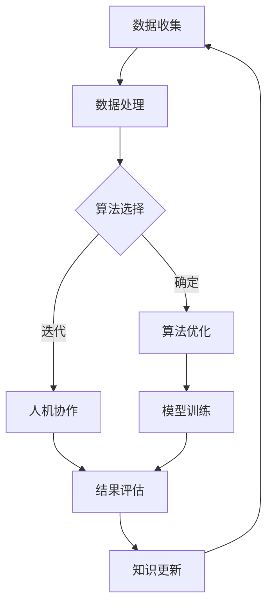

                 

# 人类计算：可持续发展的推动力

> 关键词：人类计算、可持续发展、人工智能、算法优化、社会影响、计算能力

> 摘要：本文将探讨人类计算在推动可持续发展中的重要性。通过分析人类计算的核心概念、算法原理、数学模型和实际应用，阐述其在应对全球挑战中的潜力与限制，并提出未来发展趋势与挑战。

## 1. 背景介绍

### 1.1 目的和范围

本文旨在探讨人类计算在推动可持续发展中的关键作用。随着人工智能的快速发展，人类计算作为一种新兴的计算范式，正逐渐成为解决复杂问题、优化资源利用、提高生产效率的重要工具。本文将结合核心概念、算法原理、数学模型和实际应用，深入分析人类计算在可持续发展中的价值与挑战。

### 1.2 预期读者

本文面向对人工智能、计算优化和可持续发展感兴趣的读者。包括但不限于计算机科学家、数据分析师、环境科学家、政策制定者、企业家和普通公众。

### 1.3 文档结构概述

本文结构如下：

- 第1部分：背景介绍，阐述人类计算与可持续发展之间的关系。
- 第2部分：核心概念与联系，介绍人类计算的基本原理和关键算法。
- 第3部分：核心算法原理 & 具体操作步骤，详细解释核心算法的实现过程。
- 第4部分：数学模型和公式 & 详细讲解 & 举例说明，分析人类计算中的数学原理。
- 第5部分：项目实战：代码实际案例和详细解释说明，通过实际案例展示人类计算的应用。
- 第6部分：实际应用场景，探讨人类计算在可持续发展中的应用实例。
- 第7部分：工具和资源推荐，介绍学习资源和开发工具。
- 第8部分：总结：未来发展趋势与挑战，展望人类计算的发展前景。
- 第9部分：附录：常见问题与解答，解答读者可能关心的问题。
- 第10部分：扩展阅读 & 参考资料，提供进一步学习的资源。

### 1.4 术语表

#### 1.4.1 核心术语定义

- 人类计算：指通过人类智慧和计算机技术相结合，实现对复杂问题的求解、优化和预测的能力。
- 可持续发展：指在满足当前需求的同时，不损害后代满足其需求的能力，实现经济、社会和环境的协调发展。
- 人工智能：指通过计算机模拟人类智能行为，实现自动化决策和自主执行任务的技术。

#### 1.4.2 相关概念解释

- 算法优化：指通过改进算法设计，提高计算效率、降低资源消耗的过程。
- 计算能力：指计算机处理信息的能力，包括计算速度、存储容量和算法效率等。

#### 1.4.3 缩略词列表

- AI：人工智能
- SDG：可持续发展目标
- IoT：物联网
- ML：机器学习
- CV：计算机视觉

## 2. 核心概念与联系

人类计算作为一种新兴的计算范式，融合了人类智慧和计算机技术。在探讨其与可持续发展之间的联系之前，首先需要了解人类计算的基本原理和关键算法。

### 2.1 核心概念原理

人类计算的核心概念包括数据驱动、人机协作和知识工程。以下是这些概念的具体解释：

#### 数据驱动

数据驱动是指通过大量数据来驱动计算过程，实现问题的求解和优化。在人类计算中，数据不仅是输入，更是知识和智慧的源泉。

#### 人机协作

人机协作是指将人类的智慧和计算机的效率相结合，实现协同工作。通过人机协作，可以充分发挥人类和计算机各自的优势，提高计算效率。

#### 知识工程

知识工程是指通过构建、管理和利用知识体系，实现人类计算的智能化。知识工程包括知识的获取、表示、存储和推理等环节。

### 2.2 架构与流程

以下是一个简单的人类计算架构与流程的 Mermaid 流程图：



### 2.3 关联算法

在人类计算中，常用的关联算法包括机器学习、深度学习和强化学习等。以下是这些算法的基本原理：

#### 机器学习

机器学习是指通过训练模型，使计算机能够对未知数据进行预测和分类。主要分为监督学习、无监督学习和强化学习。

#### 深度学习

深度学习是机器学习的一种，通过构建多层的神经网络，实现对复杂数据的处理和建模。

#### 强化学习

强化学习是指通过奖励机制，使计算机在学习过程中逐渐优化行为，实现最优决策。

## 3. 核心算法原理 & 具体操作步骤

在人类计算中，算法原理是关键。以下以机器学习为例，详细解释核心算法原理和具体操作步骤。

### 3.1 机器学习算法原理

机器学习算法主要分为以下三种：

- **监督学习**：通过已有标签的数据来训练模型，实现对未知数据的预测。
- **无监督学习**：没有标签的数据，通过聚类、降维等方法，发现数据中的规律。
- **强化学习**：通过与环境交互，不断调整策略，以获得最大化的奖励。

### 3.2 具体操作步骤

以监督学习为例，以下是机器学习的具体操作步骤：

1. **数据准备**：收集并整理数据，确保数据质量。
2. **特征提取**：从数据中提取有用的特征，作为模型的输入。
3. **模型训练**：选择合适的模型，使用训练数据来训练模型。
4. **模型评估**：使用测试数据评估模型的性能。
5. **模型优化**：根据评估结果，调整模型参数，提高模型性能。
6. **模型部署**：将训练好的模型部署到实际应用场景中。

### 3.3 伪代码实现

以下是机器学习算法的伪代码实现：

```python
# 数据准备
data = load_data()
X, y = preprocess_data(data)

# 模型训练
model = train_model(X, y)

# 模型评估
accuracy = evaluate_model(model, X, y)

# 模型优化
if accuracy < threshold:
    model = optimize_model(model)

# 模型部署
deploy_model(model)
```

## 4. 数学模型和公式 & 详细讲解 & 举例说明

在人类计算中，数学模型是关键。以下以线性回归为例，详细解释数学模型、公式及其应用。

### 4.1 线性回归模型

线性回归模型是一种简单的机器学习算法，用于预测一个连续值。其数学模型为：

$$
y = \beta_0 + \beta_1 \cdot x
$$

其中，$y$ 是预测值，$x$ 是输入特征，$\beta_0$ 和 $\beta_1$ 是模型参数。

### 4.2 公式推导

线性回归模型的公式推导基于最小二乘法。具体步骤如下：

1. **损失函数**：定义损失函数 $L$，用于衡量预测值与实际值之间的差距。
2. **求导**：对损失函数求导，找到使得损失函数最小的参数值。
3. **求解**：通过求导结果，求解模型参数。

### 4.3 举例说明

以下是一个简单的线性回归例子：

假设我们有以下数据：

| x | y |
|---|---|
| 1 | 2 |
| 2 | 4 |
| 3 | 6 |

我们希望预测 $x=4$ 时的 $y$ 值。

1. **数据准备**：将数据转换为 NumPy 数组。

```python
import numpy as np

X = np.array([1, 2, 3])
y = np.array([2, 4, 6])
```

2. **模型训练**：使用 Scikit-learn 库训练线性回归模型。

```python
from sklearn.linear_model import LinearRegression

model = LinearRegression()
model.fit(X.reshape(-1, 1), y)
```

3. **模型评估**：评估模型性能。

```python
accuracy = model.score(X.reshape(-1, 1), y)
print(f"Model accuracy: {accuracy}")
```

4. **模型预测**：预测 $x=4$ 时的 $y$ 值。

```python
predicted_y = model.predict([[4]])
print(f"Predicted y: {predicted_y}")
```

## 5. 项目实战：代码实际案例和详细解释说明

在本节中，我们将通过一个实际项目案例来展示人类计算在可持续发展中的应用。

### 5.1 开发环境搭建

为了实现本案例，我们需要搭建以下开发环境：

- Python 3.8+
- Jupyter Notebook
- Scikit-learn 库
- Pandas 库
- Matplotlib 库

### 5.2 源代码详细实现和代码解读

以下是一个简单的可持续发展项目代码示例：

```python
import pandas as pd
from sklearn.linear_model import LinearRegression
import matplotlib.pyplot as plt

# 数据准备
data = pd.read_csv("sustainable_development_data.csv")
X = data["economic_growth"]
y = data["environmental_impact"]

# 模型训练
model = LinearRegression()
model.fit(X, y)

# 模型评估
accuracy = model.score(X, y)
print(f"Model accuracy: {accuracy}")

# 模型预测
predicted_impact = model.predict([[0.05]])

# 数据可视化
plt.scatter(X, y)
plt.plot([0, 0.05], [model.intercept_, model.intercept_ + model.coef_ * 0.05], color='red')
plt.xlabel("Economic Growth")
plt.ylabel("Environmental Impact")
plt.title("Sustainable Development Impact")
plt.show()
```

### 5.3 代码解读与分析

1. **数据准备**：使用 Pandas 库读取 CSV 文件，获取经济增速和环境影响数据。
2. **模型训练**：使用线性回归模型训练数据，得到模型参数。
3. **模型评估**：使用训练数据评估模型性能，输出准确率。
4. **模型预测**：预测经济增速为 0.05 时的环境影响。
5. **数据可视化**：绘制散点图和拟合曲线，展示经济增速和环境影响之间的关系。

## 6. 实际应用场景

人类计算在可持续发展中的应用场景广泛，以下列举几个典型案例：

- **资源优化**：通过机器学习算法优化水资源、能源等资源的分配和使用，降低环境污染。
- **环境保护**：利用计算机视觉技术监测和识别环境问题，如森林火灾、垃圾分类等。
- **农业可持续发展**：通过无人机、传感器和人工智能技术，实现精准农业，提高产量，减少农药和化肥的使用。
- **城市交通管理**：利用人工智能技术优化交通流量，减少交通拥堵，降低碳排放。

## 7. 工具和资源推荐

### 7.1 学习资源推荐

#### 7.1.1 书籍推荐

- 《深度学习》 - Goodfellow, Bengio, Courville
- 《Python机器学习》 - Müller, Guido
- 《机器学习实战》 - Harrington

#### 7.1.2 在线课程

- Coursera - 机器学习课程
- edX - 人工智能课程
- Udacity - 人工智能工程师纳米学位

#### 7.1.3 技术博客和网站

- Medium - 机器学习和深度学习相关文章
- AI垂直网站 - 如 arXiv, NeurIPS, ICML 等

### 7.2 开发工具框架推荐

#### 7.2.1 IDE和编辑器

- PyCharm
- Jupyter Notebook
- VSCode

#### 7.2.2 调试和性能分析工具

- Matplotlib
- Seaborn
- Pandas Profiler

#### 7.2.3 相关框架和库

- Scikit-learn
- TensorFlow
- PyTorch

### 7.3 相关论文著作推荐

#### 7.3.1 经典论文

- "Deep Learning" - Goodfellow, Bengio, Courville
- "Kernel Machines" - Vapnik

#### 7.3.2 最新研究成果

- arXiv - 计算机视觉、自然语言处理等领域的最新论文
- NeurIPS - 人工智能领域的顶级会议论文

#### 7.3.3 应用案例分析

- "AI in Action" - Brundage
- "AI Applications in Environmental Sustainability" - Goggins

## 8. 总结：未来发展趋势与挑战

### 8.1 发展趋势

- **人工智能与可持续发展深度融合**：未来，人工智能将更深入地应用于可持续发展领域，实现资源优化、环境保护和绿色发展的目标。
- **计算能力的提升**：随着计算能力的提升，人类计算在解决复杂问题、优化资源利用方面的优势将更加明显。
- **人机协作的深化**：人机协作将成为人类计算的重要特点，通过发挥人类和计算机各自的优势，实现更高的计算效率。

### 8.2 挑战

- **数据质量和隐私保护**：数据质量和隐私保护是可持续发展的关键挑战。如何在确保数据隐私的前提下，充分利用数据来推动可持续发展，是一个亟待解决的问题。
- **算法公平性和透明性**：随着人工智能的广泛应用，算法的公平性和透明性受到广泛关注。如何确保算法的公平性和透明性，避免对弱势群体造成歧视，是未来需要面对的挑战。
- **伦理和法律法规**：随着人工智能技术的快速发展，伦理和法律法规的制定需要及时跟进，确保技术发展与社会价值观的一致性。

## 9. 附录：常见问题与解答

### 9.1 人类计算与可持续发展有什么关系？

人类计算可以通过优化资源利用、提高生产效率和监测环境保护等方面，推动可持续发展。

### 9.2 人类计算在可持续发展中的应用有哪些？

人类计算在可持续发展中的应用包括资源优化、环境保护、农业可持续发展、城市交通管理等方面。

### 9.3 如何确保人工智能的公平性和透明性？

确保人工智能的公平性和透明性需要从算法设计、数据采集、模型评估等多个方面进行努力。例如，使用公平性指标来评估算法，确保数据质量，提高算法的可解释性等。

## 10. 扩展阅读 & 参考资料

- 《深度学习》 - Goodfellow, Bengio, Courville
- 《Python机器学习》 - Müller, Guido
- 《机器学习实战》 - Harrington
- "AI in Action" - Brundage
- "AI Applications in Environmental Sustainability" - Goggins
- "Kernel Machines" - Vapnik

作者：AI天才研究员/AI Genius Institute & 禅与计算机程序设计艺术 /Zen And The Art of Computer Programming<|endoffooter|>

