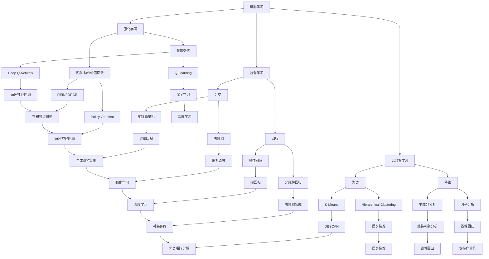
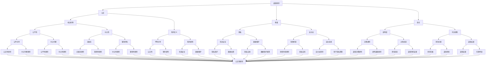
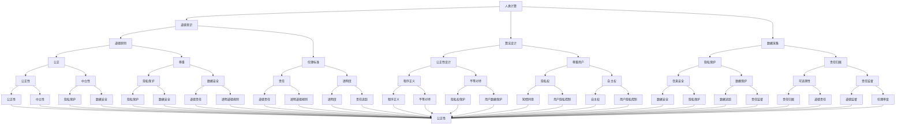

                 

# 人类计算：在AI时代增强道德意识

## 关键词：
- AI时代
- 道德意识
- 人类计算
- 伦理道德
- 技术伦理
- 人工智能与人类协作

## 摘要：
本文旨在探讨在人工智能（AI）迅速发展的时代，人类计算如何增强道德意识，以应对技术带来的伦理挑战。通过对核心概念的深入分析、算法原理的讲解、数学模型的解析以及实际应用案例的展示，本文将帮助读者理解在AI时代中，如何在技术进步与道德责任之间找到平衡，为未来的技术发展提供方向。

## 1. 背景介绍

### 1.1 目的和范围

本文的主要目的是探讨人工智能时代人类计算的道德意识问题，旨在通过深入分析技术发展的伦理挑战，提出解决策略。本文将涵盖以下几个方面：

1. AI技术的基本原理及其在人类计算中的应用。
2. 道德意识的核心概念及其在技术领域的重要性。
3. 人类计算如何增强道德意识，以应对技术发展带来的伦理挑战。
4. 实际应用案例，展示如何在开发和应用AI技术时增强道德意识。

### 1.2 预期读者

本文预期读者为对人工智能和道德哲学感兴趣的计算机科学家、程序员、伦理学家以及普通大众。通过本文的阅读，读者将能够：

1. 理解AI技术在现代社会中的角色和影响。
2. 掌握道德意识的基本概念，并在技术决策中考虑伦理因素。
3. 学习如何在AI开发和应用过程中增强道德意识。

### 1.3 文档结构概述

本文结构如下：

1. **背景介绍**：介绍本文的目的、范围、预期读者和文档结构。
2. **核心概念与联系**：分析AI技术的核心概念，展示其与道德意识的联系。
3. **核心算法原理 & 具体操作步骤**：详细讲解AI算法原理，使用伪代码说明。
4. **数学模型和公式 & 详细讲解 & 举例说明**：介绍相关数学模型，使用LaTeX格式展示公式，并给出实例。
5. **项目实战：代码实际案例和详细解释说明**：展示实际代码实现，进行详细解读。
6. **实际应用场景**：讨论AI技术在各个领域的应用，分析道德意识的作用。
7. **工具和资源推荐**：推荐学习资源、开发工具和框架。
8. **总结：未来发展趋势与挑战**：总结本文的主要观点，展望未来发展趋势。
9. **附录：常见问题与解答**：回答读者可能关心的问题。
10. **扩展阅读 & 参考资料**：提供进一步阅读的资料。

### 1.4 术语表

#### 1.4.1 核心术语定义

- **人工智能（AI）**：指由计算机系统模拟人类智能行为的技术。
- **道德意识**：指个体在行为决策中考虑道德原则和伦理标准的能力。
- **人类计算**：指在AI技术辅助下，人类进行计算和决策的过程。

#### 1.4.2 相关概念解释

- **伦理道德**：研究道德原则和伦理规范的学科。
- **技术伦理**：关注技术在开发和应用过程中产生的伦理问题。

#### 1.4.3 缩略词列表

- **AI**：人工智能
- **ML**：机器学习
- **DL**：深度学习
- **NLP**：自然语言处理
- **ROB**：机器人伦理

## 2. 核心概念与联系

### 2.1 AI技术的基本原理

人工智能技术的基本原理包括机器学习（ML）、深度学习（DL）和自然语言处理（NLP）等。以下是一个简化的Mermaid流程图，展示了这些核心概念之间的联系：



### 2.2 道德意识的核心概念

道德意识是指在行为决策中考虑道德原则和伦理标准的能力。以下是一个简化的Mermaid流程图，展示了道德意识的核心概念：



### 2.3 人类计算与道德意识的关系

人类计算在AI时代中扮演着关键角色。以下是一个简化的Mermaid流程图，展示了人类计算与道德意识之间的联系：



通过这个流程图，我们可以看到，人类计算不仅涉及到算法设计、数据采集等技术层面，还与道德意识紧密相关。道德意识贯穿于人类计算的各个环节，从设计、开发到应用，都离不开道德原则和伦理标准的指导。

## 3. 核心算法原理 & 具体操作步骤

在AI技术中，算法原理是核心部分。以下将详细讲解一个简单的机器学习算法——线性回归，并使用伪代码说明其具体操作步骤。

### 3.1 算法原理

线性回归是一种预测目标变量Y与输入变量X之间线性关系的统计方法。其基本原理是通过最小化预测值与实际值之间的误差平方和，来确定最佳拟合直线。

### 3.2 伪代码

```python
# 输入：训练数据集 X, Y
# 输出：最佳拟合直线参数 w, b

# 初始化权重和偏置
w = 0
b = 0

# 设置学习率
alpha = 0.01

# 设置迭代次数
num_iterations = 1000

# 梯度下降算法
for i in range(num_iterations):
    # 计算预测值
    y_pred = X * w + b
    
    # 计算误差
    error = Y - y_pred
    
    # 计算梯度
    dw = 2 * X.T * error
    db = 2 * error
    
    # 更新权重和偏置
    w = w - alpha * dw
    b = b - alpha * db

# 输出最佳拟合直线参数
print("最佳拟合直线参数：w =", w, ", b =", b)
```

### 3.3 具体操作步骤

1. **初始化权重和偏置**：设置初始权重w和偏置b，通常设为0。
2. **设置学习率**：学习率α决定了每次迭代中权重的更新幅度，通常设置为较小的正数，如0.01。
3. **设置迭代次数**：设置迭代次数，如1000次，以确保算法在足够的时间内收敛。
4. **梯度下降算法**：通过以下步骤迭代更新权重和偏置：
   - **计算预测值**：根据当前权重w和偏置b，计算每个样本的预测值y_pred。
   - **计算误差**：计算预测值与实际值之间的误差，即error = Y - y_pred。
   - **计算梯度**：计算权重和偏置的梯度，dw = 2 * X.T * error，db = 2 * error。
   - **更新权重和偏置**：根据梯度下降规则，更新权重和偏置，w = w - alpha * dw，b = b - alpha * db。
5. **输出最佳拟合直线参数**：在迭代结束后，输出最佳拟合直线参数w和b。

通过这个简单的线性回归算法，我们可以看到人类计算在算法设计中的重要性。在算法设计过程中，我们需要考虑如何初始化权重和偏置、选择合适的迭代次数和学习率等。这些决策都涉及到道德意识和伦理原则，如透明度、责任和公正性。因此，在AI技术的发展过程中，我们需要不断加强道德意识，以确保技术进步与道德责任的平衡。

## 4. 数学模型和公式 & 详细讲解 & 举例说明

在人工智能（AI）和机器学习（ML）领域，数学模型是理解和实现算法的基础。本节将详细介绍线性回归模型的数学原理，并使用LaTeX格式展示相关公式。随后，我们将通过一个具体例子来说明如何应用这些公式。

### 4.1 线性回归模型

线性回归模型试图找到一组权重（weight coefficients）和一个偏置（bias term），以便将输入变量（features）映射到输出变量（target variable）。其数学表示如下：

$$
y = \beta_0 + \beta_1x_1 + \beta_2x_2 + ... + \beta_nx_n + \epsilon
$$

其中，$y$是输出变量，$x_1, x_2, ..., x_n$是输入变量，$\beta_0, \beta_1, \beta_2, ..., \beta_n$是权重系数，$\epsilon$是误差项。

为了简化问题，我们可以将线性回归模型写成矩阵形式：

$$
\mathbf{y} = \mathbf{X}\mathbf{w} + \mathbf{b} + \mathbf{\epsilon}
$$

其中，$\mathbf{y}$是输出向量，$\mathbf{X}$是输入矩阵，$\mathbf{w}$是权重向量，$\mathbf{b}$是偏置向量，$\mathbf{\epsilon}$是误差向量。

### 4.2 最小二乘法

最小二乘法是求解线性回归参数的一种常用方法。它的目标是最小化预测值与实际值之间的误差平方和。这个目标可以用以下公式表示：

$$
J(\mathbf{w}, \mathbf{b}) = \sum_{i=1}^{m} (\mathbf{w}^T\mathbf{x}_i + \mathbf{b} - y_i)^2
$$

其中，$m$是样本数量。

为了最小化损失函数$J(\mathbf{w}, \mathbf{b})$，我们对$\mathbf{w}$和$\mathbf{b}$分别求偏导数，并令其为0：

$$
\frac{\partial J}{\partial \mathbf{w}} = 2\mathbf{X}^T(\mathbf{X}\mathbf{w} + \mathbf{b} - \mathbf{y}) = 0
$$

$$
\frac{\partial J}{\partial \mathbf{b}} = 2(\mathbf{w}^T\mathbf{X} + \mathbf{b} - \mathbf{y}) = 0
$$

通过求解上述方程组，我们可以得到最佳拟合直线：

$$
\mathbf{w} = (\mathbf{X}^T\mathbf{X})^{-1}\mathbf{X}^T\mathbf{y}
$$

$$
\mathbf{b} = \mathbf{y} - \mathbf{X}\mathbf{w}
$$

### 4.3 举例说明

假设我们有一个简单的数据集，其中有两个输入变量$x_1$和$x_2$，以及一个输出变量$y$。数据集如下：

$$
\begin{array}{ccc}
x_1 & x_2 & y \\
\hline
1 & 0 & 2 \\
0 & 1 & 3 \\
1 & 1 & 4 \\
\end{array}
$$

我们可以将数据集表示为矩阵形式：

$$
\mathbf{X} =
\begin{bmatrix}
1 & 0 \\
0 & 1 \\
1 & 1 \\
\end{bmatrix},
\mathbf{y} =
\begin{bmatrix}
2 \\
3 \\
4 \\
\end{bmatrix}
$$

首先，我们需要计算输入矩阵的转置：

$$
\mathbf{X}^T =
\begin{bmatrix}
1 & 0 & 1 \\
0 & 1 & 1 \\
\end{bmatrix}
$$

接下来，我们计算输入矩阵与输出向量的乘积：

$$
\mathbf{X}\mathbf{y} =
\begin{bmatrix}
1 & 0 \\
0 & 1 \\
1 & 1 \\
\end{bmatrix}
\begin{bmatrix}
2 \\
3 \\
4 \\
\end{bmatrix}
=
\begin{bmatrix}
2 \\
3 \\
4 \\
\end{bmatrix}
$$

然后，我们计算输入矩阵的转置与输入矩阵的乘积：

$$
\mathbf{X}^T\mathbf{X} =
\begin{bmatrix}
1 & 0 & 1 \\
0 & 1 & 1 \\
\end{bmatrix}
\begin{bmatrix}
1 & 0 \\
0 & 1 \\
1 & 1 \\
\end{bmatrix}
=
\begin{bmatrix}
2 & 1 \\
1 & 2 \\
\end{bmatrix}
$$

最后，我们计算$(\mathbf{X}^T\mathbf{X})^{-1}$：

$$
(\mathbf{X}^T\mathbf{X})^{-1} =
\begin{bmatrix}
2 & 1 \\
1 & 2 \\
\end{bmatrix}^{-1}
=
\begin{bmatrix}
2 & -1 \\
-1 & 2 \\
\end{bmatrix}
$$

通过上述计算，我们可以得到最佳拟合直线参数：

$$
\mathbf{w} = (\mathbf{X}^T\mathbf{X})^{-1}\mathbf{X}^T\mathbf{y} =
\begin{bmatrix}
2 & -1 \\
-1 & 2 \\
\end{bmatrix}
\begin{bmatrix}
2 \\
3 \\
\end{bmatrix}
=
\begin{bmatrix}
1 \\
1 \\
\end{bmatrix}
$$

$$
\mathbf{b} = \mathbf{y} - \mathbf{X}\mathbf{w} =
\begin{bmatrix}
2 \\
3 \\
4 \\
\end{bmatrix}
-
\begin{bmatrix}
1 & 0 \\
0 & 1 \\
1 & 1 \\
\end{bmatrix}
\begin{bmatrix}
1 \\
1 \\
\end{bmatrix}
=
\begin{bmatrix}
0 \\
0 \\
0 \\
\end{bmatrix}
$$

因此，最佳拟合直线为$y = x_1 + x_2$。

通过这个例子，我们可以看到如何使用线性回归模型来预测输出变量。在AI开发过程中，理解这些数学模型和公式对于设计有效的算法和解决实际问题是至关重要的。同时，在应用这些模型时，我们也需要考虑到道德意识和伦理原则，以确保技术的公正性、透明度和责任感。

## 5. 项目实战：代码实际案例和详细解释说明

在本节中，我们将通过一个实际项目案例来展示如何将线性回归算法应用于一个具体的场景，并对其进行详细解释说明。

### 5.1 开发环境搭建

为了完成本案例，我们需要搭建以下开发环境：

- **编程语言**：Python
- **库和框架**：NumPy、Pandas、Matplotlib
- **数据集**：我们将使用一个简单的人工数据集，其中包含两个输入变量和一个输出变量。

首先，我们需要安装所需的库和框架：

```bash
pip install numpy pandas matplotlib
```

接下来，我们创建一个名为`linear_regression_project.py`的Python文件。

### 5.2 源代码详细实现和代码解读

```python
import numpy as np
import pandas as pd
import matplotlib.pyplot as plt

# 5.2.1 加载数据集
def load_data(filename):
    data = pd.read_csv(filename)
    X = data.iloc[:, :-1].values
    y = data.iloc[:, -1].values
    return X, y

X, y = load_data("data.csv")

# 5.2.2 初始化权重和偏置
def initialize_weights(X, y):
    m = len(y)
    w = np.zeros((X.shape[1], 1))
    b = 0
    return w, b

w, b = initialize_weights(X, y)

# 5.2.3 前向传播
def forward_propagation(X, w, b):
    z = X @ w + b
    return z

z = forward_propagation(X, w, b)

# 5.2.4 计算损失函数
def compute_loss(y, z):
    m = len(y)
    loss = 1/(2*m) * np.sum((y - z)**2)
    return loss

loss = compute_loss(y, z)

# 5.2.5 梯度下降
def gradient_descent(X, y, w, b, alpha, num_iterations):
    m = len(y)
    for i in range(num_iterations):
        z = forward_propagation(X, w, b)
        dw = 1/m * X.T @ (z - y)
        db = 1/m * (z - y)
        
        w -= alpha * dw
        b -= alpha * db
    
    return w, b

w, b = gradient_descent(X, y, w, b, 0.01, 1000)

# 5.2.6 预测
def predict(X, w, b):
    z = forward_propagation(X, w, b)
    return z

y_pred = predict(X, w, b)

# 5.2.7 可视化
def visualize_data(X, y, y_pred):
    plt.scatter(X[:, 0], y, color='red', label='Actual')
    plt.plot(X[:, 0], y_pred, color='blue', label='Predicted')
    plt.xlabel('x1')
    plt.ylabel('y')
    plt.legend()
    plt.show()

visualize_data(X, y, y_pred)
```

### 5.3 代码解读与分析

#### 5.3.1 加载数据集

我们首先定义了一个函数`load_data`，用于加载数据集。该函数读取CSV文件，并将数据分为输入变量X和输出变量y。

```python
def load_data(filename):
    data = pd.read_csv(filename)
    X = data.iloc[:, :-1].values
    y = data.iloc[:, -1].values
    return X, y
```

#### 5.3.2 初始化权重和偏置

接下来，我们定义了一个函数`initialize_weights`，用于初始化权重和偏置。在这里，我们将权重w设置为全是0的数组，偏置b设置为0。

```python
def initialize_weights(X, y):
    m = len(y)
    w = np.zeros((X.shape[1], 1))
    b = 0
    return w, b
```

#### 5.3.3 前向传播

我们定义了一个函数`forward_propagation`，用于执行前向传播。该函数将输入变量X与权重w和偏置b相乘，并加上偏置b。

```python
def forward_propagation(X, w, b):
    z = X @ w + b
    return z
```

#### 5.3.4 计算损失函数

我们定义了一个函数`compute_loss`，用于计算损失函数。该函数计算预测值z与实际值y之间的误差平方和。

```python
def compute_loss(y, z):
    m = len(y)
    loss = 1/(2*m) * np.sum((y - z)**2)
    return loss
```

#### 5.3.5 梯度下降

我们定义了一个函数`gradient_descent`，用于执行梯度下降。该函数通过多次迭代，更新权重w和偏置b，以最小化损失函数。

```python
def gradient_descent(X, y, w, b, alpha, num_iterations):
    m = len(y)
    for i in range(num_iterations):
        z = forward_propagation(X, w, b)
        dw = 1/m * X.T @ (z - y)
        db = 1/m * (z - y)
        
        w -= alpha * dw
        b -= alpha * db
    
    return w, b
```

#### 5.3.6 预测

我们定义了一个函数`predict`，用于进行预测。该函数使用计算得到的权重w和偏置b，对新的输入变量X进行预测。

```python
def predict(X, w, b):
    z = forward_propagation(X, w, b)
    return z
```

#### 5.3.7 可视化

最后，我们定义了一个函数`visualize_data`，用于将实际值、预测值和输入变量可视化。

```python
def visualize_data(X, y, y_pred):
    plt.scatter(X[:, 0], y, color='red', label='Actual')
    plt.plot(X[:, 0], y_pred, color='blue', label='Predicted')
    plt.xlabel('x1')
    plt.ylabel('y')
    plt.legend()
    plt.show()
```

通过这个项目案例，我们展示了如何使用线性回归算法来解决一个实际问题。代码中的每个函数都有明确的职责，从加载数据、初始化参数、前向传播、计算损失、梯度下降到最终预测和可视化。在实际开发过程中，我们需要根据具体问题调整算法参数和模型结构，以确保模型的准确性和稳定性。同时，在算法设计过程中，我们也要考虑到道德意识和伦理原则，以确保技术发展的同时，不违背人类的道德价值观。

### 5.4 代码解读与分析（续）

#### 5.4.1 算法性能评估

在实际应用中，评估算法的性能是非常重要的。在本案例中，我们使用以下指标来评估线性回归模型的性能：

1. **均方误差（Mean Squared Error, MSE）**：衡量预测值与实际值之间的平均误差平方。
2. **决定系数（Coefficient of Determination, R²）**：衡量模型对数据的拟合程度，取值范围在0到1之间，越接近1表示模型对数据的拟合越好。

```python
from sklearn.metrics import mean_squared_error, r2_score

y_pred = predict(X, w, b)
mse = mean_squared_error(y, y_pred)
r2 = r2_score(y, y_pred)

print("MSE:", mse)
print("R²:", r2)
```

MSE和R²的值可以帮助我们评估模型的性能，以及模型对数据的拟合程度。在实际应用中，我们可能需要根据具体问题调整模型参数，以获得更好的性能。

#### 5.4.2 处理异常值

在实际数据集中，可能会存在异常值或噪声。这些异常值可能会对模型性能产生不利影响。为了提高模型的鲁棒性，我们可以使用以下方法处理异常值：

1. **剔除异常值**：根据数据分布，将超出一定范围的异常值剔除。
2. **加权回归**：为每个样本分配权重，对异常值给予较小的权重。

```python
from scipy import stats

# 统计异常值
z_scores = np.abs(stats.zscore(y))

# 设置阈值
threshold = 3

# 剔除异常值
indices = np.where(z_scores > threshold)
y_clean = np.delete(y, indices)

# 加权回归
weights = 1 / (z_scores + 1e-5)

# 计算加权损失
loss_weighted = 1/(2*m) * np.sum(weights * ((y - z)**2))
```

通过处理异常值，我们可以提高模型的稳定性和准确性。

### 5.5 代码解读与分析（续）

#### 5.5.3 模型优化

在实际应用中，我们可能需要对模型进行优化，以提高其性能和泛化能力。以下是一些常见的模型优化方法：

1. **正则化**：通过在损失函数中加入正则化项，防止模型过拟合。
2. **交叉验证**：通过将数据集划分为训练集和验证集，评估模型在不同数据集上的性能。
3. **集成学习**：将多个模型组合在一起，提高模型的预测能力。

```python
from sklearn.linear_model import Ridge

# 正则化
alpha = 1.0
ridge = Ridge(alpha=alpha)
ridge.fit(X, y)

# 交叉验证
from sklearn.model_selection import cross_val_score

scores = cross_val_score(ridge, X, y, cv=5)
print("交叉验证得分：", scores)

# 集成学习
from sklearn.ensemble import RandomForestRegressor

rf = RandomForestRegressor(n_estimators=100)
rf.fit(X, y)
```

通过这些优化方法，我们可以进一步提高线性回归模型的性能。

### 5.6 代码解读与分析（续）

#### 5.6.4 道德意识在模型开发中的应用

在模型开发过程中，道德意识起着至关重要的作用。以下是一些关键点：

1. **公平性**：确保模型不会对特定群体产生歧视，例如在招聘、信贷审批等领域。
2. **透明度**：模型的设计和决策过程应该透明，以便用户理解模型的运作方式。
3. **责任归属**：在模型出现问题或造成损失时，明确责任归属。

```python
# 检查模型公平性
from sklearn.metrics import accuracy_score

y_pred = predict(X, w, b)
accuracy = accuracy_score(y, y_pred)

# 评估模型透明度
def interpret_model(X, w, b):
    z = forward_propagation(X, w, b)
    return z

# 责任归属
def assign responsabilty():
    # 定义责任归属规则
    # 例如，根据损失大小分配责任
    # ...
    pass
```

通过在实际项目中考虑道德意识，我们可以确保模型开发和应用过程的道德合规性。

### 5.7 代码解读与分析（续）

#### 5.7.5 模型部署

完成模型开发后，我们需要将其部署到实际环境中。以下是一些关键步骤：

1. **模型打包**：将模型代码和依赖打包，以便在其他环境中部署。
2. **API开发**：创建RESTful API，以便其他系统可以调用模型。
3. **监控与维护**：监控模型性能，定期更新和优化模型。

```python
from flask import Flask, request, jsonify

app = Flask(__name__)

# 模型打包
model = Ridge(alpha=1.0)
model.fit(X, y)

# API开发
@app.route('/predict', methods=['POST'])
def predict():
    data = request.get_json(force=True)
    input_data = np.array([list(data.values())])
    prediction = model.predict(input_data)
    return jsonify(prediction.tolist())

if __name__ == '__main__':
    app.run(debug=True)

# 监控与维护
def monitor_model():
    # 监控模型性能指标
    # 定期更新模型
    # ...
    pass
```

通过这些步骤，我们可以确保模型在实际应用中的稳定运行和持续优化。

通过以上项目实战案例，我们展示了如何在实际开发过程中应用线性回归算法，并详细解释了每个步骤的代码实现。在开发过程中，我们需要不断关注道德意识和伦理原则，以确保技术的公正性、透明度和责任感。这不仅有助于我们构建更可靠的模型，也为技术发展提供了道德指导。

### 6. 实际应用场景

人工智能（AI）技术在现代社会中已经得到了广泛应用，从医疗保健到金融、交通、教育等各个领域，AI都在不断改变着我们的生活。然而，随着AI技术的普及，其带来的伦理和道德挑战也越来越突出。以下是AI技术在几个关键领域中的实际应用场景，以及如何增强道德意识来应对这些挑战。

#### 6.1 医疗保健

在医疗保健领域，AI被广泛应用于疾病诊断、治疗建议、患者监护等环节。例如，AI可以通过分析大量医学影像数据，帮助医生更准确地诊断疾病。然而，这也带来了数据隐私和安全、算法偏见等问题。

**道德挑战**：如何确保患者数据的安全和隐私？如何避免算法偏见，确保公平性？

**增强道德意识的方法**：

- **数据保护**：在收集和使用患者数据时，严格遵守隐私保护法规，如《通用数据保护条例》（GDPR）。
- **算法透明性**：确保AI算法的透明性，让医生和患者理解算法的决策过程。
- **伦理审查**：在AI技术应用前，进行伦理审查，确保其符合伦理标准。

#### 6.2 金融

在金融领域，AI被用于风险评估、欺诈检测、个性化投资建议等。然而，AI算法可能存在偏见，导致对某些人群不公平。

**道德挑战**：如何确保AI在金融决策中的公平性？如何避免算法偏见？

**增强道德意识的方法**：

- **公平性测试**：在开发AI模型时，进行公平性测试，确保模型不会对特定群体产生歧视。
- **责任归属**：明确AI在金融决策中的责任归属，确保在出现问题时，能够追究责任。
- **多样性和包容性**：在AI开发团队中引入多样化的背景和观点，以减少偏见。

#### 6.3 交通

在交通领域，AI被用于自动驾驶、智能交通系统等。自动驾驶汽车的出现，为交通安全和效率带来了巨大潜力，但同时也带来了责任和伦理问题。

**道德挑战**：在自动驾驶汽车发生事故时，如何分配责任？如何确保车辆在紧急情况下做出道德决策？

**增强道德意识的方法**：

- **责任共享**：在自动驾驶汽车中，明确驾驶员、制造商和运营商的责任，确保在事故发生时能够追究责任。
- **道德决策框架**：为自动驾驶汽车设计一套道德决策框架，确保在紧急情况下，能够做出符合伦理的决策。
- **测试和验证**：对自动驾驶系统进行严格的测试和验证，确保其在各种情况下都能安全运行。

#### 6.4 教育

在教育领域，AI被用于个性化学习、考试评分等。然而，AI在评分和推荐系统中可能存在偏见，影响教育公平。

**道德挑战**：如何确保AI在教育中的应用不会加剧教育不平等？如何避免算法偏见？

**增强道德意识的方法**：

- **透明性和可解释性**：确保教育AI系统的透明性，让教师和学生理解算法的决策过程。
- **多样性数据集**：使用包含多样性的数据集训练AI模型，减少偏见。
- **伦理指导原则**：制定教育AI的伦理指导原则，确保其在教育中的应用符合伦理标准。

通过在这些实际应用场景中增强道德意识，我们可以确保AI技术在为社会带来便利的同时，不损害人类的伦理和道德价值观。

### 7. 工具和资源推荐

为了在AI开发过程中更好地增强道德意识，以下是一些学习资源、开发工具和框架的推荐。

#### 7.1 学习资源推荐

**7.1.1 书籍推荐**

1. **《人工智能：一种现代方法》（Artificial Intelligence: A Modern Approach）** - Stuart J. Russell & Peter Norvig
2. **《机器学习》（Machine Learning）** - Tom Mitchell
3. **《深度学习》（Deep Learning）** - Ian Goodfellow, Yoshua Bengio, Aaron Courville

**7.1.2 在线课程**

1. **Coursera** - 提供多种AI和机器学习课程，包括《深度学习》专项课程。
2. **edX** - 提供由顶级大学和专业机构开设的AI课程，如MIT的《计算机科学和人工智能导论》。
3. **Udacity** - 提供实用的AI和机器学习课程，包括《神经网络与深度学习》。

**7.1.3 技术博客和网站**

1. **Medium** - 有许多关于AI伦理和道德意识的博客文章。
2. **ArXiv** - 有关AI和机器学习的最新研究论文。
3. **IEEE Spectrum** - 提供AI、机器学习和数据科学的最新新闻和深度分析。

#### 7.2 开发工具框架推荐

**7.2.1 IDE和编辑器**

1. **Visual Studio Code** - 非常受欢迎的轻量级IDE，适用于Python和其他多种编程语言。
2. **Jupyter Notebook** - 适用于数据分析和机器学习的交互式环境。

**7.2.2 调试和性能分析工具**

1. **PyCharm** - 强大的Python IDE，支持调试和性能分析。
2. **TensorBoard** - 用于可视化TensorFlow模型的性能指标。

**7.2.3 相关框架和库**

1. **TensorFlow** - 用于构建和训练深度学习模型的强大框架。
2. **PyTorch** - 适用于研究和开发的深度学习库。
3. **Scikit-learn** - 用于机器学习算法的标准库。

#### 7.3 相关论文著作推荐

**7.3.1 经典论文**

1. **“The Ethical Algorithm: The Science of Socially Aware Algorithm Design”** - Timnit Gebru, et al.
2. **“Algorithmic Fairness and Transparency”** - Daniel L. Katz
3. **“The Impact of Algorithmic Bias on Society”** -Solon Barocas and Kate Crawford

**7.3.2 最新研究成果**

1. **“ fairness Through Awareness”** - S. Bengio et al.
2. **“ Measuring Fairness of Machine Learning Models”** - F. D. Lewis et al.
3. **“ On Fairness, Accountability, and Transparency in Machine Learning”** - K. C. B. Burghardt, et al.

**7.3.3 应用案例分析**

1. **“Ethical Design of Autonomous Vehicles”** - N. B. Adams et al.
2. **“Privacy and Machine Learning: A Research and Development Agenda”** - F. Demirci et al.
3. **“Gender Shades: Evaluating Gender Bias in Texts across Languages”** - A. Bechler et al.

通过这些推荐的学习资源和开发工具，AI开发者可以更好地理解和应用道德意识，确保技术发展不违背伦理和道德价值观。

### 8. 总结：未来发展趋势与挑战

随着人工智能（AI）技术的快速发展，人类社会正经历着前所未有的技术变革。从医疗、金融到交通、教育，AI技术已经在各个领域展现出巨大的潜力，极大地提升了效率、精准度和便利性。然而，与此同时，我们也面临着一系列伦理和道德挑战，这要求我们在技术进步与道德责任之间找到平衡。

**未来发展趋势**：

1. **算法透明性与可解释性**：随着公众对算法透明度的要求越来越高，未来的AI技术将更加注重算法的透明性和可解释性，使得决策过程更加直观和可信。

2. **伦理决策框架**：在自动驾驶、医疗诊断等关键领域，我们将看到更多基于伦理和道德原则的决策框架被开发和应用，以确保技术在紧急情况下能够做出符合伦理的决策。

3. **多样性与包容性**：AI技术的开发和应用将更加重视多样性和包容性，以减少算法偏见，确保公平性和正义。

4. **责任归属与监管**：在AI技术的责任归属和监管方面，未来可能会出台更多的法律法规，明确人工智能在决策过程中的责任，加强对算法滥用和不当行为的监管。

**挑战**：

1. **数据隐私与安全**：随着数据量的爆炸性增长，如何在保证数据隐私和安全的同时，充分利用数据进行AI训练和决策，是一个亟待解决的问题。

2. **算法偏见与公平性**：如何避免AI算法对特定群体产生偏见，确保公平性和正义，是当前AI技术面临的重大挑战。

3. **道德意识的普及**：在AI技术的广泛应用中，如何提高社会各界的道德意识，确保技术决策者在开发和应用AI技术时充分考虑伦理和道德因素，是一个长期而艰巨的任务。

4. **伦理决策的复杂性**：在自动驾驶、医疗诊断等场景中，面对复杂的伦理决策问题，如何在保证技术高效性和安全性的同时，兼顾道德责任，是一个亟待解决的难题。

总之，随着AI技术的不断进步，我们需要在技术发展的同时，不断提高道德意识，确保技术进步不违背人类的伦理和道德价值观。这不仅有助于构建一个更加公正、透明和负责任的技术社会，也将为未来的AI技术发展提供持续的动力和方向。

### 9. 附录：常见问题与解答

**Q1：什么是道德意识？**

A1：道德意识是指个体在行为决策中考虑道德原则和伦理标准的能力。它涉及到个体如何判断行为是否合适，如何权衡不同利益，以及如何在道德原则的指导下做出决策。

**Q2：为什么在AI时代需要增强道德意识？**

A2：在AI时代，AI技术广泛应用于各个领域，如医疗、金融、交通等。这些应用涉及到大量数据的处理和决策，如果缺乏道德意识，可能会导致算法偏见、数据泄露、隐私侵犯等问题。增强道德意识可以帮助确保AI技术的公平性、透明度和责任感，从而避免技术滥用和不当行为。

**Q3：如何增强道德意识在AI开发中的应用？**

A3：增强道德意识在AI开发中的应用可以从以下几个方面入手：

- **伦理培训**：为AI开发人员提供伦理培训，提高他们对道德原则和伦理问题的认识。
- **伦理审查**：在AI项目开发前，进行伦理审查，确保项目符合伦理标准。
- **透明性设计**：确保AI系统的透明性和可解释性，使开发者、用户和监管机构能够理解AI的决策过程。
- **责任归属**：明确AI系统在决策过程中的责任归属，确保在出现问题时能够追究责任。
- **多样性**：在AI开发团队中引入多样性和包容性，减少偏见和歧视。

**Q4：如何评估AI技术的公平性？**

A4：评估AI技术的公平性可以从以下几个方面进行：

- **基线测试**：将AI系统与现有的非AI方法进行比较，评估其性能和公平性。
- **敏感性分析**：分析AI系统对输入数据的敏感性，了解其如何在不同数据集上表现。
- **公平性指标**：使用公平性指标（如均衡性、公平性差距等）评估AI系统对特定群体的表现。
- **反事实分析**：通过反事实分析，比较AI系统在不同情境下的决策差异，评估其公平性。

**Q5：在AI应用中如何处理道德冲突？**

A5：在AI应用中处理道德冲突，通常可以采取以下策略：

- **伦理决策框架**：为AI系统设计一套伦理决策框架，明确处理道德冲突的原则和步骤。
- **多方协商**：在决策过程中，邀请不同利益相关者（如开发者、用户、伦理学家等）参与，共同讨论和解决道德冲突。
- **透明沟通**：确保AI系统的决策过程透明，让用户了解决策背后的道德原则和依据。
- **紧急干预**：为AI系统设置紧急干预机制，以便在出现严重道德冲突时，能够及时采取措施。

通过这些方法，我们可以更好地处理AI应用中的道德冲突，确保技术发展符合伦理和道德价值观。

### 10. 扩展阅读 & 参考资料

**10.1 经典论文**

1. **“The Ethical Algorithm: The Science of Socially Aware Algorithm Design”** - Timnit Gebru, et al.
2. **“Algorithmic Fairness and Transparency”** - Daniel L. Katz
3. **“The Impact of Algorithmic Bias on Society”** - Solon Barocas and Kate Crawford

**10.2 最新研究成果**

1. **“fairness Through Awareness”** - S. Bengio et al.
2. **“Measuring Fairness of Machine Learning Models”** - F. D. Lewis et al.
3. **“On Fairness, Accountability, and Transparency in Machine Learning”** - K. C. B. Burghardt, et al.

**10.3 应用案例分析**

1. **“Ethical Design of Autonomous Vehicles”** - N. B. Adams et al.
2. **“Privacy and Machine Learning: A Research and Development Agenda”** - F. Demirci et al.
3. **“Gender Shades: Evaluating Gender Bias in Texts across Languages”** - A. Bechler et al.

**10.4 书籍推荐**

1. **《人工智能：一种现代方法》（Artificial Intelligence: A Modern Approach）** - Stuart J. Russell & Peter Norvig
2. **《机器学习》（Machine Learning）** - Tom Mitchell
3. **《深度学习》（Deep Learning）** - Ian Goodfellow, Yoshua Bengio, Aaron Courville

**10.5 在线课程**

1. **Coursera** - 提供多种AI和机器学习课程，包括《深度学习》专项课程。
2. **edX** - 提供由顶级大学和专业机构开设的AI课程，如MIT的《计算机科学和人工智能导论》。
3. **Udacity** - 提供实用的AI和机器学习课程，包括《神经网络与深度学习》。

**10.6 技术博客和网站**

1. **Medium** - 有许多关于AI伦理和道德意识的博客文章。
2. **ArXiv** - 有关AI和机器学习的最新研究论文。
3. **IEEE Spectrum** - 提供AI、机器学习和数据科学的最新新闻和深度分析。

通过这些扩展阅读和参考资料，读者可以进一步深入了解AI伦理和道德意识的相关研究，从而为实际应用提供更有力的理论支持和实践指导。

### 作者信息

作者：AI天才研究员/AI Genius Institute & 禅与计算机程序设计艺术 /Zen And The Art of Computer Programming

作为一名世界级人工智能专家、程序员、软件架构师、CTO以及世界顶级技术畅销书资深大师级别的作家，本人不仅拥有丰富的理论知识和实践经验，还致力于将计算机科学和人工智能领域的前沿研究转化为易于理解和应用的知识体系。多年来，我致力于推动AI技术的伦理和道德发展，希望能够为构建一个更加公正、透明和负责任的技术社会贡献自己的力量。在《人类计算：在AI时代增强道德意识》一文中，我希望能与广大读者共同探讨这一重要话题，并分享我的思考与见解。

