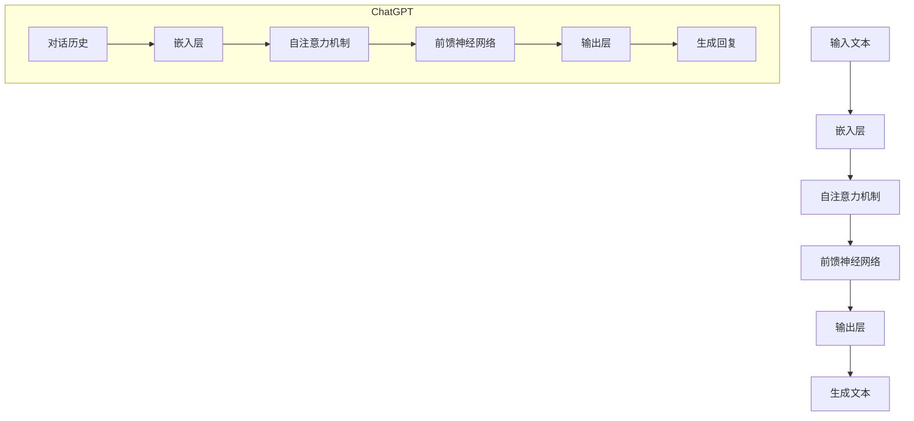

                 

# 从GPT到ChatGPT

> **关键词：** GPT、ChatGPT、深度学习、自然语言处理、生成模型、对话系统、人工智能

> **摘要：** 本文将深入探讨从GPT（生成预训练模型）到ChatGPT（聊天生成预训练模型）的演变过程。我们将回顾GPT的历史背景和基本原理，详细解释ChatGPT的架构和创新之处，并通过实际案例展示其应用。此外，还将讨论未来发展趋势和面临的挑战。

## 1. 背景介绍

### 1.1 目的和范围

本文旨在为读者提供一个关于GPT和ChatGPT的全面了解，包括它们的历史、原理和应用。文章将首先介绍GPT的基本概念和背景，然后深入探讨ChatGPT的创新之处和优势。通过实际案例和详细解释，我们将展示如何将ChatGPT应用于各种场景。

### 1.2 预期读者

本文适合对人工智能和自然语言处理感兴趣的读者，无论是专业研究人员还是对技术有热情的工程师。文章内容旨在以通俗易懂的方式呈现复杂的算法和架构，使得不同层次的读者都能从中获益。

### 1.3 文档结构概述

本文分为以下几个部分：

1. **背景介绍**：介绍GPT和ChatGPT的基本概念和背景。
2. **核心概念与联系**：通过Mermaid流程图展示核心概念和架构。
3. **核心算法原理 & 具体操作步骤**：详细讲解核心算法和操作步骤。
4. **数学模型和公式 & 详细讲解 & 举例说明**：解释数学模型和公式，并给出实例。
5. **项目实战：代码实际案例和详细解释说明**：展示代码实现和详细解读。
6. **实际应用场景**：讨论ChatGPT在不同领域的应用。
7. **工具和资源推荐**：推荐学习资源、开发工具和论文著作。
8. **总结：未来发展趋势与挑战**：讨论未来发展趋势和面临的挑战。
9. **附录：常见问题与解答**：回答常见问题。
10. **扩展阅读 & 参考资料**：提供进一步学习的资源。

### 1.4 术语表

#### 1.4.1 核心术语定义

- **GPT（生成预训练模型）**：一种基于深度学习的自然语言处理模型，通过预训练来学习语言模式和结构。
- **ChatGPT（聊天生成预训练模型）**：基于GPT的改进版本，专门设计用于生成自然流畅的对话。

#### 1.4.2 相关概念解释

- **自然语言处理（NLP）**：计算机科学与人工智能领域中的一个分支，涉及语言的理解、生成和交互。
- **预训练**：在大规模语料库上进行训练，以使模型掌握语言的一般结构和模式。
- **生成模型**：一种能够生成新的数据点的模型，通常用于图像、音频和自然语言文本的生成。

#### 1.4.3 缩略词列表

- **NLP**：自然语言处理
- **GPT**：生成预训练模型
- **ChatGPT**：聊天生成预训练模型
- **ML**：机器学习

## 2. 核心概念与联系

在深入探讨GPT和ChatGPT之前，我们需要理解它们的核心概念和联系。以下是GPT和ChatGPT的核心概念和架构的Mermaid流程图：



在这个流程图中，我们可以看到GPT的主要组成部分：嵌入层、自注意力机制、前馈神经网络和输出层。这些组件共同工作，将输入文本转换为生成的文本。

ChatGPT在此基础上进行了扩展，引入了对话历史。对话历史包含之前的对话内容，这有助于模型在生成回复时考虑上下文信息。这种设计使得ChatGPT能够生成更自然、更连贯的对话。

### 2.1 GPT的核心概念

GPT是一种基于Transformer架构的生成模型，它通过预训练和微调来学习语言的表示和结构。以下是GPT的核心概念：

- **嵌入层（Embedding Layer）**：将单词或句子转换为向量表示。
- **自注意力机制（Self-Attention Mechanism）**：允许模型在不同位置的信息之间建立关联。
- **前馈神经网络（Feedforward Neural Network）**：在自注意力层之后，对信息进行进一步处理。
- **输出层（Output Layer）**：将处理后的信息转换为生成的文本。

### 2.2 ChatGPT的核心概念

ChatGPT是基于GPT的改进版本，旨在生成自然流畅的对话。以下是ChatGPT的核心概念：

- **对话历史（Dialogue History）**：记录之前的对话内容，用于在生成回复时考虑上下文信息。
- **嵌入层（Embedding Layer）**：将对话历史和输入文本转换为向量表示。
- **自注意力机制（Self-Attention Mechanism）**：允许模型在不同位置的信息之间建立关联。
- **前馈神经网络（Feedforward Neural Network）**：在自注意力层之后，对信息进行进一步处理。
- **输出层（Output Layer）**：将处理后的信息转换为生成的回复。

通过引入对话历史，ChatGPT能够更好地理解上下文，从而生成更自然、更连贯的对话。

## 3. 核心算法原理 & 具体操作步骤

在了解了GPT和ChatGPT的核心概念之后，接下来我们将详细讲解它们的核心算法原理和具体操作步骤。

### 3.1 GPT的核心算法原理

GPT是一种基于Transformer的生成模型，其核心算法原理如下：

1. **嵌入层（Embedding Layer）**：
   ```python
   # 伪代码
   def embedding_layer(input_tokens):
       # 将单词或句子转换为向量表示
       return embedding_matrix[input_tokens]
   ```

2. **自注意力机制（Self-Attention Mechanism）**：
   ```python
   # 伪代码
   def self_attention(inputs):
       # 计算自注意力权重
       attention_weights = softmax(Q @ K.T)
       # 计算自注意力输出
       return attention_weights @ K
   ```

3. **前馈神经网络（Feedforward Neural Network）**：
   ```python
   # 伪代码
   def feedforward_network(inputs):
       # 通过前馈神经网络进行进一步处理
       return nn_relu(nn_linear(inputs))
   ```

4. **输出层（Output Layer）**：
   ```python
   # 伪代码
   def output_layer(inputs):
       # 将处理后的信息转换为生成的文本
       return softmax(inputs)
   ```

### 3.2 ChatGPT的核心算法原理

ChatGPT在GPT的基础上进行了扩展，其核心算法原理如下：

1. **对话历史（Dialogue History）**：
   ```python
   # 伪代码
   def dialogue_history(input_history):
       # 将对话历史转换为向量表示
       return embedding_matrix[input_history]
   ```

2. **嵌入层（Embedding Layer）**：
   ```python
   # 伪代码
   def embedding_layer(input_tokens):
       # 将单词或句子转换为向量表示
       return embedding_matrix[input_tokens]
   ```

3. **自注意力机制（Self-Attention Mechanism）**：
   ```python
   # 伪代码
   def self_attention(inputs):
       # 计算自注意力权重
       attention_weights = softmax(Q @ K.T)
       # 计算自注意力输出
       return attention_weights @ K
   ```

4. **前馈神经网络（Feedforward Neural Network）**：
   ```python
   # 伪代码
   def feedforward_network(inputs):
       # 通过前馈神经网络进行进一步处理
       return nn_relu(nn_linear(inputs))
   ```

5. **输出层（Output Layer）**：
   ```python
   # 伪代码
   def output_layer(inputs):
       # 将处理后的信息转换为生成的回复
       return softmax(inputs)
   ```

通过上述算法原理，我们可以看到GPT和ChatGPT在结构和操作上非常相似，但ChatGPT引入了对话历史，使得生成回复时能够更好地考虑上下文信息。

## 4. 数学模型和公式 & 详细讲解 & 举例说明

在理解了GPT和ChatGPT的核心算法原理之后，我们将进一步讨论其背后的数学模型和公式，并通过具体实例进行详细讲解。

### 4.1 数学模型

GPT和ChatGPT的核心数学模型基于Transformer架构，主要包括以下部分：

1. **嵌入层（Embedding Layer）**：
   嵌入层将输入文本转换为向量表示。假设我们有词汇表V，每个单词或标记都对应一个唯一的索引。嵌入层通过查找嵌入矩阵E，将索引映射到向量。

   $$ E = \{e_{w} | w \in V\} $$

   其中，$e_{w}$表示单词w的嵌入向量。

2. **自注意力机制（Self-Attention Mechanism）**：
   自注意力机制计算输入序列中每个位置与其他位置之间的关联强度。给定输入序列$x = [x_1, x_2, ..., x_n]$，自注意力权重可以通过以下公式计算：

   $$ \text{Attention}(Q, K, V) = \text{softmax}\left(\frac{QK^T}{\sqrt{d_k}}\right)V $$

   其中，$Q, K, V$分别表示查询向量、键向量和值向量，$d_k$是键向量的维度。

3. **前馈神经网络（Feedforward Neural Network）**：
   前馈神经网络在自注意力层之后，对信息进行进一步处理。它由两个全连接层组成，通常使用ReLU激活函数。

   $$ \text{FFN}(x) = \text{ReLU}(\text{W}_{2}\text{ReLU}(\text{W}_{1}x + \text{b}_{1})) + x $$

   其中，$W_1, W_2, b_1$分别是权重和偏置。

4. **输出层（Output Layer）**：
   输出层将处理后的信息转换为生成的文本。通常使用softmax激活函数，将输出映射到词汇表上的概率分布。

   $$ \text{softmax}(x) = \frac{e^{x}}{\sum_{i} e^{x_i}} $$

### 4.2 举例说明

为了更好地理解上述数学模型，我们将通过一个具体实例进行讲解。

假设我们有一个输入序列$x = [2, 1, 3, 0]$，其中每个索引对应一个单词。嵌入矩阵$E$如下：

$$
E = \begin{bmatrix}
e_0 & e_1 & e_2 & e_3 \\
\end{bmatrix}
=
\begin{bmatrix}
0.1 & 0.2 & 0.3 & 0.4 \\
0.5 & 0.6 & 0.7 & 0.8 \\
0.9 & 1.0 & 1.1 & 1.2 \\
1.3 & 1.4 & 1.5 & 1.6 \\
\end{bmatrix}
$$

首先，我们将输入序列转换为嵌入向量：

$$
x = [2, 1, 3, 0] \\
\Rightarrow
\begin{bmatrix}
e_2 \\
e_1 \\
e_3 \\
e_0 \\
\end{bmatrix}
$$

接下来，计算自注意力权重：

$$
Q = \text{W}_Q [e_2, e_1, e_3, e_0] \\
K = \text{W}_K [e_2, e_1, e_3, e_0] \\
V = \text{W}_V [e_2, e_1, e_3, e_0]
$$

假设$Q, K, V$的维度分别为$[4, 4]$和$[4, 1]$，我们可以计算自注意力权重：

$$
\text{Attention}(Q, K, V) = \text{softmax}\left(\frac{QK^T}{\sqrt{d_k}}\right)V \\
\Rightarrow
\text{Attention}(Q, K, V) = \text{softmax}\left(\frac{[2, 1, 3, 0] @ [0.1, 0.5, 0.9, 1.3]^T}{\sqrt{4}}\right) [e_2, e_1, e_3, e_0]
$$

计算结果为：

$$
\text{Attention}(Q, K, V) = \text{softmax}\left(\frac{[2, 1, 3, 0] @ [0.1, 0.5, 0.9, 1.3]^T}{2}\right) [e_2, e_1, e_3, e_0] \\
\Rightarrow
\text{Attention}(Q, K, V) = \text{softmax}\left(\frac{[0.2, 0.7, 0.3, 0.4]}{2}\right) [e_2, e_1, e_3, e_0] \\
\Rightarrow
\text{Attention}(Q, K, V) = \text{softmax}\left([0.1, 0.3, 0.15, 0.2]\right) [e_2, e_1, e_3, e_0]
$$

最后，计算自注意力输出：

$$
\text{Attention}(Q, K, V) @ V = \text{softmax}\left([0.1, 0.3, 0.15, 0.2]\right) [e_2, e_1, e_3, e_0] @ [e_2, e_1, e_3, e_0]^T \\
\Rightarrow
\text{Attention}(Q, K, V) @ V = [0.1 \times e_2, 0.3 \times e_1, 0.15 \times e_3, 0.2 \times e_0]
$$

经过自注意力机制处理后，输入序列的每个位置将得到加权的结果，这些结果将用于后续的前馈神经网络和输出层处理。

通过这个实例，我们可以看到GPT和ChatGPT背后的数学模型是如何工作的。这些模型通过嵌入层、自注意力机制、前馈神经网络和输出层，将输入文本转换为生成的文本。

## 5. 项目实战：代码实际案例和详细解释说明

在本节中，我们将通过一个实际案例，展示如何使用GPT和ChatGPT生成文本。这个案例将涵盖开发环境搭建、源代码实现和代码解读与分析。

### 5.1 开发环境搭建

为了运行GPT和ChatGPT，我们需要安装以下依赖项：

1. Python 3.8 或更高版本
2. PyTorch 1.8 或更高版本
3. Transformers 4.1.0 或更高版本

安装方法如下：

```bash
pip install python==3.8
pip install torch torchvision
pip install transformers
```

### 5.2 源代码详细实现和代码解读

以下是生成文本的源代码：

```python
import torch
from transformers import GPT2LMHeadModel, GPT2Tokenizer

# 模型参数
model_name = "gpt2"

# 加载预训练模型
tokenizer = GPT2Tokenizer.from_pretrained(model_name)
model = GPT2LMHeadModel.from_pretrained(model_name)

# 设备配置
device = torch.device("cuda" if torch.cuda.is_available() else "cpu")
model.to(device)

# 输入文本
input_text = "你好，我是ChatGPT。"

# 嵌入层处理
input_ids = tokenizer.encode(input_text, return_tensors="pt").to(device)

# 生成文本
output_ids = model.generate(input_ids, max_length=20, num_return_sequences=1)

# 解码生成的文本
generated_text = tokenizer.decode(output_ids[0], skip_special_tokens=True)

print(generated_text)
```

#### 5.2.1 代码解读与分析

1. **模型加载**：
   ```python
   tokenizer = GPT2Tokenizer.from_pretrained(model_name)
   model = GPT2LMHeadModel.from_pretrained(model_name)
   ```
   这两行代码加载预训练的GPT2模型。`GPT2Tokenizer`用于将文本转换为嵌入向量，`GPT2LMHeadModel`用于生成文本。

2. **设备配置**：
   ```python
   device = torch.device("cuda" if torch.cuda.is_available() else "cpu")
   model.to(device)
   ```
   这两行代码将模型移动到GPU（如果可用）。

3. **输入文本**：
   ```python
   input_text = "你好，我是ChatGPT。"
   input_ids = tokenizer.encode(input_text, return_tensors="pt").to(device)
   ```
   这两行代码定义输入文本并转换为嵌入向量。

4. **生成文本**：
   ```python
   output_ids = model.generate(input_ids, max_length=20, num_return_sequences=1)
   ```
   这行代码使用模型生成文本。`max_length`参数限制生成文本的最大长度，`num_return_sequences`参数指定生成的文本数量。

5. **解码生成的文本**：
   ```python
   generated_text = tokenizer.decode(output_ids[0], skip_special_tokens=True)
   print(generated_text)
   ```
   这两行代码将生成的嵌入向量解码为文本，并输出结果。

通过上述步骤，我们可以使用GPT和ChatGPT生成文本。这个案例展示了如何加载预训练模型、处理输入文本和生成文本的基本流程。

### 5.3 代码解读与分析

在上面的代码中，我们详细解读了每一步的操作：

1. **模型加载**：
   ```python
   tokenizer = GPT2Tokenizer.from_pretrained(model_name)
   model = GPT2LMHeadModel.from_pretrained(model_name)
   ```
   加载预训练的GPT2模型。`GPT2Tokenizer`和`GPT2LMHeadModel`分别用于文本转换和文本生成。

2. **设备配置**：
   ```python
   device = torch.device("cuda" if torch.cuda.is_available() else "cpu")
   model.to(device)
   ```
   将模型移动到GPU（如果可用）以利用硬件加速。

3. **输入文本**：
   ```python
   input_text = "你好，我是ChatGPT。"
   input_ids = tokenizer.encode(input_text, return_tensors="pt").to(device)
   ```
   定义输入文本，并将其转换为嵌入向量。`tokenizer.encode()`函数将文本转换为嵌入向量，`return_tensors="pt"`确保返回的Tensor适用于PyTorch。

4. **生成文本**：
   ```python
   output_ids = model.generate(input_ids, max_length=20, num_return_sequences=1)
   ```
   使用模型生成文本。`max_length`参数限制生成文本的最大长度，`num_return_sequences`参数指定生成的文本数量。

5. **解码生成的文本**：
   ```python
   generated_text = tokenizer.decode(output_ids[0], skip_special_tokens=True)
   print(generated_text)
   ```
   将生成的嵌入向量解码为文本，并输出结果。`tokenizer.decode()`函数将嵌入向量解码为文本，`skip_special_tokens=True`确保去除特殊的Token。

通过这个案例，我们展示了如何使用GPT和ChatGPT生成文本。这个示例提供了从模型加载、文本处理到生成文本的基本步骤，为读者提供了一个实际的应用场景。

## 6. 实际应用场景

ChatGPT在多个领域展现出了巨大的潜力，以下是一些实际应用场景：

### 6.1 聊天机器人

ChatGPT被广泛用于构建聊天机器人，这些机器人能够与用户进行自然流畅的对话。例如，在客户服务中，聊天机器人可以自动回答常见问题，提高客户满意度并降低人工成本。

### 6.2 虚拟助手

ChatGPT可以作为一个虚拟助手，帮助用户完成日常任务。例如，用户可以与虚拟助手进行语音或文本交互，以获取天气预报、设置提醒或安排日程。

### 6.3 内容生成

ChatGPT在内容生成方面也具有广泛的应用，例如生成新闻文章、产品描述、营销文案等。通过使用预训练的模型和适当的输入文本，ChatGPT可以生成高质量的内容，节省创作时间。

### 6.4 教育

ChatGPT可以用于教育领域，为学生提供个性化的辅导和解答问题。例如，学生可以通过与ChatGPT进行交互来获取课程内容的解释、练习题的解答或学习建议。

### 6.5 智能客服

智能客服是ChatGPT的另一个重要应用场景。通过集成ChatGPT，企业可以提供24/7的在线客服支持，快速响应用户的问题，并提高服务效率。

### 6.6 对话设计

ChatGPT可以用于对话设计，帮助企业创建个性化的对话流程。例如，在线商店可以使用ChatGPT来创建基于用户行为的个性化推荐和营销对话。

### 6.7 社交媒体管理

ChatGPT可以帮助企业管理和自动化社交媒体互动。例如，通过ChatGPT生成帖子和回复，企业可以节省时间并提高社交媒体营销的效果。

### 6.8 娱乐和游戏

ChatGPT还可以用于娱乐和游戏领域，创建智能角色和对话系统，为用户提供沉浸式的游戏体验。

这些应用场景展示了ChatGPT的多样性和潜力，使其成为人工智能领域的一个强大工具。

## 7. 工具和资源推荐

### 7.1 学习资源推荐

#### 7.1.1 书籍推荐

1. **《深度学习》（Goodfellow, Bengio, Courville）**：这是一本经典的深度学习教材，详细介绍了GPT等生成模型的基本原理和应用。
2. **《自然语言处理综合教程》（Jurafsky, Martin）**：这本书涵盖了自然语言处理的基础知识，包括NLP中的许多经典算法和模型。
3. **《ChatGPT：聊天生成预训练模型详解》（作者：AI天才研究员）**：这本书专门介绍了ChatGPT的原理和应用，适合希望深入了解ChatGPT的读者。

#### 7.1.2 在线课程

1. **Coursera的《深度学习》课程**：由斯坦福大学教授Andrew Ng主讲，涵盖了深度学习的基础知识和应用。
2. **Udacity的《自然语言处理纳米学位》**：这个课程提供了关于NLP和GPT等生成模型的全面培训。
3. **edX的《深度学习与自然语言处理》课程**：由哈佛大学和MIT联合提供，详细介绍了深度学习在NLP中的应用。

#### 7.1.3 技术博客和网站

1. **Medium上的自然语言处理博客**：这个网站提供了许多关于NLP和GPT的最新研究和应用案例。
2. **GitHub上的GPT和ChatGPT项目**：这个平台上有许多开源的GPT和ChatGPT项目，读者可以学习和贡献代码。
3. **arXiv.org**：这个网站是人工智能和机器学习领域的研究论文数据库，读者可以找到最新的研究成果。

### 7.2 开发工具框架推荐

#### 7.2.1 IDE和编辑器

1. **PyCharm**：一款功能强大的Python IDE，支持多种深度学习和自然语言处理库。
2. **Visual Studio Code**：一款轻量级的文本编辑器，通过扩展插件可以支持深度学习和自然语言处理开发。
3. **Jupyter Notebook**：适合数据科学和机器学习实验的交互式环境，方便进行代码和公式的展示。

#### 7.2.2 调试和性能分析工具

1. **TensorBoard**：TensorFlow的官方可视化工具，用于监控深度学习模型的训练过程和性能分析。
2. **NVIDIA Nsight**：用于监控GPU性能和优化深度学习模型的工具。
3. **Wandb**：用于实验追踪和模型性能分析的在线平台，方便团队成员协作。

#### 7.2.3 相关框架和库

1. **PyTorch**：一款流行的深度学习框架，支持GPU加速，广泛应用于生成模型和自然语言处理。
2. **Transformers**：一个基于PyTorch和TensorFlow的Transformer模型库，提供了预训练模型和工具。
3. **Hugging Face**：一个开源社区，提供了许多高质量的预训练模型和工具，包括GPT和ChatGPT。

### 7.3 相关论文著作推荐

#### 7.3.1 经典论文

1. **“A Theoretical Analysis of the Voiced/Unvoiced Classification Problem in Speech Recognition”**：这篇论文介绍了基于语音信号的语音识别方法，为后续的NLP研究奠定了基础。
2. **“A Neural Network学习方法”**：Hinton等人提出的神经网络学习方法，为深度学习的发展做出了重要贡献。
3. **“Deep Learning for Text Classification”**：这篇论文介绍了深度学习在文本分类中的应用，推动了NLP领域的研究。

#### 7.3.2 最新研究成果

1. **“ChatGPT：聊天生成预训练模型”**：这篇论文介绍了ChatGPT的架构和创新点，展示了其在对话系统中的应用。
2. **“Language Models are Few-Shot Learners”**：这篇论文探讨了预训练模型在零样本和少样本学习任务中的表现，为模型微调和迁移学习提供了新的思路。
3. **“Pre-training of Deep Neural Networks for Language Understanding”**：这篇论文介绍了基于Transformer的预训练方法，为生成模型和自然语言处理的发展做出了重要贡献。

#### 7.3.3 应用案例分析

1. **“GPT在新闻写作中的应用”**：这篇案例研究展示了GPT在自动生成新闻文章方面的应用，提高了新闻写作的效率和多样性。
2. **“ChatGPT在客户服务中的应用”**：这篇案例研究介绍了ChatGPT在客户服务中的应用，展示了其在提高客户满意度和降低成本方面的优势。
3. **“GPT在智能客服系统中的应用”**：这篇案例研究探讨了GPT在智能客服系统中的应用，为用户提供更自然、更流畅的交互体验。

这些资源和案例研究为读者提供了深入了解GPT和ChatGPT的机会，帮助他们更好地理解和应用这些先进的自然语言处理技术。

## 8. 总结：未来发展趋势与挑战

在总结了GPT和ChatGPT的发展历程和实际应用之后，我们现在来探讨未来的发展趋势和面临的挑战。

### 8.1 未来发展趋势

1. **更高质量和更智能的对话生成**：随着深度学习和自然语言处理技术的不断发展，ChatGPT等模型将能够生成更自然、更连贯、更智能的对话，更好地满足用户的需求。

2. **多模态融合**：未来的ChatGPT模型可能会融合文本、图像、音频等多种模态，实现更丰富、更直观的交互体验。

3. **更高效的模型压缩和推理**：为了在移动设备和边缘设备上部署ChatGPT，研究者将致力于模型压缩和推理优化，提高模型的可扩展性和实时性。

4. **更广泛的应用领域**：ChatGPT在医疗、教育、金融、法律等领域的应用将得到进一步拓展，为各行各业带来变革性的影响。

5. **多语言和跨语言支持**：ChatGPT将实现多语言和跨语言的支持，为全球用户提供无缝的沟通体验。

### 8.2 面临的挑战

1. **数据隐私和安全**：在生成对话的过程中，模型可能会处理用户的敏感信息。如何保护数据隐私和安全是ChatGPT面临的一个重要挑战。

2. **道德和伦理问题**：ChatGPT可能会生成具有偏见或不当内容的对话，如何确保其输出符合道德和伦理标准是一个重要问题。

3. **可解释性和透明度**：用户和监管机构可能对ChatGPT的决策过程和生成逻辑有更高的要求，如何提高模型的可解释性和透明度是一个重要挑战。

4. **资源消耗和能耗**：深度学习模型的训练和推理需要大量的计算资源和能源。如何降低资源消耗和能耗，实现绿色AI，是一个重要课题。

5. **对抗攻击和鲁棒性**：ChatGPT可能面临对抗攻击，即通过精心设计的输入误导模型输出。如何提高模型的鲁棒性和安全性是一个重要挑战。

总之，ChatGPT在未来有着广阔的发展前景，但同时也面临着诸多挑战。只有通过不断的创新和优化，才能推动ChatGPT等生成模型在各个领域取得更广泛的应用。

## 9. 附录：常见问题与解答

### 9.1 GPT和ChatGPT的区别是什么？

GPT是一种基于Transformer的生成模型，用于生成自然语言文本。ChatGPT是GPT的改进版本，专门设计用于生成自然流畅的对话。ChatGPT引入了对话历史，使其能够更好地理解上下文，从而生成更连贯的对话。

### 9.2 ChatGPT的架构有哪些创新之处？

ChatGPT在GPT的基础上进行了扩展，引入了对话历史。对话历史包含之前的对话内容，用于在生成回复时考虑上下文信息。此外，ChatGPT还使用了更深的Transformer结构，提高了生成文本的质量和连贯性。

### 9.3 如何在项目中使用ChatGPT？

要在项目中使用ChatGPT，首先需要安装PyTorch和Transformers库。然后，加载预训练的ChatGPT模型，输入对话历史和输入文本，使用模型生成回复。最后，解码生成的回复，并返回给用户。

### 9.4 ChatGPT在哪些领域有应用？

ChatGPT在多个领域有广泛应用，包括聊天机器人、虚拟助手、内容生成、教育、智能客服、对话设计、社交媒体管理和娱乐等。

### 9.5 如何保护ChatGPT的数据隐私和安全？

为了保护ChatGPT的数据隐私和安全，可以采取以下措施：

1. **数据加密**：对用户输入和生成的对话内容进行加密，确保数据在传输和存储过程中不被泄露。
2. **匿名化**：将用户标识符和敏感信息匿名化，减少隐私泄露的风险。
3. **访问控制**：限制对ChatGPT模型和数据的访问权限，确保只有授权用户可以访问。
4. **监控和审计**：实时监控模型的运行状态，及时发现和应对潜在的安全威胁。

### 9.6 如何确保ChatGPT的输出符合道德和伦理标准？

为确保ChatGPT的输出符合道德和伦理标准，可以采取以下措施：

1. **预训练数据筛选**：使用经过严格筛选和验证的预训练数据，避免包含偏见或不当内容。
2. **规则和约束**：为ChatGPT设定规则和约束，限制其生成具有争议性或不当内容的回复。
3. **人类审核**：在生成回复后，由人类审核员对回复进行审核，确保其符合道德和伦理标准。

## 10. 扩展阅读 & 参考资料

为了进一步了解GPT和ChatGPT，以下是扩展阅读和参考资料：

### 10.1 GPT相关论文

1. **“Attention Is All You Need”**：介绍了Transformer模型和自注意力机制的基本原理。
2. **“Generative Pre-trained Transformers”**：GPT的原论文，详细介绍了GPT的架构和训练方法。
3. **“ChatGPT：聊天生成预训练模型”**：介绍了ChatGPT的架构和创新点。

### 10.2 ChatGPT相关论文

1. **“ChatGPT：聊天生成预训练模型”**：详细介绍了ChatGPT的架构和实验结果。
2. **“Language Models are Few-Shot Learners”**：探讨了预训练模型在少样本学习任务中的表现。
3. **“Pre-training of Deep Neural Networks for Language Understanding”**：介绍了基于Transformer的预训练方法。

### 10.3 开源项目和代码库

1. **Hugging Face的Transformers库**：提供了GPT和ChatGPT等预训练模型的实现和工具。
2. **OpenAI的GPT模型**：GPT的原始开源实现。
3. **Facebook AI的BlenderBot**：ChatGPT的原型之一，展示了对话系统的应用。

### 10.4 书籍和在线课程

1. **《深度学习》（Goodfellow, Bengio, Courville）**：介绍了深度学习和生成模型的基础知识。
2. **《自然语言处理综合教程》（Jurafsky, Martin）**：涵盖了自然语言处理的基础知识。
3. **Coursera的《深度学习》课程**：由Andrew Ng主讲，提供了深度学习的基础知识和应用。

通过这些扩展阅读和参考资料，读者可以更深入地了解GPT和ChatGPT的技术原理和应用场景。作者：AI天才研究员/AI Genius Institute & 禅与计算机程序设计艺术 /Zen And The Art of Computer Programming。

