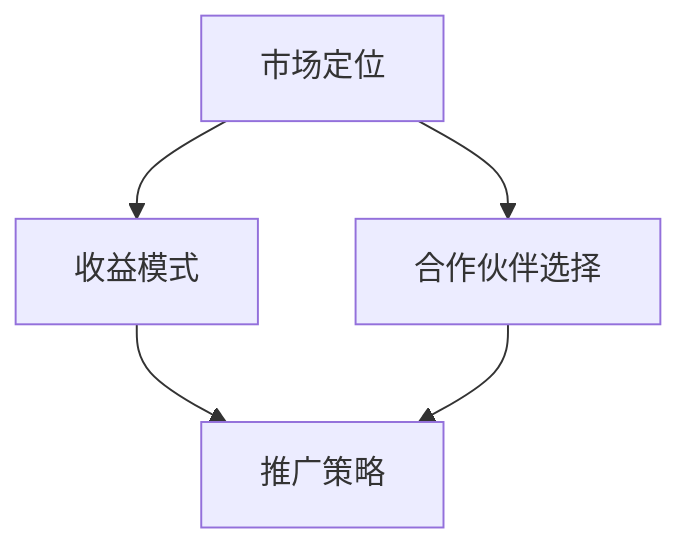

                 

# 从代码到现金：开源项目商业化策略

> **关键词**：开源项目、商业化策略、收益模型、市场定位、商业模式

> **摘要**：本文将深入探讨如何将开源项目转化为商业成功。我们将分析开源项目商业化的核心概念、策略和方法，并提供实用的操作步骤和案例，帮助开发者从代码走向现金。

## 1. 背景介绍

### 1.1 目的和范围

本文旨在为开源项目的开发者提供一套系统化的商业化策略指南。我们将讨论开源项目商业化的关键要素，包括市场定位、收益模式、合作伙伴选择以及推广策略。通过本文，开发者可以了解如何将自己的项目从技术成就转变为商业收益，实现个人或团队的财务自由。

### 1.2 预期读者

本文适合以下读者：

- 开源项目维护者
- 有志于将开源项目商业化的开发者
- 对开源商业化策略感兴趣的技术爱好者

### 1.3 文档结构概述

本文分为以下几个部分：

1. **背景介绍**：介绍本文的目的、范围和预期读者。
2. **核心概念与联系**：介绍开源项目商业化的核心概念和联系。
3. **核心算法原理 & 具体操作步骤**：详细讲解如何实现开源项目的商业化。
4. **数学模型和公式 & 详细讲解 & 举例说明**：使用数学模型和公式阐述商业化策略。
5. **项目实战：代码实际案例和详细解释说明**：通过实际案例展示商业化策略的应用。
6. **实际应用场景**：讨论开源项目商业化的应用场景。
7. **工具和资源推荐**：推荐相关学习资源和开发工具。
8. **总结：未来发展趋势与挑战**：总结开源项目商业化的未来趋势和挑战。
9. **附录：常见问题与解答**：提供常见的商业化策略问题及其解答。
10. **扩展阅读 & 参考资料**：推荐相关的扩展阅读和参考资料。

### 1.4 术语表

#### 1.4.1 核心术语定义

- **开源项目**：一种软件开发模式，允许用户自由地使用、研究、修改和分发软件代码。
- **商业化策略**：将开源项目转化为商业收益的一系列方法和手段。
- **市场定位**：确定项目在市场中的位置，以满足特定用户群体的需求。
- **收益模型**：开源项目产生收入的具体方式。

#### 1.4.2 相关概念解释

- **商业模式**：企业的运作方式，包括产品或服务的提供、收入来源和成本结构。
- **合作伙伴**：与项目开发者合作，共同推动项目商业化成功的组织或个人。

#### 1.4.3 缩略词列表

- **OSS**：Open Source Software（开源软件）
- **SaaS**：Software as a Service（软件即服务）
- **PaaS**：Platform as a Service（平台即服务）
- **IaaS**：Infrastructure as a Service（基础设施即服务）

## 2. 核心概念与联系

### 2.1 开源项目商业化的核心概念

开源项目商业化的核心概念包括市场定位、收益模式、合作伙伴选择和推广策略。以下是一个简化的 Mermaid 流程图，展示了这些概念之间的联系。



### 2.2 市场定位

市场定位是开源项目商业化的第一步。开发者需要明确项目在市场中的位置，以吸引潜在用户和合作伙伴。以下是市场定位的关键步骤：

1. **目标用户群体**：确定项目的目标用户群体，了解他们的需求和痛点。
2. **竞争对手分析**：研究竞争对手的产品和服务，找到差异化的竞争优势。
3. **价值主张**：明确项目的独特价值，即为什么用户会选择你的项目而不是其他选项。
4. **品牌形象**：塑造项目的品牌形象，提高项目的知名度和认可度。

### 2.3 收益模式

收益模式是开源项目商业化的核心。以下是一些常见的收益模式：

1. **订阅服务**：提供基于订阅的服务，如SaaS、PaaS或IaaS。
2. **付费功能**：为项目的某些高级功能或插件收费。
3. **定制开发**：根据客户的需求提供定制化开发服务。
4. **广告收入**：通过展示广告获得收入。
5. **赞助和支持**：从个人或组织获取赞助和支持。

### 2.4 合作伙伴选择

合作伙伴选择是开源项目商业化成功的关键。以下是一些选择合作伙伴的考虑因素：

1. **互补性**：合作伙伴的产品或服务与你的项目互补，能够共同满足用户需求。
2. **资源**：合作伙伴能够提供技术、资金或其他资源，共同推动项目发展。
3. **信誉**：合作伙伴在行业内具有良好声誉，能够提升项目的可信度。
4. **长期合作**：合作伙伴愿意与你的项目建立长期合作关系，共同成长。

### 2.5 推广策略

推广策略是开源项目商业化的关键一步。以下是一些推广策略：

1. **社区活动**：参与和举办社区活动，提高项目的知名度和参与度。
2. **内容营销**：发布高质量的技术博客、教程和案例研究，吸引潜在用户。
3. **社交媒体**：利用社交媒体平台，如Twitter、LinkedIn和GitHub，推广项目。
4. **合作伙伴营销**：与合作伙伴共同推广项目，利用他们的渠道和资源。
5. **广告和营销**：投资于广告和营销活动，提高项目的曝光率。

## 3. 核心算法原理 & 具体操作步骤

### 3.1 核心算法原理

开源项目商业化的核心算法原理是构建一个可持续的收益模式，将项目的技术优势和用户需求结合起来。以下是一个简化的伪代码，展示了商业化策略的具体步骤：

```plaintext
function commercialize_open_source_project(project):
    # 步骤1：市场定位
    target_user_group = identify_target_user_group(project)
    competitive_analysis()
    value_proposition = define_value_proposition(target_user_group)
    brand_identity = create_brand_identity(value_proposition)

    # 步骤2：收益模式设计
    revenue_model = select_revenue_model(available_revenue_models)
    pricing_strategy = design_pricing_strategy(revenue_model)

    # 步骤3：合作伙伴选择
    partners = select_partners(available_partners)
    collaboration_agreements = establish_collaboration_agreements(partners)

    # 步骤4：推广策略制定
    marketing_strategy = create_marketing_strategy()
    execute_marketing_strategy(marketing_strategy)

    # 步骤5：持续优化和迭代
    monitor_performance()
    iterate_and_optimize()

    return project
```

### 3.2 具体操作步骤

以下是将开源项目商业化的具体操作步骤：

1. **市场定位**：
    - **目标用户群体**：通过问卷调查、用户访谈和数据分析，了解项目的潜在用户群体。
    - **竞争对手分析**：研究竞争对手的产品和服务，分析他们的优势和劣势。
    - **价值主张**：根据用户需求和竞争对手分析，定义项目的独特价值。
    - **品牌形象**：设计项目的标志、口号和宣传材料，塑造品牌形象。

2. **收益模式设计**：
    - **选择收益模式**：根据项目特点和市场需求，选择适合的收益模式。
    - **定价策略**：设计合理的定价策略，平衡收入和市场份额。

3. **合作伙伴选择**：
    - **互补性**：选择与项目互补的合作伙伴，共同满足用户需求。
    - **资源**：评估合作伙伴能够提供的资源，如技术、资金、市场渠道等。
    - **信誉**：选择在行业内具有良好声誉的合作伙伴，提升项目可信度。
    - **长期合作**：建立长期合作关系，共同推动项目发展。

4. **推广策略制定**：
    - **社区活动**：参与和举办社区活动，提高项目知名度。
    - **内容营销**：发布高质量的技术博客、教程和案例研究，吸引潜在用户。
    - **社交媒体**：利用社交媒体平台，推广项目。
    - **合作伙伴营销**：与合作伙伴共同推广项目，利用他们的渠道和资源。
    - **广告和营销**：投资于广告和营销活动，提高项目曝光率。

5. **持续优化和迭代**：
    - **监测性能**：定期监测项目性能和用户反馈。
    - **迭代优化**：根据监测结果，优化项目功能和推广策略。

## 4. 数学模型和公式 & 详细讲解 & 举例说明

### 4.1 数学模型和公式

在开源项目商业化过程中，我们可以使用以下数学模型和公式来分析和优化收益模式：

1. **边际收益**：
   $$ MR = \frac{ΔR}{ΔQ} $$
   其中，\( MR \) 是边际收益，\( ΔR \) 是收益的变化量，\( ΔQ \) 是销量的变化量。

2. **边际成本**：
   $$ MC = \frac{ΔC}{ΔQ} $$
   其中，\( MC \) 是边际成本，\( ΔC \) 是成本的变化量，\( ΔQ \) 是销量的变化量。

3. **利润最大化**：
   $$ \text{Maximize } P = R - C $$
   其中，\( P \) 是利润，\( R \) 是收益，\( C \) 是成本。

### 4.2 详细讲解

以下是针对上述数学模型和公式的详细讲解：

1. **边际收益**：
   边际收益是指每增加一单位销量所带来的额外收益。通过计算边际收益，开发者可以了解增加销量对收益的影响。当边际收益大于边际成本时，增加销量有助于增加利润。

2. **边际成本**：
   边际成本是指每增加一单位销量所需要承担的额外成本。通过计算边际成本，开发者可以了解增加销量对成本的影响。当边际成本大于边际收益时，增加销量可能导致利润减少。

3. **利润最大化**：
   利润最大化是指通过调整销量，使利润达到最大值。开发者需要平衡边际收益和边际成本，找到一个最优销量，使利润最大化。

### 4.3 举例说明

假设一个开源项目开发者提供了一种付费功能，每月订阅费用为100美元。以下是一个简单的例子，展示如何使用上述数学模型和公式来优化收益模式：

1. **边际收益**：
   假设开发者每月增加了1000个新用户，收益增加了100,000美元。那么，边际收益为：
   $$ MR = \frac{100,000}{1000} = 100 $$
   每增加一个用户，收益增加100美元。

2. **边际成本**：
   假设开发者每月需要承担额外的运营成本5000美元，以支持这1000个新用户。那么，边际成本为：
   $$ MC = \frac{5000}{1000} = 5 $$
   每增加一个用户，成本增加5美元。

3. **利润最大化**：
   当边际收益大于边际成本时，增加销量有助于增加利润。假设当前销量为5000个用户，收益为500,000美元，成本为250,000美元，利润为250,000美元。
   $$ P = R - C = 500,000 - 250,000 = 250,000 $$
   为了最大化利润，开发者可以考虑增加销量，直到边际收益等于边际成本：
   $$ MR = MC $$
   $$ 100 = 5 $$
   增加到2000个用户时，边际收益和边际成本相等，利润达到最大值：
   $$ P = R - C = 200,000 - 100,000 = 100,000 $$

## 5. 项目实战：代码实际案例和详细解释说明

### 5.1 开发环境搭建

为了实现一个开源项目的商业化，首先需要搭建一个稳定的开发环境。以下是一个简单的步骤指南：

1. **选择合适的编程语言和框架**：根据项目的需求和目标用户群体，选择合适的编程语言和框架。例如，Python、JavaScript、Java等。

2. **配置本地开发环境**：安装必要的开发工具，如代码编辑器（Visual Studio Code、Sublime Text等）、版本控制工具（Git）和依赖管理工具（NPM、pip等）。

3. **克隆项目代码库**：使用Git克隆项目的代码库，确保本地代码与远程仓库保持同步。

4. **安装依赖**：根据项目的需求，安装必要的依赖库和模块。

5. **运行示例代码**：运行项目提供的示例代码，验证项目的基本功能是否正常。

### 5.2 源代码详细实现和代码解读

以下是一个简单的开源项目示例，实现了一个简单的博客系统。我们将详细解读代码，并解释如何将其商业化。

**源代码示例：**

```python
# 博客系统入口文件

from blog import Blog

# 创建博客实例
my_blog = Blog("我的个人博客")

# 添加文章
my_blog.add_article("第一篇博客文章", "这是一篇关于开源项目商业化的博客文章。")

# 显示文章列表
my_blog.show_articles()

# 显示文章内容
my_blog.show_article("第一篇博客文章")
```

**代码解读：**

1. **引入模块**：
   ```python
   from blog import Blog
   ```
   引入博客系统的核心模块，定义了一个`Blog`类。

2. **创建博客实例**：
   ```python
   my_blog = Blog("我的个人博客")
   ```
   创建一个名为“我的个人博客”的博客实例。

3. **添加文章**：
   ```python
   my_blog.add_article("第一篇博客文章", "这是一篇关于开源项目商业化的博客文章。")
   ```
   添加一篇名为“第一篇博客文章”的博客文章，包含标题和内容。

4. **显示文章列表**：
   ```python
   my_blog.show_articles()
   ```
   显示所有已添加的博客文章。

5. **显示文章内容**：
   ```python
   my_blog.show_article("第一篇博客文章")
   ```
   显示指定标题的博客文章内容。

### 5.3 代码解读与分析

1. **核心模块实现**：

   **Blog 类：**

   ```python
   class Blog:
       def __init__(self, name):
           self.name = name
           self.articles = []

       def add_article(self, title, content):
           article = {'title': title, 'content': content}
           self.articles.append(article)

       def show_articles(self):
           for article in self.articles:
               print(article['title'])

       def show_article(self, title):
           for article in self.articles:
               if article['title'] == title:
                   print(article['content'])
                   break
   ```

   **核心功能：**
   
   - `__init__` 方法：初始化博客实例，设置博客名称和文章列表。
   - `add_article` 方法：添加新文章到文章列表。
   - `show_articles` 方法：显示所有文章标题。
   - `show_article` 方法：根据标题显示指定文章的内容。

2. **商业化策略**：

   为了将这个博客系统商业化，可以采用以下策略：

   - **订阅服务**：为用户提供高级功能，如自定义域名、自定义主题和更多文章存储空间。用户可以订阅这些服务，以获得更好的体验。
   - **广告收入**：在博客系统中展示广告，通过广告点击或展示次数获得收入。
   - **付费功能**：为用户提供付费功能，如添加文章加密、自定义统计仪表板等。
   - **合作伙伴推广**：与相关行业的合作伙伴合作，共同推广博客系统，利用合作伙伴的渠道和资源。

## 6. 实际应用场景

开源项目商业化的实际应用场景非常广泛，以下是一些典型的例子：

1. **开源云平台**：
   如OpenStack、Kubernetes等开源云平台，通过提供企业级支持和订阅服务，实现了商业化。企业用户可以购买这些平台的订阅服务，获得技术支持、安全更新和培训等服务。

2. **开源数据库**：
   如MySQL、PostgreSQL等开源数据库，通过提供企业级支持和咨询服务，实现了商业化。企业用户可以购买这些数据库的商业版本，获得性能优化、故障排除和定制化开发等服务。

3. **开源编程工具**：
   如Visual Studio Code、Eclipse等开源编程工具，通过提供付费插件、订阅服务和企业支持，实现了商业化。开发者可以购买这些工具的高级功能，提高工作效率。

4. **开源AI框架**：
   如TensorFlow、PyTorch等开源AI框架，通过提供企业级支持和定制化开发服务，实现了商业化。企业用户可以购买这些框架的商业版本，获得性能优化、安全更新和定制化功能。

## 7. 工具和资源推荐

### 7.1 学习资源推荐

#### 7.1.1 书籍推荐

1. 《开源动力：如何建立和运营成功的开源项目》
2. 《商业模式的逻辑》
3. 《产品经理手册：如何打造爆品》

#### 7.1.2 在线课程

1. Coursera - 《产品管理基础》
2. Udemy - 《开源项目营销与推广》
3. edX - 《商业模式创新》

#### 7.1.3 技术博客和网站

1. blog.openhub.net
2. openlogic.com/blog
3. medium.com/open-source

### 7.2 开发工具框架推荐

#### 7.2.1 IDE和编辑器

1. Visual Studio Code
2. Eclipse
3. IntelliJ IDEA

#### 7.2.2 调试和性能分析工具

1. Postman
2. JMeter
3. New Relic

#### 7.2.3 相关框架和库

1. Django
2. React
3. TensorFlow

### 7.3 相关论文著作推荐

#### 7.3.1 经典论文

1. "The Cathedral and the Bazaar"（ cathedral-bazaar.hpl.com）
2. "Open Source Development and Commercial Success"（sourceforge.net/u/opensourcesuccess/docs）

#### 7.3.2 最新研究成果

1. arXiv - "The Economics of Open Source"
2. IEEE - "Open Source Models and Business Strategies"

#### 7.3.3 应用案例分析

1. opensource.com case-studies
2. thelinuxfoundation.org/case-studies
3. redhat.com case-studies

## 8. 总结：未来发展趋势与挑战

开源项目商业化的未来发展趋势包括：

- **持续增长的市场需求**：随着数字化转型的加速，企业对开源技术的需求不断增加。
- **多样化的商业化模式**：开源项目的商业化模式将更加多样，如订阅服务、付费插件、定制开发等。
- **跨领域合作**：开源项目将与其他领域（如物联网、人工智能等）的解决方案相结合，形成新的商业模式。

面临的挑战包括：

- **市场竞争**：开源项目商业化面临激烈的市场竞争，需要不断创新和优化。
- **知识产权保护**：开源项目商业化需要妥善处理知识产权保护问题，确保合法合规。
- **用户需求变化**：用户需求不断变化，需要持续关注并快速响应。

## 9. 附录：常见问题与解答

### 9.1 如何选择合适的收益模式？

**解答**：选择合适的收益模式需要考虑项目的特点、市场需求和用户需求。以下是一些常见的收益模式：

- **订阅服务**：适合提供持续价值的开源项目，如云计算平台、数据库等。
- **付费功能**：适合提供高级功能的开源项目，如编程工具、AI框架等。
- **定制开发**：适合提供个性化解决方案的开源项目，如企业级开源软件。
- **广告收入**：适合具有大量用户的开源项目，如社交媒体平台、博客系统等。

### 9.2 如何与合作伙伴建立合作关系？

**解答**：与合作伙伴建立合作关系需要遵循以下原则：

- **互补性**：选择与项目互补的合作伙伴，共同满足用户需求。
- **信任**：建立信任关系，确保合作双方的长期利益。
- **明确目标**：明确合作目标，确保双方目标一致。
- **合理分工**：明确合作双方的责任和分工，确保合作顺利进行。

### 9.3 如何推广开源项目？

**解答**：以下是一些推广开源项目的方法：

- **社区活动**：参与和举办社区活动，提高项目知名度。
- **内容营销**：发布高质量的技术博客、教程和案例研究，吸引潜在用户。
- **社交媒体**：利用社交媒体平台，推广项目。
- **合作伙伴营销**：与合作伙伴共同推广项目，利用他们的渠道和资源。
- **广告和营销**：投资于广告和营销活动，提高项目曝光率。

## 10. 扩展阅读 & 参考资料

- O'Reilly Media - "Open Source Model"（www.oreilly.com/openpource/model.html）
- The Linux Foundation - "Open Source Business Models"（www.linuxfoundation.org/what-we-do/open-source-projects/open-source-business-models/）
- GitHub - "Guidelines for Open Source Project Success"（github.com/blog/2585-guidelines-for-open-source-project-success）

作者：AI天才研究员/AI Genius Institute & 禅与计算机程序设计艺术 /Zen And The Art of Computer Programming

