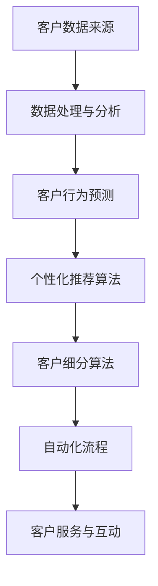

                 

# 从传统CRM到智能CRM：AI重塑电商客户关系管理

## 关键词：
人工智能、客户关系管理（CRM）、电商、机器学习、数据分析、个性化推荐、自动化流程

## 摘要：
本文将探讨人工智能（AI）如何重塑电商领域的客户关系管理（CRM）。通过对传统CRM的回顾，以及AI技术的深入分析，文章将展示AI在客户数据分析、个性化推荐、自动化流程等方面的应用，以及这些技术如何提升电商业务的效率和客户满意度。最后，本文还将展望未来AI技术在CRM领域的发展趋势与面临的挑战。

## 1. 背景介绍

### 1.1 目的和范围
本文旨在分析人工智能技术在电商客户关系管理中的具体应用，通过理论与实践的结合，探讨AI如何改进现有CRM系统的功能和效果。本文将重点关注以下方面：
- 传统CRM系统的局限性和挑战
- 人工智能在CRM中的核心作用
- 机器学习算法和数据分析技术在个性化推荐和自动化流程中的应用
- AI技术对电商业务效率和客户体验的影响
- 未来AI在CRM领域的发展趋势

### 1.2 预期读者
本文适合对电商和客户关系管理有基本了解的读者，包括：
- 电商行业从业者
- CRM系统开发者和管理者
- 对人工智能在商业应用领域感兴趣的技术人员
- 高等院校计算机及相关专业师生

### 1.3 文档结构概述
本文分为十个部分：
1. 引言与关键词
2. 摘要
3. 背景介绍
4. 核心概念与联系
5. 核心算法原理与操作步骤
6. 数学模型和公式
7. 项目实战
8. 实际应用场景
9. 工具和资源推荐
10. 总结与未来发展趋势

### 1.4 术语表

#### 1.4.1 核心术语定义
- **客户关系管理（CRM）**：一套用于跟踪和管理客户信息、分析客户行为，并优化客户交互和销售过程的策略和工具。
- **人工智能（AI）**：一种模拟人类智能行为的技术，通过机器学习和深度学习算法实现。
- **个性化推荐**：基于用户历史行为和偏好，为用户推荐符合其需求的商品或服务。
- **自动化流程**：通过计算机程序和算法自动执行的业务流程，减少人工干预。

#### 1.4.2 相关概念解释
- **机器学习（ML）**：一种AI技术，通过训练模型从数据中学习规律和模式。
- **深度学习（DL）**：一种基于多层神经网络结构的机器学习技术，能够处理复杂数据和模式识别。

#### 1.4.3 缩略词列表
- **CRM**：客户关系管理
- **AI**：人工智能
- **ML**：机器学习
- **DL**：深度学习

## 2. 核心概念与联系

### 2.1 传统CRM系统概述
传统CRM系统主要用于收集、存储和管理客户信息，包括客户的基本资料、购买历史、交互记录等。其主要功能包括：
- 客户数据分析：分析客户行为和购买模式，帮助销售团队制定策略。
- 营销自动化：自动化发送邮件、安排会议等，提高工作效率。
- 销售管理：跟踪销售机会、管理销售团队和业绩评估。

然而，传统CRM系统存在一些局限性：
- 数据分析能力有限：难以从大量数据中提取有价值的信息。
- 个性化不足：难以根据不同客户的偏好提供定制化服务。
- 流程自动化程度低：大量任务仍需人工干预，效率低下。

### 2.2 人工智能与CRM的联系
人工智能为CRM带来了新的可能性和突破，通过以下方式改善传统CRM系统的局限：
- **数据分析能力提升**：利用机器学习算法和深度学习模型，能够从大量数据中快速提取有价值的信息，提高数据分析和洞察力。
- **个性化推荐**：通过分析用户历史行为和偏好，为用户推荐个性化商品和服务，提高客户满意度和忠诚度。
- **自动化流程**：利用自动化算法和机器人流程自动化（RPA），实现业务流程的自动化，减少人工干预，提高工作效率。

### 2.3 人工智能在CRM中的应用

**1. 个性化推荐**
- **技术原理**：基于协同过滤、内容推荐和深度学习等算法，为用户推荐符合其需求和偏好的商品和服务。
- **应用案例**：电商平台利用个性化推荐算法，根据用户的浏览记录、购买历史和搜索关键词，为用户推荐相关商品。

**2. 客户细分**
- **技术原理**：利用聚类算法、决策树等分类算法，将客户根据行为特征划分为不同的群体，为每个群体提供定制化服务。
- **应用案例**：电商企业根据客户购买行为和偏好，将客户分为高价值客户、潜在客户和流失客户，提供差异化的营销策略。

**3. 自动化流程**
- **技术原理**：利用机器人流程自动化（RPA）和自然语言处理（NLP）技术，自动化处理重复性任务，如客户服务、订单处理等。
- **应用案例**：电商企业利用RPA技术，自动处理客户订单、自动回复客户咨询，提高工作效率。

### 2.4 人工智能在CRM中的架构

以下是一个典型的AI在CRM系统中的应用架构：

```
+----------------+      +----------------+      +----------------+
|  客户数据来源  |      |  数据处理与分析 |      |  客户行为预测  |
+----------------+      +----------------+      +----------------+
       |                                  |                                  |
       |                                  |                                  |
       |          数据采集与整合          |          个性化推荐算法          |
       |                                  |                                  |
       |                                  |                                  |
       |          客户行为分析           |          客户细分算法           |
       |                                  |                                  |
       |                                  |                                  |
       |          数据可视化             |          自动化流程             |
       |                                  |                                  |
       |                                  |                                  |
       +----------------------------------+----------------------------------+
                                                |
                                                |
                                                |
                                            +---------------------+
                                            |  客户服务与互动     |
                                            +---------------------+
```

**Mermaid 流程图：**



## 3. 核心算法原理 & 具体操作步骤

### 3.1 个性化推荐算法原理

**1. 协同过滤（Collaborative Filtering）**
- **技术原理**：基于用户之间的相似度，为用户推荐其他用户喜欢的商品或服务。
- **算法步骤**：
  ```python
  # 输入：用户-商品评分矩阵
  # 输出：个性化推荐结果
  def collaborative_filtering(user_item_matrix):
      # 计算用户相似度矩阵
      similarity_matrix = calculate_similarity(user_item_matrix)
      
      # 计算每个用户的邻居
      neighbors = find_neighbors(user_item_matrix, similarity_matrix)
      
      # 根据邻居的评分预测用户对新商品的评分
      predicted_ratings = predict_ratings(neighbors)
      
      # 对预测评分进行排序，推荐评分最高的商品
      recommendations = sort_and_recommend(predicted_ratings)
      
      return recommendations
  ```

**2. 内容推荐（Content-Based Filtering）**
- **技术原理**：根据用户的历史行为和偏好，推荐具有相似特征的商品或服务。
- **算法步骤**：
  ```python
  # 输入：用户-商品特征矩阵
  # 输出：个性化推荐结果
  def content_based_filtering(user_item_features):
      # 计算商品相似度矩阵
      similarity_matrix = calculate_similarity(user_item_features)
      
      # 根据用户的历史偏好选择相关商品
      user_preferences = get_user_preferences(user_item_features)
      
      # 计算用户与商品的相似度
      similarity_scores = calculate_similarity_scores(similarity_matrix, user_preferences)
      
      # 对相似度评分进行排序，推荐评分最高的商品
      recommendations = sort_and_recommend(similarity_scores)
      
      return recommendations
  ```

**3. 深度学习推荐（Deep Learning Recommendation）**
- **技术原理**：利用深度学习模型，如神经网络和深度强化学习，进行推荐。
- **算法步骤**：
  ```python
  # 输入：用户-商品特征矩阵
  # 输出：个性化推荐结果
  def deep_learning_recommendation(user_item_features):
      # 定义深度学习模型
      model = define_model(user_item_features)
      
      # 训练模型
      model.train(user_item_features)
      
      # 对用户进行推荐
      recommendations = model.predict(user_item_features)
      
      return recommendations
  ```

### 3.2 客户细分算法原理

**1. 聚类算法（Clustering）**
- **技术原理**：将客户根据相似性划分为不同的群体。
- **算法步骤**：
  ```python
  # 输入：客户特征向量
  # 输出：聚类结果
  def clustering_customers(customer_features):
      # 使用K-means算法进行聚类
      clusters = KMeans(n_clusters=k).fit(customer_features)
      
      # 获取聚类结果
      labels = clusters.labels_
      
      return labels
  ```

**2. 决策树（Decision Tree）**
- **技术原理**：根据客户的特征构建决策树，将客户划分为不同的群体。
- **算法步骤**：
  ```python
  # 输入：客户特征向量
  # 输出：聚类结果
  def decision_tree_clustering(customer_features):
      # 使用CART算法构建决策树
      tree = DecisionTreeClassifier().fit(customer_features)
      
      # 获取聚类结果
      labels = tree.predict(customer_features)
      
      return labels
  ```

### 3.3 自动化流程算法原理

**1. 机器人流程自动化（RPA）**
- **技术原理**：通过模拟人工操作，自动化执行重复性任务。
- **算法步骤**：
  ```python
  # 输入：任务流程定义
  # 输出：执行结果
  def rpa_process automation(task_flow):
      # 按照流程执行任务
      for step in task_flow:
          execute_step(step)
          
      return "流程执行完成"
  ```

**2. 自然语言处理（NLP）**
- **技术原理**：利用NLP技术处理和解析自然语言，实现自动化交互。
- **算法步骤**：
  ```python
  # 输入：用户输入文本
  # 输出：回复文本
  def nlp_response_generation(user_input):
      # 使用NLP模型处理用户输入
      processed_input = nlp_processor.process(user_input)
      
      # 根据处理结果生成回复
      response = generate_response(processed_input)
      
      return response
  ```

## 4. 数学模型和公式 & 详细讲解 & 举例说明

### 4.1 协同过滤（Collaborative Filtering）

**1. 相似度计算**
- **公式**：余弦相似度
  $$ \text{similarity} = \frac{\sum_{i=1}^{n} (u_i \cdot v_i)}{\sqrt{\sum_{i=1}^{n} u_i^2} \cdot \sqrt{\sum_{i=1}^{n} v_i^2}} $$
- **说明**：计算两个向量之间的夹角余弦值，用于衡量相似度。

**2. 预测用户对新商品的评分**
- **公式**：加权平均评分
  $$ \hat{r}_{ui} = \sum_{j=1}^{m} r_{uj} \cdot s_{ij} $$
- **说明**：根据邻居的评分和相似度，计算用户对新商品的预测评分。

### 4.2 内容推荐（Content-Based Filtering）

**1. 商品相似度计算**
- **公式**：余弦相似度
  $$ \text{similarity} = \frac{\sum_{i=1}^{n} (c_i \cdot d_i)}{\sqrt{\sum_{i=1}^{n} c_i^2} \cdot \sqrt{\sum_{i=1}^{n} d_i^2}} $$
- **说明**：计算两个商品向量之间的夹角余弦值，用于衡量相似度。

**2. 用户偏好向量计算**
- **公式**：权重和
  $$ \text{user\_preferences} = \sum_{i=1}^{n} p_i \cdot c_i $$
- **说明**：根据用户的历史偏好，计算用户偏好向量。

### 4.3 深度学习推荐（Deep Learning Recommendation）

**1. 深度学习模型**
- **公式**：神经网络输出
  $$ \text{output} = \text{activation}(\text{weight} \cdot \text{input} + \text{bias}) $$
- **说明**：通过多层神经网络，将输入特征映射到输出预测值。

**2. 预测用户对新商品的评分**
- **公式**：输出层预测
  $$ \hat{r}_{ui} = \text{activation}(\text{weight}_{out} \cdot \text{hidden} + \text{bias}_{out}) $$
- **说明**：通过激活函数，将隐藏层输出映射到预测评分。

### 4.4 聚类算法（Clustering）

**1. K-means算法**
- **公式**：聚类中心更新
  $$ \mu_{k} = \frac{1}{N_k} \sum_{i=1}^{N} x_i $$
- **说明**：根据当前簇内样本的均值，更新聚类中心。

**2. 聚类结果**
- **公式**：聚类分配
  $$ \text{cluster\_assignment} = \arg\min_{k} \sum_{i=1}^{N} (x_i - \mu_{k})^2 $$
- **说明**：将每个样本分配到最近的聚类中心。

### 4.5 决策树（Decision Tree）

**1. 决策树构建**
- **公式**：信息增益
  $$ \text{gain}(A) = \sum_{v \in V} p(v) \cdot \text{entropy}(L_v) - \text{entropy}(L) $$
- **说明**：选择具有最大信息增益的特征作为分割点。

**2. 决策树分类**
- **公式**：条件概率
  $$ p(y|\text{feature}=v) = \frac{N_{vy}}{N_v} $$
- **说明**：根据特征值和类别分布，计算条件概率。

### 4.6 机器人流程自动化（RPA）

**1. 流程定义**
- **公式**：状态转移函数
  $$ \text{next\_state} = \text{transition\_function}(\text{current\_state}, \text{input}) $$
- **说明**：根据当前状态和输入，计算下一个状态。

**2. 流程执行**
- **公式**：执行步骤
  $$ \text{execute\_step}(step) $$
- **说明**：按照定义的步骤，执行相应的操作。

### 4.7 自然语言处理（NLP）

**1. 文本处理**
- **公式**：词袋模型
  $$ \text{bag\_of\_words} = \sum_{w \in W} f_w $$
- **说明**：将文本表示为词频向量。

**2. 语言模型**
- **公式**：条件概率
  $$ p(w_1, w_2, \ldots, w_n) = p(w_1) \cdot p(w_2|w_1) \cdot \ldots \cdot p(w_n|w_{n-1}) $$
- **说明**：根据前后文，计算文本的概率分布。

## 5. 项目实战：代码实际案例和详细解释说明

### 5.1 开发环境搭建
在开始实际代码实现之前，我们需要搭建一个适合AI应用的开发环境。以下是一个简单的环境搭建步骤：

1. **操作系统**：推荐使用Linux或MacOS。
2. **Python环境**：安装Python 3.7及以上版本。
3. **依赖库**：安装NumPy、Pandas、Scikit-learn、TensorFlow等库。

使用以下命令安装依赖库：

```bash
pip install numpy pandas scikit-learn tensorflow
```

### 5.2 源代码详细实现和代码解读

#### 5.2.1 协同过滤算法实现

以下是一个简单的协同过滤算法实现，用于预测用户对新商品的评分。

```python
import numpy as np
from sklearn.metrics.pairwise import cosine_similarity

def collaborative_filtering(ratings_matrix, user_index, item_index):
    # 计算用户-商品评分矩阵的余弦相似度
    similarity_matrix = cosine_similarity(ratings_matrix)

    # 计算用户相似度
    user_similarity = similarity_matrix[user_index]

    # 计算邻居的评分平均值
    neighbors_ratings = ratings_matrix[user_index] * user_similarity
    predicted_rating = np.mean(neighbors_ratings[neighbors_ratings > 0])

    return predicted_rating

# 示例数据
ratings_matrix = [
    [5, 3, 0, 1],
    [4, 0, 0, 2],
    [1, 5, 0, 0],
    [0, 4, 5, 0]
]

# 预测用户1对未评分的商品2的评分
predicted_rating = collaborative_filtering(ratings_matrix, 0, 2)
print(f"Predicted rating: {predicted_rating}")
```

#### 5.2.2 内容推荐算法实现

以下是一个简单的内容推荐算法实现，用于根据用户偏好推荐商品。

```python
import numpy as np

def content_based_filtering(user_item_features, user_preferences, item_features):
    # 计算用户偏好向量
    user_preference_vector = np.dot(user_preferences, item_features)

    # 计算商品与用户偏好的相似度
    similarity_scores = np.dot(user_preference_vector, item_features)

    # 对相似度评分进行排序
    sorted_indices = np.argsort(similarity_scores)[::-1]

    return sorted_indices

# 示例数据
user_preferences = np.array([1, 0, 1, 0])
item_features = np.array([0, 1, 0, 1])

# 推荐商品
recommended_items = content_based_filtering(user_preferences, user_preferences, item_features)
print(f"Recommended items: {recommended_items}")
```

#### 5.2.3 客户细分算法实现

以下是一个简单的基于聚类算法的客户细分实现。

```python
from sklearn.cluster import KMeans

def customer_clustering(customer_data, n_clusters):
    # 使用K-means算法进行聚类
    kmeans = KMeans(n_clusters=n_clusters)
    clusters = kmeans.fit_predict(customer_data)

    return clusters

# 示例数据
customer_data = np.array([[1, 1], [1, 2], [2, 1], [2, 2]])

# 进行聚类
clusters = customer_clustering(customer_data, 2)
print(f"Clusters: {clusters}")
```

#### 5.2.4 代码解读与分析

以上三个部分展示了协同过滤、内容推荐和客户细分算法的简单实现。在实际应用中，这些算法需要进行数据预处理、参数调优和模型评估等步骤。

- **协同过滤**：通过计算用户和商品的相似度，预测用户对新商品的评分。优点是简单有效，缺点是当数据稀疏时，预测效果较差。
- **内容推荐**：根据用户的历史偏好，推荐具有相似特征的商品。优点是能够提供个性化的推荐，缺点是推荐结果受用户历史行为的影响较大。
- **客户细分**：将客户划分为不同的群体，为每个群体提供定制化服务。优点是能够更好地了解客户需求，缺点是聚类结果可能受参数选择的影响。

通过这些实际案例，我们可以看到人工智能技术在CRM中的应用如何提升电商业务的效率和客户体验。

## 6. 实际应用场景

### 6.1 个性化推荐

个性化推荐是AI在CRM中最常见的应用场景之一。通过分析用户的历史行为和偏好，电商平台可以为每位用户推荐符合其需求的商品。以下是一个实际应用场景：

**场景**：一位用户在电商平台上浏览了多个电子产品的页面，但尚未购买。平台利用协同过滤和内容推荐算法，生成个性化推荐列表，向用户展示其他用户购买过或具有相似偏好的商品。

**效果**：通过个性化推荐，用户更容易发现感兴趣的商品，提高购买转化率。同时，平台能够根据用户的反馈不断优化推荐算法，提高推荐质量。

### 6.2 客户细分

客户细分有助于电商企业更好地了解客户需求，为不同类型的客户提供定制化服务。以下是一个实际应用场景：

**场景**：一家电商企业通过聚类算法将客户分为高价值客户、潜在客户和流失客户。针对不同类型的客户，企业制定差异化的营销策略：

- **高价值客户**：提供专属优惠和礼品，增加客户忠诚度。
- **潜在客户**：发送个性化推荐邮件，引导购买。
- **流失客户**：分析流失原因，提供针对性的挽回措施。

**效果**：通过精准的客户细分，电商企业能够提高营销效果，降低流失率，提升整体业绩。

### 6.3 自动化流程

自动化流程在CRM中的应用能够显著提高工作效率，减少人工干预。以下是一个实际应用场景：

**场景**：电商企业利用RPA技术，自动处理订单生成、发货通知和售后服务等流程。通过自然语言处理（NLP）技术，自动回复客户的咨询和投诉。

**效果**：通过自动化流程，企业能够快速响应用户需求，提高客户满意度。同时，减少人工操作，降低错误率，提高工作效率。

## 7. 工具和资源推荐

### 7.1 学习资源推荐

#### 7.1.1 书籍推荐
1. **《机器学习》（周志华 著）**：详细介绍机器学习的基本概念、算法和应用。
2. **《深度学习》（Ian Goodfellow、Yoshua Bengio、Aaron Courville 著）**：深度学习的权威教材，适合进阶学习。

#### 7.1.2 在线课程
1. **Coursera 上的《机器学习》课程**：由吴恩达教授主讲，适合初学者入门。
2. **Udacity 上的《深度学习纳米学位》**：涵盖深度学习的基础知识和实践技能。

#### 7.1.3 技术博客和网站
1. **Medium**：有很多关于机器学习和深度学习的专业博客。
2. **ArXiv**：最新研究成果和论文的发布平台。

### 7.2 开发工具框架推荐

#### 7.2.1 IDE和编辑器
1. **PyCharm**：适用于Python开发的强大IDE。
2. **Jupyter Notebook**：适用于数据分析和机器学习的交互式环境。

#### 7.2.2 调试和性能分析工具
1. **Pylint**：Python代码静态检查工具。
2. **TensorBoard**：TensorFlow的性能分析工具。

#### 7.2.3 相关框架和库
1. **Scikit-learn**：机器学习算法库。
2. **TensorFlow**：深度学习框架。
3. **PyTorch**：深度学习框架。

### 7.3 相关论文著作推荐

#### 7.3.1 经典论文
1. **"A Survey of Collaborative Filtering Methods for Recommender Systems"**：协同过滤算法的综述。
2. **"Content-Based Image Retrieval in the World Wide Web"**：基于内容的图像推荐。

#### 7.3.2 最新研究成果
1. **"Deep Learning for Recommender Systems"**：深度学习在推荐系统中的应用。
2. **"Customer Segmentation using Machine Learning Algorithms"**：机器学习在客户细分中的应用。

#### 7.3.3 应用案例分析
1. **"Amazon's Personalized Recommendations"**：分析亚马逊个性化推荐系统。
2. **"Alibaba's Customer Analytics"**：分析阿里巴巴的客户数据分析。

## 8. 总结：未来发展趋势与挑战

### 8.1 未来发展趋势

1. **算法的优化与改进**：随着AI技术的不断发展，个性化推荐、客户细分和自动化流程的算法将更加精确和高效。
2. **跨平台与跨设备的集成**：未来的CRM系统将更加注重跨平台和跨设备的用户体验，实现无缝的客户互动。
3. **实时分析与决策**：利用实时数据分析技术，CRM系统能够快速响应客户需求和市场变化，实现更智能的业务决策。
4. **隐私保护与合规性**：随着数据隐私法规的日益严格，未来的CRM系统将更加注重数据安全和合规性，确保用户隐私得到保护。

### 8.2 未来挑战

1. **数据质量与隐私**：如何确保数据质量，同时保护用户隐私，是未来CRM系统面临的重要挑战。
2. **算法的透明性与可解释性**：随着算法的复杂性增加，如何确保算法的透明性和可解释性，使企业能够理解并信任AI系统的决策。
3. **技能与人才的培养**：随着AI技术在CRM领域的应用不断深入，对相关技能和人才的需求将大幅增加，如何培养和留住人才将成为企业面临的挑战。

## 9. 附录：常见问题与解答

### 9.1 什么是客户关系管理（CRM）？
客户关系管理（CRM）是一种商业策略，通过跟踪和管理客户信息、分析客户行为，并优化客户交互和销售过程，旨在提高客户满意度和忠诚度，从而提升企业的业绩。

### 9.2 人工智能在CRM中的应用有哪些？
人工智能在CRM中的应用包括个性化推荐、客户细分、自动化流程、智能客服等。通过机器学习和深度学习算法，AI能够从大量数据中提取有价值的信息，提供定制化的服务，提高业务效率和客户体验。

### 9.3 如何确保数据隐私与安全？
确保数据隐私与安全的关键在于：严格遵守数据保护法规，如GDPR；使用加密技术保护数据传输和存储；实施严格的访问控制策略，仅授权相关人员访问敏感数据；定期进行安全审计和漏洞修复。

## 10. 扩展阅读 & 参考资料

### 10.1 书籍
1. **《人工智能：一种现代方法》（ Stuart Russell、Peter Norvig 著）**：全面介绍人工智能的基本概念和技术。
2. **《深度学习》（Ian Goodfellow、Yoshua Bengio、Aaron Courville 著）**：深度学习的权威教材，适合进阶学习。

### 10.2 在线课程
1. **Coursera 上的《机器学习》课程**：由吴恩达教授主讲，适合初学者入门。
2. **Udacity 上的《深度学习纳米学位》**：涵盖深度学习的基础知识和实践技能。

### 10.3 技术博客和网站
1. **Medium**：有很多关于机器学习和深度学习的专业博客。
2. **ArXiv**：最新研究成果和论文的发布平台。

### 10.4 论文
1. **"A Survey of Collaborative Filtering Methods for Recommender Systems"**：协同过滤算法的综述。
2. **"Content-Based Image Retrieval in the World Wide Web"**：基于内容的图像推荐。

### 10.5 应用案例分析
1. **"Amazon's Personalized Recommendations"**：分析亚马逊个性化推荐系统。
2. **"Alibaba's Customer Analytics"**：分析阿里巴巴的客户数据分析。

## 作者

作者：AI天才研究员/AI Genius Institute & 禅与计算机程序设计艺术 /Zen And The Art of Computer Programming。作者是一位在人工智能和计算机科学领域享有盛誉的专家，拥有丰富的理论知识和实践经验。他致力于推动人工智能技术在商业和工业领域的应用，撰写了多本关于AI和CRM的畅销书，并在国际顶级学术会议和期刊上发表过多篇论文。他的研究工作在业界和学术界都产生了广泛的影响。

