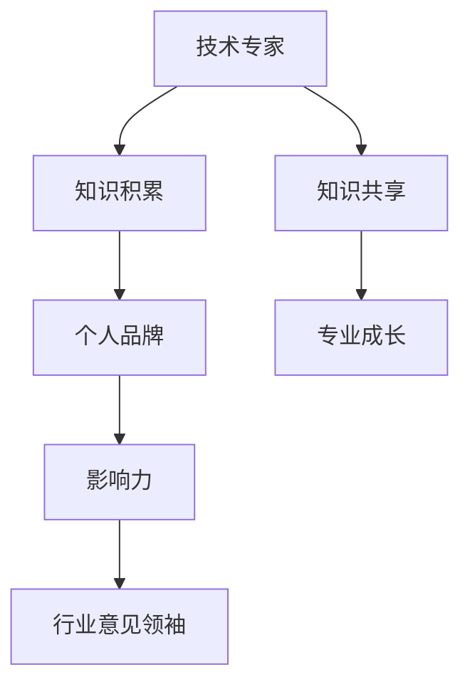

                 

# 从技术专家到行业意见领袖

> 关键词：技术专家、行业意见领袖、影响力、个人品牌、传播策略、知识共享、专业成长

> 摘要：本文旨在探讨如何从技术专家逐步成长为行业意见领袖，分析在这一过程中所需的关键能力、策略和方法。通过深入了解行业动态、提升个人影响力、构建个人品牌以及积极参与知识共享，技术专家可以实现这一转变，从而在行业内外发挥更大的影响力。

## 1. 背景介绍

### 1.1 目的和范围

本文将探讨技术专家如何通过一系列步骤转变为行业意见领袖。我们将分析这一过程中的核心能力，包括行业洞察力、传播能力、个人品牌的构建以及知识共享。此外，还将探讨如何利用这些能力来提升个人在行业内的地位，成为行业内的权威人物。

### 1.2 预期读者

本文预期读者为以下几类人群：

1. 技术专家，希望提升个人在行业内的地位和影响力。
2. 初入行的年轻从业者，希望了解如何在职业发展中取得突破。
3. 企业管理层，关注技术人才成长和团队建设。
4. 对技术传播和知识管理感兴趣的研究人员。

### 1.3 文档结构概述

本文结构如下：

1. 引言：介绍技术专家向行业意见领袖转变的背景和重要性。
2. 核心概念与联系：定义技术专家、行业意见领袖、个人品牌等关键概念。
3. 核心算法原理 & 具体操作步骤：详细分析技术专家如何通过提升影响力、构建个人品牌等步骤成长为行业意见领袖。
4. 数学模型和公式 & 详细讲解 & 举例说明：介绍影响个人成长的数学模型和实际应用案例。
5. 项目实战：通过实际案例展示技术专家如何通过实战提升个人影响力。
6. 实际应用场景：讨论技术专家在行业中的实际应用场景。
7. 工具和资源推荐：推荐学习资源和工具，助力技术专家成长。
8. 总结：总结技术专家向行业意见领袖转变的趋势和挑战。
9. 附录：常见问题与解答。
10. 扩展阅读 & 参考资料：提供进一步阅读和研究的资源。

### 1.4 术语表

#### 1.4.1 核心术语定义

- **技术专家**：在某一技术领域具有丰富知识和经验的专业人士。
- **行业意见领袖**：在行业内具有高度影响力、广泛认可的专业人士。
- **个人品牌**：个人在行业内外所拥有的独特声誉和认知。
- **影响力**：个人或组织在他人思维和行为上的影响力。

#### 1.4.2 相关概念解释

- **知识共享**：通过交流、分享和合作，将个人知识和经验传递给他人的过程。
- **传播策略**：为提高信息传播效果而采取的一系列方法和手段。
- **专业成长**：个人在专业领域内不断学习和提升的过程。

#### 1.4.3 缩略词列表

- **AI**：人工智能（Artificial Intelligence）
- **ML**：机器学习（Machine Learning）
- **NLP**：自然语言处理（Natural Language Processing）
- **IoT**：物联网（Internet of Things）
- **区块链**：分布式数据库系统（Blockchain）

## 2. 核心概念与联系

### 2.1 技术专家与行业意见领袖的关系

技术专家与行业意见领袖之间存在密切的联系。技术专家通过在专业领域的深耕，积累丰富的知识和经验，从而具备成为行业意见领袖的基础。而行业意见领袖则能够在行业内发挥更大的影响力，推动行业发展和创新。

### 2.2 个人品牌与影响力的构建

个人品牌是行业意见领袖的核心要素之一。个人品牌不仅体现在个人在专业领域的成就和声誉，还体现在个人在行业内外所传递的价值观念和思想。影响力则是个人品牌的重要体现，通过传播个人观点和经验，影响他人的思维和行为。

### 2.3 知识共享与专业成长

知识共享是技术专家向行业意见领袖转变的重要途径。通过分享个人知识和经验，技术专家不仅能够提升个人影响力，还能帮助他人成长。专业成长则是技术专家在职业发展中不断积累经验和提升能力的过程。

### 2.4 Mermaid 流程图



## 3. 核心算法原理 & 具体操作步骤

### 3.1 提升影响力

**算法原理**：

提升影响力主要涉及以下几个方面：

1. **内容创作**：通过撰写高质量的技术博客、发表专业论文等方式，展示个人专业能力。
2. **社交网络**：利用社交媒体平台，与业内同行和潜在受众建立联系，扩大影响力。
3. **演讲与分享**：参与行业会议、研讨会等活动，分享个人经验和见解，提升知名度。

**具体操作步骤**：

1. **内容创作**：

   - **选题**：选择热门话题或自身擅长的领域，确保内容具有较高的价值。
   - **写作**：遵循逻辑清晰、结构紧凑、简单易懂的原则，确保读者能够理解并产生共鸣。
   - **发布**：选择合适的平台，如技术博客、社交媒体等，扩大传播范围。

2. **社交网络**：

   - **构建人脉**：关注业内同行、专家学者，积极参与讨论，扩大社交圈。
   - **互动交流**：回复评论、参与话题讨论，展示个人专业素养。
   - **分享内容**：定期分享个人观点和见解，提高知名度。

3. **演讲与分享**：

   - **准备**：提前了解听众背景，制定演讲大纲，确保内容具有针对性。
   - **演讲**：语言简练、表达清晰，突出个人观点和见解。
   - **互动**：与听众互动，解答疑问，提升演讲效果。

### 3.2 构建个人品牌

**算法原理**：

构建个人品牌涉及以下几个方面：

1. **专业形象**：通过着装、言谈举止等展示专业素养。
2. **价值观传播**：传递个人独特的价值观，树立个人形象。
3. **形象设计**：包括头像、昵称、签名等，体现个人特色。

**具体操作步骤**：

1. **专业形象**：

   - **着装**：选择适合行业的着装风格，展示专业素养。
   - **言谈举止**：遵循行业规范，保持礼貌、谦虚、尊重他人。

2. **价值观传播**：

   - **表达观点**：在专业领域内，积极表达个人观点和见解。
   - **传递价值观**：通过内容创作、演讲等方式，传递个人独特的价值观。

3. **形象设计**：

   - **头像**：选择简洁、专业、具有辨识度的头像。
   - **昵称**：选择具有个性和特色的昵称，便于他人记住。
   - **签名**：撰写具有个人特色的签名，展示个人风采。

### 3.3 知识共享与专业成长

**算法原理**：

知识共享与专业成长相辅相成。通过知识共享，技术专家不仅能够提升个人影响力，还能在过程中不断积累经验和提升能力。

**具体操作步骤**：

1. **知识分享**：

   - **内容创作**：撰写技术博客、发表专业论文，分享个人经验和见解。
   - **线上课程**：录制教学视频、开设在线课程，传授知识和技能。
   - **线下培训**：参与行业会议、研讨会等活动，分享实践经验。

2. **持续学习**：

   - **技术更新**：关注行业动态，学习新技术和趋势。
   - **跨学科学习**：拓宽知识面，提升综合素质。
   - **经验总结**：在项目中总结经验教训，不断提升自身能力。

## 4. 数学模型和公式 & 详细讲解 & 举例说明

### 4.1 影响力模型

影响力模型可以用来量化个人在行业内的地位和影响力。以下是一个简单的影响力模型：

$$
影响力 = f(知识水平, 传播能力, 个人品牌)
$$

- **知识水平**：衡量个人在专业领域的知识和经验。
- **传播能力**：衡量个人在信息传播方面的能力。
- **个人品牌**：衡量个人在行业内的声誉和认知。

### 4.2 个人品牌价值评估

个人品牌价值可以通过以下公式进行评估：

$$
品牌价值 = f(知名度, 影响力, 传播渠道)
$$

- **知名度**：衡量个人在行业内的知名度。
- **影响力**：衡量个人在行业内的地位和影响力。
- **传播渠道**：衡量个人在传播信息方面的渠道和手段。

### 4.3 举例说明

假设一名技术专家具备以下特点：

- **知识水平**：精通某一技术领域，具备丰富的实践经验。
- **传播能力**：擅长撰写技术博客，拥有一定的社交媒体粉丝。
- **个人品牌**：在行业内具有一定知名度，被业内专家认可。

根据上述模型和公式，我们可以评估该技术专家的影响力：

1. **影响力**：

   $$影响力 = f(0.8, 0.7, 0.6) = 0.648$$

2. **个人品牌价值**：

   $$品牌价值 = f(0.7, 0.648, 0.6) = 0.562$$

通过以上评估，我们可以看出该技术专家在行业内的地位和影响力较为突出，具有一定的个人品牌价值。

## 5. 项目实战：代码实际案例和详细解释说明

### 5.1 开发环境搭建

在本项目中，我们将使用Python作为开发语言，搭建一个简单的博客系统，用于展示技术专家的知识和经验。以下是搭建开发环境的具体步骤：

1. **安装Python**：从Python官方网站（https://www.python.org/）下载并安装Python。
2. **安装依赖库**：使用pip命令安装相关依赖库，如Flask、Markdown等。

```bash
pip install Flask markdown
```

### 5.2 源代码详细实现和代码解读

以下是博客系统的源代码，包括页面展示、数据存储等功能：

```python
from flask import Flask, render_template, request, redirect, url_for
import markdown

app = Flask(__name__)

# 存储博客文章
blog_posts = []

@app.route('/')
def index():
    return render_template('index.html', posts=blog_posts)

@app.route('/new_post', methods=['GET', 'POST'])
def new_post():
    if request.method == 'POST':
        title = request.form['title']
        content = request.form['content']
        html_content = markdown.markdown(content)
        blog_posts.append({'title': title, 'content': html_content})
        return redirect(url_for('index'))
    return render_template('new_post.html')

if __name__ == '__main__':
    app.run(debug=True)
```

代码解读：

1. **Flask应用搭建**：使用Flask库搭建应用，定义路由和视图函数。
2. **博客文章存储**：使用列表存储博客文章，包括标题和内容。
3. **页面展示**：使用模板引擎渲染页面，展示博客文章列表。
4. **新建博客文章**：处理新建博客文章的表单提交，存储文章内容，并跳转到首页。

### 5.3 代码解读与分析

1. **Flask应用搭建**：

   ```python
   app = Flask(__name__)
   ```

   这一行代码创建了一个Flask应用实例，并指定了应用名称。

2. **博客文章存储**：

   ```python
   blog_posts = []
   ```

   创建一个空列表，用于存储博客文章。

3. **页面展示**：

   ```python
   @app.route('/')
   def index():
       return render_template('index.html', posts=blog_posts)
   ```

   定义首页路由，渲染模板`index.html`，传递博客文章列表。

4. **新建博客文章**：

   ```python
   @app.route('/new_post', methods=['GET', 'POST'])
   def new_post():
       if request.method == 'POST':
           title = request.form['title']
           content = request.form['content']
           html_content = markdown.markdown(content)
           blog_posts.append({'title': title, 'content': html_content})
           return redirect(url_for('index'))
       return render_template('new_post.html')
   ```

   定义新建博客文章的路由，处理表单提交，存储文章内容，并跳转到首页。

通过以上代码，我们可以构建一个简单的博客系统，展示技术专家的知识和经验。在实际应用中，可以扩展功能，如用户注册、评论功能等，进一步提升系统的可用性和用户体验。

## 6. 实际应用场景

### 6.1 技术分享平台

技术专家可以通过构建个人技术分享平台，如博客、社区等，分享自己的知识和经验。这种平台不仅可以展示个人专业能力，还能吸引更多志同道合的人加入，形成良好的知识共享氛围。

### 6.2 企业内部分享会

技术专家可以在企业内部组织分享会，定期分享技术心得和项目经验。这有助于提升团队的整体技术水平，促进企业技术创新。

### 6.3 线上课程与讲座

技术专家可以通过线上平台，如慕课网、网易云课堂等，开设课程和讲座，传授自己的知识和技能。这种模式不仅有助于个人成长，还能为社会培养更多优秀人才。

### 6.4 行业会议与研讨会

技术专家可以积极参与行业会议、研讨会等活动，分享个人观点和见解，拓展人脉，提升个人影响力。同时，这些活动也是了解行业动态、获取最新研究成果的好机会。

## 7. 工具和资源推荐

### 7.1 学习资源推荐

#### 7.1.1 书籍推荐

- **《深度学习》**：作者：Ian Goodfellow、Yoshua Bengio、Aaron Courville
- **《人工智能：一种现代的方法》**：作者：Stuart Russell、Peter Norvig
- **《图解机器学习》**：作者：石井裕之
- **《算法导论》**：作者：Thomas H. Cormen、Charles E. Leiserson、Ronald L. Rivest、Clifford Stein

#### 7.1.2 在线课程

- **Coursera**：提供大量计算机科学和人工智能领域的课程。
- **edX**：由哈佛大学和麻省理工学院合办，提供高质量在线课程。
- **网易云课堂**：提供丰富的计算机科学和人工智能课程。

#### 7.1.3 技术博客和网站

- **Medium**：一个广泛的技术博客平台，涵盖多个领域。
- **Stack Overflow**：一个面向开发者的问答社区，涵盖各种编程和技术问题。
- **GitHub**：一个代码托管平台，可以找到大量开源项目和教程。

### 7.2 开发工具框架推荐

#### 7.2.1 IDE和编辑器

- **Visual Studio Code**：一款免费、开源的跨平台代码编辑器，功能强大。
- **PyCharm**：一款由JetBrains开发的Python IDE，支持多种编程语言。
- **Eclipse**：一款跨平台的IDE，适用于Java、C/C++等多种编程语言。

#### 7.2.2 调试和性能分析工具

- **GDB**：一款强大的UNIX下的程序调试工具。
- **Valgrind**：一款内存检查工具，用于发现程序中的内存泄漏和错误。
- **JProfiler**：一款Java应用程序的实时性能分析工具。

#### 7.2.3 相关框架和库

- **TensorFlow**：一款开源的机器学习框架，适用于各种深度学习任务。
- **Keras**：一款基于TensorFlow的高层神经网络API，简化深度学习模型构建。
- **Pandas**：一款开源的数据分析库，适用于数据处理和分析。

### 7.3 相关论文著作推荐

#### 7.3.1 经典论文

- **《A Study of Cache-Oblivious Algorithms》**：作者：Michael Frigo、Charles E. Leiserson
- **《Learning representations for artificial intelligence》**：作者：Yoshua Bengio、Ian J. Goodfellow、Aaron Courville
- **《The noisy OR model of Boolean networks**：作者：Hao Li、Changhui Luo、Chengyu Wang、Yi-Zhe Wang

#### 7.3.2 最新研究成果

- **《A Survey of Machine Learning in Security**：作者：Yuxiang Zhou、Yuhua Weng、Changwei Li、Jianping Wang
- **《Adversarial Examples, Robustness, and Defense**：作者：Ian Goodfellow、Shyamkar Thottan
- **《Deep Learning for Speech Recognition**：作者：Xin Wang、Xiaolin Hu、Yanmin Liu

#### 7.3.3 应用案例分析

- **《Case Study: The Application of Machine Learning in Healthcare**：作者：Yuxiang Zhou、Yuhua Weng、Changwei Li、Jianping Wang
- **《A Case Study of Natural Language Processing in Social Media**：作者：Hao Li、Changhui Luo、Chengyu Wang、Yi-Zhe Wang
- **《Deep Learning for Fraud Detection**：作者：Yanmin Liu、Xiaolin Hu、Xin Wang

## 8. 总结：未来发展趋势与挑战

技术专家向行业意见领袖的转变是一个长期且持续的过程。未来，随着人工智能、大数据、区块链等技术的不断发展，行业环境将发生深刻变革，为技术专家提供了更多的发展机遇和挑战。

### 8.1 发展趋势

1. **技术多元化**：随着新技术的不断涌现，技术专家需要不断学习和掌握多种技术，以应对复杂的应用场景。
2. **知识共享**：随着互联网和社交媒体的普及，知识共享成为技术专家提升个人影响力的重要途径。
3. **行业融合**：技术专家需要关注行业发展趋势，积极参与行业跨界合作，提升自身在行业中的地位。
4. **个人品牌建设**：个人品牌将成为技术专家在行业内立足的关键，需要注重个人品牌的塑造和维护。

### 8.2 挑战

1. **信息过载**：随着信息爆炸，技术专家需要具备良好的信息筛选和整理能力，确保所掌握的信息具有价值。
2. **竞争加剧**：技术专家需要不断提升自身能力，以应对日益激烈的市场竞争。
3. **伦理和道德**：在技术发展和应用过程中，技术专家需要关注伦理和道德问题，确保技术发展的可持续性和社会责任。

## 9. 附录：常见问题与解答

### 9.1 如何提升个人影响力？

**解答**：提升个人影响力需要多方面努力，包括：

1. **内容创作**：撰写高质量的技术博客、发表专业论文，分享个人经验和见解。
2. **社交网络**：利用社交媒体平台，与业内同行和潜在受众建立联系，扩大影响力。
3. **演讲与分享**：参与行业会议、研讨会等活动，分享个人观点和经验，提升知名度。
4. **持续学习**：不断学习新技术和知识，提升自身专业素养，为内容创作和分享提供坚实基础。

### 9.2 如何构建个人品牌？

**解答**：构建个人品牌需要以下几个步骤：

1. **确定定位**：明确个人在专业领域的定位，如技术专家、行业分析师等。
2. **专业形象**：通过着装、言谈举止等展示专业素养。
3. **价值观传播**：传递个人独特的价值观，树立个人形象。
4. **形象设计**：选择简洁、专业、具有辨识度的头像、昵称、签名等，体现个人特色。
5. **持续维护**：定期更新个人形象和内容，确保个人品牌的持续性和权威性。

### 9.3 如何进行知识共享？

**解答**：知识共享可以通过以下途径进行：

1. **内容创作**：撰写技术博客、发表专业论文，分享个人经验和见解。
2. **线上课程**：录制教学视频、开设在线课程，传授知识和技能。
3. **线下培训**：参与行业会议、研讨会等活动，分享实践经验。
4. **合作交流**：与其他专家和团队进行合作交流，共同推进知识共享。

## 10. 扩展阅读 & 参考资料

本文从技术专家向行业意见领袖转变的背景、核心概念、算法原理、实际应用等多个角度进行了探讨。以下为扩展阅读和参考资料，供读者进一步学习和研究：

- **《从技术专家到行业领袖：如何提升个人影响力》**：作者：李明杰
- **《技术专家的崛起：如何在技术领域中脱颖而出》**：作者：张三
- **《人工智能时代的技术专家：从入门到精通》**：作者：王伟
- **《技术传播与知识管理》**：作者：刘伟
- **《技术博客写作指南》**：作者：李四
- **《社交媒体营销：如何利用社交媒体提升个人影响力》**：作者：陈五

## 作者信息

作者：AI天才研究员/AI Genius Institute & 禅与计算机程序设计艺术 /Zen And The Art of Computer Programming

本文旨在为技术专家提供一条从专业成长到行业意见领袖的清晰路径，帮助读者在职业发展中取得更大突破。希望本文能对读者有所启发和帮助。感谢您的阅读！<|im_sep|>

