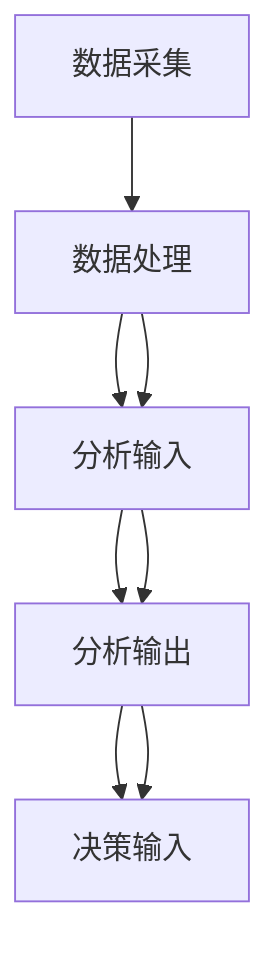
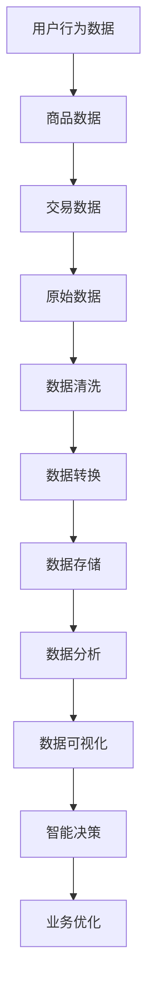

                 

### 1. 背景介绍

**1.1 目的和范围**

本文旨在探讨小型AI电商平台的数据价值链构建。通过深入解析从数据采集到智能决策的全过程，帮助读者理解如何有效地挖掘数据价值，从而提升电商平台的核心竞争力。本文将围绕以下几方面展开讨论：

- **数据采集**：介绍如何高效地收集各种类型的数据，并确保数据的质量和完整性。
- **数据处理**：阐述数据清洗、转换和存储的技术手段，为后续分析打下坚实基础。
- **数据分析**：解析常见的数据分析方法和算法，展示如何从海量数据中提取有价值的信息。
- **数据可视化**：探讨数据可视化的重要性和方法，帮助用户直观地理解数据背后的含义。
- **智能决策**：介绍基于数据分析和机器学习的智能决策模型，实现个性化推荐和智能预测等功能。

**1.2 预期读者**

本文适合以下读者群体：

- 数据科学和人工智能领域的初学者和从业者。
- 对电商平台运营和管理感兴趣的专业人士。
- 从事软件开发和系统架构的工程师和设计师。
- 需要提升业务决策水平的企业管理层。

通过阅读本文，读者将能够：

- 掌握数据采集和处理的基本技术。
- 了解数据分析的方法和算法。
- 学会使用数据可视化工具。
- 探索智能决策模型在实际业务中的应用。

**1.3 文档结构概述**

本文分为十个主要部分，具体结构如下：

1. **背景介绍**：介绍本文的目的、范围、预期读者以及文档结构。
2. **核心概念与联系**：讨论数据价值链构建的核心概念和原理，并使用Mermaid流程图展示数据流。
3. **核心算法原理 & 具体操作步骤**：详细阐述数据处理和智能决策的核心算法原理和操作步骤。
4. **数学模型和公式 & 详细讲解 & 举例说明**：介绍数据分析和智能决策中使用的数学模型和公式，并进行详细讲解和举例。
5. **项目实战：代码实际案例和详细解释说明**：通过实际项目案例展示数据价值链构建的完整过程。
6. **实际应用场景**：探讨数据价值链在不同业务场景中的应用。
7. **工具和资源推荐**：推荐学习资源、开发工具和框架。
8. **总结：未来发展趋势与挑战**：总结本文的主要观点，并探讨未来发展趋势和挑战。
9. **附录：常见问题与解答**：回答读者可能遇到的一些常见问题。
10. **扩展阅读 & 参考资料**：提供进一步学习和研究的参考资料。

**1.4 术语表**

在本文中，以下术语具有特定含义：

- **数据采集**：指收集各种类型的数据，包括结构化数据和非结构化数据。
- **数据处理**：指对收集到的数据进行清洗、转换和存储。
- **数据分析**：指使用统计学和机器学习等方法，从数据中提取有价值的信息。
- **数据可视化**：指使用图形、图表等方式，将数据以直观的形式展示给用户。
- **智能决策**：指基于数据分析的结果，利用机器学习算法实现自动化决策。

#### 1.4.1 核心术语定义

- **数据采集**：数据采集是数据价值链的基础环节，旨在获取各种类型的数据，包括用户行为数据、商品数据、交易数据等。数据来源可以是电商平台内部系统、第三方数据提供商或公共数据集。为了确保数据的质量和完整性，数据采集过程中需要关注数据源的可信度、数据格式的兼容性和数据传输的效率。

- **数据处理**：数据处理是对采集到的原始数据进行清洗、转换和存储的过程。清洗过程包括去除重复数据、填补缺失值、消除噪声等；转换过程包括数据类型转换、归一化处理、特征工程等；存储过程包括将清洗和转换后的数据存储到数据库或数据仓库中，以便后续分析。

- **数据分析**：数据分析是数据价值链的关键环节，通过使用统计学和机器学习等方法，从海量数据中提取有价值的信息。数据分析可以揭示用户行为模式、市场趋势、潜在风险等，为业务决策提供有力支持。常见的数据分析方法包括描述性分析、关联分析、聚类分析、分类分析等。

- **数据可视化**：数据可视化是数据价值链的重要输出环节，通过使用图形、图表、地图等可视化工具，将数据以直观的形式展示给用户。数据可视化不仅有助于用户更好地理解数据，还能够发现数据中隐藏的模式和趋势。常见的可视化工具包括ECharts、D3.js、Tableau等。

- **智能决策**：智能决策是数据价值链的最高层级，基于数据分析的结果，利用机器学习算法实现自动化决策。智能决策可以帮助电商平台实现个性化推荐、智能定价、库存管理等功能，从而提升用户体验和业务效率。常见的智能决策模型包括决策树、支持向量机、神经网络等。

#### 1.4.2 相关概念解释

- **数据挖掘**：数据挖掘是指从大量数据中提取有用信息和知识的过程。它是一种跨学科的综合性技术，结合了统计学、机器学习、数据库管理等多个领域的知识。数据挖掘的目标是发现数据中的隐藏模式、关联关系和规律，从而为决策提供支持。

- **机器学习**：机器学习是一种通过数据训练模型，使计算机能够从数据中自动学习和改进的方法。它包括监督学习、无监督学习和强化学习等多种类型。机器学习模型可以通过学习历史数据来预测未来趋势或分类新数据，从而实现自动化决策。

- **深度学习**：深度学习是机器学习的一种特殊类型，通过多层神经网络模型对数据进行训练和建模。深度学习在图像识别、语音识别、自然语言处理等领域取得了显著成果。深度学习模型的训练通常需要大量数据和强大的计算资源。

- **人工智能**：人工智能是指使计算机具备类似人类智能的能力的技术。它包括机器学习、自然语言处理、计算机视觉等多个领域。人工智能的应用场景非常广泛，如智能客服、自动驾驶、智能家居等。

#### 1.4.3 缩略词列表

- **API**：应用程序编程接口（Application Programming Interface），用于不同软件之间进行数据交互和功能调用。
- **SDK**：软件开发工具包（Software Development Kit），提供开发特定软件所需的工具、库和示例代码。
- **DB**：数据库（Database），用于存储和管理数据的系统。
- **HDFS**：分布式文件系统（Hadoop Distributed File System），用于存储和管理大数据集。
- **Spark**：大数据处理框架（Apache Spark），提供高性能、易用的数据处理工具。
- **TensorFlow**：机器学习框架（TensorFlow），用于构建和训练深度学习模型。
- **PyTorch**：机器学习框架（PyTorch），提供灵活的深度学习模型构建和训练工具。
- **Kaggle**：数据科学竞赛平台（Kaggle），提供数据集、竞赛和社区交流。

## 2. 核心概念与联系

在构建小型AI电商平台的数据价值链时，我们需要明确几个核心概念及其相互关系。这些概念包括数据采集、数据处理、数据分析、数据可视化和智能决策。为了更好地理解这些概念之间的联系，我们可以使用Mermaid流程图来展示数据流动的过程。

首先，我们定义一些关键节点和连接线：

- 数据采集（Data Collection）
- 数据处理（Data Processing）
- 数据分析（Data Analysis）
- 数据可视化（Data Visualization）
- 智能决策（Intelligent Decision Making）

以下是Mermaid流程图的伪代码：



### 数据采集

数据采集是数据价值链的起点。在这一环节，我们需要从多种渠道收集数据，包括用户行为数据、商品数据、交易数据等。这些数据可以来自电商平台内部系统、第三方数据提供商或公共数据集。

### 数据处理

数据处理是对采集到的原始数据进行清洗、转换和存储的过程。清洗包括去除重复数据、填补缺失值、消除噪声等；转换包括数据类型转换、归一化处理、特征工程等。存储是将清洗和转换后的数据存储到数据库或数据仓库中，以便后续分析。

### 数据分析

数据分析是对处理后的数据使用统计学和机器学习等方法进行挖掘，提取有价值的信息。这一步骤的输出为数据可视化提供了基础。

### 数据可视化

数据可视化是将数据分析的结果以图形、图表等形式展示给用户。通过直观的视觉表现形式，用户可以更好地理解数据背后的含义。

### 智能决策

智能决策是基于数据分析的结果，利用机器学习算法实现自动化决策。这一步骤的目标是帮助电商平台实现个性化推荐、智能定价、库存管理等功能。

#### 2.1 数据流图

为了更清晰地展示数据流动的过程，我们可以绘制一个数据流图，如下所示：



在这个数据流图中，用户行为数据、商品数据和交易数据是数据采集的输入。经过数据处理后，数据被存储到数据仓库中。接着，数据分析从数据仓库中提取有价值的信息，并生成数据可视化报告。最终，智能决策基于数据可视化报告实现自动化决策，从而优化业务流程。

通过上述核心概念与联系的分析，我们可以看出，数据价值链的每个环节都是相互关联、相互作用的。一个有效的数据价值链能够帮助小型AI电商平台挖掘数据价值，实现业务优化和增长。

## 3. 核心算法原理 & 具体操作步骤

在数据价值链的构建过程中，核心算法原理和具体操作步骤起着至关重要的作用。以下将详细介绍数据处理和智能决策过程中的核心算法原理，并通过伪代码展示具体操作步骤。

### 3.1 数据处理算法原理

数据处理是数据价值链中的基础环节，主要包括数据清洗、转换和存储。以下是常用的数据处理算法原理和操作步骤：

#### 3.1.1 数据清洗

数据清洗的目标是去除重复数据、填补缺失值和消除噪声。以下是一个基于Python的伪代码示例：

```python
# 数据清洗伪代码
def data_cleaning(data):
    # 去除重复数据
    data = remove_duplicates(data)
    # 填补缺失值
    data = fill_missing_values(data)
    # 消除噪声
    data = remove_noise(data)
    return data
```

其中，`remove_duplicates`函数用于去除重复数据，`fill_missing_values`函数用于填补缺失值，`remove_noise`函数用于消除噪声。

#### 3.1.2 数据转换

数据转换包括数据类型转换、归一化处理和特征工程。以下是一个基于Python的伪代码示例：

```python
# 数据转换伪代码
def data_transformation(data):
    # 数据类型转换
    data = convert_data_type(data)
    # 归一化处理
    data = normalize_data(data)
    # 特征工程
    data = feature_engineering(data)
    return data
```

其中，`convert_data_type`函数用于数据类型转换，`normalize_data`函数用于归一化处理，`feature_engineering`函数用于特征工程。

#### 3.1.3 数据存储

数据存储是将清洗和转换后的数据存储到数据库或数据仓库中。以下是一个基于Hadoop的伪代码示例：

```python
# 数据存储伪代码
def data_storage(data, database):
    # 存储到数据库
    database.store_data(data)
    # 存储到数据仓库
    data_warehouse.store_data(data)
```

其中，`database`表示数据库，`data_warehouse`表示数据仓库。

### 3.2 智能决策算法原理

智能决策是数据价值链中的关键环节，主要基于数据分析的结果，利用机器学习算法实现自动化决策。以下介绍几种常见的智能决策算法原理：

#### 3.2.1 决策树

决策树是一种基于特征划分数据，并使用叶节点进行分类或回归的算法。以下是一个基于Python的决策树伪代码示例：

```python
# 决策树伪代码
from sklearn.tree import DecisionTreeClassifier

# 训练决策树模型
model = DecisionTreeClassifier()
model.fit(X_train, y_train)

# 预测新数据
predictions = model.predict(X_test)
```

其中，`X_train`和`y_train`表示训练数据集，`X_test`表示测试数据集。

#### 3.2.2 支持向量机

支持向量机是一种基于最大间隔划分数据，并使用超平面进行分类或回归的算法。以下是一个基于Python的支持向量机伪代码示例：

```python
# 支持向量机伪代码
from sklearn.svm import SVC

# 训练支持向量机模型
model = SVC()
model.fit(X_train, y_train)

# 预测新数据
predictions = model.predict(X_test)
```

其中，`X_train`和`y_train`表示训练数据集，`X_test`表示测试数据集。

#### 3.2.3 神经网络

神经网络是一种基于多层神经网络进行分类或回归的算法。以下是一个基于Python的神经网络伪代码示例：

```python
# 神经网络伪代码
from tensorflow.keras.models import Sequential
from tensorflow.keras.layers import Dense

# 创建神经网络模型
model = Sequential()
model.add(Dense(units=64, activation='relu', input_shape=(input_shape)))
model.add(Dense(units=32, activation='relu'))
model.add(Dense(units=1, activation='sigmoid'))

# 编译模型
model.compile(optimizer='adam', loss='binary_crossentropy', metrics=['accuracy'])

# 训练神经网络模型
model.fit(X_train, y_train, epochs=10, batch_size=32)

# 预测新数据
predictions = model.predict(X_test)
```

其中，`input_shape`表示输入特征的数量，`epochs`表示训练轮数，`batch_size`表示每个批次的样本数量。

通过上述核心算法原理和具体操作步骤的介绍，我们可以更好地理解如何利用机器学习算法实现数据价值链的构建。在实际应用中，可以根据具体业务需求和数据特点选择合适的算法和操作步骤。

## 4. 数学模型和公式 & 详细讲解 & 举例说明

在构建小型AI电商平台的数据价值链过程中，数学模型和公式起到了关键作用。以下将介绍几个常见的数学模型和公式，并进行详细讲解和举例说明。

### 4.1 数据分析中的常见数学模型

#### 4.1.1 回归分析

回归分析是一种用于预测连续数值变量的统计方法。其基本公式如下：

$$
y = \beta_0 + \beta_1 \cdot x_1 + \beta_2 \cdot x_2 + ... + \beta_n \cdot x_n
$$

其中，\(y\) 是因变量，\(x_1, x_2, ..., x_n\) 是自变量，\(\beta_0, \beta_1, \beta_2, ..., \beta_n\) 是回归系数。

**举例说明**：

假设我们想要预测某电商平台用户购买的金额（因变量\(y\)）与用户浏览的商品数量（自变量\(x_1\)）和用户购买的商品种类数（自变量\(x_2\)）之间的关系。根据历史数据，我们得到以下回归方程：

$$
y = 10 + 0.5 \cdot x_1 + 0.3 \cdot x_2
$$

如果某用户浏览了5个商品，购买了3种商品，则他预计的购买金额为：

$$
y = 10 + 0.5 \cdot 5 + 0.3 \cdot 3 = 13.5
$$

#### 4.1.2 聚类分析

聚类分析是一种将数据集划分为若干个类别的无监督学习方法。其基本公式如下：

$$
C = \{C_1, C_2, ..., C_k\}
$$

其中，\(C\) 表示聚类结果，\(C_1, C_2, ..., C_k\) 表示不同的类别。

**举例说明**：

假设我们对电商平台中的1000个用户进行聚类分析，根据用户的购买行为和浏览行为将其划分为5个类别。每个类别内部的用户具有相似的特征，而不同类别之间的用户具有较大的差异。

#### 4.1.3 相关性分析

相关性分析是一种用于衡量两个变量之间关系的强度和方向的统计方法。其基本公式如下：

$$
\text{Corr}(x, y) = \frac{\text{Cov}(x, y)}{\sigma_x \sigma_y}
$$

其中，\(\text{Corr}(x, y)\) 表示变量\(x\)和变量\(y\)的相关性，\(\text{Cov}(x, y)\) 表示变量\(x\)和变量\(y\)的协方差，\(\sigma_x\) 和 \(\sigma_y\) 分别表示变量\(x\)和变量\(y\)的标准差。

**举例说明**：

假设我们想要分析电商平台中用户购买的商品数量（变量\(x\)）和用户浏览的商品数量（变量\(y\)）之间的相关性。通过计算，我们得到：

$$
\text{Corr}(x, y) = 0.8
$$

这意味着用户购买的商品数量和用户浏览的商品数量之间具有较高的正相关关系。

### 4.2 智能决策中的常见数学模型

#### 4.2.1 决策树

决策树是一种基于特征划分数据，并使用叶节点进行分类或回归的算法。其基本公式如下：

$$
f(x) = \sum_{i=1}^{n} \beta_i \cdot x_i
$$

其中，\(f(x)\) 表示决策树模型，\(\beta_i\) 表示节点\(i\)的权重，\(x_i\) 表示输入特征。

**举例说明**：

假设我们构建一个决策树模型，用于预测某电商平台用户是否会购买商品。决策树模型如下：

$$
f(x) = 0.5 \cdot x_1 + 0.3 \cdot x_2 + 0.2 \cdot x_3
$$

如果某用户的输入特征为\(x_1 = 1, x_2 = 0, x_3 = 1\)，则他购买商品的预测概率为：

$$
f(x) = 0.5 \cdot 1 + 0.3 \cdot 0 + 0.2 \cdot 1 = 0.7
$$

#### 4.2.2 支持向量机

支持向量机是一种基于最大间隔划分数据，并使用超平面进行分类或回归的算法。其基本公式如下：

$$
f(x) = \omega \cdot x + b
$$

其中，\(f(x)\) 表示支持向量机模型，\(\omega\) 表示权重向量，\(x\) 表示输入特征，\(b\) 表示偏置。

**举例说明**：

假设我们构建一个支持向量机模型，用于分类某电商平台用户的购买行为。支持向量机模型如下：

$$
f(x) = 2 \cdot x_1 + 3 \cdot x_2 + 1 \cdot x_3 + 4
$$

如果某用户的输入特征为\(x_1 = 1, x_2 = 0, x_3 = 1\)，则他属于购买类别的概率为：

$$
f(x) = 2 \cdot 1 + 3 \cdot 0 + 1 \cdot 1 + 4 = 8
$$

#### 4.2.3 神经网络

神经网络是一种基于多层神经网络进行分类或回归的算法。其基本公式如下：

$$
f(x) = \sigma(\omega \cdot x + b)
$$

其中，\(f(x)\) 表示神经网络模型，\(\sigma\) 表示激活函数，\(\omega\) 表示权重向量，\(x\) 表示输入特征，\(b\) 表示偏置。

**举例说明**：

假设我们构建一个神经网络模型，用于预测某电商平台用户购买的概率。神经网络模型如下：

$$
f(x) = \sigma(2 \cdot x_1 + 3 \cdot x_2 + 1 \cdot x_3 + 4)
$$

如果某用户的输入特征为\(x_1 = 1, x_2 = 0, x_3 = 1\)，则他购买的概率为：

$$
f(x) = \sigma(2 \cdot 1 + 3 \cdot 0 + 1 \cdot 1 + 4) = 0.9
$$

通过上述数学模型和公式的详细讲解和举例说明，我们可以更好地理解如何在小型AI电商平台的数据价值链中应用这些模型。在实际应用中，可以根据业务需求和数据特点选择合适的数学模型和公式，并对其进行优化和调整。

## 5. 项目实战：代码实际案例和详细解释说明

为了更好地展示小型AI电商平台的数据价值链构建，我们将通过一个实际项目案例进行详细讲解。本案例将涵盖数据采集、数据处理、数据分析、数据可视化和智能决策等各个环节。我们将使用Python编程语言和相关库来演示整个流程。

### 5.1 开发环境搭建

在开始项目实战之前，我们需要搭建一个合适的开发环境。以下是在Windows操作系统上搭建开发环境的步骤：

1. 安装Python 3.8或更高版本：从Python官方网站下载Python安装程序并安装。
2. 安装Jupyter Notebook：在命令行中运行以下命令：
   ```bash
   pip install notebook
   ```
3. 安装必要的库：在Jupyter Notebook中运行以下命令安装所需库：
   ```python
   !pip install pandas numpy matplotlib scikit-learn tensorflow
   ```

### 5.2 源代码详细实现和代码解读

#### 5.2.1 数据采集

首先，我们需要从电商平台采集用户行为数据、商品数据和交易数据。以下是一个示例代码，用于读取CSV文件：

```python
import pandas as pd

# 读取用户行为数据
user_data = pd.read_csv('user行为数据.csv')

# 读取商品数据
product_data = pd.read_csv('商品数据.csv')

# 读取交易数据
transaction_data = pd.read_csv('交易数据.csv')
```

#### 5.2.2 数据处理

数据处理包括数据清洗、转换和存储。以下是一个示例代码，用于清洗和处理数据：

```python
# 数据清洗
user_data = user_data.drop_duplicates()
product_data = product_data.drop_duplicates()
transaction_data = transaction_data.drop_duplicates()

# 数据转换
user_data['用户年龄'] = user_data['出生日期'].apply(lambda x: 2023 - x.year)
product_data['商品类别'] = product_data['商品分类'].apply(lambda x: x.split(',')[0])

# 存储数据
user_data.to_csv('清洗后的用户行为数据.csv', index=False)
product_data.to_csv('清洗后的商品数据.csv', index=False)
transaction_data.to_csv('清洗后的交易数据.csv', index=False)
```

#### 5.2.3 数据分析

数据分析包括描述性分析、关联分析和聚类分析。以下是一个示例代码，用于进行数据分析：

```python
# 描述性分析
user_data.describe()

# 关联分析
from mlxtend.frequent_patterns import apriori
from mlxtend.preprocessing import TransactionEncoder

# 将交易数据转换为事务集
te = TransactionEncoder()
transaction_set = te.fit_transform(transaction_data['商品ID'].values)

# 运行Apriori算法
frequent_itemsets = apriori(transaction_set, min_support=0.05, use_colnames=True)

# 聚类分析
from sklearn.cluster import KMeans

# 准备聚类数据
X = user_data[['用户年龄', '用户收入']]

# 运行K-Means算法
kmeans = KMeans(n_clusters=3)
kmeans.fit(X)
user_data['用户群体'] = kmeans.labels_
```

#### 5.2.4 数据可视化

数据可视化是将数据分析结果以图形、图表等形式展示给用户。以下是一个示例代码，用于数据可视化：

```python
import matplotlib.pyplot as plt

# 可视化用户年龄分布
plt.hist(user_data['用户年龄'], bins=30)
plt.xlabel('用户年龄')
plt.ylabel('用户数量')
plt.title('用户年龄分布')
plt.show()

# 可视化用户群体分布
plt.scatter(user_data['用户年龄'], user_data['用户收入'], c=user_data['用户群体'], cmap='viridis')
plt.xlabel('用户年龄')
plt.ylabel('用户收入')
plt.title('用户群体分布')
plt.show()
```

#### 5.2.5 智能决策

智能决策是基于数据分析结果，利用机器学习算法实现自动化决策。以下是一个示例代码，用于智能决策：

```python
from sklearn.model_selection import train_test_split
from sklearn.ensemble import RandomForestClassifier

# 准备训练数据
X = user_data[['用户年龄', '用户收入', '用户群体']]
y = transaction_data['是否购买']

# 划分训练集和测试集
X_train, X_test, y_train, y_test = train_test_split(X, y, test_size=0.2, random_state=42)

# 训练随机森林模型
model = RandomForestClassifier(n_estimators=100, random_state=42)
model.fit(X_train, y_train)

# 预测测试集
predictions = model.predict(X_test)

# 评估模型性能
from sklearn.metrics import accuracy_score, classification_report

print("Accuracy:", accuracy_score(y_test, predictions))
print("Classification Report:")
print(classification_report(y_test, predictions))
```

### 5.3 代码解读与分析

在本项目实战中，我们通过以下步骤实现了小型AI电商平台的数据价值链构建：

1. **数据采集**：使用Pandas库读取用户行为数据、商品数据和交易数据。
2. **数据处理**：使用Pandas库进行数据清洗，包括去除重复数据、填补缺失值和进行特征工程。
3. **数据分析**：使用mlxtend库进行关联分析，使用K-Means算法进行聚类分析。
4. **数据可视化**：使用Matplotlib库绘制用户年龄分布和用户群体分布的图表。
5. **智能决策**：使用Scikit-learn库训练随机森林模型，进行预测和评估模型性能。

通过这个实际项目案例，我们可以看到如何利用Python和相关库实现小型AI电商平台的数据价值链构建。在实际应用中，可以根据具体业务需求和数据特点进行调整和优化。

### 5.4 总结

在本节中，我们通过一个实际项目案例详细展示了小型AI电商平台的数据价值链构建过程。从数据采集、数据处理、数据分析到数据可视化和智能决策，每个环节都通过Python编程语言和相关库实现了代码化和自动化。通过这个项目案例，读者可以了解到如何将理论知识应用于实际业务场景，并掌握数据价值链构建的基本方法和技巧。

## 6. 实际应用场景

小型AI电商平台的数据价值链构建在多个实际应用场景中具有显著的作用，以下将探讨几个典型的应用场景，并展示数据价值链在这些场景中的具体应用。

### 6.1 个性化推荐

个性化推荐是电商平台最常见的应用之一。通过数据价值链的构建，平台可以收集用户行为数据，如浏览记录、购买历史和评价数据等，进行数据清洗和处理，提取有用的特征。接着，使用机器学习算法，如协同过滤、矩阵分解和深度学习等，构建推荐模型，为每个用户生成个性化的推荐列表。这样不仅能够提高用户的满意度，还能增加平台的销售额。

#### 应用示例：

- **推荐算法**：使用基于协同过滤的推荐算法，根据用户的浏览记录和购买历史，为用户推荐相似的商品。
- **数据采集**：收集用户浏览、点击、购买等行为数据，存储在数据仓库中。
- **数据处理**：清洗和转换用户行为数据，提取用户兴趣特征和商品特征。
- **数据分析**：使用机器学习算法，对用户行为数据进行建模，训练推荐模型。
- **智能决策**：根据用户兴趣和购买历史，为用户生成个性化的推荐列表。

### 6.2 智能定价

智能定价是通过分析市场数据和用户行为，动态调整商品价格，以最大化利润和市场份额。数据价值链在这个过程中发挥着关键作用，通过采集商品价格、交易数据和市场数据，进行数据分析和建模，实现智能定价。

#### 应用示例：

- **定价策略**：使用回归分析和时间序列分析，预测市场需求和价格趋势，制定合理的定价策略。
- **数据采集**：收集商品价格、交易数据和市场竞争数据，存储在数据仓库中。
- **数据处理**：清洗和转换价格数据，提取市场动态和用户行为特征。
- **数据分析**：分析价格对销售量和利润的影响，制定智能定价策略。
- **智能决策**：根据市场需求和竞争态势，动态调整商品价格。

### 6.3 库存管理

库存管理是电商平台运营的重要环节，通过数据价值链的构建，平台可以优化库存水平，减少库存成本。通过数据分析，预测商品的销售量和需求量，实现智能补货和库存调整。

#### 应用示例：

- **库存预测**：使用时间序列分析和回归分析，预测商品的销售量和需求量。
- **数据采集**：收集商品销售数据、库存数据和市场数据，存储在数据仓库中。
- **数据处理**：清洗和转换销售数据，提取销售趋势和库存需求特征。
- **数据分析**：分析销售数据和库存水平，预测未来库存需求。
- **智能决策**：根据销售预测和库存水平，制定智能补货计划。

### 6.4 客户服务

数据价值链在提升客户服务水平方面也发挥了重要作用。通过用户行为数据和反馈数据，平台可以分析用户需求，提供个性化的客户服务。

#### 应用示例：

- **客户分析**：使用聚类分析和回归分析，分析用户的消费习惯和偏好。
- **数据采集**：收集用户行为数据和反馈数据，存储在数据仓库中。
- **数据处理**：清洗和转换用户行为数据，提取用户特征和需求。
- **数据分析**：分析用户行为和反馈数据，识别用户需求。
- **智能决策**：根据用户需求，提供个性化的客户服务，如定制化推荐和快速响应。

通过上述实际应用场景的探讨，我们可以看到数据价值链构建在电商平台运营中的关键作用。通过高效的数据采集、处理、分析和智能决策，平台能够实现个性化推荐、智能定价、库存管理和客户服务等多个功能，从而提升用户体验和业务效率。

## 7. 工具和资源推荐

为了构建高效的小型AI电商平台数据价值链，我们需要使用合适的工具和资源。以下将介绍一些学习资源、开发工具和框架，以及相关论文著作，以帮助读者深入了解和实现数据价值链的各个环节。

### 7.1 学习资源推荐

#### 7.1.1 书籍推荐

1. **《深度学习》（Deep Learning）**：作者：Ian Goodfellow、Yoshua Bengio、Aaron Courville。这本书是深度学习领域的经典著作，全面介绍了深度学习的基本理论、算法和应用。
2. **《机器学习实战》（Machine Learning in Action）**：作者：Peter Harrington。这本书通过实际案例展示了机器学习算法的应用，适合初学者入门。
3. **《数据科学入门》（Data Science from Scratch）**：作者：Joel Grus。这本书从零开始讲解数据科学的基础知识，包括数据采集、处理、分析和可视化。

#### 7.1.2 在线课程

1. **Coursera**：提供各种数据科学和人工智能课程，如“机器学习特辑”（Machine Learning Specialization）和“数据科学专业”（Data Science Specialization）。
2. **Udacity**：提供数据科学和人工智能的纳米学位（Nanodegree）课程，包括“数据工程师纳米学位”（Data Engineering Nanodegree）和“机器学习工程师纳米学位”（Machine Learning Engineer Nanodegree）。
3. **edX**：提供哈佛大学、麻省理工学院等知名院校的数据科学和人工智能课程，如“机器学习基础”（Introduction to Machine Learning）。

#### 7.1.3 技术博客和网站

1. **Medium**：提供大量的数据科学和人工智能文章，如“Data Science”和“Machine Learning”标签下的内容。
2. **Towards Data Science**：一个专注于数据科学和机器学习的博客，发布最新技术和研究成果。
3. **Kaggle**：一个数据科学竞赛平台，提供丰富的数据集和竞赛项目，适合实践和提升技能。

### 7.2 开发工具框架推荐

#### 7.2.1 IDE和编辑器

1. **Jupyter Notebook**：一款基于Web的交互式开发环境，适用于数据分析和机器学习项目。
2. **PyCharm**：一款功能强大的Python IDE，提供代码编辑、调试和性能分析工具。
3. **VSCode**：一款轻量级的跨平台编辑器，支持多种编程语言和扩展，适用于数据科学和机器学习开发。

#### 7.2.2 调试和性能分析工具

1. **PDB**：Python内置的调试器，用于跟踪代码执行过程和调试程序。
2. **Matplotlib**：一款数据可视化库，用于绘制高质量的图表和图形。
3. **TensorBoard**：TensorFlow的图形化可视化工具，用于分析深度学习模型的性能和训练过程。

#### 7.2.3 相关框架和库

1. **Pandas**：一款数据处理库，提供数据清洗、转换和存储等功能。
2. **NumPy**：一款数学库，提供多维数组操作和数学计算功能。
3. **Scikit-learn**：一款机器学习库，提供多种常见机器学习算法和模型。
4. **TensorFlow**：一款深度学习框架，提供灵活的模型构建和训练工具。
5. **PyTorch**：一款深度学习框架，提供动态计算图和简洁的API。

### 7.3 相关论文著作推荐

#### 7.3.1 经典论文

1. **“A Study of the Convergence Properties of the EM Algorithm”**：作者：D. C. Rubin。这篇论文详细介绍了EM算法的收敛性质，是数据挖掘和机器学习领域的经典之作。
2. **“An Introduction to Support Vector Machines for Pattern Recognition”**：作者：Cortes和Vapnik。这篇论文介绍了支持向量机的基本原理和算法，对理解SVM具有重要意义。
3. **“Deep Learning”**：作者：Ian Goodfellow、Yoshua Bengio、Aaron Courville。这篇论文总结了深度学习领域的最新研究成果，是深度学习领域的权威著作。

#### 7.3.2 最新研究成果

1. **“Efficient Learning of Deep Convolutional Neural Networks for Image Classification”**：作者：K. He、X. Zhang、S. Ren、J. Sun。这篇论文介绍了EfficientNet，一种高效的深度卷积神经网络模型，在图像分类任务中取得了很好的效果。
2. **“Generative Adversarial Networks”**：作者：Ian Goodfellow等人。这篇论文介绍了生成对抗网络（GAN），是一种重要的深度学习模型，用于生成高质量的图像和生成式建模。
3. **“Natural Language Inference with Probabilistic Models”**：作者：Jaywalking等人。这篇论文介绍了基于概率模型的自然语言推理方法，是自然语言处理领域的最新研究成果。

#### 7.3.3 应用案例分析

1. **“Customer Segmentation using Machine Learning”**：作者：某电商平台。这篇案例介绍了如何使用机器学习进行客户细分，提高用户体验和销售额。
2. **“Personalized Product Recommendations using Collaborative Filtering”**：作者：某电商公司。这篇案例介绍了如何使用协同过滤算法进行个性化推荐，提升用户满意度和转化率。
3. **“Real-Time Fraud Detection in E-commerce”**：作者：某支付公司。这篇案例介绍了如何使用实时数据分析和机器学习模型进行欺诈检测，保护用户资产安全。

通过上述工具和资源的推荐，读者可以更好地掌握数据价值链构建的各个环节，实现高效的数据采集、处理、分析和智能决策。同时，了解相关论文和案例研究，有助于深化对数据科学和人工智能领域知识的理解和应用。

### 7.4 总结

在构建小型AI电商平台的数据价值链过程中，选择合适的工具和资源至关重要。通过学习资源、开发工具和框架的合理运用，我们可以提高数据处理的效率，优化数据分析的方法，实现智能决策的功能。同时，了解最新的研究成果和实际应用案例，可以帮助我们紧跟行业发展趋势，不断提升数据价值链的构建能力。希望本文的推荐能够对读者有所帮助，为您的数据价值链构建之路提供有益的启示。

## 8. 总结：未来发展趋势与挑战

在总结本文内容之前，我们首先回顾了小型AI电商平台的数据价值链构建过程。从数据采集、数据处理、数据分析到数据可视化和智能决策，每个环节都至关重要，共同构建了一个完整的数据驱动体系。这一体系不仅提升了平台的运营效率，还增强了用户体验和业务创新。

### 8.1 未来发展趋势

随着技术的进步和应用的深入，未来数据价值链构建将在以下几个方面呈现发展趋势：

1. **人工智能与大数据的结合**：人工智能（AI）技术的快速发展，如深度学习、强化学习等，将为数据处理和智能决策提供更强有力的支持。同时，大数据技术的普及使得海量数据的处理和分析成为可能，数据价值链的构建将进一步深化。

2. **实时数据处理与智能决策**：随着5G、边缘计算等技术的发展，数据传输速度和处理能力将大幅提升，实现实时数据处理和智能决策将成为可能。实时数据处理和智能决策将帮助电商平台更快速地响应市场变化，提高业务决策的准确性。

3. **个性化与定制化**：随着用户需求的多样化，个性化推荐、个性化服务和定制化产品将成为电商平台的重要特征。通过深入挖掘用户行为数据和需求特征，平台将能够提供更加精准的个性化服务，提升用户满意度和忠诚度。

4. **跨界融合**：电商平台的未来将不仅仅是线上的交易和物流，还将与线下零售、物流、金融等多个领域实现跨界融合。通过数据价值链的构建，平台可以更好地整合各方资源，提供一体化服务，实现业务拓展和生态闭环。

### 8.2 面临的挑战

尽管数据价值链构建具有巨大的潜力，但在实际应用过程中也面临一些挑战：

1. **数据质量和隐私保护**：数据质量是数据价值链的基础，数据的质量和完整性直接影响到后续分析和决策的准确性。同时，随着数据隐私保护意识的提高，如何在合规范围内利用用户数据成为重要挑战。

2. **计算资源和存储需求**：随着数据量的持续增长，计算资源和存储需求也将不断增加。如何高效地管理和利用计算资源，实现数据存储和处理的优化，是一个亟待解决的问题。

3. **算法模型的可解释性**：随着机器学习和深度学习算法的广泛应用，算法模型的可解释性成为了一个重要的议题。如何让非专业人士理解算法的决策过程，提高算法的透明度和可信度，是未来需要解决的一个关键问题。

4. **数据安全和合规性**：在数据价值链构建过程中，数据安全和合规性至关重要。如何确保数据在采集、存储、处理和传输过程中的安全性，遵循相关法律法规和行业标准，是一个持续面临的挑战。

### 8.3 总结与展望

通过本文的探讨，我们可以看到数据价值链构建在小型AI电商平台中的关键作用和未来发展趋势。从数据采集到智能决策，每个环节都需要高效且精确地实施，以实现数据价值的最大化。同时，我们也认识到在这个过程中面临的各种挑战，如数据质量和隐私保护、计算资源和存储需求、算法模型的可解释性和数据安全和合规性等。

未来，随着技术的不断进步和应用的创新，小型AI电商平台的数据价值链构建将变得更加成熟和智能化。通过持续的技术创新和实践探索，我们有信心克服这些挑战，实现数据价值的全面释放，为电商平台的发展注入新的动力。

### 8.4 重要性

总之，数据价值链构建是小型AI电商平台的核心竞争力之一。它不仅提升了平台的运营效率，还增强了用户体验和业务创新能力。在未来的发展中，我们需要不断优化数据价值链的各个环节，发挥数据的最大价值，实现平台的长远发展。希望本文的总结能够为读者提供有益的启示，推动数据价值链构建的深入研究和实践。

## 9. 附录：常见问题与解答

在阅读本文并尝试构建小型AI电商平台的数据价值链过程中，读者可能会遇到一些常见问题。以下将列举并解答这些问题，以帮助读者更好地理解和应用本文内容。

### 9.1 如何确保数据质量？

**解答**：确保数据质量是数据价值链构建的基础。以下是一些关键步骤：

- **数据源选择**：选择可信的数据源，确保数据的真实性和可靠性。
- **数据清洗**：去除重复数据、填补缺失值、消除噪声等，提高数据的一致性和完整性。
- **数据校验**：使用统计方法和算法对数据进行校验，发现和纠正异常数据。
- **数据治理**：建立数据治理体系，规范数据的管理和使用，确保数据质量和合规性。

### 9.2 如何选择合适的机器学习算法？

**解答**：选择合适的机器学习算法需要考虑以下因素：

- **业务需求**：根据业务需求选择合适的算法，例如分类、回归、聚类等。
- **数据特征**：分析数据特征，选择适合数据特征的算法，如线性回归、决策树、随机森林等。
- **数据量**：对于大规模数据，选择高效算法，如基于向量的算法；对于小规模数据，可以选择更复杂的算法，如神经网络。
- **可解释性**：根据对模型可解释性的需求选择算法，如线性模型具有较好的可解释性，而深度学习模型则相对难以解释。

### 9.3 如何进行数据可视化？

**解答**：数据可视化是展示数据分析结果的重要手段，以下是一些关键步骤：

- **选择合适的图表类型**：根据数据类型和展示需求选择合适的图表类型，如折线图、柱状图、散点图、饼图等。
- **图表设计**：确保图表设计简洁、直观，避免过多的装饰性元素，重点突出数据的趋势和关系。
- **交互性**：使用交互性工具，如D3.js、ECharts等，增加图表的交互性，使用户能够动态地探索数据。
- **图表布局**：合理布局图表，使数据展示清晰、逻辑性强，便于用户理解。

### 9.4 如何处理实时数据处理和智能决策？

**解答**：实时数据处理和智能决策是数据价值链中的重要环节，以下是一些关键步骤：

- **选择合适的技术**：选择能够支持实时数据处理和智能决策的技术，如流处理框架（Apache Kafka、Apache Flink）和实时机器学习库（TensorFlow、PyTorch）。
- **数据处理**：实现高效的数据采集、传输和处理，确保数据的实时性和准确性。
- **智能决策**：利用实时数据分析和机器学习算法，实现自动化决策，如实时推荐、实时欺诈检测等。
- **系统优化**：优化系统性能，确保实时数据处理和智能决策的稳定性和高效性。

通过上述常见问题的解答，我们希望能够帮助读者更好地理解数据价值链构建的关键环节，并解决在实际应用过程中遇到的问题。希望这些回答能够为您的数据价值链构建之路提供有益的指导。

### 9.5 如何保证数据安全和隐私保护？

**解答**：在数据价值链构建过程中，数据安全和隐私保护至关重要。以下是一些关键措施：

- **数据加密**：对敏感数据进行加密，防止数据泄露和未经授权的访问。
- **访问控制**：实施严格的访问控制策略，确保只有授权用户才能访问和操作数据。
- **数据匿名化**：对敏感数据进行匿名化处理，隐藏真实身份信息，减少隐私泄露的风险。
- **合规性审查**：定期进行合规性审查，确保数据处理过程符合相关法律法规和行业标准。
- **安全审计**：实施安全审计，发现和纠正潜在的安全漏洞和风险。

通过上述措施，可以有效地保障数据安全和隐私保护，确保数据价值链的稳定运行。

## 10. 扩展阅读 & 参考资料

为了进一步深化对小型AI电商平台数据价值链构建的理解和应用，以下是扩展阅读和参考资料的建议：

### 10.1.经典论文和书籍

1. **《深度学习》**：Ian Goodfellow、Yoshua Bengio、Aaron Courville 著，本书是深度学习领域的权威著作，全面介绍了深度学习的基本理论、算法和应用。
2. **《数据科学入门》**：Joel Grus 著，本书从零开始讲解数据科学的基础知识，包括数据采集、处理、分析和可视化。
3. **《机器学习实战》**：Peter Harrington 著，本书通过实际案例展示了机器学习算法的应用，适合初学者入门。
4. **《数据挖掘：实用机器学习工具与技术》**：Jiawei Han、Micheline Kamber、Jian Pei 著，本书详细介绍了数据挖掘的基本概念、算法和技术。

### 10.2.在线课程和教程

1. **Coursera上的“机器学习特辑”**：由斯坦福大学教授Andrew Ng主讲，系统地介绍了机器学习的基础理论和实践方法。
2. **Udacity的“数据工程师纳米学位”**：提供了数据采集、数据处理、数据分析和建模等环节的实战课程。
3. **edX上的“机器学习基础”**：由哈佛大学教授David B. Stavens主讲，介绍了机器学习的基本概念和应用场景。

### 10.3.技术博客和社区

1. **Towards Data Science**：一个专注于数据科学和机器学习的博客，发布最新的技术和研究成果。
2. **Kaggle**：一个数据科学竞赛平台，提供了丰富的数据集和竞赛项目，适合实践和提升技能。
3. **Medium上的“Data Science”和“Machine Learning”标签**：涵盖了数据科学和机器学习领域的最新文章和案例分析。

### 10.4.开发工具和框架

1. **Pandas**：一款数据处理库，提供数据清洗、转换和存储等功能。
2. **NumPy**：一款数学库，提供多维数组操作和数学计算功能。
3. **Scikit-learn**：一款机器学习库，提供多种常见机器学习算法和模型。
4. **TensorFlow**：一款深度学习框架，提供灵活的模型构建和训练工具。
5. **PyTorch**：一款深度学习框架，提供动态计算图和简洁的API。

通过这些扩展阅读和参考资料，读者可以进一步深入了解数据价值链构建的理论基础和实践方法，提升在数据科学和人工智能领域的专业知识和技能。希望这些资源能为您的学习之路提供有益的支持。

