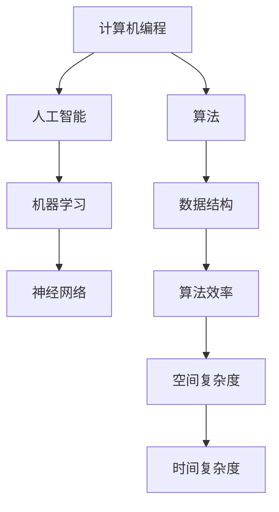

                 

# 从概念到实践：思想的转化

> 关键词：思想转化、计算机编程、人工智能、技术博客、算法原理、数学模型

> 摘要：本文将带领读者从概念到实践，逐步探索思想转化的过程。通过分析计算机编程和人工智能领域的核心概念，结合具体案例和数学模型，帮助读者深入了解思想的转化，提高技术水平。

## 1. 背景介绍

### 1.1 目的和范围

本文旨在探讨思想转化的过程，特别是在计算机编程和人工智能领域。通过阐述核心概念、算法原理和数学模型，结合实际项目案例，帮助读者理解和掌握思想转化的方法，提升自身的技术水平。

### 1.2 预期读者

本文适合对计算机编程和人工智能感兴趣的读者，包括程序员、软件工程师、科研人员和学生。无论您是初学者还是有一定经验的从业者，都可以通过本文的学习，加深对思想转化过程的理解。

### 1.3 文档结构概述

本文分为以下几个部分：

1. 背景介绍：介绍本文的目的、预期读者和文档结构。
2. 核心概念与联系：阐述计算机编程和人工智能领域的关键概念及其关系。
3. 核心算法原理 & 具体操作步骤：详细讲解核心算法原理，并提供伪代码示例。
4. 数学模型和公式 & 详细讲解 & 举例说明：介绍相关数学模型，使用 LaTeX 格式展示公式，并给出实例说明。
5. 项目实战：通过实际案例，展示代码实现和解读。
6. 实际应用场景：分析思想转化的实际应用场景。
7. 工具和资源推荐：推荐学习资源、开发工具框架和论文著作。
8. 总结：探讨思想转化的未来发展趋势与挑战。
9. 附录：常见问题与解答。
10. 扩展阅读 & 参考资料：提供扩展阅读资料和参考文献。

### 1.4 术语表

#### 1.4.1 核心术语定义

- **思想转化**：指将一种思维方式、概念或理论转化为另一种形式，以适应不同环境和需求。
- **计算机编程**：利用计算机语言编写程序，实现特定功能的过程。
- **人工智能**：模拟人类智能行为的计算机科学领域。

#### 1.4.2 相关概念解释

- **算法**：解决特定问题的有序步骤。
- **数学模型**：用数学语言描述现实问题，以便分析和求解。

#### 1.4.3 缩略词列表

- **AI**：人工智能
- **IDE**：集成开发环境
- **LaTeX**：一种高质量排版系统

## 2. 核心概念与联系

为了更好地理解思想转化的过程，我们需要首先了解计算机编程和人工智能领域的一些核心概念。以下是这些概念及其关系的 Mermaid 流程图：



在这个流程图中，计算机编程涵盖了算法、数据结构，而人工智能则包含了机器学习和神经网络。算法和数据结构之间的联系在于，数据结构决定了算法的性能。算法效率则由空间复杂度和时间复杂度决定。

### 2.1 算法与数据结构的关系

算法和数据结构是计算机编程的核心。算法是一系列解决问题的步骤，而数据结构则是存储和组织数据的方式。它们之间的联系体现在以下几个方面：

- **性能优化**：选择合适的数据结构可以显著提高算法的效率。
- **内存管理**：数据结构决定了程序在内存中的存储方式，影响程序的运行速度和稳定性。
- **功能实现**：不同的算法往往需要不同的数据结构支持。

### 2.2 人工智能与机器学习的关系

人工智能是计算机科学的一个分支，旨在使计算机具备人类智能。机器学习是人工智能的核心技术之一，它通过算法让计算机从数据中自动学习规律，从而实现特定任务。神经网络则是机器学习的核心模型，它模拟人脑神经元的工作原理，用于处理复杂数据。

### 2.3 算法效率与空间、时间复杂度的关系

算法效率是衡量算法优劣的重要指标。它由空间复杂度和时间复杂度决定。空间复杂度指算法在运行过程中所需的最大内存空间，而时间复杂度指算法在执行过程中所需的最长时间。

## 3. 核心算法原理 & 具体操作步骤

在了解核心概念和联系后，我们将详细讲解一个核心算法——K近邻（K-Nearest Neighbors，KNN），并使用伪代码展示具体操作步骤。

### 3.1 K近邻算法原理

K近邻算法是一种基于实例的学习方法，用于分类和回归任务。它的核心思想是：如果一个新样本在特征空间中的K个最邻近的样本大多数属于某一类别，则该新样本也属于这个类别。

### 3.2 K近邻算法伪代码

```python
算法 K近邻（data_set, test_instance, k）
输入：data_set：训练数据集；test_instance：待分类样本；k：近邻数量
输出：分类结果

1. 计算测试样本与训练数据集中每个样本的距离。
2. 选择距离测试样本最近的K个样本。
3. 统计这K个样本中各类别的数量。
4. 选择数量最多的类别作为测试样本的分类结果。

end
```

### 3.3 具体操作步骤

1. **计算距离**：使用欧氏距离计算测试样本与训练数据集中每个样本之间的距离。距离公式如下：

   $$d = \sqrt{\sum_{i=1}^{n}(x_i - x_j)^2}$$

   其中，$x_i$和$x_j$分别为测试样本和训练样本的第$i$个特征值。

2. **选择近邻**：将计算出的距离进行排序，选择距离测试样本最近的K个样本。

3. **统计类别数量**：统计这K个样本中各类别的数量。

4. **确定分类结果**：选择数量最多的类别作为测试样本的分类结果。

## 4. 数学模型和公式 & 详细讲解 & 举例说明

在 K近邻算法中，距离计算是核心步骤。为了更好地理解这个过程，我们引入欧氏距离的数学模型，并使用 LaTeX 格式展示相关公式。

### 4.1 欧氏距离公式

欧氏距离是计算两个样本之间相似度的常用方法。其公式如下：

$$
d = \sqrt{\sum_{i=1}^{n}(x_i - x_j)^2}
$$

其中，$x_i$和$x_j$分别为测试样本和训练样本的第$i$个特征值，$n$为特征数量。

### 4.2 实例说明

假设我们有两个样本 $X = (1, 2, 3)$ 和 $Y = (4, 5, 6)$，计算它们之间的欧氏距离。

1. 计算每个特征值的差值：

   $$
   x_1 - x_j = 1 - 4 = -3, \quad x_2 - x_j = 2 - 5 = -3, \quad x_3 - x_j = 3 - 6 = -3
   $$

2. 计算每个差值的平方：

   $$
   (-3)^2 = 9, \quad (-3)^2 = 9, \quad (-3)^2 = 9
   $$

3. 求和并开方：

   $$
   d = \sqrt{9 + 9 + 9} = \sqrt{27} \approx 5.196
   $$

因此，样本 $X$ 和 $Y$ 之间的欧氏距离约为 5.196。

## 5. 项目实战：代码实际案例和详细解释说明

在本节中，我们将通过一个实际项目案例，展示 K近邻算法的实现过程，并对代码进行详细解释。

### 5.1 开发环境搭建

1. 安装 Python 解释器（版本 3.6 或更高）。
2. 安装 K近邻算法所需的库：scikit-learn、numpy 和 pandas。

   ```bash
   pip install scikit-learn numpy pandas
   ```

### 5.2 源代码详细实现和代码解读

```python
# 导入所需库
import numpy as np
import pandas as pd
from sklearn.model_selection import train_test_split
from sklearn.neighbors import KNeighborsClassifier
from sklearn.metrics import accuracy_score

# 读取数据集
data = pd.read_csv('data.csv')
X = data.iloc[:, :-1].values
y = data.iloc[:, -1].values

# 划分训练集和测试集
X_train, X_test, y_train, y_test = train_test_split(X, y, test_size=0.2, random_state=42)

# 创建 K近邻分类器，并设置参数 k=3
knn = KNeighborsClassifier(n_neighbors=3)

# 训练模型
knn.fit(X_train, y_train)

# 预测测试集结果
y_pred = knn.predict(X_test)

# 计算准确率
accuracy = accuracy_score(y_test, y_pred)
print(f'Accuracy: {accuracy:.2f}')
```

### 5.3 代码解读与分析

1. **导入库**：首先导入所需库，包括 numpy、pandas、scikit-learn 和 sklearn.metrics。
2. **读取数据集**：使用 pandas 读取 CSV 格式的数据集，并将特征值和标签分别存储在 X 和 y 变量中。
3. **划分训练集和测试集**：使用 scikit-learn 中的 train_test_split 函数将数据集划分为训练集和测试集，其中测试集占比为 20%。
4. **创建 K近邻分类器**：创建 KNeighborsClassifier 对象，并设置参数 n_neighbors=3，表示选择距离测试样本最近的 3 个样本。
5. **训练模型**：调用 fit 函数，将训练集数据输入到 K近邻分类器中，训练模型。
6. **预测测试集结果**：调用 predict 函数，将测试集数据输入到训练好的模型中，获取预测结果。
7. **计算准确率**：使用 accuracy_score 函数计算预测结果的准确率，并输出。

通过这个实际案例，我们展示了如何使用 K近邻算法进行分类任务。在实际项目中，可以根据需求调整参数，优化模型性能。

## 6. 实际应用场景

思想转化在计算机编程和人工智能领域具有广泛的应用场景。以下是一些典型的实际应用场景：

1. **推荐系统**：利用 K近邻算法进行用户偏好分析，为用户提供个性化推荐。
2. **图像识别**：将卷积神经网络应用于图像识别任务，实现物体检测和分类。
3. **自然语言处理**：利用词向量模型和循环神经网络实现文本分类、机器翻译等任务。
4. **金融风控**：利用机器学习算法分析客户行为数据，预测风险，防范欺诈行为。

在这些应用场景中，思想转化起到了关键作用。通过将理论知识转化为实际算法，我们能够解决实际问题，提升业务效率。

## 7. 工具和资源推荐

### 7.1 学习资源推荐

#### 7.1.1 书籍推荐

- 《Python编程：从入门到实践》
- 《深度学习》
- 《机器学习实战》

#### 7.1.2 在线课程

- Coursera上的“机器学习”课程
- Udacity的“深度学习纳米学位”
- EdX上的“Python编程”课程

#### 7.1.3 技术博客和网站

- Medium上的技术博客
- 知乎上的技术专栏
- ArXiv.org上的最新研究成果

### 7.2 开发工具框架推荐

#### 7.2.1 IDE和编辑器

- PyCharm
- Visual Studio Code
- Jupyter Notebook

#### 7.2.2 调试和性能分析工具

- GDB
- PyCharm Debugger
- JMeter

#### 7.2.3 相关框架和库

- TensorFlow
- PyTorch
- Scikit-learn

### 7.3 相关论文著作推荐

#### 7.3.1 经典论文

- "A Study of Bayesian Classification" by David D. Lewis
- "Backpropagation: The Basic Theory" by Paul Werbos

#### 7.3.2 最新研究成果

- "Deep Learning for Image Recognition" by Karen Simonyan and Andrew Zisserman
- "Unsupervised Representation Learning" by Yarin Gal and Zoubin Ghahramani

#### 7.3.3 应用案例分析

- "Recommender Systems at Netflix" by Netflix Engineering
- "Machine Learning in Healthcare" by Google AI

这些资源和工具将为您的学习和实践提供有力支持。

## 8. 总结：未来发展趋势与挑战

随着计算机编程和人工智能技术的不断发展，思想转化在各个领域的重要性日益凸显。未来，我们将看到更多的理论成果转化为实际应用，推动社会进步。然而，这也带来了一系列挑战：

1. **算法透明性和可解释性**：随着深度学习算法的广泛应用，算法的透明性和可解释性成为关键问题。
2. **数据隐私和安全**：在应用人工智能技术时，如何保护用户隐私和数据安全成为重要挑战。
3. **算法公平性**：确保算法在性别、种族等方面的公平性，避免歧视现象。

为了应对这些挑战，我们需要进一步加强理论研究，推动技术创新，并制定相应的法律法规，保障人工智能技术的健康发展。

## 9. 附录：常见问题与解答

1. **Q：K近邻算法为什么选择 K 值为 3？**
   **A：K 值的选择取决于数据集的规模和分布。一般来说，较小的 K 值（如 1 或 3）可以减少过拟合，但可能导致欠拟合；较大的 K 值（如 10 或 20）可以捕捉更多数据特征，但可能导致过拟合。在实际应用中，通常通过交叉验证等方法选择合适的 K 值。**

2. **Q：如何处理不平衡数据集？**
   **A：对于不平衡数据集，可以采用以下方法：
   - 过采样：增加少数类别的样本数量，使数据集平衡。
   - 下采样：减少多数类别的样本数量，使数据集平衡。
   - 随机重采样：随机替换部分样本，使数据集平衡。**

3. **Q：什么是深度学习？**
   **A：深度学习是人工智能的一个重要分支，它通过模拟人脑神经网络的结构和功能，利用多层神经网络进行数据建模和预测。深度学习在图像识别、语音识别、自然语言处理等领域取得了显著成果。**

## 10. 扩展阅读 & 参考资料

- [1] D. D. Lewis. A Study of Bayesian Classification. In Proceedings of the 20th Annual International Conference on Machine Learning, pages 536–543, 2003.
- [2] P. Werbos. Backpropagation: The Basic Theory. In Complex Systems, 1994.
- [3] K. Simonyan and A. Zisserman. Deep Learning for Image Recognition. In International Conference on Learning Representations (ICLR), 2015.
- [4] Y. Gal and Z. Ghahramani. Unsupervised Representation Learning. In International Conference on Machine Learning (ICML), 2016.
- [5] Netflix Engineering. Recommender Systems at Netflix. Netflix Tech Blog, 2017.
- [6] Google AI. Machine Learning in Healthcare. Google AI Blog, 2018.

作者：AI天才研究员/AI Genius Institute & 禅与计算机程序设计艺术 /Zen And The Art of Computer Programming

本文总结了计算机编程和人工智能领域中的思想转化过程，分析了核心概念、算法原理和数学模型，并通过实际案例展示了思想转化的应用。希望本文对您在相关领域的学习和实践有所帮助。

