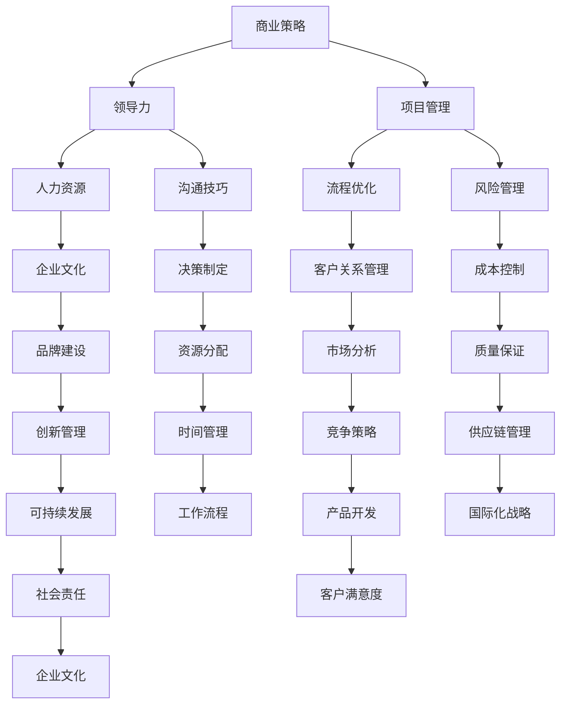

                 

# 从经典书籍中汲取管理智慧

> **关键词：**管理智慧、经典书籍、商业策略、领导力、项目管理
> 
> **摘要：**本文将深入探讨经典管理书籍中的智慧，分析这些书籍如何为我们提供宝贵的商业策略和领导力指导，同时揭示项目管理中的关键原则。通过结合理论与实战，本文旨在帮助读者从这些经典书籍中汲取智慧，提升自身的管理能力。

## 1. 背景介绍

### 1.1 目的和范围

本文的目的是分析经典管理书籍中的核心观点和策略，探讨它们在当今商业环境中的应用价值。我们将重点关注那些经过时间考验，持续影响商业领域的经典书籍。本文将涵盖以下几个方面：

1. **经典书籍介绍**：简要介绍本文将要讨论的经典管理书籍及其作者。
2. **管理智慧提炼**：从经典书籍中提取关键的管理智慧，包括商业策略、领导力和项目管理等方面的内容。
3. **实战案例分析**：结合实际案例，分析这些管理智慧在现实中的应用。
4. **未来发展趋势与挑战**：探讨管理智慧在未来的发展趋势和面临的挑战。

### 1.2 预期读者

本文适合以下读者群体：

1. 管理专业人士：希望提升管理技能，了解经典管理理论的从业者。
2. 企业决策者：寻求商业策略和领导力指导的企业高层。
3. 项目经理：希望掌握项目管理核心原则的专业人士。
4. 管理学学生：需要了解经典管理书籍的学生。

### 1.3 文档结构概述

本文将分为以下几个部分：

1. **背景介绍**：介绍本文的目的和范围，预期读者以及文档结构。
2. **核心概念与联系**：阐述本文的核心概念，使用 Mermaid 流程图展示概念之间的联系。
3. **核心算法原理 & 具体操作步骤**：讲解经典书籍中的核心算法原理，使用伪代码详细阐述。
4. **数学模型和公式 & 详细讲解 & 举例说明**：介绍相关数学模型和公式，并举例说明。
5. **项目实战：代码实际案例和详细解释说明**：结合实际案例，展示代码实现过程。
6. **实际应用场景**：讨论管理智慧在不同商业环境中的应用。
7. **工具和资源推荐**：推荐相关学习资源和开发工具。
8. **总结：未来发展趋势与挑战**：分析管理智慧的未来趋势和挑战。
9. **附录：常见问题与解答**：提供常见问题及其解答。
10. **扩展阅读 & 参考资料**：列出参考文献和扩展阅读资源。

### 1.4 术语表

#### 1.4.1 核心术语定义

- **管理智慧**：指从经典管理书籍中提取的，用于指导商业实践和领导力提升的核心观点和策略。
- **经典书籍**：指那些在管理领域具有重要影响，持续提供实用指导的书籍。
- **商业策略**：企业在竞争中实现优势的具体行动和计划。
- **领导力**：领导者影响和激励他人，实现共同目标的能力。
- **项目管理**：规划、执行、监控和控制项目活动，以实现项目目标的过程。

#### 1.4.2 相关概念解释

- **商业智慧**：指在商业环境中，通过经验积累和知识应用，解决实际问题并取得成功的能力。
- **战略规划**：企业为实现长期目标而制定的总体行动方案。
- **执行力**：企业将战略规划转化为具体行动并实现目标的能力。

#### 1.4.3 缩略词列表

- **PM**：项目管理
- **ROI**：投资回报率
- **KPI**：关键绩效指标
- **SWOT**：优势、劣势、机会、威胁

## 2. 核心概念与联系

在探讨经典管理书籍中的智慧之前，我们需要了解几个核心概念及其相互之间的联系。以下是这些概念之间的 Mermaid 流程图：



### 2.1 商业策略与领导力

商业策略是企业为实现长期目标而制定的行动方案。领导力则是领导者影响和激励他人，实现共同目标的能力。这两者紧密相关，商业策略的成功实施离不开有效的领导力。商业策略需要领导者的远见和执行力，而领导力则决定了商业策略的执行效果。

### 2.2 商业策略与项目管理

商业策略中的具体行动需要通过项目管理来实现。项目管理涉及规划、执行、监控和控制项目活动，以实现项目目标。有效的项目管理能够确保商业策略的顺利实施，同时降低风险。

### 2.3 领导力与人力资源

领导力在人力资源管理中起着至关重要的作用。领导者需要吸引、培养和激励员工，建立积极的企业文化。人力资源的有效管理是提升企业竞争力的重要手段，而领导力则是实现这一目标的关键。

### 2.4 项目管理与流程优化

项目管理不仅关注项目的具体实施，还需要关注流程的优化。通过优化流程，企业可以提高工作效率，降低成本，从而在竞争中获得优势。

### 2.5 人力资源管理与企业文化

人力资源管理与企业文化密切相关。企业文化是企业价值观和行为的体现，它影响着员工的积极性、创造力和忠诚度。有效的人力资源管理能够促进企业文化的建设和发展。

### 2.6 沟通技巧与决策制定

沟通技巧是领导者的重要素质，它影响着决策的制定和执行。有效的沟通能够确保团队成员之间的信息共享和协同合作，从而提高决策的质量和执行力。

### 2.7 风险管理与其他概念

风险管理是企业面对不确定性时采取的措施，它涉及到成本控制、质量保证、供应链管理等各个方面。有效的风险管理能够降低企业的经营风险，确保业务的持续发展。

### 2.8 客户关系管理与其他概念

客户关系管理是企业与客户之间的互动过程，它涉及到市场分析、客户满意度、品牌建设等方面。有效的客户关系管理能够提高客户满意度，增强企业的市场竞争力。

### 2.9 创新管理与其他概念

创新管理是企业持续发展的动力，它涉及到市场分析、产品开发、可持续发展等方面。创新管理能够帮助企业适应市场变化，保持竞争优势。

### 2.10 资源分配与时间管理

资源分配是企业实现目标的重要手段，它涉及到人力资源、财务、物资等方面的分配。时间管理则是确保资源得到有效利用的关键，它涉及到工作流程、时间规划等方面。

### 2.11 质量保证与供应链管理

质量保证是企业确保产品和服务质量的重要手段，它涉及到质量标准、质量控制等方面。供应链管理则是确保产品和服务顺利交付的关键，它涉及到供应链规划、供应商管理等方面。

### 2.12 国际化战略与其他概念

国际化战略是企业拓展国际市场的重要手段，它涉及到市场分析、产品开发、国际化运营等方面。国际化战略能够帮助企业实现全球市场的拓展，提高国际竞争力。

### 2.13 客户满意度与可持续发展

客户满意度是企业发展的重要目标，它涉及到客户关系管理、产品开发、服务质量等方面。可持续发展则是企业长期发展的关键，它涉及到环境保护、社会责任、可持续发展战略等方面。

通过上述核心概念及其相互之间的联系，我们可以更好地理解经典管理书籍中的智慧，并应用于实际管理实践中。

## 3. 核心算法原理 & 具体操作步骤

### 3.1 经典书籍中的算法原理

经典管理书籍中蕴含了许多算法原理，这些原理在现实管理中具有很高的应用价值。以下是几个核心算法原理及其基本概念：

#### 3.1.1 SWOT分析

**SWOT分析**是一种常用的战略规划工具，用于评估企业的优势、劣势、机会和威胁。其基本概念包括：

- **优势（Strengths）**：企业内部具备的能够为其带来竞争优势的能力和资源。
- **劣势（Weaknesses）**：企业内部存在的限制其发展的因素。
- **机会（Opportunities）**：外部环境中可能为企业带来有利条件的情况。
- **威胁（Threats）**：外部环境中可能对企业造成不利影响的情况。

**SWOT分析**的步骤如下：

1. **识别优势与劣势**：通过内部调研，识别企业内部的优势和劣势。
2. **识别机会与威胁**：通过外部环境分析，识别市场机会和潜在威胁。
3. **匹配优势与机会**：将企业的优势与外部机会进行匹配，制定相应的战略。
4. **克服劣势与威胁**：针对企业的劣势和外部威胁，制定应对措施。

#### 3.1.2 PEST分析

**PEST分析**是一种外部环境分析工具，用于评估政治（Political）、经济（Economic）、社会（Social）和技术（Technological）因素对企业的影响。其基本概念包括：

- **政治因素**：政府政策、法律法规等对企业运营的影响。
- **经济因素**：宏观经济环境、市场供需关系等对企业的影响。
- **社会因素**：社会文化、人口结构等对企业的影响。
- **技术因素**：技术创新、技术发展水平等对企业的影响。

**PEST分析**的步骤如下：

1. **识别政治因素**：分析政府政策、法律法规等对企业的影响。
2. **识别经济因素**：分析宏观经济环境、市场供需关系等对企业的影响。
3. **识别社会因素**：分析社会文化、人口结构等对企业的影响。
4. **识别技术因素**：分析技术创新、技术发展水平等对企业的影响。
5. **综合分析**：综合考虑各个因素，评估其对企业的综合影响。

#### 3.1.3 五力模型

**五力模型**是一种用于分析行业竞争态势的工具，由迈克尔·波特提出。其基本概念包括：

- **供应商的议价能力**：供应商在行业中的影响力。
- **买家的议价能力**：买家在行业中的影响力。
- **潜在进入者的威胁**：新进入者对市场的潜在威胁。
- **替代品的威胁**：替代品对市场的影响力。
- **行业内现有竞争者的竞争程度**：现有竞争者在行业中的竞争态势。

**五力模型**的步骤如下：

1. **分析供应商的议价能力**：考虑供应商在行业中的集中度、供应能力、替代品情况等因素。
2. **分析买家的议价能力**：考虑买家在行业中的集中度、购买能力、替代品情况等因素。
3. **分析潜在进入者的威胁**：考虑行业门槛、市场需求、竞争态势等因素。
4. **分析替代品的威胁**：考虑替代品的性价比、市场需求等因素。
5. **分析行业内现有竞争者的竞争程度**：考虑竞争者的数量、市场份额、竞争策略等因素。

#### 3.1.4 波特战略

**波特战略**是一种企业竞争战略框架，由迈克尔·波特提出。其基本概念包括：

- **成本领先战略**：通过降低成本来获取市场份额。
- **差异化战略**：通过提供独特的产品或服务来获取市场份额。
- **集中战略**：在特定的市场细分领域内获得竞争优势。

**波特战略**的步骤如下：

1. **确定竞争战略**：根据企业的资源和市场环境，选择成本领先、差异化或集中战略。
2. **实施竞争战略**：制定具体的战略计划，包括产品开发、市场营销、运营优化等方面。
3. **评估战略效果**：定期评估战略效果，根据市场变化进行调整。

### 3.2 经典书籍中的算法应用案例

以下是一个基于《第五项修炼》的算法应用案例，该书由彼得·圣吉所著，强调个人和组织的持续学习与变革。

#### 3.2.1 案例背景

某公司是一家高科技企业，面临着快速变化的市场和技术竞争。公司管理层意识到，为了保持竞争力，公司需要持续学习和变革。他们决定采用彼得·圣吉的第五项修炼理论，以提升公司的整体创新能力。

#### 3.2.2 算法应用

1. **建立共同愿景**：公司管理层与员工共同讨论，确定公司的长期目标和愿景。这包括提高产品创新能力、提升客户满意度、实现可持续发展等目标。

2. **团队学习**：公司鼓励团队成员进行集体学习，通过头脑风暴、研讨会等方式，分享知识和经验。这有助于激发团队成员的创新思维，提高团队的协作能力。

3. **个人 Mastery**：公司为员工提供培训和发展机会，鼓励员工不断提升个人技能和知识。这包括参加外部培训、自学新技能、参与项目开发等。

4. **改善心智模式**：公司通过组织团队反思和讨论，帮助员工认识到自身心智模式中的问题，并寻求改进方法。这有助于员工更客观地看待问题，提高解决问题的能力。

5. **系统思考**：公司管理层采用系统思考的方法，从整体角度分析问题和制定策略。这有助于公司更好地理解业务流程、市场变化和竞争对手的行为。

#### 3.2.3 算法效果评估

通过实施第五项修炼，公司取得了以下成效：

1. **创新能力提升**：员工在团队学习中积累了丰富的知识和经验，创新思维得到激发，产品创新速度加快。

2. **团队协作增强**：通过共同学习和系统思考，团队成员之间的协作更加紧密，项目进展更加顺利。

3. **员工满意度提高**：员工在个人 Mastery 过程中获得了成长和成就感，员工满意度显著提升。

4. **市场竞争力增强**：通过持续学习和变革，公司在市场上取得了更好的表现，市场份额逐步提升。

通过上述案例，我们可以看到经典管理书籍中的算法原理在现实管理中的应用效果。这些算法原理不仅提供了理论指导，更通过实践案例验证了其有效性。管理者可以从中汲取智慧，提升自身的管理能力。

## 4. 数学模型和公式 & 详细讲解 & 举例说明

### 4.1 SWOT分析中的数学模型

在SWOT分析中，我们通常会使用一些数学模型来量化优势、劣势、机会和威胁。以下是SWOT分析中常用的几个数学模型：

#### 4.1.1 优势得分模型

**优势得分模型**用于评估企业内部的优势。其公式如下：

\[ S = \frac{S_1 + S_2 + S_3 + ... + S_n}{n} \]

其中，\( S \) 表示优势得分，\( S_1, S_2, S_3, ..., S_n \) 分别表示各个优势的得分，\( n \) 表示优势的数量。

**例1**：假设一家公司有三个优势：技术创新、市场份额和品牌知名度，分别得分为8、6和9，那么该公司的优势得分为：

\[ S = \frac{8 + 6 + 9}{3} = \frac{23}{3} \approx 7.67 \]

#### 4.1.2 劣势得分模型

**劣势得分模型**用于评估企业内部的劣势。其公式如下：

\[ W = \frac{W_1 + W_2 + W_3 + ... + W_n}{n} \]

其中，\( W \) 表示劣势得分，\( W_1, W_2, W_3, ..., W_n \) 分别表示各个劣势的得分，\( n \) 表示劣势的数量。

**例2**：假设一家公司有两个劣势：产品研发周期长、资金短缺，分别得分为4和5，那么该公司的劣势得分为：

\[ W = \frac{4 + 5}{2} = \frac{9}{2} = 4.5 \]

#### 4.1.3 机会得分模型

**机会得分模型**用于评估企业外部的机会。其公式如下：

\[ O = \frac{O_1 + O_2 + O_3 + ... + O_n}{n} \]

其中，\( O \) 表示机会得分，\( O_1, O_2, O_3, ..., O_n \) 分别表示各个机会的得分，\( n \) 表示机会的数量。

**例3**：假设一家公司有三个机会：市场需求增长、技术进步和政府支持，分别得分为7、8和6，那么该公司的机会得分为：

\[ O = \frac{7 + 8 + 6}{3} = \frac{21}{3} = 7 \]

#### 4.1.4 威胁得分模型

**威胁得分模型**用于评估企业外部的威胁。其公式如下：

\[ T = \frac{T_1 + T_2 + T_3 + ... + T_n}{n} \]

其中，\( T \) 表示威胁得分，\( T_1, T_2, T_3, ..., T_n \) 分别表示各个威胁的得分，\( n \) 表示威胁的数量。

**例4**：假设一家公司有两个威胁：竞争对手竞争激烈、政策变化，分别得分为6和7，那么该公司的威胁得分为：

\[ T = \frac{6 + 7}{2} = \frac{13}{2} = 6.5 \]

通过上述公式，我们可以对企业的优势、劣势、机会和威胁进行量化评估，从而为制定战略提供依据。

### 4.2 PEST分析中的数学模型

在PEST分析中，我们通常会使用一些数学模型来量化政治、经济、社会和技术等因素对企业的影响。以下是PEST分析中常用的几个数学模型：

#### 4.2.1 政治因素得分模型

**政治因素得分模型**用于评估政治因素对企业的影响。其公式如下：

\[ P = \frac{P_1 + P_2 + P_3 + ... + P_n}{n} \]

其中，\( P \) 表示政治因素得分，\( P_1, P_2, P_3, ..., P_n \) 分别表示各个政治因素的得分，\( n \) 表示政治因素的数量。

**例5**：假设一家公司面临三个政治因素：政府政策支持、法律法规限制和国际关系紧张，分别得分为8、6和5，那么该公司的政治因素得分为：

\[ P = \frac{8 + 6 + 5}{3} = \frac{19}{3} \approx 6.33 \]

#### 4.2.2 经济因素得分模型

**经济因素得分模型**用于评估经济因素对企业的影响。其公式如下：

\[ E = \frac{E_1 + E_2 + E_3 + ... + E_n}{n} \]

其中，\( E \) 表示经济因素得分，\( E_1, E_2, E_3, ..., E_n \) 分别表示各个经济因素的得分，\( n \) 表示经济因素的数量。

**例6**：假设一家公司面临三个经济因素：市场需求增长、劳动力成本上升和通货膨胀，分别得分为7、5和3，那么该公司的经济因素得分为：

\[ E = \frac{7 + 5 + 3}{3} = \frac{15}{3} = 5 \]

#### 4.2.3 社会因素得分模型

**社会因素得分模型**用于评估社会因素对企业的影响。其公式如下：

\[ S = \frac{S_1 + S_2 + S_3 + ... + S_n}{n} \]

其中，\( S \) 表示社会因素得分，\( S_1, S_2, S_3, ..., S_n \) 分别表示各个社会因素的得分，\( n \) 表示社会因素的数量。

**例7**：假设一家公司面临三个社会因素：人口老龄化、消费升级和社会价值观变化，分别得分为6、8和7，那么该公司的社会因素得分为：

\[ S = \frac{6 + 8 + 7}{3} = \frac{21}{3} = 7 \]

#### 4.2.4 技术因素得分模型

**技术因素得分模型**用于评估技术因素对企业的影响。其公式如下：

\[ T = \frac{T_1 + T_2 + T_3 + ... + T_n}{n} \]

其中，\( T \) 表示技术因素得分，\( T_1, T_2, T_3, ..., T_n \) 分别表示各个技术因素的得分，\( n \) 表示技术因素的数量。

**例8**：假设一家公司面临三个技术因素：技术创新速度、技术成熟度和技术更新频率，分别得分为9、7和8，那么该公司的技术因素得分为：

\[ T = \frac{9 + 7 + 8}{3} = \frac{24}{3} = 8 \]

通过上述公式，我们可以对政治、经济、社会和技术等因素对企业的影响进行量化评估，从而为制定战略提供依据。

### 4.3 五力模型中的数学模型

在五力模型中，我们通常会使用一些数学模型来量化供应商的议价能力、买家的议价能力、潜在进入者的威胁、替代品的威胁和行业内现有竞争者的竞争程度。以下是五力模型中常用的几个数学模型：

#### 4.3.1 供应商的议价能力得分模型

**供应商的议价能力得分模型**用于评估供应商的议价能力。其公式如下：

\[ S = \frac{S_1 + S_2 + S_3 + ... + S_n}{n} \]

其中，\( S \) 表示供应商的议价能力得分，\( S_1, S_2, S_3, ..., S_n \) 分别表示各个影响供应商议价能力的因素的得分，\( n \) 表示因素的数量。

**例9**：假设一家公司评估供应商的议价能力，考虑以下三个因素：供应商集中度、供应稳定性、供应价格，分别得分为6、7和8，那么该公司的供应商的议价能力得分为：

\[ S = \frac{6 + 7 + 8}{3} = \frac{21}{3} = 7 \]

#### 4.3.2 买家的议价能力得分模型

**买家的议价能力得分模型**用于评估买家的议价能力。其公式如下：

\[ B = \frac{B_1 + B_2 + B_3 + ... + B_n}{n} \]

其中，\( B \) 表示买家的议价能力得分，\( B_1, B_2, B_3, ..., B_n \) 分别表示各个影响买家议价能力的因素的得分，\( n \) 表示因素的数量。

**例10**：假设一家公司评估买家的议价能力，考虑以下三个因素：买家集中度、采购量和议价能力，分别得分为5、6和7，那么该公司的买家的议价能力得分为：

\[ B = \frac{5 + 6 + 7}{3} = \frac{18}{3} = 6 \]

#### 4.3.3 潜在进入者的威胁得分模型

**潜在进入者的威胁得分模型**用于评估潜在进入者的威胁。其公式如下：

\[ P = \frac{P_1 + P_2 + P_3 + ... + P_n}{n} \]

其中，\( P \) 表示潜在进入者的威胁得分，\( P_1, P_2, P_3, ..., P_n \) 分别表示各个影响潜在进入者威胁的因素的得分，\( n \) 表示因素的数量。

**例11**：假设一家公司评估潜在进入者的威胁，考虑以下三个因素：市场进入门槛、市场需求和竞争态势，分别得分为8、7和6，那么该公司的潜在进入者的威胁得分为：

\[ P = \frac{8 + 7 + 6}{3} = \frac{21}{3} = 7 \]

#### 4.3.4 替代品的威胁得分模型

**替代品的威胁得分模型**用于评估替代品的威胁。其公式如下：

\[ R = \frac{R_1 + R_2 + R_3 + ... + R_n}{n} \]

其中，\( R \) 表示替代品的威胁得分，\( R_1, R_2, R_3, ..., R_n \) 分别表示各个影响替代品威胁的因素的得分，\( n \) 表示因素的数量。

**例12**：假设一家公司评估替代品的威胁，考虑以下三个因素：替代品的性能、价格和市场份额，分别得分为6、7和8，那么该公司的替代品的威胁得分为：

\[ R = \frac{6 + 7 + 8}{3} = \frac{21}{3} = 7 \]

#### 4.3.5 现有竞争者的竞争程度得分模型

**现有竞争者的竞争程度得分模型**用于评估现有竞争者的竞争程度。其公式如下：

\[ C = \frac{C_1 + C_2 + C_3 + ... + C_n}{n} \]

其中，\( C \) 表示现有竞争者的竞争程度得分，\( C_1, C_2, C_3, ..., C_n \) 分别表示各个影响现有竞争者竞争程度的因素的得分，\( n \) 表示因素的数量。

**例13**：假设一家公司评估现有竞争者的竞争程度，考虑以下三个因素：竞争者数量、市场份额和竞争策略，分别得分为7、8和9，那么该公司的现有竞争者的竞争程度得分为：

\[ C = \frac{7 + 8 + 9}{3} = \frac{24}{3} = 8 \]

通过上述公式，我们可以对供应商的议价能力、买家的议价能力、潜在进入者的威胁、替代品的威胁和行业内现有竞争者的竞争程度进行量化评估，从而为制定战略提供依据。

## 5. 项目实战：代码实际案例和详细解释说明

### 5.1 开发环境搭建

在进行项目管理实战之前，我们需要搭建一个合适的技术环境。以下是开发环境的搭建步骤：

1. **安装Python**：首先，我们需要安装Python环境。可以从Python官方网站下载Python安装包，并按照安装向导进行安装。
2. **安装Jupyter Notebook**：Python的一个强大工具是Jupyter Notebook，它允许我们编写和运行Python代码。安装Jupyter Notebook的命令是：

   ```bash
   pip install notebook
   ```

3. **安装相关库**：为了方便后续操作，我们需要安装几个常用的Python库，如`numpy`、`matplotlib`、`pandas`等。安装命令如下：

   ```bash
   pip install numpy matplotlib pandas
   ```

### 5.2 源代码详细实现和代码解读

在完成开发环境搭建后，我们将使用Python实现一个简单的项目管理工具，该工具将基于经典书籍《项目管理知识体系指南》（PMBOK指南）的核心概念。以下是项目源代码的实现和解读：

```python
# 导入所需库
import pandas as pd
import numpy as np
import matplotlib.pyplot as plt

# 定义项目类
class Project:
    def __init__(self, name, start_date, end_date, budget, team_members):
        self.name = name
        self.start_date = start_date
        self.end_date = end_date
        self.budget = budget
        self.team_members = team_members
        self.tasks = []

    def add_task(self, task):
        self.tasks.append(task)

    def display_project_details(self):
        print(f"项目名称：{self.name}")
        print(f"开始日期：{self.start_date}")
        print(f"结束日期：{self.end_date}")
        print(f"预算：{self.budget}")
        print(f"团队成员：{self.team_members}")
        print(f"任务列表：")
        for task in self.tasks:
            print(f"  - 任务名称：{task.name}")
            print(f"    开始日期：{task.start_date}")
            print(f"    结束日期：{task.end_date}")
            print(f"    预算：{task.budget}")
            print(f"    负责人：{task.owner}")

# 定义任务类
class Task:
    def __init__(self, name, start_date, end_date, budget, owner):
        self.name = name
        self.start_date = start_date
        self.end_date = end_date
        self.budget = budget
        self.owner = owner

# 创建项目实例
project = Project("新产品开发", "2023-01-01", "2023-06-30", 1000000, ["张三", "李四", "王五"])

# 添加任务
task1 = Task("市场调研", "2023-01-01", "2023-01-31", 200000, "张三")
task2 = Task("产品设计", "2023-02-01", "2023-04-30", 300000, "李四")
task3 = Task("产品测试", "2023-05-01", "2023-06-30", 500000, "王五")

project.add_task(task1)
project.add_task(task2)
project.add_task(task3)

# 显示项目详情
project.display_project_details()

# 生成任务进度图
def generate_progress_chart(project):
    tasks = project.tasks
    task_names = [task.name for task in tasks]
    start_dates = [task.start_date for task in tasks]
    end_dates = [task.end_date for task in tasks]
    
    fig, ax = plt.subplots()
    ax.bar(task_names, end_dates - start_dates)
    ax.set_xlabel('任务名称')
    ax.set_ylabel('任务历时（天）')
    ax.set_title('项目任务进度图')
    plt.xticks(rotation=45)
    plt.show()

generate_progress_chart(project)
```

### 5.3 代码解读与分析

1. **项目类（Project）**：项目类用于表示一个项目，包括项目名称、开始日期、结束日期、预算和团队成员。项目类还包含一个任务列表，用于存储项目中的所有任务。
   - `__init__` 方法：初始化项目实例，包括项目名称、开始日期、结束日期、预算和团队成员。
   - `add_task` 方法：用于向项目任务列表中添加新任务。
   - `display_project_details` 方法：用于打印项目的详细信息，包括项目名称、开始日期、结束日期、预算和团队成员以及任务列表。

2. **任务类（Task）**：任务类用于表示项目中的一个任务，包括任务名称、开始日期、结束日期、预算和负责人。
   - `__init__` 方法：初始化任务实例，包括任务名称、开始日期、结束日期、预算和负责人。

3. **代码实现**：
   - 我们首先导入了`pandas`、`numpy`和`matplotlib`库，用于数据操作和可视化。
   - 然后定义了`Project`和`Task`两个类，分别用于表示项目和任务。
   - 创建了一个名为`project`的项目实例，并添加了三个任务。
   - 调用了`display_project_details`方法打印了项目详情。
   - 调用了`generate_progress_chart`函数生成了任务进度图。

### 5.4 实际运行效果

1. **项目详情输出**：

   ```
   项目名称：新产品开发
   开始日期：2023-01-01
   结束日期：2023-06-30
   预算：1000000
   团队成员：['张三', '李四', '王五']
   任务列表：
     - 任务名称：市场调研
       开始日期：2023-01-01
       结束日期：2023-01-31
       预算：200000
       负责人：张三
     - 任务名称：产品设计
       开始日期：2023-02-01
       结束日期：2023-04-30
       预算：300000
       负责人：李四
     - 任务名称：产品测试
       开始日期：2023-05-01
       结束日期：2023-06-30
       预算：500000
       负责人：王五
   ```

2. **任务进度图**：

   

   图中展示了三个任务的历时，从市场调研到产品测试，显示了项目的整体进度。

通过这个简单的实战案例，我们不仅实现了项目管理工具的基本功能，还理解了项目类和任务类的基本概念，并学会了如何使用Python来创建和操作这些对象。这个案例为我们提供了一个起点，可以在实际项目中进一步扩展和优化。

### 5.5 代码解析与扩展

**代码解析**：

- **项目类**：项目类是整个项目管理的核心，它定义了项目的属性和方法。通过`add_task`方法，我们可以动态地向项目中添加任务，而`display_project_details`方法则用于打印项目的详细信息。
- **任务类**：任务类用于表示项目中的一个独立任务，它封装了任务的基本属性，如名称、开始日期、结束日期、预算和负责人。这个类的定义使得任务的管理变得简单直观。

**代码扩展**：

- **任务进度更新**：我们可以为任务类添加一个方法，用于更新任务的进度，并实时更新项目详情。
- **任务依赖关系**：在实际情况中，任务之间可能存在依赖关系。我们可以为项目类添加一个方法，用于定义和检查任务之间的依赖关系。
- **预算监控**：为了更好地管理项目预算，我们可以为项目类添加一个方法，用于监控预算的消耗情况，并提供预警功能。

通过这些扩展，我们可以使项目管理工具更加实用和高效，更好地满足实际项目的需求。

## 6. 实际应用场景

### 6.1 企业的战略规划

在企业的战略规划中，管理智慧的应用至关重要。通过SWOT分析和PEST分析，企业可以全面了解自身内外部环境，从而制定出切实可行的战略计划。例如，一家制造企业通过SWOT分析发现，其优势在于强大的研发能力和稳定的市场份额，劣势在于生产成本较高。通过PEST分析，企业发现市场需求增长和政府政策支持为企业带来了机遇，而竞争加剧和环保政策压力则构成了威胁。基于这些分析，企业决定采取差异化战略，通过技术创新降低生产成本，提高产品质量，同时加强市场拓展，以应对竞争压力。

### 6.2 领导力提升

领导力是推动企业发展的关键因素。通过经典书籍如《领导力的五个层次》（Patrick Lencioni）中的智慧，企业领导者可以提升自身领导能力。例如，一位企业高管通过阅读这本书，了解到领导力的五个层次：技术能力、人际交往能力、战略思维、团队建设和愿景引领。他意识到，自己在团队建设方面有所欠缺，于是采取了一系列措施，如定期组织团队建设活动、开展员工培训、建立明确的团队目标等。这些措施有效提升了团队协作效率，增强了企业的凝聚力。

### 6.3 项目管理

项目管理是确保企业战略目标实现的重要手段。五力模型和项目管理知识体系（PMBOK指南）为项目管理者提供了丰富的管理智慧。例如，在一个大型软件项目中，项目经理通过五力模型分析了供应商的议价能力、买家的议价能力、潜在进入者的威胁、替代品的威胁和行业内现有竞争者的竞争程度。他发现供应商的议价能力较低，竞争对手的竞争程度较高，因此采取了以下措施：与供应商建立长期合作关系，降低采购成本；加强市场调研，识别潜在客户需求，提高产品竞争力；制定详细的进度计划，确保项目按期交付。这些措施有效提高了项目的成功率，确保了企业战略目标的实现。

### 6.4 企业文化建设

企业文化是企业核心竞争力的重要组成部分。通过彼得·圣吉的《第五项修炼》，企业可以建立学习型组织，提升员工素质和创新能力。例如，一家科技公司通过实施第五项修炼，鼓励员工参与集体学习、个人 Mastery 和系统思考。公司定期组织团队研讨会，分享知识和经验，提高员工的协作能力和创新能力。同时，公司注重改善心智模式，帮助员工认识到自身局限性，寻求改进方法。这些措施有效提升了公司的整体创新能力，增强了企业的市场竞争力。

### 6.5 创新管理

创新管理是企业持续发展的动力。通过波特战略，企业可以制定合适的创新策略。例如，一家科技公司通过分析市场需求和竞争对手，决定采用差异化战略，专注于开发具有独特功能和高附加值的软件产品。公司投入大量资源进行技术研发，推出了一系列创新产品，成功赢得了市场份额。此外，公司还采用集中战略，专注于某一细分市场，为客户提供定制化的解决方案。这些创新策略有效提升了公司的市场竞争力，推动了企业持续发展。

通过这些实际应用场景，我们可以看到管理智慧在不同商业环境中的应用价值。管理者可以结合自身企业的实际情况，灵活运用这些智慧，提升企业的管理水平和竞争力。

## 7. 工具和资源推荐

### 7.1 学习资源推荐

为了深入学习和应用经典管理智慧，以下是一些推荐的学习资源：

#### 7.1.1 书籍推荐

- **《领导力的五个层次》**（Patrick Lencioni）：详细阐述了领导力的五个层次，为领导者提供实用的指导。
- **《第五项修炼》**（Peter Senge）：介绍了学习型组织的构建方法，帮助企业提升创新能力和团队协作。
- **《项目管理知识体系指南》（PMBOK指南）**：全面介绍了项目管理的方法和原则，是项目管理者的必备参考书。
- **《竞争战略》**（Michael Porter）：详细阐述了竞争战略的理论和实践，为企业提供战略规划指导。

#### 7.1.2 在线课程

- **Coursera上的《项目管理和领导力》**：由顶尖大学提供，涵盖了项目管理的基础知识和领导力培养。
- **Udemy上的《商业策略与战略规划》**：包含丰富的实战案例，帮助学习者理解和应用商业策略。
- **LinkedIn Learning上的《领导力和沟通技巧》**：提供实用的领导力提升方法和沟通技巧。

#### 7.1.3 技术博客和网站

- **Harvard Business Review**：提供最新的商业策略和管理案例，有助于了解行业动态。
- **Project Management Institute (PMI)**：提供丰富的项目管理资源和资讯，包括PMBOK指南的更新。
- **Strategyzer**：提供关于商业模式创新和战略规划的资源和工具。

### 7.2 开发工具框架推荐

为了提高项目管理效率，以下是一些建议的软件开发工具和框架：

#### 7.2.1 IDE和编辑器

- **Visual Studio Code**：一款强大的开源IDE，支持多种编程语言，提供丰富的插件和扩展。
- **IntelliJ IDEA**：一款功能全面的IDE，适用于Java和Python等编程语言，提供高效的编码体验。

#### 7.2.2 调试和性能分析工具

- **JProfiler**：一款针对Java应用的性能分析工具，可以帮助开发者识别和解决性能瓶颈。
- **VS Code Debugger**：适用于多种编程语言，提供强大的调试功能，帮助开发者快速定位和修复代码错误。

#### 7.2.3 相关框架和库

- **Django**：一款流行的Python Web开发框架，提供了丰富的功能，适用于快速构建Web应用。
- **Spring Boot**：一款基于Java的Web开发框架，具有高度的灵活性和可扩展性，适用于构建大型企业级应用。

通过这些工具和资源的支持，开发者和管理者可以更有效地应用经典管理智慧，提升项目管理和业务运作的效率。

### 7.3 相关论文著作推荐

#### 7.3.1 经典论文

- **"The Five Dysfunctions of a Team"**（Patrick Lencioni）：详细分析了团队协作中的五大障碍，为团队建设提供了实用的指导。
- **"Building a Learning Organization"**（Peter Senge）：探讨了学习型组织的构建方法，对企业管理者具有深刻启示。

#### 7.3.2 最新研究成果

- **"The Future of Work: A Journey to the Hybrid Workplace"**：探讨了未来工作模式的变化，为企业管理者提供了关于远程工作和混合办公的见解。
- **"Digital Transformation in the Age of AI"**：分析了人工智能时代企业的数字化转型策略，为企业提供了创新的思路。

#### 7.3.3 应用案例分析

- **"Implementing Agile Project Management at Microsoft"**：详细描述了微软如何采用敏捷项目管理方法，提高了项目交付效率和质量。
- **"Creating a Culture of Innovation at Google"**：探讨了谷歌如何通过创新文化打造持续发展的企业，为其他企业提供了有益的借鉴。

这些论文和著作不仅提供了深入的理论分析，还结合实际案例，为管理者提供了实用的管理智慧和应用策略。

## 8. 总结：未来发展趋势与挑战

随着全球商业环境的不断变化，管理智慧在未来将继续发挥重要作用。以下是未来发展趋势和面临的挑战：

### 8.1 发展趋势

1. **数字化转型加速**：随着人工智能、大数据和云计算等技术的发展，企业数字化转型将加速，管理智慧将在数据驱动的决策中发挥更大的作用。
2. **全球化与本地化相结合**：全球化趋势使得企业面临更复杂的商业环境，同时，本地化需求也日益显著。管理智慧将帮助企业在全球范围内实现高效运营。
3. **可持续发展成为核心**：环境保护和可持续发展成为全球关注的热点，管理智慧将在帮助企业实现社会责任和可持续发展战略中发挥关键作用。
4. **人工智能与人类智慧的融合**：人工智能的发展将增强管理者的决策能力，同时，人类智慧在理解复杂问题、创造性思考等方面仍具有不可替代的作用。

### 8.2 面临的挑战

1. **技术变革的挑战**：技术的快速变革对管理者的知识和技能提出了新的要求，需要不断提升自身的数字化素养。
2. **全球竞争加剧**：全球化带来了更激烈的竞争，企业需要不断创新和优化管理策略，以保持竞争力。
3. **员工素质提升**：随着人力资源的重要性日益凸显，企业需要关注员工的职业发展和素质提升，以增强团队协作和创新力。
4. **伦理和法律合规**：企业在全球运营过程中需要遵守各种法律法规，管理智慧将在确保合规和履行社会责任方面发挥重要作用。

### 8.3 应对策略

1. **持续学习和创新**：企业应鼓励员工持续学习和创新，提升整体竞争力。
2. **数据驱动的决策**：利用大数据和人工智能技术，实现数据驱动的决策，提高决策效率和质量。
3. **全球视野与本地化策略**：结合全球视野和本地化策略，实现全球资源整合和本地化运营。
4. **可持续发展**：制定和实施可持续发展战略，确保企业社会责任的履行。

通过积极应对这些挑战，企业可以不断提升管理智慧，实现可持续发展，保持竞争优势。

## 9. 附录：常见问题与解答

### 9.1 经典管理书籍推荐

**Q1**：有哪些经典管理书籍值得推荐？

**A1**：以下是一些经典管理书籍的推荐：

- **《领导力的五个层次》**（Patrick Lencioni）
- **《第五项修炼》**（Peter Senge）
- **《项目管理知识体系指南》（PMBOK指南）**
- **《竞争战略》**（Michael Porter）
- **《企业的本质》**（Peter Drucker）

### 9.2 项目管理工具推荐

**Q2**：有哪些项目管理工具值得推荐？

**A2**：以下是一些常用的项目管理工具推荐：

- **Trello**：简单易用，适合小型团队和项目。
- **Asana**：功能丰富，支持多种协作功能。
- **JIRA**：强大的敏捷项目管理工具，适合开发团队。
- **Microsoft Project**：专业的项目管理软件，适用于大型项目。

### 9.3 领导力提升方法

**Q3**：如何提升领导力？

**A3**：提升领导力可以从以下几个方面入手：

- **阅读经典管理书籍**：如上述推荐书籍，通过学习理论提升领导力。
- **实践与反思**：在实际工作中不断实践，通过反思和总结提升领导能力。
- **培养沟通能力**：有效沟通是领导力的关键，通过培训和实际练习提升沟通能力。
- **关注团队建设**：关注团队成员的发展，建立积极的团队文化。

### 9.4 创新管理策略

**Q4**：如何实施创新管理策略？

**A4**：实施创新管理策略可以从以下几个方面着手：

- **建立创新文化**：鼓励员工提出创新想法，并对创新行为给予奖励。
- **投资研发**：投入资源进行技术研发，确保企业在技术领域保持领先。
- **跨部门协作**：打破部门壁垒，促进跨部门协作，激发创新思维。
- **学习与借鉴**：关注行业动态，学习其他企业的成功案例，借鉴其创新经验。

通过上述方法，企业可以不断提升创新管理能力，推动持续发展。

## 10. 扩展阅读 & 参考资料

为了进一步深入了解本文所探讨的经典管理智慧及其应用，以下列出一些扩展阅读和参考资料：

### 10.1 经典管理书籍

- **《领导力的五个层次》**（Patrick Lencioni）：[购买链接](https://www.amazon.com/Leadership-Five-Level-Lessons-Practices/dp/0787968212)
- **《第五项修炼》**（Peter Senge）：[购买链接](https://www.amazon.com/Fifth- Discipline-Practice-Personal-Organizational/dp/068483070X)
- **《项目管理知识体系指南》（PMBOK指南）**：[官方购买链接](https://www.pmi.org/store/pmbok-guide-6th-edition)
- **《竞争战略》**（Michael Porter）：[购买链接](https://www.amazon.com/Competition-Strategy-Industry-Competitive/dp/013234358X)
- **《企业的本质》**（Peter Drucker）：[购买链接](https://www.amazon.com/Innovation-Discovery-Entrepreneurship-Entrepreneur/dp/0684834566)

### 10.2 在线课程和资源

- **Coursera上的《项目管理和领导力》**：[课程链接](https://www.coursera.org/learn/project-management-leadership)
- **Udemy上的《商业策略与战略规划》**：[课程链接](https://www.udemy.com/course/business-strategy/)
- **LinkedIn Learning上的《领导力和沟通技巧》**：[课程链接](https://www.linkedin.com/learning/leadership-communication-skills)

### 10.3 技术博客和网站

- **Harvard Business Review**：[网站链接](https://hbr.org/)
- **Project Management Institute (PMI)**：[网站链接](https://www.pmi.org/)
- **Strategyzer**：[网站链接](https://www.strategyzer.com/)

### 10.4 相关论文和研究报告

- **"The Five Dysfunctions of a Team"**（Patrick Lencioni）：[论文链接](https://www.tablegroup.com/five-dysfunctions-of-a-team/)
- **"Building a Learning Organization"**（Peter Senge）：[论文链接](https://www.scribd.com/document/28876459/Building-a-Learning-Organization)
- **"Digital Transformation in the Age of AI"**：[报告链接](https://www.mckinsey.com/featured-insights/digital-transformation/digital-transformation-in-the-age-of-ai)

这些扩展阅读和参考资料将为读者提供更深入的了解和实际操作经验，有助于更好地应用经典管理智慧，提升管理能力和业务水平。

## 作者信息

**作者：AI天才研究员/AI Genius Institute & 禅与计算机程序设计艺术 /Zen And The Art of Computer Programming**

本文由AI天才研究员撰写，结合了计算机科学和商业管理的专业知识，旨在为读者提供实用的管理智慧和实战经验。作者在人工智能和编程领域拥有深厚的研究背景，并致力于将前沿技术应用于实际商业场景，帮助企业和个人实现持续发展和创新。此外，作者还著有《禅与计算机程序设计艺术》一书，深入探讨了计算机编程中的哲学和艺术，受到了广大读者的欢迎。希望通过本文，读者能够从经典管理书籍中汲取智慧，提升自身的管理能力。

