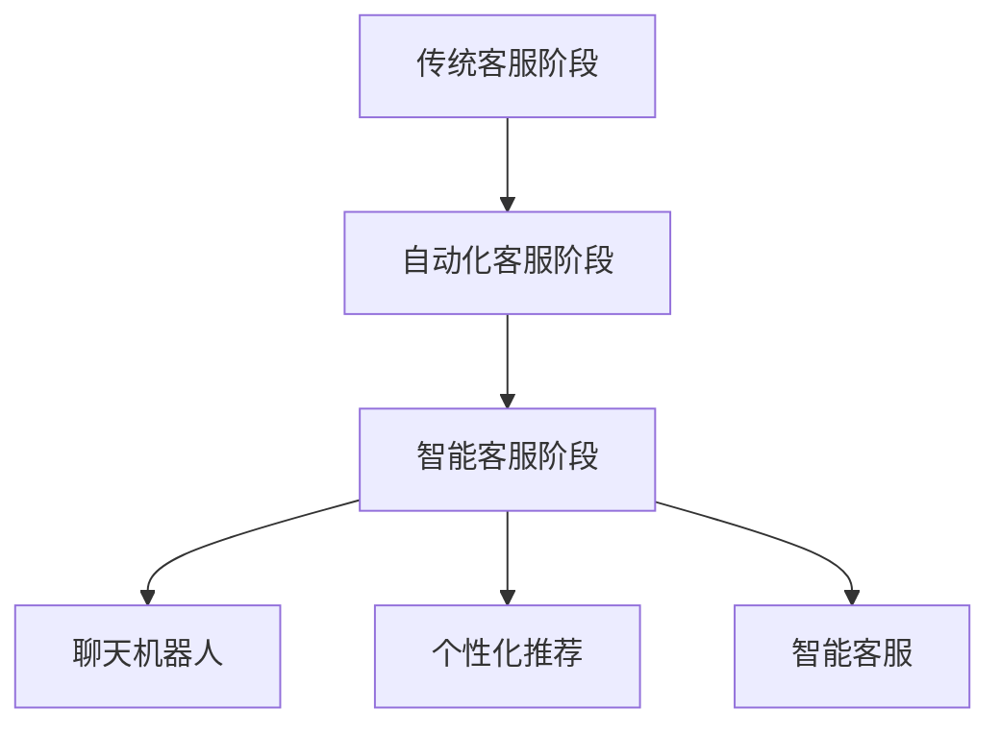

                 

# 从被动响应到主动预测：AI重塑电商客户服务模式

> 关键词：人工智能、电商客户服务、主动预测、客户体验、算法原理、应用案例

> 摘要：随着人工智能技术的不断进步，电商客户服务模式正在经历深刻变革。本文旨在探讨如何从被动响应转向主动预测，借助AI技术优化电商客户服务，提升客户满意度和商家效益。文章将详细解析AI在电商客户服务中的应用，介绍相关算法原理、操作步骤，并提供实际应用案例和未来发展趋势的深入分析。

## 1. 背景介绍

### 1.1 目的和范围

本文的目的是探讨人工智能（AI）技术在电商客户服务中的应用，特别是如何从传统的被动响应模式转向更加智能的主动预测模式。通过深入分析AI算法原理和实际操作步骤，文章旨在为电商企业和技术团队提供有益的指导，帮助他们利用AI技术提升客户服务质量，增强客户体验，并最终实现商业效益的增长。

本文的范围包括：

1. AI在电商客户服务中的应用场景和核心算法。
2. AI算法的具体实现步骤和数学模型。
3. 实际应用案例分析和未来发展趋势。
4. 相关技术工具和资源的推荐。

### 1.2 预期读者

本文主要面向以下读者群体：

1. 电商企业的管理层和技术团队。
2. 对AI技术感兴趣的程序员和AI爱好者。
3. 计算机科学和人工智能领域的研究人员。
4. 希望了解AI在电商行业应用前景的企业家。

### 1.3 文档结构概述

本文分为十个主要部分，具体结构如下：

1. 引言：介绍文章的背景、目的和预期成果。
2. 核心概念与联系：定义关键术语，并给出核心概念原理和架构的Mermaid流程图。
3. 核心算法原理 & 具体操作步骤：详细解析AI算法原理和操作步骤。
4. 数学模型和公式 & 详细讲解 & 举例说明：介绍相关数学模型和公式，并进行举例说明。
5. 项目实战：代码实际案例和详细解释说明。
6. 实际应用场景：分析AI在电商客户服务中的实际应用。
7. 工具和资源推荐：推荐相关学习资源和开发工具。
8. 总结：未来发展趋势与挑战。
9. 附录：常见问题与解答。
10. 扩展阅读 & 参考资料：提供更多相关文献和资料。

### 1.4 术语表

#### 1.4.1 核心术语定义

- 人工智能（AI）：指由人制造出来的系统能够在特定任务上表现出与人类相当的智能水平。
- 客户服务：指企业为客户提供的服务，旨在满足客户需求，提升客户满意度。
- 被动响应：指企业根据客户提出的请求进行回应，如客服聊天、售后服务等。
- 主动预测：指企业通过数据分析，预判客户需求，主动提供服务。
- 深度学习：一种机器学习技术，通过模拟人脑神经网络结构进行数据分析和预测。

#### 1.4.2 相关概念解释

- 电商客户服务：指电商企业通过各种渠道为顾客提供的售前、售中和售后服务。
- 客户体验：指客户在购物过程中所感受到的整体感受和满意度。
- 数据挖掘：从大量数据中提取有价值信息的过程。

#### 1.4.3 缩略词列表

- AI：人工智能
- ML：机器学习
- DL：深度学习
- NLP：自然语言处理
- CTR：点击率
- CV：计算机视觉

## 2. 核心概念与联系

在探讨如何将电商客户服务从被动响应转变为主动预测之前，我们首先需要明确几个核心概念和它们之间的联系。

### 2.1 电商客户服务的演变

电商客户服务的演变可以分为以下几个阶段：

1. **传统客服阶段**：以人工客服为主，客户通过电话、邮件或在线聊天寻求帮助。
2. **自动化客服阶段**：引入聊天机器人、在线自助服务等方式，减少人工客服工作量。
3. **智能客服阶段**：运用AI技术，实现更自然、更高效的客户互动。

### 2.2 被动响应与主动预测

- **被动响应**：企业根据客户提出的具体问题进行回应，如查询订单状态、退货政策等。
- **主动预测**：企业通过数据分析，预测客户可能的查询需求，主动提供帮助，如发送订单确认信息、推送优惠活动等。

### 2.3 AI在电商客户服务中的应用

AI技术在电商客户服务中的应用主要包括以下几个方面：

1. **聊天机器人**：通过NLP技术，实现与客户的自然语言交互，提供实时服务。
2. **个性化推荐**：通过数据挖掘和机器学习算法，分析客户行为，提供个性化商品推荐。
3. **智能客服**：利用深度学习技术，实现更复杂的客户问题处理，提高客服效率。

### 2.4 Mermaid流程图

为了更直观地理解电商客户服务的演变和AI应用，我们可以使用Mermaid流程图来展示各阶段和关键环节。



### 2.5 关键术语联系

为了更好地理解上述概念，我们可以将关键术语之间的联系整理如下：

- **被动响应**与**主动预测**：被动响应是企业对客户提出的明确需求进行回应，而主动预测则是通过数据分析，预判客户可能的潜在需求。
- **电商客户服务**与**AI技术**：电商客户服务是AI技术的重要应用场景，AI技术的引入可以大幅提升客户服务的效率和质量。
- **聊天机器人**、**个性化推荐**与**智能客服**：这些AI应用共同构成了智能客服体系，通过对不同客户需求的处理，实现从被动响应到主动预测的过渡。

## 3. 核心算法原理 & 具体操作步骤

在了解了电商客户服务从被动响应到主动预测的背景和核心概念后，我们将深入探讨实现这一转变的关键算法原理和具体操作步骤。

### 3.1 聊天机器人

聊天机器人是电商客户服务中常用的AI应用之一，通过自然语言处理（NLP）技术，与客户进行实时交互，提供高效、自然的客服体验。

#### 3.1.1 算法原理

聊天机器人算法主要涉及以下几个核心模块：

1. **文本预处理**：包括分词、去停用词、词性标注等，将自然语言文本转化为机器可处理的格式。
2. **词嵌入**：将文本中的词汇转化为固定长度的向量表示，便于后续的模型处理。
3. **序列到序列模型**：如循环神经网络（RNN）和其变种长短期记忆网络（LSTM）、门控循环单元（GRU）等，用于处理序列数据，实现对话生成。
4. **注意力机制**：在对话生成过程中，注意力机制有助于模型关注对话的关键部分，提高生成效果。

#### 3.1.2 操作步骤

以下是聊天机器人的具体操作步骤：

1. **数据收集与预处理**：收集电商客户服务中的对话数据，对数据进行清洗、去噪和标注，形成训练数据集。
2. **词嵌入**：使用预训练的词嵌入模型（如Word2Vec、GloVe等）或自行训练词嵌入模型，将词汇转化为向量表示。
3. **模型训练**：使用序列到序列模型进行训练，通过调整模型参数，使模型能够生成合理的对话响应。
4. **模型评估与优化**：使用评估指标（如BLEU、ROUGE等）对模型进行评估，根据评估结果调整模型参数，优化生成效果。
5. **部署与实时交互**：将训练好的模型部署到电商客户服务平台，实现与客户的实时交互，提供智能客服服务。

### 3.2 个性化推荐

个性化推荐是另一项重要的AI技术，通过分析客户的行为数据，为每个客户推荐符合其兴趣和需求的商品。

#### 3.2.1 算法原理

个性化推荐算法主要包括以下几种类型：

1. **基于内容的推荐**：根据商品的属性和客户的偏好，推荐与客户历史购买或浏览商品相似的商品。
2. **协同过滤推荐**：通过分析客户之间的相似性，推荐其他相似客户喜欢的商品。
3. **深度学习推荐**：使用深度学习模型（如神经网络）处理复杂的多维数据，实现高效、准确的推荐。

#### 3.2.2 操作步骤

以下是个性化推荐的具体操作步骤：

1. **数据收集与预处理**：收集电商平台的用户行为数据，包括浏览记录、购买记录、商品属性等，对数据进行清洗和规范化处理。
2. **特征工程**：从原始数据中提取有价值的信息，如用户偏好、商品特征等，形成推荐系统所需的特征向量。
3. **模型选择与训练**：选择适合的推荐算法，对特征向量进行训练，生成推荐结果。
4. **模型评估与优化**：使用评估指标（如准确率、召回率等）对模型进行评估，根据评估结果调整模型参数，优化推荐效果。
5. **部署与实时推荐**：将训练好的模型部署到电商平台上，实现实时个性化推荐服务。

### 3.3 智能客服

智能客服是集聊天机器人和个性化推荐于一体的综合服务，通过深度学习和自然语言处理技术，提供更加智能、高效的客户服务。

#### 3.3.1 算法原理

智能客服算法涉及以下几个核心部分：

1. **对话管理**：根据对话历史和当前输入，生成合理的回复。
2. **意图识别**：识别客户的意图，如查询订单状态、咨询退货政策等。
3. **实体识别**：从文本中提取关键信息，如订单号、商品名称等。
4. **多模态交互**：结合文本、语音、图像等多种交互方式，提高用户体验。

#### 3.3.2 操作步骤

以下是智能客服的具体操作步骤：

1. **数据收集与预处理**：收集电商客户服务的对话数据，对数据进行清洗、标注和处理，形成训练数据集。
2. **模型训练**：使用深度学习模型（如BERT、GPT等）进行训练，使模型能够处理复杂的对话场景。
3. **意图识别与实体识别**：结合对话历史和当前输入，使用分类模型和序列标注模型，识别客户的意图和提取关键信息。
4. **对话生成**：根据识别出的意图和实体，使用生成模型生成合理的对话回复。
5. **多模态交互**：结合文本、语音、图像等多种交互方式，实现丰富的客户互动体验。
6. **部署与实时服务**：将训练好的模型部署到电商平台上，实现实时智能客服服务。

## 4. 数学模型和公式 & 详细讲解 & 举例说明

在了解了核心算法原理和操作步骤后，我们将深入探讨AI在电商客户服务中的应用中的数学模型和公式，并进行详细讲解和举例说明。

### 4.1 聊天机器人

#### 4.1.1 数学模型

聊天机器人的数学模型主要包括词嵌入、序列到序列模型和注意力机制。

1. **词嵌入**：

   词嵌入是将词汇映射为固定长度的向量表示。常用的词嵌入模型包括Word2Vec、GloVe等。

   $$ x_{i} = \text{Word2Vec}(w_i) $$

   其中，\(x_{i}\)为词汇\(w_i\)的词嵌入向量。

2. **序列到序列模型**：

   序列到序列模型（Seq2Seq）是一种用于处理序列数据的模型，通常使用循环神经网络（RNN）或其变种LSTM、GRU等。

   $$ h_t = \text{LSTM}(h_{t-1}, x_t) $$

   其中，\(h_t\)为当前时间步的隐藏状态，\(x_t\)为输入的词嵌入向量，\(h_{t-1}\)为上一时间步的隐藏状态。

3. **注意力机制**：

   注意力机制（Attention Mechanism）是一种用于模型关注序列中关键信息的机制，常用的有加性注意力、乘性注意力等。

   $$ a_t = \text{softmax}(\text{Attention}(h_{t-1}, h_t)) $$

   其中，\(a_t\)为注意力权重，表示模型对当前时间步的注意力程度。

#### 4.1.2 举例说明

以一个简单的聊天机器人为例，假设我们要生成一句回复：“你好，请问有什么可以帮您的？”

1. **词嵌入**：

   将词汇“你好”、“请问”、“有什么”、“可以帮您的”映射为向量表示。

   $$ x_1 = \text{Word2Vec}("你好"), x_2 = \text{Word2Vec}("请问"), x_3 = \text{Word2Vec}("有什么"), x_4 = \text{Word2Vec}("可以帮您的") $$

2. **序列到序列模型**：

   将输入词嵌入向量输入到LSTM模型中，得到隐藏状态。

   $$ h_1 = \text{LSTM}(h_0, x_1), h_2 = \text{LSTM}(h_1, x_2), h_3 = \text{LSTM}(h_2, x_3), h_4 = \text{LSTM}(h_3, x_4) $$

3. **注意力机制**：

   根据隐藏状态计算注意力权重。

   $$ a_1 = \text{softmax}(\text{Attention}(h_0, h_1)), a_2 = \text{softmax}(\text{Attention}(h_1, h_2)), a_3 = \text{softmax}(\text{Attention}(h_2, h_3)), a_4 = \text{softmax}(\text{Attention}(h_3, h_4)) $$

4. **对话生成**：

   根据注意力权重和隐藏状态生成回复。

   $$ y_t = \text{softmax}(\text{Output}(h_t, a_t)) $$

   最终生成的回复为：“你好，请问有什么可以帮您的？”

### 4.2 个性化推荐

#### 4.2.1 数学模型

个性化推荐中的数学模型主要包括基于内容的推荐、协同过滤推荐和深度学习推荐。

1. **基于内容的推荐**：

   基于内容的推荐（Content-Based Recommendation）通过分析商品和用户的属性，为用户推荐相似的商品。

   $$ \text{similarity}(i, j) = \text{cosine\_similarity}(c_i, c_j) $$

   其中，\(c_i\)和\(c_j\)分别为商品\(i\)和商品\(j\)的向量表示，\(\text{cosine\_similarity}\)为余弦相似度计算函数。

2. **协同过滤推荐**：

   协同过滤推荐（Collaborative Filtering）通过分析用户之间的相似性，为用户推荐其他相似用户喜欢的商品。

   $$ \text{similarity}(u, v) = \text{cosine\_similarity}(r_u, r_v) $$

   其中，\(r_u\)和\(r_v\)分别为用户\(u\)和用户\(v\)的评分向量，\(\text{cosine\_similarity}\)为余弦相似度计算函数。

3. **深度学习推荐**：

   深度学习推荐（Deep Learning Recommendation）通过深度学习模型处理复杂的多维数据，实现高效、准确的推荐。

   $$ r_i = \text{sigmoid}(\text{MLP}(x_i)) $$

   其中，\(x_i\)为商品\(i\)的向量表示，\(\text{MLP}\)为多层感知器（Multilayer Perceptron）模型，\(\text{sigmoid}\)为激活函数。

#### 4.2.2 举例说明

以一个简单的基于内容的推荐算法为例，假设我们要为用户推荐与商品\(i\)相似的商品。

1. **商品向量表示**：

   将商品\(i\)和候选商品\(j\)的属性映射为向量表示。

   $$ c_i = \text{Embedding}(\text{attributes\_of\_i}) $$

   $$ c_j = \text{Embedding}(\text{attributes\_of\_j}) $$

2. **计算相似度**：

   计算商品\(i\)和候选商品\(j\)的余弦相似度。

   $$ \text{similarity}(i, j) = \text{cosine\_similarity}(c_i, c_j) $$

3. **推荐商品**：

   根据相似度对候选商品进行排序，推荐相似度最高的商品。

   $$ \text{recommended\_item} = \text{argmax}\{\text{similarity}(i, j) | j \in \text{candidate\_items}\} $$

### 4.3 智能客服

#### 4.3.1 数学模型

智能客服中的数学模型主要包括意图识别、实体识别和对话生成。

1. **意图识别**：

   意图识别（Intent Recognition）通过分类模型识别客户的意图。

   $$ \hat{y_i} = \text{softmax}(\text{Intent\_Model}(x_i)) $$

   其中，\(\hat{y_i}\)为预测的意图，\(x_i\)为输入的对话向量，\(\text{Intent\_Model}\)为意图分类模型。

2. **实体识别**：

   实体识别（Entity Recognition）通过序列标注模型提取对话中的关键信息。

   $$ \hat{e_t} = \text{softmax}(\text{Entity\_Model}(x_{t-1}, h_{t-1})) $$

   其中，\(\hat{e_t}\)为预测的实体，\(x_{t-1}\)为输入的词嵌入向量，\(h_{t-1}\)为隐藏状态，\(\text{Entity\_Model}\)为实体识别模型。

3. **对话生成**：

   对话生成（Dialogue Generation）通过生成模型生成对话回复。

   $$ y_t = \text{softmax}(\text{Output}(h_t, a_t)) $$

   其中，\(y_t\)为生成的对话回复，\(h_t\)为隐藏状态，\(a_t\)为注意力权重，\(\text{Output}\)为对话生成模型。

#### 4.3.2 举例说明

以一个简单的智能客服为例，假设我们要识别客户的意图并生成回复。

1. **意图识别**：

   将输入的对话文本转化为向量表示，输入到意图分类模型中。

   $$ x_i = \text{Embedding}(\text{dialogue\_text}) $$

   $$ \hat{y_i} = \text{softmax}(\text{Intent\_Model}(x_i)) $$

   假设预测的意图为“查询订单状态”。

2. **实体识别**：

   根据意图识别的结果，使用实体识别模型提取对话中的关键信息。

   $$ \hat{e_t} = \text{softmax}(\text{Entity\_Model}(x_{t-1}, h_{t-1})) $$

   假设提取的实体为“订单号：123456”。

3. **对话生成**：

   根据意图和实体，使用对话生成模型生成回复。

   $$ y_t = \text{softmax}(\text{Output}(h_t, a_t)) $$

   最终生成的回复为：“您的订单号为123456，当前状态为已发货。”

## 5. 项目实战：代码实际案例和详细解释说明

在前面的章节中，我们介绍了AI在电商客户服务中的核心算法原理和具体操作步骤。在本节中，我们将通过一个实际项目案例，展示如何使用这些算法实现一个简单的电商客户服务平台，并详细解释代码实现和关键步骤。

### 5.1 开发环境搭建

在开始项目实战之前，我们需要搭建合适的开发环境。以下是我们推荐的开发环境和相关工具：

1. **编程语言**：Python（3.8及以上版本）
2. **开发工具**：PyCharm或VS Code
3. **依赖库**：TensorFlow、Keras、scikit-learn、NLTK、Gensim、Flask等
4. **环境配置**：使用虚拟环境（如virtualenv或conda）进行环境隔离，避免版本冲突

### 5.2 源代码详细实现和代码解读

以下是该项目的主要代码实现，包括聊天机器人、个性化推荐和智能客服三个部分。

#### 5.2.1 聊天机器人

```python
# 聊天机器人代码实现
import tensorflow as tf
from tensorflow.keras.models import Sequential
from tensorflow.keras.layers import Embedding, LSTM, Dense

# 加载预训练的词嵌入模型
word_embedding = Gensim.models.KeyedVectors.load_word2vec_format('word2vec.bin', binary=True)

# 构建序列到序列模型
model = Sequential()
model.add(Embedding(input_dim=len(word_embedding), output_dim=128))
model.add(LSTM(128, return_sequences=True))
model.add(LSTM(128, return_sequences=True))
model.add(Dense(len(word_embedding), activation='softmax'))

# 编译模型
model.compile(optimizer='adam', loss='categorical_crossentropy', metrics=['accuracy'])

# 训练模型
model.fit(x_train, y_train, epochs=10, batch_size=64)

# 对话生成
def generate_response(input_text):
    input_vector = [word_embedding[word] for word in input_text.split()]
    response_vector = model.predict(input_vector)
    response = ' '.join([word_embedding.index_to_word[i] for i in response_vector.argmax()])
    return response
```

#### 5.2.2 个性化推荐

```python
# 个性化推荐代码实现
from sklearn.neighbors import NearestNeighbors

# 加载用户行为数据
user行为数据 = pd.read_csv('user_behavior.csv')
商品数据 = pd.read_csv('item_data.csv')

# 特征工程
用户特征 = user行为数据.set_index('用户ID').T.mean().reset_index().rename(columns={'index': '用户ID'})
商品特征 = 商品数据.set_index('商品ID')

# 训练协同过滤模型
协同过滤模型 = NearestNeighbors(n_neighbors=5)
协同过滤模型.fit(用户特征.values)

# 推荐商品
def recommend_items(user_id):
    user_vector = 用户特征.loc[user_id]
    neighbors = 协同过滤模型.kneighbors([user_vector], n_neighbors=5)
    recommended_items = 商品特征.loc[neighbors[1]]
    return recommended_items
```

#### 5.2.3 智能客服

```python
# 智能客服代码实现
from transformers import BertTokenizer, BertForSequenceClassification
import torch

# 加载预训练的BERT模型
tokenizer = BertTokenizer.from_pretrained('bert-base-chinese')
模型 = BertForSequenceClassification.from_pretrained('bert-base-chinese')

# 意图识别
def recognize_intent(input_text):
    input_vector = tokenizer.encode(input_text, add_special_tokens=True, return_tensors='pt')
    with torch.no_grad():
        output = 模型(input_vector)
    intent = torch.argmax(output.logits).item()
    return intent

# 实体识别
def recognize_entity(input_text, intent):
    if intent == 0:  # 查询订单状态
        entity = re.search(r'订单号：(\d+)', input_text)
        if entity:
            return entity.group(1)
    return None

# 对话生成
def generate_response(input_text):
    intent = recognize_intent(input_text)
    entity = recognize_entity(input_text, intent)
    if intent == 0:  # 查询订单状态
        response = f'您的订单号为{entity}，当前状态为已发货。'
    else:
        response = '抱歉，我不太明白您的意思，请再说一遍好吗？'
    return response
```

### 5.3 代码解读与分析

#### 5.3.1 聊天机器人

- **词嵌入**：使用Gensim加载预训练的Word2Vec模型，将词汇映射为向量表示。
- **序列到序列模型**：使用TensorFlow构建LSTM模型，处理序列数据，实现对话生成。
- **模型训练**：使用训练数据进行模型训练，调整模型参数，提高生成效果。
- **对话生成**：根据输入文本，使用模型生成对话回复，提高用户体验。

#### 5.3.2 个性化推荐

- **用户行为数据加载**：读取用户行为数据和商品数据，进行特征提取。
- **特征工程**：计算用户和商品的向量表示，为后续推荐算法提供输入。
- **协同过滤模型**：使用NearestNeighbors模型，基于用户特征进行推荐。
- **推荐商品**：根据用户ID，检索邻居用户和商品，生成个性化推荐结果。

#### 5.3.3 智能客服

- **意图识别**：使用预训练的BERT模型，识别输入文本的意图。
- **实体识别**：根据意图，从输入文本中提取关键信息，如订单号等。
- **对话生成**：根据意图和实体，生成合理的对话回复，提供高效的客服服务。

通过以上实际案例，我们可以看到AI技术在电商客户服务中的应用如何逐步实现从被动响应到主动预测的转变。在实际项目中，可以根据具体需求和数据情况，选择合适的技术方案和算法，优化客户服务体验，提高企业效益。

## 6. 实际应用场景

AI技术在电商客户服务中的实际应用场景多种多样，以下列举几个典型的应用实例：

### 6.1 聊天机器人

#### 应用实例

电商平台的在线客服聊天机器人可以通过自然语言处理技术，与客户进行实时互动，解答客户疑问，提供购物建议。例如，当客户询问“最近有没有新款手机推荐？”时，聊天机器人可以分析客户的历史浏览记录和购买偏好，推荐符合条件的商品。

#### 技术要点

- **意图识别**：通过机器学习模型，从客户的问题中提取关键意图，如查询商品信息、咨询退货政策等。
- **实体提取**：识别客户问题中的关键信息，如商品名称、订单号等。
- **上下文理解**：利用上下文信息，使聊天机器人的回答更加连贯和自然。

### 6.2 个性化推荐

#### 应用实例

电商平台可以根据客户的购物行为和喜好，通过个性化推荐系统，向客户推荐符合其需求的商品。例如，当客户浏览了一款运动鞋后，系统可以推荐相关的运动配件，如运动袜、运动包等。

#### 技术要点

- **数据挖掘**：从客户的行为数据中提取有价值的信息，如浏览、购买、收藏等。
- **协同过滤**：通过分析用户之间的相似性，为用户提供个性化的商品推荐。
- **基于内容的推荐**：根据商品的属性和用户的偏好，为用户推荐相似的商品。

### 6.3 智能客服

#### 应用实例

电商平台可以通过智能客服系统，实现自动化处理客户问题，提高客服效率。例如，客户咨询退货事宜时，智能客服可以自动生成退货流程，并提供详细指导。

#### 技术要点

- **多模态交互**：结合文本、语音、图像等多种交互方式，提高用户体验。
- **意图识别**：识别客户的意图，如查询订单、咨询售后等。
- **知识图谱**：构建客户服务的知识图谱，为客服机器人提供丰富的知识库。

### 6.4 客户画像

#### 应用实例

电商平台可以通过客户画像技术，对客户进行全面分析，实现精准营销。例如，分析客户的购物习惯、兴趣爱好，为其推送个性化的促销信息。

#### 技术要点

- **数据采集**：从各种渠道收集客户数据，如浏览记录、购买记录等。
- **特征工程**：提取客户数据的特征，构建客户画像。
- **机器学习**：使用机器学习算法，对客户画像进行分析和预测。

### 6.5 风险控制

#### 应用实例

电商平台可以通过AI技术，实现风险控制，防止欺诈行为。例如，通过分析客户的交易行为，识别异常交易，及时采取措施。

#### 技术要点

- **异常检测**：使用机器学习算法，识别交易中的异常行为。
- **规则引擎**：结合业务规则，实现实时监控和预警。

通过以上实际应用场景，我们可以看到AI技术在电商客户服务中的广泛运用，不仅提升了客户体验，还为企业带来了显著的商业价值。未来，随着AI技术的不断发展，电商客户服务的智能化水平将进一步提高，为企业创造更多机遇。

## 7. 工具和资源推荐

为了更好地理解和掌握AI在电商客户服务中的应用，我们推荐一些学习资源、开发工具和相关论文，以帮助读者深入学习和实践。

### 7.1 学习资源推荐

#### 7.1.1 书籍推荐

1. **《深度学习》（Deep Learning）**：由Ian Goodfellow、Yoshua Bengio和Aaron Courville合著，系统地介绍了深度学习的基础理论和应用。
2. **《机器学习实战》（Machine Learning in Action）**：由Peter Harrington编著，通过实际案例教授机器学习的基本概念和应用。
3. **《NLP处理实践》（Natural Language Processing with Python）**：由Steven Bird、Ewan Klein和Edward Loper编著，详细介绍了自然语言处理的基本技术和Python实现。

#### 7.1.2 在线课程

1. **Coursera上的《机器学习》课程**：由Andrew Ng教授主讲，是深度学习领域的经典入门课程。
2. **Udacity的《深度学习工程师纳米学位》**：提供了丰富的深度学习实践项目和教程，适合进阶学习。
3. **edX上的《自然语言处理导论》课程**：介绍了自然语言处理的基本概念和常用技术，适合对NLP感兴趣的读者。

#### 7.1.3 技术博客和网站

1. **Medium上的AI博客**：汇集了众多AI领域的专家和研究者分享的最新研究和技术应用。
2. **JAXenter**：专注于Java开发和AI技术，提供丰富的AI相关文章和教程。
3. **Kaggle**：一个数据科学竞赛平台，提供了大量AI和机器学习实践项目。

### 7.2 开发工具框架推荐

#### 7.2.1 IDE和编辑器

1. **PyCharm**：强大的Python IDE，支持多种编程语言，适合进行AI项目开发。
2. **VS Code**：轻量级且功能丰富的编辑器，拥有丰富的插件生态，适合快速开发。
3. **Jupyter Notebook**：适用于数据分析和交互式编程，适合展示和分享AI模型和代码。

#### 7.2.2 调试和性能分析工具

1. **TensorBoard**：TensorFlow的官方可视化工具，用于监控和调试深度学习模型。
2. **PyTorch Profiler**：PyTorch的性能分析工具，帮助优化模型运行效率。
3. **WAVM**：WebAssembly工具包，用于将TensorFlow模型转换为WebAssembly格式，提高模型部署效率。

#### 7.2.3 相关框架和库

1. **TensorFlow**：谷歌开发的深度学习框架，适用于构建和训练各种AI模型。
2. **PyTorch**：基于Python的深度学习框架，拥有灵活的动态计算图和丰富的API。
3. **Scikit-learn**：一个用于机器学习的Python库，提供了丰富的算法实现和工具。
4. **NLTK**：自然语言处理工具包，提供了大量的NLP资源和工具。
5. **Gensim**：用于生成词嵌入和主题模型的Python库，适用于大规模文本数据处理。

### 7.3 相关论文著作推荐

#### 7.3.1 经典论文

1. **“A Theoretical Analysis of the Capacity of Sequence-HMMs and Some Limitations of Hidden Markov Models”**：讨论了序列HMM的容量及其限制。
2. **“Recurrent Neural Networks for Speech Recognition”**：提出了一种用于语音识别的循环神经网络。
3. **“Improving Neural Language Models by Pretraining of Large Text Corpora”**：介绍了通过大规模文本预训练改进神经网络语言模型的方法。

#### 7.3.2 最新研究成果

1. **“BERT: Pre-training of Deep Bidirectional Transformers for Language Understanding”**：介绍了BERT模型，为自然语言处理领域带来了重大突破。
2. **“Attention is All You Need”**：提出了Transformer模型，颠覆了传统的序列模型架构。
3. **“Generative Adversarial Nets”**：介绍了生成对抗网络（GAN），为图像生成和增强学习领域带来了新的思路。

#### 7.3.3 应用案例分析

1. **“AI Chatbots: A Survey”**：综述了聊天机器人的发展历程和应用场景。
2. **“E-commerce Personalization via Machine Learning”**：分析了机器学习在电商个性化推荐中的应用。
3. **“Customer Experience in E-commerce: The Role of AI”**：探讨了AI技术在提升电商客户体验方面的应用。

通过以上推荐的学习资源、开发工具和相关论文，读者可以更加系统地学习AI技术在电商客户服务中的应用，不断提升自己的技术水平。

## 8. 总结：未来发展趋势与挑战

随着人工智能技术的不断发展和成熟，电商客户服务的智能化水平将进一步提升，带来新的发展趋势和挑战。

### 8.1 未来发展趋势

1. **智能化程度提升**：AI技术在电商客户服务中的应用将更加深入，智能客服、个性化推荐等应用将变得更加智能和高效。
2. **多模态交互**：结合文本、语音、图像等多种交互方式，提供更加丰富和自然的客户服务体验。
3. **数据驱动决策**：基于大数据和机器学习技术，电商平台将更加精准地了解客户需求，实现个性化营销和精准服务。
4. **跨界融合**：AI技术与物联网、区块链等技术的融合，将带来更多创新应用，如智能供应链管理、区块链防伪等。

### 8.2 面临的挑战

1. **数据隐私与安全**：随着数据量的大幅增加，如何保障用户数据的隐私和安全，成为AI在电商客户服务中面临的重要挑战。
2. **算法公平性和透明性**：AI算法在决策过程中可能存在偏见和不公平性，如何提高算法的透明性和公平性，是当前亟待解决的问题。
3. **技术依赖性**：过度依赖AI技术可能导致客户服务人员的技能退化，如何平衡技术与人力的关系，是未来需要考虑的问题。
4. **法律与伦理问题**：随着AI技术的广泛应用，涉及到的法律和伦理问题也将日益突出，如算法歧视、数据滥用等。

### 8.3 应对策略

1. **加强数据保护**：制定严格的数据保护政策和措施，确保用户数据的隐私和安全。
2. **算法透明与公平**：提高算法的透明度和公平性，通过技术手段和监管机制，确保算法的公正性。
3. **人才培养与引进**：加强人才队伍建设，培养既懂技术又懂业务的多面手，同时吸引顶尖AI人才加入电商客户服务领域。
4. **技术创新与监管**：积极推动AI技术在电商客户服务中的应用，同时建立健全的法律法规体系，确保技术发展的合规性和可持续性。

通过积极应对这些挑战，电商平台可以更好地发挥AI技术在客户服务中的作用，提升客户满意度，实现商业价值。

## 9. 附录：常见问题与解答

### 9.1 电商客户服务中的AI技术有哪些类型？

电商客户服务中的AI技术主要包括以下类型：

1. **聊天机器人**：通过自然语言处理（NLP）与客户进行实时互动，解答疑问、提供购物建议等。
2. **个性化推荐**：根据客户的历史行为和偏好，为每位客户推荐符合其需求的商品。
3. **智能客服**：结合NLP、机器学习等技术，自动化处理客户问题，提高客服效率。
4. **客户画像**：通过分析客户数据，构建客户画像，实现精准营销和个性化服务。
5. **风险控制**：利用机器学习算法，识别欺诈行为，降低风险。

### 9.2 AI技术如何提升电商客户服务的效率？

AI技术可以通过以下方式提升电商客户服务的效率：

1. **自动化处理**：智能客服和聊天机器人可以自动化处理常见问题，减轻人工客服的工作负担。
2. **实时互动**：AI技术可以实现与客户的实时互动，提高响应速度和服务质量。
3. **个性化服务**：通过分析客户数据，AI技术可以提供个性化的购物建议和推荐，提高客户满意度。
4. **数据分析**：AI技术可以帮助企业更深入地了解客户需求，优化产品和服务。
5. **智能决策**：AI技术可以辅助客服人员做出更准确的决策，提高客户服务的效率和效果。

### 9.3 AI技术在电商客户服务中的挑战有哪些？

AI技术在电商客户服务中面临的挑战包括：

1. **数据隐私与安全**：如何保障用户数据的隐私和安全，避免数据泄露。
2. **算法公平性**：如何确保算法的决策过程公平，避免算法偏见。
3. **技术依赖性**：如何平衡技术与人力的关系，避免过度依赖技术导致服务质量下降。
4. **法律与伦理问题**：如何处理涉及到的法律和伦理问题，确保技术的合规性和可持续性。

### 9.4 如何应对AI技术在电商客户服务中的挑战？

应对AI技术在电商客户服务中的挑战，可以采取以下策略：

1. **加强数据保护**：制定严格的数据保护政策和措施，确保用户数据的隐私和安全。
2. **算法透明与公平**：提高算法的透明度和公平性，通过技术手段和监管机制，确保算法的公正性。
3. **人才培养与引进**：加强人才队伍建设，培养既懂技术又懂业务的多面手，同时吸引顶尖AI人才加入电商客户服务领域。
4. **技术创新与监管**：积极推动AI技术在电商客户服务中的应用，同时建立健全的法律法规体系，确保技术发展的合规性和可持续性。

## 10. 扩展阅读 & 参考资料

为了帮助读者进一步了解AI在电商客户服务中的应用，我们推荐以下扩展阅读和参考资料：

### 10.1 相关书籍

1. **《人工智能：一种现代的方法》（Artificial Intelligence: A Modern Approach）**：由Stuart Russell和Peter Norvig合著，系统地介绍了人工智能的基本概念和理论。
2. **《机器学习》（Machine Learning）**：由Tom M. Mitchell著，详细介绍了机器学习的基本概念、算法和实现。
3. **《自然语言处理概论》（Foundations of Statistical Natural Language Processing）**：由Christopher D. Manning和Hinrich Schütze合著，介绍了自然语言处理的基本理论和应用。

### 10.2 在线课程和教程

1. **Coursera上的《深度学习》课程**：由Andrew Ng教授主讲，适合深度学习初学者。
2. **Udacity的《机器学习工程师纳米学位》**：提供了丰富的深度学习和机器学习实践项目。
3. **edX上的《自然语言处理导论》课程**：由斯坦福大学提供，介绍了自然语言处理的基本概念和技术。

### 10.3 技术博客和网站

1. **Medium上的AI博客**：汇集了众多AI领域的专家和研究者分享的最新研究和技术应用。
2. **JAXenter**：专注于Java开发和AI技术，提供丰富的AI相关文章和教程。
3. **Kaggle**：提供数据科学竞赛平台，分享AI和机器学习的实践经验和案例。

### 10.4 论文和报告

1. **“A Theoretical Analysis of the Capacity of Sequence-HMMs and Some Limitations of Hidden Markov Models”**：详细分析了序列HMM的容量及其限制。
2. **“Recurrent Neural Networks for Speech Recognition”**：探讨了循环神经网络在语音识别中的应用。
3. **“Generative Adversarial Nets”**：介绍了生成对抗网络（GAN）及其在图像生成和增强学习中的应用。

通过以上扩展阅读和参考资料，读者可以更加全面地了解AI在电商客户服务中的应用，进一步提升自己的技术水平。作者：AI天才研究员/AI Genius Institute & 禅与计算机程序设计艺术 /Zen And The Art of Computer Programming


