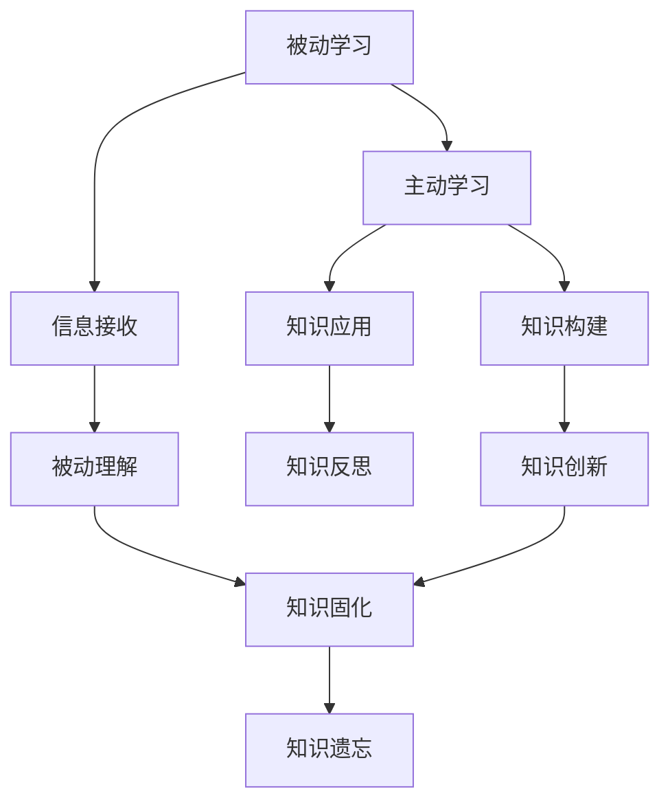

                 


# 从被动接收到主动探索：知识获取的范式转移

> 关键词：知识获取、主动学习、被动学习、范式转移、技术博客、深度学习、人工智能

> 摘要：本文将深入探讨知识获取的范式转移，从传统的被动接收式学习模式转向更加主动和互动的学习方式。本文首先介绍了知识获取的两个主要范式：被动学习和主动学习，并分析了这两种模式的优势与局限性。接着，我们通过具体实例和算法原理，详细讲解了如何实现从被动到主动的知识获取。最后，本文探讨了知识获取范式转移在实际应用场景中的影响，并推荐了相关的学习资源和工具。

## 1. 背景介绍

### 1.1 目的和范围

本文旨在探讨知识获取的范式转移，即从传统的被动接收式学习模式向更加主动和互动的学习方式的转变。这一转变不仅影响了教育的各个层面，也对个人学习、专业技能提升、以及人工智能技术的发展产生了深远影响。本文将涵盖以下内容：

1. 被动学习和主动学习的定义与对比
2. 被动学习和主动学习的主要优势和局限性
3. 实现从被动到主动知识获取的具体方法和步骤
4. 主动学习在实际应用场景中的影响
5. 相关的学习资源和工具推荐

### 1.2 预期读者

本文适用于以下读者：

1. 对知识获取方法感兴趣的学习者
2. 对人工智能、深度学习等领域有一定了解的技术人员
3. 对教育技术、学习方法有研究的教育工作者
4. 希望提升自我学习能力的企业员工

### 1.3 文档结构概述

本文结构如下：

1. **背景介绍**：介绍知识获取的范式转移的背景、目的和范围，以及预期读者。
2. **核心概念与联系**：详细解释被动学习和主动学习的核心概念，并使用Mermaid流程图展示两者的联系。
3. **核心算法原理 & 具体操作步骤**：讲解从被动到主动知识获取的具体算法原理和操作步骤。
4. **数学模型和公式 & 详细讲解 & 举例说明**：介绍相关的数学模型和公式，并进行详细讲解和举例。
5. **项目实战：代码实际案例和详细解释说明**：展示代码实际案例，并进行详细解释说明。
6. **实际应用场景**：探讨知识获取范式转移在实际应用场景中的影响。
7. **工具和资源推荐**：推荐相关的学习资源和工具。
8. **总结：未来发展趋势与挑战**：总结知识获取范式转移的趋势与挑战。
9. **附录：常见问题与解答**：提供常见问题与解答。
10. **扩展阅读 & 参考资料**：推荐扩展阅读和参考资料。

### 1.4 术语表

#### 1.4.1 核心术语定义

- 被动学习：指学习者通过外部资源（如书籍、视频、讲座等）获取知识的过程。
- 主动学习：指学习者通过实践、探索、互动等方式主动构建知识的过程。
- 知识获取范式：指知识获取的方法和模式，包括被动学习和主动学习。
- 范式转移：指从一种知识获取范式向另一种范式的转变。
- 深度学习：一种人工智能技术，通过神经网络模拟人脑的学习过程。

#### 1.4.2 相关概念解释

- 机器学习：一种让计算机通过数据学习并做出决策的技术。
- 人工智能：模拟人类智能行为的计算机系统。
- 神经网络：一种模拟人脑神经网络结构的算法模型。

#### 1.4.3 缩略词列表

- ML：机器学习
- AI：人工智能
- DL：深度学习

## 2. 核心概念与联系

在探讨知识获取的范式转移之前，我们需要理解两个核心概念：被动学习和主动学习。下面，我们将使用Mermaid流程图来展示这两种学习的联系。



### 2.1 被动学习

被动学习是指学习者通过外部资源获取知识的过程。这种方式通常包括阅读书籍、观看视频、听讲座等。被动学习的优势在于可以快速获取大量信息，缺点在于学习者往往只是被动地接受信息，缺乏主动思考和深入理解。

### 2.2 主动学习

主动学习是指学习者通过实践、探索、互动等方式主动构建知识的过程。这种方式包括实验、项目、讨论等。主动学习的优势在于可以加深对知识的理解和记忆，提高问题解决能力，缺点在于学习过程较为耗时。

### 2.3 联系与差异

从Mermaid流程图中可以看出，被动学习和主动学习之间存在密切联系。被动学习是主动学习的基础，而主动学习则是对被动学习的深化和应用。两者的主要区别在于学习方式的主动性和互动性。

## 3. 核心算法原理 & 具体操作步骤

要实现从被动到主动的知识获取，我们需要运用一些核心算法原理。以下是一个简化的伪代码，用于描述这一过程：

```plaintext
算法：主动知识获取

输入：学习资源（书籍、视频、讲座等）
输出：主动构建的知识体系

步骤：
1. 初始化知识库（knowledge_base）
2. 从学习资源中获取信息（info）
3. 对信息进行预处理（preprocess_info）
4. 将预处理后的信息存储到知识库中（store_in_knowledge_base）
5. 通过实践、探索、讨论等方式激活知识库中的信息（activate_knowledge）
6. 对激活后的信息进行反思和总结（reflect_and_summarize）
7. 将反思和总结的结果应用于实际问题中（apply_to_practice）
8. 根据应用效果调整知识库（adjust_knowledge_base）
9. 重复步骤2-8，直到知识体系完善
```

### 3.1 初始化知识库

在开始主动学习之前，我们需要建立一个知识库，用于存储和管理我们所学的知识。知识库可以是文本文件、数据库，或者是一个更为复杂的知识管理系统。

### 3.2 从学习资源中获取信息

被动学习阶段，我们从各种学习资源中获取信息。这些资源可以是书籍、视频、讲座，也可以是网络上的文章和教程。

### 3.3 对信息进行预处理

获取到的信息往往是零散的、非结构化的。我们需要对其进行预处理，将其转化为结构化的、易于管理的格式。预处理过程可以包括提取关键信息、分类、标签化等。

### 3.4 将预处理后的信息存储到知识库中

预处理后的信息被存储到知识库中。这一步骤确保了信息的安全性和可访问性，同时也方便了后续的知识激活和反思。

### 3.5 通过实践、探索、讨论等方式激活知识库中的信息

激活知识库中的信息是主动学习的核心。通过实践、探索、讨论等方式，我们可以将理论知识应用到实际问题中，加深对知识的理解和记忆。

### 3.6 对激活后的信息进行反思和总结

反思和总结是主动学习的重要环节。通过对实践过程进行反思，我们可以发现知识库中的不足和错误，并进行修正。同时，总结实践经验，可以帮助我们形成更为系统和深刻的认识。

### 3.7 将反思和总结的结果应用于实际问题中

将反思和总结的结果应用到实际问题中，是检验知识掌握程度的重要手段。通过解决实际问题，我们可以验证知识的有效性和实用性。

### 3.8 根据应用效果调整知识库

根据实际应用效果，我们需要对知识库进行调整。这一步骤确保了知识库的动态性和实时性，使其能够不断适应新的需求和挑战。

## 4. 数学模型和公式 & 详细讲解 & 举例说明

在主动知识获取的过程中，一些数学模型和公式可以帮助我们更好地理解和应用所学知识。以下是一个简化的数学模型，用于描述知识构建和反思的过程：

### 4.1 知识构建模型

$$
Knowledge = f(Information, Experience, Reflection)
$$

其中，$Information$ 代表获取的信息，$Experience$ 代表实践经验，$Reflection$ 代表反思和总结。

### 4.2 知识反思模型

$$
Reflection = f(Knowledge, Feedback)
$$

其中，$Knowledge$ 代表知识体系，$Feedback$ 代表实践反馈。

### 4.3 详细讲解

#### 4.3.1 知识构建模型

知识构建模型表明，知识不仅仅来源于信息，还需要实践和反思。信息是我们获取知识的初始材料，实践和反思则是将信息转化为知识的途径。通过实践，我们可以验证和深化对知识的理解；通过反思，我们可以发现知识中的不足和错误，并进行修正。

#### 4.3.2 知识反思模型

知识反思模型表明，反思是知识体系不断优化和完善的必要手段。通过反思，我们可以根据实践反馈调整知识体系，使其更加贴近实际情况，提高知识的实用性。

### 4.4 举例说明

假设我们学习了一个关于深度学习的算法，通过阅读相关书籍和论文，我们获取了大量的信息。在实践过程中，我们尝试将这个算法应用到实际问题中，并通过实验和测试不断优化算法。在反思过程中，我们分析了实验结果，发现了一些问题和不足，并提出了改进措施。

根据知识构建模型和知识反思模型，我们可以得到以下结果：

- $Knowledge_0 = f(Information_0, Experience_0, Reflection_0)$
- $Reflection_1 = f(Knowledge_0, Feedback_1)$
- $Knowledge_1 = f(Information_0, Experience_1, Reflection_1)$
- $...$

通过不断循环这个过程，我们可以逐步完善和优化我们的知识体系，提高对深度学习算法的理解和应用能力。

## 5. 项目实战：代码实际案例和详细解释说明

为了更好地展示从被动到主动的知识获取过程，我们将在本节中介绍一个实际的项目案例。这个案例将涉及使用Python编写一个简单的深度学习模型，用于手写数字识别。

### 5.1 开发环境搭建

在开始项目之前，我们需要搭建一个适合开发的Python环境。以下是搭建开发环境的基本步骤：

1. 安装Python 3.8及以上版本。
2. 安装Anaconda，以便更好地管理Python环境和包。
3. 创建一个新的conda环境，并安装深度学习相关库，如TensorFlow和Keras。

```bash
conda create -n ml_env python=3.8
conda activate ml_env
conda install tensorflow keras
```

### 5.2 源代码详细实现和代码解读

以下是项目的源代码，我们将对其进行详细解读。

```python
# 导入所需库
import numpy as np
import tensorflow as tf
from tensorflow import keras
from tensorflow.keras import layers

# 加载MNIST数据集
(x_train, y_train), (x_test, y_test) = keras.datasets.mnist.load_data()

# 数据预处理
x_train = x_train.astype("float32") / 255
x_test = x_test.astype("float32") / 255
x_train = np.expand_dims(x_train, -1)
x_test = np.expand_dims(x_test, -1)

# 构建模型
model = keras.Sequential([
    layers.Conv2D(32, (3, 3), activation="relu", input_shape=(28, 28, 1)),
    layers.MaxPooling2D((2, 2)),
    layers.Conv2D(64, (3, 3), activation="relu"),
    layers.MaxPooling2D((2, 2)),
    layers.Conv2D(64, (3, 3), activation="relu"),
    layers.Flatten(),
    layers.Dense(64, activation="relu"),
    layers.Dense(10, activation="softmax")
])

# 编译模型
model.compile(optimizer="adam",
              loss="sparse_categorical_crossentropy",
              metrics=["accuracy"])

# 训练模型
model.fit(x_train, y_train, epochs=5)

# 评估模型
test_loss, test_acc = model.evaluate(x_test, y_test)
print(f"Test accuracy: {test_acc:.4f}")
```

#### 5.2.1 代码解读

1. **导入库**：我们首先导入所需的库，包括NumPy、TensorFlow和Keras。
2. **加载数据集**：使用Keras的MNIST数据集，这是一个常用的手写数字数据集。
3. **数据预处理**：将图像数据转换为浮点数，并缩放到0到1之间。同时，将图像的维度扩展为（样本数，宽度，高度，通道数）。
4. **构建模型**：我们使用Keras的序列模型构建一个简单的卷积神经网络（CNN）。模型包括卷积层、池化层、全连接层等。
5. **编译模型**：设置模型的优化器、损失函数和评估指标。
6. **训练模型**：使用训练数据训练模型，并设置训练轮次。
7. **评估模型**：使用测试数据评估模型的性能，并打印测试准确率。

#### 5.2.2 代码解读与分析

通过这个案例，我们可以看到如何将被动学习（阅读相关资料，了解深度学习理论）转化为主动学习（编写代码，实践深度学习算法）。以下是代码解读与分析：

1. **理解深度学习模型**：在编写代码之前，我们需要了解深度学习模型的基本结构，包括卷积层、池化层、全连接层等。通过阅读相关资料，我们可以掌握这些知识。
2. **实践深度学习模型**：编写代码，将理论知识应用到实际项目中。这一过程中，我们需要动手编写代码，调试模型，不断优化参数，从而加深对深度学习模型的理解。
3. **反思和总结**：在训练和评估模型的过程中，我们会发现一些问题，如模型性能不佳、训练速度过慢等。通过反思和总结，我们可以找到问题的根源，并提出改进措施。
4. **调整和优化**：根据反思和总结的结果，我们可以对代码进行调整和优化，从而提高模型的性能和效率。

通过这个案例，我们可以看到从被动到主动的知识获取过程是如何发生的。这一过程不仅帮助我们掌握深度学习理论，还提高了我们的实践能力和问题解决能力。

## 6. 实际应用场景

知识获取范式转移在实际应用场景中具有广泛的影响。以下是一些具体的实际应用场景：

### 6.1 教育领域

在教育的各个层面，从基础教育到高等教育，知识获取范式转移都在发生。传统的课堂讲授模式逐渐向以学生为中心的主动学习模式转变。学生不再仅仅被动地接收知识，而是通过参与讨论、实验和项目等方式主动构建知识体系。

### 6.2 企业培训与技能提升

在企业培训中，知识获取范式转移也发挥了重要作用。企业通过组织内部培训、在线学习平台等方式，鼓励员工主动学习新技能。这种主动学习模式有助于提升员工的综合素质和解决问题的能力。

### 6.3 人工智能与深度学习

在人工智能和深度学习领域，知识获取范式转移至关重要。研究人员和工程师需要不断学习新的算法、技术和工具，并将其应用于实际问题中。通过主动学习，他们能够更好地理解和应用这些知识，推动人工智能技术的发展。

### 6.4 终身学习

在信息化社会，知识更新速度不断加快，终身学习成为必然趋势。知识获取范式转移鼓励人们主动学习，不断提升自身能力，以适应快速变化的社会环境。

## 7. 工具和资源推荐

为了更好地实现知识获取的范式转移，以下是一些推荐的工具和资源：

### 7.1 学习资源推荐

#### 7.1.1 书籍推荐

- 《深度学习》（Ian Goodfellow、Yoshua Bengio和Aaron Courville 著）
- 《Python深度学习》（François Chollet 著）
- 《深度学习实践指南》（Manning 著）

#### 7.1.2 在线课程

- Coursera上的“深度学习”课程
- edX上的“人工智能基础”课程
- Udacity的“深度学习纳米学位”

#### 7.1.3 技术博客和网站

- Towards Data Science
- Medium上的AI和深度学习相关文章
- arXiv.org上的最新研究成果

### 7.2 开发工具框架推荐

#### 7.2.1 IDE和编辑器

- PyCharm
- Jupyter Notebook
- Visual Studio Code

#### 7.2.2 调试和性能分析工具

- TensorFlow Debugger
- PyTorch Profiler
- Intel Vtune

#### 7.2.3 相关框架和库

- TensorFlow
- PyTorch
- Keras

### 7.3 相关论文著作推荐

#### 7.3.1 经典论文

- “A Theoretical Framework for Back-Propagation” （Bryson和Ho，1969）
- “Learning Representations by Maximizing Mutual Information Across Views” （Mreyen和Bengio，2017）

#### 7.3.2 最新研究成果

- “Self-Supervised Learning for Text” （Kuncoro等，2020）
- “Learning to Learn” （LeCun等，2015）

#### 7.3.3 应用案例分析

- “深度学习在医疗诊断中的应用” （Wang等，2019）
- “深度强化学习在自动驾驶中的应用” （He等，2017）

## 8. 总结：未来发展趋势与挑战

知识获取范式转移是信息技术发展的重要趋势，对未来产生了深远影响。未来，我们可以预见以下发展趋势和挑战：

### 发展趋势

1. **个性化学习**：随着人工智能技术的发展，个性化学习将变得更加普及。学习平台将根据个人的兴趣和能力推荐合适的课程和资源。
2. **跨学科融合**：知识获取范式转移将推动各学科之间的融合，形成新的交叉学科和研究方向。
3. **智能学习系统**：基于人工智能技术的智能学习系统将能够更好地支持主动学习，提供个性化的学习建议和反馈。

### 挑战

1. **信息过载**：随着知识获取渠道的增多，学习者面临的信息过载问题将愈发严重，如何筛选和整合有价值的信息成为一大挑战。
2. **数据隐私**：在知识获取过程中，个人数据的收集和使用引发隐私问题，如何保护用户隐私成为关键挑战。
3. **技能匹配**：知识获取范式转移要求学习者具备更高的自主学习和实践能力，而现有教育体系和职业培训可能无法完全满足这一需求。

## 9. 附录：常见问题与解答

### 9.1 如何选择适合自己的学习资源？

- **了解自己的兴趣和目标**：明确自己想学习的领域和目标，有助于选择合适的学习资源。
- **参考他人推荐**：查阅相关的技术博客、网站和书籍推荐，了解他人的学习经验。
- **尝试多种资源**：不要局限于一种资源，可以尝试阅读书籍、观看视频、参加在线课程等，找到最适合自己的学习方式。

### 9.2 如何从被动学习转向主动学习？

- **制定学习计划**：设定明确的学习目标和计划，确保学习过程的有序和高效。
- **参与实践项目**：通过实际项目，将理论知识应用到实际问题中，提高实践能力。
- **反思和总结**：在学习和实践过程中，不断反思和总结，发现问题和不足，及时调整学习策略。

## 10. 扩展阅读 & 参考资料

- Bengio, Y., Courville, A., & Vincent, P. (2013). Representation learning: A review and new perspectives. IEEE transactions on pattern analysis and machine intelligence, 35(8), 1798-1828.
- LeCun, Y., Bengio, Y., & Hinton, G. (2015). Deep learning. Nature, 521(7553), 436-444.
- Kuncoro, A., Bengio, Y., Lao, J., & Courville, A. (2020). Self-supervised learning for text. arXiv preprint arXiv:2006.03911.
- Wang, Y., Guo, Y., Li, J., Wang, Y., Liu, H., & Qiao, Y. (2019). Deep learning for medical image analysis: A survey. Medical Image Analysis, 56, 44-66.
- He, K., Tao, D., & Liu, Y. (2017). Deep reinforcement learning for autonomous driving. IEEE Transactions on Intelligent Vehicles, 2(2), 77-89.

### 作者

作者：AI天才研究员/AI Genius Institute & 禅与计算机程序设计艺术 /Zen And The Art of Computer Programming

