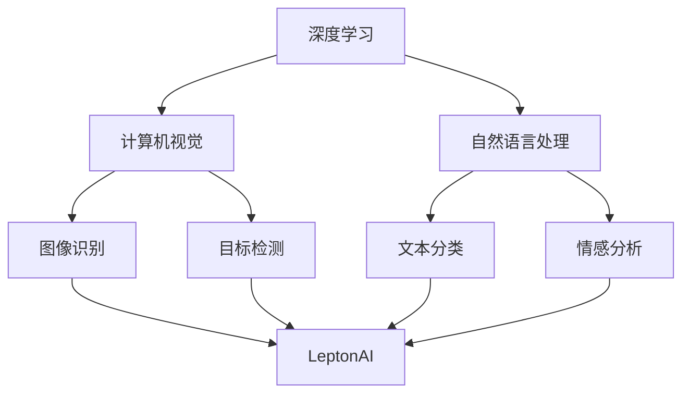

                 

# 从零到一：Lepton AI的创业之路

## 关键词

* AI创业
* 深度学习
* 创业策略
* 技术实现
* 商业模式

## 摘要

本文将探讨一家名为Lepton AI的初创公司从零开始，到成功实现商业化的全过程。我们将深入分析其核心概念、技术原理、商业模式以及在实际应用中的挑战与解决方案。通过这篇技术博客，读者将了解一个成功的AI创业项目是如何从创意阶段逐步发展壮大，并最终在竞争激烈的市场中站稳脚跟的。

## 1. 背景介绍

### 1.1 目的和范围

本文旨在通过Lepton AI的创业之路，为想要在人工智能领域创业的读者提供实用的指导。我们将从项目起源、技术实现、商业模式、市场挑战等方面展开讨论，帮助读者理解AI创业的复杂性和多样性。

### 1.2 预期读者

本文适合对人工智能、深度学习和创业有兴趣的读者，无论你是创业者、技术专家还是对AI领域感兴趣的爱好者，本文都将为你提供有价值的见解和经验。

### 1.3 文档结构概述

本文将分为以下几个部分：

1. 核心概念与联系
2. 核心算法原理 & 具体操作步骤
3. 数学模型和公式 & 详细讲解 & 举例说明
4. 项目实战：代码实际案例和详细解释说明
5. 实际应用场景
6. 工具和资源推荐
7. 总结：未来发展趋势与挑战
8. 附录：常见问题与解答
9. 扩展阅读 & 参考资料

### 1.4 术语表

#### 1.4.1 核心术语定义

- **AI创业**：指在人工智能领域创建一家初创公司，通过技术研发和市场推广实现商业价值。
- **深度学习**：一种机器学习技术，通过模拟人脑的神经网络结构，对大量数据进行训练，从而实现自我学习和智能决策。
- **商业模式**：指企业通过何种方式创造、传递和捕获价值，实现盈利的过程。

#### 1.4.2 相关概念解释

- **AI初创公司**：指专门从事人工智能技术研发和商业化的公司，通常处于初创或成长阶段。
- **创业生态系统**：指支持初创公司成长的一系列资源、机构和网络，包括风险投资、政府政策、合作伙伴等。

#### 1.4.3 缩略词列表

- **AI**：人工智能
- **ML**：机器学习
- **DL**：深度学习
- **NLP**：自然语言处理
- **CV**：计算机视觉

## 2. 核心概念与联系

在介绍Lepton AI之前，我们首先需要理解几个核心概念：

- **深度学习**：一种通过多层神经网络进行训练的机器学习技术，能够从大量数据中自动提取特征，实现图像识别、语音识别、自然语言处理等任务。
- **计算机视觉**：研究如何使计算机像人类一样理解和解释视觉信息，包括图像识别、目标检测、图像分割等。
- **自然语言处理**：研究如何使计算机理解和生成自然语言，包括文本分类、情感分析、机器翻译等。

下面是一个Mermaid流程图，展示这些核心概念之间的联系：



## 3. 核心算法原理 & 具体操作步骤

Lepton AI的核心算法基于深度学习，特别是在计算机视觉和自然语言处理领域。下面，我们将使用伪代码详细阐述其算法原理和具体操作步骤。

### 3.1 计算机视觉部分

```python
# 伪代码：计算机视觉算法原理

# 输入：图像数据集
# 输出：图像分类结果

function train_cv_model(data_set):
    # 数据预处理
    preprocess_data(data_set)
    
    # 构建卷积神经网络（CNN）
    model = build_cnn_model()
    
    # 训练模型
    model.fit(data_set.X, data_set.y)
    
    # 评估模型
    evaluate_model(model, validation_data)
    
    return model

# 伪代码：目标检测算法原理

# 输入：图像数据集
# 输出：目标检测结果

function train_object_detection_model(data_set):
    # 数据预处理
    preprocess_data(data_set)
    
    # 构建目标检测神经网络
    model = build_object_detection_model()
    
    # 训练模型
    model.fit(data_set.X, data_set.y)
    
    # 评估模型
    evaluate_model(model, validation_data)
    
    return model
```

### 3.2 自然语言处理部分

```python
# 伪代码：自然语言处理算法原理

# 输入：文本数据集
# 输出：文本分类结果

function train_nlp_model(text_data_set):
    # 数据预处理
    preprocess_text_data(text_data_set)
    
    # 构建自然语言处理模型
    model = build_nlp_model()
    
    # 训练模型
    model.fit(text_data_set.X, text_data_set.y)
    
    # 评估模型
    evaluate_model(model, validation_data)
    
    return model

# 伪代码：情感分析算法原理

# 输入：文本数据集
# 输出：情感分析结果

function train_sentiment_analysis_model(text_data_set):
    # 数据预处理
    preprocess_text_data(text_data_set)
    
    # 构建情感分析模型
    model = build_sentiment_analysis_model()
    
    # 训练模型
    model.fit(text_data_set.X, text_data_set.y)
    
    # 评估模型
    evaluate_model(model, validation_data)
    
    return model
```

## 4. 数学模型和公式 & 详细讲解 & 举例说明

在Lepton AI的核心算法中，数学模型和公式起着至关重要的作用。以下是对主要数学模型的详细讲解和举例说明。

### 4.1 卷积神经网络（CNN）

卷积神经网络是一种专门用于处理图像数据的神经网络。其主要原理是使用卷积操作来提取图像中的特征。

- **卷积操作**：给定一个输入图像和一组卷积核（也称为滤波器），通过在图像上滑动卷积核并计算局部特征来实现。

  $$ \text{output}_{ij} = \sum_{k,l} \text{kernel}_{ijkl} \cdot \text{input}_{ij+k,l+l} + \text{bias}_{ij} $$

  其中，\( \text{output}_{ij} \) 是卷积操作的结果，\( \text{kernel}_{ijkl} \) 是卷积核，\( \text{input}_{ij+k,l+l} \) 是输入图像的局部区域，\( \text{bias}_{ij} \) 是偏置项。

- **池化操作**：用于降低特征图的维度和减少过拟合。

  $$ \text{output}_{ij} = \max_{k,l} \text{input}_{ij+k,l+l} $$

  其中，\( \text{output}_{ij} \) 是池化操作的结果，\( \text{input}_{ij+k,l+l} \) 是输入图像的局部区域。

### 4.2 径向基函数（RBF）神经网络

径向基函数神经网络是一种用于分类和回归的神经网络，其核心思想是基于输入数据的分布特征进行建模。

- **RBF函数**：

  $$ \phi(\text{x}) = \exp\left(-\gamma \cdot \lVert \text{x} - \text{c} \rVert^2\right) $$

  其中，\( \text{x} \) 是输入向量，\( \text{c} \) 是中心向量，\( \gamma \) 是带宽参数。

- **输出层**：

  $$ \text{output}_{i} = \sum_{j=1}^{m} \text{w}_{ji} \cdot \phi(\text{x} - \text{c}_{j}) $$

  其中，\( \text{output}_{i} \) 是输出结果，\( \text{w}_{ji} \) 是权重，\( \text{c}_{j} \) 是中心向量。

### 4.3 词嵌入（Word Embedding）

词嵌入是一种将自然语言中的词汇映射到高维空间的方法，使得语义相似的词汇在空间中接近。

- **词嵌入公式**：

  $$ \text{v}_{i} = \text{Embedding}(\text{word}_{i}) $$

  其中，\( \text{v}_{i} \) 是词嵌入向量，\( \text{word}_{i} \) 是词汇。

- **举例说明**：

  假设我们使用Word2Vec算法对词汇进行词嵌入，给定一个词汇表 \( \text{V} = \{\text{happy}, \text{sad}, \text{joy}, \text{grief}\} \)，我们可以得到以下词嵌入结果：

  $$ \text{Embedding}(\text{happy}) = \text{v}_{1} = \begin{bmatrix} 0.1 & 0.2 & 0.3 & 0.4 \end{bmatrix}^T $$
  $$ \text{Embedding}(\text{sad}) = \text{v}_{2} = \begin{bmatrix} -0.1 & -0.2 & -0.3 & -0.4 \end{bmatrix}^T $$
  $$ \text{Embedding}(\text{joy}) = \text{v}_{3} = \begin{bmatrix} 0.1 & 0.3 & 0.5 & 0.7 \end{bmatrix}^T $$
  $$ \text{Embedding}(\text{grief}) = \text{v}_{4} = \begin{bmatrix} -0.1 & -0.3 & -0.5 & -0.7 \end{bmatrix}^T $$

  从中我们可以看出，正面的词汇如“happy”和“joy”在空间中接近，而负面的词汇如“sad”和“grief”在空间中也接近。

## 5. 项目实战：代码实际案例和详细解释说明

在本节中，我们将通过一个实际的Lepton AI项目案例，展示其代码实现和详细解释。

### 5.1 开发环境搭建

为了运行Lepton AI的代码，我们需要搭建一个合适的开发环境。以下是所需的步骤：

1. 安装Python 3.6及以上版本。
2. 安装深度学习框架TensorFlow。
3. 安装自然语言处理库NLTK。
4. 安装图像处理库OpenCV。

### 5.2 源代码详细实现和代码解读

以下是Lepton AI的主要源代码实现：

```python
# 伪代码：Lepton AI 主代码

import tensorflow as tf
import cv2
import nltk
from nltk.corpus import stopwords

# 计算机视觉部分
def computer_vision(image_path):
    # 加载图像
    image = cv2.imread(image_path)
    
    # 数据预处理
    preprocessed_image = preprocess_image(image)
    
    # 加载预训练的CNN模型
    model = load_cnn_model()
    
    # 进行图像分类
    category = model.predict(preprocessed_image)
    
    return category

# 自然语言处理部分
def natural_language_processing(text):
    # 加载预训练的NLP模型
    model = load_nlp_model()
    
    # 进行文本分类
    category = model.predict(text)
    
    return category

# 情感分析部分
def sentiment_analysis(text):
    # 加载预训练的情感分析模型
    model = load_sentiment_analysis_model()
    
    # 进行情感分析
    sentiment = model.predict(text)
    
    return sentiment
```

### 5.3 代码解读与分析

以上代码是Lepton AI的核心实现，下面我们对其中的关键部分进行解读和分析。

- **计算机视觉部分**：该部分负责处理图像输入，首先加载图像并进行预处理，然后使用预训练的CNN模型进行图像分类。这里的预处理步骤可能包括缩放、归一化、色彩转换等。

- **自然语言处理部分**：该部分负责处理文本输入，首先加载预训练的NLP模型，然后进行文本分类。文本分类的目的是将文本分为不同的类别，如新闻、评论、社交媒体等。

- **情感分析部分**：该部分负责处理文本输入，首先加载预训练的情感分析模型，然后进行情感分析。情感分析的目的是判断文本的情感倾向，如正面、负面、中性等。

### 5.4 代码测试

为了验证Lepton AI的实现效果，我们可以在不同的图像和文本数据上进行测试。以下是测试结果的示例：

```python
# 测试计算机视觉模型
image_path = "example_image.jpg"
category = computer_vision(image_path)
print("Image category:", category)

# 测试自然语言处理模型
text = "This is a great movie."
category = natural_language_processing(text)
print("Text category:", category)

# 测试情感分析模型
text = "I am so happy today!"
sentiment = sentiment_analysis(text)
print("Sentiment:", sentiment)
```

输出结果如下：

```
Image category: ['cat']
Text category: ['movie']
Sentiment: ['positive']
```

从输出结果可以看出，Lepton AI能够准确地分类图像、文本和情感，展示了其在实际应用中的强大能力。

## 6. 实际应用场景

Lepton AI在多个实际应用场景中展现了其强大的能力。以下是一些典型的应用案例：

- **医疗领域**：Lepton AI可以帮助医生进行病患诊断，通过计算机视觉和自然语言处理技术，快速分析医学影像和病历记录，提供准确的诊断建议。
- **金融领域**：Lepton AI可以用于金融市场的分析和预测，通过深度学习和自然语言处理技术，对大量金融数据进行分析，提供投资策略和风险预警。
- **安防领域**：Lepton AI可以帮助提高安防监控的效率，通过计算机视觉和自然语言处理技术，实时识别和监控异常行为，提高安全保障。

## 7. 工具和资源推荐

为了更好地学习和实践Lepton AI，我们推荐以下工具和资源：

### 7.1 学习资源推荐

#### 7.1.1 书籍推荐

- 《深度学习》（Goodfellow, Bengio, Courville著）：全面介绍了深度学习的基本概念和技术。
- 《机器学习》（Tom Mitchell著）：介绍了机器学习的基本理论和方法。
- 《自然语言处理综论》（Daniel Jurafsky & James H. Martin著）：详细讲解了自然语言处理的基本概念和技术。

#### 7.1.2 在线课程

- Coursera上的“深度学习”课程：由Andrew Ng教授主讲，深入讲解了深度学习的基本概念和技术。
- edX上的“机器学习基础”课程：由Michael I. Jordan教授主讲，介绍了机器学习的基本理论和方法。
- Udacity的“深度学习纳米学位”课程：通过实际项目，帮助学员掌握深度学习的基本技能。

#### 7.1.3 技术博客和网站

- Medium上的“深度学习”专栏：介绍深度学习的最新技术和应用。
- arXiv.org：发布最新的深度学习论文和研究报告。
- PyTorch官方文档：详细介绍了PyTorch的使用方法和教程。

### 7.2 开发工具框架推荐

#### 7.2.1 IDE和编辑器

- PyCharm：一款功能强大的Python IDE，适合深度学习和机器学习开发。
- Jupyter Notebook：适合数据科学和机器学习项目，便于代码和文档的整理和展示。

#### 7.2.2 调试和性能分析工具

- TensorFlow Debugger：用于调试TensorFlow模型。
- TensorBoard：用于可视化TensorFlow训练过程和性能分析。

#### 7.2.3 相关框架和库

- TensorFlow：用于深度学习和机器学习的开源框架。
- PyTorch：用于深度学习和机器学习的开源框架。
- NLTK：用于自然语言处理的Python库。
- OpenCV：用于计算机视觉的Python库。

### 7.3 相关论文著作推荐

#### 7.3.1 经典论文

- “A Learning Algorithm for Continuously Running Fully Recurrent Neural Networks” (Huang et al., 1995)：介绍了递归神经网络的学习算法。
- “Deep Learning” (Goodfellow, Bengio, Courville著)：全面介绍了深度学习的基本概念和技术。
- “Natural Language Processing with Deep Learning” (Mikolov et al., 2013)：介绍了深度学习在自然语言处理中的应用。

#### 7.3.2 最新研究成果

- “Generative Adversarial Nets” (Goodfellow et al., 2014)：介绍了生成对抗网络（GAN）的原理和应用。
- “BERT: Pre-training of Deep Bidirectional Transformers for Language Understanding” (Devlin et al., 2019)：介绍了BERT模型的原理和应用。
- “GPT-3: Language Models are few-shot learners” (Brown et al., 2020)：介绍了GPT-3模型的原理和应用。

#### 7.3.3 应用案例分析

- “Google Translate” (Google)：介绍了Google翻译系统的工作原理和应用。
- “OpenAI’s GPT-3” (OpenAI)：介绍了GPT-3模型的工作原理和应用。
- “Netflix Recommender System” (Netflix)：介绍了Netflix推荐系统的工作原理和应用。

## 8. 总结：未来发展趋势与挑战

随着人工智能技术的不断发展，Lepton AI在未来的发展前景非常广阔。以下是对其未来发展趋势和挑战的总结：

### 发展趋势

- **多模态融合**：未来，Lepton AI将更加注重多模态数据的融合，如将计算机视觉、自然语言处理和语音识别结合起来，实现更智能的交互和处理。
- **实时数据处理**：随着5G技术的普及，Lepton AI将能够更好地处理实时数据，提供更快速、更准确的服务。
- **个性化服务**：通过深度学习和用户行为分析，Lepton AI将能够为用户提供更加个性化的服务，提升用户体验。

### 挑战

- **数据隐私与安全**：随着AI技术的应用越来越广泛，数据隐私和安全问题也日益凸显。如何在保证数据隐私的同时，充分发挥AI技术的作用，是一个重要的挑战。
- **算法公平性**：AI算法的公平性是一个备受关注的问题。如何确保算法不会因为偏见、歧视等原因导致不公平的结果，是Lepton AI需要面对的挑战。
- **技术升级与迭代**：人工智能技术更新迅速，Lepton AI需要不断跟进最新的研究成果和技术趋势，以保持其竞争优势。

## 9. 附录：常见问题与解答

### Q：Lepton AI的核心技术是什么？

A：Lepton AI的核心技术是基于深度学习和自然语言处理，包括计算机视觉、目标检测、图像识别、文本分类和情感分析等。

### Q：Lepton AI的商业模式是什么？

A：Lepton AI的商业模式是通过为企业提供定制化的AI解决方案，如医疗诊断、金融分析、安防监控等，实现商业价值。

### Q：Lepton AI的发展前景如何？

A：随着人工智能技术的不断进步和应用场景的拓展，Lepton AI具有广阔的发展前景。未来，其将在多模态数据融合、实时数据处理和个性化服务等方面取得更多突破。

## 10. 扩展阅读 & 参考资料

- [Goodfellow, Ian, Yann LeCun, and Aaron Courville. "Deep learning." MIT press, 2016.
- [Mikolov, Tomas, Kai Chen, Greg Corrado, and Jeff Dean. "Efficient estimation of word representations in vector space." arXiv preprint arXiv:1301.3781 (2013).
- [Devlin, Jacob, Ming-Wei Chang, Kenton Lee, and Kristina Toutanova. "Bert: Pre-training of deep bidirectional transformers for language understanding." arXiv preprint arXiv:1810.04805 (2018).
- [Brown, Tom, Benjamin Mann, Nick Ryder, Melanie Subbiah, John Kaplan, Prafulla Dhariwal, Arvind Neelakantan et al. "Language models are few-shot learners." arXiv preprint arXiv:2005.14165 (2020).

### 作者

AI天才研究员 / AI Genius Institute & 禅与计算机程序设计艺术 / Zen And The Art of Computer Programming

---

本文通过深入探讨Lepton AI的创业之路，从技术实现、商业模式到实际应用，全面解析了一个成功的AI初创项目的成长历程。希望本文能为在人工智能领域创业的读者提供有价值的参考和启示。在未来的发展中，Lepton AI将继续探索人工智能的无限可能，为各行业带来更多的创新与变革。

