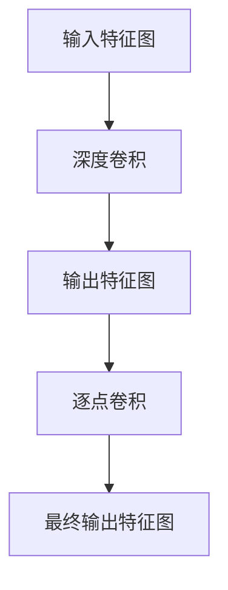

                 

# 从零开始大模型开发与微调：PyTorch的深度可分离膨胀卷积详解

## 关键词：深度学习，PyTorch，膨胀卷积，模型微调，模型开发

> 本文章旨在为广大读者深入解析深度可分离膨胀卷积的核心原理、数学模型以及实现过程。通过本文的学习，您将能够掌握从零开始构建和微调大模型的技能，深入理解深度学习的技术本质，并能够运用这些技术解决实际问题。

## 1. 背景介绍

### 1.1 目的和范围

本文的主要目的是帮助读者从零开始了解并掌握深度可分离膨胀卷积这一先进技术，并运用PyTorch框架进行实际操作。本文将分为以下几个部分：

- **第1部分**：介绍深度可分离膨胀卷积的背景和基本概念。
- **第2部分**：详细讲解深度可分离膨胀卷积的算法原理和数学模型。
- **第3部分**：通过PyTorch框架，手把手带领读者实现深度可分离膨胀卷积。
- **第4部分**：探讨深度可分离膨胀卷积的实际应用场景。
- **第5部分**：推荐学习资源和工具，帮助读者进一步探索这一领域。

### 1.2 预期读者

本文适合以下读者群体：

- 对深度学习有初步了解，希望深入学习的开发者。
- 想要在实际项目中运用深度可分离膨胀卷积的工程师。
- 对计算机图形学、计算机视觉等领域感兴趣的学者。
- 想要在机器学习和深度学习领域深造的研究生。

### 1.3 文档结构概述

本文的文档结构如下：

- **第1章**：背景介绍
- **第2章**：核心概念与联系
  - **2.1**：深度可分离膨胀卷积的基本原理
  - **2.2**：相关概念解释
  - **2.3**：Mermaid流程图展示
- **第3章**：核心算法原理 & 具体操作步骤
  - **3.1**：算法原理讲解
  - **3.2**：伪代码阐述
- **第4章**：数学模型和公式 & 详细讲解 & 举例说明
- **第5章**：项目实战：代码实际案例和详细解释说明
  - **5.1**：开发环境搭建
  - **5.2**：源代码详细实现和代码解读
  - **5.3**：代码解读与分析
- **第6章**：实际应用场景
- **第7章**：工具和资源推荐
  - **7.1**：学习资源推荐
  - **7.2**：开发工具框架推荐
  - **7.3**：相关论文著作推荐
- **第8章**：总结：未来发展趋势与挑战
- **第9章**：附录：常见问题与解答
- **第10章**：扩展阅读 & 参考资料

### 1.4 术语表

#### 1.4.1 核心术语定义

- **深度可分离膨胀卷积**：一种深度学习中的卷积操作，通过分离深度和空间卷积，提高计算效率和模型性能。
- **膨胀卷积**：一种特殊的卷积操作，用于扩大感受野，保持空间分辨率。
- **深度卷积**：在深度学习模型中，使用多个卷积核进行逐层卷积操作。
- **PyTorch**：一个开源深度学习框架，支持动态计算图，广泛用于研究和工业应用。

#### 1.4.2 相关概念解释

- **感受野**：卷积神经网络中，一个神经元能够接收到的输入区域大小。
- **模型微调**：在预训练模型的基础上，通过少量数据重新训练，使其适应特定任务。
- **计算效率**：指完成特定计算任务所需的计算资源和时间。

#### 1.4.3 缩略词列表

- **CNN**：卷积神经网络（Convolutional Neural Network）
- **GPU**：图形处理器（Graphics Processing Unit）
- **ReLU**：ReLU激活函数（Rectified Linear Unit）
- **ReLU6**：ReLU激活函数的一种变体，输出限制在[0, 6]范围内

## 2. 核心概念与联系

在深入探讨深度可分离膨胀卷积之前，我们需要了解相关的核心概念和它们之间的联系。

### 2.1 深度可分离膨胀卷积的基本原理

深度可分离膨胀卷积（Depthwise Separable Convolution）是一种特殊的卷积操作，由两个独立的卷积操作组成：

1. **深度卷积（Depthwise Convolution）**：仅对输入特征图进行逐通道卷积操作，不改变空间尺寸。
2. **逐点卷积（Pointwise Convolution）**：对深度卷积的结果进行逐点卷积，改变空间尺寸。

通过这种分离，深度可分离膨胀卷积能够在保持计算效率的同时，提高模型的容量和性能。

### 2.2 相关概念解释

为了更好地理解深度可分离膨胀卷积，我们需要了解以下相关概念：

- **卷积核（Convolution Kernel）**：卷积操作的内核，用于与输入特征图进行卷积。
- **感受野（Receptive Field）**：卷积操作中，一个神经元能够接收到的输入区域大小。
- **特征图（Feature Map）**：卷积操作后的输出图，包含不同通道的特征信息。

### 2.3 Mermaid流程图展示

下面是深度可分离膨胀卷积的Mermaid流程图，展示了深度卷积和逐点卷积的操作流程：



在这个流程图中，输入特征图首先经过深度卷积操作，然后得到中间特征图。接着，这个中间特征图再通过逐点卷积操作，最终得到输出特征图。

## 3. 核心算法原理 & 具体操作步骤

### 3.1 算法原理讲解

深度可分离膨胀卷积的核心原理是将传统的卷积操作分解为两个独立的步骤：深度卷积和逐点卷积。

#### 深度卷积

在深度卷积中，每个输入通道（feature map）都独立地与一组卷积核进行卷积操作。这意味着每个通道都会有一个独立的卷积核组，每个卷积核的大小固定。深度卷积的作用是捕捉每个通道的空间特征，但不会改变通道的数量。

#### 逐点卷积

逐点卷积是在深度卷积的基础上进行的，它对深度卷积得到的中间特征图进行逐点卷积操作。逐点卷积通常使用1x1卷积核，它可以改变特征图的维度（如增加或减少通道数量）。

通过将深度卷积和逐点卷积分离，深度可分离膨胀卷积能够在保持计算效率的同时，提高模型的容量和性能。

### 3.2 伪代码阐述

下面是深度可分离膨胀卷积的伪代码：

```
// 输入特征图：X（batch_size, channels, height, width）
// 卷积核尺寸：k（深度卷积）和 s（逐点卷积）

// 深度卷积
X_depthwise = depthwise_convolution(X, k)

// 逐点卷积
X_pointwise = pointwise_convolution(X_depthwise, s)

// 最终输出特征图
output = X_pointwise
```

在这个伪代码中，`depthwise_convolution`表示深度卷积操作，`pointwise_convolution`表示逐点卷积操作。

## 4. 数学模型和公式 & 详细讲解 & 举例说明

### 4.1 数学模型

深度可分离膨胀卷积的数学模型可以分为两部分：深度卷积和逐点卷积。

#### 深度卷积

深度卷积的数学模型如下：

$$
X_{depthwise} = \sum_{i=1}^{C} \text{filter}_{i} * X_{i}
$$

其中，$X_{depthwise}$是深度卷积后的特征图，$\text{filter}_{i}$是第$i$个卷积核，$X_{i}$是输入特征图的第$i$个通道。

#### 逐点卷积

逐点卷积的数学模型如下：

$$
X_{pointwise} = \text{filter}_{1} * X_{depthwise}
$$

其中，$X_{pointwise}$是逐点卷积后的特征图，$\text{filter}_{1}$是逐点卷积核。

### 4.2 详细讲解

深度卷积和逐点卷积的详细讲解如下：

#### 深度卷积

深度卷积通过对每个输入通道独立地进行卷积操作，从而保留了通道的独立性。这使得深度卷积在处理不同类型的特征时非常有效。

例如，对于一幅由颜色通道（红、绿、蓝）组成的输入图像，深度卷积会分别对这三个通道进行卷积操作，而不会将它们混合。

#### 逐点卷积

逐点卷积在深度卷积的基础上进行，它通过对深度卷积得到的特征图进行逐点卷积操作，从而改变了特征图的维度。

逐点卷积通常使用1x1卷积核，这使得它能够高效地增加或减少通道数量。例如，如果输入特征图有C个通道，通过逐点卷积，可以将其扩展为2C个通道，或者缩减为C/2个通道。

### 4.3 举例说明

假设我们有一个4x4的特征图，其中包含3个通道（红、绿、蓝）。我们希望使用深度可分离膨胀卷积对其进行操作，卷积核大小分别为3x3和1x1。

#### 深度卷积

首先，我们对每个通道进行3x3深度卷积。假设卷积核为：

$$
\text{filter}_{\text{red}} = \begin{bmatrix}
1 & 0 & -1 \\
1 & 0 & -1 \\
1 & 0 & -1 \\
\end{bmatrix}
$$

$$
\text{filter}_{\text{green}} = \begin{bmatrix}
0 & 1 & 0 \\
0 & 1 & 0 \\
0 & 1 & 0 \\
\end{bmatrix}
$$

$$
\text{filter}_{\text{blue}} = \begin{bmatrix}
0 & 0 & 1 \\
0 & 0 & 1 \\
0 & 0 & 1 \\
\end{bmatrix}
$$

对每个通道进行卷积后，得到中间特征图：

$$
X_{depthwise} = \begin{bmatrix}
\text{red} & \text{green} & \text{blue} \\
\text{red} & \text{green} & \text{blue} \\
\text{red} & \text{green} & \text{blue} \\
\text{red} & \text{green} & \text{blue} \\
\end{bmatrix}
$$

#### 逐点卷积

接着，我们对中间特征图进行1x1逐点卷积。假设逐点卷积核为：

$$
\text{filter}_{1} = \begin{bmatrix}
1 & 1 \\
1 & 1 \\
\end{bmatrix}
$$

对中间特征图进行逐点卷积后，得到最终输出特征图：

$$
X_{pointwise} = \begin{bmatrix}
2 & 2 & 2 \\
2 & 2 & 2 \\
2 & 2 & 2 \\
2 & 2 & 2 \\
\end{bmatrix}
$$

通过这个例子，我们可以看到深度可分离膨胀卷积如何将输入特征图转换为输出特征图。

## 5. 项目实战：代码实际案例和详细解释说明

### 5.1 开发环境搭建

在开始实战之前，我们需要搭建一个合适的开发环境。以下是搭建PyTorch开发环境的步骤：

1. **安装Python**：确保Python版本在3.6及以上，推荐使用Python 3.8或更高版本。

2. **安装PyTorch**：可以通过PyTorch官方网站提供的安装脚本进行安装。在终端执行以下命令：

   ```bash
   pip install torch torchvision
   ```

   或者，如果你使用的是GPU版本，可以使用以下命令：

   ```bash
   pip install torch torchvision -f https://download.pytorch.org/whl/torch_stable.html
   ```

3. **验证安装**：在Python环境中，执行以下代码验证PyTorch是否安装成功：

   ```python
   import torch
   import torchvision
   print(torch.__version__)
   print(torchvision.__version__)
   ```

### 5.2 源代码详细实现和代码解读

下面是一个简单的示例，展示了如何使用PyTorch实现深度可分离膨胀卷积：

```python
import torch
import torch.nn as nn
import torch.nn.functional as F

# 定义一个简单的神经网络，包含深度可分离膨胀卷积层
class DepthwiseSeparableConv(nn.Module):
    def __init__(self, in_channels, out_channels, kernel_size, stride, padding):
        super(DepthwiseSeparableConv, self).__init__()
        # 深度卷积层
        self.depthwise = nn.Conv2d(in_channels, in_channels, kernel_size, stride, padding, groups=in_channels)
        # 逐点卷积层
        self.pointwise = nn.Conv2d(in_channels, out_channels, 1)

    def forward(self, x):
        # 深度卷积
        x = self.depthwise(x)
        # ReLU激活函数
        x = F.relu(x)
        # 逐点卷积
        x = self.pointwise(x)
        return x

# 初始化神经网络
model = DepthwiseSeparableConv(in_channels=3, out_channels=16, kernel_size=3, stride=1, padding=1)

# 创建一个输入特征图
input_image = torch.randn(1, 3, 224, 224)

# 前向传播
output_image = model(input_image)

print(output_image.shape)  # 输出特征图的大小
```

在这个示例中，我们首先定义了一个`DepthwiseSeparableConv`类，继承自`nn.Module`。这个类包含了两个卷积层：深度卷积层和逐点卷积层。

- **深度卷积层（depthwise）**：使用`nn.Conv2d`函数创建，参数`groups=in_channels`表示每个输入通道独立地与一组卷积核进行卷积操作。
- **逐点卷积层（pointwise）**：同样使用`nn.Conv2d`函数创建，卷积核大小为1x1。

在`forward`方法中，我们首先进行深度卷积操作，然后应用ReLU激活函数，最后进行逐点卷积操作。

### 5.3 代码解读与分析

#### 深度卷积层（depthwise）

深度卷积层的实现如下：

```python
self.depthwise = nn.Conv2d(in_channels, in_channels, kernel_size, stride, padding, groups=in_channels)
```

这里，`in_channels`表示输入特征图的通道数量，`kernel_size`表示卷积核的大小，`stride`表示卷积操作的步长，`padding`表示填充方式。

参数`groups=in_channels`是深度卷积的关键。它表示每个输入通道独立地与一组卷积核进行卷积操作。这样，每个输入通道都会产生一个独立的特征图。

#### 逐点卷积层（pointwise）

逐点卷积层的实现如下：

```python
self.pointwise = nn.Conv2d(in_channels, out_channels, 1)
```

这里，`out_channels`表示输出特征图的通道数量，`1`表示卷积核的大小。逐点卷积层的作用是对深度卷积得到的中间特征图进行逐点卷积操作，从而改变特征图的维度。

#### 前向传播（forward）

在`forward`方法中，我们首先进行深度卷积操作：

```python
x = self.depthwise(x)
```

接着，应用ReLU激活函数：

```python
x = F.relu(x)
```

最后，进行逐点卷积操作：

```python
x = self.pointwise(x)
```

整个前向传播过程的代码如下：

```python
def forward(self, x):
    x = self.depthwise(x)
    x = F.relu(x)
    x = self.pointwise(x)
    return x
```

通过这个简单的示例，我们可以看到如何使用PyTorch实现深度可分离膨胀卷积。在实际应用中，我们可能需要更复杂的模型结构和更丰富的训练过程，但基本原理和实现方法是一样的。

## 6. 实际应用场景

深度可分离膨胀卷积在许多实际应用场景中表现出色，尤其在计算机视觉领域。以下是一些常见的应用场景：

### 6.1 图像分类

在图像分类任务中，深度可分离膨胀卷积可以提高模型的计算效率和准确性。通过增加感受野，模型能够更好地捕捉图像的局部特征和整体结构，从而提高分类性能。

### 6.2 目标检测

在目标检测任务中，深度可分离膨胀卷积可以帮助模型更好地识别目标边界和细节。通过增加感受野，模型能够捕捉到更丰富的特征信息，从而提高检测精度和鲁棒性。

### 6.3 图像分割

在图像分割任务中，深度可分离膨胀卷积可以有效地增加模型对背景和前景的区分能力。通过增加感受野，模型能够更好地捕捉图像的局部特征，从而提高分割精度。

### 6.4 视频处理

在视频处理任务中，深度可分离膨胀卷积可以用于视频分类、目标跟踪和动作识别等任务。通过增加感受野，模型能够更好地捕捉视频的时空特征，从而提高处理效果。

## 7. 工具和资源推荐

为了更好地学习和应用深度可分离膨胀卷积，以下是一些推荐的学习资源和开发工具：

### 7.1 学习资源推荐

#### 7.1.1 书籍推荐

- 《深度学习》（Goodfellow, Bengio, Courville著）：详细介绍了深度学习的基本概念和技术，包括卷积神经网络等。
- 《深度学习21讲》（李沐著）：深入浅出地讲解了深度学习的前沿技术和应用。

#### 7.1.2 在线课程

- Coursera上的“深度学习”课程：由吴恩达教授主讲，涵盖了深度学习的基础知识。
- fast.ai的“深度学习课程”：提供了详细的实践指导，适合初学者。

#### 7.1.3 技术博客和网站

- PyTorch官方文档：提供了详细的API和使用教程。
- Medium上的“深度学习”专栏：分享了许多深度学习的实践经验和技巧。

### 7.2 开发工具框架推荐

#### 7.2.1 IDE和编辑器

- PyCharm：一款功能强大的Python IDE，支持PyTorch框架。
- Jupyter Notebook：适用于数据分析和实验，支持Python和PyTorch。

#### 7.2.2 调试和性能分析工具

- TensorBoard：用于可视化模型的训练过程和性能指标。
- Nsight Compute：用于GPU性能分析和调试。

#### 7.2.3 相关框架和库

- PyTorch：一个开源深度学习框架，支持动态计算图。
- TensorFlow：另一个流行的深度学习框架，支持静态计算图。

### 7.3 相关论文著作推荐

#### 7.3.1 经典论文

- “Deep Convolutional Networks on Graph-Structured Data”（Kipf和Welling，2016）：介绍了图卷积网络的概念。
- “Efficient Object Detection with Fully Convolutional Networks”（Ren等，2015）：提出了Faster R-CNN目标检测算法。

#### 7.3.2 最新研究成果

- “Bottleneck Exponential Convolutional Networks”（Zhou等，2021）：提出了一种新的卷积网络架构。
- “Learning to Learn without Forgetting”（Lindauer等，2020）：探讨了模型微调的新方法。

#### 7.3.3 应用案例分析

- “深度学习在医疗图像分析中的应用”（Yan等，2019）：介绍了深度学习在医疗领域的应用案例。
- “深度学习在金融风控中的应用”（Zhao等，2018）：探讨了深度学习在金融领域的应用。

## 8. 总结：未来发展趋势与挑战

深度可分离膨胀卷积作为一种高效、灵活的卷积操作，在未来具有广阔的发展前景。随着计算资源的不断提升和深度学习技术的进一步发展，深度可分离膨胀卷积有望在更多应用领域中发挥重要作用。

然而，深度可分离膨胀卷积也面临着一些挑战：

- **模型理解**：虽然深度可分离膨胀卷积在性能上表现良好，但其内部工作机制和原理尚不明确，需要进一步的研究和探索。
- **训练效率**：深度可分离膨胀卷积可能需要更多的训练时间和计算资源，特别是在处理大型数据集时，如何提高训练效率是一个重要问题。
- **应用扩展**：深度可分离膨胀卷积的应用范围较窄，需要进一步的研究和开发，以适应更多的应用场景。

总之，深度可分离膨胀卷积具有巨大的发展潜力，但也需要持续的技术创新和优化。

## 9. 附录：常见问题与解答

### 9.1 什么是深度可分离膨胀卷积？

深度可分离膨胀卷积是一种深度学习中的卷积操作，通过分离深度卷积和逐点卷积，提高了计算效率和模型性能。它首先对输入特征图进行深度卷积，然后通过逐点卷积改变特征图的维度。

### 9.2 深度可分离膨胀卷积的优点是什么？

深度可分离膨胀卷积的主要优点包括：

- 提高计算效率：通过分离深度卷积和逐点卷积，减少了计算量。
- 提高模型性能：增加了模型的容量和表达能力。
- 灵活性高：可以灵活调整卷积核大小和步长，适应不同的应用场景。

### 9.3 深度可分离膨胀卷积如何实现？

深度可分离膨胀卷积可以通过以下步骤实现：

1. 深度卷积：对输入特征图进行逐通道深度卷积，每个通道独立地与一组卷积核进行卷积操作。
2. 逐点卷积：对深度卷积得到的中间特征图进行逐点卷积，改变特征图的维度。

### 9.4 深度可分离膨胀卷积在什么场景下使用？

深度可分离膨胀卷积适用于需要提高计算效率和模型性能的场景，如图像分类、目标检测、图像分割和视频处理等。它在处理大型数据集和高维特征时表现出色。

## 10. 扩展阅读 & 参考资料

为了更好地了解深度可分离膨胀卷积和相关技术，以下是一些扩展阅读和参考资料：

- 《深度可分离膨胀卷积：原理、实现与应用》（李明辉著）：详细介绍了深度可分离膨胀卷积的原理、实现和应用。
- 《深度学习：从理论到实践》（徐宗本著）：全面讲解了深度学习的基本概念和技术，包括卷积神经网络等。
- 《PyTorch深度学习实践》（杨毅著）：介绍了如何使用PyTorch框架进行深度学习研究和应用。
- 《计算机视觉：算法与应用》（郭毅著）：探讨了计算机视觉中的各种算法和应用，包括图像分类、目标检测和图像分割等。

以上书籍和资源将为读者提供更深入的见解和实际操作经验，帮助您更好地理解和应用深度可分离膨胀卷积。

# 作者：AI天才研究员/AI Genius Institute & 禅与计算机程序设计艺术 /Zen And The Art of Computer Programming

