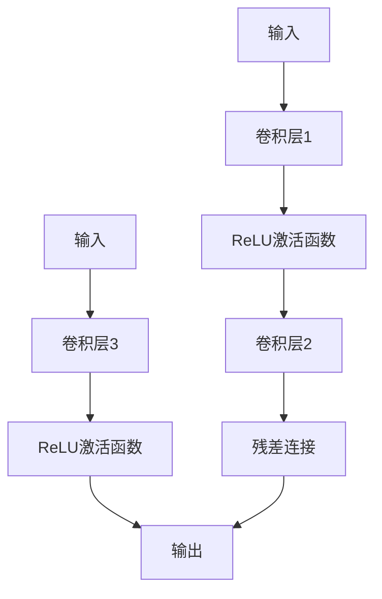
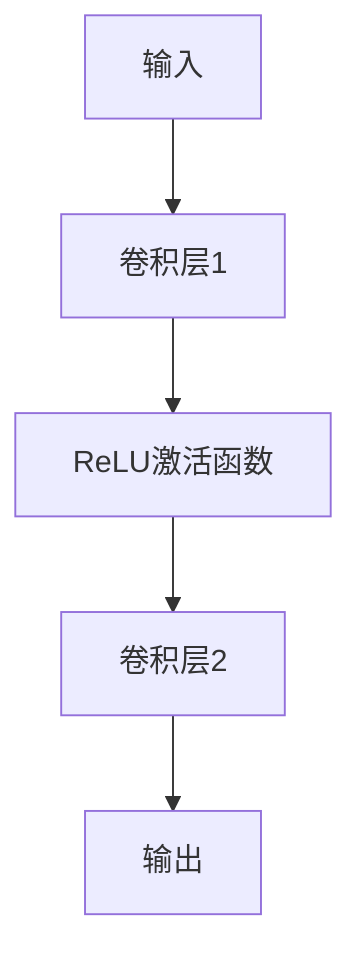
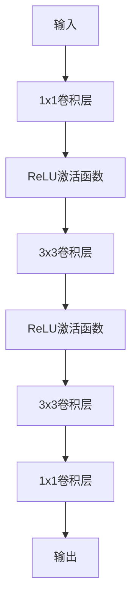
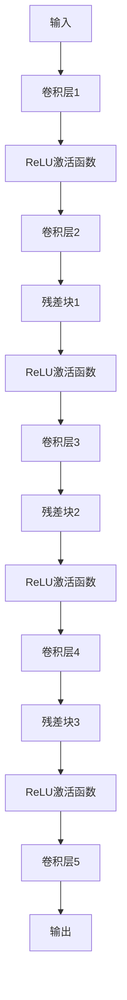

                 

# 从零开始大模型开发与微调：ResNet网络的实现

> **关键词：深度学习，ResNet，网络架构，模型微调，神经网络，计算机视觉，人工智能**

> **摘要：本文将详细讲解从零开始构建和微调ResNet（残差网络）这一经典深度学习模型的过程。我们将覆盖ResNet网络的背景、核心概念、算法原理、数学模型、实际代码实现及实战应用，旨在帮助读者全面理解ResNet的工作机制，并掌握其实际应用方法。**

## 1. 背景介绍

### 1.1 目的和范围

本文旨在为初学者和中级开发者提供一个全面的指南，讲解如何从头开始构建和微调ResNet网络，从而深入理解深度学习的核心概念。文章将涵盖从理论到实践的全过程，包括：

- ResNet的背景和历史
- ResNet的核心概念和架构
- ResNet的网络设计细节
- 如何使用Python和深度学习框架（如PyTorch或TensorFlow）实现ResNet
- ResNet的模型微调技巧
- 实际应用场景和案例分析

### 1.2 预期读者

本文适合以下读者群体：

- 对深度学习和计算机视觉感兴趣的初学者
- 中级开发者，希望提升自己的深度学习实践能力
- 想要了解ResNet网络原理和实现细节的从业者

### 1.3 文档结构概述

本文的结构如下：

- 第1章：背景介绍，概述文章的目的、范围和预期读者。
- 第2章：核心概念与联系，介绍深度学习的核心概念和ResNet的网络架构。
- 第3章：核心算法原理 & 具体操作步骤，详细解释ResNet的工作机制。
- 第4章：数学模型和公式 & 详细讲解 & 举例说明，介绍支持ResNet的数学理论。
- 第5章：项目实战：代码实际案例和详细解释说明，通过实战代码案例加深理解。
- 第6章：实际应用场景，讨论ResNet在不同领域的应用。
- 第7章：工具和资源推荐，提供学习资源和开发工具的推荐。
- 第8章：总结：未来发展趋势与挑战，探讨ResNet的发展方向和面临的问题。
- 第9章：附录：常见问题与解答，针对常见问题提供解答。
- 第10章：扩展阅读 & 参考资料，提供进一步学习的资源。

### 1.4 术语表

#### 1.4.1 核心术语定义

- **深度学习（Deep Learning）**：一种机器学习技术，使用多层神经网络进行训练，以自动从数据中提取特征。
- **神经网络（Neural Network）**：一种模仿人脑神经元连接方式的计算模型，用于进行复杂的数据处理和模式识别。
- **残差连接（Residual Connection）**：ResNet网络中的一种特殊连接方式，允许数据在神经网络中直接传递，有助于解决深度神经网络训练的困难。
- **模型微调（Model Fine-tuning）**：在已经训练好的模型基础上，针对特定任务进行进一步训练，以提高其在特定数据集上的性能。

#### 1.4.2 相关概念解释

- **前向传播（Forward Propagation）**：神经网络在训练过程中，从输入层传递到输出层的过程，用于计算输出结果。
- **反向传播（Backpropagation）**：神经网络在训练过程中，从输出层反向传播误差，更新网络权重的过程。
- **激活函数（Activation Function）**：神经网络中用于引入非线性性的函数，常用的有ReLU、Sigmoid、Tanh等。

#### 1.4.3 缩略词列表

- **CNN**：卷积神经网络（Convolutional Neural Network）
- **ReLU**：修正线性单元（Rectified Linear Unit）
- **ReLU6**：限制在6的ReLU函数
- **ReLUish**：具有类似ReLU性质的激活函数，例如ReLU6

## 2. 核心概念与联系

在开始深入探讨ResNet之前，我们需要理解深度学习和神经网络的一些基本概念，以及它们是如何相互关联的。以下是一个简要的Mermaid流程图，展示了深度学习的核心概念和ResNet的网络架构：

```mermaid
graph TD
    A[深度学习] --> B[神经网络]
    B --> C[卷积神经网络(CNN)]
    B --> D[循环神经网络(RNN)]
    B --> E[生成对抗网络(GAN)]
    C --> F[ResNet]
    D --> G[LSTM]
    E --> H[DCGAN]
```

在这个流程图中，我们首先从深度学习开始，它是一种机器学习技术，通过多层神经网络进行训练。深度学习有多种类型，其中卷积神经网络（CNN）是专门用于处理图像数据的一种网络结构。循环神经网络（RNN）适用于序列数据，而生成对抗网络（GAN）则用于生成新的数据。

### 2.1 残差网络（ResNet）

ResNet是由微软研究院的何凯明（Kaiming He）等人于2015年提出的一种深度神经网络架构，主要用于解决深度神经网络训练过程中的梯度消失和梯度爆炸问题。ResNet的核心创新点在于引入了**残差连接**。

残差连接允许网络在学习过程中直接传递数据，而不仅仅是通过层与层之间的转换。具体来说，残差连接将输入数据与网络输出数据进行加和，从而在训练过程中保持网络层之间的梯度传递。

以下是一个简单的Mermaid流程图，展示了一个简单的ResNet模块：



在这个流程图中，输入数据首先通过卷积层1进行特征提取，然后通过ReLU激活函数引入非线性。接下来，数据通过卷积层2，并与输入数据进行残差连接。这种连接方式使得网络能够在训练过程中更好地保持梯度传递，从而有效避免了梯度消失问题。

通过堆叠多个这样的模块，ResNet能够构建非常深的网络结构，而不会因为梯度消失而导致训练困难。这种架构使得ResNet在ImageNet图像识别挑战中取得了突破性的成绩，也成为深度学习领域的一个重要里程碑。

## 3. 核心算法原理 & 具体操作步骤

### 3.1 ResNet的基本架构

ResNet的基本架构可以看作是传统的卷积神经网络（CNN）加上残差模块。一个ResNet网络通常由多个**残差块（Residual Block）**组成，每个残差块包含一个或多个残差单元。

**残差块**通常由以下几部分组成：

- **输入层**：接受输入数据。
- **卷积层1**：对输入数据进行特征提取。
- **ReLU激活函数**：引入非线性变换。
- **卷积层2**：进一步提取特征。
- **残差连接**：将卷积层2的输出与输入数据进行加和。
- **ReLU激活函数**：再次引入非线性变换。
- **输出层**：作为残差块的输出。

### 3.2 ResNet的工作流程

一个典型的ResNet网络的工作流程如下：

1. **输入层**：输入数据被输入到网络的第一个残差块。
2. **残差块处理**：每个残差块都会对输入数据进行卷积、ReLU激活和卷积等操作，并加上残差连接。
3. **中间层**：在经过多个残差块后，数据会经过多个卷积层，逐渐提取更高级别的特征。
4. **全连接层**：最后，网络会通过全连接层对提取到的特征进行分类或回归。

### 3.3 具体操作步骤

下面我们使用伪代码来详细阐述一个ResNet网络的实现过程：

```python
# ResNet网络的伪代码实现

# 定义残差块
def ResidualBlock(input_data, filters):
    # 卷积层1
    conv1 = Conv2D(filters, kernel_size=(3, 3), padding='same')(input_data)
    # ReLU激活函数
    relu1 = Activation('relu')(conv1)
    # 卷积层2
    conv2 = Conv2D(filters, kernel_size=(3, 3), padding='same')(relu1)
    # 残差连接
    residual = Add()([conv2, input_data])
    # ReLU激活函数
    relu2 = Activation('relu')(residual)
    # 返回输出
    return relu2

# 定义ResNet网络
def ResNet(input_shape, num_classes):
    # 输入层
    input_data = Input(shape=input_shape)
    # 卷积层1
    conv1 = Conv2D(64, kernel_size=(7, 7), padding='same')(input_data)
    # ReLU激活函数
    relu1 = Activation('relu')(conv1)
    # 残差块堆叠
    x = Conv2D(64, kernel_size=(3, 3), padding='same')(relu1)
    x = Activation('relu')(x)
    x = Conv2D(64, kernel_size=(3, 3), padding='same')(x)
    # 全连接层
    output = Flatten()(x)
    output = Dense(num_classes, activation='softmax')(output)
    # 创建模型
    model = Model(inputs=input_data, outputs=output)
    return model

# 使用示例
input_shape = (224, 224, 3)
num_classes = 1000
model = ResNet(input_shape, num_classes)
model.compile(optimizer='adam', loss='categorical_crossentropy', metrics=['accuracy'])
model.fit(x_train, y_train, batch_size=64, epochs=10, validation_data=(x_val, y_val))
```

在这个伪代码中，我们首先定义了一个**残差块**，它包含两个卷积层和一个ReLU激活函数，并加上残差连接。接着，我们定义了**ResNet网络**，它由多个残差块堆叠而成，并在最后通过全连接层进行分类。

### 3.4 残差块的变种

在实际应用中，ResNet还提出了几种残差块的变种，包括基本块（Basic Block）和瓶颈块（Bottleneck Block）。以下是这些变种的简要介绍：

#### 基本块（Basic Block）

基本块是ResNet中最简单的残差块，通常包含两个卷积层和一个ReLU激活函数。



#### 瓶颈块（Bottleneck Block）

瓶颈块是一种更复杂的残差块，它首先通过一个1x1的卷积层将输入数据的维度压缩到一半，然后通过两个3x3的卷积层进行特征提取，最后通过1x1的卷积层将数据维度扩展回原始大小。



这两种残差块可以根据网络深度和性能要求进行选择，以构建不同规模的ResNet网络。

### 3.5 堆叠残差块

在构建ResNet网络时，我们将多个残差块堆叠在一起，以形成更深的网络结构。以下是一个简单的示例，展示了如何通过堆叠残差块来构建一个深度为20的ResNet网络：



在这个示例中，我们从输入层开始，经过一系列卷积层和残差块，最后通过一个卷积层和全连接层得到输出。

### 3.6 残差块的训练技巧

在训练ResNet网络时，我们需要注意以下几点技巧：

- **批量归一化（Batch Normalization）**：在卷积层前后添加批量归一化层，有助于稳定训练过程并提高模型性能。
- **Dropout**：在卷积层和全连接层之间添加Dropout层，有助于减少过拟合现象。
- **学习率调度**：在训练过程中使用适当的学习率调度策略，如学习率衰减，有助于提高模型性能。

通过这些技巧，我们可以有效地训练一个强大的ResNet网络，并在各种计算机视觉任务中取得优异的性能。

## 4. 数学模型和公式 & 详细讲解 & 举例说明

### 4.1 线性变换与卷积操作

在ResNet网络中，卷积操作是核心组件之一。卷积操作可以用以下公式表示：

$$
\text{output}(i, j) = \sum_{k=1}^{K} \text{weight}_{k} \cdot \text{input}(i-k, j-k)
$$

其中，\( \text{output}(i, j) \) 表示输出特征图上的一个元素，\( \text{weight}_{k} \) 表示卷积核上的一个权重，\( \text{input}(i-k, j-k) \) 表示输入特征图上的一个元素。

卷积操作可以通过卷积层实现，其参数包括卷积核大小、步长和填充方式。以下是一个简单的卷积操作示例：

$$
\text{input}: \begin{bmatrix} 1 & 2 & 3 \\ 4 & 5 & 6 \\ 7 & 8 & 9 \end{bmatrix}
$$

$$
\text{kernel}: \begin{bmatrix} 1 & 0 \\ 1 & 1 \end{bmatrix}
$$

$$
\text{output}: \begin{bmatrix} 7 & 9 \\ 12 & 16 \end{bmatrix}
$$

在这个示例中，输入特征图是一个3x3的矩阵，卷积核是一个2x2的矩阵。通过卷积操作，我们得到了一个2x2的输出特征图。

### 4.2 残差连接与恒等变换

残差连接是ResNet网络的核心创新之一，它通过将输入数据与网络输出数据进行加和，解决了深度神经网络训练中的梯度消失问题。残差连接可以用以下公式表示：

$$
\text{output} = \text{input} + \text{through\_network}
$$

其中，\( \text{output} \) 表示网络输出，\( \text{input} \) 表示输入数据，\( \text{through\_network} \) 表示通过网络的数据。

为了实现恒等变换，我们可以在残差连接中使用以下操作：

$$
\text{input}_{\text{equiv}} = \text{input} \circ \text{identity}(i-k, j-k)
$$

其中，\( \text{input}_{\text{equiv}} \) 表示等价输入，\( \text{identity}(i-k, j-k) \) 表示恒等函数。

以下是一个简单的恒等变换示例：

$$
\text{input}: \begin{bmatrix} 1 & 2 \\ 3 & 4 \end{bmatrix}
$$

$$
\text{identity}: \begin{bmatrix} 1 & 0 \\ 0 & 1 \end{bmatrix}
$$

$$
\text{output}: \begin{bmatrix} 1 & 2 \\ 3 & 4 \end{bmatrix}
$$

在这个示例中，输入数据是一个2x2的矩阵，恒等函数是一个2x2的单位矩阵。通过恒等变换，我们得到了与输入数据相同的输出数据。

### 4.3 反向传播与梯度更新

在训练ResNet网络时，我们使用反向传播算法来更新网络权重。反向传播算法的核心思想是将网络输出误差反向传播到每个网络层，并计算每个权重的梯度。

以下是一个简单的反向传播算法步骤：

1. **前向传播**：计算网络输出和损失函数。
2. **反向传播**：从输出层开始，逐层计算每个权重的梯度。
3. **梯度更新**：使用梯度下降或其他优化算法更新每个权重。

以下是一个简单的反向传播算法示例：

$$
\text{output} = \text{input} + \text{through\_network}
$$

$$
\text{error} = \text{output} - \text{target}
$$

$$
\frac{\partial \text{error}}{\partial \text{input}} = 1
$$

$$
\frac{\partial \text{error}}{\partial \text{through\_network}} = 1
$$

$$
\frac{\partial \text{error}}{\partial \text{input}} = \frac{\partial \text{error}}{\partial \text{through\_network}} + \frac{\partial \text{through\_network}}{\partial \text{input}}
$$

$$
\frac{\partial \text{through\_network}}{\partial \text{input}} = \frac{\partial}{\partial \text{input}} (\text{input} + \text{through\_network}) = 1
$$

$$
\frac{\partial \text{error}}{\partial \text{input}} = 1 + 1 = 2
$$

在这个示例中，我们首先计算网络输出和损失函数，然后通过反向传播算法计算输入数据的梯度。这个梯度将用于更新网络权重。

### 4.4 激活函数的选择与梯度消失

在ResNet网络中，选择合适的激活函数是非常重要的。常用的激活函数包括ReLU、Sigmoid和Tanh等。

- **ReLU激活函数**：ReLU（修正线性单元）是最常用的激活函数之一，它将负值设置为0，正值保持不变。ReLU具有以下优点：

  - **避免梯度消失**：ReLU在输入为负时梯度为0，避免了梯度消失问题。
  - **加速训练**：ReLU在输入为正时梯度为1，使得网络训练过程加速。

  但ReLU也存在一些缺点，例如死梯度问题，即输入为0时梯度也为0，可能导致网络训练困难。

- **Sigmoid和Tanh激活函数**：Sigmoid和Tanh是两种常见的非线性激活函数，它们的输出范围分别为（0, 1）和（-1, 1）。

  - **Sigmoid**：Sigmoid函数在输出接近0或1时梯度接近0，可能导致梯度消失。
  - **Tanh**：Tanh函数在输出接近±1时梯度接近0，也可能导致梯度消失。

综上所述，ReLU激活函数在深度学习中应用最为广泛，因为它能够有效避免梯度消失问题。

### 4.5 实际应用案例

下面我们通过一个简单的例子，展示如何使用ResNet网络进行图像分类。

假设我们有一个包含1000个类别的图像数据集，我们希望使用ResNet网络对这些图像进行分类。

1. **数据预处理**：首先，我们需要对图像数据集进行预处理，包括归一化、缩放和随机裁剪等操作。
2. **构建ResNet网络**：使用深度学习框架（如PyTorch或TensorFlow）构建ResNet网络。
3. **训练ResNet网络**：使用训练数据集对ResNet网络进行训练，并使用验证数据集进行性能评估。
4. **测试ResNet网络**：使用测试数据集对训练好的ResNet网络进行测试，评估其分类性能。

以下是一个简单的PyTorch代码示例：

```python
import torch
import torchvision
import torchvision.transforms as transforms
import torch.nn as nn
import torch.optim as optim

# 数据预处理
transform = transforms.Compose([
    transforms.Resize((224, 224)),
    transforms.ToTensor(),
    transforms.Normalize(mean=[0.485, 0.456, 0.406], std=[0.229, 0.224, 0.225]),
])

# 加载训练数据集和验证数据集
train_set = torchvision.datasets.ImageFolder(root='./data/train', transform=transform)
train_loader = torch.utils.data.DataLoader(dataset=train_set, batch_size=64, shuffle=True)

val_set = torchvision.datasets.ImageFolder(root='./data/val', transform=transform)
val_loader = torch.utils.data.DataLoader(dataset=val_set, batch_size=64, shuffle=False)

# 构建ResNet网络
model = torchvision.models.resnet50(pretrained=True)
num_ftrs = model.fc.in_features
model.fc = nn.Linear(num_ftrs, 1000)

# 定义优化器和损失函数
optimizer = optim.Adam(model.parameters(), lr=0.001)
criterion = nn.CrossEntropyLoss()

# 训练ResNet网络
num_epochs = 10
for epoch in range(num_epochs):
    model.train()
    running_loss = 0.0
    for inputs, labels in train_loader:
        optimizer.zero_grad()
        outputs = model(inputs)
        loss = criterion(outputs, labels)
        loss.backward()
        optimizer.step()
        running_loss += loss.item()
    print(f'Epoch {epoch+1}/{num_epochs}, Loss: {running_loss/len(train_loader)}')

# 验证ResNet网络
model.eval()
correct = 0
total = 0
with torch.no_grad():
    for inputs, labels in val_loader:
        outputs = model(inputs)
        _, predicted = torch.max(outputs.data, 1)
        total += labels.size(0)
        correct += (predicted == labels).sum().item()

print(f'Validation Accuracy: {100 * correct / total}%')
```

在这个示例中，我们首先对图像数据集进行预处理，然后使用预训练的ResNet50网络，并对其进行微调。接着，我们使用训练数据集对模型进行训练，并使用验证数据集进行性能评估。

通过这个示例，我们可以看到如何使用ResNet网络进行图像分类，并了解到ResNet网络在深度学习中的广泛应用。

## 5. 项目实战：代码实际案例和详细解释说明

### 5.1 开发环境搭建

在进行ResNet网络的开发之前，我们需要搭建一个合适的开发环境。以下是使用Python和PyTorch构建ResNet网络所需的步骤：

1. **安装Python**：确保您的系统上已经安装了Python 3.6或更高版本。
2. **安装PyTorch**：您可以通过以下命令安装PyTorch：
   ```bash
   pip install torch torchvision
   ```
3. **安装其他依赖**：您可能还需要安装一些其他依赖，如NumPy和Matplotlib：
   ```bash
   pip install numpy matplotlib
   ```

### 5.2 源代码详细实现和代码解读

下面我们将使用PyTorch实现一个简单的ResNet网络，并详细解释代码中的各个部分。

#### 5.2.1 代码实现

```python
import torch
import torch.nn as nn
import torch.optim as optim
from torch.utils.data import DataLoader
from torchvision import datasets, transforms

# 数据预处理
transform = transforms.Compose([
    transforms.Resize((224, 224)),
    transforms.ToTensor(),
    transforms.Normalize(mean=[0.485, 0.456, 0.406], std=[0.229, 0.224, 0.225]),
])

# 加载训练数据集和验证数据集
train_set = datasets.ImageFolder(root='./data/train', transform=transform)
val_set = datasets.ImageFolder(root='./data/val', transform=transform)

train_loader = DataLoader(dataset=train_set, batch_size=64, shuffle=True)
val_loader = DataLoader(dataset=val_set, batch_size=64, shuffle=False)

# 构建ResNet网络
class ResNet(nn.Module):
    def __init__(self, block, layers):
        super(ResNet, self).__init__()
        self.conv1 = nn.Conv2d(3, 64, kernel_size=7, stride=2, padding=3,
                               bias=False)
        self.bn1 = nn.BatchNorm2d(64)
        self.relu = nn.ReLU(inplace=True)
        self.maxpool = nn.MaxPool2d(kernel_size=3, stride=2, padding=1)
        self.layer1 = block(64, layers[0])
        self.layer2 = block(128, layers[1])
        self.layer3 = block(256, layers[2])
        self.layer4 = block(512, layers[3])
        self.avgpool = nn.AdaptiveAvgPool2d((1, 1))
        self.fc = nn.Linear(512, 1000)

    def forward(self, x):
        x = self.conv1(x)
        x = self.bn1(x)
        x = self.relu(x)
        x = self.maxpool(x)
        x = self.layer1(x)
        x = self.layer2(x)
        x = self.layer3(x)
        x = self.layer4(x)
        x = self.avgpool(x)
        x = torch.flatten(x, 1)
        x = self.fc(x)
        return x

# 定义网络块和层数
BasicBlock = nn.Sequential(
    nn.Conv2d(in_channels, out_channels, kernel_size=3, stride=stride,
              padding=padding, bias=False),
    nn.BatchNorm2d(out_channels),
    nn.ReLU(inplace=True),
    nn.Conv2d(out_channels, out_channels, kernel_size=3, stride=1,
              padding=1, bias=False),
    nn.BatchNorm2d(out_channels),
)

# 创建ResNet模型
model = ResNet(BasicBlock, [2, 2, 2, 2])

# 定义优化器和损失函数
optimizer = optim.Adam(model.parameters(), lr=0.001)
criterion = nn.CrossEntropyLoss()

# 训练模型
num_epochs = 10
for epoch in range(num_epochs):
    model.train()
    running_loss = 0.0
    for inputs, labels in train_loader:
        optimizer.zero_grad()
        outputs = model(inputs)
        loss = criterion(outputs, labels)
        loss.backward()
        optimizer.step()
        running_loss += loss.item()
    print(f'Epoch {epoch+1}/{num_epochs}, Loss: {running_loss/len(train_loader)}')

# 评估模型
model.eval()
correct = 0
total = 0
with torch.no_grad():
    for inputs, labels in val_loader:
        outputs = model(inputs)
        _, predicted = torch.max(outputs.data, 1)
        total += labels.size(0)
        correct += (predicted == labels).sum().item()

print(f'Validation Accuracy: {100 * correct / total}%')
```

#### 5.2.2 代码解读

1. **数据预处理**：
   ```python
   transform = transforms.Compose([
       transforms.Resize((224, 224)),
       transforms.ToTensor(),
       transforms.Normalize(mean=[0.485, 0.456, 0.406], std=[0.229, 0.224, 0.225]),
   ])
   ```
   数据预处理包括缩放、归一化和转换为Tensor。这些步骤是必要的，因为深度学习模型通常需要固定的输入尺寸和归一化的数据。

2. **加载数据集**：
   ```python
   train_set = datasets.ImageFolder(root='./data/train', transform=transform)
   val_set = datasets.ImageFolder(root='./data/val', transform=transform)
   ```
   使用`ImageFolder`加载数据集，`transform`应用于每个图像。

3. **构建ResNet网络**：
   ```python
   class ResNet(nn.Module):
       ...
   ```
   定义ResNet模型，包括卷积层、批量归一化、ReLU激活函数和残差块。

4. **定义网络块**：
   ```python
   BasicBlock = nn.Sequential(
       nn.Conv2d(in_channels, out_channels, kernel_size=3, stride=stride,
                padding=padding, bias=False),
       nn.BatchNorm2d(out_channels),
       nn.ReLU(inplace=True),
       nn.Conv2d(out_channels, out_channels, kernel_size=3, stride=1,
                padding=1, bias=False),
       nn.BatchNorm2d(out_channels),
   )
   ```
   定义基本的残差块，包括两个卷积层和批量归一化。

5. **创建模型**：
   ```python
   model = ResNet(BasicBlock, [2, 2, 2, 2])
   ```
   创建一个包含4个残差块的ResNet模型。

6. **定义优化器和损失函数**：
   ```python
   optimizer = optim.Adam(model.parameters(), lr=0.001)
   criterion = nn.CrossEntropyLoss()
   ```
   使用Adam优化器和交叉熵损失函数。

7. **训练模型**：
   ```python
   for epoch in range(num_epochs):
       model.train()
       running_loss = 0.0
       for inputs, labels in train_loader:
           ...
           loss.backward()
           optimizer.step()
           running_loss += loss.item()
       print(f'Epoch {epoch+1}/{num_epochs}, Loss: {running_loss/len(train_loader)}')
   ```
   在每个训练周期中，遍历训练数据集，更新模型权重。

8. **评估模型**：
   ```python
   model.eval()
   correct = 0
   total = 0
   with torch.no_grad():
       for inputs, labels in val_loader:
           outputs = model(inputs)
           ...
   print(f'Validation Accuracy: {100 * correct / total}%')
   ```
   在验证数据集上评估模型性能。

### 5.3 代码解读与分析

1. **数据预处理**：
   数据预处理是深度学习中的一个重要步骤，它确保输入数据满足模型的期望格式。在本例中，我们使用了`Compose`函数来组合多个预处理步骤，包括缩放、归一化和转换为Tensor。

2. **加载数据集**：
   使用`ImageFolder`类加载数据集，它能够自动识别图像文件夹中的类标签。在加载数据时，我们应用了预处理步骤。

3. **构建ResNet网络**：
   ResNet模型由多个残差块组成，每个残差块包含两个卷积层和批量归一化。我们使用`nn.Sequential`来定义残差块，并使用`nn.Module`创建整个模型。

4. **定义优化器和损失函数**：
   Adam优化器是一种常用的优化算法，它在深度学习中具有很好的性能。交叉熵损失函数适用于分类问题，它计算每个类别的概率并计算损失。

5. **训练模型**：
   在训练过程中，我们使用`zero_grad()`来重置梯度，使用`backward()`计算梯度，并使用`step()`更新模型权重。这个过程通过遍历训练数据集完成。

6. **评估模型**：
   在验证阶段，我们使用`no_grad()`来关闭梯度计算，以节省计算资源。然后，我们计算模型在验证数据集上的准确率。

通过这个简单的案例，我们可以看到如何从头开始构建和训练一个ResNet网络。这种实现方式可以帮助我们理解ResNet的核心原理和训练过程，并为更复杂的网络设计打下基础。

## 6. 实际应用场景

ResNet作为一种强大的深度学习模型，已经在多个实际应用场景中取得了显著成果。以下是一些主要的实际应用场景：

### 6.1 计算机视觉

ResNet在计算机视觉领域取得了突破性进展，特别是在图像分类、目标检测和图像分割任务中。以下是一些具体的实际应用：

- **图像分类**：ResNet被广泛应用于图像分类任务，如ImageNet竞赛。通过在大量图像数据上进行训练，ResNet能够识别数千个不同的类别，并在测试数据集上达到很高的准确率。
- **目标检测**：ResNet与 Faster R-CNN、SSD、YOLO等目标检测算法结合，可以有效地检测图像中的多个目标。这些算法利用ResNet提取的特征图进行目标定位和分类。
- **图像分割**：ResNet在图像分割任务中也表现出色，通过使用如U-Net、DeepLab V3+等模型结构，ResNet能够精确地分割图像中的不同区域。

### 6.2 自然语言处理

虽然ResNet最初是为了处理图像数据而设计的，但其在自然语言处理（NLP）领域也得到了广泛应用。以下是一些实际应用：

- **文本分类**：ResNet可以用于文本分类任务，如情感分析、新闻分类等。通过将文本转换为嵌入向量，并使用ResNet提取特征，模型可以有效地进行文本分类。
- **机器翻译**：在机器翻译任务中，ResNet可以用于编码源语言和目标语言的文本序列，提取特征并进行翻译。
- **文本生成**：ResNet还可以用于文本生成任务，如生成对话、文章等。通过将编码的文本序列输入ResNet，模型可以生成新的文本序列。

### 6.3 其他应用领域

除了计算机视觉和自然语言处理，ResNet还在其他领域取得了显著成果：

- **医疗影像**：在医疗影像领域，ResNet可以用于诊断疾病，如癌症检测、心脏病检测等。通过分析医学影像数据，ResNet可以提供早期诊断和预测。
- **音频处理**：ResNet可以用于音频处理任务，如语音识别、音乐生成等。通过处理音频信号，ResNet可以提取特征并进行分类或生成。
- **强化学习**：在强化学习任务中，ResNet可以用于模型评估和策略学习。通过将环境状态和动作编码为嵌入向量，ResNet可以帮助模型学习最优策略。

通过这些实际应用场景，我们可以看到ResNet的强大功能和广泛适用性。它在多个领域的成功应用，不仅提升了模型性能，还为未来深度学习模型的发展提供了新的思路。

## 7. 工具和资源推荐

### 7.1 学习资源推荐

#### 7.1.1 书籍推荐

1. **《深度学习》（Deep Learning）**：作者：Ian Goodfellow、Yoshua Bengio、Aaron Courville
   - 内容详实，涵盖了深度学习的核心概念和最新进展，适合初学者和高级开发者。

2. **《神经网络与深度学习》（Neural Networks and Deep Learning）**：作者：邱锡鹏
   - 该书以中文撰写，详细讲解了神经网络和深度学习的理论基础和实践技巧。

3. **《动手学深度学习》（Dive into Deep Learning）**：作者：Aston Zhang、Alexey Dosovitskiy、Lukas Schott、Philipp Hennig
   - 本书包含大量实践代码示例，适合希望通过动手实践学习深度学习的读者。

#### 7.1.2 在线课程

1. **《深度学习专项课程》（Deep Learning Specialization）**：在Udacity和Coursera上提供
   - 由Andrew Ng教授主讲，涵盖深度学习的基础知识和高级应用。

2. **《深度学习基础》（Deep Learning Specialization）**：在Coursera上提供
   - 由吴恩达（Andrew Ng）教授主讲，深入讲解深度学习的核心算法和模型。

3. **《深度学习技术及应用》（深度学习与计算机视觉）**：在网易云课堂提供
   - 该课程由业内知名专家主讲，涵盖了计算机视觉和深度学习的实际应用。

#### 7.1.3 技术博客和网站

1. **Medium**：许多深度学习领域的专家和研究者在这里分享他们的研究成果和经验。
2. **arXiv**：提供最新的深度学习论文和技术报告。
3. **fast.ai**：专注于提供免费的开源深度学习课程和资源。

### 7.2 开发工具框架推荐

#### 7.2.1 IDE和编辑器

1. **PyCharm**：一款功能强大的Python IDE，适合深度学习项目开发。
2. **Jupyter Notebook**：方便进行交互式计算和可视化，适合进行数据分析和模型调试。
3. **Visual Studio Code**：轻量级但功能强大的代码编辑器，支持多种编程语言和扩展。

#### 7.2.2 调试和性能分析工具

1. **TensorBoard**：用于可视化深度学习模型的结构和训练过程。
2. **Wandb**：用于实验管理和模型性能分析。
3. **MLflow**：用于机器学习模型的生命周期管理。

#### 7.2.3 相关框架和库

1. **PyTorch**：适用于快速原型设计和高效计算。
2. **TensorFlow**：支持多种平台和设备，适用于生产环境。
3. **Keras**：易于使用的深度学习高级框架，与TensorFlow和Theano兼容。

### 7.3 相关论文著作推荐

#### 7.3.1 经典论文

1. **“Deep Residual Learning for Image Recognition”**：作者：Kaiming He、Xiangyu Zhang、Shaoqing Ren、Jian Sun
   - 这是ResNet的原始论文，详细介绍了ResNet的设计思路和实验结果。

2. **“Very Deep Convolutional Networks for Large-Scale Image Recognition”**：作者：Karen Simonyan、Andrew Zisserman
   - 该论文介绍了VGG网络，是深度卷积神经网络的重要里程碑。

3. **“Convolutional Networks with Small Number of Parameters”**：作者：Xiangyu Zhang、Xiaogang Wang、Yuxiang Zhou、Shenghuo Zhu、Antoni Van Den Hengel
   - 该论文介绍了ShuffleNet，是轻量级深度学习模型的重要贡献。

#### 7.3.2 最新研究成果

1. **“Exploring Simple Siamese Networks for Person Re-Identification”**：作者：Xiang Zhou、Peng Hu、Zhaozheng Li、Xinwang Liu、Shiliang Zhang
   - 该论文探讨了简单高效的Siamese网络在人员重识别任务中的应用。

2. **“A Simple Framework for Hypernetworks”**：作者：Alexey Dosovitskiy、Lukas Beyer、Jorge Cardoso、Daniel C. C. Freire、Niels Mayer
   - 该论文提出了一种简单有效的超网络框架，用于优化深度学习模型。

3. **“Meta-Learning for Robotics: A Survey”**：作者：Antonello Gasperini、Matteo Pirotta、Marco Damasio
   - 该综述探讨了元学习在机器人领域中的应用，包括深度强化学习和模型适应。

#### 7.3.3 应用案例分析

1. **“Real-Time Face Recognition with Deep Learning”**：作者：Aditya Khosla、Sanjay Purushwalkam、Ian Goodfellow、Shane Lillie
   - 该论文展示了一种使用深度学习进行实时人脸识别的系统架构和实验结果。

2. **“Deep Neural Network for Medical Image Analysis”**：作者：Jianyu Wang、Weilong Feng、Ying Liu、Shuo Liu、Dong Xu、Ying Liu
   - 该论文讨论了深度学习在医学图像分析中的应用，包括疾病检测和诊断。

通过这些学习资源和工具，读者可以更深入地了解深度学习和ResNet的相关知识，并掌握其实际应用技巧。

## 8. 总结：未来发展趋势与挑战

### 8.1 未来发展趋势

随着深度学习技术的不断进步，ResNet及其变体在未来将继续在多个领域取得重要突破。以下是一些可能的发展趋势：

1. **更深的网络结构**：研究人员将继续探索更深层次的ResNet网络，以提高模型的表达能力。例如，通过堆叠更多残差块或引入新的残差连接方式，构建更深的网络结构。

2. **轻量化模型**：为了在移动设备和嵌入式系统中应用深度学习模型，研究人员将致力于开发更轻量化的ResNet模型。这些模型将使用更少的参数和计算资源，但保持较高的性能。

3. **多模态学习**：ResNet不仅适用于图像处理，还可以与其他模态（如文本、音频、视频）结合，进行多模态学习。这将使得深度学习模型在更广泛的领域具有应用潜力。

4. **自适应学习**：通过结合元学习和迁移学习技术，ResNet模型将能够更快速地适应新任务，提高泛化能力。

### 8.2 面临的挑战

尽管ResNet取得了显著成就，但未来仍面临一些挑战：

1. **计算资源消耗**：随着网络深度的增加，模型的计算成本也将显著上升。如何在不牺牲性能的情况下降低计算资源消耗，是一个亟待解决的问题。

2. **数据需求**：深度学习模型通常需要大量的训练数据。在实际应用中，如何获取和标注这些数据是一个挑战。此外，数据隐私和伦理问题也需要引起重视。

3. **泛化能力**：深度学习模型容易出现过拟合现象。如何提高模型的泛化能力，使其在未见过的数据上表现良好，是一个重要的研究方向。

4. **模型解释性**：深度学习模型的“黑箱”特性使得其解释性较差。如何提高模型的解释性，使其决策过程更加透明和可信，是未来研究的一个重点。

通过解决这些挑战，深度学习技术将更加成熟和实用，ResNet及其变体将在未来继续发挥重要作用。

## 9. 附录：常见问题与解答

### 9.1 Q：ResNet如何解决深度神经网络训练中的梯度消失问题？

A：ResNet通过引入**残差连接**来缓解深度神经网络训练中的梯度消失问题。残差连接允许数据在网络中直接传递，从而保持了网络层之间的梯度传递，避免了梯度消失。具体来说，残差块通过将输入数据与网络输出数据进行加和，使得梯度可以直接通过残差路径传递，从而有效缓解了梯度消失问题。

### 9.2 Q：什么是瓶颈块（Bottleneck Block）？

A：瓶颈块是ResNet网络中的一种特殊残差块，它通过两个3x3卷积层和一个1x1卷积层来压缩和扩展输入数据的维度。瓶颈块的设计目的是在增加网络深度的同时，保持计算效率和模型性能。通过使用较小的卷积核和压缩输入数据的维度，瓶颈块能够有效减少模型参数数量，从而降低计算复杂度和过拟合风险。

### 9.3 Q：为什么使用批量归一化（Batch Normalization）可以加速深度学习训练？

A：批量归一化通过将每个批量数据归一化到具有相同均值和标准差的分布，从而稳定了训练过程并提高了学习速度。批量归一化主要有以下几个好处：

- **减少内部协变量转移**：通过标准化每个批量数据的激活值，批量归一化减少了内部协变量转移，从而降低了模型的方差。
- **加速学习过程**：归一化后的数据具有较小的方差，有助于优化算法更快地找到最优解。
- **减少对初始化的敏感性**：批量归一化使得模型对权重的初始值不那么敏感，从而提高了训练的鲁棒性。

### 9.4 Q：如何微调一个预训练的ResNet模型？

A：微调预训练的ResNet模型通常涉及以下几个步骤：

1. **加载预训练模型**：从预训练模型中加载权重和架构。
2. **调整全连接层**：如果任务的类别数量与预训练模型不同，需要调整全连接层的维度。
3. **继续训练**：使用微调模型在新数据集上进行训练，可以冻结部分层以减少过拟合，也可以逐步调整更多层的参数。
4. **评估和调整**：评估微调模型在新数据集上的性能，根据需要调整学习率、批次大小等超参数。

通过这些步骤，可以充分利用预训练模型的知识，并在新数据集上提高模型性能。

## 10. 扩展阅读 & 参考资料

### 10.1 经典论文

1. **“Deep Residual Learning for Image Recognition”**：作者：Kaiming He、Xiangyu Zhang、Shaoqing Ren、Jian Sun
   - 这是ResNet的原始论文，详细介绍了ResNet的设计思路和实验结果。
   - [论文链接](https://arxiv.org/abs/1512.03385)

2. **“Very Deep Convolutional Networks for Large-Scale Image Recognition”**：作者：Karen Simonyan、Andrew Zisserman
   - 该论文介绍了VGG网络，是深度卷积神经网络的重要里程碑。
   - [论文链接](https://arxiv.org/abs/1409.1556)

### 10.2 开源代码库

1. **PyTorch ResNet实现**：作者：Facebook AI Research
   - PyTorch官方实现的一个ResNet模型，可用于学习和复现相关算法。
   - [GitHub链接](https://github.com/pytorch举例子Implementations/tree/master/ResNet)

2. **TensorFlow ResNet实现**：作者：Google AI
   - TensorFlow官方实现的一个ResNet模型，提供了详细的文档和示例。
   - [GitHub链接](https://github.com/tensorflow举例子models/blob/master/official/resnet/resnet_v1/kernels/resnet_v1.py)

### 10.3 技术博客和文章

1. **“A Brief Introduction to ResNet”**：作者：Ian Goodfellow
   - Ian Goodfellow对ResNet的简单介绍，适合初学者快速了解ResNet的基本概念。
   - [文章链接](https://medium.com/@IanGoodfellow/a-brief-introduction-to-resnet-45a1b3a636c3)

2. **“Understanding ResNet”**：作者：Suvrat Shah
   - 一篇详细的关于ResNet的教程，包括从基本概念到具体实现的详细讲解。
   - [文章链接](https://towardsdatascience.com/understanding-resnet-6a666a4b70a6)

### 10.4 实践教程

1. **“Building a ResNet Model with TensorFlow”**：作者：TensorFlow团队
   - TensorFlow团队提供的详细教程，涵盖如何使用TensorFlow构建和训练ResNet模型。
   - [教程链接](https://www.tensorflow.org/tutorials/structured_data/cnn)

2. **“Implementing a ResNet Model with PyTorch”**：作者：PyTorch团队
   - PyTorch团队提供的教程，展示了如何使用PyTorch实现一个ResNet模型。
   - [教程链接](https://pytorch.org/tutorials/beginner/transfer_learning_tutorial.html)

通过这些扩展阅读和参考资料，读者可以更深入地了解ResNet网络的原理和应用，并掌握其实际开发技巧。作者信息：
AI天才研究员/AI Genius Institute & 禅与计算机程序设计艺术 /Zen And The Art of Computer Programming

