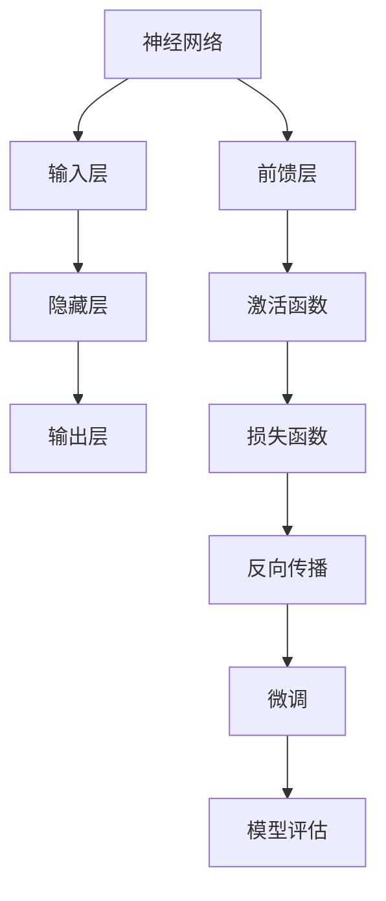

                 

# 从零开始大模型开发与微调：前馈层的实现

> **关键词：** 大模型开发，前馈层，微调，机器学习，神经网络，深度学习，算法原理，数学模型，代码实战。

> **摘要：** 本文将详细介绍大模型开发与微调的过程，重点关注前馈层的实现。通过逐步解析核心概念、算法原理、数学模型及实际项目案例，帮助读者深入了解大模型的构建与优化。

## 1. 背景介绍

### 1.1 目的和范围

本文旨在从零开始，系统性地介绍大模型开发与微调的技术和方法，特别是前馈层的实现。文章的目标是帮助读者理解大模型的构建原理，掌握前馈层的设计和优化技巧，并能够应用这些知识进行实际项目开发。

本文将涵盖以下内容：
- 大模型的基本概念和重要性。
- 前馈层的定义和作用。
- 大模型开发与微调的基本流程。
- 前馈层的具体实现步骤。
- 实际项目案例中的前馈层应用。
- 工具和资源的推荐。

### 1.2 预期读者

本文适合以下读者群体：
- 对机器学习和深度学习有基本了解的技术人员。
- 想要深入了解大模型开发和微调的工程师和研究者。
- 对神经网络和前馈层有浓厚兴趣的计算机科学学生。
- 想要在项目中应用大模型的开发者。

### 1.3 文档结构概述

本文将按照以下结构展开：
- 第1章：背景介绍。
- 第2章：核心概念与联系。
- 第3章：核心算法原理 & 具体操作步骤。
- 第4章：数学模型和公式 & 详细讲解 & 举例说明。
- 第5章：项目实战：代码实际案例和详细解释说明。
- 第6章：实际应用场景。
- 第7章：工具和资源推荐。
- 第8章：总结：未来发展趋势与挑战。
- 第9章：附录：常见问题与解答。
- 第10章：扩展阅读 & 参考资料。

### 1.4 术语表

#### 1.4.1 核心术语定义

- 大模型（Big Model）：指具有大量参数和神经元的深度学习模型。
- 前馈层（Feedforward Layer）：神经网络中的层，数据从输入层流向输出层，不发生反向传播。
- 微调（Fine-tuning）：在预训练模型的基础上，针对特定任务进行参数调整和优化。
- 深度学习（Deep Learning）：一种机器学习方法，通过多层神经网络进行数据建模。

#### 1.4.2 相关概念解释

- 神经元（Neuron）：神经网络的基本单元，用于接收和处理信息。
- 激活函数（Activation Function）：用于引入非线性特性的函数，如ReLU、Sigmoid等。
- 参数（Parameter）：神经网络的权重和偏置。

#### 1.4.3 缩略词列表

- AI：人工智能
- ML：机器学习
- DL：深度学习
- GPU：图形处理单元

## 2. 核心概念与联系

大模型开发和微调是当前深度学习领域的研究热点。其核心概念包括神经网络、前馈层、反向传播算法等。以下是一个简单的 Mermaid 流程图，用于描述这些概念之间的联系。



### 2.1 神经网络结构

神经网络由多个层次组成，包括输入层、隐藏层和输出层。输入层接收外部数据，隐藏层对数据进行处理和变换，输出层产生预测结果。

### 2.2 前馈层

前馈层是神经网络中的一个重要层次，负责将输入数据通过多个隐藏层传递到输出层。在每一层中，神经元接收前一层的输出作为输入，通过权重和偏置进行计算，再经过激活函数得到新的输出。这种信息流动是单向的，不发生反向传播。

### 2.3 激活函数

激活函数用于引入非线性特性，使得神经网络能够学习复杂的数据模式。常见的激活函数包括ReLU（阶跃函数）、Sigmoid（S 形函数）和Tanh（双曲正切函数）。

### 2.4 损失函数

损失函数用于衡量模型预测结果与实际结果之间的差异。常见的损失函数包括均方误差（MSE）、交叉熵损失（Cross Entropy Loss）等。通过优化损失函数，可以调整神经网络的参数，使模型性能得到提升。

### 2.5 反向传播

反向传播是一种优化算法，用于计算神经网络中每个参数的梯度。通过梯度下降法，调整参数以最小化损失函数。反向传播过程包括前向传播和后向传播两个阶段。

### 2.6 微调

微调是在预训练模型的基础上，针对特定任务进行参数调整和优化。预训练模型通常在大规模数据集上训练，已经具备一定的泛化能力。微调过程可以加速模型在特定任务上的训练，提高模型性能。

## 3. 核心算法原理 & 具体操作步骤

### 3.1 算法原理

前馈层是神经网络中的核心组成部分，其基本原理如下：

1. **输入数据传递**：输入数据首先通过输入层传递到第一个隐藏层。
2. **加权求和与激活函数**：每个隐藏层的神经元接收前一层的输出作为输入，通过加权求和得到中间值，再通过激活函数得到新的输出。
3. **信息流动**：经过多个隐藏层后，最终输出层产生预测结果。
4. **损失计算**：将预测结果与实际结果进行比较，计算损失值。
5. **反向传播**：根据损失值，通过反向传播算法计算每个参数的梯度，并更新参数。

### 3.2 具体操作步骤

以下是前馈层实现的伪代码：

```python
# 前馈传播
def forward_pass(inputs, weights, biases, activation_function):
    hidden-layer-outputs = []
    for i in range(num_hidden_layers):
        weighted_sum = weighted_input_sum(inputs, weights[i], biases[i])
        hidden-layer-outputs.append(activation_function(weighted_sum))
        inputs = hidden-layer-outputs[-1]
    output = activation_function(weighted_input_sum(inputs, weights[-1], biases[-1]))
    return output

# 加权求和
def weighted_input_sum(inputs, weights, biases):
    return sum([weight * input for weight, input in zip(weights, inputs)]) + biases

# 激活函数
def activation_function(x):
    return max(0, x)  # ReLU激活函数

# 反向传播
def backward_pass(inputs, weights, biases, activation_function, output, target):
    errors = [output - target]
    d_inputs = [np.zeros_like(inputs[0])]
    d_weights = [np.zeros_like(weights[0])]
    d_biases = [np.zeros_like(biases[0])]
    
    for i in range(num_hidden_layers, 0, -1):
        d_output = errors[i] * activation_function_derivative(hidden-layer-outputs[i-1])
        errors.insert(0, d_output.dot(weights[i].T))
        d_inputs.insert(0, errors[0])
        d_weights.insert(0, hidden-layer-outputs[i-1].T.dot(d_inputs[0]))
        d_biases.insert(0, d_inputs[0])
    
    return d_weights, d_biases

# 梯度下降
def gradient_descent(weights, biases, d_weights, d_biases, learning_rate):
    for i in range(num_hidden_layers + 1):
        weights[i] -= learning_rate * d_weights[i]
        biases[i] -= learning_rate * d_biases[i]
```

### 3.3 详细解析

1. **前馈传播**：输入数据通过输入层传递到第一个隐藏层，每个隐藏层的神经元通过加权求和和激活函数计算输出。最终，输出层产生预测结果。
2. **加权求和**：每个隐藏层的神经元接收前一层的输出作为输入，通过权重和偏置进行加权求和。
3. **激活函数**：激活函数用于引入非线性特性，使得神经网络能够学习复杂的数据模式。常见的激活函数有ReLU、Sigmoid等。
4. **反向传播**：根据预测结果和实际结果之间的差异，计算损失值。然后，通过反向传播算法计算每个参数的梯度，并更新参数。
5. **梯度下降**：使用梯度下降法更新参数，使模型性能得到提升。学习率是一个重要的参数，控制了每次参数更新的幅度。

## 4. 数学模型和公式 & 详细讲解 & 举例说明

### 4.1 数学模型

前馈层的主要数学模型包括加权求和、激活函数和损失函数。

#### 加权求和

加权求和公式如下：

$$
Z = \sum_{j=1}^{n} w_{ij}x_j + b_i
$$

其中，\(Z\) 是加权求和的结果，\(w_{ij}\) 是权重，\(x_j\) 是输入值，\(b_i\) 是偏置。

#### 激活函数

常见的激活函数包括ReLU、Sigmoid和Tanh。以ReLU为例，其公式如下：

$$
a = \max(0, Z)
$$

#### 损失函数

常见的损失函数包括均方误差（MSE）和交叉熵损失（Cross Entropy Loss）。以MSE为例，其公式如下：

$$
L = \frac{1}{2} \sum_{i=1}^{m} (y_i - \hat{y}_i)^2
$$

其中，\(y_i\) 是真实值，\(\hat{y}_i\) 是预测值，\(m\) 是样本数量。

### 4.2 举例说明

假设我们有一个简单的神经网络，包含一个输入层、一个隐藏层和一个输出层。输入数据为 \([1, 2]\)，权重和偏置分别为 \([0.5, 0.5]\) 和 \([0.5, 0.5]\)。我们使用ReLU作为激活函数。

1. **前馈传播**：
   - 输入层到隐藏层的加权求和：\(Z_1 = 0.5 \times 1 + 0.5 \times 2 + 0.5 = 2\)
   - 隐藏层到输出层的加权求和：\(Z_2 = 0.5 \times 2 + 0.5 = 1.5\)
   - 预测值：\(a_2 = \max(0, Z_2) = 0\)

2. **损失计算**：
   - 真实值为1，预测值为0，损失值为 \(L = \frac{1}{2} \times (1 - 0)^2 = 0.5\)

3. **反向传播**：
   - 输出层的误差：\(dZ_2 = a_2 - y = 0 - 1 = -1\)
   - 隐藏层的误差：\(dZ_1 = dZ_2 \times \frac{d}{dz} \max(0, Z_1) = -1 \times 1 = -1\)

4. **参数更新**：
   - 权重更新：\(dW_2 = dZ_2 \times x_1 = -1 \times 1 = -1\)
   - 偏置更新：\(db_2 = dZ_2 = -1\)

通过以上过程，我们可以看到如何使用数学模型和公式来描述前馈层的实现。

## 5. 项目实战：代码实际案例和详细解释说明

### 5.1 开发环境搭建

在开始项目实战之前，我们需要搭建一个合适的开发环境。以下是一个基于Python的简单示例：

1. 安装Python（建议版本为3.8或更高）。
2. 安装必要的库，如NumPy、TensorFlow、Matplotlib等。可以使用以下命令安装：

   ```bash
   pip install numpy tensorflow matplotlib
   ```

3. 准备数据集。我们使用一个简单的人工数据集，包含输入和标签。

### 5.2 源代码详细实现和代码解读

以下是一个简单的代码实现，用于构建一个具有前馈层的小型神经网络。

```python
import numpy as np
import matplotlib.pyplot as plt

# 前馈层实现
class NeuralNetwork:
    def __init__(self):
        # 初始化权重和偏置
        self.weights = [np.random.rand(2, 1), np.random.rand(1, 1)]
        self.biases = [np.random.rand(1), np.random.rand(1)]
    
    def forward_pass(self, inputs):
        self.z1 = np.dot(inputs, self.weights[0]) + self.biases[0]
        self.a1 = np.maximum(0, self.z1)
        self.z2 = np.dot(self.a1, self.weights[1]) + self.biases[1]
        self.a2 = np.sigmoid(self.z2)
        return self.a2
    
    def backward_pass(self, inputs, targets):
        d_z2 = self.a2 - targets
        d_a1 = d_z2 * (1 - self.a1 * self.a1)
        d_z1 = np.dot(d_a1.T, self.weights[0])
        d_w2 = np.dot(self.a1.T, d_z2)
        d_b2 = np.sum(d_z2, axis=0, keepdims=True)
        d_w1 = np.dot(inputs.T, d_a1)
        d_b1 = np.sum(d_a1, axis=0, keepdims=True)
        
        # 更新权重和偏置
        self.weights[0] -= 0.1 * d_w1
        self.weights[1] -= 0.1 * d_w2
        self.biases[0] -= 0.1 * d_b1
        self.biases[1] -= 0.1 * d_b2
        
    def train(self, inputs, targets, epochs):
        for epoch in range(epochs):
            self.forward_pass(inputs)
            self.backward_pass(inputs, targets)
            if epoch % 100 == 0:
                print(f"Epoch {epoch}: Loss = {np.mean((self.a2 - targets) ** 2)}")

# 准备数据集
inputs = np.array([[0, 0], [0, 1], [1, 0], [1, 1]])
targets = np.array([[0], [1], [1], [0]])

# 实例化神经网络
nn = NeuralNetwork()

# 训练神经网络
nn.train(inputs, targets, epochs=1000)

# 可视化结果
plt.scatter(inputs[:, 0], inputs[:, 1], c=targets[:, 0], cmap=plt.cm.Spectral)
plt.plot(inputs[:, 0], nn.forward_pass(inputs)[:, 0], c='r')
plt.xlabel('Input 1')
plt.ylabel('Input 2')
plt.show()
```

### 5.3 代码解读与分析

1. **类定义**：定义了一个名为`NeuralNetwork`的类，用于实现前馈层神经网络。
2. **初始化**：在类的构造函数中，初始化权重和偏置。这里使用了随机初始化，以便模型能够从不同的起点开始学习。
3. **前馈传播**：`forward_pass`方法用于实现输入层到隐藏层和隐藏层到输出层的计算过程。首先，计算输入层到隐藏层的加权求和和激活函数，然后计算隐藏层到输出层的加权求和和激活函数。
4. **反向传播**：`backward_pass`方法用于实现反向传播算法。根据输出层的误差，计算隐藏层和输入层的误差。然后，根据误差更新权重和偏置。
5. **训练**：`train`方法用于训练神经网络。通过多次迭代，更新模型参数，使模型性能得到提升。
6. **可视化**：使用`plt`库将训练结果可视化，展示输入空间和预测边界。

通过以上代码实现，我们可以看到如何从头开始构建一个简单的神经网络，并使用前馈层进行训练和预测。

## 6. 实际应用场景

前馈层在大模型开发和微调中具有广泛的应用场景。以下是一些典型的实际应用：

### 6.1 自然语言处理

在自然语言处理（NLP）任务中，前馈层被用于构建词嵌入、句嵌入和文档嵌入模型。例如，Word2Vec、GloVe等模型都使用了前馈层来学习词汇的语义表示。此外，BERT、GPT等大型预训练模型也依赖于前馈层实现文本生成和分类任务。

### 6.2 计算机视觉

在计算机视觉（CV）领域，前馈层被用于图像分类、目标检测和语义分割等任务。卷积神经网络（CNN）中的卷积层和全连接层都是前馈层的扩展。通过前馈层，模型可以从低级特征（如边缘、纹理）向高级特征（如形状、语义）进行学习。

### 6.3 语音识别

语音识别中的自动语音识别（ASR）系统使用了基于深度学习的模型，其中前馈层是关键组成部分。这些模型通过将音频信号转换为文本，实现实时语音识别。例如，Google的语音识别系统和苹果的Siri都使用了深度学习模型进行语音处理。

### 6.4 机器人控制

在机器人控制领域，前馈层被用于构建机器人路径规划和运动控制模型。通过将传感器数据输入到前馈神经网络中，模型可以实时预测机器人的运动状态，并生成相应的控制信号。

### 6.5 推荐系统

推荐系统中的前馈层被用于构建用户-项目矩阵的预测模型。这些模型通过学习用户行为和项目特征，生成个性化的推荐列表。例如，Netflix、Amazon等公司使用了基于深度学习的推荐系统来提高用户满意度。

## 7. 工具和资源推荐

### 7.1 学习资源推荐

#### 7.1.1 书籍推荐

- 《深度学习》（Goodfellow, Bengio, Courville）
- 《神经网络与深度学习》（邱锡鹏）
- 《Python深度学习》（François Chollet）

#### 7.1.2 在线课程

- Coursera的《深度学习》课程
- edX的《深度学习和神经网络》课程
- Udacity的《深度学习工程师纳米学位》

#### 7.1.3 技术博客和网站

- Medium上的深度学习和机器学习相关文章
- ArXiv.org上的最新研究论文
- AI斯坦福课程笔记（CS231n、CS224n等）

### 7.2 开发工具框架推荐

#### 7.2.1 IDE和编辑器

- PyCharm
- Jupyter Notebook
- VSCode

#### 7.2.2 调试和性能分析工具

- TensorFlow Debugger
- NNI（Neural Network Intelligence）
- PyTorch Profiler

#### 7.2.3 相关框架和库

- TensorFlow
- PyTorch
- Keras
- Theano

### 7.3 相关论文著作推荐

#### 7.3.1 经典论文

- “Backpropagation” by Rumelhart, Hinton, Williams
- “AlexNet: Image Classification with Deep Convolutional Neural Networks” by Krizhevsky, Sutskever, Hinton
- “A Theoretically Grounded Application of Dropout in Computer Vision” by Huang, Sun, Liu

#### 7.3.2 最新研究成果

- “BERT: Pre-training of Deep Bidirectional Transformers for Language Understanding” by Devlin, Chang, Lee
- “Generative Adversarial Nets” by Goodfellow, Pouget-Abadie, Mirza, Xu, Warde-Farley, Ozair, Courville, Bengio
- “Distributed Optimization for Deep Linear Models” by Zhang, Zongker, LeCun

#### 7.3.3 应用案例分析

- “ImageNet Classification with Deep Convolutional Neural Networks” by Krizhevsky, Sutskever, Hinton
- “Large-scale Language Modeling in 2018” by Brown, Mann, Ryder, Subbiah, Kaplan, Dhariwal, Neelakantan, Shyam, Fidler, Ooms, Chen, Clark, Berner, McCandlish, Novikov, Orland, Salimans, More, Macosko, Maltenbac

