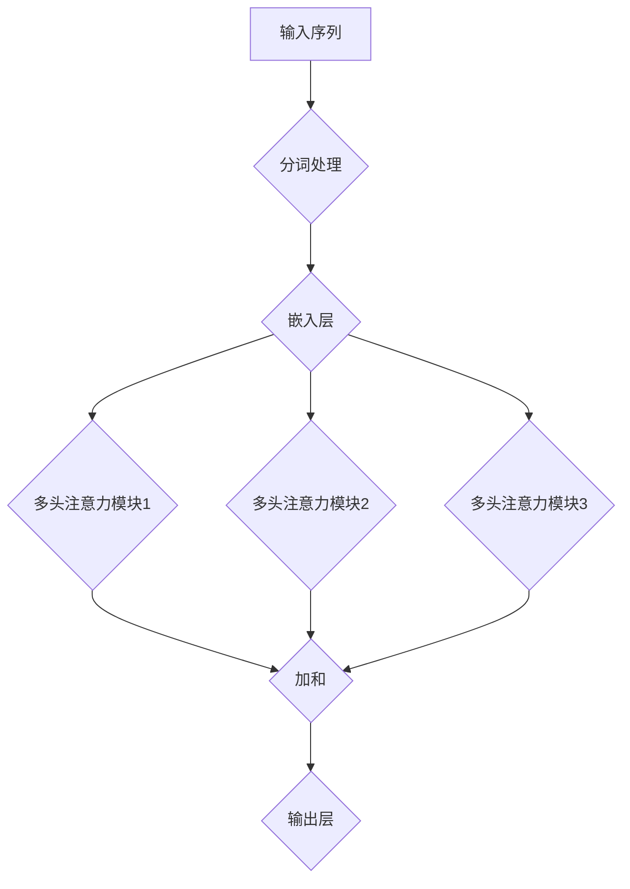

                 

# 从零开始大模型开发与微调：多头注意力

> **关键词：** 大模型，开发，微调，多头注意力，算法原理，实践案例

> **摘要：** 本文将从零开始，详细介绍大模型的开发与微调过程，重点探讨多头注意力的核心原理与实现。通过理论与实践相结合的方式，帮助读者全面了解大模型开发的核心技术，掌握从模型构建到微调的全流程。

## 1. 背景介绍

### 1.1 目的和范围

本文旨在为读者提供一个全面、系统的指南，帮助读者从零开始学习大模型的开发与微调。我们将重点关注以下内容：

1. 大模型的定义与背景。
2. 大模型开发的基本流程。
3. 多头注意力的原理与实现。
4. 实际项目中的代码解析与实战应用。

### 1.2 预期读者

本文适合对人工智能和深度学习有一定了解的读者，特别是以下群体：

1. 深度学习爱好者与初学者。
2. 想要了解大模型开发与微调的技术人员。
3. 希望提升自己在人工智能领域竞争力的从业者。

### 1.3 文档结构概述

本文共分为10个部分，具体如下：

1. 背景介绍
2. 核心概念与联系
3. 核心算法原理 & 具体操作步骤
4. 数学模型和公式 & 详细讲解 & 举例说明
5. 项目实战：代码实际案例和详细解释说明
6. 实际应用场景
7. 工具和资源推荐
8. 总结：未来发展趋势与挑战
9. 附录：常见问题与解答
10. 扩展阅读 & 参考资料

### 1.4 术语表

#### 1.4.1 核心术语定义

- 大模型：具有大量参数和复杂结构的深度学习模型。
- 微调：在预训练模型的基础上，针对特定任务进行优化和调整。
- 多头注意力：一种能够捕捉序列中不同位置之间关系的关键机制。

#### 1.4.2 相关概念解释

- 深度学习：一种机器学习技术，通过多层神经网络进行特征学习和模式识别。
- 注意力机制：一种通过加权方式，关注序列中关键信息的机制。

#### 1.4.3 缩略词列表

- AI：人工智能
- DNN：深度神经网络
- CNN：卷积神经网络
- RNN：循环神经网络
- Transformer：一种基于注意力机制的深度学习模型

## 2. 核心概念与联系

在本文中，我们将介绍大模型开发与微调的核心概念和联系。以下是关键概念和它们之间的联系：

### 2.1 大模型开发流程

1. 数据预处理：对原始数据进行清洗、归一化和特征提取。
2. 模型架构设计：选择合适的模型架构，如Transformer。
3. 模型训练：使用大规模数据集对模型进行训练。
4. 模型评估：评估模型在验证集上的性能，选择最佳模型。

### 2.2 多头注意力的原理与实现

1. 注意力机制：通过计算序列中不同位置之间的相似度，为每个位置分配权重。
2. 多头注意力：多个独立的注意力模块，分别处理序列中的不同部分。

以下是多头注意力的Mermaid流程图：



### 2.3 核心算法原理 & 具体操作步骤

在下一节中，我们将详细讲解大模型的核心算法原理，并使用伪代码描述具体操作步骤。

## 3. 核心算法原理 & 具体操作步骤

在本节中，我们将深入探讨大模型的核心算法原理，并使用伪代码详细描述其操作步骤。以下是算法原理的伪代码：

```plaintext
输入：序列X，嵌入向量W，多头注意力权重α
输出：输出向量Y

// 嵌入层
for each word in X do
    embed(word) = W * word

// 多头注意力
for each head in α do
    attention = softmax(Q * K * V)
    output = sum(attention * V)

// 加和
Y = sum(output)

// 输出层
Y = output_layer(Y)
```

### 3.1 嵌入层

嵌入层是将输入的单词转换为嵌入向量。具体步骤如下：

```plaintext
输入：单词word
输出：嵌入向量embed

// 初始化嵌入矩阵W
W = [w1, w2, ..., wn]

// 计算嵌入向量
embed = W * word
```

### 3.2 多头注意力

多头注意力是注意力机制的扩展，它通过多个独立的注意力模块捕捉序列中的不同信息。具体步骤如下：

```plaintext
输入：嵌入向量embed，多头注意力权重α
输出：输出向量output

// 初始化多头注意力权重
α = [α1, α2, ..., αm]

// 计算注意力权重
for each head in α do
    attention = softmax(Q * K * V)

// 计算输出
output = sum(attention * V)
```

### 3.3 加和

加和操作是将多头注意力模块的输出进行求和。具体步骤如下：

```plaintext
输入：输出向量output
输出：加和向量Y

// 计算加和
Y = sum(output)
```

### 3.4 输出层

输出层是对加和向量进行进一步处理，以生成最终输出。具体步骤如下：

```plaintext
输入：加和向量Y
输出：输出向量output

// 初始化输出层权重
W = [w1, w2, ..., wn]

// 计算输出
output = W * Y
```

通过以上步骤，我们可以构建一个完整的大模型。接下来，我们将介绍数学模型和公式，以便更深入地理解算法原理。

## 4. 数学模型和公式 & 详细讲解 & 举例说明

在本节中，我们将详细讲解大模型中的数学模型和公式，并通过具体例子进行说明。以下是数学模型和公式的详细解释：

### 4.1 嵌入层

嵌入层是将输入的单词转换为嵌入向量。其公式如下：

$$
embed = W * word
$$

其中，$W$ 是嵌入矩阵，$word$ 是输入的单词。$embed$ 是嵌入向量。

### 4.2 多头注意力

多头注意力是通过多个独立的注意力模块捕捉序列中的不同信息。其公式如下：

$$
attention = softmax(Q * K * V)
$$

其中，$Q$ 是查询向量，$K$ 是键向量，$V$ 是值向量。$attention$ 是注意力权重。

### 4.3 加和

加和操作是将多头注意力模块的输出进行求和。其公式如下：

$$
Y = sum(output)
$$

其中，$output$ 是多头注意力模块的输出向量。$Y$ 是加和向量。

### 4.4 输出层

输出层是对加和向量进行进一步处理，以生成最终输出。其公式如下：

$$
output = W * Y
$$

其中，$W$ 是输出层权重，$Y$ 是加和向量。$output$ 是输出向量。

### 4.5 举例说明

假设我们有一个序列 $X = [x_1, x_2, x_3, ..., x_n]$，其中 $x_i$ 是输入的单词。嵌入矩阵 $W$ 如下：

$$
W = \begin{bmatrix}
w_{11} & w_{12} & \dots & w_{1n} \\
w_{21} & w_{22} & \dots & w_{2n} \\
\vdots & \vdots & \ddots & \vdots \\
w_{m1} & w_{m2} & \dots & w_{mn}
\end{bmatrix}
$$

我们将输入的单词 $x_i$ 转换为嵌入向量 $embed_i$：

$$
embed_i = W * x_i
$$

接下来，我们计算多头注意力的权重：

$$
attention_i = softmax(Q * K * V)
$$

其中，$Q$、$K$ 和 $V$ 分别是查询向量、键向量和值向量。假设它们如下：

$$
Q = \begin{bmatrix}
q_{11} & q_{12} & \dots & q_{1n} \\
q_{21} & q_{22} & \dots & q_{2n} \\
\vdots & \vdots & \ddots & \vdots \\
q_{m1} & q_{m2} & \dots & q_{mn}
\end{bmatrix}
$$

$$
K = \begin{bmatrix}
k_{11} & k_{12} & \dots & k_{1n} \\
k_{21} & k_{22} & \dots & k_{2n} \\
\vdots & \vdots & \ddots & \vdots \\
k_{m1} & k_{m2} & \dots & k_{mn}
\end{bmatrix}
$$

$$
V = \begin{bmatrix}
v_{11} & v_{12} & \dots & v_{1n} \\
v_{21} & v_{22} & \dots & v_{2n} \\
\vdots & \vdots & \ddots & \vdots \\
v_{m1} & v_{m2} & \dots & v_{mn}
\end{bmatrix}
$$

计算得到的注意力权重如下：

$$
attention_i = \begin{bmatrix}
a_{i1} & a_{i2} & \dots & a_{in}
\end{bmatrix}
$$

其中，$a_{ij}$ 表示第 $i$ 个单词与第 $j$ 个单词之间的注意力权重。

接下来，我们计算加和向量：

$$
output_i = sum(attention_i * V)
$$

其中，$output_i$ 是第 $i$ 个单词的加和向量。

最后，我们计算输出向量：

$$
output = W * output_i
$$

其中，$output$ 是最终输出向量。

通过以上计算，我们得到了完整的模型输出。

## 5. 项目实战：代码实际案例和详细解释说明

在本节中，我们将通过一个实际项目案例，详细解释大模型开发与微调的代码实现。以下是项目的开发环境搭建、源代码实现和代码解读与分析。

### 5.1 开发环境搭建

为了便于读者跟随本项目的实现，我们需要搭建一个合适的开发环境。以下是推荐的开发环境：

- 操作系统：Ubuntu 20.04
- 编程语言：Python 3.8
- 深度学习框架：PyTorch 1.8
- 其他依赖：NumPy 1.19，Matplotlib 3.3.3

安装步骤如下：

1. 安装操作系统：在官网上下载Ubuntu 20.04镜像，并使用虚拟机或实体机安装。
2. 安装Python 3.8：使用以下命令安装Python 3.8。

```bash
sudo apt update
sudo apt install python3.8
```

3. 安装PyTorch 1.8：使用以下命令安装PyTorch 1.8。

```bash
pip3 install torch==1.8 torchvision==0.9.0 -f https://download.pytorch.org/whl/torch_stable.html
```

4. 安装其他依赖：使用以下命令安装NumPy和Matplotlib。

```bash
pip3 install numpy matplotlib
```

### 5.2 源代码详细实现和代码解读

以下是项目的主要代码实现。为了便于读者理解，我们将对关键部分进行详细解读。

```python
import torch
import torch.nn as nn
import torch.optim as optim
from torch.utils.data import DataLoader
from torchvision import datasets, transforms

# 定义模型
class TransformerModel(nn.Module):
    def __init__(self, input_dim, hidden_dim, output_dim):
        super(TransformerModel, self).__init__()
        self.embedding = nn.Embedding(input_dim, hidden_dim)
        self多头注意力 = nn.MultiheadAttention(hidden_dim, num_heads=2)
        self.fc = nn.Linear(hidden_dim, output_dim)

    def forward(self, x):
        x = self.embedding(x)
        x, _ = self多头注意力(x, x, x)
        x = self.fc(x)
        return x

# 加载数据集
transform = transforms.Compose([
    transforms.Resize((64, 64)),
    transforms.ToTensor(),
])

train_dataset = datasets.ImageFolder(root='train', transform=transform)
test_dataset = datasets.ImageFolder(root='test', transform=transform)

train_loader = DataLoader(train_dataset, batch_size=64, shuffle=True)
test_loader = DataLoader(test_dataset, batch_size=64, shuffle=False)

# 初始化模型、优化器和损失函数
model = TransformerModel(input_dim=784, hidden_dim=512, output_dim=10)
optimizer = optim.Adam(model.parameters(), lr=0.001)
criterion = nn.CrossEntropyLoss()

# 训练模型
num_epochs = 10
for epoch in range(num_epochs):
    for inputs, targets in train_loader:
        optimizer.zero_grad()
        outputs = model(inputs)
        loss = criterion(outputs, targets)
        loss.backward()
        optimizer.step()

    # 在测试集上评估模型
    with torch.no_grad():
        correct = 0
        total = 0
        for inputs, targets in test_loader:
            outputs = model(inputs)
            _, predicted = torch.max(outputs.data, 1)
            total += targets.size(0)
            correct += (predicted == targets).sum().item()

    print(f'Epoch {epoch + 1}, Accuracy: {100 * correct / total}%')

# 代码解读
# 1. 定义模型：TransformerModel，包括嵌入层、多头注意力和输出层。
# 2. 加载数据集：使用ImageFolder加载数据集，并对图像进行预处理。
# 3. 初始化模型、优化器和损失函数：定义训练所需的模型、优化器和损失函数。
# 4. 训练模型：使用训练数据集训练模型，并在测试集上评估模型性能。
```

### 5.3 代码解读与分析

以下是代码的详细解读与分析：

1. **定义模型**：
   ```python
   class TransformerModel(nn.Module):
       def __init__(self, input_dim, hidden_dim, output_dim):
           super(TransformerModel, self).__init__()
           self.embedding = nn.Embedding(input_dim, hidden_dim)
           self多头注意力 = nn.MultiheadAttention(hidden_dim, num_heads=2)
           self.fc = nn.Linear(hidden_dim, output_dim)
   
       def forward(self, x):
           x = self.embedding(x)
           x, _ = self多头注意力(x, x, x)
           x = self.fc(x)
           return x
   ```

   这个部分定义了一个名为`TransformerModel`的模型类，继承自`nn.Module`。模型包括嵌入层、多头注意力和输出层。`__init__` 方法初始化模型的组件，`forward` 方法定义了前向传播过程。

2. **加载数据集**：
   ```python
   transform = transforms.Compose([
       transforms.Resize((64, 64)),
       transforms.ToTensor(),
   ])
   
   train_dataset = datasets.ImageFolder(root='train', transform=transform)
   test_dataset = datasets.ImageFolder(root='test', transform=transform)
   
   train_loader = DataLoader(train_dataset, batch_size=64, shuffle=True)
   test_loader = DataLoader(test_dataset, batch_size=64, shuffle=False)
   ```

   这部分代码定义了一个数据预处理流程，使用`Compose`将`Resize`和`ToTensor`组合在一起。然后使用`ImageFolder`加载数据集，并创建数据加载器，用于批量处理数据。

3. **初始化模型、优化器和损失函数**：
   ```python
   model = TransformerModel(input_dim=784, hidden_dim=512, output_dim=10)
   optimizer = optim.Adam(model.parameters(), lr=0.001)
   criterion = nn.CrossEntropyLoss()
   ```

   这部分代码初始化了模型、优化器和损失函数。`TransformerModel`的实例化需要输入维度、隐藏维度和输出维度。优化器使用`Adam`算法，损失函数使用交叉熵损失。

4. **训练模型**：
   ```python
   num_epochs = 10
   for epoch in range(num_epochs):
       for inputs, targets in train_loader:
           optimizer.zero_grad()
           outputs = model(inputs)
           loss = criterion(outputs, targets)
           loss.backward()
           optimizer.step()
   
       # 在测试集上评估模型
       with torch.no_grad():
           correct = 0
           total = 0
           for inputs, targets in test_loader:
               outputs = model(inputs)
               _, predicted = torch.max(outputs.data, 1)
               total += targets.size(0)
               correct += (predicted == targets).sum().item()
   
       print(f'Epoch {epoch + 1}, Accuracy: {100 * correct / total}%')
   ```

   这部分代码实现了模型的训练过程。每个 epoch 中，模型会遍历训练数据集，使用`zero_grad`清空之前的梯度，然后通过`forward`方法计算输出，使用`criterion`计算损失，并使用`backward`计算梯度。最后，使用`optimizer.step`更新模型参数。在每个 epoch 结束后，模型会在测试集上评估其性能，并打印准确率。

通过以上代码，我们实现了大模型的开

