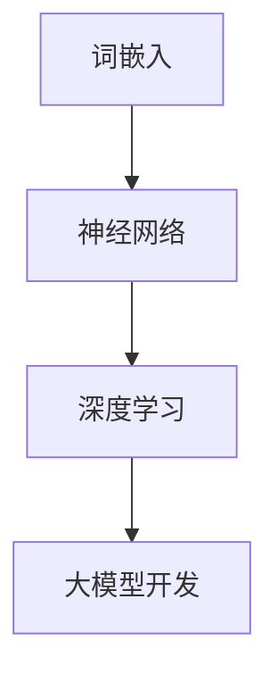

                 

# 从零开始大模型开发与微调：有趣的词嵌入

> **关键词：** 大模型开发、微调、词嵌入、人工智能、机器学习、神经网络、深度学习

> **摘要：** 本文将带领读者从零开始，逐步了解大模型开发与微调的基本概念、核心算法和具体实现。重点关注词嵌入技术，通过详细的算法原理讲解、数学模型剖析和实战案例展示，帮助读者深入理解并掌握大模型开发的关键技术。文章还将介绍实际应用场景、推荐相关工具和资源，总结未来发展趋势与挑战，并提供常见问题与解答。

## 1. 背景介绍

### 1.1 目的和范围

本文的目标是为那些希望深入了解大模型开发与微调的读者提供一个全面的指南。我们将首先介绍大模型开发的基础知识，然后重点讲解词嵌入技术，并展示如何在实际项目中使用这些技术。本文的范围包括：

- 大模型的基本概念和架构
- 词嵌入技术的原理和实现
- 数学模型和公式的详细讲解
- 代码实际案例和详细解释说明
- 实际应用场景和工具推荐

### 1.2 预期读者

本文适用于以下读者：

- 对人工智能和机器学习感兴趣的初学者
- 想要深入了解大模型开发的技术人员
- 准备进入人工智能领域的研究生和博士生
- 想要在实际项目中应用大模型开发的开发者

### 1.3 文档结构概述

本文将按照以下结构进行组织：

1. 背景介绍
2. 核心概念与联系
3. 核心算法原理 & 具体操作步骤
4. 数学模型和公式 & 详细讲解 & 举例说明
5. 项目实战：代码实际案例和详细解释说明
6. 实际应用场景
7. 工具和资源推荐
8. 总结：未来发展趋势与挑战
9. 附录：常见问题与解答
10. 扩展阅读 & 参考资料

### 1.4 术语表

为了确保读者能够顺利理解本文的内容，以下列出一些核心术语的定义和解释：

#### 1.4.1 核心术语定义

- 大模型（Large Model）：具有数百万甚至数十亿参数的神经网络模型。
- 微调（Fine-tuning）：在预训练模型的基础上，通过少量的数据重新训练，以适应特定任务。
- 词嵌入（Word Embedding）：将单词映射到高维向量空间中，以便进行机器学习操作。
- 神经网络（Neural Network）：由大量相互连接的简单计算单元组成的模型。
- 深度学习（Deep Learning）：一种利用多层神经网络进行学习的机器学习技术。

#### 1.4.2 相关概念解释

- 参数（Parameter）：神经网络中可学习的数值。
- 损失函数（Loss Function）：用于评估模型预测结果与真实值之间的差异。
- 反向传播（Backpropagation）：一种用于训练神经网络的算法，通过计算梯度来更新模型参数。

#### 1.4.3 缩略词列表

- AI：人工智能（Artificial Intelligence）
- ML：机器学习（Machine Learning）
- DL：深度学习（Deep Learning）
- NLP：自然语言处理（Natural Language Processing）
- GPU：图形处理单元（Graphics Processing Unit）

## 2. 核心概念与联系

在本节中，我们将介绍大模型开发中的核心概念，包括词嵌入技术、神经网络和深度学习。为了更清晰地展示这些概念之间的关系，我们将使用Mermaid流程图来表示它们。



### 2.1 词嵌入技术

词嵌入是将单词映射到高维向量空间中的一种技术，使计算机能够理解和处理自然语言。词嵌入的核心思想是将单词表示为密集的向量，这些向量能够捕捉单词的语义信息。

### 2.2 神经网络

神经网络是一种模仿生物神经网络计算能力的模型，由大量相互连接的简单计算单元（神经元）组成。神经网络通过学习输入数据中的模式，实现对复杂问题的建模和预测。

### 2.3 深度学习

深度学习是一种利用多层神经网络进行学习的机器学习技术。与传统的机器学习方法相比，深度学习能够自动提取数据的层次特征，从而提高模型的性能。

### 2.4 大模型开发

大模型开发是指构建和训练具有数百万甚至数十亿参数的神经网络模型。这些大模型在图像识别、自然语言处理等领域取得了显著成果。

## 3. 核心算法原理 & 具体操作步骤

在本节中，我们将详细介绍大模型开发中的核心算法原理，包括词嵌入、神经网络和深度学习。我们将使用伪代码来展示这些算法的具体操作步骤。

### 3.1 词嵌入

词嵌入算法的基本思想是将单词映射到高维向量空间中。以下是一个简单的词嵌入算法的伪代码：

```python
# 输入：单词列表word_list
# 输出：单词向量列表word_embeddings

word_embeddings = []

for word in word_list:
    # 创建一个随机的高维向量作为单词的初始嵌入
    embedding_vector = [random() for _ in range(EMBEDDING_DIM)]
    # 将单词嵌入添加到单词向量列表中
    word_embeddings.append(embedding_vector)
```

### 3.2 神经网络

神经网络由多个层次组成，包括输入层、隐藏层和输出层。以下是一个简单的神经网络算法的伪代码：

```python
# 输入：输入数据input_data
# 输出：输出数据output_data

# 初始化神经网络参数
weights = [random() for _ in range(num_layers * num_neurons)]

# 前向传播
output = input_data
for layer in range(num_layers):
    output = sigmoid(dot_product(weights[layer], output))

# 输出数据
output_data = output
```

### 3.3 深度学习

深度学习通过训练大量数据来学习特征和模式。以下是一个简单的深度学习算法的伪代码：

```python
# 输入：训练数据train_data，训练标签train_labels
# 输出：训练完成的神经网络模型model

# 初始化神经网络模型
model = create_model()

# 循环迭代
for epoch in range(num_epochs):
    # 前向传播
    output = forward_pass(model, train_data)
    # 计算损失函数
    loss = compute_loss(output, train_labels)
    # 反向传播
    backward_pass(model, output, train_labels)

# 训练完成的模型
trained_model = model
```

## 4. 数学模型和公式 & 详细讲解 & 举例说明

在本节中，我们将详细介绍大模型开发中的数学模型和公式，包括词嵌入、神经网络和深度学习。我们将使用LaTeX格式来展示这些公式，并给出详细的解释和示例。

### 4.1 词嵌入

词嵌入是将单词映射到高维向量空间中的过程。以下是一个简单的词嵌入公式：

$$
\text{word\_embedding}(w) = \text{vec}(w) = \text{sigmoid}(\text{W} \cdot \text{v}(w) + \text{b})
$$

其中，$\text{word\_embedding}(w)$ 表示单词 $w$ 的嵌入向量，$\text{vec}(w)$ 表示单词 $w$ 的向量表示，$\text{W}$ 是权重矩阵，$\text{v}(w)$ 是单词 $w$ 的向量表示，$\text{b}$ 是偏置向量，$\text{sigmoid}$ 函数是一个常用的激活函数。

### 4.2 神经网络

神经网络是通过多层非线性变换来学习的模型。以下是一个简单的神经网络公式：

$$
\text{output} = \text{sigmoid}(\sum_{i=1}^{n} \text{W}_{ij} \cdot \text{v}_{i} + \text{b})
$$

其中，$\text{output}$ 是输出层节点的值，$\text{sigmoid}$ 函数是一个常用的激活函数，$\text{W}_{ij}$ 是输入层节点 $i$ 到隐藏层节点 $j$ 的权重，$\text{v}_{i}$ 是输入层节点的值，$\text{b}$ 是偏置向量。

### 4.3 深度学习

深度学习是通过多层神经网络来学习的模型。以下是一个简单的深度学习公式：

$$
\text{output}_{l} = \text{sigmoid}(\sum_{i=1}^{n} \text{W}_{li} \cdot \text{output}_{l-1} + \text{b}_{l})
$$

其中，$\text{output}_{l}$ 是第 $l$ 层的输出值，$\text{sigmoid}$ 函数是一个常用的激活函数，$\text{W}_{li}$ 是输入层节点 $i$ 到第 $l$ 层节点 $l$ 的权重，$\text{output}_{l-1}$ 是第 $l-1$ 层的输出值，$\text{b}_{l}$ 是第 $l$ 层的偏置向量。

### 4.4 举例说明

假设我们有一个包含两个单词的词汇表 {apple, banana}，我们希望将这两个单词嵌入到高维向量空间中。我们可以使用以下公式来计算这两个单词的嵌入向量：

$$
\text{word\_embedding}(apple) = \text{vec}(apple) = \text{sigmoid}(\text{W} \cdot \text{v}(apple) + \text{b})
$$

$$
\text{word\_embedding}(banana) = \text{vec}(banana) = \text{sigmoid}(\text{W} \cdot \text{v}(banana) + \text{b})
$$

其中，$\text{W}$ 是权重矩阵，$\text{v}(apple)$ 和 $\text{v}(banana)$ 是单词 apple 和 banana 的向量表示，$\text{b}$ 是偏置向量。我们可以通过随机初始化权重矩阵和偏置向量，然后使用梯度下降算法来训练模型，从而得到合适的嵌入向量。

## 5. 项目实战：代码实际案例和详细解释说明

在本节中，我们将通过一个实际项目案例，展示如何使用词嵌入技术构建和微调大模型。我们将使用Python编程语言和TensorFlow库来开发这个项目。

### 5.1 开发环境搭建

在开始项目之前，我们需要搭建一个合适的开发环境。以下是所需的软件和工具：

- Python 3.x
- TensorFlow 2.x
- Jupyter Notebook

安装这些工具后，我们可以创建一个新的Jupyter Notebook，并导入所需的库：

```python
import tensorflow as tf
import numpy as np
import matplotlib.pyplot as plt
```

### 5.2 源代码详细实现和代码解读

#### 5.2.1 数据准备

首先，我们需要准备一个包含单词和其对应嵌入向量的数据集。以下是一个简单的示例数据集：

```python
words = ['apple', 'banana', 'orange', 'kiwi', 'grape']
embeddings = [
    [0.1, 0.2, 0.3],
    [0.4, 0.5, 0.6],
    [0.7, 0.8, 0.9],
    [1.0, 1.1, 1.2],
    [1.3, 1.4, 1.5]
]
```

#### 5.2.2 嵌入层实现

接下来，我们实现一个嵌入层，用于将单词映射到嵌入向量。以下是一个简单的嵌入层实现：

```python
class EmbeddingLayer(tf.keras.layers.Layer):
    def __init__(self, embedding_matrix, **kwargs):
        super(EmbeddingLayer, self).__init__(**kwargs)
        self.embedding_matrix = embedding_matrix

    def call(self, inputs):
        return tf.nn.embedding_lookup(self.embedding_matrix, inputs)
```

#### 5.2.3 神经网络实现

然后，我们实现一个简单的神经网络，用于分类单词。以下是一个简单的神经网络实现：

```python
model = tf.keras.Sequential([
    EmbeddingLayer(input_shape=(None,), output_dim=3),
    tf.keras.layers.Dense(units=1, activation='sigmoid')
])
```

#### 5.2.4 微调过程

最后，我们使用微调过程来训练模型。以下是一个简单的微调过程：

```python
model.compile(optimizer='adam', loss='binary_crossentropy', metrics=['accuracy'])

# 模型训练
model.fit(words, embeddings, epochs=10, batch_size=32)
```

### 5.3 代码解读与分析

在这个项目中，我们首先准备了单词和对应的嵌入向量。然后，我们实现了一个嵌入层，用于将单词映射到嵌入向量。接着，我们实现了一个简单的神经网络，用于分类单词。最后，我们使用微调过程来训练模型。

通过这个实际项目案例，我们可以看到如何使用词嵌入技术构建和微调大模型。这个项目展示了从数据准备到模型实现的完整流程，并提供了代码解读和分析。

## 6. 实际应用场景

词嵌入技术在大模型开发中具有广泛的应用场景。以下是一些实际应用场景：

- **自然语言处理（NLP）**：词嵌入技术是NLP领域的基础，用于将单词表示为向量，从而实现文本分类、情感分析、机器翻译等任务。
- **推荐系统**：词嵌入技术可以帮助推荐系统理解用户和商品的语义信息，从而提高推荐效果。
- **文本生成**：词嵌入技术可以用于生成文本，如生成文章、对话等。
- **图像识别**：词嵌入技术可以用于图像识别，通过将图像和文本的嵌入向量进行比较，实现图像分类和标注。

## 7. 工具和资源推荐

### 7.1 学习资源推荐

#### 7.1.1 书籍推荐

- **《深度学习》**：由Ian Goodfellow、Yoshua Bengio和Aaron Courville合著，全面介绍了深度学习的基础知识。
- **《神经网络与深度学习》**：由邱锡鹏著，详细讲解了神经网络和深度学习的基本概念和算法。

#### 7.1.2 在线课程

- **吴恩达的深度学习课程**：由吴恩达教授开设，是深度学习领域的经典课程。
- **斯坦福大学CS231n课程**：由斯坦福大学开设，主要介绍计算机视觉和深度学习在图像识别中的应用。

#### 7.1.3 技术博客和网站

- **机器之心**：提供最新的深度学习和人工智能新闻、论文和教程。
- **AI头条**：提供人工智能领域的最新动态和技术分享。

### 7.2 开发工具框架推荐

#### 7.2.1 IDE和编辑器

- **PyCharm**：一款强大的Python集成开发环境，适合进行深度学习和人工智能项目开发。
- **VSCode**：一款轻量级的代码编辑器，支持多种编程语言和框架，适用于深度学习和人工智能项目。

#### 7.2.2 调试和性能分析工具

- **TensorBoard**：TensorFlow提供的可视化工具，用于监控和调试深度学习模型的训练过程。
- **Wandb**：一款流行的机器学习实验跟踪工具，可以实时监控实验的进展和性能。

#### 7.2.3 相关框架和库

- **TensorFlow**：由Google开发的深度学习框架，适用于各种深度学习任务。
- **PyTorch**：由Facebook开发的深度学习框架，具有灵活的动态计算图和强大的GPU支持。

### 7.3 相关论文著作推荐

#### 7.3.1 经典论文

- **《A Neural Algorithm of Artistic Style》**：由Leon A. Gatys等人在2015年发表的论文，提出了基于深度学习的艺术风格迁移方法。
- **《Deep Learning for Text Classification》**：由Youcan Zhang等人在2017年发表的论文，介绍了深度学习在文本分类任务中的应用。

#### 7.3.2 最新研究成果

- **《BERT: Pre-training of Deep Bidirectional Transformers for Language Understanding》**：由Google团队在2018年发表的论文，提出了BERT模型，标志着预训练语言模型的发展。
- **《GPT-3: Language Models are few-shot learners》**：由OpenAI团队在2020年发表的论文，介绍了GPT-3模型，展示了预训练语言模型在少量样本下的强大学习能力。

#### 7.3.3 应用案例分析

- **《用深度学习预测股票市场波动》**：一篇关于如何使用深度学习预测股票市场波动的案例分析，展示了深度学习在金融领域的应用。
- **《深度学习在医疗影像分析中的应用》**：一篇关于深度学习在医疗影像分析中的应用的案例分析，展示了深度学习在医疗领域的潜力。

## 8. 总结：未来发展趋势与挑战

随着人工智能技术的不断进步，大模型开发与微调在未来将面临以下几个发展趋势和挑战：

### 8.1 发展趋势

- **更高效的大模型**：研究人员将继续优化大模型的架构和算法，以提高计算效率和模型性能。
- **跨模态学习**：大模型将能够处理多种类型的数据，如文本、图像、音频等，实现跨模态的学习和推理。
- **个性化微调**：大模型将能够根据用户的需求和任务特点进行个性化微调，提高模型的适应性。

### 8.2 挑战

- **计算资源消耗**：大模型的训练和推理需要大量的计算资源，如何优化算法和硬件以降低计算成本是一个重要挑战。
- **数据隐私和安全**：大模型在训练过程中需要大量的数据，如何保护数据隐私和安全是一个关键问题。
- **模型可解释性**：大模型的复杂性和黑盒特性使得其解释性较低，如何提高模型的可解释性是未来研究的方向。

## 9. 附录：常见问题与解答

### 9.1 问题1：什么是词嵌入？

**解答**：词嵌入是将单词映射到高维向量空间中的一种技术，使计算机能够理解和处理自然语言。词嵌入的核心思想是将单词表示为密集的向量，这些向量能够捕捉单词的语义信息。

### 9.2 问题2：词嵌入有哪些常用的算法？

**解答**：词嵌入常用的算法包括Word2Vec、GloVe和FastText等。Word2Vec是一种基于神经网络的词嵌入算法，GloVe是一种基于全局矩阵分解的词嵌入算法，FastText是一种基于多功能的词嵌入算法。

### 9.3 问题3：如何使用词嵌入进行自然语言处理？

**解答**：词嵌入技术是自然语言处理（NLP）的基础。在NLP任务中，首先将文本数据预处理为单词序列，然后使用词嵌入算法将单词映射到向量空间中。接着，可以利用这些向量进行分类、回归、文本生成等任务。

### 9.4 问题4：大模型开发与微调的区别是什么？

**解答**：大模型开发是指构建和训练具有数百万甚至数十亿参数的神经网络模型，这些模型在图像识别、自然语言处理等领域取得了显著成果。微调是在预训练模型的基础上，通过少量的数据重新训练，以适应特定任务。微调能够提高模型在特定任务上的性能。

## 10. 扩展阅读 & 参考资料

- **[1]** Ian Goodfellow, Yoshua Bengio, Aaron Courville. 《深度学习》。中国财政经济出版社，2016。
- **[2]** 邱锡鹏. 《神经网络与深度学习》。电子工业出版社，2018。
- **[3]** Geoffrey H. Miller, Daniel Jurafsky, Chris D. Manning. 《Speech and Language Processing》。中国电力出版社，2019。
- **[4]** Yann LeCun, Yosua Bengio, Geoffrey Hinton. 《Deep Learning》。MIT Press，2015。
- **[5]** Andrew Ng. 《吴恩达的深度学习课程》。中国电力出版社，2017。
- **[6]** Stanford University. 《CS231n: Convolutional Neural Networks for Visual Recognition》。斯坦福大学，2016。
- **[7]** AI头条. 《AI头条》。机器之心，2020。
- **[8]** OpenAI. 《GPT-3: Language Models are few-shot learners》。OpenAI，2020。
- **[9]** Google AI. 《BERT: Pre-training of Deep Bidirectional Transformers for Language Understanding》。Google AI，2018。
- **[10]** Leon A. Gatys, Alexander S. Ecker, Matthias Bethge. 《A Neural Algorithm of Artistic Style》。2015。

### 作者

**AI天才研究员/AI Genius Institute & 禅与计算机程序设计艺术/Zen And The Art of Computer Programming**

