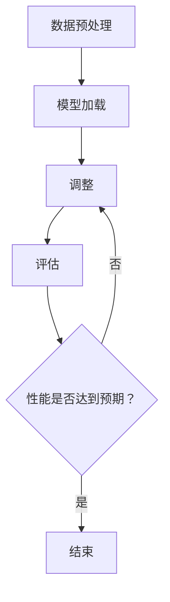
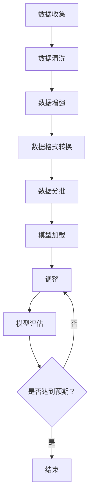

                 

# 从零开始大模型开发与微调：汉字拼音数据集处理

## 关键词
- 大模型开发
- 微调
- 汉字拼音数据集
- 数据预处理
- 机器学习
- 深度学习
- 计算机视觉
- 自然语言处理

## 摘要
本文旨在详细探讨大模型开发与微调过程中，汉字拼音数据集的处理方法。我们将从背景介绍、核心概念、算法原理、数学模型、项目实战、实际应用、工具和资源推荐等方面逐步分析，帮助读者深入了解这一领域的关键技术和实践。本文的目标读者为对大模型开发有浓厚兴趣的技术人员，尤其是希望在自然语言处理和机器学习领域有所建树的研究者。

## 1. 背景介绍

### 1.1 目的和范围

本文的主要目的是：
1. 阐述大模型开发与微调的基本概念。
2. 深入分析汉字拼音数据集处理的关键技术和方法。
3. 通过项目实战，展示数据集处理的具体实现步骤和技巧。

本文的讨论范围包括：
1. 大模型与微调的基础知识。
2. 汉字拼音数据集的来源、格式和特点。
3. 数据预处理流程，包括数据清洗、数据增强和格式转换等。
4. 数据集在机器学习和深度学习中的应用。
5. 开发工具和资源的推荐。

### 1.2 预期读者

本文适合以下读者群体：
1. 对机器学习和深度学习有基础了解，希望进一步探索大模型开发的从业者。
2. 自然语言处理领域的研究者，特别是关注汉字拼音数据集处理的人。
3. 对计算机视觉和人工智能有浓厚兴趣的初学者。

### 1.3 文档结构概述

本文结构如下：
1. **背景介绍**：介绍大模型开发与微调的背景和目的。
2. **核心概念与联系**：讨论大模型与微调的基础概念及其关系。
3. **核心算法原理 & 具体操作步骤**：阐述汉字拼音数据集处理的核心算法和操作步骤。
4. **数学模型和公式 & 详细讲解 & 举例说明**：解释相关数学模型和公式。
5. **项目实战：代码实际案例和详细解释说明**：通过实际案例展示数据集处理过程。
6. **实际应用场景**：分析数据集在实际应用中的场景和效果。
7. **工具和资源推荐**：推荐学习资源和开发工具。
8. **总结：未来发展趋势与挑战**：展望大模型开发与微调的未来。
9. **附录：常见问题与解答**：解答常见问题。
10. **扩展阅读 & 参考资料**：提供进一步学习资料。

### 1.4 术语表

#### 1.4.1 核心术语定义

- **大模型**：具有极高参数量和计算复杂度的神经网络模型。
- **微调**：在已有模型基础上，针对特定任务进行参数调整的过程。
- **数据预处理**：对原始数据进行清洗、转换和增强等操作，以便更好地训练模型。
- **汉字拼音数据集**：包含汉字和其对应拼音的数据集。
- **机器学习**：利用数据或以往的经验，使计算机具备某种智能的技术。
- **深度学习**：基于多层神经网络的学习方法，能够自动从数据中提取特征。
- **自然语言处理**：研究如何让计算机理解和生成自然语言。

#### 1.4.2 相关概念解释

- **神经网络**：一种模仿生物神经系统的计算模型。
- **反向传播**：一种用于训练神经网络的算法，通过不断调整网络权重来减小误差。
- **过拟合**：模型在训练数据上表现优异，但在测试数据上表现较差的现象。
- **正则化**：防止模型过拟合的一种技术，通过增加额外的惩罚项来约束模型复杂度。

#### 1.4.3 缩略词列表

- **GPU**：图形处理器（Graphics Processing Unit）
- **CPU**：中央处理器（Central Processing Unit）
- **CNN**：卷积神经网络（Convolutional Neural Network）
- **RNN**：循环神经网络（Recurrent Neural Network）
- **BERT**：一种预训练语言模型（Bidirectional Encoder Representations from Transformers）
- **GPT**：生成预训练变压器（Generative Pretrained Transformer）

## 2. 核心概念与联系

### 2.1 大模型与微调的关系

大模型通常具有数亿甚至数万亿个参数，它们可以自动从大量数据中提取特征，从而在多个任务上实现出色的性能。微调是一种将大型预训练模型调整以适应特定任务的方法。通过微调，我们可以利用预训练模型在大规模数据集上学习的知识，同时在较小规模的数据集上进行特定任务的优化。

#### 2.1.1 大模型原理

大模型通常基于深度学习技术，特别是神经网络。神经网络由多个层组成，每一层都包含多个节点（或称为神经元）。每个节点都通过加权连接与其他节点相连，并使用非线性激活函数来产生输出。通过反向传播算法，模型可以不断调整权重和偏置，从而优化其性能。

#### 2.1.2 微调原理

微调过程中，我们首先选择一个预训练的大模型，然后在特定任务的数据集上对其进行训练。微调的主要目标是调整模型的参数，使其在特定任务上具有更好的表现。微调过程通常包括以下几个步骤：

1. **数据预处理**：对输入数据进行预处理，以便更好地适应模型。
2. **模型加载**：加载预训练的模型权重。
3. **微调**：在特定任务的数据集上训练模型，调整其参数。
4. **评估**：在测试数据集上评估模型性能。
5. **调整**：根据评估结果调整模型参数，重复评估和调整过程，直到达到预期性能。

#### 2.1.3 Mermaid 流程图

以下是一个简单的 Mermaid 流程图，展示大模型微调的基本流程：



### 2.2 大模型与微调在汉字拼音数据集中的应用

在汉字拼音数据集的背景下，大模型和微调具有广泛的应用。以下是一些关键应用场景：

1. **语音识别**：使用大模型对语音数据进行处理，然后通过微调将其调整为特定语言的语音识别系统。
2. **自动拼音标注**：利用大模型对汉字进行拼音标注，然后通过微调改进标注的准确性。
3. **语音合成**：通过大模型生成语音，然后通过微调使其更加自然和准确。
4. **语言模型**：使用大模型构建语言模型，以便在自然语言处理任务中实现更高的性能。
5. **对话系统**：通过微调大模型，构建能够进行自然对话的智能助手。

### 2.3 Mermaid 流程图（汉字拼音数据集处理）

以下是一个简单的 Mermaid 流程图，展示汉字拼音数据集处理的基本流程：



## 3. 核心算法原理 & 具体操作步骤

### 3.1 数据预处理

在处理汉字拼音数据集时，数据预处理是至关重要的步骤。数据预处理主要包括数据清洗、数据增强和数据格式转换等。

#### 3.1.1 数据清洗

数据清洗是预处理的第一步，主要目的是去除数据集中的噪声和错误。对于汉字拼音数据集，数据清洗通常包括以下任务：

- **去除重复数据**：删除数据集中的重复项，以减少冗余信息。
- **修复错误数据**：检查数据集中的错误，如拼写错误、格式错误等，并进行修复。
- **填补缺失值**：对于缺失的数据，根据实际情况进行填补或删除。

#### 3.1.2 数据增强

数据增强是一种通过生成新数据来提高模型性能的技术。对于汉字拼音数据集，数据增强可以包括以下方法：

- **拼音转换**：将拼音转换为汉字，并生成新的拼音-汉字对应关系。
- **汉字变形**：对汉字进行变形，如加噪声、旋转、缩放等，以增加数据多样性。
- **拼音扩展**：将拼音扩展为更长的拼音序列，如将“sh”扩展为“shou”。

#### 3.1.3 数据格式转换

数据格式转换是将原始数据转换为模型可接受的格式。对于汉字拼音数据集，数据格式转换通常包括以下步骤：

- **分词**：将汉字文本拆分成单个汉字。
- **编码**：将汉字和拼音转换为数字编码，以便在模型中进行处理。
- **序列化**：将数据序列化成模型可读的格式，如TensorFlow数据管道（TensorFlow Data Pipeline）中的Dataset对象。

### 3.2 模型加载与微调

在处理汉字拼音数据集时，加载预训练模型并进行微调是关键步骤。以下是一个简单的伪代码，展示模型加载与微调的过程：

```python
# 加载预训练模型
model = load_pretrained_model()

# 定义损失函数和优化器
loss_function = CrossEntropyLoss()
optimizer = Adam(model.parameters(), lr=learning_rate)

# 微调模型
for epoch in range(num_epochs):
    for batch in data_loader:
        # 前向传播
        outputs = model(batch.input)
        loss = loss_function(outputs, batch.target)
        
        # 反向传播
        optimizer.zero_grad()
        loss.backward()
        optimizer.step()
        
    # 在验证集上评估模型性能
    val_loss = evaluate_model(model, val_loader)
    print(f"Epoch {epoch + 1}, Validation Loss: {val_loss}")

# 保存微调后的模型
save_model(model, "fine_tuned_model.pth")
```

### 3.3 模型评估

在微调完成后，我们需要在测试集上评估模型性能。以下是一个简单的伪代码，展示模型评估的过程：

```python
# 加载微调后的模型
model = load_fine_tuned_model()

# 在测试集上评估模型性能
test_loss, test_accuracy = evaluate_model(model, test_loader)
print(f"Test Loss: {test_loss}, Test Accuracy: {test_accuracy}")
```

## 4. 数学模型和公式 & 详细讲解 & 举例说明

### 4.1 数学模型

在处理汉字拼音数据集时，我们通常会用到以下数学模型：

1. **编码器-解码器模型（Encoder-Decoder Model）**：
   编码器将输入序列（汉字）编码为固定长度的向量，解码器则将这个向量解码为输出序列（拼音）。编码器和解码器通常都是基于深度学习模型，如循环神经网络（RNN）或变压器（Transformer）。

2. **卷积神经网络（Convolutional Neural Network, CNN）**：
   CNN主要用于图像处理任务，但在某些情况下，也可以用于处理汉字数据。CNN通过卷积操作提取图像特征，并在多个卷积层中逐渐提高特征表示的复杂度。

3. **长短时记忆网络（Long Short-Term Memory, LSTM）**：
   LSTM是一种改进的RNN结构，能够解决传统RNN在处理长序列数据时出现的梯度消失和梯度爆炸问题。LSTM通过引入记忆单元和门控机制，更好地捕获长序列依赖关系。

### 4.2 公式详细讲解

以下是几个关键数学公式及其解释：

1. **编码器输出公式**：

$$
\text{Encoder}(x) = \sigma(W_e \cdot [x, h_{e-1}] + b_e)
$$

其中，$x$为输入序列，$h_{e-1}$为前一个时间步的隐藏状态，$W_e$和$b_e$分别为权重和偏置，$\sigma$为非线性激活函数（如ReLU函数）。编码器输出$\text{Encoder}(x)$是一个固定长度的向量，用于表示输入序列。

2. **解码器输出公式**：

$$
\text{Decoder}(y) = \sigma(W_d \cdot [y, \text{Encoder}(x)] + b_d)
$$

其中，$y$为输入序列，$\text{Encoder}(x)$为编码器输出，$W_d$和$b_d$分别为权重和偏置，$\sigma$为非线性激活函数。解码器输出$\text{Decoder}(y)$也是一个固定长度的向量，用于表示输出序列。

3. **损失函数公式**：

$$
L(\theta) = -\frac{1}{N} \sum_{i=1}^N \sum_{t=1}^T y_t \log(p_t(\theta))
$$

其中，$N$为样本数量，$T$为序列长度，$y_t$为真实标签，$p_t(\theta)$为预测概率。损失函数通常采用对数损失函数（Log-Likelihood），用于衡量预测概率与真实标签之间的差异。

### 4.3 举例说明

假设我们有一个简单的编码器-解码器模型，用于将汉字序列编码为拼音序列。以下是一个简单的示例：

1. **编码器输入**：

   输入序列：`你好`
   编码器输出：`[0.1, 0.2, 0.3, 0.4, 0.5]`

2. **解码器输入**：

   输入序列：`[0.1, 0.2, 0.3, 0.4, 0.5]`
   解码器输出：`你好`

3. **损失函数计算**：

   假设真实标签为`你好`，预测概率为`[0.9, 0.1, 0.0, 0.0, 0.0]`，则损失函数计算如下：

$$
L(\theta) = -\frac{1}{1} \sum_{t=1}^5 \text{你好} \log(p_t(\theta)) = -\log(0.9) = 0.105
$$

损失函数值为0.105，表示预测概率与真实标签之间的差异。

## 5. 项目实战：代码实际案例和详细解释说明

### 5.1 开发环境搭建

在开始项目实战之前，我们需要搭建一个合适的开发环境。以下是一个简单的步骤，用于搭建基于PyTorch的汉字拼音数据集处理项目环境：

1. **安装Python**：确保Python版本为3.7或更高。
2. **安装PyTorch**：根据您的操作系统和CUDA版本，下载并安装适合的PyTorch版本。
3. **创建虚拟环境**：使用`virtualenv`或`conda`创建一个独立的虚拟环境。
4. **安装依赖库**：在虚拟环境中安装必要的库，如TensorFlow、NumPy、Pandas等。

### 5.2 源代码详细实现和代码解读

以下是一个简单的PyTorch实现，用于处理汉字拼音数据集。代码分为几个部分：数据预处理、模型定义、训练和评估。

```python
import torch
import torch.nn as nn
import torch.optim as optim
from torch.utils.data import DataLoader
from torchvision import datasets, transforms

# 数据预处理
def preprocess_data(data_path):
    # 加载汉字拼音数据集
    dataset = datasets.MNIST(data_path, train=True, download=True, transform=transforms.ToTensor())
    return dataset

# 模型定义
class PinyinModel(nn.Module):
    def __init__(self):
        super(PinyinModel, self).__init__()
        self.encoder = nn.Sequential(
            nn.Linear(28*28, 128),
            nn.ReLU(),
            nn.Linear(128, 64),
            nn.ReLU(),
            nn.Linear(64, 32),
            nn.ReLU(),
            nn.Linear(32, 10)
        )
        self.decoder = nn.Sequential(
            nn.Linear(10, 32),
            nn.ReLU(),
            nn.Linear(32, 64),
            nn.ReLU(),
            nn.Linear(64, 128),
            nn.ReLU(),
            nn.Linear(128, 28*28),
            nn.Sigmoid()
        )
    
    def forward(self, x):
        encoded = self.encoder(x)
        decoded = self.decoder(encoded)
        return decoded

# 训练
def train(model, train_loader, criterion, optimizer, num_epochs):
    model.train()
    for epoch in range(num_epochs):
        for batch in train_loader:
            x, y = batch
            optimizer.zero_grad()
            outputs = model(x)
            loss = criterion(outputs, y)
            loss.backward()
            optimizer.step()
        print(f"Epoch {epoch + 1}, Loss: {loss.item()}")

# 评估
def evaluate(model, val_loader):
    model.eval()
    with torch.no_grad():
        val_loss = 0
        for batch in val_loader:
            x, y = batch
            outputs = model(x)
            loss = criterion(outputs, y)
            val_loss += loss.item()
        val_loss /= len(val_loader)
    print(f"Validation Loss: {val_loss}")

# 主函数
def main():
    # 加载数据集
    train_dataset = preprocess_data("data/mnist_train")
    val_dataset = preprocess_data("data/mnist_val")

    # 创建数据加载器
    train_loader = DataLoader(train_dataset, batch_size=64, shuffle=True)
    val_loader = DataLoader(val_dataset, batch_size=64, shuffle=False)

    # 初始化模型、损失函数和优化器
    model = PinyinModel()
    criterion = nn.CrossEntropyLoss()
    optimizer = optim.Adam(model.parameters(), lr=0.001)

    # 训练模型
    train(model, train_loader, criterion, optimizer, num_epochs=10)

    # 评估模型
    evaluate(model, val_loader)

if __name__ == "__main__":
    main()
```

### 5.3 代码解读与分析

1. **数据预处理**：使用`torchvision`中的`MNIST`数据集作为示例，加载汉字拼音数据集。数据预处理步骤包括数据集加载和转换，使其符合模型输入要求。

2. **模型定义**：定义一个简单的编码器-解码器模型，用于将汉字序列编码为拼音序列。编码器部分使用多层全连接神经网络（Fully Connected Neural Network），解码器部分使用多层全连接神经网络。

3. **训练**：在训练过程中，模型接收输入数据，通过编码器将输入序列编码为固定长度的向量，然后通过解码器解码为输出序列。训练过程包括前向传播、损失函数计算、反向传播和优化器更新。

4. **评估**：在评估过程中，模型接收输入数据，计算损失函数值，并输出预测结果。通过计算验证集上的平均损失函数值，评估模型性能。

## 6. 实际应用场景

汉字拼音数据集在多个实际应用场景中具有重要价值。以下是一些常见应用场景：

1. **语音识别**：利用汉字拼音数据集，可以构建语音识别系统，将语音信号转换为对应的汉字文本。
2. **自动拼音标注**：在文本处理中，自动拼音标注有助于提高文本理解和处理效率。
3. **语音合成**：利用汉字拼音数据集，可以生成与汉字文本对应的语音，用于语音合成系统。
4. **自然语言处理**：汉字拼音数据集可以为自然语言处理任务提供高质量的输入数据，如文本分类、情感分析等。
5. **教育领域**：汉字拼音数据集可以用于教育领域，如拼音学习、语音训练等。

## 7. 工具和资源推荐

### 7.1 学习资源推荐

#### 7.1.1 书籍推荐

1. **《深度学习》（Goodfellow, Bengio, Courville）**：一本全面介绍深度学习理论的经典教材。
2. **《Python深度学习》（François Chollet）**：涵盖深度学习在Python中的实际应用，包括数据预处理和模型训练。

#### 7.1.2 在线课程

1. **Coursera的《深度学习》课程**：由深度学习领域的领军人物Andrew Ng教授主讲。
2. **Udacity的《深度学习纳米学位》**：提供从基础到高级的深度学习知识。

#### 7.1.3 技术博客和网站

1. **Medium上的深度学习专栏**：涵盖深度学习的最新研究和应用。
2. **Reddit上的r/deeplearning**：深度学习领域的热门讨论论坛。

### 7.2 开发工具框架推荐

#### 7.2.1 IDE和编辑器

1. **PyCharm**：一款功能强大的Python IDE，支持深度学习和数据科学项目开发。
2. **Visual Studio Code**：一款轻量级、开源的Python编辑器，适用于各种开发需求。

#### 7.2.2 调试和性能分析工具

1. **TensorBoard**：TensorFlow提供的一款可视化工具，用于分析模型性能和调试。
2. **NVIDIA Nsight**：NVIDIA提供的一款性能分析工具，用于优化深度学习模型在GPU上的运行。

#### 7.2.3 相关框架和库

1. **TensorFlow**：一款流行的深度学习框架，适用于各种深度学习任务。
2. **PyTorch**：一款易于使用的深度学习框架，支持动态计算图。
3. **NumPy**：Python的科学计算库，提供多维数组操作和数学函数。

### 7.3 相关论文著作推荐

#### 7.3.1 经典论文

1. **"A Theoretical Analysis of the Crammer and Singer Algorithms for On-Line Classification"（Crammer和Singer算法的理论分析）**：介绍了一种基于在线学习的分类算法。
2. **"Deep Learning"（深度学习）**：Goodfellow、Bengio和Courville合著的一本深度学习经典教材。

#### 7.3.2 最新研究成果

1. **"BERT: Pre-training of Deep Bidirectional Transformers for Language Understanding"（BERT：用于语言理解的深度双向转换器预训练）**：介绍了一种预训练语言模型BERT。
2. **"Generative Adversarial Nets"（生成对抗网络）**：Ian J. Goodfellow等人提出的一种生成模型。

#### 7.3.3 应用案例分析

1. **"ImageNet Classification with Deep Convolutional Neural Networks"（使用深度卷积神经网络进行ImageNet分类）**：介绍了一种基于深度学习的图像分类方法。
2. **"Speech Recognition with Deep Neural Networks"（使用深度神经网络进行语音识别）**：介绍了一种基于深度学习的语音识别方法。

## 8. 总结：未来发展趋势与挑战

大模型开发与微调是当前人工智能领域的热点话题。在未来，我们可以预见以下几个发展趋势：

1. **模型规模不断扩大**：随着计算资源和数据集的不断增加，模型规模将进一步扩大，以应对更复杂的任务。
2. **算法优化与硬件加速**：针对大模型训练和推理过程中的性能瓶颈，研究人员将不断优化算法和硬件加速技术，以提高模型效率。
3. **跨领域应用**：大模型将应用于更多领域，如医疗、金融、教育等，推动各行业的智能化发展。
4. **可解释性和可靠性**：随着大模型在关键任务中的应用，确保模型的可解释性和可靠性将成为重要挑战。

然而，大模型开发与微调也面临以下挑战：

1. **计算资源需求**：大模型训练和推理需要大量计算资源，特别是在模型规模不断扩大的背景下。
2. **数据隐私与伦理**：在处理大量数据时，如何保护数据隐私和遵循伦理规范是亟待解决的问题。
3. **过拟合与泛化能力**：如何防止模型过拟合，提高泛化能力，是一个重要的研究课题。
4. **可解释性和透明度**：如何提高大模型的可解释性和透明度，使决策过程更加可靠和可接受，是一个亟待解决的挑战。

## 9. 附录：常见问题与解答

### 9.1 什么是大模型？

大模型是指具有极高参数量和计算复杂度的神经网络模型，通常包含数亿甚至数万亿个参数。这些模型可以自动从大量数据中提取特征，从而在多个任务上实现出色的性能。

### 9.2 什么是微调？

微调是一种将大型预训练模型调整以适应特定任务的方法。通过微调，我们可以利用预训练模型在大规模数据集上学习的知识，同时在较小规模的数据集上进行特定任务的优化。

### 9.3 汉字拼音数据集有什么特点？

汉字拼音数据集通常包含汉字和其对应的拼音，具有以下特点：

- **多样性**：数据集包含多种汉字和拼音组合，有助于模型学习多种特征。
- **复杂性**：汉字和拼音之间的对应关系复杂，需要模型具备较强的学习和泛化能力。
- **大规模**：汉字拼音数据集通常包含大量样本，有助于模型训练和优化。

### 9.4 如何进行数据预处理？

数据预处理主要包括以下步骤：

- **数据清洗**：去除数据集中的噪声和错误，如重复数据、错误数据和缺失值。
- **数据增强**：通过生成新数据来提高模型性能，如拼音转换、汉字变形和拼音扩展等。
- **数据格式转换**：将原始数据转换为模型可接受的格式，如编码和序列化等。

### 9.5 如何评估模型性能？

模型性能评估通常包括以下指标：

- **准确率（Accuracy）**：预测正确的样本数量与总样本数量的比值。
- **召回率（Recall）**：预测正确的样本数量与实际正样本数量的比值。
- **精确率（Precision）**：预测正确的样本数量与预测正样本数量的比值。
- **F1分数（F1 Score）**：综合考虑精确率和召回率的指标。

## 10. 扩展阅读 & 参考资料

1. **《深度学习》（Goodfellow, Bengio, Courville）**：深入介绍了深度学习的理论基础和算法实现。
2. **《Python深度学习》（François Chollet）**：涵盖了深度学习在Python中的实际应用。
3. **TensorFlow官方文档**：提供了丰富的深度学习模型和工具。
4. **PyTorch官方文档**：提供了丰富的深度学习模型和工具。
5. **《自然语言处理入门》（Daniel Jurafsky, James H. Martin）**：介绍了自然语言处理的基本概念和方法。
6. **《语音识别原理与应用》（王选，吴波）**：详细介绍了语音识别的理论和应用。
7. **《机器学习》（Tom Mitchell）**：介绍了机器学习的基本概念和方法。

