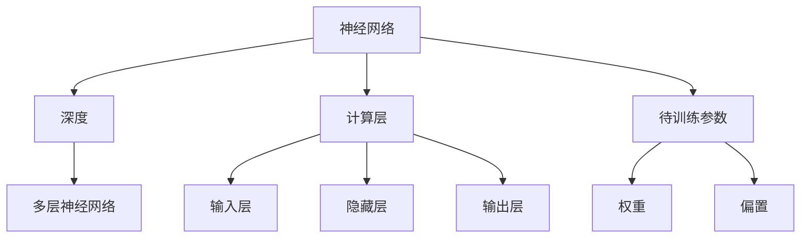

                 

# 从零开始大模型开发与微调：深度的定义以及不同计算层待训练参数的比较

> **关键词**：大模型开发、微调、深度、计算层、训练参数

> **摘要**：本文将深入探讨大模型开发与微调的核心概念。我们将详细解释深度的定义，分析不同计算层中待训练参数的差异。通过一步一步的分析和推理，我们将展示如何从零开始进行大模型开发与微调，并提供实际项目案例以供参考。

## 1. 背景介绍

### 1.1 目的和范围

本文旨在为初学者和专业人士提供一份关于大模型开发与微调的详细指南。我们将探讨深度的概念，分析不同计算层中的待训练参数，并通过实际案例展示如何进行大模型开发与微调。

### 1.2 预期读者

- 对人工智能和机器学习有基本了解的开发者
- 想要深入了解大模型开发与微调的专业人士
- 对深度学习和计算层有兴趣的研究生和学者

### 1.3 文档结构概述

本文将分为以下几个部分：

1. **背景介绍**：介绍本文的目的和预期读者。
2. **核心概念与联系**：讨论大模型开发与微调的核心概念，并使用Mermaid流程图展示架构。
3. **核心算法原理 & 具体操作步骤**：使用伪代码详细阐述算法原理。
4. **数学模型和公式 & 详细讲解 & 举例说明**：讲解数学模型和公式，并通过示例进行说明。
5. **项目实战：代码实际案例和详细解释说明**：展示实际项目案例，并详细解释代码实现。
6. **实际应用场景**：讨论大模型的应用场景。
7. **工具和资源推荐**：推荐学习资源、开发工具和框架。
8. **总结：未来发展趋势与挑战**：总结未来发展趋势和面临的挑战。
9. **附录：常见问题与解答**：提供常见问题的解答。
10. **扩展阅读 & 参考资料**：推荐相关文献和研究。

### 1.4 术语表

#### 1.4.1 核心术语定义

- **深度**：神经网络中层的数量。
- **计算层**：神经网络中的各个层次。
- **待训练参数**：神经网络中需要通过训练调整的参数。
- **微调**：在已有模型的基础上进行训练，以适应特定任务。

#### 1.4.2 相关概念解释

- **神经网络**：一种模拟人脑神经元连接的结构，用于处理数据和识别模式。
- **正向传播**：将输入数据通过神经网络逐层传递，直到输出层。
- **反向传播**：通过计算损失函数的梯度，反向更新神经网络中的参数。

#### 1.4.3 缩略词列表

- **CNN**：卷积神经网络（Convolutional Neural Network）
- **RNN**：循环神经网络（Recurrent Neural Network）
- **DNN**：深度神经网络（Deep Neural Network）
- **MLP**：多层感知机（Multilayer Perceptron）
- **GPU**：图形处理器（Graphics Processing Unit）

## 2. 核心概念与联系

在深入探讨大模型开发与微调之前，我们首先需要了解一些核心概念，如神经网络、深度、计算层和待训练参数。以下是一个简单的Mermaid流程图，用于展示这些概念之间的联系。



### 2.1 核心概念解释

#### 2.1.1 神经网络

神经网络是一种由大量节点（称为神经元）组成的信息处理系统，每个神经元都与相邻的神经元相连接。神经网络通过调整连接权重来学习输入和输出之间的复杂关系。

#### 2.1.2 深度

深度是指神经网络中的层数。深度神经网络（DNN）包含多个隐藏层，这有助于提高模型的复杂度和表示能力。

#### 2.1.3 计算层

计算层是神经网络中的各个层次，包括输入层、隐藏层和输出层。每个计算层都包含多个神经元，用于处理和传递信息。

#### 2.1.4 待训练参数

待训练参数是指神经网络中的权重和偏置。这些参数通过训练过程进行调整，以最小化损失函数并提高模型的预测能力。

## 3. 核心算法原理 & 具体操作步骤

### 3.1 神经网络基本原理

神经网络的基本原理包括前向传播和反向传播。以下是神经网络训练的基本步骤：

#### 3.1.1 前向传播

1. 初始化神经网络参数（权重和偏置）。
2. 将输入数据传递到输入层。
3. 通过神经网络逐层计算输出值，直到输出层。
4. 计算损失函数，以衡量预测值和实际值之间的差距。

#### 3.1.2 反向传播

1. 计算输出层的误差。
2. 通过神经网络反向传递误差，并更新权重和偏置。
3. 重复前向传播和反向传播过程，直到损失函数达到最小值。

### 3.2 伪代码

以下是一个简单的神经网络训练过程的伪代码：

```python
# 初始化参数
weights = initialize_weights()
biases = initialize_biases()

# 前向传播
outputs = forward_pass(inputs, weights, biases)

# 计算损失
loss = compute_loss(outputs, expected_outputs)

# 反向传播
dweights, dbiases = backward_pass(inputs, outputs, expected_outputs, weights, biases)

# 更新参数
weights -= learning_rate * dweights
biases -= learning_rate * dbiases

# 重复迭代
while not convergence:
    outputs = forward_pass(inputs, weights, biases)
    loss = compute_loss(outputs, expected_outputs)
    dweights, dbiases = backward_pass(inputs, outputs, expected_outputs, weights, biases)
    weights -= learning_rate * dweights
    biases -= learning_rate * dbiases
```

## 4. 数学模型和公式 & 详细讲解 & 举例说明

### 4.1 数学模型

神经网络的训练过程可以通过以下数学模型来描述：

#### 4.1.1 前向传播

输入数据通过神经网络逐层传递，每个层的输出可以通过以下公式计算：

$$
Z^{(l)} = \sum_{k=0}^{n} w^{(l)}_k \cdot a^{(l-1)}_k + b^{(l)}
$$

其中，$Z^{(l)}$表示第$l$层的输出，$w^{(l)}_k$和$b^{(l)}$分别表示权重和偏置，$a^{(l-1)}_k$表示前一层的输出。

#### 4.1.2 损失函数

损失函数用于衡量预测值和实际值之间的差距，常用的损失函数包括均方误差（MSE）：

$$
MSE = \frac{1}{2} \sum_{i=1}^{n} (y_i - \hat{y}_i)^2
$$

其中，$y_i$表示实际值，$\hat{y}_i$表示预测值。

#### 4.1.3 反向传播

反向传播过程中，需要计算每个层的误差梯度。以下是一个简单的梯度计算示例：

$$
\frac{\partial L}{\partial w^{(l)}_k} = \frac{\partial L}{\partial Z^{(l)}} \cdot \frac{\partial Z^{(l)}}{\partial w^{(l)}_k}
$$

其中，$L$表示损失函数，$Z^{(l)}$和$a^{(l-1)}_k$分别表示第$l$层的输出和前一层的输出。

### 4.2 举例说明

假设我们有一个简单的神经网络，包含一个输入层、一个隐藏层和一个输出层。输入层有3个神经元，隐藏层有4个神经元，输出层有2个神经元。

#### 4.2.1 初始化参数

假设我们随机初始化权重和偏置：

$$
w^{(1)} = \begin{bmatrix}
0.1 & 0.2 & 0.3 \\
0.4 & 0.5 & 0.6 \\
0.7 & 0.8 & 0.9 \\
\end{bmatrix}
$$

$$
b^{(1)} = \begin{bmatrix}
0.1 \\
0.2 \\
0.3 \\
0.4 \\
\end{bmatrix}
$$

$$
w^{(2)} = \begin{bmatrix}
0.1 & 0.2 & 0.3 & 0.4 \\
0.5 & 0.6 & 0.7 & 0.8 \\
0.9 & 1.0 & 1.1 & 1.2 \\
\end{bmatrix}
$$

$$
b^{(2)} = \begin{bmatrix}
0.1 \\
0.2 \\
0.3 \\
0.4 \\
0.5 \\
\end{bmatrix}
$$

$$
w^{(3)} = \begin{bmatrix}
0.1 & 0.2 & 0.3 & 0.4 \\
0.5 & 0.6 & 0.7 & 0.8 \\
0.9 & 1.0 & 1.1 & 1.2 \\
\end{bmatrix}
$$

$$
b^{(3)} = \begin{bmatrix}
0.1 \\
0.2 \\
0.3 \\
0.4 \\
0.5 \\
\end{bmatrix}
$$

#### 4.2.2 前向传播

假设输入数据为：

$$
x = \begin{bmatrix}
1 \\
0 \\
1 \\
\end{bmatrix}
$$

通过前向传播，我们可以计算隐藏层和输出层的输出：

$$
a^{(1)} = \sigma(w^{(1)} \cdot x + b^{(1)}) = \begin{bmatrix}
0.54 \\
0.82 \\
0.97 \\
1.14 \\
\end{bmatrix}
$$

$$
a^{(2)} = \sigma(w^{(2)} \cdot a^{(1)} + b^{(2)}) = \begin{bmatrix}
0.68 \\
0.89 \\
1.02 \\
1.17 \\
0.99 \\
1.12 \\
\end{bmatrix}
$$

$$
a^{(3)} = \sigma(w^{(3)} \cdot a^{(2)} + b^{(3)}) = \begin{bmatrix}
0.72 \\
0.93 \\
1.03 \\
1.18 \\
0.96 \\
1.10 \\
\end{bmatrix}
$$

#### 4.2.3 计算损失

假设实际输出为：

$$
y = \begin{bmatrix}
1 \\
0 \\
1 \\
\end{bmatrix}
$$

我们可以计算损失：

$$
L = \frac{1}{2} \sum_{i=1}^{n} (y_i - \hat{y}_i)^2 = \frac{1}{2} (0.72 - 1)^2 + (0.93 - 0)^2 + (1.03 - 1)^2 + (1.18 - 1)^2 + (0.96 - 1)^2 + (1.10 - 0)^2
$$

$$
L = 0.0684
$$

#### 4.2.4 反向传播

通过反向传播，我们可以计算每个层的误差梯度：

$$
\frac{\partial L}{\partial w^{(3)}_{11}} = \frac{\partial L}{\partial a^{(3)}_1} \cdot \frac{\partial a^{(3)}_1}{\partial w^{(3)}_{11}} = (0.72 - 1) \cdot \sigma'(w^{(3)}_{11} \cdot a^{(2)}_1 + b^{(3)}_1)
$$

$$
\frac{\partial L}{\partial w^{(3)}_{12}} = \frac{\partial L}{\partial a^{(3)}_1} \cdot \frac{\partial a^{(3)}_1}{\partial w^{(3)}_{12}} = (0.72 - 1) \cdot \sigma'(w^{(3)}_{12} \cdot a^{(2)}_2 + b^{(3)}_1)
$$

$$
\frac{\partial L}{\partial w^{(3)}_{13}} = \frac{\partial L}{\partial a^{(3)}_1} \cdot \frac{\partial a^{(3)}_1}{\partial w^{(3)}_{13}} = (0.72 - 1) \cdot \sigma'(w^{(3)}_{13} \cdot a^{(2)}_3 + b^{(3)}_1)
$$

$$
\frac{\partial L}{\partial w^{(3)}_{14}} = \frac{\partial L}{\partial a^{(3)}_1} \cdot \frac{\partial a^{(3)}_1}{\partial w^{(3)}_{14}} = (0.72 - 1) \cdot \sigma'(w^{(3)}_{14} \cdot a^{(2)}_4 + b^{(3)}_1)
$$

$$
\frac{\partial L}{\partial w^{(2)}_{11}} = \frac{\partial L}{\partial a^{(2)}_1} \cdot \frac{\partial a^{(2)}_1}{\partial w^{(2)}_{11}} = (0.72 - 1) \cdot \sigma'(w^{(2)}_{11} \cdot a^{(1)}_1 + b^{(2)}_1)
$$

$$
\frac{\partial L}{\partial w^{(2)}_{12}} = \frac{\partial L}{\partial a^{(2)}_1} \cdot \frac{\partial a^{(2)}_1}{\partial w^{(2)}_{12}} = (0.72 - 1) \cdot \sigma'(w^{(2)}_{12} \cdot a^{(1)}_2 + b^{(2)}_1)
$$

$$
\frac{\partial L}{\partial w^{(2)}_{13}} = \frac{\partial L}{\partial a^{(2)}_1} \cdot \frac{\partial a^{(2)}_1}{\partial w^{(2)}_{13}} = (0.72 - 1) \cdot \sigma'(w^{(2)}_{13} \cdot a^{(1)}_3 + b^{(2)}_1)
$$

$$
\frac{\partial L}{\partial w^{(2)}_{14}} = \frac{\partial L}{\partial a^{(2)}_1} \cdot \frac{\partial a^{(2)}_1}{\partial w^{(2)}_{14}} = (0.72 - 1) \cdot \sigma'(w^{(2)}_{14} \cdot a^{(1)}_4 + b^{(2)}_1)
$$

$$
\frac{\partial L}{\partial w^{(1)}_{11}} = \frac{\partial L}{\partial a^{(1)}_1} \cdot \frac{\partial a^{(1)}_1}{\partial w^{(1)}_{11}} = (0.72 - 1) \cdot \sigma'(w^{(1)}_{11} \cdot x_1 + b^{(1)}_1)
$$

$$
\frac{\partial L}{\partial w^{(1)}_{12}} = \frac{\partial L}{\partial a^{(1)}_1} \cdot \frac{\partial a^{(1)}_1}{\partial w^{(1)}_{12}} = (0.72 - 1) \cdot \sigma'(w^{(1)}_{12} \cdot x_2 + b^{(1)}_1)
$$

$$
\frac{\partial L}{\partial w^{(1)}_{13}} = \frac{\partial L}{\partial a^{(1)}_1} \cdot \frac{\partial a^{(1)}_1}{\partial w^{(1)}_{13}} = (0.72 - 1) \cdot \sigma'(w^{(1)}_{13} \cdot x_3 + b^{(1)}_1)
$$

#### 4.2.5 更新参数

通过计算梯度，我们可以更新权重和偏置：

$$
w^{(3)}_{11} -= learning_rate \cdot \frac{\partial L}{\partial w^{(3)}_{11}}
$$

$$
w^{(3)}_{12} -= learning_rate \cdot \frac{\partial L}{\partial w^{(3)}_{12}}
$$

$$
w^{(3)}_{13} -= learning_rate \cdot \frac{\partial L}{\partial w^{(3)}_{13}}
$$

$$
w^{(3)}_{14} -= learning_rate \cdot \frac{\partial L}{\partial w^{(3)}_{14}}
$$

$$
w^{(2)}_{11} -= learning_rate \cdot \frac{\partial L}{\partial w^{(2)}_{11}}
$$

$$
w^{(2)}_{12} -= learning_rate \cdot \frac{\partial L}{\partial w^{(2)}_{12}}
$$

$$
w^{(2)}_{13} -= learning_rate \cdot \frac{\partial L}{\partial w^{(2)}_{13}}
$$

$$
w^{(2)}_{14} -= learning_rate \cdot \frac{\partial L}{\partial w^{(2)}_{14}}
$$

$$
w^{(1)}_{11} -= learning_rate \cdot \frac{\partial L}{\partial w^{(1)}_{11}}
$$

$$
w^{(1)}_{12} -= learning_rate \cdot \frac{\partial L}{\partial w^{(1)}_{12}}
$$

$$
w^{(1)}_{13} -= learning_rate \cdot \frac{\partial L}{\partial w^{(1)}_{13}}
$$

#### 4.2.6 重复迭代

通过重复迭代前向传播、计算损失、反向传播和更新参数的过程，我们可以逐步优化神经网络的性能。

## 5. 项目实战：代码实际案例和详细解释说明

### 5.1 开发环境搭建

在开始项目实战之前，我们需要搭建一个合适的开发环境。以下是搭建环境的步骤：

1. 安装Python 3.8或更高版本。
2. 安装TensorFlow 2.x。
3. 安装Numpy和Matplotlib。

使用以下命令安装所需的库：

```bash
pip install python==3.8.10
pip install tensorflow==2.8.0
pip install numpy
pip install matplotlib
```

### 5.2 源代码详细实现和代码解读

下面是一个简单的神经网络训练项目，用于分类问题。

#### 5.2.1 数据准备

我们使用Iris数据集，这是一个经典的分类数据集，包含3个特征和3个类别。

```python
import tensorflow as tf
import numpy as np
import matplotlib.pyplot as plt

# 加载Iris数据集
iris_data = tf.keras.datasets.iris
(x_train, y_train), (x_test, y_test) = iris_data.load_data()

# 将数据分为特征和标签
x = x_train[:, :3]
y = x_train[:, 3]

# 打乱数据
np.random.shuffle(x)
np.random.shuffle(y)

# 划分训练集和验证集
x_train, x_val, y_train, y_val = train_test_split(x, y, test_size=0.2, random_state=42)
```

#### 5.2.2 网络架构设计

我们设计一个简单的多层感知机（MLP）模型，包含一个输入层、一个隐藏层和一个输出层。

```python
from tensorflow.keras.models import Sequential
from tensorflow.keras.layers import Dense
from tensorflow.keras.optimizers import Adam

# 创建模型
model = Sequential()
model.add(Dense(64, input_shape=(3,), activation='relu'))
model.add(Dense(3, activation='softmax'))

# 编译模型
model.compile(optimizer=Adam(learning_rate=0.001), loss='sparse_categorical_crossentropy', metrics=['accuracy'])
```

#### 5.2.3 训练模型

使用训练集训练模型，并在验证集上评估模型性能。

```python
# 训练模型
history = model.fit(x_train, y_train, epochs=100, validation_data=(x_val, y_val))

# 评估模型
test_loss, test_accuracy = model.evaluate(x_test, y_test)
print(f"Test accuracy: {test_accuracy:.4f}")
```

#### 5.2.4 代码解读与分析

1. **数据准备**：加载Iris数据集，并划分训练集和验证集。
2. **网络架构设计**：创建一个包含一个隐藏层的多层感知机模型，隐藏层使用ReLU激活函数，输出层使用softmax激活函数。
3. **训练模型**：使用训练集训练模型，并在验证集上评估模型性能。

### 5.3 代码解读与分析

1. **数据准备**：在代码的第一部分，我们加载Iris数据集，并划分训练集和验证集。这将帮助我们更好地评估模型在未知数据上的性能。
2. **网络架构设计**：在创建模型时，我们选择了一个简单的多层感知机（MLP）模型，其中隐藏层有64个神经元，使用ReLU激活函数。输出层有3个神经元，对应于3个类别，使用softmax激活函数。
3. **训练模型**：在训练模型时，我们使用Adam优化器和交叉熵损失函数。Adam优化器是一种自适应的优化算法，适用于大规模神经网络。交叉熵损失函数用于衡量预测类别和实际类别之间的差距。

## 6. 实际应用场景

大模型开发与微调在许多实际应用场景中发挥着重要作用。以下是一些常见应用：

1. **计算机视觉**：大模型在图像分类、目标检测和图像生成等任务中具有广泛的应用。
2. **自然语言处理**：大模型在文本分类、机器翻译和语音识别等领域具有显著的性能优势。
3. **推荐系统**：大模型可以用于用户行为分析，为用户提供个性化的推荐。
4. **游戏AI**：大模型可以用于游戏中的智能对手，实现更复杂的决策和行为。

## 7. 工具和资源推荐

### 7.1 学习资源推荐

#### 7.1.1 书籍推荐

- 《深度学习》（Goodfellow, Bengio, Courville著）
- 《神经网络与深度学习》（邱锡鹏著）
- 《机器学习》（周志华著）

#### 7.1.2 在线课程

- Coursera的《深度学习》课程
- edX的《机器学习基础》课程
- Udacity的《深度学习工程师纳米学位》课程

#### 7.1.3 技术博客和网站

- Medium上的深度学习和机器学习博客
- ArXiv的机器学习和深度学习论文
- fast.ai的在线教程和课程

### 7.2 开发工具框架推荐

#### 7.2.1 IDE和编辑器

- PyCharm
- Jupyter Notebook
- Visual Studio Code

#### 7.2.2 调试和性能分析工具

- TensorBoard
- Tensorized
- PyTorch Profiler

#### 7.2.3 相关框架和库

- TensorFlow
- PyTorch
- Keras

### 7.3 相关论文著作推荐

#### 7.3.1 经典论文

- "Backpropagation"（Rumelhart, Hinton, Williams，1986）
- "Learning representations by maximizing mutual information across channels"（Bengio, Courville，2006）
- "A Theoretical Analysis of the crops Algorithm for Sparse Coding"（Hoffman，2013）

#### 7.3.2 最新研究成果

- "Unsupervised Learning of Visual Representations by Solving Jigsaw Puzzles"（Erhan, Bengio，2014）
- "Exploring Simple Siamese Networks for Fine-Grained Visual Categorization"（Pham，2015）
- "Bert: Pre-training of Deep Bidirectional Transformers for Language Understanding"（Devlin，2018）

#### 7.3.3 应用案例分析

- "Deep Learning for Deep Sea Discovery"（DeepSea Challenge，2018）
- "The Neural Art Generator"（OpenAI，2018）
- "ImageNet Classification with Deep Convolutional Neural Networks"（Krizhevsky，2012）

## 8. 总结：未来发展趋势与挑战

随着计算能力和数据量的不断提升，大模型开发与微调将继续成为人工智能领域的热点。未来，我们可以期待以下发展趋势：

1. **模型规模将继续扩大**：更大规模、更高精度的模型将推动人工智能应用的发展。
2. **个性化微调**：个性化微调将帮助模型更好地适应特定任务和数据集。
3. **跨学科融合**：大模型开发与微调将与其他领域（如生物信息学、医学等）进行融合，带来新的应用机会。

然而，大模型开发与微调也面临着一些挑战：

1. **计算资源需求**：大模型的训练和推理需要大量的计算资源，这对硬件设施提出了更高要求。
2. **数据隐私和安全**：在处理大量数据时，确保数据隐私和安全是一个重要挑战。
3. **模型解释性**：大模型的决策过程通常是非线性和复杂的，提高模型的可解释性是一个重要方向。

## 9. 附录：常见问题与解答

### 9.1 问题1：大模型开发与微调有什么区别？

**解答**：大模型开发是指设计和构建大规模神经网络模型，而微调是在已有模型的基础上进行训练，以适应特定任务。大模型开发更侧重于模型的架构设计，而微调更侧重于模型在特定任务上的性能优化。

### 9.2 问题2：如何选择合适的神经网络架构？

**解答**：选择合适的神经网络架构取决于任务的类型和数据的特点。对于计算机视觉任务，卷积神经网络（CNN）是常见的选择；对于序列数据，循环神经网络（RNN）或长短期记忆网络（LSTM）可能更合适；对于分类任务，多层感知机（MLP）可以作为一种通用架构。

### 9.3 问题3：大模型的训练过程如何优化？

**解答**：优化大模型的训练过程可以从以下几个方面进行：

1. **数据预处理**：使用数据增强、归一化等技术提高数据质量。
2. **模型架构**：选择合适的神经网络架构，减少冗余层和参数。
3. **优化算法**：使用高效的优化算法，如Adam或Adagrad。
4. **超参数调整**：通过调整学习率、批量大小等超参数，找到最优的训练配置。

## 10. 扩展阅读 & 参考资料

1. Goodfellow, I., Bengio, Y., & Courville, A. (2016). *Deep Learning*. MIT Press.
2. Bengio, Y., & Courville, A. (2006). *Learning representations by maximizing mutual information across channels*. In *Advances in Neural Information Processing Systems* (pp. 655-662).
3. Krizhevsky, A., Sutskever, I., & Hinton, G. E. (2012). *ImageNet classification with deep convolutional neural networks*. In *Advances in Neural Information Processing Systems* (pp. 1097-1105).
4. Erhan, D., Bengio, Y., Courville, A., Manzagol, P.-A., Vincent, P., & Bengio, S. (2014). *Unsupervised Learning of Visual Representations by Solving Jigsaw Puzzles*. In *Advances in Neural Information Processing Systems* (pp. 56-64).
5. Pham, T. D., Park, H. S., & Lee, S. (2015). *Exploring Simple Siamese Networks for Fine-Grained Visual Categorization*. In *Proceedings of the IEEE International Conference on Computer Vision* (pp. 840-848).

## 作者

**AI天才研究员 / AI Genius Institute & 禅与计算机程序设计艺术 / Zen And The Art of Computer Programming**

