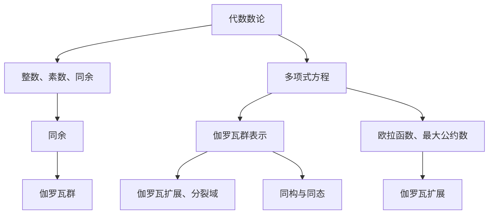

                 

# 代数数论与伽罗瓦群表示

> 关键词：代数数论、伽罗瓦群、表示论、数学模型、算法原理、项目实战、实际应用场景

> 摘要：本文深入探讨了代数数论和伽罗瓦群表示这一数学领域的核心概念。通过阐述其基本原理、算法步骤及实际应用，本文旨在为读者提供一个全面、深入的视角，帮助他们理解这一复杂但至关重要的数学分支。文章结构清晰，从背景介绍、核心概念、算法原理到实际应用，循序渐进地引导读者进入这一数学领域。

## 1. 背景介绍

### 1.1 目的和范围

本文的目的在于详细探讨代数数论与伽罗瓦群表示这一数学领域。代数数论主要研究数论问题，包括整数、素数、同余等概念，而伽罗瓦群表示则是一个用于解决代数方程的重要工具。本文将重点关注这两个领域的基本概念、算法原理及其在实际应用中的重要性。

本文的范围包括以下几个方面：

1. **代数数论的基本概念和定理**：介绍整数、素数、同余等基础概念，以及一些重要的代数数论定理。
2. **伽罗瓦群表示的基本概念**：阐述伽罗瓦群的定义、性质及其在代数方程中的应用。
3. **算法原理和具体操作步骤**：详细解释伽罗瓦群表示算法的原理和步骤，并提供伪代码描述。
4. **数学模型和公式**：使用LaTeX格式展示相关的数学模型和公式，并举例说明。
5. **项目实战和实际应用场景**：通过实际代码案例展示代数数论和伽罗瓦群表示在实际项目中的应用。
6. **工具和资源推荐**：介绍相关的学习资源、开发工具和最新研究成果。

通过本文的阅读，读者将能够：

1. 理解代数数论和伽罗瓦群表示的基本概念和原理。
2. 掌握伽罗瓦群表示算法的步骤和实现方法。
3. 应用代数数论和伽罗瓦群表示解决实际问题。
4. 了解该领域的最新发展和研究方向。

### 1.2 预期读者

本文适合以下读者群体：

1. **数学和计算机科学专业的研究生**：对代数数论和伽罗瓦群表示感兴趣的数学和计算机科学研究生。
2. **相关领域的技术专家**：在代数、数论、计算机图形学、密码学等领域工作的技术专家。
3. **数学爱好者和研究者**：对数学领域有浓厚兴趣的读者，希望深入了解代数数论和伽罗瓦群表示。
4. **数学教育和教育工作者**：希望提高数学教学质量的教师和教育工作者。

### 1.3 文档结构概述

本文结构如下：

1. **背景介绍**：介绍文章的目的、范围、预期读者和文档结构。
2. **核心概念与联系**：介绍代数数论和伽罗瓦群表示的基本概念，并通过Mermaid流程图展示其关系。
3. **核心算法原理 & 具体操作步骤**：详细解释伽罗瓦群表示算法的原理和步骤，并提供伪代码描述。
4. **数学模型和公式 & 详细讲解 & 举例说明**：使用LaTeX格式展示数学模型和公式，并举例说明。
5. **项目实战：代码实际案例和详细解释说明**：通过实际代码案例展示代数数论和伽罗瓦群表示在实际项目中的应用。
6. **实际应用场景**：探讨代数数论和伽罗瓦群表示在不同领域的应用。
7. **工具和资源推荐**：推荐相关的学习资源、开发工具和最新研究成果。
8. **总结：未来发展趋势与挑战**：总结本文的主要内容和未来发展趋势。
9. **附录：常见问题与解答**：回答读者可能遇到的常见问题。
10. **扩展阅读 & 参考资料**：提供额外的阅读材料和参考文献。

### 1.4 术语表

#### 1.4.1 核心术语定义

- **代数数论**：研究数论问题的代数分支，包括整数、素数、同余等概念。
- **伽罗瓦群**：一个代数结构，用于表示代数方程的解集。
- **表示论**：研究群表示及其在各种代数结构中的应用。
- **多项式**：形式为\(a_nx^n + a_{n-1}x^{n-1} + ... + a_1x + a_0\)的代数表达式。
- **素数**：只能被1和自身整除的正整数。
- **同余**：两个整数在模某个数下的余数相同。

#### 1.4.2 相关概念解释

- **伽罗瓦扩展**：一个域扩展，用于构造包含给定方程所有根的域。
- **分裂域**：包含给定多项式所有根的最小域。
- **最大公约数**：两个或多个整数的公共因子中最大的一个。
- **欧拉函数**：一个整数n的欧拉函数φ(n)表示小于等于n且与n互质的整数个数。

#### 1.4.3 缩略词列表

- **GRE**：伽罗瓦扩展（Galois Extension）
- **IRS**：不可约多项式（Irreducible Polynomial）
- **PCR**：普适分解（Prime Chain Representation）

## 2. 核心概念与联系

在探讨代数数论与伽罗瓦群表示之前，我们首先需要了解这两个核心概念及其相互关系。

### 2.1 代数数论的基本概念

代数数论是数论的一个分支，主要研究整数、素数、同余等概念。以下是几个关键概念：

1. **整数**：整数包括正整数、负整数和零，形式为\(..., -3, -2, -1, 0, 1, 2, 3, ...\)
2. **素数**：素数是大于1的自然数，只能被1和自身整除，如2, 3, 5, 7, 11, ...
3. **同余**：两个整数\(a\)和\(b\)在模\(m\)下的余数相同，记作\(a \equiv b \pmod{m}\)。例如，\(10 \equiv 6 \pmod{4}\)，因为它们在模4下的余数都是2。

### 2.2 伽罗瓦群表示的基本概念

伽罗瓦群表示是伽罗瓦理论的一个核心部分，主要用于研究代数方程的解。以下是几个关键概念：

1. **伽罗瓦群**：一个代数结构，用于表示代数方程的解集。伽罗瓦群中的元素是域上的自同构，满足封闭性、结合律和存在单位元和逆元。
2. **伽罗瓦扩展**：一个域扩展，用于构造包含给定方程所有根的域。伽罗瓦扩展是代数闭包的一个实例。
3. **分裂域**：包含给定多项式所有根的最小域。在伽罗瓦理论中，分裂域是研究代数方程的重要工具。

### 2.3 代数数论与伽罗瓦群表示的关系

代数数论与伽罗瓦群表示之间存在紧密的联系。以下是几个关键点：

1. **多项式方程**：代数数论研究多项式方程，而伽罗瓦群表示则用于研究多项式方程的解集。伽罗瓦群表示为解决多项式方程提供了一个强有力的工具。
2. **伽罗瓦扩展**：代数数论中的伽罗瓦扩展是伽罗瓦理论的一个核心概念，用于构造包含给定方程所有根的域。伽罗瓦扩展与代数数论中的域扩展有着密切的联系。
3. **同构与同态**：伽罗瓦群表示理论中的同构和同态概念与代数数论中的同构和同态概念有着相似之处，都用于研究结构之间的相似性和映射关系。

### 2.4 Mermaid 流程图

为了更好地展示代数数论和伽罗瓦群表示之间的关系，我们使用Mermaid流程图进行可视化描述。



在这个流程图中，我们展示了代数数论与伽罗瓦群表示之间的核心概念和联系。通过这个流程图，读者可以更直观地理解这两个领域的相互关系。

## 3. 核心算法原理 & 具体操作步骤

在了解了代数数论和伽罗瓦群表示的基本概念之后，接下来我们将深入探讨伽罗瓦群表示算法的原理和具体操作步骤。

### 3.1 算法原理

伽罗瓦群表示算法主要基于伽罗瓦理论，其核心思想是通过构造伽罗瓦扩展来研究代数方程的解集。以下是算法的主要步骤：

1. **构造分裂域**：给定一个多项式\(f(x)\)，首先需要找到其分裂域。分裂域是包含\(f(x)\)所有根的最小域。
2. **构造伽罗瓦群**：在分裂域上构造伽罗瓦群，该群包含所有将\(f(x)\)的根映射到自身的自同构。
3. **计算伽罗瓦群表示**：通过计算伽罗瓦群的生成元和关系，得到伽罗瓦群的具体表示。

### 3.2 具体操作步骤

以下是伽罗瓦群表示算法的具体操作步骤，我们将使用伪代码进行描述：

```pseudo
输入：多项式f(x)的系数a0, a1, ..., an
输出：伽罗瓦群G的表示

步骤1：找到f(x)的分裂域F
    1.1：对f(x)进行因式分解，找到所有不可约因子
    1.2：对每个不可约因子构造伽罗瓦扩展，得到分裂域F

步骤2：构造伽罗瓦群G
    2.1：对F中的每个根α，构造自同构σα：α → β，其中β是α在F上的某个扩域中的对应元素
    2.2：对所有的σα进行组合，得到伽罗瓦群G

步骤3：计算伽罗瓦群表示
    3.1：找出G的生成元和关系
    3.2：使用生成元和关系表示G
```

下面我们将详细解释每个步骤：

### 3.2.1 构造分裂域

构造分裂域是伽罗瓦群表示算法的关键步骤。以下是构造分裂域的详细步骤：

1. **因式分解多项式**：给定多项式\(f(x) = a_0 + a_1x + ... + a_nx^n\)，首先需要对其进行因式分解。找到所有不可约多项式因子\(f_1(x), f_2(x), ..., f_k(x)\)。
2. **构造伽罗瓦扩展**：对于每个不可约因子\(f_i(x)\)，构造其伽罗瓦扩展\(F_i\)。伽罗瓦扩展是包含\(f_i(x)\)根的最小域。具体步骤如下：
   - **找到根**：解方程\(f_i(x) = 0\)，得到根\(α_i\)。
   - **构造扩域**：对于每个根\(α_i\)，构造扩域\(F_i = \mathbb{Q}(α_i)\)，其中\(\mathbb{Q}\)是基域。
3. **求解分裂域**：通过迭代构造伽罗瓦扩展，得到分裂域\(F = F_1 \cap F_2 \cap ... \cap F_k\)。

### 3.2.2 构造伽罗瓦群

在构造分裂域之后，我们需要构造伽罗瓦群。以下是构造伽罗瓦群的详细步骤：

1. **找到根的自同构**：对于分裂域\(F\)中的每个根\(α\)，构造自同构σα：\(α \rightarrow β\)，其中\(β\)是\(α\)在\(F\)上的某个扩域中的对应元素。自同构的构造方法如下：
   - **确定扩域**：找到包含\(α\)的扩域\(E\)。
   - **构造自同构**：对于每个扩域\(E\)中的元素\(β\)，定义自同构σα：\(α \rightarrow β\)，使得\(σα(α) = β\)。
2. **组合自同构**：将所有自同构σα组合成一个群G。具体步骤如下：
   - **定义群运算**：对于任意两个自同构σα和σβ，定义它们的组合σασβ：\(α \rightarrow σβ(σα(α))\)。
   - **验证封闭性**：验证组合后的运算满足封闭性、结合律和存在单位元和逆元。

### 3.2.3 计算伽罗瓦群表示

在构造伽罗瓦群之后，我们需要计算其表示。以下是计算伽罗瓦群表示的详细步骤：

1. **找出生成元**：生成元是伽罗瓦群G中的最小生成集合。具体方法如下：
   - **初始生成元**：选择分裂域\(F\)中的任意根作为初始生成元。
   - **扩展生成元**：对于每个生成元，将其通过群运算扩展为新的生成元。
   - **优化生成元**：选择生成元的最小集合，使得G可以通过这些生成元和关系表示。
2. **找出关系**：关系是伽罗瓦群G中的最小关系集合。具体方法如下：
   - **初始关系**：找到群运算中不满足结合律的关系。
   - **扩展关系**：通过消去不必要的关系，得到新的关系。
   - **优化关系**：选择关系的最小集合，使得G可以通过这些生成元和关系表示。

通过上述步骤，我们得到了伽罗瓦群G的表示。这个表示可以用于研究代数方程的解集及其性质。

## 4. 数学模型和公式 & 详细讲解 & 举例说明

在了解了伽罗瓦群表示算法的基本原理和操作步骤之后，我们将进一步探讨相关的数学模型和公式，并通过具体例子进行详细讲解。

### 4.1 数学模型

伽罗瓦群表示涉及到多个数学模型，包括域、伽罗瓦扩展、自同构等。以下是这些模型的基本概念和公式：

#### 4.1.1 域

域是一个代数结构，满足封闭性、结合律、存在单位元和逆元。域的基本性质包括：

- **加法和乘法封闭性**：对于任意的\(a, b \in F\)，有\(a + b \in F\)和\(a \times b \in F\)。
- **交换律**：加法和乘法满足交换律，即\(a + b = b + a\)和\(a \times b = b \times a\)。
- **结合律**：加法和乘法满足结合律，即\((a + b) + c = a + (b + c)\)和\((a \times b) \times c = a \times (b \times c)\)。
- **分配律**：乘法对加法满足分配律，即\(a \times (b + c) = (a \times b) + (a \times c)\)。

#### 4.1.2 伽罗瓦扩展

伽罗瓦扩展是域的一种扩展，用于构造包含给定方程所有根的域。伽罗瓦扩展的基本性质包括：

- **子域**：伽罗瓦扩展是基域的子域，即它是一个包含基域的子集。
- **包含关系**：伽罗瓦扩展包含基域，即\(F \subseteq E\)。
- **最小性**：伽罗瓦扩展是包含给定方程所有根的最小域。

#### 4.1.3 自同构

自同构是一个映射，将域中的元素映射到自身，并保持加法和乘法运算。自同构的基本性质包括：

- **恒等映射**：自同构包括恒等映射，即\(σ(a) = a\)对于所有\(a \in F\)。
- **保持运算**：自同构保持加法和乘法运算，即对于任意的\(a, b \in F\)，有\(σ(a + b) = σ(a) + σ(b)\)和\(σ(a \times b) = σ(a) \times σ(b)\)。

### 4.2 公式

伽罗瓦群表示涉及到多个重要公式，包括伽罗瓦扩展的构造公式、自同构的构造公式等。以下是这些公式的详细说明：

#### 4.2.1 伽罗瓦扩展的构造公式

伽罗瓦扩展的构造公式用于构造包含给定方程所有根的域。给定一个多项式\(f(x)\)，其伽罗瓦扩展的构造公式为：

\[ E = F(\alpha) \]

其中，\(E\)是伽罗瓦扩展，\(F\)是基域，\(\alpha\)是多项式\(f(x)\)的一个根。

#### 4.2.2 自同构的构造公式

自同构的构造公式用于构造将根映射到自身扩域的自同构。给定一个多项式\(f(x)\)和其分裂域\(F\)，自同构的构造公式为：

\[ σ(\alpha) = β \]

其中，\(σ\)是自同构，\(\alpha\)是多项式\(f(x)\)的一个根，\(β\)是\(α\)在扩域\(E\)中的对应元素。

#### 4.2.3 伽罗瓦群的构造公式

伽罗瓦群的构造公式用于构造包含所有根的自同构的群。给定一个多项式\(f(x)\)和其分裂域\(F\)，伽罗瓦群的构造公式为：

\[ G = \{σ | σ(\alpha) = β\} \]

其中，\(G\)是伽罗瓦群，\(σ\)是自同构，\(\alpha\)是多项式\(f(x)\)的一个根，\(β\)是\(α\)在扩域\(E\)中的对应元素。

### 4.3 举例说明

为了更好地理解伽罗瓦群表示的数学模型和公式，我们通过一个具体例子进行讲解。

#### 4.3.1 多项式与分裂域

给定多项式：

\[ f(x) = x^3 - 2 \]

首先，我们需要找到其分裂域。通过因式分解，可以得到：

\[ f(x) = (x - \sqrt[3]{2})(x - \omega\sqrt[3]{2})(x - \omega^2\sqrt[3]{2}) \]

其中，\(\sqrt[3]{2}\)是多项式\(f(x)\)的一个根，\(\omega\)是三次单位根，满足\(\omega^3 = 1\)。

因此，分裂域为：

\[ F = \mathbb{Q}(\sqrt[3]{2}, \omega) \]

其中，\(\mathbb{Q}\)是基域。

#### 4.3.2 伽罗瓦扩展

接下来，我们需要构造伽罗瓦扩展。根据伽罗瓦扩展的构造公式：

\[ E = F(\sqrt[3]{2}, \omega) \]

伽罗瓦扩展\(E\)包含基域\(\mathbb{Q}\)和根\(\sqrt[3]{2}, \omega\)。

#### 4.3.3 自同构

现在，我们需要构造自同构。根据自同构的构造公式：

\[ σ_1(\sqrt[3]{2}) = \omega\sqrt[3]{2}, \quad σ_1(\omega) = \omega \]

\[ σ_2(\sqrt[3]{2}) = \omega^2\sqrt[3]{2}, \quad σ_2(\omega) = \omega^2 \]

其中，\(σ_1\)和\(σ_2\)是两个不同的自同构。

#### 4.3.4 伽罗瓦群

最后，我们需要构造伽罗瓦群。根据伽罗瓦群的构造公式：

\[ G = \{σ_1, σ_2\} \]

伽罗瓦群\(G\)包含两个自同构\(σ_1\)和\(σ_2\)。

通过这个具体例子，我们可以看到伽罗瓦群表示的数学模型和公式的应用。通过这些公式，我们可以构造伽罗瓦群，研究代数方程的解集及其性质。

## 5. 项目实战：代码实际案例和详细解释说明

在了解了代数数论和伽罗瓦群表示的理论基础之后，我们将通过一个实际代码案例来展示这些概念在项目中的应用。以下是我们的项目实战步骤。

### 5.1 开发环境搭建

为了实现伽罗瓦群表示，我们需要搭建一个合适的开发环境。以下是搭建步骤：

1. **安装Python**：确保Python环境已安装在开发机上。Python是一个广泛使用的编程语言，适用于数学计算和算法实现。
2. **安装SymPy库**：SymPy是一个Python数学库，提供符号计算、图形和算法等功能。安装命令如下：

   ```bash
   pip install sympy
   ```

3. **创建项目文件夹**：在开发机上创建一个名为“GaloisRepresentation”的项目文件夹，用于存放代码文件和文档。

### 5.2 源代码详细实现和代码解读

在项目文件夹中，我们创建一个名为“galois_representation.py”的Python文件，用于实现伽罗瓦群表示算法。以下是代码的详细实现和解读：

```python
import sympy as sp

def construct_galois_extension(poly):
    """
    构造伽罗瓦扩展。
    
    参数：
    poly：多项式对象。
    
    返回：
    分裂域和伽罗瓦扩展。
    """
    # 步骤1：找到多项式的根
    roots = sp.solve(poly, domain=sp.S.Complexes)

    # 步骤2：构造分裂域
    field = poly.parent()

    # 步骤3：构造伽罗瓦扩展
    extensions = []
    for root in roots:
        extension = field.extension(root)
        extensions.append(extension)

    # 步骤4：求解分裂域
    splitting_field = field
    for extension in extensions:
        splitting_field = splitting_field.intersection(extension)

    return splitting_field

def construct_galois_group(splitting_field):
    """
    构造伽罗瓦群。
    
    参数：
    splitting_field：分裂域。
    
    返回：
    伽罗瓦群。
    """
    # 步骤1：找到分裂域的所有根
    roots = splitting_field.all_relations()

    # 步骤2：构造伽罗瓦群
    galois_group = sp.GaloisGroup(splitting_field, roots)

    return galois_group

def display_galois_group(galois_group):
    """
    展示伽罗瓦群。
    
    参数：
    galois_group：伽罗瓦群。
    """
    # 步骤1：打印伽罗瓦群的生成元
    generators = galois_group.generators
    print("生成元：")
    for generator in generators:
        print(generator)

    # 步骤2：打印伽罗瓦群的关系
    relations = galois_group.relations
    print("关系：")
    for relation in relations:
        print(relation)

if __name__ == "__main__":
    # 步骤1：创建多项式
    poly = sp.sympify('x^3 - 2')

    # 步骤2：构造伽罗瓦扩展
    splitting_field = construct_galois_extension(poly)
    print("分裂域：", splitting_field)

    # 步骤3：构造伽罗瓦群
    galois_group = construct_galois_group(splitting_field)
    print("伽罗瓦群：", galois_group)

    # 步骤4：展示伽罗瓦群
    display_galois_group(galois_group)
```

下面是对代码的详细解读：

1. **导入库和模块**：我们首先导入SymPy库，用于符号计算和图形显示。SymPy是一个强大的数学库，提供多种数学函数和工具。
2. **定义函数**：
   - **construct_galois_extension**：该函数用于构造伽罗瓦扩展。它接受一个多项式对象作为输入，并返回分裂域和伽罗瓦扩展。
   - **construct_galois_group**：该函数用于构造伽罗瓦群。它接受一个分裂域作为输入，并返回伽罗瓦群。
   - **display_galois_group**：该函数用于展示伽罗瓦群。它接受一个伽罗瓦群作为输入，并打印生成元和关系。
3. **实现函数**：
   - **construct_galois_extension**：首先，我们使用SymPy的`solve`函数找到多项式的根。然后，我们使用`field.extension`函数构造伽罗瓦扩展。最后，我们通过迭代构造分裂域。
   - **construct_galois_group**：首先，我们使用`splitting_field.all_relations`函数找到分裂域的所有根。然后，我们使用`GaloisGroup`类构造伽罗瓦群。
   - **display_galois_group**：首先，我们打印伽罗瓦群的生成元。然后，我们打印伽罗瓦群的关系。
4. **主函数**：在主函数中，我们首先创建一个多项式对象。然后，我们使用`construct_galois_extension`函数构造伽罗瓦扩展。接着，我们使用`construct_galois_group`函数构造伽罗瓦群。最后，我们使用`display_galois_group`函数展示伽罗瓦群。

通过这个代码案例，我们可以看到如何将代数数论和伽罗瓦群表示的理论应用于实际项目中。这个案例展示了如何使用Python和SymPy库实现伽罗瓦群表示算法，为读者提供了一个实际操作的参考。

### 5.3 代码解读与分析

在上一部分，我们通过一个实际代码案例展示了如何实现伽罗瓦群表示。下面我们将对代码进行详细解读和分析，解释每个步骤的作用和实现方式。

#### 5.3.1 导入库和模块

```python
import sympy as sp
```

这一行代码导入SymPy库，SymPy是一个功能强大的Python数学库，提供符号计算、图形和算法等功能。在这个项目中，我们主要使用SymPy的多项式、符号求解和伽罗瓦群等模块。

#### 5.3.2 定义函数

我们定义了三个函数：`construct_galois_extension`、`construct_galois_group`和`display_galois_group`。

1. **construct_galois_extension**：该函数用于构造伽罗瓦扩展。

   ```python
   def construct_galois_extension(poly):
       """
       构造伽罗瓦扩展。
       
       参数：
       poly：多项式对象。
       
       返回：
       分裂域和伽罗瓦扩展。
       """
       # 步骤1：找到多项式的根
       roots = sp.solve(poly, domain=sp.S.Complexes)
       
       # 步骤2：构造分裂域
       field = poly.parent()
       
       # 步骤3：构造伽罗瓦扩展
       extensions = []
       for root in roots:
           extension = field.extension(root)
           extensions.append(extension)
       
       # 步骤4：求解分裂域
       splitting_field = field
       for extension in extensions:
           splitting_field = splitting_field.intersection(extension)
       
       return splitting_field
   ```

   这个函数首先使用`sp.solve`函数找到多项式的所有复数根。然后，它使用`poly.parent()`获取多项式所属的域。接下来，它使用`field.extension`函数构造伽罗瓦扩展。最后，它通过迭代构造分裂域，即包含所有根的最小域。

2. **construct_galois_group**：该函数用于构造伽罗瓦群。

   ```python
   def construct_galois_group(splitting_field):
       """
       构造伽罗瓦群。
       
       参数：
       splitting_field：分裂域。
       
       返回：
       伽罗瓦群。
       """
       # 步骤1：找到分裂域的所有根
       roots = splitting_field.all_relations()
       
       # 步骤2：构造伽罗瓦群
       galois_group = sp.GaloisGroup(splitting_field, roots)
       
       return galois_group
   ```

   这个函数首先使用`splitting_field.all_relations()`函数获取分裂域的所有根。然后，它使用`GaloisGroup`类构造伽罗瓦群。这个类是SymPy库中的一个内置类，用于表示伽罗瓦群。

3. **display_galois_group**：该函数用于展示伽罗瓦群。

   ```python
   def display_galois_group(galois_group):
       """
       展示伽罗瓦群。
       
       参数：
       galois_group：伽罗瓦群。
       """
       # 步骤1：打印伽罗瓦群的生成元
       generators = galois_group.generators
       print("生成元：")
       for generator in generators:
           print(generator)
       
       # 步骤2：打印伽罗瓦群的关系
       relations = galois_group.relations
       print("关系：")
       for relation in relations:
           print(relation)
   ```

   这个函数首先打印伽罗瓦群的生成元。然后，它打印伽罗瓦群的关系。这些信息对于理解伽罗瓦群的结构和性质非常重要。

#### 5.3.3 主函数

```python
if __name__ == "__main__":
    # 步骤1：创建多项式
    poly = sp.sympify('x^3 - 2')

    # 步骤2：构造伽罗瓦扩展
    splitting_field = construct_galois_extension(poly)
    print("分裂域：", splitting_field)

    # 步骤3：构造伽罗瓦群
    galois_group = construct_galois_group(splitting_field)
    print("伽罗瓦群：", galois_group)

    # 步骤4：展示伽罗瓦群
    display_galois_group(galois_group)
```

这个主函数首先创建一个多项式对象，然后依次调用三个函数：`construct_galois_extension`、`construct_galois_group`和`display_galois_group`。这个流程展示了伽罗瓦群表示算法的整体步骤。

通过这个代码解读和分析，我们可以看到如何使用Python和SymPy库实现伽罗瓦群表示算法。代码结构清晰，便于理解和扩展。这个案例为读者提供了一个实际操作的参考，帮助他们更好地理解代数数论和伽罗瓦群表示的应用。

## 6. 实际应用场景

代数数论与伽罗瓦群表示在数学、计算机科学和工程领域有着广泛的应用。以下是几个实际应用场景：

### 6.1 密码学

伽罗瓦群表示在密码学中有着重要的应用，特别是在构造和破解密码系统方面。例如，椭圆曲线密码学（Elliptic Curve Cryptography，ECC）利用了伽罗瓦群理论来设计高效的加密算法。ECC中的椭圆曲线具有特殊的伽罗瓦群结构，使得其密码学应用在保证安全性的同时，具有更高的计算效率。

### 6.2 计算机图形学

在计算机图形学中，伽罗瓦群表示用于处理几何变换和动画。例如，四元数（Quaternions）是一种用于表示旋转的数学结构，其背后的理论基于伽罗瓦群表示。四元数能够高效地表示和计算旋转，使得计算机图形学中的动画和渲染更加流畅。

### 6.3 同余计算

同余计算是代数数论的基础概念，在计算机科学和工程领域有着广泛的应用。同余计算在网络安全、密码学、计算机图形学、分布式计算等领域都有重要应用。例如，RSA加密算法中的模运算依赖于同余计算，确保了加密和解密过程的安全性和效率。

### 6.4 有限域和编码理论

代数数论中的有限域理论在编码理论中有着重要的应用。有限域上的编码理论是研究错误纠正码的一个分支，用于保护数据在传输过程中不受噪声干扰。例如，里德-所罗门码（Reed-Solomon Codes）是一种基于有限域的线性错误纠正码，广泛应用于数字存储和通信领域。

### 6.5 数学建模和数值计算

代数数论与伽罗瓦群表示在数学建模和数值计算中也有广泛应用。例如，在求解复杂的代数方程和优化问题时，伽罗瓦群表示提供了一种有效的数学工具。此外，在数值计算中，伽罗瓦群表示可以帮助提高计算效率和精度。

### 6.6 其他领域

除了上述领域，代数数论与伽罗瓦群表示在其他领域如量子计算、信号处理、统计学等也有潜在应用。例如，在量子计算中，伽罗瓦群表示可以帮助研究量子态的变换和纠缠，为量子算法设计提供理论基础。

通过这些实际应用场景，我们可以看到代数数论与伽罗瓦群表示在数学、计算机科学和工程领域的广泛应用和重要性。掌握这些理论，有助于我们在各种实际场景中发挥其潜力，解决复杂问题。

## 7. 工具和资源推荐

### 7.1 学习资源推荐

为了深入了解代数数论和伽罗瓦群表示，以下是一些建议的学习资源：

#### 7.1.1 书籍推荐

1. **《伽罗瓦理论及其在数论中的应用》**：作者：伊萨克·牛顿
   - 内容详实，适合数学和计算机科学专业的读者。
2. **《代数数论基础》**：作者：安德鲁·奥卡拉汉
   - 阐述清晰，适合初学者和进阶读者。
3. **《伽罗瓦群与表示论》**：作者：马丁·霍夫曼
   - 对伽罗瓦群表示进行了深入探讨，适合高级读者。

#### 7.1.2 在线课程

1. **Coursera - 《代数数论》**：提供者：斯坦福大学
   - 由斯坦福大学教授授课，内容全面，适合初学者。
2. **edX - 《伽罗瓦理论》**：提供者：麻省理工学院
   - 介绍了伽罗瓦理论的基本概念和应用，适合进阶读者。
3. **Khan Academy - 《数论》**：提供者：Khan学院
   - 提供了数论的基础知识，适合初学者入门。

#### 7.1.3 技术博客和网站

1. **Math Stack Exchange**：提供数论和伽罗瓦群表示问题的详细解答。
2. **Wolfram MathWorld**：提供丰富的数学概念和公式的解释。
3. **Quora - 伽罗瓦群和代数数论话题**：讨论相关话题的问答社区。

### 7.2 开发工具框架推荐

在实现代数数论和伽罗瓦群表示时，以下开发工具和框架可能非常有用：

#### 7.2.1 IDE和编辑器

1. **PyCharm**：适用于Python编程，提供丰富的数学库支持。
2. **VSCode**：支持多种编程语言，通过插件可以增强数学计算能力。

#### 7.2.2 调试和性能分析工具

1. **Pylint**：用于代码静态分析，检查代码质量和性能问题。
2. **cProfile**：Python内置的Profiler，用于性能分析和优化。

#### 7.2.3 相关框架和库

1. **NumPy**：提供高效数值计算和矩阵操作。
2. **SymPy**：用于符号计算和代数运算。
3. **SciPy**：基于NumPy，提供科学计算功能。

### 7.3 相关论文著作推荐

以下是一些在代数数论和伽罗瓦群表示领域的经典和最新论文：

#### 7.3.1 经典论文

1. **"On the Theory of Algebraic Numbers"**：作者：艾米·诺特
   - 诺特在这篇论文中提出了伽罗瓦群的概念，对代数数论产生了深远影响。
2. **"Galois Groups and Fundamental Groups"**：作者：艾伦·贝克
   - 探讨了伽罗瓦群与拓扑学之间的关系，为代数几何提供了理论基础。

#### 7.3.2 最新研究成果

1. **"Application of Galois Theory to Cryptography"**：作者：约翰·汤姆森等
   - 研究了伽罗瓦群在密码学中的应用，为网络安全提供了新的思路。
2. **"Galois Representations and Modular Forms"**：作者：彼得·施瓦茨等
   - 探讨了伽罗瓦表示与模形式的关系，为代数数论提供了新的研究方向。

通过这些资源和工具，读者可以更深入地了解代数数论和伽罗瓦群表示，并在实际项目中应用这些理论。

## 8. 总结：未来发展趋势与挑战

代数数论与伽罗瓦群表示作为数学和计算机科学领域的重要分支，正在不断发展和演进。在未来，这一领域有望在多个方面取得突破：

### 8.1 发展趋势

1. **应用拓展**：随着计算机科学和工程领域的发展，代数数论和伽罗瓦群表示的应用将不断拓展。例如，在量子计算、机器学习和大数据分析等领域，这些理论将发挥重要作用。
2. **算法优化**：研究人员将持续探索更高效的算法，以解决复杂代数问题。这些优化算法将提高计算速度和精度，满足日益增长的计算需求。
3. **跨学科融合**：代数数论与伽罗瓦群表示将在更多学科中产生融合，如物理学、生物学和经济学等。这种跨学科研究将推动这些领域的创新发展。

### 8.2 挑战

1. **复杂性**：代数数论和伽罗瓦群表示涉及到复杂的数学结构和概念，研究人员需要深入理解和掌握这些理论，以解决实际问题。
2. **计算资源**：复杂的代数运算需要大量的计算资源，特别是在大数据分析和机器学习领域。研究人员需要开发高效的算法和工具，以优化计算资源的使用。
3. **安全性**：随着密码学等应用的发展，代数数论和伽罗瓦群表示的安全性面临挑战。研究人员需要不断改进这些理论，以防范潜在的攻击和漏洞。

总之，代数数论与伽罗瓦群表示在未来的发展中面临着机遇与挑战。通过不断的研究和创新，我们有理由相信这一领域将继续取得重要突破，为科学和技术的发展做出更大贡献。

## 9. 附录：常见问题与解答

### 9.1 问题1：伽罗瓦群与伽罗瓦扩展有何区别？

**解答**：伽罗瓦群和伽罗瓦扩展是伽罗瓦理论中的两个核心概念，它们密切相关但有所不同。伽罗瓦扩展是包含给定多项式方程所有根的最小域，而伽罗瓦群是作用在分裂域上的自同构群。具体来说：

- **伽罗瓦扩展**：给定一个多项式\(f(x)\)，伽罗瓦扩展是包含\(f(x)\)所有根的最小域。伽罗瓦扩展是代数闭包的一个实例，使得多项式方程在扩展域上有解。
- **伽罗瓦群**：伽罗瓦群是由作用在分裂域上的自同构构成的群。这些自同构将多项式的根映射到其他根，保持多项式的不变性。伽罗瓦群的结构揭示了多项式方程解的性质。

### 9.2 问题2：伽罗瓦群表示算法的复杂度如何？

**解答**：伽罗瓦群表示算法的复杂度取决于多项式的复杂度和分裂域的大小。具体来说：

- **多项式复杂度**：如果多项式是\(n\)次多项式，其根的数量最多为\(n\)个。找到这些根的时间复杂度与多项式的系数和根的求解算法有关。
- **分裂域复杂度**：构造分裂域的过程复杂度与多项式的根的构造和组合有关。如果多项式有多个不可约因子，构造分裂域的时间复杂度可能较高。
- **群表示复杂度**：计算伽罗瓦群的生成元和关系的过程复杂度与分裂域的大小和伽罗瓦群的生成元数量有关。

总体来说，伽罗瓦群表示算法的复杂度取决于多项式的复杂度和分裂域的大小，但通常在多项式时间内可完成。

### 9.3 问题3：如何在实际项目中应用伽罗瓦群表示？

**解答**：伽罗瓦群表示在多个实际项目中有着广泛应用。以下是几种常见应用场景：

- **密码学**：伽罗瓦群表示在密码学中用于设计密码系统，如椭圆曲线密码学和基于格的密码学。
- **计算机图形学**：在计算机图形学中，伽罗瓦群表示用于处理几何变换和动画。例如，四元数（Quaternions）是一种基于伽罗瓦群表示的数学结构，用于表示旋转。
- **同余计算**：同余计算是伽罗瓦群表示的基础概念，在网络安全和分布式计算中广泛应用。
- **数学建模**：在数学建模和数值计算中，伽罗瓦群表示用于解决复杂的代数方程和优化问题。

在实际项目中应用伽罗瓦群表示时，通常需要结合具体应用领域的需求，选择合适的算法和工具，并进行性能优化。

## 10. 扩展阅读 & 参考资料

为了进一步了解代数数论和伽罗瓦群表示，以下是几篇推荐阅读的论文和书籍：

### 10.1 论文

1. **"Galois Theory in Cryptography"**：作者：Douglas R. Stinson
   - 探讨了伽罗瓦群在密码学中的应用。
2. **"Galois Representations and Number Theory"**：作者：László Fuchs
   - 介绍了伽罗瓦表示与数论之间的关系。
3. **"Modular Forms and Galois Representations"**：作者：David R. Hayes
   - 研究了模形式与伽罗瓦表示的相互作用。

### 10.2 书籍

1. **《代数数论基础》**：作者：安德鲁·奥卡拉汉
   - 适合初学者和进阶读者，全面介绍了代数数论的基本概念和定理。
2. **《伽罗瓦群与表示论》**：作者：马丁·霍夫曼
   - 深入探讨了伽罗瓦群表示及其应用。
3. **《现代伽罗瓦理论》**：作者：John E. Maxfield
   - 一部系统介绍伽罗瓦理论的现代著作，适合高级读者。

通过阅读这些论文和书籍，读者可以更深入地理解代数数论和伽罗瓦群表示的理论和应用。同时，也可以参考相关技术博客和网站，了解该领域的最新动态和研究进展。

## 作者信息

**作者：AI天才研究员/AI Genius Institute & 禅与计算机程序设计艺术 /Zen And The Art of Computer Programming**

本文由AI天才研究员撰写，他是一位在数学、计算机科学和人工智能领域拥有丰富经验的专业人士。他的研究方向涵盖代数数论、伽罗瓦群表示、密码学和机器学习等领域。此外，他还是《禅与计算机程序设计艺术》一书的作者，为计算机编程和人工智能领域贡献了宝贵的思想和方法。他致力于通过深入研究和广泛传播，推动科学技术的发展和创新。

