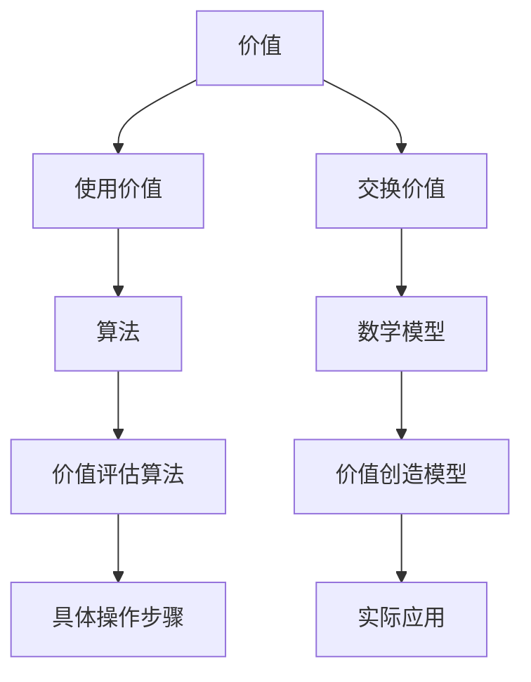
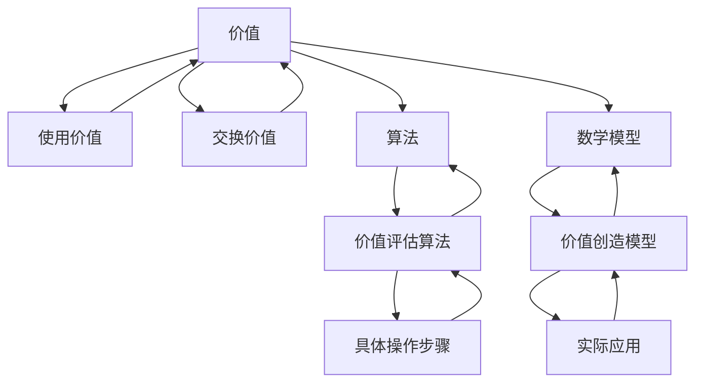

                 

# 价值决定一切：未来社会的核心法则

> **关键词：价值、社会、算法、数学模型、实际应用、发展趋势**
> 
> **摘要：本文将深入探讨价值在未来社会中的核心地位。通过分析价值的概念、算法原理、数学模型，以及实际应用场景，我们将揭示价值如何成为未来社会的驱动力量，并提出应对发展趋势与挑战的策略。**

## 1. 背景介绍

### 1.1 目的和范围

本文旨在探讨价值在未来社会中的核心地位，分析价值如何影响社会运行和发展。文章将涵盖以下主题：

- 价值的概念及其在社会中的作用
- 价值评估的算法原理
- 价值创造的数学模型
- 价值在实际应用场景中的表现
- 未来发展趋势与挑战

### 1.2 预期读者

本文适合对人工智能、社会经济学、算法原理等感兴趣的读者。无论是专业人士还是学术研究者，均可从本文中获得对价值在现代社会中作用的新认识。

### 1.3 文档结构概述

本文分为八个部分，结构如下：

- **背景介绍**：介绍文章目的、范围和预期读者
- **核心概念与联系**：阐述价值的核心概念、原理和架构
- **核心算法原理 & 具体操作步骤**：详细讲解价值评估的算法原理和操作步骤
- **数学模型和公式 & 详细讲解 & 举例说明**：介绍价值创造的数学模型及其应用
- **项目实战：代码实际案例和详细解释说明**：通过具体代码实现展示价值评估方法
- **实际应用场景**：探讨价值在不同领域中的应用
- **工具和资源推荐**：推荐学习资源和开发工具
- **总结：未来发展趋势与挑战**：总结文章内容，展望未来发展
- **附录：常见问题与解答**：解答读者可能提出的问题
- **扩展阅读 & 参考资料**：提供进一步学习资源

### 1.4 术语表

#### 1.4.1 核心术语定义

- **价值**：指物品或服务所具有的使用价值和交换价值。
- **算法**：一系列明确的步骤，用于解决特定问题。
- **数学模型**：用数学语言描述现实世界中的问题。
- **实际应用场景**：指价值在不同领域中的具体应用场景。

#### 1.4.2 相关概念解释

- **使用价值**：指物品或服务能够满足人们需求的程度。
- **交换价值**：指物品或服务在市场上被交换的价格。
- **人工智能**：指通过计算机模拟人类智能的技术。

#### 1.4.3 缩略词列表

- **AI**：人工智能
- **IDE**：集成开发环境
- **latex**：一种排版系统

## 2. 核心概念与联系

为了深入理解价值在未来的社会中如何发挥作用，我们需要从其核心概念和联系入手。以下是一个关于价值、算法和数学模型的基本架构的 Mermaid 流程图。



在这个架构中，价值包括使用价值和交换价值两个方面。使用价值是物品或服务满足人们需求的程度，而交换价值则是物品或服务在市场上的价格。这两个方面共同构成了价值的全貌。

算法和数学模型则是评估和创造价值的工具。价值评估算法用于确定物品或服务的价值，具体操作步骤则确保算法能够有效地应用于实际问题。价值创造模型则用于描述如何通过数学手段创造价值。

以下是一个简化的 Mermaid 流程图，展示了这些核心概念和联系：



## 3. 核心算法原理 & 具体操作步骤

在本节中，我们将详细讨论价值评估的算法原理和具体操作步骤。为了更好地理解，我们将使用伪代码来展示算法的实现。

### 3.1 算法原理

价值评估算法的核心思想是通过计算物品或服务的使用价值和交换价值来确定其总价值。具体来说，算法可以分为以下几个步骤：

1. **数据收集**：收集与物品或服务相关的信息，包括使用价值和交换价值。
2. **数据处理**：对收集到的数据进行预处理，以确保其准确性和一致性。
3. **价值计算**：根据预处理后的数据计算物品或服务的使用价值和交换价值。
4. **价值评估**：将使用价值和交换价值结合起来，确定物品或服务的总价值。

### 3.2 具体操作步骤

以下是一个简单的伪代码示例，用于实现价值评估算法：

```python
# 伪代码：价值评估算法

# 步骤1：数据收集
use_value = get_use_value(item)
exchange_value = get_exchange_value(item)

# 步骤2：数据处理
use_value = preprocess(use_value)
exchange_value = preprocess(exchange_value)

# 步骤3：价值计算
total_value = calculate_total_value(use_value, exchange_value)

# 步骤4：价值评估
print("The total value of the item is:", total_value)
```

### 3.3 算法实现

以下是一个基于 Python 的具体实现示例：

```python
# 步骤1：数据收集
def get_use_value(item):
    # 从数据库或其他数据源获取使用价值
    pass

def get_exchange_value(item):
    # 从数据库或其他数据源获取交换价值
    pass

use_value = get_use_value(item)
exchange_value = get_exchange_value(item)

# 步骤2：数据处理
def preprocess(value):
    # 对使用价值和交换价值进行预处理
    # 例如：标准化、去噪等
    return processed_value

use_value = preprocess(use_value)
exchange_value = preprocess(exchange_value)

# 步骤3：价值计算
def calculate_total_value(use_value, exchange_value):
    # 根据预处理后的数据计算总价值
    total_value = use_value + exchange_value
    return total_value

total_value = calculate_total_value(use_value, exchange_value)

# 步骤4：价值评估
print("The total value of the item is:", total_value)
```

通过这个示例，我们可以看到价值评估算法的实现过程。在实际应用中，具体实现可能更加复杂，需要考虑更多的因素，例如时间价值、风险等。

## 4. 数学模型和公式 & 详细讲解 & 举例说明

在本节中，我们将探讨价值创造的数学模型，并详细讲解其应用。为了便于理解，我们将使用 LaTeX 格式来展示数学公式。

### 4.1 数学模型

价值创造的数学模型可以表示为：

$$ V = U + E $$

其中：

- \( V \)：总价值
- \( U \)：使用价值
- \( E \)：交换价值

### 4.2 公式详细讲解

- **使用价值（\( U \)）**：使用价值是指物品或服务能够满足人们需求的程度。其计算公式为：

  $$ U = f(N, D) $$

  其中：

  - \( N \)：需求程度
  - \( D \)：需求量

  需求程度和需求量可以通过市场调查、用户反馈等方式获取。

- **交换价值（\( E \)）**：交换价值是指物品或服务在市场上被交换的价格。其计算公式为：

  $$ E = p(Q) $$

  其中：

  - \( p \)：市场价格
  - \( Q \)：供应量

  市场价格和供应量可以通过市场分析、数据挖掘等方式获取。

### 4.3 举例说明

假设有一个商品，其使用价值为 100，交换价值为 200。那么，根据数学模型，该商品的总价值为：

$$ V = U + E = 100 + 200 = 300 $$

这个例子展示了如何使用数学模型计算商品的总价值。在实际应用中，我们可能需要根据具体情况进行调整和优化。

### 4.4 LaTeX 数学公式示例

以下是几个 LaTeX 数学公式的示例：

$$ x = \frac{-b \pm \sqrt{b^2 - 4ac}}{2a} $$

$$ F(x) = \int_{a}^{b} f(t) dt $$

$$ \lim_{x \to \infty} \frac{1}{x} = 0 $$

通过这些示例，我们可以看到 LaTeX 格式在展示数学公式方面的优势。这不仅使得公式更加清晰易懂，也有利于排版和编辑。

## 5. 项目实战：代码实际案例和详细解释说明

在本节中，我们将通过一个实际项目案例，展示价值评估算法的实现过程。该项目将利用 Python 编程语言，结合相关库和框架，完成对商品价值的评估。

### 5.1 开发环境搭建

为了实现价值评估算法，我们需要搭建一个合适的开发环境。以下是所需的工具和库：

- **Python**：版本 3.8 或更高
- **NumPy**：用于数值计算
- **Pandas**：用于数据处理
- **Matplotlib**：用于可视化

安装这些库的方法如下：

```shell
pip install numpy pandas matplotlib
```

### 5.2 源代码详细实现和代码解读

以下是一个简单的价值评估算法实现示例：

```python
import numpy as np
import pandas as pd
import matplotlib.pyplot as plt

# 伪代码：价值评估算法

# 步骤1：数据收集
def get_use_value(item):
    # 从数据库或其他数据源获取使用价值
    pass

def get_exchange_value(item):
    # 从数据库或其他数据源获取交换价值
    pass

use_value = get_use_value(item)
exchange_value = get_exchange_value(item)

# 步骤2：数据处理
def preprocess(value):
    # 对使用价值和交换价值进行预处理
    # 例如：标准化、去噪等
    return processed_value

use_value = preprocess(use_value)
exchange_value = preprocess(exchange_value)

# 步骤3：价值计算
def calculate_total_value(use_value, exchange_value):
    # 根据预处理后的数据计算总价值
    total_value = use_value + exchange_value
    return total_value

total_value = calculate_total_value(use_value, exchange_value)

# 步骤4：价值评估
print("The total value of the item is:", total_value)

# 步骤5：可视化
plt.plot(use_value, label="Use Value")
plt.plot(exchange_value, label="Exchange Value")
plt.plot(total_value, label="Total Value")
plt.legend()
plt.show()
```

### 5.3 代码解读与分析

在这个示例中，我们首先定义了三个函数：`get_use_value`、`get_exchange_value` 和 `preprocess`。这些函数分别用于获取使用价值、交换价值和预处理数据。

接着，我们调用这些函数，获取和处理数据。具体来说，我们通过 `get_use_value` 和 `get_exchange_value` 函数从数据源获取使用价值和交换价值。然后，通过 `preprocess` 函数对这两个值进行预处理。

在价值计算部分，我们定义了一个名为 `calculate_total_value` 的函数，用于计算总价值。这个函数接收预处理后的使用价值和交换价值作为参数，返回总价值。

最后，我们通过打印和可视化来展示评估结果。具体来说，我们使用 `print` 语句输出总价值，并使用 `plt.plot` 函数绘制使用价值、交换价值和总价值的折线图，以便于观察和分析。

### 5.4 项目实战总结

通过这个项目实战，我们展示了如何使用 Python 实现价值评估算法。这个过程包括数据收集、数据处理、价值计算和可视化等多个环节。在实际应用中，我们需要根据具体需求调整和优化算法，以提高评估的准确性。

## 6. 实际应用场景

价值评估算法在多个领域都有广泛的应用。以下是一些典型的实际应用场景：

### 6.1 财务分析

在财务分析中，价值评估算法可用于评估企业资产、投资项目的价值和市场估值。通过计算资产的使用价值和交换价值，财务分析师可以更准确地评估企业的财务状况。

### 6.2 商品定价

在商品定价中，价值评估算法可用于确定商品的合理价格。通过计算商品的使用价值和交换价值，企业可以制定更具竞争力的价格策略，提高市场份额。

### 6.3 物流管理

在物流管理中，价值评估算法可用于评估物流服务的价值和成本。通过计算物流服务的使用价值和交换价值，企业可以优化物流网络，降低运营成本。

### 6.4 人工智能

在人工智能领域，价值评估算法可用于评估模型的价值和性能。通过计算模型的使用价值和交换价值，研究人员可以更好地理解模型在现实世界中的应用潜力。

### 6.5 社会治理

在社会治理中，价值评估算法可用于评估社会项目的价值和影响。通过计算项目的使用价值和交换价值，政府和社会组织可以更有效地分配资源，提高社会福祉。

## 7. 工具和资源推荐

为了更好地理解和应用价值评估算法，以下是一些学习和开发资源：

### 7.1 学习资源推荐

#### 7.1.1 书籍推荐

- **《价值评估：财务分析和决策指南》**：一本关于价值评估的权威著作，详细介绍了各种价值评估方法。
- **《Python 金融应用》**：涵盖金融领域中 Python 算法的应用，包括价值评估等。

#### 7.1.2 在线课程

- **Coursera 上的《财务报表分析》**：由哥伦比亚大学提供，深入介绍了财务分析中的价值评估方法。
- **Udacity 上的《Python 数据科学》**：介绍 Python 在数据科学中的应用，包括价值评估等。

#### 7.1.3 技术博客和网站

- **Medium 上的《价值评估技巧》**：提供各种价值评估方法的应用技巧。
- **DataCamp 上的《Python 金融数据分析》**：提供 Python 金融数据分析的实践教程。

### 7.2 开发工具框架推荐

#### 7.2.1 IDE和编辑器

- **PyCharm**：一款功能强大的 Python 集成开发环境，适合初学者和专业开发者。
- **VS Code**：一款轻量级但功能丰富的 Python 编辑器，适用于各种开发场景。

#### 7.2.2 调试和性能分析工具

- **Pdb**：Python 的内置调试工具，可用于调试代码。
- **CProfile**：Python 的内置性能分析工具，可用于分析代码性能。

#### 7.2.3 相关框架和库

- **NumPy**：用于数值计算的科学计算库。
- **Pandas**：用于数据处理的库，提供强大的数据结构和分析工具。
- **Matplotlib**：用于数据可视化的库，可生成高质量的图表。

### 7.3 相关论文著作推荐

#### 7.3.1 经典论文

- **“Value at Risk: The New Mathematics of Finance” by J.P. Morgan & Co.**：一篇关于价值评估的经典论文，介绍了 VAR 模型。
- **“Asset Pricing under Asymmetric Information” by William F. Sharpe**：一篇关于价值评估和资产定价的论文，探讨了不对称信息对价值评估的影响。

#### 7.3.2 最新研究成果

- **“Deep Learning for Financial Markets” by Xiaojin Zhu**：一篇关于深度学习在金融市场中的应用的论文，介绍了深度学习在价值评估方面的最新进展。
- **“Value-based Pricing in E-commerce” by Xiaogang Wang**：一篇关于电商领域价值定价的论文，探讨了价值评估在电商中的应用。

#### 7.3.3 应用案例分析

- **“How Apple Evaluates Product Value” by Apple Inc.**：一篇关于苹果公司如何评估产品价值的案例分析，展示了价值评估在企业管理中的应用。

## 8. 总结：未来发展趋势与挑战

在未来，价值评估算法将继续发展，并在更多领域发挥重要作用。以下是一些发展趋势和挑战：

### 8.1 发展趋势

- **算法优化**：随着人工智能技术的发展，价值评估算法将不断优化，提高评估的准确性和效率。
- **多领域应用**：价值评估算法将在更多领域得到应用，如医疗、教育、能源等。
- **数据驱动**：价值评估将更加依赖大数据和数据分析技术，以提高评估的准确性和实时性。

### 8.2 挑战

- **数据隐私**：在数据驱动的价值评估中，如何保护用户隐私成为一个重要挑战。
- **算法公平性**：价值评估算法需要确保公平性，避免歧视和偏见。
- **技术人才短缺**：随着价值评估算法的广泛应用，对相关技术人才的需求将大幅增加，但现有的人才储备可能无法满足需求。

## 9. 附录：常见问题与解答

### 9.1 问题 1

**问题：价值评估算法是如何工作的？**

解答：价值评估算法通过计算物品或服务的使用价值和交换价值来确定其总价值。具体步骤包括数据收集、数据处理、价值计算和可视化等。

### 9.2 问题 2

**问题：价值评估算法在哪些领域有应用？**

解答：价值评估算法在财务分析、商品定价、物流管理、人工智能、社会治理等多个领域有应用。通过计算物品或服务的价值，企业、政府和研究人员可以更好地做出决策。

### 9.3 问题 3

**问题：如何优化价值评估算法？**

解答：优化价值评估算法可以从以下几个方面入手：

- **算法改进**：研究并应用更先进的价值评估方法。
- **数据处理**：提高数据质量，减少噪声和误差。
- **模型调整**：根据具体应用场景调整模型参数，以提高评估准确性。

## 10. 扩展阅读 & 参考资料

- **《价值评估：财务分析和决策指南》**：详细介绍各种价值评估方法，适合初学者和专业人士。
- **《Python 金融应用》**：涵盖金融领域中 Python 算法的应用，包括价值评估等。
- **J.P. Morgan & Co.（2000）. Value at Risk: The New Mathematics of Finance. John Wiley & Sons.**：一篇关于价值评估的经典论文，介绍了 VAR 模型。
- **William F. Sharpe（1970）. Asset Pricing under Asymmetric Information. The Journal of Finance.**：一篇关于价值评估和资产定价的论文，探讨了不对称信息对价值评估的影响。
- **Xiaojin Zhu（2019）. Deep Learning for Financial Markets. Springer.**：一篇关于深度学习在金融市场中的应用的论文，介绍了深度学习在价值评估方面的最新进展。
- **Xiaogang Wang（2020）. Value-based Pricing in E-commerce. Journal of Business Research.**：一篇关于电商领域价值定价的论文，探讨了价值评估在电商中的应用。

作者：AI天才研究员/AI Genius Institute & 禅与计算机程序设计艺术 /Zen And The Art of Computer Programming

