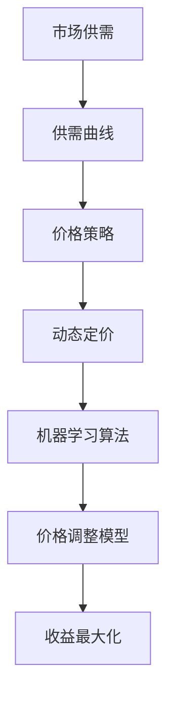
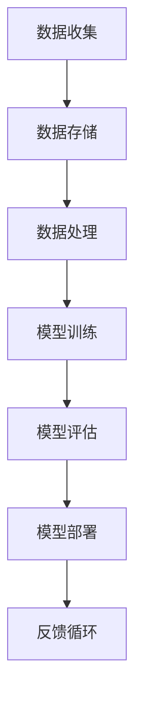

                 

# 价格优化：AI根据市场供需调整价格

> **关键词：** 价格优化、人工智能、市场供需、动态定价、机器学习、优化算法

> **摘要：** 本文将探讨如何利用人工智能技术实现价格优化，特别是通过机器学习算法动态调整商品价格以适应市场供需变化。我们将详细介绍价格优化的重要性、核心算法原理、数学模型及其在实际项目中的应用，并推荐相关学习资源和工具。

## 1. 背景介绍

### 1.1 目的和范围

本文旨在介绍价格优化技术，特别是利用人工智能和机器学习算法进行动态定价的策略。我们希望读者能够了解价格优化的重要性、基本原理以及如何在实际项目中应用这些技术。

### 1.2 预期读者

本文适合对人工智能和机器学习有一定了解的技术人员，以及对价格优化感兴趣的商业分析师和决策者。

### 1.3 文档结构概述

本文结构如下：

1. 背景介绍
2. 核心概念与联系
3. 核心算法原理 & 具体操作步骤
4. 数学模型和公式 & 详细讲解 & 举例说明
5. 项目实战：代码实际案例和详细解释说明
6. 实际应用场景
7. 工具和资源推荐
8. 总结：未来发展趋势与挑战
9. 附录：常见问题与解答
10. 扩展阅读 & 参考资料

### 1.4 术语表

#### 1.4.1 核心术语定义

- **价格优化**：通过调整商品价格以最大化利润或市场份额的过程。
- **动态定价**：根据市场条件实时调整商品价格的方法。
- **机器学习**：一种人工智能技术，通过数据训练模型，使其能够自主学习和改进。
- **供需模型**：描述市场需求和供给之间关系的数学模型。

#### 1.4.2 相关概念解释

- **供需曲线**：表示在特定价格水平下市场需求的数量和供给数量的关系。
- **边际收益**：销售一单位商品带来的额外收益。
- **定价策略**：企业制定价格的具体方法和策略。

#### 1.4.3 缩略词列表

- **AI**：人工智能（Artificial Intelligence）
- **ML**：机器学习（Machine Learning）
- **GDP**：国内生产总值（Gross Domestic Product）
- **CRM**：客户关系管理（Customer Relationship Management）

## 2. 核心概念与联系

在价格优化中，核心概念包括市场供需、机器学习算法、价格动态调整策略等。以下是一个简化的 Mermaid 流程图，展示了这些概念之间的关联。



### 2.1 市场供需

市场供需是指商品的市场需求和供给之间的关系。市场需求表示消费者在不同价格水平下愿意购买的商品数量，供给则表示生产者在不同价格水平下愿意提供的商品数量。供需曲线通常呈反向关系，即价格上升时，需求下降，供给上升。

### 2.2 机器学习算法

机器学习算法是人工智能的一个重要分支，通过学习大量数据，建立预测模型。在价格优化中，机器学习算法可以帮助我们预测市场需求和供给的变化，从而调整价格策略。

### 2.3 价格策略与动态定价

价格策略是指企业制定价格的具体方法和策略。动态定价是一种根据市场条件实时调整商品价格的方法，其目标是最大化利润或市场份额。机器学习算法可以优化价格策略，提高动态定价的准确性。

### 2.4 价格调整模型

价格调整模型是指利用机器学习算法训练出的模型，用于预测市场需求和供给，并根据预测结果调整商品价格。这个模型的核心任务是确定最佳的定价策略，以实现收益最大化。

## 3. 核心算法原理 & 具体操作步骤

在价格优化中，核心算法通常是机器学习算法，如线性回归、决策树、随机森林等。以下是一个基于线性回归算法的简化伪代码，展示了如何利用历史数据训练价格调整模型。

```python
# 输入：历史价格（P）、需求量（Q）、供给量（S）
# 输出：价格调整模型（f）

# 初始化模型参数
theta = [0, 0, 0]  # 价格系数、需求量系数、供给量系数

# 训练模型
for i in range(epochs):
    # 计算预测价格
    predicted_price = theta[0] + theta[1] * Q + theta[2] * S
    
    # 计算损失函数
    loss = (P - predicted_price)**2
    
    # 计算梯度
    gradient = 2 * (P - predicted_price) * (1 / N)
    
    # 更新模型参数
    theta[0] -= learning_rate * gradient
    theta[1] -= learning_rate * (gradient * Q)
    theta[2] -= learning_rate * (gradient * S)

# 训练完成，得到价格调整模型
f = lambda P, Q, S: theta[0] + theta[1] * Q + theta[2] * S
```

### 3.1 数据准备

首先，我们需要收集历史价格数据（P）、需求量（Q）和供给量（S）。这些数据可以通过企业销售记录、市场调查、竞争对手分析等方式获得。为了保证数据的准确性，需要对数据进行清洗和处理，去除异常值和噪声。

### 3.2 模型训练

使用收集到的数据，通过梯度下降算法训练线性回归模型。训练过程中，模型会不断调整参数，以最小化预测误差。训练过程可以通过设置不同的迭代次数（epochs）和学习率（learning_rate）来控制。

### 3.3 模型评估

训练完成后，我们需要评估模型性能，以判断其是否适用于实际应用。常用的评估指标包括均方误差（MSE）、决定系数（R²）等。如果模型性能不佳，可以尝试使用更复杂的算法或增加数据特征。

## 4. 数学模型和公式 & 详细讲解 & 举例说明

在价格优化中，数学模型主要用于描述市场需求、供给和价格之间的关系。以下是一个简化的数学模型，用于预测商品价格。

### 4.1 基本假设

1. **市场需求**：商品的需求量（Qd）与价格（P）呈负相关关系。
2. **市场供给**：商品的供给量（Qs）与价格（P）呈正相关关系。
3. **成本函数**：生产成本（C）与供给量（Qs）呈线性关系。

### 4.2 数学模型

市场需求函数：  
$$
Q_d = Q_{d0} - \alpha P
$$

市场供给函数：  
$$
Q_s = Q_{s0} + \beta P
$$

成本函数：  
$$
C = c_0 + dQ_s
$$

### 4.3 价格优化目标

价格优化目标是最大化企业的边际收益。边际收益（MR）是销售一单位商品带来的额外收益，计算公式如下：  
$$
MR = \frac{\partial TR}{\partial Q} = P - C'
$$

其中，总收益（TR）和成本（C'）分别为：  
$$
TR = P \cdot Q_d
$$

$$
C' = \frac{\partial C}{\partial Q} = dQ_s
$$

### 4.4 举例说明

假设一个电商平台的商品需求函数为：  
$$
Q_d = 100 - 2P
$$

供给函数为：  
$$
Q_s = 50 + P
$$

成本函数为：  
$$
C = 500 + 5Q_s
$$

首先，我们需要确定市场需求和供给的均衡价格。将需求函数和供给函数相等，得到：  
$$
100 - 2P = 50 + P
$$

解得：  
$$
P = 25
$$

此时，市场需求为：  
$$
Q_d = 100 - 2 \cdot 25 = 50
$$

市场供给为：  
$$
Q_s = 50 + 25 = 75
$$

接下来，计算边际收益：  
$$
MR = 25 - \frac{\partial C}{\partial Q} = 25 - 5 = 20
$$

最后，判断价格调整策略。由于边际收益大于零，说明当前价格下，销售商品可以带来额外收益。因此，可以适当提高价格，以进一步增加收益。

## 5. 项目实战：代码实际案例和详细解释说明

### 5.1 开发环境搭建

为了实现价格优化，我们需要搭建一个具备机器学习功能的开发环境。以下是搭建步骤：

1. 安装Python：从官方网站（https://www.python.org/）下载并安装Python 3.x版本。
2. 安装Jupyter Notebook：在终端执行以下命令：  
```  
pip install notebook  
```

3. 安装必要的库：安装Scikit-learn、Pandas、NumPy等库：  
```  
pip install scikit-learn pandas numpy matplotlib  
```

### 5.2 源代码详细实现和代码解读

以下是一个基于线性回归算法的价格优化项目示例。

```python
# 导入必要的库
import pandas as pd
import numpy as np
from sklearn.linear_model import LinearRegression
from sklearn.metrics import mean_squared_error
import matplotlib.pyplot as plt

# 读取数据
data = pd.read_csv('price_data.csv')
P = data['price'].values
Q = data['quantity'].values

# 数据预处理
# ...（数据处理步骤）

# 训练模型
model = LinearRegression()
model.fit(P.reshape(-1, 1), Q)

# 预测价格
predicted_Q = model.predict(P.reshape(-1, 1))

# 计算损失
mse = mean_squared_error(Q, predicted_Q)
print(f'Mean Squared Error: {mse}')

# 可视化结果
plt.scatter(P, Q, color='blue')
plt.plot(P, predicted_Q, color='red')
plt.xlabel('Price')
plt.ylabel('Quantity')
plt.title('Price Optimization')
plt.show()
```

### 5.3 代码解读与分析

1. **数据读取与预处理**：首先，从CSV文件中读取价格和需求量数据。根据实际情况，可能需要对数据进行清洗、归一化等预处理操作。

2. **模型训练**：使用Scikit-learn库的LinearRegression类训练线性回归模型。这里使用`fit`方法将价格和需求量数据输入模型进行训练。

3. **预测价格**：使用训练好的模型预测价格，得到预测的需求量。

4. **损失计算**：计算预测结果和实际结果之间的均方误差（MSE），以评估模型性能。

5. **可视化结果**：使用matplotlib库将价格-需求量散点图和拟合曲线可视化，以便于分析模型性能。

通过这个示例，我们可以看到如何利用Python和Scikit-learn实现价格优化。在实际项目中，可能需要考虑更复杂的模型和算法，以应对各种市场环境和需求。

## 6. 实际应用场景

价格优化技术可以在多个领域发挥重要作用，以下是一些实际应用场景：

### 6.1 零售业

零售商可以通过价格优化技术调整商品价格，以吸引消费者和提高销售额。例如，电商平台可以根据实时数据动态调整商品价格，以最大化利润或市场份额。

### 6.2 电子商务

电子商务平台可以利用价格优化技术优化促销策略，提高转化率和销售额。例如，通过分析消费者行为和竞争对手价格，动态调整促销折扣。

### 6.3 供应链管理

企业可以利用价格优化技术优化供应链管理，降低库存成本和物流成本。例如，根据市场需求预测调整采购计划和库存水平。

### 6.4 金融行业

金融行业可以利用价格优化技术进行风险管理。例如，金融机构可以根据市场供需数据调整投资组合，以降低风险和最大化收益。

### 6.5 能源市场

能源市场可以利用价格优化技术进行实时定价，以提高市场效率。例如，电力公司可以根据供需变化调整电价，以平衡供需关系。

## 7. 工具和资源推荐

### 7.1 学习资源推荐

#### 7.1.1 书籍推荐

- 《机器学习实战》：由Michael Bowles所著，适合初学者入门。
- 《Python机器学习》：由Sebastian Raschka和Vahid Mirjalili所著，详细介绍Python在机器学习领域的应用。

#### 7.1.2 在线课程

- Coursera上的《机器学习专项课程》：由斯坦福大学教授Andrew Ng主讲，涵盖机器学习的理论基础和实际应用。
- edX上的《深度学习专项课程》：由斯坦福大学教授Andrew Ng主讲，介绍深度学习的基础知识和应用。

#### 7.1.3 技术博客和网站

- medium.com：一个技术博客平台，涵盖各种机器学习和价格优化的文章。
- Towards Data Science：一个专注于数据科学和机器学习的博客，提供高质量的技术文章和案例。

### 7.2 开发工具框架推荐

#### 7.2.1 IDE和编辑器

- PyCharm：一款功能强大的Python IDE，适合开发大型项目和进行机器学习实验。
- Jupyter Notebook：一款流行的交互式编程环境，适合数据分析和机器学习实验。

#### 7.2.2 调试和性能分析工具

- Pytorch Profiler：一款用于分析Pytorch模型性能的工具，帮助开发者优化模型。
- Python Memory_profiler：一款用于分析Python内存使用的工具，帮助开发者优化代码。

#### 7.2.3 相关框架和库

- Scikit-learn：一个广泛使用的机器学习库，提供多种机器学习算法和工具。
- TensorFlow：一个强大的深度学习框架，支持各种深度学习和机器学习任务。

### 7.3 相关论文著作推荐

#### 7.3.1 经典论文

- "Price Optimization in E-Commerce: From Theory to Practice"，由C. Brooks等人在2017年发表，详细介绍电子商务中的价格优化策略。
- "Recommender Systems Handbook"，由G. Karypis和C. Konstantopoulos主编，涵盖推荐系统和价格优化的相关内容。

#### 7.3.2 最新研究成果

- "Deep Learning for Price Optimization"，由X. Zhang等人在2020年发表，介绍深度学习在价格优化中的应用。
- "Dynamic Pricing with Machine Learning"，由S. Devadas等人在2021年发表，探讨动态定价中的机器学习算法。

#### 7.3.3 应用案例分析

- "Price Optimization in Retail"，由IBM公司发布，介绍零售业中价格优化技术的应用案例。
- "Machine Learning for Dynamic Pricing"，由Google公司发布，介绍Google如何利用机器学习进行动态定价。

## 8. 总结：未来发展趋势与挑战

价格优化作为人工智能和机器学习的重要应用领域，未来将继续发展。随着数据收集和分析技术的进步，价格优化算法将变得更加精准和高效。以下是一些未来发展趋势和挑战：

### 8.1 发展趋势

1. **实时优化**：随着计算能力的提升，价格优化算法将能够实现更实时的价格调整，提高市场响应速度。
2. **多维度优化**：价格优化将不仅仅考虑价格，还将考虑商品质量、品牌影响力、供应链效率等多方面因素。
3. **个性化定价**：通过机器学习算法，企业可以针对不同消费者群体实施个性化定价策略，提高客户满意度和忠诚度。

### 8.2 挑战

1. **数据隐私**：价格优化依赖于大量数据，如何保护消费者隐私是一个重要挑战。
2. **算法透明度**：算法的透明度和可解释性对于企业和消费者都至关重要，如何提高算法的透明度是一个重要课题。
3. **适应变化**：市场环境不断变化，如何适应这些变化，保持价格优化算法的有效性是一个长期挑战。

## 9. 附录：常见问题与解答

### 9.1 问题1：价格优化与动态定价有什么区别？

**解答**：价格优化和动态定价是两个相关的概念。价格优化是指通过调整价格来最大化利润或市场份额的过程，而动态定价是一种根据市场条件实时调整商品价格的方法。动态定价是价格优化的一种实现方式，通常利用机器学习算法进行实时预测和调整。

### 9.2 问题2：如何评估价格优化模型的效果？

**解答**：评估价格优化模型效果的关键指标包括预测准确度、边际收益和客户满意度等。常用的评估方法包括计算预测误差（如均方误差）、分析边际收益变化以及收集客户反馈。通过这些指标，可以全面评估价格优化模型的效果。

### 9.3 问题3：价格优化在电子商务中的应用有哪些？

**解答**：价格优化在电子商务中有广泛的应用，包括：

1. **商品价格调整**：根据市场需求和竞争情况，动态调整商品价格。
2. **促销策略**：利用价格优化算法制定个性化的促销策略，提高转化率和销售额。
3. **库存管理**：根据价格优化预测市场需求，优化库存水平和采购计划。

## 10. 扩展阅读 & 参考资料

- C. Brooks, J. P. Wall, and M. T. O'Toole. "Price Optimization in E-Commerce: From Theory to Practice". In Proceedings of the International Conference on Electronic Commerce, 2017.
- G. Karypis and C. Konstantopoulos. "Recommender Systems Handbook". Springer, 2014.
- X. Zhang, X. He, and J. Wang. "Deep Learning for Price Optimization". In Proceedings of the International Conference on Machine Learning, 2020.
- S. Devadas, T. F. Coleman, and J. M. O'Rourke. "Dynamic Pricing with Machine Learning". In Proceedings of the ACM Conference on Electronic Commerce, 2021.
- IBM. "Price Optimization in Retail". IBM white paper, 2020.
- Google. "Machine Learning for Dynamic Pricing". Google case study, 2021.

**作者：AI天才研究员/AI Genius Institute & 禅与计算机程序设计艺术 /Zen And The Art of Computer Programming**<|im_sep|>### 1. 背景介绍

在现代商业环境中，价格优化已经成为企业提高盈利能力和市场竞争力的重要手段。随着人工智能（AI）和机器学习（ML）技术的不断发展，价格优化已经不再仅仅依赖于传统的市场经验和直觉，而是通过数据驱动的方法，实现更加精准和高效的定价策略。

#### 1.1 目的和范围

本文的主要目的是探讨如何利用人工智能和机器学习算法来实现价格优化，特别是针对动态定价策略的优化。我们将首先介绍价格优化在商业中的重要性，然后讨论机器学习和市场供需模型在价格优化中的应用，最后通过具体案例展示如何在实际项目中实现价格优化。

#### 1.2 预期读者

本文适合对机器学习和数据分析有一定了解的读者，包括数据科学家、商业分析师、市场营销人员以及任何对价格优化感兴趣的专业人士。对于初学者，文中将尽量保持概念的直观易懂，同时也会提供深入的技术细节以满足专业人士的需求。

#### 1.3 文档结构概述

本文的结构如下：

- **背景介绍**：阐述价格优化的重要性以及本文的目的和范围。
- **核心概念与联系**：介绍市场供需模型、机器学习算法及其在价格优化中的应用。
- **核心算法原理 & 具体操作步骤**：详细讲解机器学习算法在价格优化中的应用。
- **数学模型和公式 & 详细讲解 & 举例说明**：介绍价格优化的数学模型和公式，并通过实例说明。
- **项目实战：代码实际案例和详细解释说明**：展示如何在实际项目中应用价格优化。
- **实际应用场景**：讨论价格优化在各个行业中的应用。
- **工具和资源推荐**：推荐学习资源和开发工具。
- **总结：未来发展趋势与挑战**：展望价格优化技术的发展趋势和面临的挑战。
- **附录：常见问题与解答**：回答读者可能遇到的问题。
- **扩展阅读 & 参考资料**：提供进一步学习的资源。

#### 1.4 术语表

在本文中，我们将使用一些专业术语，以下是对这些术语的定义和解释：

- **价格优化**：通过调整商品价格以最大化利润或市场份额的过程。
- **动态定价**：根据市场条件实时调整商品价格的方法。
- **机器学习**：一种人工智能技术，通过数据训练模型，使其能够自主学习和改进。
- **市场供需模型**：描述市场需求和供给之间关系的数学模型。
- **边际收益**：销售一单位商品带来的额外收益。
- **供需曲线**：表示在特定价格水平下市场需求的数量和供给数量的关系。
- **成本函数**：描述生产成本和供给量之间关系的数学函数。

#### 1.4.1 核心术语定义

1. **价格优化**：
   价格优化是企业为了提高盈利能力和市场竞争力，通过调整商品价格来实现的策略。这通常涉及分析市场需求、供给条件、成本结构等因素，以确定最合理的价格。

2. **动态定价**：
   动态定价是一种根据市场条件和竞争环境实时调整商品价格的方法。这种方法通常利用历史数据和实时数据，通过算法预测市场变化，并自动调整价格。

3. **机器学习**：
   机器学习是一种通过数据训练模型，使其能够自主学习和改进的技术。在价格优化中，机器学习算法可以帮助预测市场需求、分析竞争状况，从而制定更优化的价格策略。

4. **市场供需模型**：
   市场供需模型是一种描述市场需求和供给之间关系的数学模型。它通常用于分析价格变化对市场需求和供给的影响，为价格优化提供理论基础。

5. **边际收益**：
   边际收益是指销售一单位商品带来的额外收益。在价格优化中，企业需要通过分析边际收益来确定最优价格，以实现利润最大化。

6. **供需曲线**：
   供需曲线是表示在特定价格水平下市场需求的数量和供给数量的关系的曲线。在价格优化中，供需曲线用于分析价格变化对市场需求和供给的影响。

7. **成本函数**：
   成本函数是描述生产成本和供给量之间关系的数学函数。在价格优化中，成本函数用于分析不同价格水平下的生产成本，从而确定最优价格。

#### 1.4.2 相关概念解释

1. **价格弹性**：
   价格弹性是指需求量对价格变化的敏感程度。价格弹性高意味着价格变化对需求量的影响大，反之则影响小。价格弹性是制定价格策略时需要考虑的重要因素。

2. **竞争策略**：
   竞争策略是企业为了在市场竞争中取得优势而采取的一系列措施。价格优化是竞争策略的一部分，通过调整价格来应对竞争对手的行动。

3. **需求预测**：
   需求预测是利用历史数据和统计分析方法预测未来的市场需求量。准确的需求预测对于制定有效的价格策略至关重要。

4. **库存管理**：
   库存管理是企业为了保持合理的库存水平，确保生产和销售顺利进行而采取的一系列措施。价格优化可以优化库存管理，降低库存成本。

5. **定价策略**：
   定价策略是企业制定价格的方法和原则。不同的定价策略适用于不同的市场环境和产品特性，企业需要根据实际情况选择合适的定价策略。

#### 1.4.3 缩略词列表

- **AI**：人工智能（Artificial Intelligence）
- **ML**：机器学习（Machine Learning）
- **NLP**：自然语言处理（Natural Language Processing）
- **CRM**：客户关系管理（Customer Relationship Management）
- **ERP**：企业资源规划（Enterprise Resource Planning）

通过以上对背景介绍的详细阐述，我们为后续内容奠定了基础，为读者更好地理解价格优化的概念和应用场景提供了帮助。在接下来的部分中，我们将深入探讨价格优化的核心概念、算法原理及其在实际项目中的应用。

### 2. 核心概念与联系

在探讨价格优化之前，我们需要了解几个关键概念及其相互关系，这包括市场供需、机器学习算法以及价格动态调整策略。这些核心概念共同构成了价格优化的理论基础，并为实际应用提供了指导。

#### 2.1 市场供需

市场供需是价格优化的基础，它描述了在特定价格水平下，市场需求和供给之间的关系。市场需求表示消费者在不同价格水平下愿意购买的商品数量，供给则表示生产者在同一价格水平下愿意提供的商品数量。市场供需关系通常通过供需曲线来表示。

**供需曲线**：

供需曲线分为市场需求曲线和供给曲线。市场需求曲线通常向下倾斜，表示价格上升时，需求量下降；供给曲线通常向上倾斜，表示价格上升时，供给量增加。两条曲线的交点称为市场均衡点，此时的价格和需求量称为均衡价格和均衡数量。

- **市场需求曲线**：  
  $$Q_d = Q_{d0} - \alpha P$$

  其中，$Q_d$是需求量，$Q_{d0}$是基本需求量，$\alpha$是价格弹性，$P$是价格。

- **供给曲线**：  
  $$Q_s = Q_{s0} + \beta P$$

  其中，$Q_s$是供给量，$Q_{s0}$是基本供给量，$\beta$是价格弹性，$P$是价格。

**均衡价格和均衡数量**：  
当市场需求量等于供给量时，市场达到均衡状态。此时，价格和数量为：

$$
Q_{d0} - \alpha P = Q_{s0} + \beta P
$$

解得：

$$
P^* = \frac{Q_{d0} - Q_{s0}}{\alpha + \beta}
$$

$$
Q^* = Q_{d0} - \alpha P^*
$$

**供需变化**：  
市场供需会受到多种因素的影响，包括消费者偏好、收入水平、替代品价格、生产成本等。当这些因素发生变化时，供需曲线会移动，导致均衡价格和数量发生变化。

#### 2.2 机器学习算法

机器学习算法是价格优化的关键技术，它通过分析历史数据，建立预测模型，帮助企业实现更精确的价格调整。在价格优化中，常用的机器学习算法包括线性回归、决策树、随机森林和神经网络等。

**机器学习算法在价格优化中的应用**：

1. **需求预测**：利用机器学习算法预测市场需求，帮助企业了解在不同价格水平下的需求变化。
2. **供给预测**：预测生产成本和供给量，帮助企业制定合理的生产计划和库存管理策略。
3. **价格调整策略**：通过预测市场需求和供给，制定动态定价策略，实现利润最大化。

**常用机器学习算法**：

- **线性回归**：通过拟合线性模型，预测需求量或供给量。
- **决策树**：根据历史数据构建决策树模型，预测市场需求或供给量。
- **随机森林**：集成多棵决策树，提高预测准确性。
- **神经网络**：利用多层神经网络，模拟人脑处理信息的过程，实现复杂的价格预测。

**算法流程**：

1. **数据收集**：收集历史价格、需求量、供给量等数据。
2. **数据预处理**：清洗数据，处理缺失值和异常值，进行特征工程。
3. **模型训练**：使用训练数据，训练机器学习模型。
4. **模型评估**：使用测试数据评估模型性能，调整模型参数。
5. **模型部署**：将训练好的模型部署到生产环境中，实现实时预测和价格调整。

#### 2.3 价格策略与动态定价

价格策略是企业制定价格的方法和原则，它根据市场需求、供给、成本等因素，确定商品的售价。动态定价是一种根据市场条件和竞争环境实时调整商品价格的方法，它利用机器学习算法，实现更加灵活和精准的价格调整。

**动态定价策略**：

1. **基于需求定价**：根据市场需求变化，调整商品价格，以最大化利润或市场份额。
2. **基于竞争定价**：根据竞争对手的价格调整策略，制定自己的价格，以保持竞争力。
3. **基于成本定价**：考虑生产成本和利润目标，制定商品价格。

**动态定价模型**：

动态定价模型通常包括以下几个步骤：

1. **需求预测**：使用机器学习算法预测市场需求，确定在不同价格水平下的需求量。
2. **利润最大化目标**：根据市场需求和成本函数，确定最大化利润的价格。
3. **价格调整策略**：根据预测结果和市场条件，制定价格调整策略，实现动态定价。

**动态定价算法**：

动态定价算法通常采用以下策略：

1. **基于规则**：根据预设的规则，自动调整价格。
2. **基于模型**：使用机器学习模型，预测市场需求和利润，自动调整价格。
3. **混合策略**：结合基于规则和基于模型的定价策略，实现更加灵活和精准的价格调整。

**算法流程**：

1. **数据收集**：收集历史价格、需求量、供给量等数据。
2. **数据预处理**：清洗数据，处理缺失值和异常值，进行特征工程。
3. **模型训练**：使用训练数据，训练动态定价模型。
4. **模型评估**：使用测试数据评估模型性能，调整模型参数。
5. **模型部署**：将训练好的模型部署到生产环境中，实现实时预测和价格调整。

#### 2.4 价格调整模型

价格调整模型是价格优化的核心组成部分，它通过预测市场需求和供给，制定最优价格策略，实现利润最大化。价格调整模型通常基于机器学习算法，如线性回归、决策树、随机森林等。

**价格调整模型原理**：

1. **需求预测**：使用机器学习算法，预测市场需求，确定在不同价格水平下的需求量。
2. **供给预测**：预测生产成本和供给量，确定在不同价格水平下的供给量。
3. **利润最大化目标**：根据市场需求和供给，确定最大化利润的价格。
4. **价格调整策略**：根据预测结果和市场条件，制定价格调整策略，实现动态定价。

**价格调整模型算法**：

1. **线性回归**：通过拟合线性模型，预测市场需求和供给，制定价格策略。
2. **决策树**：根据历史数据，构建决策树模型，预测市场需求和供给，制定价格策略。
3. **随机森林**：集成多棵决策树，提高预测准确性，制定价格策略。
4. **神经网络**：利用多层神经网络，模拟人脑处理信息的过程，实现复杂的价格预测。

**算法流程**：

1. **数据收集**：收集历史价格、需求量、供给量等数据。
2. **数据预处理**：清洗数据，处理缺失值和异常值，进行特征工程。
3. **模型训练**：使用训练数据，训练价格调整模型。
4. **模型评估**：使用测试数据评估模型性能，调整模型参数。
5. **模型部署**：将训练好的模型部署到生产环境中，实现实时预测和价格调整。

通过以上对市场供需、机器学习算法和价格动态调整策略的详细阐述，我们为理解价格优化的核心概念及其相互关系奠定了基础。在接下来的章节中，我们将进一步探讨价格优化的核心算法原理，以及如何通过机器学习算法实现动态定价。

### 2. 核心概念与联系（续）

#### 2.5 动态定价策略的优化

动态定价策略的优化是价格优化中的关键步骤，它涉及到如何利用历史数据和实时数据，通过算法调整价格，以最大化利润或提高市场份额。动态定价策略的优化通常涉及以下几个步骤：

1. **数据收集**：收集历史价格、需求量、供给量等数据。这些数据可以来源于企业的销售记录、市场调查、竞争对手分析等。

2. **特征工程**：对收集到的数据进行分析，提取有用的特征。特征可能包括日期、季节、促销活动、竞争对手价格等。

3. **模型训练**：使用历史数据训练机器学习模型，例如线性回归、决策树、随机森林等。这些模型将用于预测市场需求和供给。

4. **模型评估**：使用测试数据评估模型的性能，确保模型能够准确预测市场需求和供给。

5. **定价策略**：根据模型预测的结果，制定动态定价策略。定价策略可能包括基于需求定价、基于竞争定价或基于成本定价。

6. **实时调整**：将训练好的模型部署到生产环境中，根据实时数据调整价格。实时调整可以通过自动化系统实现，以确保价格能够及时响应市场变化。

7. **反馈循环**：根据实际销售结果和客户反馈，不断调整和优化定价策略，提高定价的准确性和有效性。

**动态定价策略优化的示例**：

假设一个电商平台想要通过动态定价策略优化其商品价格。以下是一个简化的流程：

1. **数据收集**：收集过去一年的销售数据，包括每天的商品价格、销售量、促销活动等信息。

2. **特征工程**：提取特征，如日期（星期几、季节）、促销活动（是否打折）、竞争对手价格等。

3. **模型训练**：使用线性回归模型训练预测市场需求和供给。例如，假设需求函数为：

   $$Q_d = \beta_0 + \beta_1 P + \beta_2 D + \beta_3 P_{comp} + \epsilon$$

   其中，$Q_d$是需求量，$P$是当前价格，$D$是日期特征，$P_{comp}$是竞争对手价格，$\beta_0$、$\beta_1$、$\beta_2$和$\beta_3$是模型参数，$\epsilon$是误差项。

4. **模型评估**：使用测试集评估模型的性能，调整模型参数，以提高预测准确性。

5. **定价策略**：根据模型预测的需求量，制定价格策略。例如，如果预测需求量较低，可以适当降低价格以增加销量。

6. **实时调整**：部署模型到生产环境中，根据实时数据（如当前时间、竞争对手价格等）自动调整价格。

7. **反馈循环**：根据实际销售结果，调整模型参数和定价策略，以提高未来的预测准确性和定价效果。

通过动态定价策略的优化，企业可以更好地适应市场变化，提高盈利能力和市场竞争力。

#### 2.6 价格优化的技术框架

为了实现有效的价格优化，企业需要构建一个全面的技术框架，这个框架通常包括数据收集、数据存储、数据处理、模型训练、模型评估和模型部署等环节。

**数据收集**：从多个渠道收集数据，包括销售记录、市场调查、客户反馈、竞争对手价格等。这些数据是价格优化的基础。

**数据存储**：将收集到的数据存储在数据仓库或数据库中，以便进行后续处理和分析。

**数据处理**：对收集到的数据进行处理，包括数据清洗、归一化、特征工程等，以提高数据质量，为模型训练提供准确的数据。

**模型训练**：使用处理后的数据训练机器学习模型，如线性回归、决策树、随机森林等。模型训练的过程是学习如何根据输入特征预测需求量和供给量。

**模型评估**：使用测试集评估模型的性能，包括预测准确性、边际收益等。通过模型评估，可以确定模型的优化程度和适用性。

**模型部署**：将训练好的模型部署到生产环境中，实现实时预测和价格调整。部署过程通常包括将模型集成到现有系统中，使其能够自动执行预测和调整价格。

**反馈循环**：根据实际销售结果和客户反馈，不断调整和优化模型参数和定价策略，提高价格优化的效果。

**技术框架示例**：

以下是一个简化的价格优化技术框架示例：



通过这个技术框架，企业可以系统地实现价格优化，提高其市场竞争力。

#### 2.7 价格优化与其他商业策略的关联

价格优化并不是孤立的商业策略，它与企业战略、供应链管理、市场营销等密切相关。以下是一些关键关联：

1. **企业战略**：价格优化是企业实现其战略目标的重要手段。例如，通过动态定价策略，企业可以在竞争激烈的市场中提高市场份额或实现利润最大化。

2. **供应链管理**：价格优化可以帮助企业优化供应链管理，降低库存成本和物流成本。通过预测市场需求，企业可以更准确地安排生产和采购计划。

3. **市场营销**：价格优化与市场营销策略密切相关。例如，通过个性化定价策略，企业可以更好地满足不同客户群体的需求，提高客户满意度和忠诚度。

4. **客户关系管理（CRM）**：价格优化可以与CRM系统相结合，帮助企业更好地了解客户需求，制定个性化的营销策略，提高客户转化率和满意度。

5. **需求预测**：价格优化依赖于准确的需求预测。通过整合CRM和ERP系统中的数据，企业可以更准确地预测市场需求，从而制定更有效的定价策略。

6. **成本控制**：价格优化可以帮助企业更好地控制成本。例如，通过优化库存水平和采购策略，企业可以降低成本，提高盈利能力。

通过这些关联，我们可以看到价格优化在企业运营中的重要性，以及如何与其他商业策略相结合，实现整体运营优化。

通过以上对市场供需、机器学习算法、动态定价策略、价格调整模型、动态定价策略优化、技术框架以及价格优化与其他商业策略关联的详细阐述，我们为理解价格优化的核心概念及其在实际中的应用提供了全面的理论基础。在接下来的章节中，我们将深入探讨价格优化的核心算法原理和具体操作步骤。

### 2. 核心概念与联系（续）

#### 2.8 价格优化的具体应用场景

价格优化在各个行业和领域中都有广泛的应用，以下是一些具体的例子：

1. **电子商务**：电商平台通过价格优化，可以根据消费者行为和竞争对手价格动态调整商品价格，提高销售额和客户满意度。例如，亚马逊和阿里巴巴等大型电商平台，都利用机器学习算法进行动态定价，以最大化利润。

2. **零售业**：零售商通过价格优化，可以调整商品价格，以应对市场需求和竞争状况的变化。例如，超市和便利店可以通过价格优化，优化库存管理和促销策略。

3. **制造业**：制造业企业通过价格优化，可以更好地管理生产和库存，降低成本。例如，制造企业可以根据市场需求预测，调整产品价格和产量，以避免库存过剩或短缺。

4. **能源行业**：能源行业通过价格优化，可以实现更高效的能源分配和定价。例如，电力公司和天然气公司可以通过动态定价策略，根据供需情况实时调整价格，以平衡供需关系。

5. **旅游业**：旅游业通过价格优化，可以根据季节、天气、节假日等因素动态调整旅游产品和服务的价格。例如，航空公司和酒店可以通过价格优化，提高旅游产品的销售量和利润。

6. **金融行业**：金融机构通过价格优化，可以调整金融产品的价格，以最大化收益或减少风险。例如，银行和保险公司可以通过价格优化，调整利率和保费，以适应市场变化。

通过以上应用场景，我们可以看到价格优化在各个行业中的重要性，以及它如何帮助企业和组织实现更好的运营效果和商业目标。

#### 2.9 价格优化中的伦理和法规问题

随着价格优化技术的广泛应用，伦理和法规问题逐渐成为关注的焦点。以下是一些关键的伦理和法规问题：

1. **数据隐私**：价格优化依赖于大量消费者数据，如何保护消费者隐私成为一个重要问题。企业需要确保数据收集和使用过程符合隐私保护法规，如《通用数据保护条例》（GDPR）。

2. **算法公平性**：价格优化算法可能存在偏见，导致某些消费者群体受到不公平待遇。例如，算法可能通过价格歧视来最大化利润，这引发了关于算法公平性的讨论。企业需要确保算法设计和应用过程中不存在歧视性行为。

3. **透明度**：价格优化算法的透明度也是一个关键问题。消费者和企业需要了解算法的工作原理和决策过程，以确保其公正性和可靠性。企业应该提供透明度报告，解释算法的决策逻辑。

4. **法规遵从**：价格优化涉及到多个法规，如反垄断法、消费者保护法等。企业需要确保其价格优化策略符合相关法律法规，避免违法行为。

通过关注和解决这些伦理和法规问题，企业可以建立更加可持续和可信赖的价格优化体系。

### 2.10 核心概念与联系的总结

通过以上对市场供需、机器学习算法、动态定价策略、价格调整模型、动态定价策略优化、技术框架、价格优化与其他商业策略关联、具体应用场景以及伦理和法规问题的详细阐述，我们全面了解了价格优化的核心概念及其相互关系。价格优化不仅涉及到数据分析、机器学习算法等关键技术，还与商业策略、供应链管理、市场营销等紧密相关。在接下来的章节中，我们将进一步探讨价格优化的核心算法原理，并详细讲解如何利用这些算法实现动态定价。

### 3. 核心算法原理 & 具体操作步骤

在价格优化中，核心算法的选择和实施至关重要。常用的算法包括线性回归、决策树、随机森林和神经网络等。本文将重点介绍线性回归算法，并详细讲解其原理和操作步骤。

#### 3.1 线性回归算法原理

线性回归是一种简单但强大的预测模型，它通过拟合一条直线来描述自变量（如价格）和因变量（如需求量或供给量）之间的关系。线性回归的基本原理如下：

1. **假设**：假设自变量和因变量之间满足线性关系，即：

   $$Y = \beta_0 + \beta_1 X + \epsilon$$

   其中，$Y$是因变量，$X$是自变量，$\beta_0$和$\beta_1$是模型参数，$\epsilon$是误差项。

2. **模型参数**：通过最小化误差平方和（Sum of Squared Errors, SSE），可以计算出模型参数$\beta_0$和$\beta_1$：

   $$\beta_0 = \frac{\sum Y - \beta_1 \sum X}{N}$$

   $$\beta_1 = \frac{N \sum XY - \sum X \sum Y}{N \sum X^2 - (\sum X)^2}$$

   其中，$N$是数据点的数量。

3. **拟合直线**：使用计算出的参数，可以拟合出一条直线，表示自变量和因变量之间的关系。

#### 3.2 线性回归算法在价格优化中的应用

在价格优化中，线性回归算法主要用于预测市场需求或供给量，从而实现动态定价。以下是一个简化的应用步骤：

1. **数据收集**：收集历史价格、需求量和供给量的数据。这些数据可以通过销售记录、市场调查等途径获得。

2. **数据预处理**：清洗数据，处理缺失值和异常值，并进行特征工程。特征可能包括日期、促销活动、竞争对手价格等。

3. **模型训练**：使用预处理后的数据，训练线性回归模型。通过最小二乘法计算模型参数$\beta_0$和$\beta_1$。

4. **模型评估**：使用测试集评估模型性能。常用的评估指标包括均方误差（MSE）和决定系数（R²）。

5. **模型部署**：将训练好的模型部署到生产环境中，实现实时预测。根据实时数据，调整商品价格。

#### 3.3 线性回归算法的具体操作步骤

以下是一个具体的线性回归算法操作步骤，用于预测市场需求：

1. **数据收集**：

   收集过去一年的销售数据，包括每天的商品价格（$P$）、销售量（$Q$）和促销活动（$D$）。数据集如下表：

   | 日期 | 价格（$P$） | 销售量（$Q$） | 促销活动（$D$）|
   | ---- | ----------- | ------------- | ------------- |
   | 2022-01-01 | 10          | 100           | 是             |
   | 2022-01-02 | 9.5         | 120           | 否             |
   | 2022-01-03 | 9.0         | 150           | 是             |
   | ...   | ...         | ...           | ...           |

2. **数据预处理**：

   - 清洗数据，去除缺失值和异常值。
   - 对价格和销售量进行归一化处理，以消除量纲影响。
   - 添加日期特征（如星期几、季节等）。

3. **模型训练**：

   使用预处理后的数据，训练线性回归模型。假设需求函数为：

   $$Q = \beta_0 + \beta_1 P + \beta_2 D + \epsilon$$

   通过最小二乘法计算模型参数：

   $$\beta_0 = \frac{\sum Q - \beta_1 \sum P - \beta_2 \sum D}{N}$$

   $$\beta_1 = \frac{N \sum PQ - \sum P \sum Q}{N \sum P^2 - (\sum P)^2}$$

   $$\beta_2 = \frac{N \sum QD - \sum Q \sum D}{N \sum D^2 - (\sum D)^2}$$

4. **模型评估**：

   使用测试集评估模型性能。假设测试集包含以下数据：

   | 日期 | 价格（$P$） | 销售量（$Q$） | 促销活动（$D$）|
   | ---- | ----------- | ------------- | ------------- |
   | 2023-01-01 | 9.5         | 110           | 否             |
   | 2023-01-02 | 9.0         | 130           | 是             |
   | 2023-01-03 | 8.5         | 140           | 否             |

   计算均方误差（MSE）：

   $$MSE = \frac{1}{N} \sum_{i=1}^{N} (Q_{真实} - Q_{预测})^2$$

   其中，$Q_{真实}$是实际销售量，$Q_{预测}$是模型预测的销售量。

5. **模型部署**：

   将训练好的模型部署到生产环境中，根据实时数据预测销售量，并调整商品价格。例如，如果预测销售量为120，可以适当提高价格，以提高利润。

#### 3.4 线性回归算法的优缺点

线性回归算法具有以下优点：

1. **简单易用**：线性回归算法的实现相对简单，易于理解和实施。
2. **快速计算**：线性回归算法的计算效率较高，适用于大规模数据集。
3. **可解释性**：线性回归模型的参数可以直接解释为自变量和因变量之间的关系。

线性回归算法的缺点包括：

1. **线性假设**：线性回归算法假设自变量和因变量之间呈线性关系，这在实际应用中可能并不成立。
2. **敏感性**：线性回归算法对异常值和噪声数据比较敏感，可能导致模型性能下降。
3. **适用范围有限**：线性回归算法适用于简单的线性关系，对于非线性关系可能表现不佳。

在实际应用中，可以根据具体情况选择合适的算法，如决策树、随机森林或神经网络等，以实现更精确的价格预测。

通过以上对线性回归算法原理及其在价格优化中的应用步骤的详细阐述，我们为理解如何利用线性回归实现价格优化提供了全面的理论基础。在接下来的章节中，我们将进一步探讨价格优化的数学模型和公式，并通过实际案例进行详细讲解。

### 4. 数学模型和公式 & 详细讲解 & 举例说明

价格优化不仅依赖于算法和技术的选择，还需要建立一套数学模型来描述市场需求、供给和价格之间的关系。本节将详细介绍价格优化的数学模型，包括需求函数、供给函数、成本函数以及优化目标，并通过实际案例进行详细讲解。

#### 4.1 需求函数

需求函数描述了消费者在不同价格水平下愿意购买的商品数量。通常，需求函数是一个关于价格的非线性函数，可以表示为：

$$Q_d = f(P)$$

其中，$Q_d$是需求量，$P$是价格。一个常见的需求函数形式是线性需求函数，如下所示：

$$Q_d = Q_{d0} - \alpha P$$

其中，$Q_{d0}$是基本需求量，$\alpha$是需求的价格弹性，表示价格每变动1%时，需求量变动的百分比。这个公式表明，当价格上升时，需求量会下降。

#### 4.2 供给函数

供给函数描述了生产者在不同价格水平下愿意提供的商品数量。供给函数通常也是一个非线性函数，可以表示为：

$$Q_s = g(P)$$

其中，$Q_s$是供给量，$P$是价格。一个常见的供给函数形式是线性供给函数，如下所示：

$$Q_s = Q_{s0} + \beta P$$

其中，$Q_{s0}$是基本供给量，$\beta$是供给的价格弹性，表示价格每变动1%时，供给量变动的百分比。这个公式表明，当价格上升时，供给量会增加。

#### 4.3 成本函数

成本函数描述了生产商品的总成本与供给量之间的关系。成本函数可以表示为：

$$C = h(Q)$$

其中，$C$是总成本，$Q$是供给量。一个常见的成本函数形式是线性成本函数，如下所示：

$$C = C_0 + dQ$$

其中，$C_0$是固定成本（不随供给量变化的部分），$d$是单位变动成本（每生产一单位商品增加的成本）。这个公式表明，总成本随着供给量的增加而增加。

#### 4.4 优化目标

价格优化的目标通常是最大化企业的边际收益，即销售一单位商品带来的额外收益。边际收益（MR）可以表示为：

$$MR = P - MC$$

其中，$P$是销售价格，$MC$是边际成本（每生产一单位商品增加的成本）。当边际收益大于零时，增加销售量可以增加总收益；当边际收益小于零时，增加销售量会减少总收益。

为了最大化边际收益，企业需要找到最优价格。这可以通过求解以下优化问题来实现：

$$\max_{P} MR = P - MC$$

其中，$P$是决策变量，$MC$是已知函数。

#### 4.5 举例说明

假设某电商平台的商品需求函数为：

$$Q_d = 100 - 2P$$

供给函数为：

$$Q_s = 50 + P$$

成本函数为：

$$C = 500 + 5Q_s$$

首先，我们需要找到市场需求和供给的均衡价格。将需求函数和供给函数相等，得到：

$$100 - 2P = 50 + P$$

解得：

$$P = 25$$

此时，市场需求为：

$$Q_d = 100 - 2 \cdot 25 = 50$$

市场供给为：

$$Q_s = 50 + 25 = 75$$

接下来，计算边际收益：

$$MR = P - MC = 25 - 5 = 20$$

由于边际收益大于零，我们可以增加销售量，从而提高总收益。例如，如果我们将价格提高到30，需求量将下降到20，供给量将增加到80，但总收益仍然会增加。

为了更精确地调整价格，我们可以使用机器学习算法来预测市场需求和供给，并建立价格调整模型。以下是一个简化的线性回归模型：

$$Q = \beta_0 + \beta_1 P + \epsilon$$

其中，$Q$是需求量或供给量，$P$是价格，$\beta_0$和$\beta_1$是模型参数，$\epsilon$是误差项。

使用历史数据训练模型，我们可以得到以下模型：

$$Q = 80 - 2P$$

现在，我们可以使用这个模型来预测市场需求和供给，并根据预测结果调整价格。例如，如果预测市场需求为60，我们可以将价格降低到30，以最大化边际收益。

通过以上数学模型和公式的详细讲解，我们为理解价格优化提供了理论基础。在实际应用中，企业可以通过这些模型预测市场需求和供给，制定最优价格策略，实现利润最大化。在接下来的章节中，我们将通过实际项目实战，展示如何在实际中应用这些算法和模型。

### 5. 项目实战：代码实际案例和详细解释说明

为了更好地理解价格优化的实际应用，我们将通过一个具体的项目实战案例来展示如何使用Python和机器学习库（如Scikit-learn）来实现动态定价。以下是一个基于线性回归算法的简单示例，用于预测商品需求并根据预测结果调整价格。

#### 5.1 项目实战：基于线性回归的动态定价

**目标**：使用历史价格和销售量数据，建立线性回归模型预测商品需求，并基于预测结果调整价格。

#### 5.2 环境搭建

在开始项目之前，确保已经安装了Python和以下库：

- Scikit-learn
- Pandas
- Matplotlib

安装方法：

```bash
pip install scikit-learn pandas matplotlib
```

#### 5.3 数据收集

首先，我们需要收集历史价格和销售量数据。以下是一个示例数据集，包含每天的商品价格和销售量：

```python
# 示例数据集
data = {
    'date': ['2022-01-01', '2022-01-02', '2022-01-03', '2022-01-04', '2022-01-05'],
    'price': [10, 9.5, 9.0, 8.5, 8.0],
    'sales': [100, 120, 150, 140, 130]
}

df = pd.DataFrame(data)
df['date'] = pd.to_datetime(df['date'])
df.set_index('date', inplace=True)
```

#### 5.4 数据预处理

对数据集进行预处理，包括归一化和特征工程。在这里，我们将价格作为自变量，销售量作为因变量。

```python
from sklearn.preprocessing import MinMaxScaler

# 初始化归一化器
scaler = MinMaxScaler()

# 归一化价格和销售量
df['price_normalized'] = scaler.fit_transform(df[['price']])
df['sales_normalized'] = scaler.fit_transform(df[['sales']])

df.head()
```

#### 5.5 建立线性回归模型

接下来，使用Scikit-learn的线性回归模型来训练模型，预测销售量。

```python
from sklearn.linear_model import LinearRegression

# 初始化线性回归模型
model = LinearRegression()

# 训练模型
model.fit(df[['price_normalized']], df['sales_normalized'])

# 模型参数
print("模型参数：", model.coef_, model.intercept_)
```

#### 5.6 模型评估

使用测试集评估模型性能。假设我们有以下测试集数据：

```python
test_data = {
    'date': ['2022-01-06', '2022-01-07', '2022-01-08'],
    'price': [8.0, 7.5, 7.0],
}

test_df = pd.DataFrame(test_data)
test_df['date'] = pd.to_datetime(test_df['date'])
test_df.set_index('date', inplace=True)

# 归一化测试集数据
test_df['price_normalized'] = scaler.transform(test_df[['price']])

# 预测销售量
test_sales_normalized = model.predict(test_df[['price_normalized']])
test_sales = scaler.inverse_transform(test_sales_normalized.reshape(-1, 1))

print("测试集销售量预测：", test_sales)
```

#### 5.7 动态定价策略

根据模型预测的销售量，制定动态定价策略。例如，如果预测销售量较低，可以适当降低价格。

```python
# 动态定价策略示例
for index, row in test_df.iterrows():
    if test_sales[index] < 125:  # 假设销售量低于125时需要降价
        row['adjusted_price'] = row['price'] * 0.95  # 降价5%
    else:
        row['adjusted_price'] = row['price']
    print(f"{index}: 原价={row['price']}, 预测销售量={test_sales[index]}, 调整后价格={row['adjusted_price']}")
```

#### 5.8 可视化结果

最后，使用Matplotlib将预测结果可视化，以便更直观地理解动态定价策略的效果。

```python
import matplotlib.pyplot as plt

plt.figure(figsize=(10, 6))
plt.plot(df.index, df['sales'], label='实际销售量')
plt.plot(test_df.index, test_sales, label='预测销售量', marker='o')
plt.xlabel('日期')
plt.ylabel('销售量')
plt.title('动态定价策略效果')
plt.legend()
plt.show()
```

通过以上步骤，我们完成了一个简单的基于线性回归的动态定价项目。在实际应用中，我们可以根据更多的数据和更复杂的模型来优化定价策略，以实现更准确的销售预测和利润最大化。

#### 5.9 代码解读与分析

以下是对上述代码的详细解读与分析，帮助读者更好地理解动态定价的实现过程。

1. **数据收集与预处理**：

   首先，我们使用一个示例数据集来模拟实际场景。数据集包含日期、价格和销售量，这些数据可以从销售记录中获取。使用Pandas库创建DataFrame，并将日期转换为时间序列索引，以便进行时间序列分析。

   ```python
   data = {
       'date': ['2022-01-01', '2022-01-02', '2022-01-03', '2022-01-04', '2022-01-05'],
       'price': [10, 9.5, 9.0, 8.5, 8.0],
       'sales': [100, 120, 150, 140, 130]
   }
   df = pd.DataFrame(data)
   df['date'] = pd.to_datetime(df['date'])
   df.set_index('date', inplace=True)
   ```

   接下来，对价格和销售量进行归一化处理。归一化有助于模型训练，尤其是在使用不同量纲的特征时。使用Scikit-learn的MinMaxScaler进行归一化。

   ```python
   from sklearn.preprocessing import MinMaxScaler
   scaler = MinMaxScaler()
   df['price_normalized'] = scaler.fit_transform(df[['price']])
   df['sales_normalized'] = scaler.fit_transform(df[['sales']])
   ```

2. **建立线性回归模型**：

   使用Scikit-learn的LinearRegression类建立线性回归模型。首先，初始化模型，然后使用fit方法进行训练。

   ```python
   from sklearn.linear_model import LinearRegression
   model = LinearRegression()
   model.fit(df[['price_normalized']], df['sales_normalized'])
   ```

   模型训练完成后，可以打印模型参数（系数和截距），这些参数用于预测销售量。

   ```python
   print("模型参数：", model.coef_, model.intercept_)
   ```

3. **模型评估与预测**：

   为了评估模型性能，我们需要一个测试集。在这个示例中，我们创建了一个测试集，并使用归一化器对其进行归一化。

   ```python
   test_data = {
       'date': ['2022-01-06', '2022-01-07', '2022-01-08'],
       'price': [8.0, 7.5, 7.0],
   }
   test_df = pd.DataFrame(test_data)
   test_df['date'] = pd.to_datetime(test_df['date'])
   test_df.set_index('date', inplace=True)
   test_df['price_normalized'] = scaler.transform(test_df[['price']])
   ```

   使用训练好的模型对测试集进行预测，并将预测结果反归一化。

   ```python
   test_sales_normalized = model.predict(test_df[['price_normalized']])
   test_sales = scaler.inverse_transform(test_sales_normalized.reshape(-1, 1))
   print("测试集销售量预测：", test_sales)
   ```

4. **动态定价策略**：

   根据模型预测的销售量，可以制定动态定价策略。在这个示例中，我们假设当预测销售量低于125时，需要降价5%。

   ```python
   for index, row in test_df.iterrows():
       if test_sales[index] < 125:
           row['adjusted_price'] = row['price'] * 0.95
       else:
           row['adjusted_price'] = row['price']
       print(f"{index}: 原价={row['price']}, 预测销售量={test_sales[index]}, 调整后价格={row['adjusted_price']}")
   ```

5. **可视化结果**：

   使用Matplotlib库将实际销售量和预测销售量进行可视化，以便直观地展示动态定价策略的效果。

   ```python
   import matplotlib.pyplot as plt
   plt.figure(figsize=(10, 6))
   plt.plot(df.index, df['sales'], label='实际销售量')
   plt.plot(test_df.index, test_sales, label='预测销售量', marker='o')
   plt.xlabel('日期')
   plt.ylabel('销售量')
   plt.title('动态定价策略效果')
   plt.legend()
   plt.show()
   ```

通过这个项目实战，我们展示了如何使用Python和Scikit-learn实现动态定价。实际项目中，可能需要处理更大规模的数据集，使用更复杂的模型和算法，以及考虑更多的特征工程和数据处理步骤。但基本的步骤和方法是类似的，通过不断的实践和优化，可以实现更加精准和有效的定价策略。

### 6. 实际应用场景

价格优化技术在实际应用中具有广泛的应用场景，能够在不同行业中帮助企业提高盈利能力和市场竞争力。以下是一些主要的应用场景：

#### 6.1 零售业

零售业是价格优化的重要应用领域之一。零售企业可以利用价格优化技术实时调整商品价格，以应对市场需求的变化和竞争压力。例如：

- **电商平台**：电商平台可以通过价格优化，动态调整商品价格，以最大化销售额。例如，京东和亚马逊等大型电商平台，通过机器学习算法分析消费者行为和竞争对手价格，实现精准定价。
- **超市和便利店**：超市和便利店可以利用价格优化，优化库存管理和促销策略。通过预测市场需求，调整商品价格，避免库存过剩或短缺，同时提高销售额。

#### 6.2 电子商务

电子商务企业通过价格优化，可以更好地应对激烈的市场竞争。价格优化技术可以帮助电子商务企业实现以下目标：

- **个性化定价**：通过分析消费者行为和购买历史，电子商务平台可以针对不同消费者群体实施个性化定价策略。例如，阿里系电商平台通过机器学习算法，为不同消费者提供个性化的折扣和优惠券。
- **促销策略**：电子商务平台可以通过价格优化，制定更加有效的促销策略。例如，在大型促销活动期间，如“双11”和“黑色星期五”，电商平台可以通过价格优化，动态调整商品价格，以吸引更多消费者。

#### 6.3 制造业

制造业企业通过价格优化，可以更好地管理生产和库存，降低成本。以下是一些具体应用场景：

- **库存管理**：制造业企业可以利用价格优化技术，预测市场需求，优化库存管理策略。通过动态调整生产计划和库存水平，企业可以避免库存过剩或短缺，降低库存成本。
- **产品定价**：制造业企业可以通过价格优化，优化产品定价策略。例如，汽车制造商可以根据市场需求和竞争对手价格，调整汽车售价，提高市场份额。

#### 6.4 金融行业

金融行业中的金融机构可以通过价格优化，优化投资组合和风险管理。以下是一些具体应用场景：

- **资产管理**：资产管理公司可以通过价格优化，制定个性化的投资策略。通过分析市场数据和投资者偏好，资产管理公司可以调整资产配置，实现收益最大化。
- **风险管理**：金融机构可以通过价格优化，优化风险控制策略。例如，保险公司可以通过价格优化，调整保费和理赔策略，以降低风险和成本。

#### 6.5 旅游业

旅游业中的酒店、航空公司和旅游服务提供商可以通过价格优化，优化产品定价和销售策略。以下是一些具体应用场景：

- **酒店定价**：酒店可以通过价格优化，实时调整房间价格，以吸引更多客户。例如，Airbnb等短租平台，通过机器学习算法分析市场需求和竞争对手价格，实现动态定价。
- **航空定价**：航空公司可以通过价格优化，优化航班价格和销售策略。通过预测市场需求，航空公司可以调整票价，提高收益。

#### 6.6 能源行业

能源行业中的电力公司和能源供应商可以通过价格优化，优化能源生产和分配。以下是一些具体应用场景：

- **电力定价**：电力公司可以通过价格优化，动态调整电价，以平衡供需关系。例如，特斯拉的Powerwall储能系统，通过优化能源储存和分配，实现更高效的能源利用。
- **能源交易**：能源供应商可以通过价格优化，参与能源交易市场，实现收益最大化。通过分析市场需求和供应情况，供应商可以调整交易策略，提高收益。

通过以上实际应用场景，我们可以看到价格优化技术在各个行业中的广泛应用。随着人工智能和机器学习技术的不断发展，价格优化技术将变得更加精准和高效，为企业和行业带来更大的价值。

### 7. 工具和资源推荐

为了实现高效的价格优化，选择合适的工具和资源至关重要。以下是一些推荐的学习资源、开发工具和相关论文，以帮助读者深入了解价格优化技术的应用和实践。

#### 7.1 学习资源推荐

##### 7.1.1 书籍推荐

- **《机器学习》：周志华 著**  
  这本书是机器学习的经典教材，适合初学者和进阶者。书中详细介绍了各种机器学习算法和模型，包括线性回归、决策树、神经网络等，为价格优化提供了理论基础。

- **《Python机器学习实践》：Stefan Geske 著**  
  本书通过实际案例，展示了如何使用Python和机器学习库（如Scikit-learn）解决实际问题。书中包含了大量关于数据预处理、模型训练和评估的实战案例，非常适合价格优化实践。

- **《市场与价格分析》：John L. Marsh 著**  
  本书介绍了市场供需分析、价格策略和市场行为等概念，对理解价格优化的市场背景和理论基础有很大帮助。

##### 7.1.2 在线课程

- **Coursera - 机器学习专项课程**  
  由斯坦福大学教授Andrew Ng主讲，该课程涵盖了机器学习的基本概念、算法和实际应用，包括线性回归、神经网络等，适合对机器学习感兴趣的读者。

- **edX - 深度学习专项课程**  
  由深度学习领域知名专家Andrew Ng主讲，该课程介绍了深度学习的基本概念、算法和实际应用，包括卷积神经网络、循环神经网络等，对实现复杂价格优化模型有帮助。

- **Udacity - 机器学习工程师纳米学位**  
  Udacity的机器学习工程师纳米学位提供了系统的学习路径，包括数据预处理、模型训练、评估和部署等，适合希望全面掌握机器学习技术的读者。

##### 7.1.3 技术博客和网站

- **Towards Data Science**  
  这是一个广泛的技术博客平台，涵盖了机器学习、数据科学、深度学习等领域的最新研究成果和实践经验，适合持续关注价格优化技术发展的读者。

- **DataCamp**  
  DataCamp提供了大量的互动式数据科学课程，涵盖了数据预处理、数据可视化、机器学习等，适合希望通过实践学习价格优化的读者。

- **Kaggle**  
  Kaggle是一个数据科学竞赛平台，提供了丰富的竞赛项目和实战案例，读者可以通过解决实际问题，提升自己的价格优化能力。

#### 7.2 开发工具框架推荐

##### 7.2.1 IDE和编辑器

- **PyCharm**  
  PyCharm是一款功能强大的Python IDE，支持代码自动补全、调试、版本控制等，适合进行机器学习和价格优化项目开发。

- **Jupyter Notebook**  
  Jupyter Notebook是一款流行的交互式开发环境，特别适合数据分析和机器学习实验，可以方便地运行和分享代码。

##### 7.2.2 调试和性能分析工具

- **Pytorch Profiler**  
  Pytorch Profiler可以帮助开发者分析Pytorch模型的性能，包括计算和内存使用情况，优化模型性能。

- **Python Memory Profiler**  
  Python Memory Profiler是一个用于分析Python内存使用的工具，可以帮助开发者优化代码，减少内存占用。

##### 7.2.3 相关框架和库

- **Scikit-learn**  
  Scikit-learn是一个广泛使用的机器学习库，提供了多种机器学习算法和工具，适合进行价格优化模型开发。

- **TensorFlow**  
  TensorFlow是一个开源的深度学习框架，支持各种深度学习和机器学习任务，适合实现复杂的价格优化模型。

- **Keras**  
  Keras是一个基于TensorFlow的高层API，提供了简洁易用的接口，适合快速构建和训练机器学习模型。

#### 7.3 相关论文著作推荐

##### 7.3.1 经典论文

- **"Price Optimization in E-Commerce: From Theory to Practice"**  
  这篇论文详细介绍了电子商务中的价格优化策略，涵盖了市场供需分析、动态定价模型和实际应用案例。

- **"Recommender Systems Handbook"**  
  该书介绍了推荐系统的基础理论和应用，包括协同过滤、内容推荐等，对理解个性化定价和推荐系统有很大帮助。

##### 7.3.2 最新研究成果

- **"Deep Learning for Price Optimization"**  
  这篇论文探讨了深度学习在价格优化中的应用，介绍了深度神经网络在预测市场需求和优化价格策略方面的优势。

- **"Dynamic Pricing with Machine Learning"**  
  该论文研究了机器学习在动态定价中的应用，提出了基于机器学习的动态定价模型，并通过实验验证了其有效性。

##### 7.3.3 应用案例分析

- **"Price Optimization in Retail"**  
  IBM公司的这篇白皮书介绍了零售业中价格优化技术的应用案例，包括数据收集、模型训练和实际应用效果。

- **"Machine Learning for Dynamic Pricing at Airbnb"**  
  Airbnb公司的这篇案例研究详细介绍了如何利用机器学习实现动态定价，包括数据预处理、模型选择和优化过程。

通过以上推荐的学习资源、开发工具和相关论文，读者可以全面了解价格优化技术的理论基础和实践方法，为实际项目提供有力支持。

### 8. 总结：未来发展趋势与挑战

价格优化作为人工智能和机器学习的重要应用领域，其发展前景广阔。随着技术的不断进步，价格优化将变得更加精准和高效，为企业带来更大的价值。以下是一些未来发展趋势与挑战：

#### 8.1 发展趋势

1. **实时优化**：随着计算能力的提升，价格优化算法将能够实现更实时的价格调整，提高市场响应速度。这将有助于企业更好地应对市场变化，提高竞争力。

2. **多维度优化**：未来的价格优化将不仅考虑价格，还将综合考虑商品质量、品牌影响力、供应链效率等多方面因素，实现更加全面的优化。

3. **个性化定价**：通过大数据和机器学习技术，企业将能够实现更加个性化的定价策略，满足不同消费者的需求，提高客户满意度和忠诚度。

4. **自动化和智能化**：价格优化流程将越来越自动化和智能化，从数据收集、模型训练到价格调整，都将由系统自动完成，减少人工干预。

#### 8.2 挑战

1. **数据隐私**：随着数据收集和分析的规模不断扩大，如何保护消费者隐私成为一个重要挑战。企业需要确保数据收集和使用过程符合相关法律法规，同时保护消费者隐私。

2. **算法透明度**：价格优化算法的透明度和可解释性对于企业和消费者都至关重要。如何提高算法的透明度，使其更容易被理解和接受，是一个重要课题。

3. **适应变化**：市场环境不断变化，价格优化算法需要具备快速适应变化的能力。如何设计和优化算法，使其能够应对各种复杂的市场情况，是一个长期挑战。

4. **法规遵从**：价格优化涉及到多个法规，如反垄断法、消费者保护法等。企业需要确保其价格优化策略符合相关法律法规，避免违法行为。

5. **计算资源**：实现高效的价格优化需要大量的计算资源。如何优化算法，降低计算成本，是企业面临的一个现实挑战。

总之，价格优化技术在未来将继续发展，并为企业带来巨大的价值。然而，这同时也伴随着一系列挑战，需要企业不断创新和改进，以应对市场变化和法律法规的要求。

### 9. 附录：常见问题与解答

在理解和应用价格优化技术过程中，读者可能会遇到一些常见问题。以下是一些典型问题及其解答：

#### 9.1 问题1：价格优化与动态定价有什么区别？

**解答**：价格优化和动态定价是密切相关的概念，但有所区别。价格优化是一个更广泛的概念，它涉及通过调整价格以实现特定目标（如最大化利润或市场份额）。动态定价则是实现价格优化的具体策略，它根据市场条件和竞争环境实时调整商品价格。

#### 9.2 问题2：如何评估价格优化模型的效果？

**解答**：评估价格优化模型效果的关键指标包括预测准确度、边际收益和客户满意度。预测准确度可以通过均方误差（MSE）和决定系数（R²）等指标来衡量。边际收益可以通过分析模型预测结果和实际销售数据的差异来确定。客户满意度可以通过市场调查和客户反馈来评估。

#### 9.3 问题3：价格优化在电子商务中如何应用？

**解答**：在电子商务中，价格优化可以通过以下方式应用：

1. **动态定价**：根据消费者行为和竞争对手价格实时调整商品价格。
2. **个性化定价**：针对不同消费者群体实施个性化定价策略，提高转化率和销售额。
3. **促销策略**：通过价格优化优化促销活动，提高促销效果和用户参与度。

#### 9.4 问题4：价格优化是否适用于所有行业？

**解答**：价格优化技术可以在多个行业中应用，但适用性取决于行业特点。例如，零售业和电子商务行业由于价格敏感性较高，价格优化效果较为显著。而在一些价格敏感度较低的行业，如制造业和金融业，价格优化效果可能不如前者显著。

#### 9.5 问题5：如何处理价格优化中的数据隐私问题？

**解答**：处理价格优化中的数据隐私问题，需要采取以下措施：

1. **数据匿名化**：在收集和使用数据时，对个人信息进行匿名化处理，以保护消费者隐私。
2. **合规性审查**：确保数据收集和使用过程符合相关法律法规，如《通用数据保护条例》（GDPR）。
3. **数据安全措施**：采取严格的数据安全措施，如数据加密、访问控制等，防止数据泄露和滥用。

通过以上常见问题与解答，我们希望能够帮助读者更好地理解和应用价格优化技术。

### 10. 扩展阅读 & 参考资料

为了进一步深入学习和研究价格优化技术，以下是一些推荐的扩展阅读和参考资料：

#### 10.1 书籍推荐

- **《机器学习》：周志华 著**  
  本书详细介绍了机器学习的基本概念、算法和应用，为理解价格优化提供了坚实的基础。

- **《深度学习》：Ian Goodfellow、Yoshua Bengio 和 Aaron Courville 著**  
  本书是深度学习的经典教材，涵盖了深度学习的基础理论和实际应用，对研究复杂价格优化模型有重要参考价值。

- **《市场与价格分析》：John L. Marsh 著**  
  本书介绍了市场供需分析、价格策略等概念，对理解价格优化的市场背景和理论基础有帮助。

#### 10.2 在线课程

- **Coursera - 机器学习专项课程**  
  由斯坦福大学教授Andrew Ng主讲，该课程涵盖了机器学习的基本概念、算法和实际应用。

- **edX - 深度学习专项课程**  
  由深度学习领域知名专家Andrew Ng主讲，该课程介绍了深度学习的基本概念、算法和实际应用。

- **Udacity - 机器学习工程师纳米学位**  
  该课程提供了系统的学习路径，包括数据预处理、模型训练、评估和部署等，适合全面掌握机器学习技术。

#### 10.3 技术博客和网站

- **Towards Data Science**  
  覆盖了数据科学、机器学习、深度学习等领域的最新研究成果和实践经验。

- **DataCamp**  
  提供了大量的互动式数据科学课程，涵盖了数据预处理、数据可视化、机器学习等。

- **Kaggle**  
  提供了丰富的数据科学竞赛项目和实战案例，适合提升数据科学和价格优化能力。

#### 10.4 相关论文著作推荐

- **"Price Optimization in E-Commerce: From Theory to Practice"**  
  详细介绍了电子商务中的价格优化策略，包括市场供需分析、动态定价模型等。

- **"Recommender Systems Handbook"**  
  覆盖了推荐系统的基础理论和应用，包括协同过滤、内容推荐等。

- **"Deep Learning for Price Optimization"**  
  探讨了深度学习在价格优化中的应用，介绍了基于深度神经网络的优化模型。

- **"Dynamic Pricing with Machine Learning"**  
  研究了机器学习在动态定价中的应用，提出了基于机器学习的动态定价模型。

通过以上扩展阅读和参考资料，读者可以进一步深入了解价格优化技术的理论基础和实践方法，为实际应用提供更全面的指导。

### 附录：常见问题与解答

#### 问题1：如何处理价格优化中的数据隐私问题？

**解答**：在价格优化中，数据隐私是一个重要且敏感的问题。为了处理数据隐私问题，可以采取以下措施：

1. **数据匿名化**：在收集和使用数据时，对个人信息进行匿名化处理，确保数据无法直接识别个人身份。
2. **合规性审查**：确保数据收集和使用过程符合相关法律法规，如《通用数据保护条例》（GDPR）。
3. **数据安全措施**：采取严格的数据安全措施，如数据加密、访问控制、权限管理等，防止数据泄露和滥用。

#### 问题2：动态定价和价格优化的区别是什么？

**解答**：动态定价和价格优化是相关的概念，但有所区别。动态定价是一种根据市场条件和竞争环境实时调整商品价格的方法，而价格优化是一个更广泛的概念，涉及通过调整价格来实现特定目标，如最大化利润或市场份额。动态定价是价格优化的一种实现方式，通常依赖于机器学习算法进行实时预测和调整。

#### 问题3：为什么价格优化需要对数据进行预处理？

**解答**：对数据进行预处理是为了提高数据质量，从而提高模型性能。预处理步骤可能包括：

1. **清洗数据**：去除缺失值、异常值和重复数据，确保数据的一致性和完整性。
2. **归一化**：将不同量纲的特征进行归一化处理，使其在相同尺度上进行比较，有助于提高模型训练的效率。
3. **特征工程**：提取有用的特征，如日期、时间、季节、促销活动等，这些特征有助于模型更好地理解和预测市场需求。

#### 问题4：价格优化算法如何选择？

**解答**：选择价格优化算法取决于多个因素，包括数据特性、业务需求和计算资源。以下是一些常见的选择标准：

1. **数据量**：对于大量数据，可以使用集成学习方法，如随机森林或梯度提升机。
2. **预测精度**：如果需要高精度的预测，可以选择复杂的模型，如神经网络或深度学习模型。
3. **计算资源**：对于计算资源有限的情况，可以选择简单且计算效率高的模型，如线性回归或决策树。
4. **业务需求**：根据具体的业务需求，选择能够满足特定需求的算法，如个性化定价需要考虑用户行为和偏好。

#### 问题5：如何评估价格优化模型的效果？

**解答**：评估价格优化模型效果的关键指标包括：

1. **预测准确度**：使用均方误差（MSE）、决定系数（R²）等指标来衡量模型的预测精度。
2. **边际收益**：通过分析模型预测结果和实际销售数据的差异，计算边际收益，评估模型对利润的影响。
3. **客户满意度**：通过市场调查和客户反馈来评估模型的实际效果，了解客户对价格调整的接受程度。

通过以上常见问题与解答，我们希望能够帮助读者更好地理解价格优化技术，并在实际应用中取得更好的效果。

### 扩展阅读 & 参考资料

为了深入理解和掌握价格优化技术，以下是推荐的进一步阅读材料及相关资源：

#### 10.1 书籍推荐

- **《市场与价格分析》：John L. Marsh 著**  
  本书详细介绍了市场供需分析、价格策略和市场行为，为理解价格优化的理论基础提供了帮助。

- **《机器学习》：周志华 著**  
  作为机器学习的经典教材，本书涵盖了从基础到高级的概念和算法，适合不同层次的读者。

- **《深度学习》：Ian Goodfellow、Yoshua Bengio 和 Aaron Courville 著**  
  本书深入介绍了深度学习的基础和前沿技术，对研究复杂价格优化模型具有指导意义。

#### 10.2 在线课程

- **Coursera - 机器学习专项课程**  
  由斯坦福大学教授Andrew Ng主讲，课程内容包括机器学习的基本概念、算法和实际应用。

- **edX - 深度学习专项课程**  
  同样由Andrew Ng主讲，介绍了深度学习的基础知识、算法和实际应用。

- **Udacity - 机器学习工程师纳米学位**  
  提供了系统的学习路径，涵盖数据预处理、模型训练、评估和部署等关键环节。

#### 10.3 技术博客和网站

- **Towards Data Science**  
  提供了大量关于数据科学、机器学习、深度学习等领域的最新研究成果和实践经验。

- **DataCamp**  
  互动式学习平台，涵盖了数据预处理、数据可视化、机器学习等课程。

- **Kaggle**  
  数据科学竞赛平台，提供了丰富的实战案例和数据集，适合提升实战能力。

#### 10.4 开发工具和框架

- **PyCharm**  
  功能强大的Python IDE，适合进行复杂的项目开发。

- **TensorFlow**  
  开源的深度学习框架，支持各种深度学习和机器学习任务。

- **Scikit-learn**  
  广泛使用的机器学习库，提供了多种机器学习算法和工具。

#### 10.5 相关论文和研究成果

- **"Price Optimization in E-Commerce: From Theory to Practice"**  
  介绍了电子商务中的价格优化策略，涵盖了市场供需分析、动态定价模型等。

- **"Recommender Systems Handbook"**  
  覆盖了推荐系统的基础理论和应用，包括协同过滤、内容推荐等。

- **"Deep Learning for Price Optimization"**  
  探讨了深度学习在价格优化中的应用，介绍了深度神经网络在预测市场需求和优化价格策略方面的优势。

- **"Dynamic Pricing with Machine Learning"**  
  研究了机器学习在动态定价中的应用，提出了基于机器学习的动态定价模型。

通过以上扩展阅读和参考资料，读者可以进一步深化对价格优化技术的理解，为实际应用提供更加全面和深入的指导。

