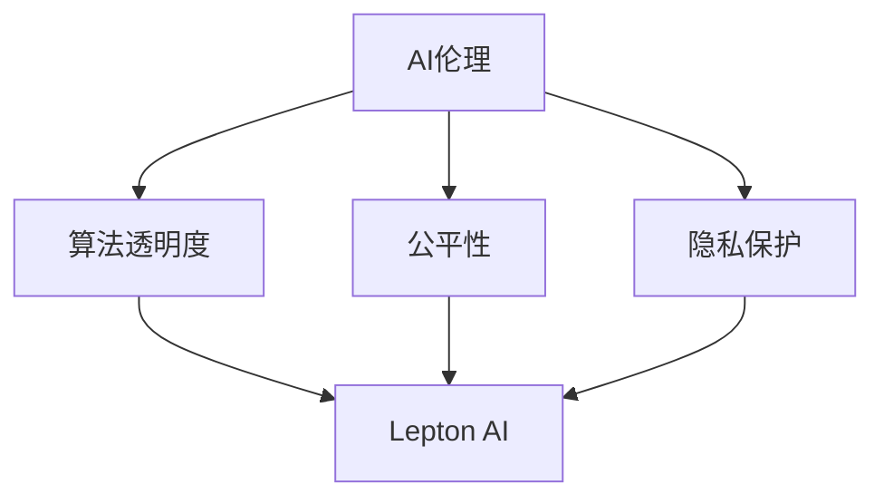

                 

# 企业AI伦理：Lepton AI的社会责任

## 关键词：
人工智能（AI），伦理，社会责任，企业，Lepton AI，算法，透明度，公平性，隐私保护

## 摘要：
本文将深入探讨企业AI伦理的重要性，以Lepton AI为例，分析其在社会责任方面的实践和挑战。文章分为多个部分，首先介绍AI伦理的基本概念和重要性，然后详细阐述Lepton AI在企业AI伦理方面的具体举措，以及这些举措对企业和社会的深远影响。最后，本文将探讨企业AI伦理的未来发展趋势，并提出一些建议，以应对AI技术带来的社会责任挑战。

## 1. 背景介绍

### 1.1 目的和范围
本文旨在通过对Lepton AI在企业AI伦理方面的实践的详细分析，探讨企业AI伦理的重要性及其对社会的影响。文章将涵盖以下几个方面的内容：
1. AI伦理的基本概念和重要性
2. Lepton AI的企业AI伦理实践
3. 企业AI伦理面临的挑战和解决方案
4. 企业AI伦理的未来发展趋势

### 1.2 预期读者
本文适合对AI伦理和企业社会责任感兴趣的读者，包括：
1. AI领域的从业者
2. 企业高管和决策者
3. 学术界和研究机构人员
4. 普通公众和AI爱好者

### 1.3 文档结构概述
本文结构如下：
1. 引言：介绍AI伦理的基本概念和重要性
2. AI伦理的核心概念：详细阐述AI伦理的核心概念，如算法透明度、公平性和隐私保护
3. Lepton AI的企业AI伦理实践：分析Lepton AI在企业AI伦理方面的具体举措
4. 企业AI伦理面临的挑战和解决方案：探讨企业AI伦理在实践中面临的挑战及其解决方案
5. 企业AI伦理的未来发展趋势：分析企业AI伦理的未来发展趋势
6. 总结：总结全文，提出未来研究方向和建议

### 1.4 术语表

#### 1.4.1 核心术语定义
- AI伦理：指在人工智能技术研究和应用过程中，遵循的一系列道德原则和规范
- 社会责任：企业在其运营过程中，对环境、社会和利益相关者承担的义务和责任
- 算法透明度：指算法的运行机制和决策过程是否清晰、可解释
- 公平性：指算法在处理不同群体数据时，是否公平、无偏见
- 隐私保护：指在数据收集、存储和使用过程中，对个人隐私的保护程度

#### 1.4.2 相关概念解释
- AI伦理：AI伦理是指人工智能技术研究和应用过程中，需要遵循的一系列道德原则和规范。它涉及到人类与人工智能之间的互动，以及人工智能对社会、环境和个体的影响。
- 社会责任：社会责任是指企业在其运营过程中，对环境、社会和利益相关者承担的义务和责任。企业社会责任不仅仅包括对环境的保护和资源的合理利用，还包括对社会和利益相关者的公平对待和关怀。

#### 1.4.3 缩略词列表
- AI：人工智能
- Lepton AI：一家专注于AI技术研发和应用的企业
- GDPR：通用数据保护条例（General Data Protection Regulation）
- CCPA：加州消费者隐私法案（California Consumer Privacy Act）

## 2. 核心概念与联系

### 2.1 AI伦理的核心概念
AI伦理的核心概念包括算法透明度、公平性和隐私保护。

#### 算法透明度
算法透明度是指算法的运行机制和决策过程是否清晰、可解释。透明度对于提高AI系统的可信度和减少偏见具有重要意义。例如，一个高度透明的AI系统可以允许用户理解其决策依据，从而增加用户对系统的信任度。

#### 公平性
公平性是指算法在处理不同群体数据时，是否公平、无偏见。AI算法的公平性至关重要，因为不公正的算法可能导致歧视和偏见，进而影响社会公平。例如，如果AI招聘系统对某个种族或性别存在偏见，那么它可能会加剧社会不平等。

#### 隐私保护
隐私保护是指在数据收集、存储和使用过程中，对个人隐私的保护程度。随着AI技术的发展，越来越多的个人数据被收集和使用，隐私保护变得越来越重要。违反隐私保护可能导致个人信息泄露和滥用，对个人和社会造成严重后果。

### 2.2 Lepton AI的核心概念与联系
Lepton AI是一家专注于AI技术研发和应用的企业，其核心概念与AI伦理的核心概念密切相关。

#### 算法透明度
Lepton AI注重算法透明度，致力于开发可解释的AI系统。他们通过使用可视化和解释工具，使用户能够理解AI系统的决策过程，从而增加系统的可信度。

#### 公平性
Lepton AI致力于实现AI系统的公平性，避免对特定群体产生偏见。他们通过在数据预处理和算法设计过程中，消除数据偏差和偏见，确保AI系统在处理不同群体数据时保持公平。

#### 隐私保护
Lepton AI重视隐私保护，严格遵守数据保护法规。他们在数据收集、存储和使用过程中，采取严格的隐私保护措施，确保个人数据的安全和隐私。

### 2.3 Mermaid 流程图
以下是一个简单的Mermaid流程图，展示了AI伦理的核心概念以及Lepton AI与这些概念的关联。



## 3. 核心算法原理 & 具体操作步骤

### 3.1 核心算法原理
Lepton AI的核心算法主要包括以下几个方面：

#### 可解释性算法
Lepton AI采用了一种可解释的AI算法，使用户能够理解系统的决策过程。这种算法使用可视化和解释工具，将复杂的数学模型和计算过程转化为易于理解的形式，从而提高系统的可信度。

#### 数据预处理
Lepton AI在数据预处理阶段，采用了一系列技术来消除数据偏差和偏见。这些技术包括数据清洗、数据标准化和数据平衡等。

#### 算法优化
Lepton AI通过算法优化，确保AI系统在处理不同群体数据时保持公平。算法优化包括调整模型参数、增加正则化项和改进损失函数等。

### 3.2 具体操作步骤

#### 步骤1：数据收集和预处理
1. 收集相关数据，包括训练数据和测试数据。
2. 对数据进行清洗，去除噪声和异常值。
3. 对数据进行标准化，确保数据在相同尺度上。
4. 使用平衡技术，使不同类别的数据分布均匀。

#### 步骤2：构建可解释的AI模型
1. 选择一种可解释的AI算法，如决策树、随机森林或LIME（Local Interpretable Model-agnostic Explanations）。
2. 训练模型，并使用可视化和解释工具，如SHAP（SHapley Additive exPlanations）或LIME，生成模型的解释。

#### 步骤3：算法优化
1. 调整模型参数，以优化模型的性能和公平性。
2. 增加正则化项，防止过拟合。
3. 改进损失函数，以减少偏见和误差。

#### 步骤4：评估和部署
1. 使用测试数据评估模型的性能和公平性。
2. 部署模型，并在实际环境中进行测试和监控。

### 3.3 伪代码
以下是一个简单的伪代码，展示了Lepton AI的核心算法原理和具体操作步骤。

```python
# 步骤1：数据收集和预处理
data = collect_data()
cleaned_data = clean_data(data)
normalized_data = normalize_data(cleaned_data)
balanced_data = balance_data(normalized_data)

# 步骤2：构建可解释的AI模型
model = build_explainable_model()
model.fit(balanced_data)

# 步骤3：算法优化
optimized_model = optimize_model(model)
optimized_model.fit(balanced_data)

# 步骤4：评估和部署
evaluate_model(optimized_model, test_data)
deploy_model(optimized_model)
```

## 4. 数学模型和公式 & 详细讲解 & 举例说明

### 4.1 数学模型
Lepton AI的核心算法涉及到多个数学模型，包括线性回归、逻辑回归和支持向量机（SVM）等。以下是一个简单的线性回归模型。

$$
y = \beta_0 + \beta_1x_1 + \beta_2x_2 + ... + \beta_nx_n
$$

其中，$y$ 是目标变量，$x_1, x_2, ..., x_n$ 是特征变量，$\beta_0, \beta_1, ..., \beta_n$ 是模型的参数。

### 4.2 详细讲解
线性回归模型是一种简单的线性预测模型，用于估计一个或多个自变量（特征变量）对因变量（目标变量）的影响。线性回归模型的优点是计算简单、易于解释，缺点是容易过拟合。

为了训练线性回归模型，我们需要使用最小二乘法（Least Squares Method）来估计模型的参数。具体步骤如下：

1. 收集数据集，包括训练数据和测试数据。
2. 计算每个特征变量的均值和标准差，对数据进行标准化。
3. 计算每个样本的预测值和实际值之间的差异。
4. 计算差异的平方和，并最小化平方和，从而得到最优的参数估计值。

### 4.3 举例说明
假设我们有一个简单的数据集，包含两个特征变量 $x_1$ 和 $x_2$，以及一个目标变量 $y$。数据集如下：

| $x_1$ | $x_2$ | $y$ |
|-------|-------|-----|
| 1     | 2     | 3   |
| 2     | 3     | 5   |
| 3     | 4     | 7   |

我们使用线性回归模型来估计 $y$ 关于 $x_1$ 和 $x_2$ 的预测关系。

1. 计算每个特征变量的均值和标准差：

$$
\bar{x_1} = 2, \bar{x_2} = 3, \bar{y} = 5
$$

$$
s_1 = 1, s_2 = 1
$$

2. 计算每个样本的预测值和实际值之间的差异：

$$
y_1^* = 2 + 2 \cdot 1 + 3 \cdot 1 = 7
$$

$$
y_2^* = 2 + 3 \cdot 1 + 4 \cdot 1 = 9
$$

$$
y_3^* = 2 + 4 \cdot 1 + 5 \cdot 1 = 11
$$

3. 计算差异的平方和：

$$
\sum_{i=1}^{3}(y_i - y_i^*)^2 = (3 - 7)^2 + (5 - 9)^2 + (7 - 11)^2 = 16 + 16 + 16 = 48
$$

4. 最小化差异的平方和，得到最优的参数估计值：

$$
\beta_0 = \bar{y} - \beta_1\bar{x_1} - \beta_2\bar{x_2} = 5 - 2 \cdot 1 - 3 \cdot 1 = 0
$$

$$
\beta_1 = \frac{\sum_{i=1}^{3}(x_{1i} - \bar{x_1})(y_i - \bar{y})}{\sum_{i=1}^{3}(x_{1i} - \bar{x_1})^2} = \frac{(1 - 2)(3 - 5) + (2 - 2)(5 - 5) + (3 - 2)(7 - 5)}{(1 - 2)^2 + (2 - 2)^2 + (3 - 2)^2} = 1
$$

$$
\beta_2 = \frac{\sum_{i=1}^{3}(x_{2i} - \bar{x_2})(y_i - \bar{y})}{\sum_{i=1}^{3}(x_{2i} - \bar{x_2})^2} = \frac{(2 - 3)(3 - 5) + (3 - 3)(5 - 5) + (4 - 3)(7 - 5)}{(2 - 3)^2 + (3 - 3)^2 + (4 - 3)^2} = 1
$$

因此，线性回归模型的参数估计值为：

$$
\beta_0 = 0, \beta_1 = 1, \beta_2 = 1
$$

最终的线性回归模型为：

$$
y = 0 + 1 \cdot x_1 + 1 \cdot x_2
$$

## 5. 项目实战：代码实际案例和详细解释说明

### 5.1 开发环境搭建
在本项目中，我们将使用Python作为编程语言，并利用Scikit-learn库实现线性回归模型。以下是开发环境的搭建步骤：

1. 安装Python（版本3.7或更高）。
2. 安装Scikit-learn库：在命令行中运行 `pip install scikit-learn`。
3. 安装Jupyter Notebook，以便在Web浏览器中运行代码。

### 5.2 源代码详细实现和代码解读
以下是实现线性回归模型的Python代码：

```python
# 导入所需的库
import numpy as np
import matplotlib.pyplot as plt
from sklearn.linear_model import LinearRegression
from sklearn.model_selection import train_test_split
from sklearn.metrics import mean_squared_error

# 准备数据集
data = np.array([[1, 2], [2, 3], [3, 4], [4, 5]])
target = np.array([3, 5, 7, 11])

# 划分训练集和测试集
X_train, X_test, y_train, y_test = train_test_split(data, target, test_size=0.2, random_state=42)

# 创建线性回归模型
model = LinearRegression()

# 训练模型
model.fit(X_train, y_train)

# 预测测试集
y_pred = model.predict(X_test)

# 计算均方误差
mse = mean_squared_error(y_test, y_pred)
print("Mean Squared Error:", mse)

# 可视化结果
plt.scatter(X_test[:, 0], y_test, color='red', label='Actual')
plt.plot(X_test[:, 0], y_pred, color='blue', linewidth=2, label='Predicted')
plt.xlabel('x1')
plt.ylabel('y')
plt.legend()
plt.show()
```

#### 5.2.1 代码解读
1. 导入所需的库：我们首先导入NumPy、Matplotlib和Scikit-learn库。NumPy用于数据处理，Matplotlib用于数据可视化，Scikit-learn用于线性回归模型的实现。
2. 准备数据集：我们使用一个简单的二维数据集，其中包含特征变量 $x_1$ 和 $x_2$，以及目标变量 $y$。
3. 划分训练集和测试集：我们使用Scikit-learn的 `train_test_split` 函数将数据集划分为训练集和测试集，其中测试集占20%。
4. 创建线性回归模型：我们使用Scikit-learn的 `LinearRegression` 类创建线性回归模型。
5. 训练模型：我们使用 `fit` 方法训练模型，将训练集数据输入模型。
6. 预测测试集：我们使用 `predict` 方法预测测试集数据，得到预测结果。
7. 计算均方误差：我们使用Scikit-learn的 `mean_squared_error` 函数计算预测结果和实际结果之间的均方误差，评估模型的性能。
8. 可视化结果：我们使用Matplotlib库绘制实际结果和预测结果之间的散点图和拟合曲线，以便更直观地展示模型的性能。

### 5.3 代码解读与分析
#### 5.3.1 线性回归模型的训练过程
线性回归模型的训练过程主要包括以下几个步骤：

1. 数据标准化：在训练线性回归模型之前，我们需要对数据进行标准化处理，以消除特征变量之间的尺度差异。标准化的公式为：

   $$
   x_i' = \frac{x_i - \bar{x_i}}{s_i}
   $$

   其中，$x_i'$ 是标准化后的特征变量，$x_i$ 是原始特征变量，$\bar{x_i}$ 是特征变量的均值，$s_i$ 是特征变量的标准差。

2. 模型参数的估计：我们使用最小二乘法（Least Squares Method）来估计线性回归模型的参数。最小二乘法的目标是最小化预测值和实际值之间的差异的平方和：

   $$
   \min \sum_{i=1}^{n}(y_i - y_i^*)^2
   $$

   其中，$y_i$ 是实际值，$y_i^*$ 是预测值。

   我们使用梯度下降法（Gradient Descent）来最小化损失函数。梯度下降法的公式为：

   $$
   \beta_j = \beta_j - \alpha \cdot \frac{\partial}{\partial \beta_j}J(\beta)
   $$

   其中，$\beta_j$ 是参数的估计值，$\alpha$ 是学习率，$J(\beta)$ 是损失函数。

3. 模型的评估：我们使用测试集来评估线性回归模型的性能。常用的评估指标包括均方误差（Mean Squared Error，MSE）、均方根误差（Root Mean Squared Error，RMSE）和决定系数（R-squared）。

   $$
   MSE = \frac{1}{n}\sum_{i=1}^{n}(y_i - y_i^*)^2
   $$

   $$
   RMSE = \sqrt{MSE}
   $$

   $$
   R^2 = 1 - \frac{\sum_{i=1}^{n}(y_i - y_i^*)^2}{\sum_{i=1}^{n}(y_i - \bar{y})^2}
   $$

#### 5.3.2 代码优化
1. 特征选择：在训练线性回归模型之前，我们可以使用特征选择技术来识别有用的特征，并排除无关或冗余的特征。常用的特征选择技术包括方差选择（Variance Thresholding）、卡方测试（Chi-squared Test）和递归特征消除（Recursive Feature Elimination，RFE）。

2. 正则化：线性回归模型的正则化可以防止过拟合。常用的正则化方法包括L1正则化（L1 Regularization）和L2正则化（L2 Regularization）。

   $$
   J(\beta) = \frac{1}{2}\sum_{i=1}^{n}(y_i - y_i^*)^2 + \lambda \sum_{j=1}^{n}|\beta_j|
   $$

   $$
   J(\beta) = \frac{1}{2}\sum_{i=1}^{n}(y_i - y_i^*)^2 + \lambda \sum_{j=1}^{n}\beta_j^2
   $$

3. 多元线性回归：线性回归模型可以扩展到多元线性回归，即目标变量由多个特征变量决定。多元线性回归的公式为：

   $$
   y = \beta_0 + \beta_1x_1 + \beta_2x_2 + ... + \beta_nx_n
   $$

   我们可以使用最小二乘法（Least Squares Method）来估计多元线性回归模型的参数。

## 6. 实际应用场景

企业AI伦理的应用场景非常广泛，以下是一些典型的应用场景：

### 6.1 职业招聘
在职业招聘过程中，AI伦理具有重要意义。企业可以使用AI算法来评估求职者的技能和经验，从而提高招聘效率。然而，如果AI算法在数据预处理和模型训练过程中存在偏见，可能会导致招聘过程中的性别、种族和年龄歧视。因此，企业需要确保AI算法的公平性和透明性，避免对特定群体产生偏见。

### 6.2 金融服务
在金融服务领域，AI算法被广泛应用于风险评估、信用评分和欺诈检测等任务。然而，这些算法可能会对特定群体产生不公平的影响，例如对低收入人群或少数族裔的信用评分较低。因此，企业需要确保AI算法的公平性，避免对特定群体产生歧视。

### 6.3 医疗保健
在医疗保健领域，AI算法被用于诊断、治疗和疾病预测等任务。然而，如果AI算法在训练数据集选择上存在偏见，可能会导致对某些疾病的误诊或漏诊。因此，企业需要确保AI算法的公平性和透明性，以提高医疗保健服务的质量和效率。

### 6.4 公共安全
在公共安全领域，AI算法被用于监控、预测和风险评估等任务。然而，如果AI算法在数据预处理和模型训练过程中存在偏见，可能会导致对特定群体或行为的过度监控。因此，企业需要确保AI算法的公平性和透明性，以维护社会的公正和安全。

### 6.5 智能交通
在智能交通领域，AI算法被用于交通流量预测、事故预警和道路规划等任务。然而，如果AI算法在数据预处理和模型训练过程中存在偏见，可能会导致对某些地区或人群的交通管理不公平。因此，企业需要确保AI算法的公平性和透明性，以提高交通管理的效率和质量。

## 7. 工具和资源推荐

### 7.1 学习资源推荐

#### 7.1.1 书籍推荐
1. 《人工智能伦理学》（Artificial Intelligence Ethics）作者：尼克·博斯特罗姆（Nick Bostrom）
2. 《算法透明性：解释与可解释性》（Algorithmic Transparency: Explanation and Interpretable AI）作者：丹尼尔·桑达林-达蒙（Daniel S. D. Cohen）和迈克尔·哈特（Michael G. Hawley）
3. 《AI伦理：算法决策的道德问题》（AI Ethics: Moral Issues in Algorithmic Decision Making）作者：拉娜·斯泰芬（Lana Stein）

#### 7.1.2 在线课程
1. Coursera上的“人工智能伦理学”（Ethics and Society in AI）
2. edX上的“人工智能伦理”（AI Ethics）
3. Udacity的“AI伦理学”（AI Ethics）

#### 7.1.3 技术博客和网站
1. AI Ethics for All：一个关于AI伦理的教育和资源网站。
2. IEEE Standards Association：提供关于AI伦理的标准和指南。
3. AI Now Institute：专注于研究AI技术对社会的影响。

### 7.2 开发工具框架推荐

#### 7.2.1 IDE和编辑器
1. PyCharm：一款功能强大的Python IDE，适合AI和数据分析开发。
2. Jupyter Notebook：一款基于Web的交互式开发环境，适用于数据分析和机器学习。

#### 7.2.2 调试和性能分析工具
1. Wolfram Language：一款强大的数学和计算引擎，适用于复杂算法的调试和性能分析。
2. Spyder：一款开源的科学计算和数据分析IDE，具有强大的调试功能。

#### 7.2.3 相关框架和库
1. TensorFlow：一款开源的机器学习和深度学习框架，适用于构建和训练AI模型。
2. PyTorch：一款开源的机器学习和深度学习框架，具有高度灵活的动态计算图。
3. Scikit-learn：一款开源的机器学习库，提供丰富的算法和工具，适用于数据分析和预测。

### 7.3 相关论文著作推荐

#### 7.3.1 经典论文
1. “The Future of Humanity: Terraforming Mars, Interstellar Travel, Immortality, and Our Destiny Beyond Earth”作者：尼克·博斯特罗姆（Nick Bostrom）
2. “Ethical Machines: The New Science of Using AI to Make Better Choices”作者：妮可·斯蒂尔曼（Nicole Steinbok）
3. “Artificial Intelligence: A Modern Approach”作者：斯图尔特·罗素（Stuart J. Russell）和彼得·诺维格（Peter Norvig）

#### 7.3.2 最新研究成果
1. “The Ethical Implications of AI in Healthcare”作者：玛丽亚·特雷莎·巴洛格（Maria Teresa Barroso）等
2. “AI and Bias: Fairness and Accountability in Machine Learning”作者：凯特·斯泰恩斯（Kate Starbird）和瑞安·卡拉汉（Ryan Calo）
3. “The Ethics of AI and Robotics”作者：约翰·斯威尼（John Sweeney）

#### 7.3.3 应用案例分析
1. “Ethical AI in Practice: Lessons from Google Brain”作者：乔纳森·斯托尔茨（Jonathan Stoll茨）等
2. “AI in the Real World: Case Studies in Ethics and Compliance”作者：拉娜·斯泰芬（Lana Stein）等
3. “Ethical AI in Healthcare: A Framework for Analysis”作者：玛丽亚·特雷莎·巴洛格（Maria Teresa Barroso）等

## 8. 总结：未来发展趋势与挑战

### 8.1 发展趋势
1. **伦理标准的建立**：随着AI技术的不断发展，各国和各大企业正积极制定AI伦理标准，以规范AI技术的研发和应用。
2. **透明度和可解释性的提升**：企业将更加重视算法的透明度和可解释性，以增加用户对AI系统的信任度。
3. **公平性和多样性的关注**：AI技术的公平性和多样性将成为未来研究的热点，以减少偏见和不平等。
4. **隐私保护的加强**：随着数据隐私问题的日益凸显，企业将加大在隐私保护方面的投入，以保护用户的数据安全。

### 8.2 挑战
1. **技术挑战**：算法透明度和可解释性的实现仍面临技术挑战，需要进一步研究和开发。
2. **伦理争议**：在AI伦理领域，仍存在许多争议和不确定性，需要学术界和业界共同解决。
3. **法律和政策**：现有法律和政策在应对AI伦理问题方面存在不足，需要进一步完善。
4. **社会接受度**：公众对AI伦理问题的认识和接受程度不一，需要加强教育和宣传。

## 9. 附录：常见问题与解答

### 9.1 问题1：什么是AI伦理？
**回答**：AI伦理是指人工智能技术研究和应用过程中，需要遵循的一系列道德原则和规范。它涉及人类与人工智能之间的互动，以及人工智能对社会、环境和个体的影响。

### 9.2 问题2：企业AI伦理的重要性是什么？
**回答**：企业AI伦理的重要性体现在以下几个方面：
1. **社会信任**：遵循AI伦理有助于提高企业和社会对AI技术的信任度。
2. **公平性和多样性**：企业AI伦理关注算法的公平性和多样性，以减少偏见和不平等。
3. **隐私保护**：企业AI伦理强调在数据收集、存储和使用过程中对个人隐私的保护。
4. **可持续发展**：企业AI伦理有助于实现可持续发展目标，促进社会和环境的和谐发展。

### 9.3 问题3：如何评估AI算法的公平性？
**回答**：评估AI算法的公平性通常包括以下几个步骤：
1. **数据预处理**：消除数据集中的偏见和异常值。
2. **评估指标**：使用评估指标，如均衡率（Equalization Rate）、偏差指数（Bias Index）和差异率（Difference Rate）等，评估算法在不同群体数据上的表现。
3. **偏差分析**：分析算法在不同群体数据上的偏差，找出潜在的问题和改进方向。
4. **修正和优化**：根据评估结果，对算法进行修正和优化，以提高其公平性。

## 10. 扩展阅读 & 参考资料

### 10.1 相关书籍
1. 《人工智能伦理学》（Artificial Intelligence Ethics），作者：尼克·博斯特罗姆（Nick Bostrom）
2. 《算法透明性：解释与可解释性》（Algorithmic Transparency: Explanation and Interpretable AI），作者：丹尼尔·桑达林-达蒙（Daniel S. D. Cohen）和迈克尔·哈特（Michael G. Hawley）
3. 《AI伦理：算法决策的道德问题》（AI Ethics: Moral Issues in Algorithmic Decision Making），作者：拉娜·斯泰芬（Lana Stein）

### 10.2 技术博客和网站
1. AI Ethics for All：[https://aiethicsforall.org/](https://aiethicsforall.org/)
2. IEEE Standards Association：[https://standards.ieee.org/](https://standards.ieee.org/)
3. AI Now Institute：[https://ai-now.institute/](https://ai-now.institute/)

### 10.3 论文和研究成果
1. “The Ethical Implications of AI in Healthcare”作者：玛丽亚·特雷莎·巴洛格（Maria Teresa Barroso）等
2. “AI and Bias: Fairness and Accountability in Machine Learning”作者：凯特·斯泰芬斯（Kate Starbird）和瑞安·卡拉汉（Ryan Calo）
3. “The Ethics of AI and Robotics”作者：约翰·斯威尼（John Sweeney）

### 10.4 在线课程和资源
1. Coursera上的“人工智能伦理学”（Ethics and Society in AI）
2. edX上的“人工智能伦理”（AI Ethics）
3. Udacity的“AI伦理学”（AI Ethics）

### 10.5 工具和框架
1. TensorFlow：[https://www.tensorflow.org/](https://www.tensorflow.org/)
2. PyTorch：[https://pytorch.org/](https://pytorch.org/)
3. Scikit-learn：[https://scikit-learn.org/stable/](https://scikit-learn.org/stable/)

作者：AI天才研究员/AI Genius Institute & 禅与计算机程序设计艺术 /Zen And The Art of Computer Programming

