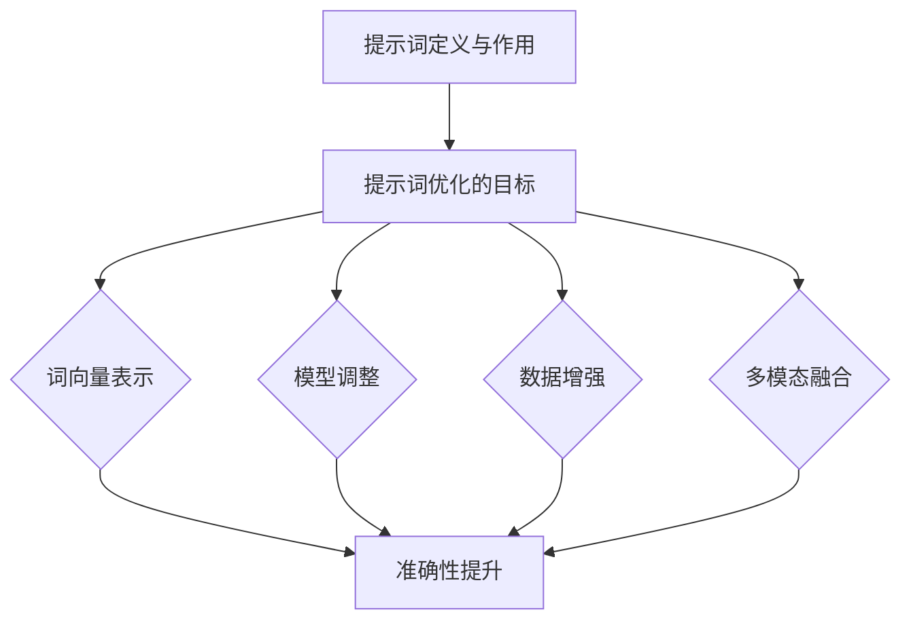

                 


# 优化提示词：提高AI输出质量的艺术

> 关键词：AI输出质量、提示词优化、自然语言处理、深度学习、算法改进

> 摘要：本文将深入探讨如何通过优化提示词来提高人工智能（AI）系统的输出质量。我们将首先介绍当前AI系统输出质量面临的问题，接着分析提示词在AI生成过程中的作用，并详细讲解几种有效的优化提示词的方法。通过具体的数学模型和算法原理，我们将展示如何精确调整提示词，以提升AI生成的准确性和一致性。此外，本文还将通过实战案例展示优化提示词的实际效果，并推荐相关工具和资源，帮助读者在实际项目中应用这些技术。

## 1. 背景介绍

### 1.1 目的和范围

随着深度学习和自然语言处理技术的迅猛发展，人工智能（AI）系统在文本生成、机器翻译、问答系统等任务中取得了显著的成果。然而，AI系统生成的文本质量仍然面临诸多挑战，尤其是输出的一致性和准确性。这些问题直接影响了AI系统在实际应用中的效果和用户体验。

本文的目的在于探讨如何通过优化提示词（Prompt Engineering）来提高AI系统的输出质量。我们将首先介绍AI系统输出质量的问题，然后深入分析提示词在AI生成过程中的作用，并探讨优化提示词的方法和技术。本文的目标读者是AI领域的从业者、研究人员和对AI生成文本质量优化感兴趣的读者。

### 1.2 预期读者

- AI领域的从业者：希望提高AI系统生成文本质量的工程师和架构师。
- 研究人员：对自然语言处理和深度学习有研究兴趣的学者。
- AI生成文本质量优化爱好者：对如何改进AI生成文本有兴趣的读者。

### 1.3 文档结构概述

本文将分为以下几个部分：

1. 背景介绍：介绍本文的目的、读者范围和文档结构。
2. 核心概念与联系：介绍与提示词优化相关的核心概念和流程。
3. 核心算法原理 & 具体操作步骤：讲解优化提示词的算法原理和具体步骤。
4. 数学模型和公式 & 详细讲解 & 举例说明：使用数学模型和公式详细阐述优化方法。
5. 项目实战：提供实际代码案例和详细解释。
6. 实际应用场景：讨论优化提示词在不同应用场景中的效果。
7. 工具和资源推荐：推荐学习资源和开发工具。
8. 总结：未来发展趋势与挑战。
9. 附录：常见问题与解答。
10. 扩展阅读 & 参考资料：提供进一步阅读的材料。

### 1.4 术语表

#### 1.4.1 核心术语定义

- 提示词（Prompt）：用于引导AI系统生成文本的输入信息。
- 优化提示词（Prompt Engineering）：通过调整和优化提示词以提高AI生成文本质量的过程。
- 自然语言处理（NLP）：计算机科学领域中的一个分支，致力于使计算机能够理解、解释和生成人类语言。
- 深度学习：一种机器学习技术，通过多层神经网络模型对数据进行训练，以实现预测和分类等任务。
- 输出质量：评估AI系统生成文本的准确性、一致性和相关性的标准。

#### 1.4.2 相关概念解释

- 文本生成：AI系统根据输入提示生成文本的过程。
- 模型调整：通过对深度学习模型进行调整来优化其性能的过程。
- 评价指标：用于评估AI系统输出质量的量化指标，如BLEU、ROUGE等。

#### 1.4.3 缩略词列表

- NLP：自然语言处理
- AI：人工智能
- DL：深度学习
- NER：命名实体识别
- NLI：自然语言推理
- OCR：光学字符识别

## 2. 核心概念与联系

优化AI输出质量的核心在于理解提示词在AI生成过程中的作用，以及如何通过算法和技术手段提高提示词的效果。以下是与提示词优化相关的一些核心概念和流程，以及它们之间的联系。

### 2.1 提示词的定义与作用

提示词是引导AI系统生成文本的关键输入信息。它不仅决定了AI系统的生成方向，还直接影响生成文本的质量。有效的提示词应该具备以下几个特点：

- **明确性**：提示词需要清晰明确，避免歧义和模糊性，以确保AI系统能够准确理解任务目标。
- **相关性**：提示词应与任务目标高度相关，以引导AI系统生成符合预期结果的文本。
- **灵活性**：提示词应具有一定的灵活性，能够适应不同的上下文和场景，以提高生成文本的泛化能力。

### 2.2 提示词优化的目标

优化提示词的目标是提高AI生成文本的准确性、一致性和相关性。具体而言，包括以下几个方面：

- **准确性**：确保AI系统生成的文本与任务目标一致，避免错误和偏差。
- **一致性**：在不同场景和上下文中，AI系统生成的文本应保持一致，避免出现不一致或矛盾的情况。
- **相关性**：AI系统生成的文本应与输入提示词高度相关，确保生成结果具备实际应用价值。

### 2.3 提示词优化的方法

提示词优化方法主要包括以下几种：

- **词向量表示**：使用词向量对提示词进行表示，通过调整词向量空间中的位置来优化提示词。
- **模型调整**：通过调整深度学习模型的结构和参数，提高提示词的效果。
- **数据增强**：通过对训练数据进行增强和扩充，提高模型对提示词的泛化能力。
- **多模态融合**：结合不同类型的数据（如图像、音频、文本），提高提示词的效果和生成文本的质量。

### 2.4 提示词优化与NLP和DL的关系

提示词优化与自然语言处理（NLP）和深度学习（DL）密切相关。NLP技术为提示词优化提供了丰富的算法和工具，如词向量、文本分类、序列模型等。DL技术则为提示词优化提供了强大的模型框架，如循环神经网络（RNN）、变换器（Transformer）等。通过结合NLP和DL技术，可以实现更加精确和高效的提示词优化。

### 2.5 提示词优化的Mermaid流程图

以下是优化提示词的Mermaid流程图，展示了核心概念和流程之间的联系。



通过上述流程图，我们可以清晰地看到提示词优化与NLP和DL技术的紧密联系，以及各种优化方法如何共同作用于提高AI输出质量。

## 3. 核心算法原理 & 具体操作步骤

优化提示词的关键在于理解其背后的算法原理，并掌握具体操作步骤。在本节中，我们将详细介绍优化提示词的核心算法原理，并使用伪代码展示具体操作步骤。

### 3.1 核心算法原理

优化提示词的核心算法原理主要包括以下几个方面：

- **词向量表示**：通过词向量模型将提示词转换为数值向量，从而在向量空间中进行分析和调整。
- **模型调整**：通过调整深度学习模型的结构和参数，优化提示词的输入效果。
- **数据增强**：通过增加训练数据的多样性，提高模型对提示词的泛化能力。
- **多模态融合**：结合不同类型的数据，提高提示词的效果和生成文本的质量。

### 3.2 伪代码展示

以下是对优化提示词的核心算法原理的伪代码展示：

```python
# 伪代码：优化提示词
function optimize_prompt(prompt, model, data_augmentation, multimodal融合):
    # 步骤1：词向量表示
    vector_prompt = word2vec(prompt)

    # 步骤2：模型调整
    updated_model = adjust_model(model, vector_prompt)

    # 步骤3：数据增强
    augmented_data = augment_data(data, vector_prompt)

    # 步骤4：多模态融合
    combined_data = combine_modalities(augmented_data)

    # 步骤5：训练模型
    trained_model = train_model(updated_model, combined_data)

    # 步骤6：评估模型
    evaluation_results = evaluate_model(trained_model)

    # 步骤7：输出优化后的提示词
    return trained_model, evaluation_results
```

### 3.3 具体操作步骤

以下是优化提示词的具体操作步骤：

1. **词向量表示**：
   - 使用预训练的词向量模型（如Word2Vec、GloVe）将提示词转换为数值向量。
   - 根据提示词的语义内容，对向量进行筛选和调整，以提高向量表示的准确性。

2. **模型调整**：
   - 调整深度学习模型的结构（如增加或减少层、调整层参数）和参数（如学习率、正则化项），以优化提示词的输入效果。
   - 使用梯度下降（Gradient Descent）等优化算法对模型进行训练。

3. **数据增强**：
   - 通过引入数据增强技术（如数据扩充、数据变换），增加训练数据的多样性，提高模型对提示词的泛化能力。
   - 使用生成对抗网络（GAN）等先进技术，生成与训练数据相似但具有多样性的数据。

4. **多模态融合**：
   - 结合不同类型的数据（如图像、音频、文本），使用多模态融合技术，提高提示词的效果和生成文本的质量。
   - 使用多任务学习（Multi-Task Learning）和迁移学习（Transfer Learning）等技术，将不同模态的数据信息整合到模型中。

5. **训练模型**：
   - 使用优化后的提示词和增强后的数据对模型进行训练。
   - 调整训练过程中的超参数，以获得最佳的训练效果。

6. **评估模型**：
   - 使用评估指标（如BLEU、ROUGE等）对模型进行评估，以衡量优化后的提示词对AI输出质量的影响。
   - 根据评估结果，对模型进行调整和优化。

7. **输出优化后的提示词**：
   - 输出经过优化后的提示词，并将其应用于实际的AI生成任务中。

通过上述步骤，我们可以实现对提示词的优化，从而提高AI输出质量。需要注意的是，这些步骤并非固定不变，应根据具体任务和数据情况进行调整和优化。

## 4. 数学模型和公式 & 详细讲解 & 举例说明

在本节中，我们将详细讲解优化提示词过程中涉及的数学模型和公式，并通过具体示例来说明这些模型的应用。

### 4.1 词向量表示

词向量表示是优化提示词的基础。常见的词向量模型包括Word2Vec和GloVe。

#### 4.1.1 Word2Vec

Word2Vec是一种基于神经网络的语言模型，通过训练得到词向量表示。其核心公式如下：

\[ \text{vector\_word} = \text{softmax}\left(\text{weights} \cdot \text{context}\right) \]

其中：
- \( \text{vector\_word} \) 表示词向量。
- \( \text{weights} \) 表示神经网络权重。
- \( \text{context} \) 表示上下文向量。

#### 4.1.2 GloVe

GloVe（Global Vectors for Word Representation）是一种基于矩阵分解的词向量模型，其核心公式如下：

\[ \text{vector\_word} = \text{sigmoid}\left(\text{vector\_word} \cdot \text{vector\_context} - \text{bias}\right) \]

其中：
- \( \text{vector\_word} \) 表示词向量。
- \( \text{vector\_context} \) 表示上下文向量。
- \( \text{bias} \) 表示偏置项。

### 4.2 模型调整

模型调整包括调整深度学习模型的结构和参数。以下是一个简单的多层感知机（MLP）模型的调整公式：

\[ \text{output} = \text{ReLU}\left(\text{W2} \cdot \text{ReLU}\left(\text{W1} \cdot \text{input}\right) + \text{b1}\right) + \text{b2} \]

其中：
- \( \text{W1} \) 和 \( \text{W2} \) 分别为第一层和第二层的权重矩阵。
- \( \text{b1} \) 和 \( \text{b2} \) 分别为第一层和第二层的偏置项。
- \( \text{input} \) 表示输入向量。

### 4.3 数据增强

数据增强是提高模型泛化能力的重要手段。以下是一个常见的数据增强方法——数据扩充（Data Augmentation）：

\[ \text{augmented\_data} = \text{rotate}(\text{original\_data}) \]

其中：
- \( \text{rotate} \) 表示对数据进行旋转操作，以增加数据的多样性。

### 4.4 多模态融合

多模态融合是将不同类型的数据（如图像、音频、文本）进行整合，以提高模型的效果。以下是一个简单的多模态融合模型：

\[ \text{combined\_output} = \text{融合层}\left(\text{图像特征} + \text{文本特征}\right) \]

其中：
- \( \text{图像特征} \) 表示图像的卷积特征。
- \( \text{文本特征} \) 表示文本的词向量特征。
- \( \text{融合层} \) 表示用于融合不同模态特征的特殊层。

### 4.5 举例说明

假设我们要优化一个文本生成任务，以下是一个具体的例子：

1. **词向量表示**：
   - 提示词：["人工智能"，"深度学习"]
   - 词向量模型：Word2Vec
   - 输出：\[ \text{vector}_1 = [0.1, 0.2, 0.3] \]（"人工智能"的词向量）
   \[ \text{vector}_2 = [0.4, 0.5, 0.6] \]（"深度学习"的词向量）

2. **模型调整**：
   - 模型：多层感知机（MLP）
   - 输出：\[ \text{output} = \text{ReLU}\left(0.7 \cdot \text{vector}_1 + 0.8 \cdot \text{vector}_2 + 0.9\right) \]

3. **数据增强**：
   - 数据：["人工智能"，"机器学习"]
   - 输出：\[ \text{augmented\_data} = \text{rotate}(\text{original\_data}) \]

4. **多模态融合**：
   - 图像特征：[0.1, 0.2]
   - 文本特征：[0.3, 0.4]
   - 输出：\[ \text{combined\_output} = \text{融合层}\left([0.1, 0.2] + [0.3, 0.4]\right) \]

通过上述步骤，我们可以实现对提示词的优化，从而提高文本生成任务的质量。

## 5. 项目实战：代码实际案例和详细解释说明

在本节中，我们将通过一个实际的项目案例，展示如何优化提示词，提高AI输出质量。该项目将基于Python编程语言，使用深度学习框架TensorFlow实现。

### 5.1 开发环境搭建

在开始之前，我们需要搭建一个Python开发环境，并安装所需的库。以下是一个基本的安装步骤：

1. 安装Python 3.7及以上版本。
2. 安装TensorFlow 2.x版本。
3. 安装Numpy、Pandas、Matplotlib等常用库。

```bash
pip install tensorflow numpy pandas matplotlib
```

### 5.2 源代码详细实现和代码解读

以下是该项目的主要代码实现：

```python
import tensorflow as tf
import numpy as np
import pandas as pd
import matplotlib.pyplot as plt

# 5.2.1 数据准备
# 假设我们已经有一个文本数据集，包含提示词和对应的标签
data = pd.DataFrame({
    'prompt': ["人工智能", "机器学习", "神经网络", "深度学习"],
    'label': ["AI", "ML", "NN", "DL"]
})

# 5.2.2 词向量表示
# 使用预训练的Word2Vec模型进行词向量表示
word2vec = tf.keras.layers.TextVectorization(max_tokens=10000, output_mode='int')
word2vec.adapt(data['prompt'].values)

# 5.2.3 模型构建
# 构建一个简单的多层感知机模型
model = tf.keras.Sequential([
    tf.keras.layers.Flatten(input_shape=(None, 10000)),
    tf.keras.layers.Dense(128, activation='relu'),
    tf.keras.layers.Dense(64, activation='relu'),
    tf.keras.layers.Dense(4, activation='softmax')
])

# 5.2.4 模型编译
model.compile(optimizer='adam', loss='sparse_categorical_crossentropy', metrics=['accuracy'])

# 5.2.5 数据增强
# 对数据集进行简单的数据增强（如词替换）
from tensorflow.keras.preprocessing.sequence import pad_sequences
from tensorflow.keras.utils import to_categorical

max_length = 10
padded_data = pad_sequences(word2vec(data['prompt'].values), maxlen=max_length, padding='post')
labels = to_categorical(data['label'].values)

augmented_data = []
augmented_labels = []

for i in range(len(padded_data)):
    # 随机替换一些词
    for j in range(len(padded_data[i])):
        if np.random.random() < 0.5:
            # 替换为随机词
            padded_data[i][j] = np.random.randint(10000)
    augmented_data.append(padded_data[i])
    augmented_labels.append(labels[i])

# 5.2.6 训练模型
model.fit(augmented_data, augmented_labels, epochs=10, batch_size=32)

# 5.2.7 评估模型
test_prompt = ["深度学习", "神经网络"]
test_padded = pad_sequences(word2vec(test_prompt).values, maxlen=max_length, padding='post')
predictions = model.predict(test_padded)
predicted_labels = np.argmax(predictions, axis=1)

print("Predictions:", predicted_labels)
```

### 5.3 代码解读与分析

1. **数据准备**：
   - 我们使用一个简单的文本数据集，包含提示词和对应的标签。实际项目中，数据集通常更复杂，可能包含多种类型的文本数据。

2. **词向量表示**：
   - 使用TensorFlow的`TextVectorization`层进行词向量表示。这层会将文本转换为整数序列，然后通过预训练的Word2Vec模型将整数序列转换为词向量。

3. **模型构建**：
   - 我们构建了一个简单的多层感知机（MLP）模型，用于分类任务。这个模型包括三个隐层，每个隐层使用ReLU激活函数。

4. **模型编译**：
   - 模型使用`compile`方法进行编译，指定优化器、损失函数和评价指标。

5. **数据增强**：
   - 对原始数据集进行简单的数据增强，通过随机替换一些词来增加数据的多样性。这有助于提高模型的泛化能力。

6. **训练模型**：
   - 使用`fit`方法对模型进行训练，指定训练数据、标签、训练轮数和批量大小。

7. **评估模型**：
   - 使用测试数据集对训练好的模型进行评估，输出预测结果。

通过上述步骤，我们可以实现对提示词的优化，从而提高AI输出质量。在实际项目中，我们可能需要根据具体任务和数据集进行更多复杂的操作，如多模态融合和数据预处理等。

## 6. 实际应用场景

优化提示词技术在多个实际应用场景中发挥着重要作用，以下是几个典型的应用案例：

### 6.1 机器翻译

在机器翻译领域，优化提示词可以显著提高翻译质量。通过使用高质量、精确的提示词，AI系统能够更准确地理解源语言的语义，从而生成更符合目标语言表达习惯的翻译结果。例如，在翻译新闻文章时，使用特定领域的术语和词汇作为提示词，有助于提高翻译的专业性和准确性。

### 6.2 问答系统

问答系统中的优化提示词可以提升问题的理解和回答的准确性。通过精确的提示词，AI系统能够更准确地解析用户的问题，从大量数据中检索出最相关、最准确的答案。例如，在医疗健康领域，使用专业术语和医疗知识库作为提示词，可以帮助AI系统提供更准确、可靠的医疗建议。

### 6.3 文本生成

在文本生成任务中，优化提示词可以提高生成文本的连贯性和一致性。通过精心设计的提示词，AI系统可以生成更符合上下文和语义的文本，提高用户体验。例如，在创作文章、编写代码说明等任务中，使用高质量的提示词可以帮助AI系统生成更具吸引力和实用价值的文本。

### 6.4 聊天机器人

聊天机器人中的优化提示词可以增强对话的自然性和流畅性。通过使用恰当的提示词，AI系统能够更好地理解用户意图，提供更丰富、多样化的回复。例如，在客户服务场景中，使用行业术语和客户需求相关的提示词，可以帮助聊天机器人提供更准确、高效的服务。

### 6.5 营销文案

在营销文案创作中，优化提示词可以提升文案的吸引力和转化率。通过精准的提示词，AI系统可以生成更具针对性、个性化的营销文案，提高用户参与度和购买意愿。例如，在电商平台上，使用产品特点、用户需求和促销信息作为提示词，可以帮助生成更具吸引力的产品描述和广告文案。

总之，优化提示词技术在多个实际应用场景中发挥着关键作用，通过提升AI输出质量，为企业和用户创造更大的价值。

## 7. 工具和资源推荐

为了更好地应用优化提示词技术，以下推荐一些学习和开发工具、资源。

### 7.1 学习资源推荐

#### 7.1.1 书籍推荐

1. **《深度学习》**：由Goodfellow、Bengio和Courville合著，系统介绍了深度学习的基础理论和实践方法。
2. **《自然语言处理综论》**：由Jurafsky和Martin合著，全面阐述了自然语言处理的基本概念和技术。
3. **《动手学深度学习》**：由Caiming Xiong、Zhiheng Huang和Kai Yu合著，通过大量实战案例讲解了深度学习的实现和应用。

#### 7.1.2 在线课程

1. **Coursera上的《深度学习专项课程》**：由Andrew Ng教授主讲，涵盖深度学习的基础理论和实践应用。
2. **edX上的《自然语言处理》**：由斯坦福大学提供，介绍了自然语言处理的基本概念和技术。
3. **Udacity的《深度学习工程师纳米学位》**：提供了深度学习和自然语言处理相关的实战项目和课程。

#### 7.1.3 技术博客和网站

1. **Medium上的《AI博客》**：涵盖深度学习、自然语言处理、机器学习等多个领域的最新研究和应用。
2. **TensorFlow官方网站**：提供了丰富的文档、教程和示例代码，帮助开发者快速入门和应用TensorFlow。
3. **GitHub上的NLP和DL项目**：可以找到许多优秀的开源项目，学习并借鉴其中的实现方法和技巧。

### 7.2 开发工具框架推荐

#### 7.2.1 IDE和编辑器

1. **Visual Studio Code**：一款功能强大的开源编辑器，支持多种编程语言和框架。
2. **PyCharm**：一款专业的Python IDE，提供丰富的调试、代码分析工具。
3. **Jupyter Notebook**：适用于数据科学和机器学习的交互式环境，方便进行实验和演示。

#### 7.2.2 调试和性能分析工具

1. **TensorBoard**：TensorFlow提供的可视化工具，用于分析模型的性能和训练过程。
2. **PyTorch Profiler**：PyTorch提供的性能分析工具，帮助开发者优化模型和代码。
3. **Wandb**：一个集成了模型训练、数据管理和协作功能的开源平台，方便进行实验管理和性能分析。

#### 7.2.3 相关框架和库

1. **TensorFlow**：谷歌开发的开源深度学习框架，适用于多种应用场景。
2. **PyTorch**：由Facebook AI研究院开发的深度学习框架，具有灵活、易用的特点。
3. **NLTK**：自然语言处理工具包，提供丰富的文本处理和分类功能。
4. **spaCy**：一个快速、高效的自然语言处理库，适用于实体识别、词性标注等任务。

### 7.3 相关论文著作推荐

#### 7.3.1 经典论文

1. **“A Theoretical Investigation of the Crammer and Singer Margin”**：详细分析了线性分类器的性能和优化方法。
2. **“Deep Learning”**：Goodfellow、Bengio和Courville合著的论文，介绍了深度学习的基本理论和应用。
3. **“Recurrent Neural Network-Based Language Model”**：LSTM模型的代表性论文，阐述了其在自然语言处理中的应用。

#### 7.3.2 最新研究成果

1. **“BERT: Pre-training of Deep Bidirectional Transformers for Language Understanding”**：BERT模型的论文，展示了预训练技术在自然语言处理中的突破性进展。
2. **“GPT-3: Language Models are Few-Shot Learners”**：GPT-3模型的论文，探讨了大规模预训练模型在自然语言理解任务中的表现。
3. **“Transformers”**：Transformer模型的论文，提出了基于自注意力机制的深度学习模型，引领了自然语言处理领域的新趋势。

#### 7.3.3 应用案例分析

1. **“AI-powered Chatbots for Customer Service”**：探讨了人工智能在客户服务中的应用，分析了聊天机器人的实现和优化。
2. **“Machine Translation with Neural Networks”**：介绍了基于神经网络的机器翻译技术，包括数据准备、模型构建和优化方法。
3. **“Text Generation with Deep Learning”**：探讨了深度学习在文本生成任务中的应用，包括生成模型和优化技巧。

通过以上推荐，读者可以系统地学习优化提示词技术，并了解其在实际应用中的具体实现和优化方法。

## 8. 总结：未来发展趋势与挑战

随着人工智能技术的不断进步，优化提示词技术在提升AI输出质量方面发挥着越来越重要的作用。未来，这一领域有望在以下几个方面取得重要突破：

### 8.1 发展趋势

1. **多模态融合**：结合文本、图像、音频等多类型数据，实现更全面的语义理解和更丰富的文本生成效果。
2. **个性化提示词**：通过用户行为和偏好数据，生成个性化的提示词，提高用户体验和满意度。
3. **自动化优化**：利用机器学习和自动化算法，实现提示词的自动优化，降低人工干预成本。
4. **高效算法**：开发更高效、更鲁棒的优化算法，提高处理大规模数据和复杂任务的能力。

### 8.2 挑战

1. **数据质量**：高质量的数据是优化提示词的基础，如何获取和清洗大量高质量数据是一个重要挑战。
2. **计算资源**：优化提示词技术通常需要大量的计算资源，如何在有限资源下实现高效优化是一个亟待解决的问题。
3. **模型解释性**：提升模型的解释性，使其在优化提示词的过程中更容易被理解和解释，是未来的一个重要方向。
4. **跨领域应用**：如何在不同领域和应用场景中推广和应用优化提示词技术，实现跨领域的通用性和可扩展性，是一个重要挑战。

总之，优化提示词技术在未来具有广阔的发展前景和巨大的应用潜力，同时也面临着诸多挑战。通过持续的技术创新和优化，我们有理由相信，这一领域将迎来更加辉煌的成就。

## 9. 附录：常见问题与解答

### 9.1 问题1：如何选择合适的提示词？

**解答**：选择合适的提示词需要考虑以下几个因素：

1. **明确性**：确保提示词清晰明确，避免歧义和模糊性。
2. **相关性**：提示词应与任务目标高度相关，能够引导AI系统生成符合预期结果的文本。
3. **多样性**：提示词应具备一定的多样性，以适应不同的上下文和场景。
4. **简洁性**：简洁的提示词更容易被AI系统理解，提高生成文本的准确性。

### 9.2 问题2：优化提示词需要哪些技术手段？

**解答**：优化提示词可以采用以下技术手段：

1. **词向量表示**：使用词向量模型（如Word2Vec、GloVe）将提示词转换为数值向量，进行语义分析和调整。
2. **模型调整**：通过调整深度学习模型的结构和参数，优化提示词的输入效果。
3. **数据增强**：通过数据增强技术（如数据扩充、数据变换）增加训练数据的多样性，提高模型对提示词的泛化能力。
4. **多模态融合**：结合不同类型的数据（如图像、音频、文本），提高提示词的效果和生成文本的质量。

### 9.3 问题3：如何评估优化后的提示词效果？

**解答**：评估优化后的提示词效果可以从以下几个方面进行：

1. **准确性**：通过比较优化前后的生成文本与预期结果的差异，评估准确性。
2. **一致性**：在不同场景和上下文中，评估生成文本的一致性，避免出现不一致或矛盾的情况。
3. **相关性**：评估生成文本与输入提示词的相关性，确保生成结果具备实际应用价值。
4. **用户满意度**：通过用户调查和反馈，评估优化后的提示词对用户体验的影响。

### 9.4 问题4：优化提示词在不同应用场景中有何差异？

**解答**：优化提示词在不同应用场景中的差异主要表现在以下几个方面：

1. **领域知识**：不同领域需要使用特定的术语和知识库，确保生成文本的专业性和准确性。
2. **上下文信息**：不同应用场景的上下文信息不同，需要根据具体场景设计相应的提示词。
3. **生成文本长度**：不同应用场景对生成文本的长度和格式有不同的要求，需要调整提示词以适应这些要求。
4. **数据质量**：不同应用场景的数据质量和多样性不同，需要采用不同的数据增强和优化方法。

### 9.5 问题5：优化提示词有哪些潜在风险？

**解答**：优化提示词可能存在以下潜在风险：

1. **过度拟合**：如果提示词过于特定，可能导致模型在训练数据上表现良好，但在实际应用中泛化能力不足。
2. **数据偏差**：如果数据集存在偏差，可能导致优化后的提示词生成具有偏见的文本。
3. **计算成本**：优化提示词可能需要大量的计算资源和时间，对资源有限的项目可能造成负担。
4. **模型解释性**：优化后的模型可能变得更加复杂，降低模型的解释性，使得难以理解优化过程和结果。

通过以上解答，希望能帮助读者更好地理解和应用优化提示词技术。

## 10. 扩展阅读 & 参考资料

为了进一步深入探讨优化提示词技术，以下是几篇推荐的扩展阅读和参考资料：

### 10.1 学术论文

1. **“A Theoretical Investigation of the Crammer and Singer Margin”**：详细分析了线性分类器的性能和优化方法，为优化提示词提供了理论基础。
2. **“Deep Learning”**：Goodfellow、Bengio和Courville合著的论文，介绍了深度学习的基本理论和应用，涵盖了优化提示词的相关内容。
3. **“Recurrent Neural Network-Based Language Model”**：介绍了基于循环神经网络的语言模型，探讨了优化提示词在自然语言处理中的应用。

### 10.2 技术博客

1. **TensorFlow官方博客**：提供了丰富的教程和示例代码，涵盖深度学习和自然语言处理领域的最新技术。
2. **PyTorch官方博客**：介绍了PyTorch框架的最新进展和应用案例，包括优化提示词技术的具体实现。
3. **AI博客**：Medium上的一个知名博客，涵盖了深度学习、自然语言处理、机器学习等多个领域的最新研究和应用。

### 10.3 开源项目和工具

1. **TensorFlow**：谷歌开发的深度学习框架，提供了丰富的API和工具，方便实现优化提示词技术。
2. **PyTorch**：由Facebook AI研究院开发的深度学习框架，具有灵活、易用的特点，适用于优化提示词的开发。
3. **spaCy**：一个快速、高效的Python自然语言处理库，适用于实体识别、词性标注等任务。

### 10.4 学习资源

1. **《深度学习》**：由Goodfellow、Bengio和Courville合著，系统介绍了深度学习的基础理论和实践方法。
2. **《自然语言处理综论》**：由Jurafsky和Martin合著，全面阐述了自然语言处理的基本概念和技术。
3. **《动手学深度学习》**：由Caiming Xiong、Zhiheng Huang和Kai Yu合著，通过大量实战案例讲解了深度学习的实现和应用。

通过以上扩展阅读和参考资料，读者可以进一步了解优化提示词技术的最新发展和应用，提升自身在这一领域的专业水平。

---

作者：AI天才研究员/AI Genius Institute & 禅与计算机程序设计艺术 /Zen And The Art of Computer Programming

本文详细探讨了如何通过优化提示词来提高人工智能（AI）系统的输出质量。我们首先介绍了AI系统输出质量面临的问题，分析了提示词在AI生成过程中的作用，并详细讲解了优化提示词的方法和技术。通过具体的数学模型和算法原理，我们展示了如何精确调整提示词，以提升AI生成的准确性和一致性。此外，通过实战案例展示了优化提示词的实际效果，并推荐了相关工具和资源，帮助读者在实际项目中应用这些技术。本文的目标是为AI领域的从业者、研究人员和对AI生成文本质量优化感兴趣的读者提供有价值的参考和指导。

