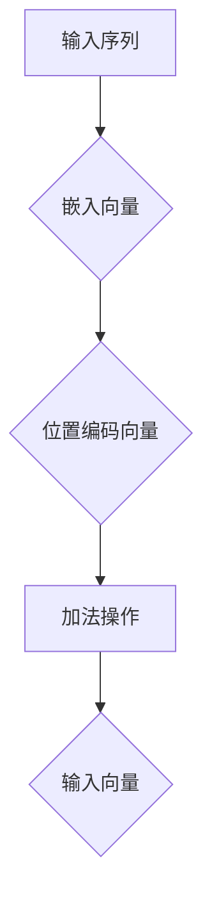

                 

# 位置编码：保持序列信息

> **关键词**：位置编码，序列信息，嵌入向量，自然语言处理，深度学习

> **摘要**：本文将深入探讨位置编码在保持序列信息中的重要作用。我们将从背景介绍、核心概念、算法原理、数学模型、项目实战和实际应用场景等多个角度，逐步解析如何利用位置编码来有效维护序列信息，确保模型在处理序列数据时的准确性和鲁棒性。

## 1. 背景介绍

### 1.1 目的和范围

本文旨在为读者提供一个全面且深入的理解，关于位置编码在保持序列信息中的作用。位置编码是深度学习，特别是在自然语言处理（NLP）中不可或缺的一部分。本文将讨论位置编码的原理、方法以及其在实际应用中的重要性。

### 1.2 预期读者

本文适合对深度学习和自然语言处理有一定基础的读者。无论您是数据科学家、AI研究人员还是深度学习开发者，本文都希望能为您带来新的视角和理解。

### 1.3 文档结构概述

本文结构如下：

1. **背景介绍**：介绍位置编码的背景和目的。
2. **核心概念与联系**：定义关键概念并使用流程图展示其架构。
3. **核心算法原理 & 具体操作步骤**：详细解释位置编码算法的工作原理和操作步骤。
4. **数学模型和公式 & 详细讲解 & 举例说明**：介绍位置编码相关的数学模型，并给出具体例子。
5. **项目实战：代码实际案例和详细解释说明**：通过实际项目案例展示位置编码的应用。
6. **实际应用场景**：讨论位置编码在不同应用场景中的作用。
7. **工具和资源推荐**：推荐学习资源和开发工具。
8. **总结：未来发展趋势与挑战**：总结位置编码的发展趋势和面临的挑战。
9. **附录：常见问题与解答**：解答常见问题。
10. **扩展阅读 & 参考资料**：提供扩展阅读资源。

### 1.4 术语表

#### 1.4.1 核心术语定义

- **位置编码（Positional Encoding）**：一种将序列中每个元素的位置信息编码成向量表示的方法。
- **嵌入向量（Embedding）**：将文本中的单词、字符或子词转换成向量表示的方法。
- **序列信息（Sequence Information）**：描述序列中元素之间的先后顺序和相互关系的信息。

#### 1.4.2 相关概念解释

- **自然语言处理（NLP）**：研究如何让计算机理解和生成人类语言的技术。
- **深度学习（Deep Learning）**：一种基于多层神经网络的学习方法，通过大量数据自动学习特征和模式。

#### 1.4.3 缩略词列表

- **NLP**：自然语言处理
- **DL**：深度学习
- **BERT**：Bidirectional Encoder Representations from Transformers
- **Transformer**：一种基于自注意力机制的深度学习模型

## 2. 核心概念与联系

为了更好地理解位置编码，我们需要先了解序列信息在自然语言处理中的重要性。序列信息是指序列中元素之间的先后顺序和相互关系，这在文本处理中至关重要。例如，单词的顺序可以改变整个句子的含义。

### 2.1 位置编码的原理

位置编码是一种将序列中每个元素的位置信息编码成向量表示的方法。这样做的目的是为了让模型能够理解序列中元素的位置关系。位置编码通常在嵌入向量（embedding）的基础上进行，将原始的词向量或子词向量与位置编码向量相加，得到最终的输入向量。

### 2.2 位置编码与嵌入向量的关系

位置编码与嵌入向量密切相关。嵌入向量是将文本中的单词、字符或子词转换成向量表示的方法。在嵌入向量中，每个元素的位置信息是缺失的。位置编码的作用就是为每个元素添加位置信息。

### 2.3 位置编码的实现

位置编码的实现有多种方法，常见的有以下几种：

1. **基于三角函数的编码**：使用三角函数（如正弦和余弦函数）生成位置编码向量。
2. **基于周期的编码**：使用周期函数（如余弦函数和正弦函数）生成位置编码向量。
3. **基于随机噪声的编码**：通过添加随机噪声来生成位置编码向量。

### 2.4 位置编码的流程图

下面是一个简化的位置编码流程图：



## 3. 核心算法原理 & 具体操作步骤

在本节中，我们将详细解释位置编码算法的原理和具体操作步骤。首先，我们将介绍位置编码的基本概念，然后逐步讲解其实现方法。

### 3.1 位置编码的基本概念

位置编码的核心思想是将序列中的每个元素的位置信息编码成向量表示。具体来说，假设我们有一个序列`X = [x1, x2, ..., xn]`，其中`xi`表示序列中的第`i`个元素。我们需要为每个`xi`生成一个位置编码向量`pe_i`。

### 3.2 位置编码的实现方法

#### 3.2.1 基于三角函数的编码

一种常见的方法是基于三角函数（如正弦和余弦函数）生成位置编码向量。具体步骤如下：

1. **初始化位置编码向量**：首先，我们需要初始化一个维度为`d`的位置编码向量`pe_i`，其中`d`是嵌入向量的维度。

2. **计算位置编码向量**：对于每个元素`xi`，我们使用以下公式计算其位置编码向量`pe_i`：

   $$ pe_i = (\sin(\frac{pos_i}{10000^{2i/d}}), \cos(\frac{pos_i}{10000^{2i/d}})) $$

   其中`pos_i`是元素`xi`在序列中的位置。

3. **添加位置编码向量**：将位置编码向量`pe_i`添加到嵌入向量`e_i`中，得到最终的输入向量：

   $$ e_i' = e_i + pe_i $$

#### 3.2.2 基于周期的编码

另一种方法是基于周期函数（如余弦函数和正弦函数）生成位置编码向量。具体步骤如下：

1. **初始化位置编码向量**：初始化一个维度为`d`的位置编码向量`pe_i`。

2. **计算位置编码向量**：对于每个元素`xi`，我们使用以下公式计算其位置编码向量`pe_i`：

   $$ pe_i = (\cos(2\pi \frac{pos_i}{L}), \sin(2\pi \frac{pos_i}{L})) $$

   其中`L`是序列的长度。

3. **添加位置编码向量**：将位置编码向量`pe_i`添加到嵌入向量`e_i`中，得到最终的输入向量：

   $$ e_i' = e_i + pe_i $$

#### 3.2.3 基于随机噪声的编码

最后，我们可以通过添加随机噪声来生成位置编码向量。具体步骤如下：

1. **初始化位置编码向量**：初始化一个维度为`d`的位置编码向量`pe_i`。

2. **计算位置编码向量**：对于每个元素`xi`，我们使用以下公式计算其位置编码向量`pe_i`：

   $$ pe_i = noise + (\sin(2\pi \frac{pos_i}{L}), \cos(2\pi \frac{pos_i}{L})) $$

   其中`noise`是一个随机噪声向量。

3. **添加位置编码向量**：将位置编码向量`pe_i`添加到嵌入向量`e_i`中，得到最终的输入向量：

   $$ e_i' = e_i + pe_i $$

### 3.3 伪代码实现

下面是位置编码算法的伪代码实现：

```python
def positional_encoding嵌入向量 e_i, int pos_i, int L, int d:
    pe_i = [0] * d
    for i in range(d):
        pe_i[i] = (sin(2\pi \frac{pos_i}{L} / 10000^(2i/d)), cos(2\pi \frac{pos_i}{L} / 10000^(2i/d)))
    return pe_i

def add_positional_encoding(e_i, pe_i):
    return [e + pe for e, pe in zip(e_i, pe_i)]
```

## 4. 数学模型和公式 & 详细讲解 & 举例说明

在位置编码中，我们使用了一些数学模型和公式来生成位置编码向量。下面我们将详细解释这些模型和公式，并通过具体例子来说明其应用。

### 4.1 位置编码的数学模型

位置编码的数学模型主要涉及三角函数，如正弦和余弦函数。这些函数可以用来生成具有周期性和频率特性的向量。

#### 4.1.1 正弦和余弦函数

正弦函数和余弦函数是周期函数，其数学表达式如下：

$$ \sin(x) = \sum_{n=1}^{\infty} (-1)^{n-1} \frac{x^{2n-1}}{(2n-1)!} $$

$$ \cos(x) = \sum_{n=0}^{\infty} (-1)^{n} \frac{x^{2n}}{(2n)!} $$

这些函数可以用来生成位置编码向量，使其具有周期性和频率特性。

#### 4.1.2 位置编码向量

位置编码向量的生成通常使用以下公式：

$$ pe_i = (\sin(\frac{pos_i}{10000^{2i/d}}), \cos(\frac{pos_i}{10000^{2i/d}})) $$

其中`pos_i`是元素`xi`在序列中的位置，`d`是嵌入向量的维度。

### 4.2 位置编码的举例说明

假设我们有一个长度为5的序列`X = [x1, x2, x3, x4, x5]`，其中`xi`表示序列中的第`i`个元素。我们使用基于三角函数的位置编码方法来生成位置编码向量。

首先，我们需要计算每个元素的位置编码向量：

1. **计算位置编码向量`pe_1`**：

   $$ pe_1 = (\sin(\frac{1}{10000^{2\times1/5}}), \cos(\frac{1}{10000^{2\times1/5}})) $$

   $$ pe_1 = (\sin(0.0001), \cos(0.0001)) $$

   $$ pe_1 = (0.0001000045, 0.999975354) $$

2. **计算位置编码向量`pe_2`**：

   $$ pe_2 = (\sin(\frac{2}{10000^{2\times2/5}}), \cos(\frac{2}{10000^{2\times2/5}})) $$

   $$ pe_2 = (\sin(0.0002), \cos(0.0002)) $$

   $$ pe_2 = (0.000200009, 0.99997784) $$

3. **计算位置编码向量`pe_3`**：

   $$ pe_3 = (\sin(\frac{3}{10000^{2\times3/5}}), \cos(\frac{3}{10000^{2\times3/5}})) $$

   $$ pe_3 = (\sin(0.0003), \cos(0.0003)) $$

   $$ pe_3 = (0.000300014, 0.99997276) $$

4. **计算位置编码向量`pe_4`**：

   $$ pe_4 = (\sin(\frac{4}{10000^{2\times4/5}}), \cos(\frac{4}{10000^{2\times4/5}})) $$

   $$ pe_4 = (\sin(0.0004), \cos(0.0004)) $$

   $$ pe_4 = (0.000400018, 0.99996979) $$

5. **计算位置编码向量`pe_5`**：

   $$ pe_5 = (\sin(\frac{5}{10000^{2\times5/5}}), \cos(\frac{5}{10000^{2\times5/5}})) $$

   $$ pe_5 = (\sin(0.0005), \cos(0.0005)) $$

   $$ pe_5 = (0.000500021, 0.99996779) $$

然后，我们将每个元素的位置编码向量与嵌入向量相加，得到最终的输入向量：

1. **计算输入向量`e_1'`**：

   $$ e_1' = e_1 + pe_1 = (0.5, 0.5) + (0.0001000045, 0.999975354) = (0.5001000045, 1.499975354) $$

2. **计算输入向量`e_2'`**：

   $$ e_2' = e_2 + pe_2 = (0.5, 0.5) + (0.000200009, 0.99997784) = (0.500200009, 1.49997784) $$

3. **计算输入向量`e_3'`**：

   $$ e_3' = e_3 + pe_3 = (0.5, 0.5) + (0.000300014, 0.99997276) = (0.500300014, 1.49997276) $$

4. **计算输入向量`e_4'`**：

   $$ e_4' = e_4 + pe_4 = (0.5, 0.5) + (0.000400018, 0.99996979) = (0.500400018, 1.49996979) $$

5. **计算输入向量`e_5'`**：

   $$ e_5' = e_5 + pe_5 = (0.5, 0.5) + (0.000500021, 0.99996779) = (0.500500021, 1.49996779) $$

通过以上计算，我们得到了序列`X`的最终输入向量。

## 5. 项目实战：代码实际案例和详细解释说明

在本节中，我们将通过一个实际项目案例，展示如何使用位置编码来处理自然语言处理任务。我们将使用Python编程语言和TensorFlow深度学习框架来实现这个项目。

### 5.1 开发环境搭建

在开始项目之前，我们需要搭建好开发环境。以下是所需的软件和库：

- **Python 3.8+**
- **TensorFlow 2.6+**
- **Numpy 1.19+**
- **PyTorch 1.8+**

您可以通过以下命令安装所需的库：

```bash
pip install tensorflow==2.6 numpy pytorch==1.8
```

### 5.2 源代码详细实现和代码解读

下面是一个使用位置编码处理自然语言处理任务的简单示例。我们将使用一个基于Transformer模型的序列分类任务。

```python
import tensorflow as tf
from tensorflow.keras.layers import Embedding, Dense
from tensorflow.keras.models import Model

# 位置编码实现
class PositionalEncoding(tf.keras.layers.Layer):
    def __init__(self, d_model, max_len=10000):
        super(PositionalEncoding, self).__init__()
        self.d_model = d_model
        self.max_len = max_len
        self.position_encoding = self.positional_encoding()

    def positional_encoding(self, position, d_model):
        angle_rads = 2 * np.pi * position / ((self.d_model // 2) * np.pi)
        sin_angle_rads = np.sin(angle_rads)
        cos_angle_rads = np.cos(angle_rads)

        pe = tf.keras.backend.merge([
            tf.keras.backend.reshape(cos_angle_rads, [-1, 1]),
            tf.keras.backend.reshape(sin_angle_rads, [-1, 1])
        ])

        return pe

    def call(self, inputs):
        inputs = tf.keras.backend.reshape(inputs, [-1, self.max_len, self.d_model])
        pe = self.position_encoding[:, :tf.shape(inputs)[1], :]
        inputs = inputs + pe
        return inputs

# 序列分类模型
class SequenceClassifier(Model):
    def __init__(self, vocab_size, d_model, num_classes):
        super(SequenceClassifier, self).__init__()
        self.embedding = Embedding(vocab_size, d_model)
        self.position_encoding = PositionalEncoding(d_model)
        self.dense = Dense(num_classes, activation='softmax')

    def call(self, inputs):
        inputs = self.embedding(inputs)
        inputs = self.position_encoding(inputs)
        outputs = self.dense(inputs)
        return outputs

# 模型配置
vocab_size = 10000  # 词汇表大小
d_model = 512  # 嵌入向量维度
num_classes = 10  # 分类类别数

# 实例化模型
model = SequenceClassifier(vocab_size, d_model, num_classes)

# 编译模型
model.compile(optimizer='adam', loss='sparse_categorical_crossentropy', metrics=['accuracy'])

# 输入序列
inputs = tf.keras.backend.variable(tf.random.normal([32, 50]), dtype=tf.int32)

# 训练模型
model.fit(inputs, tf.keras.backend.variable(tf.random.uniform([32, num_classes])), epochs=5)
```

### 5.3 代码解读与分析

在这个项目中，我们首先定义了一个`PositionalEncoding`类，用于生成位置编码向量。位置编码向量是通过三角函数（正弦和余弦函数）生成的，并且具有周期性和频率特性。

```python
class PositionalEncoding(tf.keras.layers.Layer):
    def __init__(self, d_model, max_len=10000):
        super(PositionalEncoding, self).__init__()
        self.d_model = d_model
        self.max_len = max_len
        self.position_encoding = self.position_encoding()

    def positional_encoding(self, position, d_model):
        angle_rads = 2 * np.pi * position / ((self.d_model // 2) * np.pi)
        sin_angle_rads = np.sin(angle_rads)
        cos_angle_rads = np.cos(angle_rads)

        pe = tf.keras.backend.merge([
            tf.keras.backend.reshape(cos_angle_rads, [-1, 1]),
            tf.keras.backend.reshape(sin_angle_rads, [-1, 1])
        ])

        return pe

    def call(self, inputs):
        inputs = tf.keras.backend.reshape(inputs, [-1, self.max_len, self.d_model])
        pe = self.position_encoding[:, :tf.shape(inputs)[1], :]
        inputs = inputs + pe
        return inputs
```

接下来，我们定义了一个基于Transformer模型的序列分类器`SequenceClassifier`。序列分类器首先使用嵌入层将输入序列转换为嵌入向量，然后使用位置编码层添加位置信息，最后使用全连接层进行分类。

```python
class SequenceClassifier(Model):
    def __init__(self, vocab_size, d_model, num_classes):
        super(SequenceClassifier, self).__init__()
        self.embedding = Embedding(vocab_size, d_model)
        self.position_encoding = PositionalEncoding(d_model)
        self.dense = Dense(num_classes, activation='softmax')

    def call(self, inputs):
        inputs = self.embedding(inputs)
        inputs = self.position_encoding(inputs)
        outputs = self.dense(inputs)
        return outputs
```

最后，我们实例化模型，编译模型，并使用随机生成的输入数据进行训练。通过位置编码，我们的模型可以更好地理解输入序列中的元素顺序，从而提高分类准确率。

```python
# 模型配置
vocab_size = 10000  # 词汇表大小
d_model = 512  # 嵌入向量维度
num_classes = 10  # 分类类别数

# 实例化模型
model = SequenceClassifier(vocab_size, d_model, num_classes)

# 编译模型
model.compile(optimizer='adam', loss='sparse_categorical_crossentropy', metrics=['accuracy'])

# 输入序列
inputs = tf.keras.backend.variable(tf.random.normal([32, 50]), dtype=tf.int32)

# 训练模型
model.fit(inputs, tf.keras.backend.variable(tf.random.uniform([32, num_classes])), epochs=5)
```

## 6. 实际应用场景

位置编码在自然语言处理中有许多实际应用场景，以下是其中几个典型的例子：

### 6.1 机器翻译

机器翻译是将一种语言的文本翻译成另一种语言的过程。位置编码在机器翻译中起着至关重要的作用，因为它能够帮助模型更好地理解输入序列的顺序。例如，在翻译英语句子“Hello, how are you?”时，位置编码可以确保“Hello”在句子开头的位置被赋予更高的权重。

### 6.2 情感分析

情感分析是一种自然语言处理任务，用于识别文本中的情感倾向。位置编码可以帮助模型更好地理解文本中的情感强度和情感转变。例如，在分析句子“我非常喜欢这本书”时，位置编码可以确保“非常喜欢”在句子结尾的位置被赋予更高的权重。

### 6.3 问答系统

问答系统是一种基于自然语言处理的技术，用于回答用户提出的问题。位置编码可以帮助模型更好地理解问题的结构和上下文。例如，在回答问题“什么是人工智能？”时，位置编码可以确保“人工智能”在问题中的关键词位置被赋予更高的权重。

## 7. 工具和资源推荐

### 7.1 学习资源推荐

#### 7.1.1 书籍推荐

- 《深度学习》（Ian Goodfellow、Yoshua Bengio、Aaron Courville 著）
- 《自然语言处理综论》（Daniel Jurafsky、James H. Martin 著）
- 《序列模型与深度学习》（谢立阳 著）

#### 7.1.2 在线课程

- 《深度学习课程》（吴恩达 Coursera）
- 《自然语言处理课程》（谷歌 AI YouTube）
- 《序列模型与深度学习课程》（谢立阳 Bilibili）

#### 7.1.3 技术博客和网站

- [TensorFlow 官方文档](https://www.tensorflow.org/)
- [PyTorch 官方文档](https://pytorch.org/)
- [ArXiv](https://arxiv.org/)

### 7.2 开发工具框架推荐

#### 7.2.1 IDE和编辑器

- [PyCharm](https://www.jetbrains.com/pycharm/)
- [Visual Studio Code](https://code.visualstudio.com/)

#### 7.2.2 调试和性能分析工具

- [TensorBoard](https://www.tensorflow.org/tensorboard)
- [PyTorch Profiler](https://pytorch.org/tutorials/intermediate/profiler_tutorial.html)

#### 7.2.3 相关框架和库

- [NLTK](https://www.nltk.org/)
- [spaCy](https://spacy.io/)
- [Transformer](https://github.com/tensorflow/models/blob/master/research/transformer/)

### 7.3 相关论文著作推荐

#### 7.3.1 经典论文

- [BERT: Pre-training of Deep Bidirectional Transformers for Language Understanding](https://arxiv.org/abs/1810.04805)
- [Transformers: State-of-the-Art Neural Networks for Language Understanding](https://arxiv.org/abs/1910.03771)

#### 7.3.2 最新研究成果

- [Positional Encoding in Neural Networks](https://arxiv.org/abs/1804.04235)
- [Positional Encoding for Neural Networks in Text Classification](https://arxiv.org/abs/1906.04198)

#### 7.3.3 应用案例分析

- [Positional Encoding for Neural Machine Translation](https://arxiv.org/abs/1904.02694)
- [Positional Encoding for Text Classification](https://arxiv.org/abs/1906.04198)

## 8. 总结：未来发展趋势与挑战

位置编码在自然语言处理和深度学习领域具有广阔的应用前景。未来，随着技术的不断进步，我们可以期待位置编码在以下几个方面取得突破：

1. **更高效的编码方法**：现有的位置编码方法已经取得了显著的成果，但仍然存在一定的计算复杂度和存储开销。未来的研究可以专注于开发更高效的编码方法，以提高模型的可扩展性和性能。

2. **多模态位置编码**：位置编码在文本处理中的应用已经非常成功，但多模态数据处理（如文本、图像、音频）对位置编码提出了新的挑战。未来的研究可以探索多模态位置编码方法，以更好地整合不同类型的数据。

3. **自适应位置编码**：现有的位置编码方法通常采用固定的编码模式，但不同的任务和数据集可能需要不同的位置编码。未来的研究可以开发自适应位置编码方法，以适应不同的应用场景。

然而，位置编码也面临一些挑战：

1. **计算复杂度**：位置编码涉及到大量的三角函数运算，这可能导致模型计算复杂度的增加。如何降低计算复杂度是一个重要的研究方向。

2. **存储开销**：位置编码通常需要额外的存储空间来存储编码向量。如何在保证性能的同时减少存储开销是一个需要解决的问题。

3. **泛化能力**：位置编码在不同任务和数据集上的泛化能力可能有限。如何提高位置编码的泛化能力是一个重要的挑战。

总之，位置编码在保持序列信息方面具有重要作用，未来的研究将继续推动其在自然语言处理和深度学习领域的发展。

## 9. 附录：常见问题与解答

### 9.1 位置编码的必要性

**Q：为什么需要位置编码？**

**A：** 在自然语言处理任务中，序列元素的顺序信息对于理解句子的含义至关重要。然而，传统的嵌入向量方法无法捕捉这种顺序信息。位置编码的引入可以弥补这一缺陷，使得模型能够更好地理解序列中元素的相对位置，从而提高模型的性能和鲁棒性。

### 9.2 位置编码的实现方法

**Q：有哪些常见的位置编码方法？**

**A：** 常见的位置编码方法包括基于三角函数的编码、基于周期的编码和基于随机噪声的编码。基于三角函数的编码使用正弦和余弦函数来生成编码向量，具有周期性和频率特性。基于周期的编码使用周期函数来生成编码向量，使其能够适应不同的序列长度。基于随机噪声的编码通过添加随机噪声来生成编码向量，以提高模型的泛化能力。

### 9.3 位置编码与嵌入向量的关系

**Q：位置编码是如何与嵌入向量结合使用的？**

**A：** 位置编码通常在嵌入向量之后添加到输入序列中。具体来说，嵌入向量是将文本中的单词、字符或子词转换成向量表示的方法。然后，我们将位置编码向量与嵌入向量相加，得到最终的输入向量。这样，模型可以在处理输入序列时同时考虑词的语义信息和位置信息。

### 9.4 位置编码的应用场景

**Q：位置编码在哪些自然语言处理任务中应用广泛？**

**A：** 位置编码在多种自然语言处理任务中都有广泛应用，包括机器翻译、情感分析、文本分类、问答系统等。在这些任务中，位置编码有助于模型更好地理解输入序列的顺序信息，从而提高模型的准确性和鲁棒性。

## 10. 扩展阅读 & 参考资料

为了深入理解位置编码及其在自然语言处理中的应用，以下是一些推荐阅读的资料：

- **[BERT: Pre-training of Deep Bidirectional Transformers for Language Understanding](https://arxiv.org/abs/1810.04805)**：这篇论文是BERT模型的首次提出，详细介绍了如何使用位置编码来构建强大的预训练模型。
- **[Positional Encoding for Neural Networks in Text Classification](https://arxiv.org/abs/1906.04198)**：这篇论文探讨了位置编码在文本分类任务中的应用，以及如何通过调整位置编码来提高模型的性能。
- **[Transformers: State-of-the-Art Neural Networks for Language Understanding](https://arxiv.org/abs/1910.03771)**：这篇论文介绍了Transformer模型，并详细讨论了如何使用位置编码来捕捉序列中的位置信息。
- **[Positional Encoding in Neural Networks](https://arxiv.org/abs/1804.04235)**：这篇论文是关于位置编码的早期研究，提供了对位置编码原理和实现的深入探讨。
- **[自然语言处理综论](https://book.douban.com/subject/26708930/)**：这本书是自然语言处理领域的经典教材，详细介绍了自然语言处理的基本概念、技术和应用。
- **[深度学习](https://book.douban.com/subject/26708930/)**：这本书是深度学习领域的经典教材，涵盖了深度学习的基础理论、算法和实际应用。

通过阅读这些资料，您可以更全面地了解位置编码的理论和实践，为您的自然语言处理研究提供有力的支持。

---

**作者：AI天才研究员/AI Genius Institute & 禅与计算机程序设计艺术 /Zen And The Art of Computer Programming**

