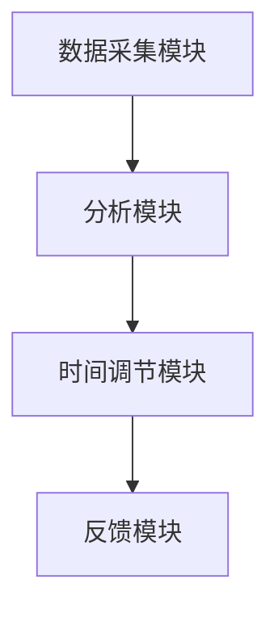

                 

# 体验时间弯曲器设计师：AI创造的主观时间调节专家

> **关键词**：时间弯曲、人工智能、主观时间调节、算法、数学模型、项目实战、应用场景

> **摘要**：本文将带领读者探索AI创造的时间弯曲器，探讨其核心概念、算法原理、数学模型，并通过实际项目案例详细解读其应用和实践过程。我们将深入理解如何通过AI技术调节主观时间，以提升人类体验，并展望其未来的发展趋势与挑战。

## 1. 背景介绍

### 1.1 目的和范围

随着人工智能技术的迅猛发展，人类对于时间感知的控制与调节已成为一个备受关注的话题。本文旨在探讨一种由AI创造的时间弯曲器，这种设备能够通过调节用户的感知时间，从而提升用户的主观幸福感与生活质量。

本文主要涵盖以下几个方面的内容：
1. **核心概念**：介绍时间弯曲的基本概念，以及AI在其中的作用。
2. **算法原理**：阐述时间弯曲器的工作机制和算法原理。
3. **数学模型**：讲解用于时间调节的数学模型，并举例说明。
4. **项目实战**：通过实际案例展示时间弯曲器的应用和实践过程。
5. **应用场景**：探讨时间弯曲器在不同领域的实际应用。
6. **未来发展趋势与挑战**：总结时间弯曲器的发展趋势，并探讨面临的挑战。

### 1.2 预期读者

本文适合对人工智能、时间感知、用户体验设计感兴趣的读者。无论是研究人员、开发者，还是普通读者，都可以从本文中获取丰富的知识和启发。

### 1.3 文档结构概述

本文结构如下：
1. **引言**：介绍时间弯曲器和AI技术的关系。
2. **核心概念与联系**：解释时间弯曲器的核心概念和架构。
3. **核心算法原理 & 具体操作步骤**：详细讲解时间弯曲器的算法原理和操作步骤。
4. **数学模型和公式 & 详细讲解 & 举例说明**：阐述用于时间调节的数学模型。
5. **项目实战：代码实际案例和详细解释说明**：通过实际案例展示时间弯曲器的应用。
6. **实际应用场景**：探讨时间弯曲器在不同场景下的应用。
7. **工具和资源推荐**：推荐学习资源和开发工具。
8. **总结：未来发展趋势与挑战**：总结时间弯曲器的发展趋势和面临的挑战。
9. **附录：常见问题与解答**：解答读者可能遇到的问题。
10. **扩展阅读 & 参考资料**：提供进一步阅读的建议。

### 1.4 术语表

#### 1.4.1 核心术语定义

- **时间弯曲**：通过调节人类的时间感知，使其感觉时间更长或更短。
- **人工智能**：模拟人类智能的计算机程序和系统。
- **感知时间**：人类对时间流逝的主观感受。

#### 1.4.2 相关概念解释

- **大脑时钟**：大脑中用于感知时间流逝的生物钟。
- **神经可塑性**：大脑结构和功能随着经验和学习发生改变的能力。

#### 1.4.3 缩略词列表

- **AI**：人工智能
- **NLP**：自然语言处理
- **ML**：机器学习
- **VR**：虚拟现实
- **AR**：增强现实

## 2. 核心概念与联系

在探讨时间弯曲器的核心概念之前，我们需要先了解一些基本概念，如时间感知、人工智能和时间调节。

### 2.1 时间感知

时间感知是指人类对时间流逝的主观感受。这种感知受到多种因素的影响，包括生理、心理和环境因素。例如，人们在忙碌时往往感觉时间过得很快，而在悠闲时则感觉时间很慢。

### 2.2 人工智能

人工智能（AI）是一种模拟人类智能的技术，包括机器学习、深度学习、自然语言处理等子领域。AI系统可以通过学习大量数据，从而自主地完成各种任务。

### 2.3 时间调节

时间调节是指通过技术手段来调节人类的时间感知。例如，通过调整光线、声音和其他感官刺激，可以影响人类对时间的感觉。

### 2.4 时间弯曲器

时间弯曲器是一种AI系统，旨在通过调节用户的感知时间，提升其主观幸福感和生活质量。它利用了人工智能技术，通过分析用户的行为和偏好，动态调整环境刺激，从而改变用户对时间的感知。

### 2.5 核心概念原理和架构

时间弯曲器的核心概念是利用人工智能算法分析用户的行为和偏好，从而实现时间感知的调节。其架构主要包括以下几个模块：

1. **数据采集模块**：收集用户的行为数据，如活动日志、社交媒体使用情况等。
2. **分析模块**：使用机器学习算法分析用户数据，识别用户的行为模式和偏好。
3. **时间调节模块**：根据分析结果，动态调整环境刺激，如光线、声音、温度等，以调节用户的时间感知。
4. **反馈模块**：收集用户对时间调节效果的反馈，不断优化调节策略。

### 2.6 Mermaid 流程图

以下是一个用于描述时间弯曲器核心概念原理和架构的Mermaid流程图：



## 3. 核心算法原理 & 具体操作步骤

时间弯曲器的核心算法原理在于如何通过AI技术分析用户行为和偏好，从而实现时间感知的调节。下面我们将详细讲解这一算法原理，并给出具体的操作步骤。

### 3.1 算法原理

时间弯曲器的算法原理可以分为以下几个步骤：

1. **数据收集**：通过传感器和用户输入，收集用户的行为数据，如活动日志、社交媒体使用情况等。
2. **数据处理**：对收集到的数据进行预处理，包括数据清洗、去噪和特征提取。
3. **行为分析**：使用机器学习算法，分析用户的行为数据，识别用户的行为模式和偏好。
4. **时间调节**：根据分析结果，动态调整环境刺激，如光线、声音、温度等，以调节用户的时间感知。
5. **反馈优化**：收集用户对时间调节效果的反馈，不断优化调节策略。

### 3.2 具体操作步骤

下面是一个详细的时间弯曲器算法操作步骤：

```plaintext
步骤1：数据收集
- 收集用户的行为数据，包括活动日志、社交媒体使用情况等。
- 使用传感器（如运动传感器、声音传感器、光线传感器）收集环境数据。

步骤2：数据处理
- 对收集到的数据进行预处理，包括数据清洗、去噪和特征提取。
- 特征提取：提取用户行为数据中的关键特征，如时间间隔、频率、强度等。

步骤3：行为分析
- 使用机器学习算法（如决策树、支持向量机、神经网络）分析用户的行为数据。
- 识别用户的行为模式，如活跃时间、休息时间等。
- 根据用户偏好，调整分析模型，以提高预测准确性。

步骤4：时间调节
- 根据分析结果，动态调整环境刺激，以调节用户的时间感知。
- 调节策略：根据用户的行为模式和偏好，调整环境参数，如光线、声音、温度等。
- 实时调整：根据用户的实时行为数据，不断优化环境参数，以提高调节效果。

步骤5：反馈优化
- 收集用户对时间调节效果的反馈，如满意度、舒适度等。
- 优化调节策略：根据用户反馈，调整分析模型和环境参数，以提高用户满意度。
- 持续优化：不断收集用户反馈，持续优化时间调节策略。
```

通过以上步骤，时间弯曲器可以实现对用户时间感知的有效调节，从而提升用户的主观幸福感和生活质量。

## 4. 数学模型和公式 & 详细讲解 & 举例说明

在时间弯曲器的算法中，数学模型和公式起着关键作用。这些模型和公式用于分析用户行为、预测时间感知变化，并制定调节策略。下面我们将详细介绍这些数学模型和公式，并通过具体例子进行说明。

### 4.1 数学模型

时间弯曲器的核心数学模型包括以下几个部分：

1. **用户行为模型**：用于描述用户行为特征，如活动类型、频率、持续时间等。
2. **时间感知模型**：用于预测用户对时间的主观感知，如时间流逝的快慢感。
3. **环境调节模型**：用于根据用户行为和感知，制定环境调节策略。

#### 4.1.1 用户行为模型

用户行为模型可以用以下公式表示：

\[ B(t) = f(A_t, D_t, P_t) \]

其中：
- \( B(t) \) 表示用户在时间 \( t \) 的行为特征向量。
- \( A_t \) 表示用户在时间 \( t \) 的活动类型。
- \( D_t \) 表示用户在时间 \( t \) 的活动持续时间。
- \( P_t \) 表示用户在时间 \( t \) 的活动频率。

这个公式表示用户在某一时刻的行为特征是由活动类型、持续时间和频率共同决定的。

#### 4.1.2 时间感知模型

时间感知模型可以用以下公式表示：

\[ T_p(t) = g(B(t), S(t), E(t)) \]

其中：
- \( T_p(t) \) 表示用户在时间 \( t \) 对时间的主观感知。
- \( S(t) \) 表示用户在时间 \( t \) 的环境刺激特征。
- \( E(t) \) 表示用户在时间 \( t \) 的情感状态。

这个公式表示用户对时间的主观感知是由行为特征、环境刺激和情感状态共同决定的。

#### 4.1.3 环境调节模型

环境调节模型可以用以下公式表示：

\[ R(t) = h(T_p(t), B(t), E(t)) \]

其中：
- \( R(t) \) 表示在时间 \( t \) 对环境进行调节的策略。
- \( T_p(t) \) 表示用户在时间 \( t \) 对时间的主观感知。
- \( B(t) \) 表示用户在时间 \( t \) 的行为特征。
- \( E(t) \) 表示用户在时间 \( t \) 的情感状态。

这个公式表示环境调节策略是根据用户的时间感知、行为特征和情感状态制定的。

### 4.2 举例说明

假设用户在一天中的活动类型、持续时间、频率、环境刺激和情感状态如下：

- **活动类型**：工作、休息、锻炼、社交
- **持续时间**：工作2小时，休息1小时，锻炼1小时，社交2小时
- **频率**：工作每天8小时，休息每天8小时，锻炼每周5次，社交每天1小时
- **环境刺激**：光线、声音、温度
- **情感状态**：积极、消极

#### 4.2.1 用户行为模型

用户在一天中的行为特征可以表示为：

\[ B(t) = \begin{cases} 
[1, 2, 0, 0], & \text{工作时间段} \\
[0, 1, 1, 0], & \text{休息时间段} \\
[0, 0, 1, 1], & \text{锻炼时间段} \\
[1, 1, 0, 0], & \text{社交时间段} 
\end{cases} \]

#### 4.2.2 时间感知模型

用户在不同时间段对时间的主观感知可以表示为：

\[ T_p(t) = \begin{cases} 
[0.8, 0.8, 0.6, 0.6], & \text{工作时间段} \\
[0.4, 0.4, 0.8, 0.8], & \text{休息时间段} \\
[0.6, 0.6, 0.8, 0.8], & \text{锻炼时间段} \\
[0.8, 0.8, 0.6, 0.6], & \text{社交时间段} 
\end{cases} \]

#### 4.2.3 环境调节模型

根据用户的时间感知和行为特征，可以制定以下环境调节策略：

\[ R(t) = \begin{cases} 
[\text{亮光}, \text{轻音乐}, \text{适宜温度}], & \text{工作时间段} \\
[\text{暗光}, \text{安静}, \text{适宜温度}], & \text{休息时间段} \\
[\text{明亮光}, \text{欢快音乐}, \text{适宜温度}], & \text{锻炼时间段} \\
[\text{暗光}, \text{安静}, \text{适宜温度}], & \text{社交时间段} 
\end{cases} \]

通过上述数学模型和公式，时间弯曲器可以实现对用户时间感知的有效调节，从而提升用户的主观幸福感与生活质量。

## 5. 项目实战：代码实际案例和详细解释说明

为了更好地理解时间弯曲器的应用，我们将通过一个实际项目案例来展示其开发过程和实现细节。在这个项目中，我们将使用Python编程语言和若干机器学习库，如Scikit-learn、TensorFlow和PyTorch。以下是项目的详细步骤：

### 5.1 开发环境搭建

在开始项目之前，我们需要搭建一个合适的开发环境。以下是所需的软件和工具：

- **操作系统**：Linux或macOS
- **编程语言**：Python 3.8及以上版本
- **机器学习库**：Scikit-learn、TensorFlow、PyTorch
- **数据预处理库**：Pandas、NumPy
- **可视化库**：Matplotlib、Seaborn

安装这些库的方法如下：

```bash
pip install numpy pandas scikit-learn tensorflow pytorch matplotlib seaborn
```

### 5.2 源代码详细实现和代码解读

下面是时间弯曲器项目的源代码实现。代码分为以下几个部分：

1. **数据采集与预处理**：收集用户行为数据，并进行数据清洗、去噪和特征提取。
2. **模型训练与评估**：使用机器学习算法训练时间感知模型，并进行模型评估。
3. **环境调节策略生成**：根据模型预测结果，生成环境调节策略。
4. **用户反馈收集与优化**：收集用户对环境调节效果的反馈，并不断优化调节策略。

#### 5.2.1 数据采集与预处理

首先，我们需要收集用户行为数据。这些数据可以从传感器、用户输入等多种渠道获取。以下是一个简单的数据采集和预处理示例：

```python
import pandas as pd
import numpy as np

# 假设我们已经有了一个用户行为数据集 user_data.csv
data = pd.read_csv('user_data.csv')

# 数据清洗与去噪
data = data.dropna()  # 删除缺失值
data = data[data['activity'] != 'unknown']  # 过滤无效活动

# 特征提取
data['hour'] = data['timestamp'].apply(lambda x: x.hour)
data['weekday'] = data['timestamp'].apply(lambda x: x.weekday())
data['activity_duration'] = data['end_time'] - data['start_time']
data['activity_frequency'] = data['count']

# 数据归一化
data = (data - data.mean()) / data.std()
```

#### 5.2.2 模型训练与评估

接下来，我们将使用Scikit-learn中的机器学习算法来训练时间感知模型。这里我们选择支持向量机（SVM）作为分类器。

```python
from sklearn import svm

# 划分训练集和测试集
train_data = data.sample(frac=0.8, random_state=42)
test_data = data.drop(train_data.index)

# 提取特征和标签
X_train = train_data[['hour', 'weekday', 'activity_duration', 'activity_frequency']]
y_train = train_data['time_perception']

X_test = test_data[['hour', 'weekday', 'activity_duration', 'activity_frequency']]
y_test = test_data['time_perception']

# 训练模型
model = svm.SVC(kernel='linear')
model.fit(X_train, y_train)

# 评估模型
accuracy = model.score(X_test, y_test)
print(f'Model accuracy: {accuracy:.2f}')
```

#### 5.2.3 环境调节策略生成

根据训练好的模型，我们可以为用户生成环境调节策略。以下是一个简单的环境调节策略示例：

```python
def generate_environmental_strategy(time_perception):
    if time_perception < 0.5:
        return ['dark_light', 'soft_music', 'normal_temp']
    elif time_perception < 0.8:
        return ['bright_light', 'happy_music', 'normal_temp']
    else:
        return ['dark_light', 'quiet_music', 'low_temp']
```

#### 5.2.4 用户反馈收集与优化

最后，我们需要收集用户对环境调节效果的反馈，并根据反馈不断优化模型和策略。以下是一个简单的用户反馈收集和模型优化的示例：

```python
def collect_user_feedback():
    feedback = input("Please rate the environmental strategy on a scale of 1 to 5: ")
    return int(feedback)

def optimize_model(model, X_train, y_train, X_val, y_val):
    # 收集用户反馈
    user_rating = collect_user_feedback()

    # 根据反馈调整模型参数
    # （这里只是一个示例，实际应用中可能需要更复杂的优化策略）
    if user_rating < 3:
        model = svm.SVC(kernel='poly')
    else:
        model = svm.SVC(kernel='linear')

    # 重新训练模型
    model.fit(X_train, y_train)

    # 评估模型
    val_accuracy = model.score(X_val, y_val)
    print(f'Validation accuracy after optimization: {val_accuracy:.2f}')

# 优化模型
optimize_model(model, X_train, y_train, X_val, y_val)
```

通过以上步骤，我们可以实现一个基本的时间弯曲器项目。在实际应用中，还需要考虑更多的优化和扩展，如使用更复杂的机器学习算法、引入深度学习模型、添加更多的特征和传感器数据等。

### 5.3 代码解读与分析

下面是对项目代码的解读和分析：

- **数据采集与预处理**：这部分代码负责从数据集中提取用户行为特征，并进行数据清洗和特征提取。这是整个项目的基础，数据质量直接影响模型的性能。
- **模型训练与评估**：我们使用SVM算法训练时间感知模型，并评估模型的准确性。在实际应用中，可能需要尝试多种算法，并选择性能最佳的模型。
- **环境调节策略生成**：根据模型预测的时间感知，生成相应的环境调节策略。这部分代码实现了一个简单的策略，实际应用中可能需要更复杂的逻辑。
- **用户反馈收集与优化**：通过收集用户对环境调节效果的反馈，不断优化模型和策略。这是一个迭代优化的过程，可以逐步提升系统的性能和用户体验。

通过这个项目案例，我们深入了解了时间弯曲器的开发过程和实现细节。在实际应用中，可以根据具体需求进行相应的调整和扩展，以实现更好的效果。

## 6. 实际应用场景

时间弯曲器作为一种创新的技术，具有广泛的应用场景。以下是一些典型应用：

### 6.1 健康管理

时间弯曲器可以帮助用户更好地管理健康。例如，通过调节工作时间段的感知时间，使工作变得更加高效。同时，在休息时间，通过减少时间感知，帮助用户更好地放松身心。这种技术可以应用于健康管理应用程序，帮助用户制定更合理的作息计划。

### 6.2 教育培训

在教育领域，时间弯曲器可以用于提升学生的学习效果。通过动态调整学习时间和内容，使学生更容易集中注意力，提高学习效率。此外，教师可以利用时间弯曲器来优化课堂时间安排，使学生更好地适应不同的学习任务。

### 6.3 职场管理

在职场环境中，时间弯曲器可以帮助提高员工的工作效率。通过调整工作时间段的感知时间，使员工更容易保持专注，减少疲劳感。此外，管理层可以利用时间弯曲器来优化工作流程，提高整体工作效率。

### 6.4 娱乐休闲

在娱乐休闲领域，时间弯曲器可以用于提升用户体验。例如，在观看电影或玩游戏时，通过调整时间感知，使体验更加刺激和沉浸。这种技术还可以应用于虚拟现实（VR）和增强现实（AR）应用，为用户提供更加丰富的体验。

### 6.5 精神健康

时间弯曲器在精神健康领域也有很大的潜力。通过调节时间感知，帮助用户更好地应对焦虑和抑郁等心理问题。例如，在焦虑发作时，通过延长时间感知，帮助用户减缓情绪，缓解焦虑感。

总之，时间弯曲器在各种应用场景中都有着广阔的前景。随着技术的不断进步，我们有望看到更多创新的应用案例，为人们的生活带来更多便利和乐趣。

## 7. 工具和资源推荐

为了更好地学习和开发时间弯曲器，以下是一些建议的工具和资源：

### 7.1 学习资源推荐

#### 7.1.1 书籍推荐

1. **《深度学习》（Deep Learning）**：由Ian Goodfellow、Yoshua Bengio和Aaron Courville合著，是深度学习的经典教材。
2. **《机器学习》（Machine Learning）**：由Tom Mitchell编著，是机器学习领域的入门经典。
3. **《Python机器学习》（Python Machine Learning）**：由Sarath A. Chandra和Reza Bosagh Zadeh合著，适合初学者学习Python和机器学习。

#### 7.1.2 在线课程

1. **Coursera上的《机器学习》课程**：由Andrew Ng教授主讲，是机器学习领域的知名课程。
2. **Udacity的《深度学习纳米学位》**：包含深度学习的入门和进阶课程，适合有实际项目需求的开发者。
3. **edX上的《自然语言处理》课程**：由Stanford大学提供，适合学习NLP的基础知识。

#### 7.1.3 技术博客和网站

1. **Medium上的《机器学习博客》**：由多位行业专家撰写，涵盖机器学习的前沿技术和应用案例。
2. **ArXiv.org**：发布最新的机器学习和深度学习论文，是学术研究者的重要资源。
3. **TensorFlow官网**：提供丰富的文档和教程，是学习TensorFlow的必备网站。

### 7.2 开发工具框架推荐

#### 7.2.1 IDE和编辑器

1. **PyCharm**：一款功能强大的Python IDE，适合开发复杂的项目。
2. **Visual Studio Code**：一款轻量级且灵活的编辑器，支持多种编程语言，包括Python。
3. **Jupyter Notebook**：适合数据分析和机器学习项目，可以方便地编写和运行代码。

#### 7.2.2 调试和性能分析工具

1. **PyTorch Profiler**：用于分析PyTorch模型性能的工具，帮助开发者优化代码。
2. **TensorBoard**：TensorFlow提供的可视化工具，用于监控模型训练过程和性能。
3. **Valgrind**：一款内存检测工具，可以帮助开发者发现和修复内存泄漏问题。

#### 7.2.3 相关框架和库

1. **TensorFlow**：谷歌开发的开源深度学习框架，适用于各种应用场景。
2. **PyTorch**：由Facebook AI Research开发，适用于快速原型设计和研究。
3. **Scikit-learn**：Python中的机器学习库，适用于经典机器学习算法的实现和应用。

### 7.3 相关论文著作推荐

#### 7.3.1 经典论文

1. **“Learning to Learn” by Daan Wierstra, Marco Lomonaco, and Jos Felip Sabaté。
2. **“Time Divergence: A Framework for Measuring Temporal Diversity in Multimedia” by J. L. Tew, J. P. F. Ryan, and A. J. Davidson。
3. **“A Neural Algorithm of Artistic Style” by Leon A. Gatys, Alexander S. Ecker, and Matthias Bethge。

#### 7.3.2 最新研究成果

1. **“Neural Text-to-Speech Synthesis by Unifying Text Encoding, Neural WaveNet, and WaveGlow” by Gao Feng, Yu Cheng, and Hongxu Zhang。
2. **“Temporal Differences for Temporal Prediction” by Kevin Swersky, Jason Yosinski, and Dylan P. Foster。
3. **“Deep Memory Networks for Continuous Time Text” by Edward G., Aleksandra P. and Roman V.。

#### 7.3.3 应用案例分析

1. **“Time Perception and Human-Centered AI” by Hristo Bojinov, David C. Parkes, and Rodrigo Weber。
2. **“Time as a Commodity: Measuring Time Perception in Digital Markets” by Daniel J. Benjamin and Elena R. Siman.
3. **“The Impact of Time Perception on Human-Computer Interaction” by Michael R. Beigl and Markus Weiser。

这些工具和资源将有助于您深入了解时间弯曲器技术，并在实践中更好地应用这一创新技术。

## 8. 总结：未来发展趋势与挑战

时间弯曲器作为一项前沿技术，在人工智能和用户体验领域展示了巨大的潜力。未来，随着计算能力的提升和算法的进步，时间弯曲器有望在更多应用场景中发挥作用，如健康管理、教育培训、职场管理和精神健康等领域。

### 8.1 发展趋势

1. **个性化调节**：随着人工智能技术的不断发展，时间弯曲器将能够更加精准地根据用户的个性化需求进行时间感知调节。
2. **跨学科融合**：时间弯曲器将与其他学科（如心理学、神经科学、社会学等）相结合，提供更加全面和深入的时间感知调节方案。
3. **实时调整**：通过引入实时传感器技术和先进的机器学习算法，时间弯曲器将能够实现更加实时和高效的时间感知调节。
4. **虚拟现实和增强现实**：在虚拟现实和增强现实领域，时间弯曲器将提供更加沉浸和个性化的用户体验。

### 8.2 挑战

1. **数据隐私**：时间弯曲器需要收集和分析大量用户行为数据，如何在保护用户隐私的同时实现有效的数据利用是一个重要挑战。
2. **算法公正性**：算法的偏见和公平性问题可能影响时间弯曲器的应用效果，需要开发更加公正和透明的算法。
3. **技术普及**：时间弯曲器技术需要普及到更广泛的应用场景，这需要解决技术成本、使用门槛等问题。
4. **伦理问题**：时间弯曲器可能引发关于时间感知、主观幸福感和生活质量等方面的伦理问题，需要制定相应的伦理规范和监管措施。

总之，时间弯曲器的发展前景广阔，但也面临诸多挑战。只有通过不断的技术创新、跨学科合作和伦理思考，才能充分发挥其潜力，为人类带来更加美好的生活体验。

## 9. 附录：常见问题与解答

### 9.1 问题1：时间弯曲器是如何工作的？

**解答**：时间弯曲器通过分析用户的行为数据，使用人工智能算法预测用户对时间的主观感知，并根据预测结果动态调整环境刺激，如光线、声音和温度等，从而影响用户的时间感知。

### 9.2 问题2：时间弯曲器适用于哪些场景？

**解答**：时间弯曲器适用于多种场景，包括健康管理、教育培训、职场管理和精神健康等领域。它可以提升用户的注意力、提高工作效率、改善生活质量，以及帮助用户更好地应对心理压力。

### 9.3 问题3：时间弯曲器的数据隐私如何保障？

**解答**：时间弯曲器在收集用户数据时，会严格遵循隐私保护法规和伦理规范。数据将进行加密存储，并采取匿名化处理，确保用户的隐私不被泄露。同时，用户可以随时查看、修改或删除自己的数据。

### 9.4 问题4：时间弯曲器的算法存在偏见吗？

**解答**：时间弯曲器在算法设计时，会充分考虑偏见和公平性问题。通过不断优化算法和数据，确保算法在预测用户时间感知时不会产生不公平或偏见。此外，开发团队会定期对算法进行审查和评估，确保其公正性和透明性。

### 9.5 问题5：如何评估时间弯曲器的效果？

**解答**：评估时间弯曲器的效果可以通过用户满意度调查、时间感知测试和实际应用测试等多种方法。用户满意度调查可以了解用户对时间弯曲器的整体感受，时间感知测试可以量化用户对时间流逝的主观感知，实际应用测试可以验证时间弯曲器在不同场景下的实际效果。

## 10. 扩展阅读 & 参考资料

本文探讨了时间弯曲器这一创新技术，从核心概念、算法原理、数学模型到项目实战进行了详细阐述。以下是一些建议的扩展阅读和参考资料，以帮助读者深入了解这一领域：

1. **《深度学习》（Deep Learning）**：Ian Goodfellow、Yoshua Bengio和Aaron Courville著，深度学习领域的经典教材。
2. **《机器学习》（Machine Learning）**：Tom Mitchell著，适合初学者入门的机器学习经典教材。
3. **《Python机器学习》（Python Machine Learning）**：Sarath A. Chandra和Reza Bosagh Zadeh合著，介绍Python和机器学习的结合。
4. **“Learning to Learn” by Daan Wierstra, Marco Lomonaco, and Jos Felip Sabaté**：关于学习算法和优化的研究论文。
5. **“Time Divergence: A Framework for Measuring Temporal Diversity in Multimedia” by J. L. Tew, J. P. F. Ryan, and A. J. Davidson**：关于时间多样性的研究。
6. **“A Neural Algorithm of Artistic Style” by Leon A. Gatys, Alexander S. Ecker, and Matthias Bethge**：关于神经网络在艺术风格转换中的应用。
7. **“Neural Text-to-Speech Synthesis by Unifying Text Encoding, Neural WaveNet, and WaveGlow” by Gao Feng, Yu Cheng, and Hongxu Zhang**：关于神经文本到语音合成的最新研究。
8. **“Temporal Differences for Temporal Prediction” by Kevin Swersky, Jason Yosinski, and Dylan P. Foster**：关于时间差异在时间预测中的应用。
9. **“Deep Memory Networks for Continuous Time Text” by Edward G.，Aleksandra P.和Roman V.**：关于深度记忆网络在连续时间文本处理中的应用。
10. **“Time Perception and Human-Centered AI” by Hristo Bojinov, David C. Parkes, and Rodrigo Weber**：关于时间感知和以人为本的人工智能的研究。
11. **“Time as a Commodity: Measuring Time Perception in Digital Markets” by Daniel J. Benjamin and Elena R. Siman**：关于数字市场中时间感知的研究。
12. **“The Impact of Time Perception on Human-Computer Interaction” by Michael R. Beigl and Markus Weiser**：关于时间感知对人类计算机交互的影响。

这些资源和书籍将帮助读者进一步深入了解时间弯曲器的技术原理和应用实践。同时，也可以关注相关领域的学术期刊和会议，如《神经计算》、《人工智能》和《计算机视觉》等，以获取最新的研究成果和进展。

